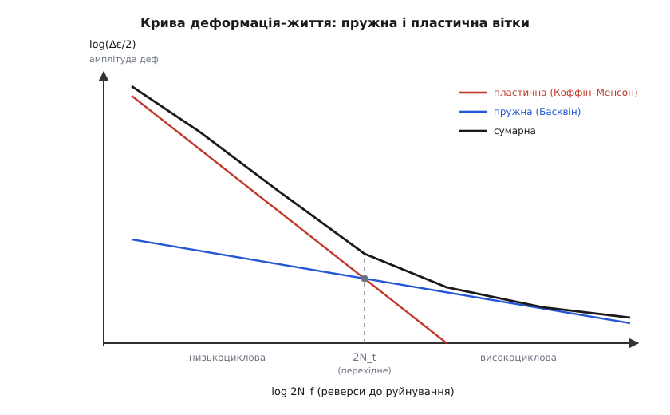
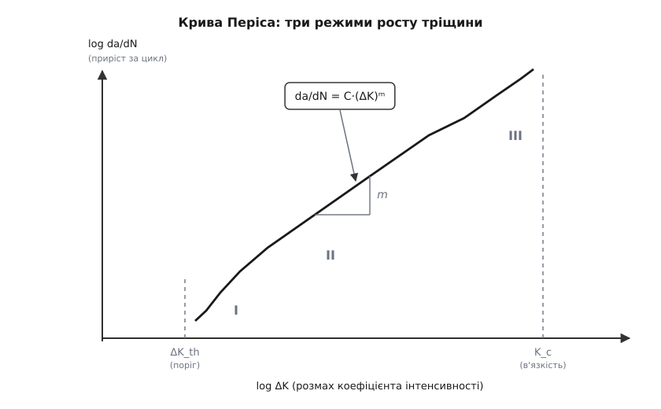

# 🧮 Математика втоми: пік напружень, крива життя і лічба пошкоджень

Уся кількісна теорія втоми відповідає на два питання, і обидва — числові. Перше: **наскільки високо насправді підскакує напруження** в найслабшій цятці деталі, куди прийде тріщина? Друге: **скільки циклів** та цятка ще протримається, перш ніж злам? Перше питання — про **напруження**: як загострення форми роздуває місцевий пік (Інгліс), як для готової тріщини цей пік стає нескінченним і його доводиться міряти інакше (коефіцієнт інтенсивності K), і як швидко тріщина повзе (Періс). Друге — про **життя**: скільки циклів витримає гладкий метал (Басквін для пружних амплітуд, Коффін–Менсон для пластичних) і як скласти шкоду від мішанини різних навантажень (Палмґрен–Майнер).

Крізь усі ці формули проходить один і той самий математичний мотив, і варто помітити його заздалегідь: усюди сидить **показник степеня** — b, c, m, — і саме він робить крихітну зміну навантаження велетенською зміною ресурсу. Крива втоми логарифмічна не випадково; це степенева залежність, а степінь — важіль. Розберімо апарат по черзі, від першопричини кожної формули, а наприкінці побачимо, що всі вони — грані одного важеля.

## Пік напружень: формула Інгліса

Почнімо з питання «наскільки високо». Напруження σ — це сила, поділена на площу, якою вона тече (σ = F/A); поки метал пружний, він розтягується пропорційно до σ.

> Тут скрізь напруження σ — сила на одиницю площі перерізу, а деформація йому пропорційна за законом Гука через модуль пружності E. Це той пружний фундамент, на якому стоїть уся арифметика нижче. [Пружна деформація і закон Гука](root:ph-condensed/elastic-deformation) — звідки береться σ = F/A і чому напруження й видовження ходять у парі.

Середнє напруження по перерізу рахується легко. Але тріщина родиться не в середньому місці, а там, де напруження **місцево** підскочило — на отворі, вирізі, гострому кутику. Наскільки підскочить? Точну відповідь для витягнутого **еліптичного** (гр. *élleipsis* — нестача, бо еліпс «недотягує» до кола) отвору дав англійський інженер Чарлз Інгліс 1913 року, розв'язавши задачу пружності в еліптичних координатах. Результат напрочуд простий:

```
σ_max = σ · (1 + 2·a/b)
```

тут `a` — піврозмір отвору **впоперек** навантаження, `b` — **уздовж** нього, а σ — те саме середнє напруження далеко від отвору. Відношення σ_max/σ називають **коефіцієнтом концентрації** K_t (індекс t — від англ. *theoretical*, бо це теоретичний пружний пік від самої лише геометрії): у скільки разів місцевий пік перевищує середнє. Він безрозмірний — просто множник, що залежить тільки від форми отвору, не від матеріалу.

Звідки тут така форма? Уся суть — у тому, **як гостро загинається край отвору** на своєму вістрі. Уявіть, що край еліпса на кінчику великої півосі згортається дугою певного радіуса — радіуса кривини ρ (лат. *radius* — промінь, спиця). Для еліпса цей радіус на вістрі дорівнює

```
ρ = b² / a
```

Що довший і вужчий отвір (велике a, мале b), то менший ρ — то гостріший кінчик. А переписавши формулу Інгліса через ρ замість b, дістаємо її другий, промовистіший вигляд:

```
a/b = a / √(a·ρ) = √(a/ρ)      →      σ_max = σ · (1 + 2·√(a/ρ))
```

Ось де оголюється механізм. Пік напружень залежить не від того, скільки металу вибрано, а від **відношення глибини отвору до гостроти його кінчика** — a/ρ під коренем. Округлий кінчик (великий ρ) розпускає напруження; гострий (малий ρ) стягує його на себе. Точний множник **2** дала елементарна пружність — його не вгадаєш з розмірностей, його треба вивести, і Інгліс вивів.

**Приклад (як гострота кінчика керує піком).** Візьмімо подряпину глибиною a = 2 мм у розтягнутій пластині. Порівняймо два радіуси її дна: тупіший ρ = 5 мкм і вдвічі гостріший ρ = 0.5 мкм.

```
тупіше дно (ρ = 5 мкм):     K_t = 1 + 2·√(2000 мкм / 5 мкм)   = 1 + 2·√400  = 1 + 2·20   = 41
гостре дно (ρ = 0.5 мкм):   K_t = 1 + 2·√(2000 мкм / 0.5 мкм) = 1 + 2·√4000 = 1 + 2·63.2 = 127
```

Глибина подряпини та сама — 2 мм. Але вдесятеро гостріше дно роздуло напруження втричі більше, до 127-кратного. Ось чому шліфування, що прибирає гострі сліди різця й заокруглює мікродно подряпин, — не косметика, а пряме зниження піка.

А тепер придивіться до формули на межі. Коли отвір стискається в **щілину** — справжню тріщину, — його кінчик стає нескінченно гострим: b → 0, ρ → 0, і

```
σ_max = σ · (1 + 2·√(a/ρ))   →   ∞      (коли ρ → 0)
```

Формула Інгліса каже, що на вістрі будь-якої скільки завгодно малої тріщини напруження **нескінченне**. Це не абсурд і не помилка — це чесний наслідок пружної моделі з ідеально гострим вістрям. Але число «нескінченність» неможливо ні виміряти, ні порівняти: тріщина з ρ = 0 і глибша, і мілкіша дають однакову ∞. Отже, для готової тріщини сам пік напружень — **непридатна міра**. Потрібен інший прилад, і ця нескінченність — підказка, який саме.

## Від нескінченності до K: коефіцієнт інтенсивності напружень

Хитрість, яку 1957 року знайшов американський інженер Джордж Ірвін, — не питати «наскільки високий пік» (він нескінченний і марний), а питати «**наскільки потужне все поле напружень** довкола вістря». Виявляється, поблизу кінчика будь-якої тріщини напруження спадає з відстанню r від вістря за одним і тим самим законом — обернено до √r:

```
σ(r) ≈ K / √(2π·r)
```

Форма цього спаду (сингулярність — лат. *singularis*, одинична особливість — виду 1/√r) однакова для всіх тріщин; різниться лише **множник K перед нею**. Саме він, **коефіцієнт інтенсивності напружень** K, і став справжньою мірою «небезпеки» тріщини — числом, скінченним і вимірним там, де пік σ_max марно тікає в нескінченність. Для тріщини глибиною a під напруженням σ:

```
K = Y · σ · √(π·a)
```

Множник Y — безрозмірна поправка на геометрію (для довгої тріщини в широкій пластині Y ≈ 1, для крайової — близько 1.12). Одиниця K незвична — **МПа·√м**: у ній сидить корінь із довжини, бо саме √a стоїть у формулі. І це той самий корінь, що майнув у Інгліса: близько гострого вістря пік і K — та сама фізика, лише виражена без невимірного ρ. Справді, за гострого кінчика Інглісів пік σ_max ≈ 2σ√(a/ρ), а через K це

```
σ_max ≈ 2·K / √(π·ρ)
```

Тобто K якраз і є те, що лишається від піка, коли викинути невловний радіус ρ, який для справжньої тріщини не поміряти. Інгліс і Ірвін кажуть одне, тільки Ірвінова мова годиться для тріщини.

Звідки взагалі береться √a і чому тріщина «хоче» рости? Це вгледів ще 1920 року англієць Алан Арнолд Ґріффіт, і міркування суто енергетичне. Розкриваючи тріщину, метал **вивільняє** пружну енергію (напружена ділянка обабіч тріщини розслабляється), але **витрачає** енергію на дві нові поверхні розриву. Вивільнене росте як площа розслабленої зони — приблизно як a²; витрачене росте як довжина розриву — як a. Похідні цих доданків по a і дають критичну умову: за певної довжини вивільнення обганяє витрату, і тріщина зривається в самопідтримний ріст. Ірвін пізніше переупакував Ґріффітів енергетичний баланс саме в K і додав для металів роботу пластичної деформації на вістрі (крихке скло рветься майже без неї, в'язка сталь — з великою). Практичний висновок такий: тріщина стрибає в миттєвий долам, коли K доростає до порогової величини матеріалу — **тріщиностійкості** (в'язкості руйнування) K_c:

```
K = K_c      →      миттєве руйнування
```

> Не сплутайте два «K». **K_t** — коефіцієнт концентрації, безрозмірне число (у скільки разів пік вищий за середнє) для отвору чи виріза зі скінченним, тупуватим кінчиком. **K** — коефіцієнт інтенсивності напружень, розмірний (МПа·√м), для готової тріщини з нескінченно гострим вістрям. Перший каже, у скільки разів; другий — наскільки потужне сингулярне поле. Плутають їх часто, бо однакова літера, — але це різні прилади для різних стадій: K_t сторожить зародження тріщини на концентраторі, K правує її ростом і доламом.

## Крива Веллера в числах: закон Басквіна

Тепер друге питання — про життя. Дослід дає криву втоми: амплітуда напруження σ_a проти числа циклів до руйнування N. У логарифмічних осях висока вітка цієї кривої лягає **прямою** — а пряма в подвійному логарифмі означає одне: **степеневий закон**. Це помітив американець Олін Басквін ще 1910 року, і відтоді формула зветься його ім'ям:

```
σ_a · Nᵏ = const           (степенева форма)
σ_a = σ'_f · (2N_f)ᵇ        (сучасна форма)
```

У сучасному записі 2N_f — число **реверсів** (лат. *reversus* — повернутий) до руйнування: у кожному повному циклі навантаження повертається двічі (туди й назад), тож реверсів удвічі більше, ніж циклів. σ'_f — коефіцієнт міцності втоми (напруження, що зламало б за один реверс), а **b — показник міцності втоми** (Басквінів показник), для металів невеликий: від −0.05 до −0.12. Він від'ємний, бо крива спадає: більше циклів — нижча амплітуда.

Оцей маленький показник — і є важіль. Розв'яжімо Басквіна відносно життя:

```
N ∝ σ_a^(1/b)
```

При b ≈ −0.1 показник 1/b ≈ −10. Тобто **життя обернено пропорційне десятому степеню напруження**. Десятий степінь — це страшна чутливість: ледь торкнув амплітуду — і ресурс злетів у рази.

**Приклад (що дає зниження робочого напруження).** Наскільки подовжиться життя, якщо трохи розвантажити деталь? Візьмімо b = −0.1, тобто N ∝ σ⁻¹⁰.

```
знизили σ на 10 %  (σ → 0.90·σ):   N зросте в  0.90⁻¹⁰ = 1.111¹⁰ ≈ 2.9 раза
знизили σ на 20 %  (σ → 0.80·σ):   N зросте в  0.80⁻¹⁰ = 1.25¹⁰  ≈ 9.3 раза
```

Прибрали лишень п'яту частину напруження — а деталь живе майже вдесятеро довше. Ось арифметика за золотим правилом конструктора «трохи потовщи деталь»: невелике зниження σ через степінь −10 обертається кратним виграшем ресурсу. Це найдешевший важіль з усіх.

І та сама формула пояснює, чому в сталей крива зрештою лягає горизонтальною поличкою — **границею витривалості**: нижче певної амплітуди механізм, що засівав тріщини, просто не запускається, степеневий закон уривається й N стає практично нескінченним. У алюмінію такого зриву немає — його пряма Басквіна повзе вниз без кінця, тож для нього завжди є скінченне N.

> 🔧 **Навіщо це.** Показник b — не абстракція: його заміряють для кожного сплаву й підставляють у розрахунок ресурсу. Саме через нього регламент допусків такий чутливий до перевантажень: якщо реальні напруження в експлуатації виявилися на 15 % вищими за проєктні, ресурс падає не на 15 %, а в 1.15¹⁰ ≈ 4 рази. Тому інженери так бояться недооцінити піки навантаження — помилка в напруженні входить у життя у десятому степені.

## Коли метал тече: закон Коффіна–Менсона

Басквін описує **пружну** вітку — багато циклів помірної амплітуди. Але буває навпаки: навантаження таке сильне, що метал у цятці щоцикл **тече пластично**, і руйнування настає за кілька сотень чи тисяч циклів (низькоциклова втома). Тоді керує вже не напруження (воно вперлося в границю плинності й майже не росте), а **розмах пластичної деформації** Δε_p. Незалежно виявили цей закон американці Менсон (1953) і Коффін (1954):

```
Δε_p / 2 = ε'_f · (2N_f)ᶜ
```

ε'_f — коефіцієнт пластичності втоми (близький до деформації руйнування за один розрив), а **c — показник пластичності втоми**, для металів від −0.5 до −0.7 — крутіший за Басквінів b. Чому саме пластична деформація? Бо кожен пластичний цикл незворотно перемелює кристалічну ґратку у вістрі, і рахує руйнування саме накопичена **незворотна** робота, а не пружне гойдання, що повертається без сліду.

Дві вітки — пружна (Басквін) і пластична (Коффін–Менсон) — складаються в єдину **криву деформація–життя**: повний розмах деформації є сумою пружної та пластичної частин:

```
Δε / 2 = (σ'_f / E)·(2N_f)ᵇ  +  ε'_f·(2N_f)ᶜ
          └── пружна (Басквін) ──┘   └─ пластична (Коффін–Менсон) ─┘
```

тут E — модуль пружності (жорсткість матеріалу, коефіцієнт пропорційності σ = E·ε), що переводить пружне напруження в пружну деформацію.

На малих N (велика деформація) домінує крутий пластичний доданок, на великих N — пологий пружний. Точка, де вони рівні, — **перехідне життя** 2N_t: ліворуч від неї метал руйнується «пластикою» (низькоциклова втома), праворуч — «пружністю» (високоциклова).


*Дві прямі, з яких складається життя деталі, у логарифмічних осях. Крута лінія — пластична деформація (Коффін–Менсон), вона задає ресурс за великих амплітуд ліворуч (низькоциклова втома). Полога — пружна деформація (Басквін), вона правує за малих амплітуд праворуч (високоциклова втома). Сумарна крива (згори) йде вздовж пластичної ліворуч і вздовж пружної праворуч; там, де прямі перетинаються, — перехідне життя 2N_t, межа між двома режимами.*

## Швидкість тріщини: закон Періса

Досі йшлося про **зародження** тріщини — скільки циклів гладкий метал протримається, доки вона з'явиться. Але коли тріщина вже є, питання інше: **як швидко вона повзе**? Міру її ходи дає похідна da/dN — приріст глибини тріщини за один цикл.

> da/dN — це похідна довжини тріщини за числом циклів, тобто миттєва швидкість її росту: на скільки метрів подовжується тріщина в перерахунку на один цикл навантаження. [Похідна](root:math-analysis/derivative) — що таке миттєва швидкість зміни величини.

Що жене цей ріст? Та сама сила, що правує вістрям, — розмах коефіцієнта інтенсивності ΔK за цикл (від найменшого до найбільшого навантаження): ΔK = Y·Δσ·√(π·a). 1963 року американець Пол Періс із Фазілом Ердоганом (турецько-американським механіком) звели гори дослідних даних в одну пряму на логарифмічному графіку — і дістали степеневий закон, як колись Басквін для кривої втоми:

```
da/dN = C · (ΔK)ᵐ
```

C і m — сталі матеріалу; **показник Періса m** для металів лежить у межах 2–4. Знову степінь — знову важіль: подвоїш ΔK, і за m = 3 швидкість тріщини зросте у 2³ = 8 разів.

Але прямою закон Періса лишається не всюди — лише на середній вітці. Повна крива має **три режими**:


*Швидкість росту тріщини da/dN проти розмаху ΔK у логарифмічних осях. Ліворуч — режим I: нижче за поріг ΔK_th тріщина стоїть на місці (крива стрімко падає до вертикалі порога). У середині — режим II, пряма Періса da/dN = C·(ΔK)ᵐ з нахилом m: рівномірний, передбачний ріст. Праворуч — режим III: коли K_max наближається до тріщиностійкості K_c, крива стрімко злітає у вертикаль — тріщина розганяється до миттєвого доламу.*

- **Режим I — поріг.** Нижче за порогове значення ΔK_th тріщина взагалі не росте (da/dN → 0). Це втомний аналог границі витривалості: замалий розмах — і тріщина стоїть.
- **Режим II — пряма Періса.** Рівномірний степеневий ріст, що описується формулою вище. Саме він піддається розрахунку.
- **Режим III — долам.** Коли найбільший за цикл K_max підбирається до тріщиностійкості K_c, ріст вибухово прискорюється й переходить у миттєве руйнування (той самий K = K_c).

Найкорисніше в законі Періса те, що його можна **проінтегрувати** й дістати число циклів, за яке тріщина доросте від початкової глибини a₀ до критичної a_c.

> Щоб із швидкості da/dN дістати повне число циклів, її треба зібрати (проінтегрувати) по всіх глибинах тріщини від a₀ до a_c — так само, як зі швидкості авта інтегруванням дістають пройдений шлях. [Інтеграл](root:math-analysis/integral) — як зі швидкості зміни відновити накопичену величину.

Підставивши ΔK = Y·Δσ·√(π·a) і взявши інтеграл (для Y ≈ 1, сталого Δσ і m ≠ 2):

```
N = ∫[a₀→a_c] da / (C·(Δσ·√(π·a))ᵐ)
```

**Приклад (скільки циклів від виявної тріщини до доламу).** Сталь: C = 10⁻¹¹, m = 3 (da/dN у м/цикл, ΔK у МПа·√м), розмах напруження Δσ = 200 МПа, Y ≈ 1. Тріщину виявили за глибини a₀ = 0.5 мм; критична a_c = 50 мм.

```
для m = 3 інтеграл дає:   N = 2·(a₀^(−1/2) − a_c^(−1/2)) / (C·(Δσ·√π)³)

Δσ·√π      = 200·1.7725 = 354.5
(Δσ·√π)³   = 354.5³      = 4.46·10⁷
C·(…)³     = 10⁻¹¹·4.46·10⁷ = 4.46·10⁻⁴

a₀^(−1/2)  = 1/√0.0005 = 44.7        (внесок початкової тріщини)
a_c^(−1/2) = 1/√0.05   =  4.5        (внесок критичної тріщини)

N = 2·(44.7 − 4.5) / 4.46·10⁻⁴ = 2·40.2 / 4.46·10⁻⁴ ≈ 1.8·10⁵ циклів
```

Зверніть увагу на два доданки в дужках: початкова тріщина дала 44.7, а критична — лише 4.5. Тобто майже все життя (близько 90 %) з'їдається, **поки тріщина ще мала**; коли вона вже велика, ΔK великий, швидкість шалена, і решту вона пробігає за лічені відсотки циклів. Кінцевий розмір a_c майже не важить — життя визначає **початковий** розмір a₀. Це не випадковість арифметики, а прямий наслідок того, що ΔK росте з √a: маленька тріщина має маленький ΔK і повзе мляво.

> 🔧 **Навіщо це.** Саме тому чутливість дефектоскопа прямо визначає ресурс. Оскільки життя ≈ обернене до a₀ (у цьому прикладі), виявлятимеш удвічі дрібнішу тріщину — і закладений безпечний ресурс приблизно подвоюється. На цьому стоїть уся стратегія допуску пошкоджень: знаючи закон Періса, призначають огляди так часто, щоб будь-яку тріщину напевно спіймати ще на пологій вітці режиму II, задовго до того, як K_max добіжить до K_c. Період між оглядами — це прямо порахований інтеграл Періса, поділений на запас.

## Складання пошкоджень: правило Палмґрена–Майнера

Досі кожна формула брала **одне** напруження. Але в реальному житті деталь бачить мішанину: тисячі слабких циклів, кілька середніх, поодинокі сильні. Як скласти шкоду? Найпростішу відповідь дали швед Арвід Палмґрен (1924, для підшипників) і американець Мілтон Майнер (1945, узагальнив на втому в авіації Douglas).

Виведімо правило з єдиного припущення — **лінійності пошкодження**. Уявімо, що повне життя деталі за сталого напруження рівня *i* — це N_i циклів, і кожен цикл з'їдає **однакову, незалежну від сусідів** частку цього життя: рівно 1/N_i. Тоді n_i циклів рівня *i* завдають пошкодження n_i/N_i. Уся шкода D — сума часток за всіма рівнями, а деталь вичерпана, коли сума дійде до одиниці:

```
D = Σ (nᵢ / Nᵢ)             руйнування, коли D = 1
```

Уся сила й уся слабкість правила — в одному цьому припущенні: що пошкодження **лінійно накопичується й не залежить від порядку**. Придивімося, де воно тріщить.

**По-перше, порядок насправді важить.** Уяви два однакові набори циклів, подані в різному порядку: спершу сильні, потім слабкі — чи навпаки. Майнер дає їм однакову суму D, але дослід — різні життя. Причина фізична: сильний **перевантажувальний** цикл лишає на вістрі тріщини пластично роздавлену зону, яка потім, розтискаючись, **стискає** тріщину — і наступні слабкі цикли якийсь час її не розкривають (затримка росту). Тож послідовність «сильні→слабкі» часто щадить деталь, а «слабкі→сильні» — ні. Лінійна сума цього ефекту не бачить узагалі.

**По-друге, сума при руйнуванні насправді не рівно 1.** У дослідах критична сума D розкидана — типово від 0.7 до 2.2, у середньому близько одиниці, а за зростальних навантажень падає й нижче. Тому інженерні норми беруть **допустиму суму меншу за одиницю** — часто 0.5, а у зварних сталевих конструкціях і того менше — як запас на цей розкид і на сліпоту до послідовності.

І все ж правило живе, бо в поєднанні з Басквіном воно негайно показує головне — **хто справді нищить деталь**. Згадаймо: N_i ∝ σ_i^(1/b), а 1/b ≈ −10. Отже, у знаменнику n_i/N_i сидить десятий степінь напруження: підняв амплітуду цятки навантаження ледь-ледь — і N_i впав у десятки разів, а частка n_i/N_i підскочила так само. Тому рідкісні сильні цикли важать у сумі стільки ж, скільки тисячі слабких, і вся боротьба за ресурс — це передусім лови нечастих великих піків, а не рахунок дрібного гойдання.

## Один мотив крізь усе: показник степеня

Тепер видно наскрізну нитку. Стаття втоми складається з двох боків — **напруження** (Інгліс дає пік на концентраторі → Ірвінів K міряє поле готової тріщини → Періс жене цю тріщину) і **життя** (Басквін для пружних амплітуд і Коффін–Менсон для пластичних дають число циклів → Майнер складає шкоду від мішанини). Разом це один конвеєр: знайди пік або поле напружень → прочитай по ньому життя → склади пошкодження.

Але глибша єдність — в одній математичній рисі, що повторюється в кожній формулі. Усюди **степінь**: √a у Інгліса й K, показник b у Басквіна, c у Коффіна–Менсона, m у Періса, знову 1/b у Майнеровій сумі. Степінь — це важіль: він робить малу зміну входу великою зміною виходу. Тому крива втоми логарифмічна; тому чверть знятого напруження дає кратний виграш ресурсу; тому вдвічі дрібніша виявна тріщина майже подвоює життя; тому поодинокі перевантаження, а не звичне гойдання, з'їдають деталь. Хто відчув цей єдиний важіль — той розуміє арифметику втоми не як набір розрізнених формул, а як одну відповідь на одне питання: **чому повторення дрібної сили важить у степені, а не в рахунку**.
