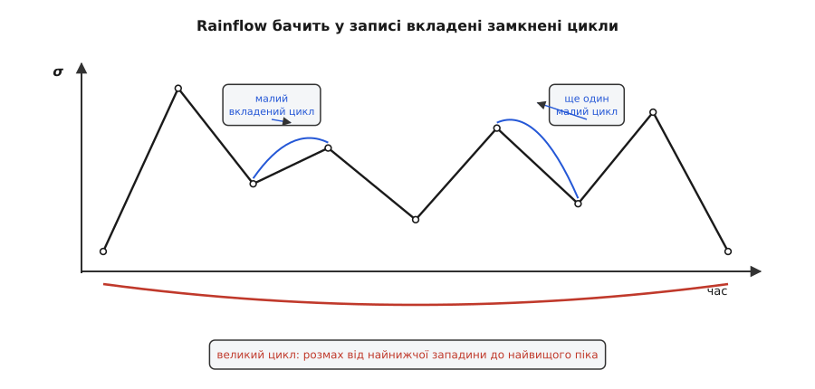
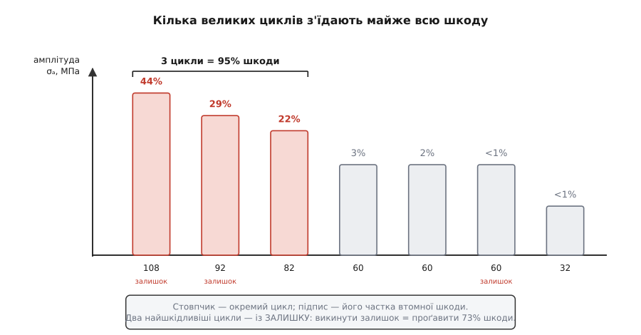

# ⚙️ Ресурс із реального запису навантажень: rainflow і правило Майнера

Правило Майнера обіцяє просту річ: склади частки n/N за всіма циклами — і коли сума дійде до одиниці, деталь вичерпана. Крива втоми обіцяє N для кожної амплітуди. Обидві обіцянки правдиві. Але обидві говорять мовою **чистих, замкнених циклів** — «стільки-то повних розмахів такої-то амплітуди». А тепер уявіть, що вам дали не чисті цикли, а справжній запис: тензодатчик, наклеєний біля кореня променя рами, писав напруження σ(t) впродовж одного польоту, і на екрані — неоковирна крива, де великі розмахи від маневрів переплелися з дрібним тремтінням від гвинтів, і жодного «циклу», на який можна тицьнути пальцем, там не видно.

Ось де зяє провалля між гарною теорією і живим осцилографом. Майнер і крива втоми готові все порахувати — але лише коли їм подати перелік циклів із амплітудами. А в руках — заплутана лінія. Питання, на яке відповідає ця робота, звучить так: **скільки циклів якого розміру ховається в цьому записі, і на скільки таких польотів вистачить променя, доки не проросте втомна тріщина?** Місток через провалля будує алгоритм **rainflow-підрахунку** («метод дощу»), а вже за ним у діло вступають Басквін і Майнер.

Звідки взагалі береться такий рваний запис — здебільшого з вібрації, яку [механічний резонанс](root:ph-waves/mechanical-resonance) розгойдує на оборотній частоті гвинтів, накладаючи тисячі дрібних коливань на повільні хвилі від маневрів; саме ця суміш і робить криву такою неоковирною.

Розкладемо задачу на три ходи. **Перший** — здерти із запису все зайве, лишити самі поворотні точки. **Другий** — rainflow'ом розібрати цей зигзаг на замкнені цикли, кожен зі своєю амплітудою й середнім напруженням. **Третій** — для кожного циклу взяти з кривої втоми його ресурс N, скласти майнерівські частки й перевернути суму на число польотів і годин. Пройдімо всі три з робочим кодом.

Мова тут — Python: rainflow за своєю природою стекова, крок за кроком по масиву, і саме цією мовою логіка стеку читається найясніше, без зайвих церемоній. Наприкінці скажу окремо про швидкодію — де ця ясність коштує продуктивності й що з тим робити.

### Крок 1: лишити самі повороти

Запис із датчика — це десятки тисяч відліків, знятих рівномірно в часі. Але для втоми більшість із них — баласт. Метал відчуває не час і не те, скільки точок ви записали, а **розвороти навантаження**: піднялося напруження до піка, розвернулося вниз до западини, знову вгору. Прямий пробіг між піком і западиною не несе жодної інформації про цикл — хоч виміряй його тисячею точок, хоч десятьма. Тому найперший крок — стиснути запис до **поворотних точок** (реверсів): лишити тільки ті відліки, де нахил кривої змінює знак, і викинути все проміжне.

Правило просте: точка — поворотна, якщо до неї крива йшла в один бік, а після неї пішла в інший. Порівнюємо два послідовні нахили; якщо їхній добуток від'ємний — знаки різні — маємо розворот.

```py
def turning_points(x):
    """Лишити самі реверси: точки, де нахил кривої змінює знак."""
    if len(x) < 3:
        return list(x)
    tp = [x[0]]                       # перший відлік завжди лишаємо
    for i in range(1, len(x) - 1):
        d1 = x[i] - tp[-1]            # нахил ДО точки
        d2 = x[i + 1] - x[i]          # нахил ПІСЛЯ точки
        if d1 == 0:                   # плато — точка не поворотна
            continue
        if d1 * d2 < 0:               # знаки нахилів різні → розворот
            tp.append(x[i])
    tp.append(x[-1])                  # останній відлік теж лишаємо
    return tp
```

Цей крок не просто економить пам'ять — він **обов'язковий** для коректності rainflow. Алгоритм працює саме на послідовності реверсів; якщо згодувати йому сирі відліки з довгими прямими пробігами, він або марнуватиме роботу, або взагалі порахує неправильно. Тож стиснення до поворотів — не оптимізація, а частина постановки.

### Крок 2: метод дощу розбирає зигзаг на цикли

Тепер найцікавіше. Маємо послідовність піків і западин — суцільний зигзаг. Треба сказати, які пари «вниз-угору» утворюють **замкнені цикли**. І тут криється тонкість, через яку наївний підрахунок «пік-до-западини» дає нісенітницю: у реальному записі малі цикли **сидять усередині** великих. Маневр повільно роздув напруження від западини до далекого піка, а дорогою на цю велику хвилю налягло дрібне тремтіння. Дрібне тремтіння — це справжні маленькі замкнені цикли; велика хвиля — це один великий цикл, який ті дрібні в собі вміщує. Порахувати треба **і те, і те**, кожне окремо.

Спосіб, який це робить правильно, придумали 1968 року двоє японських дослідників — **Тацуо Ендо (Tatsuo Endo) і М. Мацуїсі (M. Matsuishi**, тоді ще студент-магістрант**)** з Кюсюського технологічного інституту. Вони помітили, що коли повернути графік напруження на 90° так, щоб час ішов **униз**, зигзаг стає схожим на багатоярусний дах японської пагоди, а хід циклів можна простежити, уявивши, як по цих дахах збігає **дощ**: крапля стікає по схилу, зривається з краю, падає на нижчий схил і біжить далі, доки не зустріне потік згори або точку, крутішу за ту, звідки почала. Кожен такий струмінь окреслює половину циклу, а зустрічні струмені замикають цикл повністю. Звідси й назва — rainflow, «дощопотік». (Уперше англійською автори доповіли метод 1974-го, після чого його перевірили й ввели в широкий ужиток у США Дж. Морроу і Н. Даулінг.)

Образ дощу дає інтуїцію, а сам алгоритм найчистіше формулюється **чотириточковим правилом**. Ідея його така: беремо чотири послідовні поворотні точки й дивимося на три розмахи, що вони утворюють. Якщо **внутрішній** розмах (між двома середніми точками) виявився не більшим за обидва сусідні — той внутрішній розмах є замкненим циклом, який ті сусідні розмахи «затискають» з боків. Ми його виймаємо, дві середні точки викидаємо, а крайні змикаються — і перевіряємо далі, бо змикання могло відкрити новий замкнений цикл ярусом вище.


*Вкладена структура, яку розплутує rainflow. Велика хвиля від найнижчої западини до найвищого піка — це один великий цикл (дуга внизу). На неї налягли дрібні коливання — кожне є справжнім маленьким замкненим циклом (дуги вгорі). Алгоритм віддає кожен цикл окремою парою чисел: амплітудою (пів-розмаху) і середнім напруженням.*

Ось усе ядро — стек, куди підкладаємо реверси, і внутрішня петля, що замикає цикли, щойно вони дозріли:

```py
def rainflow(reversals):
    """Чотириточковий rainflow. Повертає (замкнені_цикли, залишок).
    Кожен замкнений цикл — (амплітуда, середнє). Залишок — те, що не замкнулось."""
    stack = []
    cycles = []
    for p in reversals:
        stack.append(p)
        while len(stack) >= 4:
            a, b, c, d = stack[-4], stack[-3], stack[-2], stack[-1]
            inner   = abs(c - b)      # внутрішній розмах (між середніми точками)
            left    = abs(b - a)      # розмах ліворуч
            right   = abs(d - c)      # розмах праворуч
            if inner <= left and inner <= right:
                amp  = inner / 2.0
                mean = (b + c) / 2.0
                cycles.append((amp, mean))
                del stack[-3:-1]      # вийняти дві внутрішні точки (b, c)
                # крайні a і d зімкнулись — петля крутиться далі
            else:
                break                 # цикл ще не дозрів, чекаємо наступний реверс
    return cycles, stack              # у стеку лишився ЗАЛИШОК (residue)
```

Варто переконатися, що воно й справді ловить вкладеність. Візьмімо навмисне простий зигзаг: `0 → 10 → 2 → 8 → 0` — великий розмах від 0 до 10 з одним дрібним циклом (2↔8) усередині.

```py
rev = turning_points([0, 10, 2, 8, 0])
cycles, residue = rainflow(rev)
print("замкнені:", cycles)     # [(3.0, 5.0)]  — малий цикл: амплітуда 3, середнє 5
print("залишок:", residue)     # [0, 10, 0]    — великий розмах лишився в залишку
```

Саме так і треба: маленький цикл 2↔8 (амплітуда (8−2)/2 = 3, середнє 5) виловлено як замкнений, а великий розмах 0↔10 осів у залишку — бо він так і не «затиснувся» більшим циклом ізсередини запису. Ця дрібниця — що **найбільший розмах опиняється в залишку** — зараз відгукнеться дуже гучно.

### Крок 3: від циклів до ресурсу — Басквін і Майнер

Тепер у нас перелік замкнених циклів, кожен зі своєю амплітудою. Лишилося дізнатися, скільки коштує кожен, і скласти рахунок. Ціну задає **крива втоми**, а її найзручніша форма — закон Басквіна (O. H. Basquin, 1910): у подвійному логарифмічному масштабі крива втоми лягає **прямою лінією**. А пряму цілком задають дві точки. Отже, якщо з довідника відомі дві точки кривої — скажімо, «за амплітуди σ₁ метал витримує N₁ циклів» і «за σ₂ — N₂», — то ресурс за будь-якої амплітуди виводиться степеневим законом:

```
N(σ) = N₁ · (σ₁ / σ)^k          де   k = ln(N₂/N₁) / ln(σ₁/σ₂)
```

Показник `k` — це нахил прямої в лог-лог осях (він же −1/b, де b — власне показник Басквіна). Для нашого прикладу візьмемо алюмінієвий сплав 6061-T6 (границя міцності σ_u ≈ 310 МПа) з двома точками кривої: (250 МПа, 10³ циклів) і (90 МПа, 10⁶). Звідси k ≈ 6.76.

```py
import math

class SNCurve:
    """Крива втоми за законом Басквіна, задана двома точками (лог-лог пряма)."""
    def __init__(self, s1, n1, s2, n2, ult):
        self.s1, self.n1 = s1, n1
        self.k   = math.log(n2 / n1) / math.log(s1 / s2)   # нахил прямої
        self.ult = ult                                     # границя міцності σ_u

    def cycles_to_failure(self, amp):
        return self.n1 * (self.s1 / amp) ** self.k

    def goodman_equiv(self, amp, mean):
        """Звести цикл із розтяжним середнім до рівносильної амплітуди при R=−1."""
        if mean <= 0:                       # стискальне середнє — не караємо (консервативно)
            return amp
        return amp / (1.0 - mean / self.ult)   # пряма Ґудмана
```

Тут я вже вставив другий, критично важливий шматок — **корекцію Ґудмана**, і за мить поясню, навіщо вона. А поки — правило Майнера. Кожен цикл з'їдає частку ресурсу n/N; складаємо частки за всіма циклами блоку (один блок = один політ), і сума D — це шкода за політ. Число польотів до руйнування — обернене до неї.

Один клопіт лишився з Кроку 2 — **залишок**. Ті реверси, що не замкнулись у повні цикли, — це не сміття: кожна їхня ланка є **половиною циклу**. Найпростіше й найчастіше рішення — порахувати кожну як пів-циклу (n = 0.5). Ось повний збір шкоди:

```py
def block_damage(reversals, sn):
    closed, residue = rainflow(reversals)
    damage = 0.0
    # повні замкнені цикли
    for amp, mean in closed:
        sar = sn.goodman_equiv(amp, mean)
        damage += 1.0 / sn.cycles_to_failure(sar)
    # залишок: кожна ланка — пів-циклу
    for i in range(len(residue) - 1):
        amp  = abs(residue[i + 1] - residue[i]) / 2.0
        mean = (residue[i + 1] + residue[i]) / 2.0
        sar  = sn.goodman_equiv(amp, mean)
        damage += 0.5 / sn.cycles_to_failure(sar)
    return damage
```

Тепер зберімо все докупи на конкретному записі. Хай тензодатчик за один політ дав таку послідовність поворотних точок напруження (МПа):

**Умова.** Запис (уже стиснутий до реверсів): `25, 190, 70, 225, 95, 160, 60, 240, 85, 205, 55, 175`. Крива втоми — 6061-T6 з двома точками (250 МПа, 10³) і (90 МПа, 10⁶), σ_u = 310 МПа. Один політ триває 12 хвилин. Скільки польотів і годин до втомної тріщини?

```py
sn = SNCurve(s1=250, n1=1e3, s2=90, n2=1e6, ult=310)
history = [25, 190, 70, 225, 95, 160, 60, 240, 85, 205, 55, 175]

rev = turning_points(history)
closed, residue = rainflow(rev)
D = block_damage(rev, sn)

print("замкнені цикли (амп, серед):")
for amp, mean in closed:
    print(f"   {amp:5.1f}  {mean:5.1f}")
print("залишок:", residue)
print(f"шкода за політ D = {D:.3e}")
print(f"польотів до руйнування = {1/D:,.0f}")
print(f"годин до руйнування    = {1/D * 12/60:,.0f}")
```

Що друкує цей прогін:

```
замкнені цикли (амп, серед):
    60.0  130.0
    32.5  127.5
    82.5  142.5
    60.0  145.0
залишок: [25, 240, 55, 175]
шкода за політ D = 1.631e-04
польотів до руйнування = 6,131
годин до руйнування    = 1,226
```

Отже, цей промінь набере фатальну втому приблизно за **6100 польотів**, тобто десь **1200 льотних годин**. Але справжня цінність — не в самому числі, а в тому, що видно всередині суми. Придивімося, хто саме з'їв ресурс:


*Внесок кожного циклу у втомну шкоду. Кожен стовпчик — окремий цикл, підпис над ним — його частка загальної шкоди. Три найбільші за амплітудою цикли забирають 95% усього ресурсу; найдрібніший (амплітуда 32.5 МПа) — майже нуль. І два з трьох найшкідливіших сидять у ЗАЛИШКУ: якби залишок відкинули, з розрахунку зникли б 73% шкоди.*

Розклад по циклах виходить такий (амплітуда → рівносильна за Ґудманом σ_ar → ресурс N → внесок у шкоду):

```
амп 107.5  серед 132.5  (залишок, пів)  σ_ar=187.7  N=6.9·10³   44.2%
амп  92.5  серед 147.5  (залишок, пів)  σ_ar=176.5  N=1.1·10⁴   29.1%
амп  82.5  серед 142.5  (повний)        σ_ar=152.7  N=2.8·10⁴   21.9%
амп  60.0  серед 145.0  (повний)        σ_ar=112.7  N=2.2·10⁵    2.8%
амп  60.0  серед 130.0  (повний)        σ_ar=103.3  N=3.9·10⁵    1.6%
амп  60.0  серед 115.0  (залишок, пів)  σ_ar= 95.4  N=6.8·10⁵    0.5%
амп  32.5  серед 127.5  (повний)        σ_ar= 55.2  N=2.7·10⁷    ~0%
```

Дві речі кидаються в очі. Перша: **кілька великих циклів правлять усім**. Найбільший цикл (амплітуда 107.5) один завдає 44% шкоди, а три найбільші разом — 95%; найдрібніший, попри те, що він теж справжній цикл, важить майже нуль. Це прямий наслідок крутизни закону Басквіна: ресурс падає як σ^−6.76, тож підняли амплітуду вдвічі — і N упав у 2^6.76 ≈ 108 разів. Ось чому в утомі полюють передусім на рідкі великі перевантаження, а не на численне дрібне тремтіння.

І друга, гостріша: **два з трьох головних убивць — у залишку**. Найбільший розмах запису (велика хвиля 25→240→…) так і не замкнувся в повний цикл усередині одного польоту — і осів у залишку, рівно як у нашій перевірці з `0→10→0`. Спокуса відкинути залишок як «недороблені хвости» коштувала б тут 73% усієї шкоди — і розрахунок збрехав би, що промінь житиме вчетверо довше. Звідси головна пастка методу, до якої ми й переходимо.

### Складність і пастки

**Пастка перша — залишок (residue): у ньому ховаються найбільші цикли.** Ми щойно бачили ціну недбальства. Наївне «порахую замкнені, а хвости викину» тут завищує ресурс у чотири рази — а це вже не консервативна помилка, а небезпечна. Правильних варіантів два, залежно від того, що це за запис. Якщо запис **одноразовий** (унікальна історія, що більше не повториться) — кожну ланку залишку рахують як пів-циклу, як ми й зробили. Якщо ж блок **повторюваний** (кожен політ схожий на попередній), то залишок одного блоку змикається із залишком наступного, ідентичного, — і половинки складаються в **повні** цикли. Стандартний прийом для цього (ASTM E1049) — приписати залишок сам до себе й прогнати rainflow ще раз: тоді велика хвиля 25→240→55 замкнеться повністю. Ось що дають три способи на наших даних:

```
залишок відкинуто      D = 4.3·10⁻⁵   →  23 400 польотів   (небезпечно завищено)
залишок як пів-цикли    D = 1.6·10⁻⁴   →   6 100 польотів   (одноразовий запис)
залишок замкнено повністю D = 2.8·10⁻⁴  →   3 500 польотів   (повторюваний блок)
```

Для дрона, що літає схожі місії щодня, чесна відповідь — саме нижня: **близько 3500 польотів**, бо великий цикл кожної місії таки замикається наступною. Відкинути залишок означало б помилитися всемеро.

**Пастка друга — середнє напруження (корекція Ґудмана).** Крива втоми з довідника майже завжди знята за **симетричного** циклу — розтяг-стиск навколо нуля (R = −1). Але rainflow віддає цикли з їхнім реальним **середнім**, і в нашому записі всі середні глибоко в розтягу — 130–147 МПа. А розтяжне середнє тягне тріщину розкриватися й **різко скорочує** ресурс проти симетричного циклу тієї самої амплітуди. Ігнорувати його — груба й небезпечна помилка. Ось її ціна: якщо в тому самому розрахунку прибрати корекцію Ґудмана й брати ресурс просто за амплітудою, вийде D = 3·10⁻⁶ і аж **335 000 польотів** — завищення в 55 разів проти чесних 6100. Пряма Ґудмана (John Goodman, 1899) зводить цикл із розтяжним середнім до рівносильного симетричного:

```
σ_ar = σ_a / (1 − σ_m / σ_u)
```

тут σ_ar — та амплітуда симетричного циклу, що шкодить однаково; σ_m — середнє, σ_u — границя міцності. Що ближче середнє до σ_u, то більший знаменник з'їдає — і тим сильніше «підростає» ефективна амплітуда. Саме тому найбільший цикл із амплітудою 107.5 і середнім 132.5 діє як симетричний цикл із амплітудою 188 — і горить за 6900 циклів замість сотень тисяч. Стискальне середнє (σ_m < 0), навпаки, злегка **подовжує** життя; Ґудман консервативно не дає за нього знижки — просто беремо амплітуду як є. Пряма Ґудмана — найконсервативніша з ходових; є ще парабола Ґербера (менш сувора) і лінія Содерберга (ще суворіша, від границі плинності), а сам трикутник «амплітуда-середнє» точніше зветься діаграмою Гейга (B. P. Haigh, 1917) — але для оцінки ресурсу Ґудман лишається робочим стандартом.

> 🔧 **Навіщо це.** Пропустити корекцію за середнім — класична причина, чому розрахунок обіцяє «вічний» ресурс, а деталь тріщить за рік. У дрона це особливо підступно: промінь рами вже несе **статичний розтяг** від ваги мотора на кінці важеля, і на цю постійну складову накладається вібрація. Rainflow чесно віддасть високе середнє, а Ґудман переведе його в скорочений ресурс — але тільки якщо ви не забули цей крок. Забули — і ваша «безпечна» рама насправді за межею.

**Пастка третя — дискретизація амплітуд.** Коли циклів багато (реальний запис дає їх тисячі), їх групують у **комірки** за амплітудою — гістограму, щоб не тягати кожен окремо. І тут криється підступ, знову через крутизну Басквіна. Ресурс залежить від амплітуди в ~7-й степені, тож **невеличка** похибка в амплітуді верхньої комірки дає **велику** похибку в N. Порахуймо для нашого найбільшого циклу, що станеться, якщо амплітуду оцінити на ±10%:

```
амплітуда ×0.9  →  σ_ar=169  →  N=1.4·10⁴
амплітуда ×1.0  →  σ_ar=188  →  N=6.9·10³
амплітуда ×1.1  →  σ_ar=207  →  N=3.6·10³
```

Десять відсотків туди-сюди в амплітуді — і ресурс стрибає майже вдвічі в кожен бік (бо N ∝ σ⁻⁶·⁷⁶). Тому комірки не роблять рівномірно грубими: **хвіст великих амплітуд дискретизують дрібно**, а дрібні цикли, що однаково важать копійки, можна грубо злити в одну купу. І якщо вже округляти, то амплітуду комірки беруть по **верхній** межі — консервативно, у бік меншого ресурсу.

**Дрібніші, але живі граблі.** Саме правило Майнера лінійне й не знає порядку циклів — а насправді порядок трохи важить (велике перевантаження гальмує ріст наступних тріщин), і сума D у момент реального руйнування рідко рівно 1: буває від 0.3 до кількох. Тому відповідальні розрахунки закладають запас — цільове D беруть меншим за одиницю. Ще одна пастка — **короткий запис**: якщо міряли одну спокійну місію, найрідші великі події (жорстка посадка, шквал) у вибірку могли й не потрапити, а вони й правлять ресурсом; спектр навантажень треба збирати достатньо довго, щоб рідкі важкі цикли встигли проявитися.

**І про швидкодію.** Rainflow за самою природою **послідовний** — стек залежить від порядку точок, тож серце алгоритму не векторизується; але воно й лінійне, один прохід O(n), тож навіть чистим Python'ом запис у 10⁵–10⁶ точок обробляється миттєво. Що варто зробити швидким — це обрамлення: виділення поворотних точок і фінальний збір шкоди легко переписати на numpy-масивах, а якщо треба ганяти мільйони довгих записів у циклі оптимізації, беруть готову компільовану реалізацію (пакет `rainflow`, а всередині — C або Cython). Але для оцінки ресурсу однієї деталі наведений код — робочий як є, від першого рядка до останнього числа.

Отак три ходи змикаються в один ланцюг: поворотні точки чистять запис, rainflow розплітає його на замкнені цикли з амплітудою й середнім, а Басквін із Майнером через корекцію Ґудмана перетворюють цей перелік на число польотів до тріщини. І кожна з трьох пасток — відкинутий залишок, забуте середнє, груба верхня комірка — не дрібниця стилю, а спосіб отримати ресурс, завищений у рази, і випустити в повітря деталь, що насправді вже за межею.
