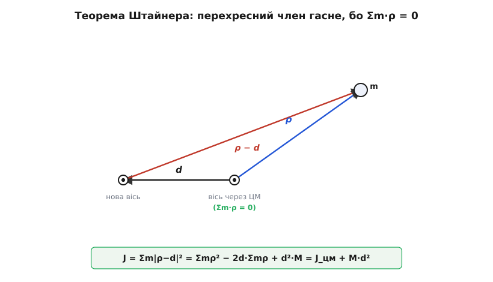
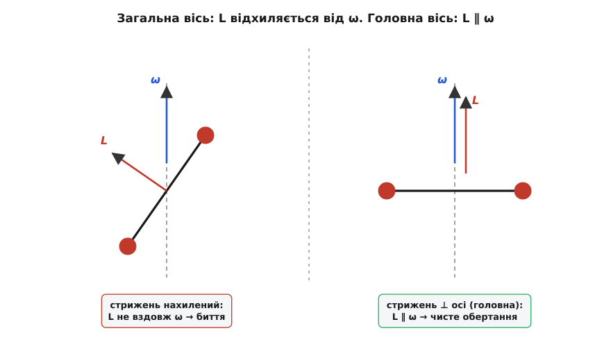
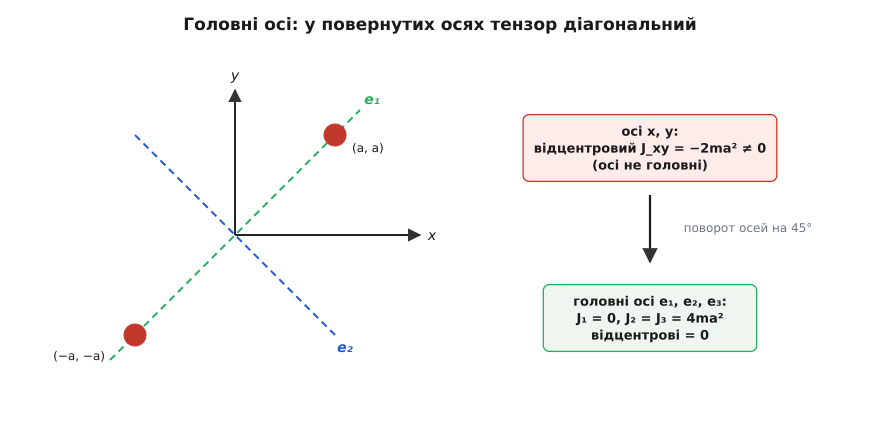
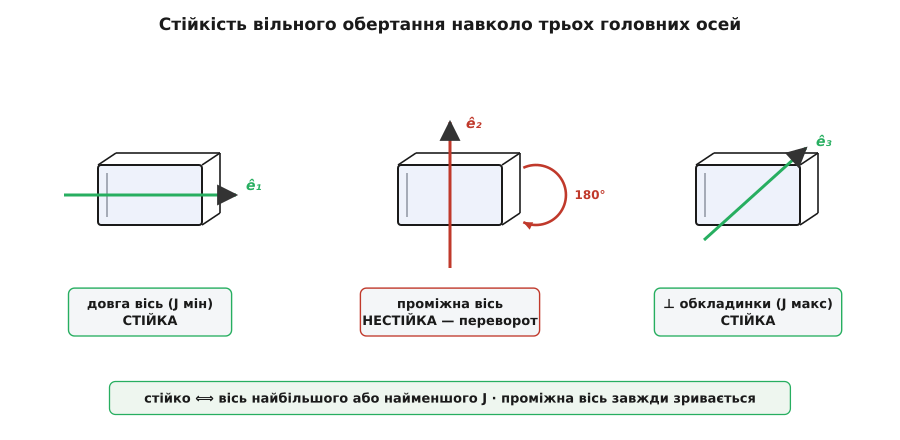

# 🧮 Тензор інерції: коли «обертальна маса» перестає бути числом

Опір розкручуванню зручно тримати в одному числі J — але це число живе лише доти, доки вісь обертання зафіксована. Досить дозволити тілу вільно перекидатися в просторі, і виявляється, що весь розподіл маси навколо всіх можливих осей одразу описує не число, а таблиця з дев'яти — **тензор інерції**. З нього момент інерції для будь-якої окремої осі випадає як частковий випадок, а натомість проступає те, чого скаляр показати не міг: чому вільно кинуте тіло хитається, чому автомобільне колесо доводиться балансувати грузиками і чому підкинутий телефон, крутнутий «плазом», раптом перевертається сам. Зберемо весь апарат з нуля — від чесного інтеграла до головних осей.

### Означення строго: два незалежні шляхи до Σm·r²

Візьмімо тіло, що обертається навколо закріпленої осі з кутовою швидкістю ω. Подрібнімо його на маленькі шматочки масою mᵢ, кожен на своїй перпендикулярній відстані rᵢ від осі. Точка біжить по колу зі швидкістю vᵢ = ω·rᵢ — це прямий наслідок [означення кутової швидкості](root:ph-mechanics/angular-velocity), де швидкість точки дорівнює кутовій швидкості на плече. Складімо [кінетичну енергію](root:ph-mechanics/kinetic-energy) всіх шматочків:

```
E = Σ ½ mᵢ vᵢ² = Σ ½ mᵢ (ω rᵢ)² = ½ (Σ mᵢ rᵢ²) ω²
```

ω однакова для всього тіла (тверде тіло — усі точки крутяться в один такт), тож вона винеслася за суму. А те, що лишилося всередині дужок, — властивість самого розподілу маси, не руху:

```
J ≡ Σ mᵢ rᵢ²        →        E = ½ J ω²
```

Тепер зайдімо з іншого боку — від [моменту імпульсу](root:ph-mechanics/angular-momentum), обертального аналога імпульсу m·v. Кожен шматочок несе відносно осі момент імпульсу mᵢ·vᵢ·rᵢ (імпульс на плече). Складімо:

```
L = Σ mᵢ vᵢ rᵢ = Σ mᵢ (ω rᵢ) rᵢ = (Σ mᵢ rᵢ²) ω = J ω
```

І тут виринула та сама сума Σmᵢrᵢ². Два різні питання — «скільки в тілі енергії обертання?» і «скільки в ньому моменту імпульсу?» — привели до однієї й тієї ж комбінації маси й квадрата відстані. Це не збіг, а знак того, що Σmᵢrᵢ² — правильний, єдиний вимір «обертальної маси» тіла навколо даної осі. Реальне тіло — не жменя точок, а суцільна речовина; подрібнімо його на нескінченно малі елементи маси dm, і сума стане інтегралом по всій масі:

```
J = ∫ r² dm
```

r тут — завжди перпендикулярна відстань елемента dm до осі, і вона входить у квадраті. Три такі інтеграли варто взяти руками раз у житті — бо з них випадають ті самі множники ½, 2/5, 1/12, що потім усе життя беруть готовими з таблиці.

### Стрижень, диск, куля: звідки беруться множники

**Стрижень, вісь через середину.** Тонкий однорідний стрижень довжини L і маси M. Погонна густина λ = M/L. Вісь — поперек стрижня, через центр. Елемент на відстані x від центра має dm = λ·dx, а його перпендикулярна відстань до осі — просто |x|:

```
J = ∫  x² λ dx   (від −L/2 до +L/2)
  = λ · [ x³/3 ]  = λ · (2/3)(L/2)³ = (M/L) · L³/12 = M·L²/12
```

Замініть межі на 0…L (вісь на кінці) — і той самий інтеграл дає вчетверо більше:

```
J = ∫ x² λ dx   (від 0 до L) = λ·L³/3 = M·L²/3
```

Ось звідки 1/12 і 1/3 — не з довідника, а з двох рядків інтегрування. Чому саме вчетверо і як ці числа пов'язані одним рухом — за мить, коли дійдемо до теореми паралельних осей.

**Диск, вісь через центр перпендикулярно площині.** Тут зручно різати не на смужки, а на тонкі кільця: усі точки кільця радіуса r лежать на однаковій відстані r від осі. Поверхнева густина σ = M/(πR²); кільце радіуса r і товщини dr має площу 2πr·dr, отже масу dm = σ·2πr·dr:

```
J = ∫ r² · (σ·2π r) dr   (від 0 до R)
  = 2π σ ∫ r³ dr = 2π σ · R⁴/4 = (σ π R²) · R²/2 = ½ M·R²
```

бо σπR² — це якраз повна маса M. Множник ½ — чесний слід того, що в диску повно маси близько до центра, де r² дрібне й майже нічого не важить.

**Куля, вісь через центр.** Напряму інтегрувати перпендикулярну відстань тут незручно, зате є гарний хід через симетрію, який заразом готує нас до тензора. Позначимо через s = √(x²+y²+z²) відстань елемента від *центра* кулі (не від осі!). Моменти інерції навколо трьох координатних осей:

```
J_x = ∫(y²+z²) dm      J_y = ∫(z²+x²) dm      J_z = ∫(x²+y²) dm
```

Складімо всі три. Кожна з координат x², y², z² трапляється в цій сумі рівно двічі:

```
J_x + J_y + J_z = ∫ 2(x²+y²+z²) dm = 2 ∫ s² dm
```

У кулі всі три осі рівноправні через симетрію, тож J_x = J_y = J_z = J, і ліва частина — просто 3J. Лишилося взяти ∫s²dm, а це вже легкий радіальний інтеграл по сферичних шарах, dm = ρ·4πs²·ds:

```
∫ s² dm = ∫ s² · (ρ·4π s²) ds   (від 0 до R) = 4π ρ · R⁵/5
```

Об'ємна густина ρ = M / (4/3·πR³); підставляємо:

```
∫ s² dm = 4π · [ 3M/(4πR³) ] · R⁵/5 = (3/5) M·R²
3J = 2 · (3/5) M·R²      →      J = (2/5) M·R²
```

Множник 2/5 вийшов без жодного важкого інтеграла по кулі — досить було помітити, що сума трьох осьових моментів дорівнює подвоєному «радіальному». Ця дрібничка — «сума діагональних моментів пов'язана зі слідом» — незабаром повернеться вже як фундаментальна властивість тензора.

### Теорема Штайнера: чому додається саме M·d²

Табличні формули дано для осей, що проходять через [центр мас](root:ph-mechanics/center-of-mass). А в житті вісь рідко там: молоток крутять за кінець держака, колесо — за маточину зі зсувом, важіль робота — за шарнір збоку. Питання: як перерахувати J з осі через центр мас на будь-яку паралельну їй вісь, зсунуту на відстань d?

Відповідь напрочуд чиста. Працюймо у площині, перпендикулярній до обох (паралельних) осей, — спроєктуймо туди всі точки. Нехай початок координат — у центрі мас. Тоді кожна точка має плаский радіус-вектор ρᵢ від осі через ЦМ, а від нової осі, зсунутої на вектор **d**, її відстань — це вектор (ρᵢ − d). Момент інерції навколо нової осі:

```
J = Σ mᵢ |ρᵢ − d|²
  = Σ mᵢ ( ρᵢ·ρᵢ − 2 ρᵢ·d + d·d )
  = Σ mᵢ ρᵢ²  −  2 d·( Σ mᵢ ρᵢ )  +  d² Σ mᵢ
```

Розберімо три доданки. Перший — це Σmᵢρᵢ² = J_цм, момент інерції навколо осі через центр мас. Третій — d²·Σmᵢ = M·d². А середній? Σmᵢρᵢ — це повний перший момент маси відносно центра мас. Але центр мас якраз і означений як точка, відносно якої Σmᵢρᵢ = 0! Тому середній доданок зникає повністю, і лишається:

```
J = J_цм + M·d²
```

Ось де ховалася вся суть теореми паралельних осей: доданок M·d² з'являється тому, що при зсуві осі кожна відстань зростає, а перехресний член 2d·Σmρ, який міг би все зіпсувати, обнуляється саме через означення центра мас. Тому теорема працює *лише* коли J_цм відлічено від центра мас: зсуньте початок кудись інде — Σmρ ≠ 0, і чистої формули не буде.


*Точка m має радіус-вектор ρ від осі через центр мас і ρ − d від нової осі, зсунутої на d. У розкладі |ρ−d|² середній перехресний доданок містить множник Σm·ρ, а він для центра мас дорівнює нулю — тому й лишається рівно J = J_цм + M·d².*

Перевірмо на стрижні. J через центр = M·L²/12. Вісь на кінці зсунута від центра на d = L/2:

```
J = M·L²/12 + M·(L/2)² = M·L²/12 + M·L²/4 = M·L²/12 + 3M·L²/12 = M·L²/3   ✓
```

Точно те, що дав прямий інтеграл. Ось чому вісь на кінці дає вчетверо більше: до «власного» 1/12 додається аж 3/12 через зсув на пів-довжини. Історично цей крок першим зробив голландець Христіан Гюйгенс, розбираючи фізичний маятник у «Horologium Oscillatorium» (1673), а строгий геометричний доданок пізніше дописав швейцарський математик Якоб Штайнер (1796–1863) — тому теорему й називають то теоремою Штайнера, то Гюйгенса–Штайнера. Це усталений факт, не спірна атрибуція.

### Теорема перпендикулярних осей: подарунок для плоских тіл

Є ще одне співвідношення, яке працює тільки для плоских тіл — тонких пластин, де вся маса лежить в одній площині. Покладімо цю площину як xy (для кожної точки z = 0). Тоді три осьові моменти зв'язані до смішного просто. Момент навколо осі x: J_x = ∫(y²+z²)dm = ∫y²dm, бо z = 0. Так само J_y = ∫x²dm. А момент навколо осі z, що стирчить із площини:

```
J_z = ∫(x²+y²) dm = ∫x²dm + ∫y²dm = J_y + J_x
```

Отже, для плоскої фігури момент інерції навколо осі, перпендикулярної до неї, дорівнює сумі моментів навколо двох взаємно перпендикулярних осей у самій площині:

```
J_z = J_x + J_y        (лише для плоских тіл)
```

Одразу вжиток. Для диска ми знаємо J_z = ½M·R² (вісь крізь центр, перпендикулярно площині). А чому дорівнює момент диска навколо його *діаметра*? Діаметральні осі x і y рівноправні через симетрію, тож J_x = J_y. Тоді ½M·R² = 2J_x, звідки

```
J_діаметр = ¼ M·R²
```

Момент навколо діаметра — рівно вдвічі менший за момент навколо центральної осі, і ми дістали його одним рядком, без жодного нового інтеграла. Дві теореми — паралельних і перпендикулярних осей — разом закривають більшість практичних перерахунків.

### Коли J перестає бути числом: тензор інерції

Досі ми мовчки трималися за одну фіксовану вісь. Але кинутий у повітря молоток, супутник, несиметричний маховик крутяться вільно, і напрям осі сам може блукати. Щоб описати обертання в повній свободі, повернімося до моменту імпульсу як вектора й порахуймо його чесно, без припущення про закріплену вісь.

Кутова швидкість тепер — вектор **ω** уздовж миттєвої осі обертання. Швидкість точки з радіус-вектором **r** (від нерухомого центра) — це vᵢ = ω × rᵢ. Повний момент імпульсу:

```
L = Σ mᵢ (rᵢ × vᵢ) = Σ mᵢ [ rᵢ × (ω × rᵢ) ]
```

Подвійний векторний добуток розкриваємо за відомою тотожністю a×(b×c) = b(a·c) − c(a·b). Тут a = rᵢ, b = ω, c = rᵢ:

```
rᵢ × (ω × rᵢ) = ω (rᵢ·rᵢ) − rᵢ (rᵢ·ω) = ω rᵢ² − rᵢ (rᵢ·ω)
```

Отже:

```
L = Σ mᵢ [ ω rᵢ² − rᵢ (rᵢ·ω) ]
```

І ось перший тривожний знак: у правій частині один доданок ω·rᵢ² тягне вздовж ω, а інший −rᵢ(rᵢ·ω) — уздовж rᵢ, тобто **вбік**. У загальному випадку L **не паралельний** ω. Вектор моменту імпульсу дивиться не туди, куди спрямована вісь обертання. Це головна відмінність обертання від прямого руху, де імпульс p = m·v завжди строго вздовж швидкості v.

Розпишімо по координатах. Візьмімо x-складову L, пам'ятаючи, що rᵢ·ω = xωₓ + yω_y + zω_z, а rᵢ² = x²+y²+z²:

```
L_x = Σ m [ ωₓ(x²+y²+z²) − x(xωₓ + yω_y + zω_z) ]
    = ωₓ · Σ m(y²+z²)  −  ω_y · Σ m·xy  −  ω_z · Σ m·xz
```

Кожна складова L виявилася лінійною комбінацією всіх трьох складових ω. Це вже не множення на число — це дія матриці 3×3 на вектор, [той самий об'єкт «таблиця чисел, що діє на вектор»](root:math-algebra/matrices-as-operations):

```
  ⎡ L_x ⎤     ⎡ J_xx  J_xy  J_xz ⎤ ⎡ ωₓ  ⎤
  ⎢ L_y ⎥  =  ⎢ J_yx  J_yy  J_yz ⎥ ⎢ ω_y ⎥
  ⎣ L_z ⎦     ⎣ J_zx  J_zy  J_zz ⎦ ⎣ ω_z ⎦
```

де елементи — це і є **тензор інерції**:

```
  J_xx = Σ m(y²+z²)      J_yy = Σ m(z²+x²)      J_zz = Σ m(x²+y²)
  J_xy = J_yx = −Σ m·xy
  J_xz = J_zx = −Σ m·xz
  J_yz = J_zy = −Σ m·yz
```

Придивімося, що в клітинах. На **діагоналі** — знайомі осьові моменти: J_xx = Σm(y²+z²) — це рівно момент інерції навколо осі x, бо y²+z² є квадрат перпендикулярної відстані точки до цієї осі. Тобто діагональ тензора — три звичні скалярні J навколо трьох координатних осей. А **поза діагоналлю** сидить дещо нове — **відцентрові моменти інерції** (*products of inertia*), як −Σm·xy. Саме вони винні в тому, що L не вздовж ω. Матриця симетрична (J_xy = J_yx), і це не випадковість, а прямий наслідок того, що обидва позадіагональні елементи — та сама сума Σm·xy; ця симетричність нам зараз стане в пригоді.


*Гантель (дві маси на стрижні) розкручують навколо вертикальної осі ω. Зліва стрижень нахилений — момент імпульсу L стає перпендикулярним до стрижня й відхиляється від ω: вісь «б'є», підшипники відчувають знакозмінну силу. Справа стрижень перпендикулярний до осі — це головна вісь, L лягає точно вздовж ω, обертання чисте.*

> 🔧 **Навіщо це.** Відцентрові моменти — не абстракція, а те, за що інженер платить грузиками. Автомобільне колесо балансують саме тому: якщо маса розподілена так, що Σm·xy ≠ 0 навколо осі обертання, то L не вздовж осі, і при обертанні сам вектор L змушений обертатися навколо осі. А зміна L вимагає [моменту сил](root:ph-mechanics/torque) (dL/dt = момент) — і цей момент щообертом смикає підшипники туди-сюди, колесо б'є, кермо дрижить на швидкості. Балансувальні грузики додають масу там, де треба, щоб занулити відцентрові моменти. Так само балансують ротори турбін, колінчасті вали, шпинделі верстатів — усюди мета одна: прибрати позадіагональні члени тензора, щоб L ліг уздовж осі.

Через тензор гарно переписується й енергія обертання — замість ½Jω² тепер квадратична форма:

```
E = ½ ω·(J ω)
  = ½ ( J_xx ωₓ² + J_yy ω_y² + J_zz ω_z² + 2J_xy ωₓω_y + 2J_xz ωₓω_z + 2J_yz ω_yω_z )
```

Скаляр J = Σmr² з початку теми — це просто ця форма, порахована для конкретного напряму ω: момент інерції навколо будь-якої осі витягується з тензора проєкцією на напрям цієї осі. Тензор — це весь розподіл маси одразу; скаляр J — його зріз під один обраний кут.

### Головні осі: як тензор зводиться до діагонального вигляду

Позадіагональні члени псують життя, але вони залежать від того, як ми поставили координатні осі x, y, z. Поверніть систему координат — і числа в клітинах зміняться. Виникає природне питання: чи не можна повернути осі так, щоб усі відцентрові моменти занулилися разом?

Можна — і завжди. Тензор інерції — дійсна симетрична матриця, а для таких **спектральна теорема** гарантує: існує трійка взаємно перпендикулярних осей, у яких матриця стає діагональною. Ці осі називають **головними осями** тіла, а три числа, що лишаються на діагоналі, — **головними моментами інерції** J₁, J₂, J₃. У головних осях відцентрові моменти дорівнюють нулю, тензор має вигляд

```
        ⎡ J₁  0   0  ⎤
  [J] = ⎢ 0   J₂  0  ⎥
        ⎣ 0   0   J₃ ⎦
```

і момент імпульсу нарешті стає простим: якщо ω лежить уздовж головної осі, то L = J·ω паралельний ω. Обертання навколо головної осі «чисте» — без биття, без потреби в моменті сил, щоб його підтримувати. Саме навколо головних осей тіло охоче крутиться само.

Формально знайти головні осі — це [задача на власні вектори](root:math-algebra/eigenvalues) матриці інерції. Рівняння

```
J ω = λ ω
```

каже: шукаємо такі напрями ω, для яких дія тензора зводиться до простого множення на число λ. Ці напрями — власні вектори (головні осі), а числа λ — власні значення (головні моменти). Оскільки матриця симетрична, усі три власні значення дійсні, а власні вектори можна вибрати взаємно перпендикулярними — тому головні осі завжди утворюють прямокутний тривимірний хрест.

Порахуймо на дрібному, але промовистому прикладі. Дві однакові точкові маси m сидять у точках (a, a, 0) і (−a, −a, 0) — тобто на прямій під 45° у площині xy. Складімо тензор просто за означеннями:

```
  J_xx = Σ m(y²+z²) = m·a² + m·a² = 2ma²
  J_yy = Σ m(z²+x²) = 2ma²
  J_zz = Σ m(x²+y²) = m·2a² + m·2a² = 4ma²
  J_xy = −Σ m·xy = −( m·a·a + m·(−a)(−a) ) = −2ma²
  J_xz = J_yz = 0        (бо z = 0)
```

```
              ⎡  2  −2   0 ⎤
  [J] = ma² · ⎢ −2   2   0 ⎥
              ⎣  0   0   4 ⎦
```

Позадіагональний −2ma² каже: осі x, y — не головні. Вісь z уже головна (її стовпчик чистий), з моментом 4ma². Лишається розібратися з блоком у площині xy. Власні значення блоку [[2, −2], [−2, 2]]·ma² знаходимо з умови det(блок − μ·I) = 0:

```
(2 − μ)² − (−2)² = 0   →   μ² − 4μ = 0   →   μ = 0  або  μ = 4      (× ma²)
```

Два головні моменти в площині — 0 і 4ma². Власний вектор для μ = 0 — це напрям (1, 1, 0), тобто якраз пряма, на якій сидять обидві маси. І це фізично очевидно: навколо осі, що проходить точно крізь обидві маси, їхня перпендикулярна відстань дорівнює нулю, а отже й момент інерції нуль. Власний вектор для μ = 4ma² — напрям (1, −1, 0), перпендикулярний до прямої мас. У головних осях тензор став діагональним:

```
               ⎡ 0   0   0 ⎤       e₁ = (1,  1, 0)/√2  →  J₁ = 0
  [J′] = ma² · ⎢ 0   4   0 ⎥       e₂ = (1, −1, 0)/√2  →  J₂ = 4ma²
               ⎣ 0   0   4 ⎦       e₃ = (0,  0, 1)     →  J₃ = 4ma²
```

Те саме тіло, той самий розподіл маси — але в правильно повернутих осях дев'ять чисел згорнулися до трьох, і кожне має прозорий сенс.


*Дві однакові маси на прямій під 45°. В осях x, y відцентровий момент J_xy = −2ma² ≠ 0 — осі не головні. Поверніть осі на 45°: одна головна вісь лягає точно крізь маси (їхня відстань до неї нульова, тому J₁ = 0), друга — впоперек (J₂ = 4ma²), і всі відцентрові члени зникають.*

На щастя, руками діагоналізувати доводиться рідко: якщо в тіла є вісь симетрії, вона автоматично головна, а вісь, перпендикулярна до площини симетрії, — теж. Для диска, кулі, стрижня, цеглини головні осі видно оком, і табличні J — це вже готові головні моменти.

### Стійкість вільного обертання: підступна проміжна вісь

Тепер найцікавіше — те, заради чого й варто було вводити тензор. Нехай тіло має три *різні* головні моменти, J₁ < J₂ < J₃ (така собі цеглина чи книжка: три різні ребра). Крутнімо його вільно в повітрі, без жодного зовнішнього моменту. Питання: навколо якої з трьох головних осей обертання буде стійким?

Рух без зовнішніх сил описують **рівняння Ейлера** — другий закон обертання, записаний у системі, зчепленій із самим тілом, де тензор сталий і діагональний. Для вільного тіла (зовнішній момент сил M = 0; тут M — момент, а не маса) вони мають гарний циклічний вигляд:

```
J₁ (dω₁/dt) = (J₂ − J₃) ω₂ ω₃
J₂ (dω₂/dt) = (J₃ − J₁) ω₃ ω₁
J₃ (dω₃/dt) = (J₁ − J₂) ω₁ ω₂
```

Перевірмо стійкість чесно. Хай тіло крутиться майже навколо осі 1: ω₁ ≈ Ω (велике, майже стале), а ω₂, ω₃ — крихітні збурення. У першому рівнянні добуток ω₂ω₃ — це «мала × мала», нехтовно дрібна величина, тож ω₁ ≈ Ω тримається сталим. Лишаються два рівняння на малі відхилення:

```
J₂ (dω₂/dt) = (J₃ − J₁) Ω ω₃
J₃ (dω₃/dt) = (J₁ − J₂) Ω ω₂
```

Продиференціюймо перше за часом і підставмо в нього друге:

```
J₂ (d²ω₂/dt²) = (J₃ − J₁) Ω (dω₃/dt) = (J₃ − J₁) Ω · [ (J₁ − J₂) Ω ω₂ / J₃ ]
```

```
d²ω₂/dt² = [ (J₃ − J₁)(J₁ − J₂) / (J₂ J₃) ] · Ω² · ω₂
```

Це рівняння виду d²ω₂/dt² = K·ω₂, і вся доля — у знаку сталої K, а він залежить лише від добутку (J₃ − J₁)(J₁ − J₂):

- Якщо K < 0 — розв'язок коливний (синус), збурення лишається обмеженим: вісь **стійка**.
- Якщо K > 0 — розв'язок експоненційний, збурення наростає лавиною: вісь **нестійка**.

Переберімо три осі:

**Вісь 1 — найменший момент** (J₁ < J₂ і J₁ < J₃): тоді (J₃ − J₁) > 0, (J₁ − J₂) < 0, добуток < 0 → K < 0 → **стійко**.

**Вісь 1 — найбільший момент** (J₁ > J₂ і J₁ > J₃): тоді (J₃ − J₁) < 0, (J₁ − J₂) > 0, добуток < 0 → K < 0 → **стійко**.

**Вісь 1 — проміжний момент** (J₂ < J₁ < J₃): тоді (J₃ − J₁) > 0 *і* (J₁ − J₂) > 0, добуток > 0 → K > 0 → **нестійко!**

Висновок різкий і красивий: вільне обертання стійке лише навколо осей найбільшого й найменшого моментів інерції. Навколо **проміжної** осі найменше збурення наростає експоненційно — тіло зривається й перекидається. Це **теорема тенісної ракетки** (*intermediate axis theorem*): підкиньте ракетку, крутнувши її «плазом» через проміжну вісь, і спробуйте піймати тим самим боком — вона майже завжди перевернеться. Той самий дослід виходить зі смартфоном чи перев'язаною книжкою: навколо довгого й короткого ребра крутиться слухняно, а «через себе» вперто перекидається.


*Три головні осі бруска (книжки). Навколо осі найменшого моменту (найдовше ребро) і осі найбільшого (перпендикуляр до обкладинки) обертання стійке. Навколо проміжної осі найменше збурення наростає — тіло періодично перекидається на 180°. Це і є ефект тенісної ракетки, він же ефект Джанібекова.*

Найвідоміше явлення цього ефекту — у невагомості. 1985 року радянський космонавт Володимир Джанібеков (народжений Крисін; тюркське, золотоординське прізвище дружини він узяв сам) на станції «Салют-7» крутнув відкручену гайку-баранчик — і та, злетівши, почала сама собою періодично перекидатися на 180°, без жодного дотику. Ефект назвали його ім'ям, хоча математика під ним давніша: якісну картину нестійкості дав ще француз Луї Пуансо (1834), а строге доведення самого «перевороту» з'явилося аж 1991 року в роботі Ешбо, Чиконе й Кушмана «The Twisting Tennis Racket». Спостереження Джанібекова радянська сторона тримала засекреченим близько десяти років — не тому, що в ньому крилася якась таємниця, а через звичну надмірну секретність. Отже, за красивим одиничним ім'ям стоїть ланцюг: рівняння Ейлера, геометрія Пуансо, строге доведення Ешбо–Чиконе–Кушмана — і лише потім гайка на орбіті.

Отже, «обертальна маса» — це не число, а тензор: дев'ять чисел (шість незалежних через симетрію), що ловлять весь розподіл маси навколо всіх осей одразу. Зафіксуйте вісь — і тензор віддасть вам знайомий скаляр J саме для неї. Дозвольте тілу вільно перекидатися — і той самий тензор пояснить, чому момент імпульсу дивиться вбік, чому колесо доводиться балансувати і чому проміжна вісь зраджує. Один об'єкт, від інтеграла ∫r²dm до головних осей, тримає всю механіку обертання твердого тіла.
