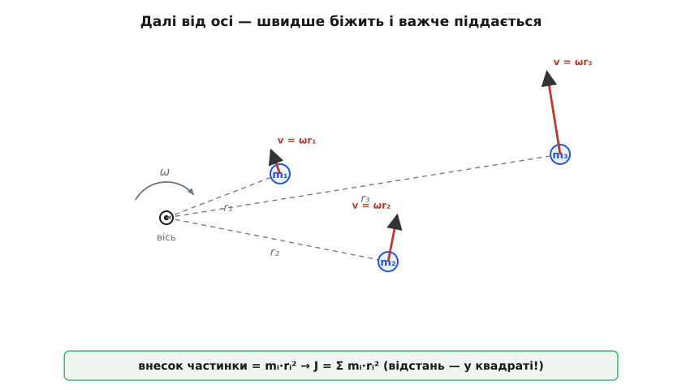
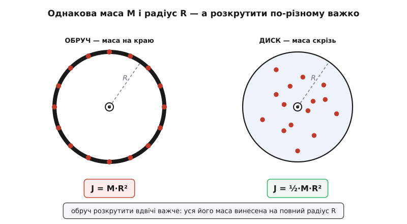
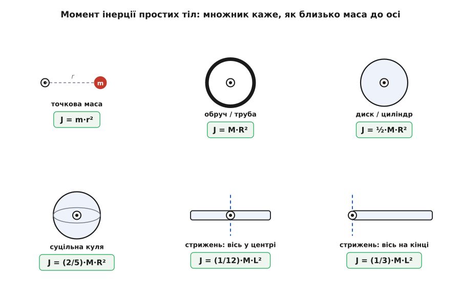
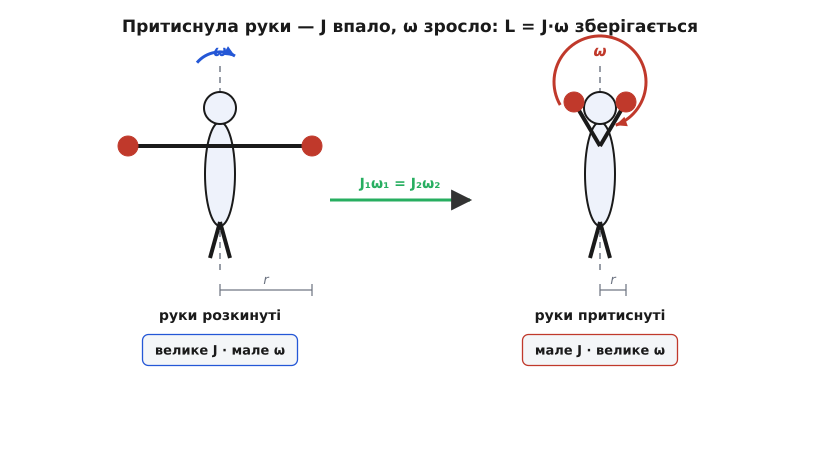

# Момент інерції: чому важить не лише скільки маси, а й де вона

<preknowlist>
- [Маса](topic:ph-mechanics/mass) — міра інертності тіла в прямому русі: що більша маса, то важче змінити швидкість.
- [Кутова швидкість і прискорення](topic:ph-mechanics/angular-velocity) — ω (як швидко тіло обертається) і α (як швидко це обертання наростає); швидкість точки тіла v = ω·r.
- [Момент сили](topic:ph-mechanics/torque) — обертальний аналог сили: те, що розкручує тіло навколо осі, дорівнює силі на плече, M = F·d.
</preknowlist>

Візьміть молоток за саму головку й покрутіть кистю туди-сюди — легко, майже не помічаєте ваги. Тепер перехопіть його за кінчик держака, головкою якнайдалі від руки, і крутіть так само. Раптом він упирається, кисть відчутно напружується. Молоток той самий, маса та сама, рука та сама — а розгойдати його стало помітно важче. Нічого «важчого» не додалося. Змінилося одне: **де** та маса опинилася відносно осі, навколо якої крутить ваша кисть.

Отже, для обертання «скільки речовини» — ще не вся відповідь на питання, наскільки важко цю річ розкрутити чи спинити. У прямого руху за це відповідає маса: у другому законі Ньютона F = m·a саме маса каже, скільки сили треба на задане прискорення. В обертанні цю роль грає окрема величина — **момент інерції** (лат. *inertia* — бездіяльність, млявість, від *iners* — незворушний; Ейлерова латина називала його *momentum inertiae*). І він залежить не лише від маси, а й від того, як ту масу розкидано навколо осі.

### Маса сама по собі не відповідає

Чому винесена далеко маса опирається дужче? Уявіть, що тіло обертається навколо осі з кутовою швидкістю ω. Кожна його точка бігає по колу навколо осі, і швидкість точки тим більша, чим далі вона від осі: [v = ω·r](topic:ph-mechanics/angular-velocity). Точка біля самої осі майже стоїть; точка на далекому краю мчить швидко.

А тепер згадаймо, що будь-яку масу, яка рухається, важко розігнати й важко спинити — це її інертність. Коли ми розкручуємо тіло, ми мусимо розігнати кожну його точку до її швидкості v = ω·r. Далека точка потребує більшої швидкості, тож у неї вкладено більше руху — і щоб надати їй цієї швидкості, потрібно більше зусилля, прикладеного ще й на довшому плечі. Обидва множники — і швидкість, і плече — ростуть з відстанню. Тому винесена маса опирається розкручуванню не «трохи більше», а значно більше, ніж та сама маса біля осі.

Молоток за держак крутиться туго саме тому: важка головка сидить далеко від осі-кисті, і кожен градус повороту жене її по широкій дузі. Перехопіть за головку — і вся маса біля осі, крутити легко.

### Складаємо опір із частинок

Порахуймо цей опір чесно, від однієї частинки. Нехай маленький шматочок маси m сидить на відстані r від осі, і ми хочемо надати тілу кутового прискорення α — тобто розкручувати його дедалі швидше. Лінійне прискорення цього шматочка вздовж його дуги буде a = α·r (та сама логіка, що й v = ω·r, тільки для прискорення). Щоб надати йому такого прискорення, за Ньютоном потрібна сила:

```
F = m·a = m·α·r
```

Але сила, прикладена на відстані r від осі, діє через плече — вона створює [момент](topic:ph-mechanics/torque) M = F·r. Підставмо:

```
M = F·r = (m·α·r)·r = m·r²·α
```

Ось воно. Щоб дати частинці кутове прискорення α, до неї треба прикласти момент, що дорівнює **m·r²** помножити на α. Величина m·r² — це і є внесок частинки в «обертальну масу»: вона стоїть точно там, де в законі F = m·a стоїть маса. Для цілого тіла складаємо внески всіх його частинок:

```
J = Σ mᵢ·rᵢ²
```

а для суцільного тіла сума стає інтегралом по всій його масі:

```
J = ∫ r² dm
```

Це й є момент інерції J. Кожна крихта маси входить у нього зі своєю відстанню до осі **у квадраті**. Саме цей квадрат — головна дійова особа всієї теми.


*Кожна частинка mᵢ на відстані rᵢ від осі при обертанні біжить зі швидкістю ωrᵢ — далі від осі означає швидше. Її внесок в опір розкручуванню дорівнює mᵢrᵢ²; сума всіх таких внесків і є момент інерції J = Σ mᵢrᵢ².*

### Квадрат відстані вирішує все

Квадрат означає, що відстань важить набагато сильніше за саму масу. Віднесіть шматочок удвічі далі від осі — і його внесок зросте не вдвічі, а вчетверо. Через це два тіла однакової маси можуть мати геть різний момент інерції — усе залежить від того, де та маса.

Порівняймо два колеса однакової маси M і однакового радіуса R. Перше — тонкий обруч, уся маса на ободі, на відстані R від осі. Друге — суцільний диск, маса розмазана від центра до краю. В обруча кожна крихта сидить на повній відстані R, тож момент інерції найбільший можливий:

```
обруч:   J = M·R²
```

У диска ж багато маси лежить близько до осі, де r маленьке, а r² — геть дрібне. Точний підрахунок (інтеграл по диску) дає рівно вдвічі менше:

```
диск:    J = ½·M·R²
```

Та сама маса, той самий радіус — а розкрутити обруч удвічі важче, ніж диск, бо в обруча вся маса винесена на край. Ось чому маховики роблять важкими на ободі, а не в центрі: щоб при тій самій вазі запасти якнайбільший момент інерції.


*Обруч і диск мають однакову масу M і радіус R, але в обруча вся маса сидить на відстані R (J = MR²), а в диска багато маси близько до осі, де внесок r² малий (J = ½MR²). Однакова маса, вдвічі різний опір розкручуванню — усе вирішує розподіл.*

Для кількох простих тіл момент інерції давно порахований раз і назавжди — ними користуються як готовими:

```
Точкова маса на нитці, вісь у центрі кола:    J = m·r²
Обруч / тонка труба, вісь по осі:             J = M·R²
Суцільний диск / циліндр, вісь по осі:        J = ½·M·R²
Куля суцільна, вісь через центр:              J = (2/5)·M·R²
Стрижень, вісь через середину:                J = (1/12)·M·L²
Стрижень, вісь на кінці:                       J = (1/3)·M·L²
```

Придивіться до двох останніх рядків: той самий стрижень навколо кінця має момент інерції вчетверо більший, ніж навколо середини (1/3 проти 1/12). Причина знову та сама — коли вісь на кінці, більшість маси винесена далеко від неї, і квадрат відстані це нещадно підсилює. Саме тому молоток за держак крутиться так туго.


*Момент інерції найпоширеніших тіл. Числовий множник (½, 2/5, 1/12, 1/3) показує, яка частка маси наближена до осі: що ближче маса до осі, то менший множник і легше розкрутити.*

Зручно згорнути весь розподіл маси в одне число — **радіус інерції** k: це така відстань, на якій можна було б зосередити всю масу тіла в одну точку, щоб дістати той самий момент інерції, J = M·k². Для обруча k = R (уся маса й так на краю), для диска k = R/√2 ≈ 0.71·R (наче маса зібрана трохи ближче за край). Радіус інерції — коротка відповідь на питання «а де в середньому (у сенсі квадрата) сидить маса цього тіла».

> 🔧 **Навіщо це.** Розподіл маса-квадрат-відстані визначає, чим важко чи легко керувати всьому, що обертається. Маховик накопичувача енергії роблять масивним на ободі — більший J за ту саму вагу. Ротор дрона з важкими кінцями лопатей розганяється мляво й гальмує повільно, а це прямо погіршує керованість — тому лопаті намагаються полегшити ближче до кінчика. Довгий вал турбіни, гребний гвинт, барабан пральної машини — усюди, проєктуючи щось обертове, інженер спершу рахує його момент інерції, бо від нього залежить, який двигун і який момент знадобляться.

### Обертальний другий закон

Тепер, коли J у нас є, обертання підкоряється закону, точнісінько дзеркальному до Ньютонового F = m·a:

```
M = J·α
```

Момент сили дорівнює моменту інерції на кутове прискорення. Хочете розкрутити тіло швидше (більше α) — прикладіть більший момент або зменшіть J. Це той самий [обертальний другий закон, що виводиться з F = m·a для кожної частинки](topic:ph-mechanics/torque/math-rotational-second-law.md): підсумуйте m·r²·α по всіх частинках — і зліва постане повний прикладений момент, а справа — J·α.

**Задача.** Гострильний круг — суцільний диск масою 4 кг і радіусом 0.15 м. Двигун дає момент 2 Н·м. Як швидко круг набирає обертів?

```
Момент інерції диска:
J = ½·M·R² = ½·4·0.15² = ½·4·0.0225 = 0.045 кг·м²

Кутове прискорення:
α = M / J = 2 / 0.045 ≈ 44 рад/с²
```

За кожну секунду кутова швидкість круга зростає приблизно на 44 радіани за секунду — тобто десь на 7 обертів за секунду щосекунди. Якби той самий двигун крутив удвічі важчий круг, α впало б удвічі: розкручувати довше.

### Запас обертання: енергія і момент імпульсу

Обертове тіло, як і рухоме, несе в собі рух — і момент інерції каже, скільки саме. Кінетична енергія обертання — точний дзеркальний двійник звичної [½m·v²](topic:ph-mechanics/kinetic-energy):

```
E = ½·J·ω²
```

На цьому тримаються маховики-накопичувачі: розкрутивши масивний диск до великої ω, у ньому запасають чималу енергію, яку потім знімають назад. Той самий гострильний круг, розкручений до 300 рад/с, тримає E = ½·0.045·300² ≈ 2000 Дж — енергію, з якою треба рахуватися, коли круг раптом заклинить.

А ще обертове тіло несе **[момент імпульсу](topic:ph-mechanics/angular-momentum)** — обертальний аналог імпульсу m·v:

```
L = J·ω
```

І ось де момент інерції показує найяскравіший фокус. Якщо на тіло не діє зовнішній момент, його момент імпульсу L зберігається незмінним. Але J тіло може змінити саме — перерозподіливши свою масу ближче чи далі від осі. А раз L = J·ω стале, то щойно J зменшилося, ω мусить одразу зрости, щоб добуток лишився тим самим.

**Задача.** Фігуристка крутиться з розкинутими руками: J₁ = 4 кг·м², ω₁ = 2 оберти/с. Вона притискає руки до тіла, і момент інерції падає до J₂ = 1.2 кг·м². Як швидко вона крутитиметься?

```
Момент імпульсу зберігається:  J₁·ω₁ = J₂·ω₂

ω₂ = J₁·ω₁ / J₂ = 4·2 / 1.2 ≈ 6.7 оберти/с
```

Притиснувши руки, фігуристка втричі пришвидшила обертання, не відштовхуючись ні від чого — просто зібравши масу ближче до осі. Кіт у падінні, гімнаст у сальто, нейтронна зоря, що стиснулась із велетенської зорі й тому шалено крутиться, — усі грають на тому самому: міняючи J, міняєш ω, бо L тримається сталим.


*Момент імпульсу L = J·ω зберігається. Розкинуті руки — велике J, мале ω (повільно). Притиснуті руки — J падає, тож ω росте (швидко). Маса не змінилась, змінився лише її розподіл навколо осі.*

> 🔧 **Навіщо це.** Збереження моменту імпульсу через момент інерції — робочий інструмент, а не лише трюк на льоду. Супутник повертають, розкручуючи всередині маховик-реакцію: за сталого повного L корпус повертається в протилежний бік. Гіроскоп у смартфоні й у літаку опирається зміні осі саме через свій запасений момент імпульсу. А вертоліт мусив би обертатися під власним ротором, якби хвостовий гвинт не гасив момент — тут теж усе крутиться навколо L і J.

### Та сама маса, інша вісь

Є одне уточнення, без якого момент інерції легко переплутати з масою. Маса тіла — одне число, і воно те саме, хоч куди тіло рухається. А момент інерції **не властивість самого тіла**: він залежить від того, **навколо якої осі** обертатися. Одне й те саме тіло має різні J для різних осей, бо для кожної осі маса розкладена по-іншому. Стрижень навколо середини й навколо кінця — уже вчетверо різні J, хоч стрижень той самий.

Тому питання «який момент інерції цієї деталі?» неповне, поки не названо вісь. Спершу оберіть вісь — тоді рахуйте r² від неї.

Осі при цьому пов'язані простим і корисним правилом. Найлегше тіло обертати навколо осі, що проходить через його [центр мас](topic:ph-mechanics/center-of-mass); будь-яка інша, паралельна їй вісь, зсунута на відстань d, дає більший момент інерції рівно на M·d²:

```
J = J_цм + M·d²
```

Це **теорема паралельних осей** (теорема Штайнера). Вона й пояснює нашого молотка одним рядком: вісь-кисть на кінці держака далеко відсунута від центра мас молотка, тож до «власного» J додається чималеньке M·d² — звідси й уся туга.

Саме цією теоремою рахують момент інерції справжніх складених деталей — не ідеальних дисків, а рами дрона, важеля робота, колеса зі спицями й маточиною: тіло розбивають на прості шматки, для кожного беруть табличне J і зсувають на його M·d², тоді все складають. А для геть довільної форми J беруть чисельно, підсумувавши r² по багатьох дрібних елементах маси. Як це робить робочий код — [невеликий обчислювальний проєкт](topic:ph-mechanics/moment-of-inertia/proj-inertia-calculator.md). Звідки ж береться доданок M·d² і як момент інерції в загальному випадку взагалі стає не числом, а таблицею-**тензором** із виділеними головними осями — у [окремому розборі математики](topic:ph-mechanics/moment-of-inertia/math-inertia-tensor.md).

Сам термін і апарат виросли не з абстракцій, а з дуже практичної задачі — годинника. Христіан Гюйгенс, розбираючись, як гойдається справжній маятник (не точка на нитці, а витягнуте тіло), у праці про маятниковий годинник 1673 року перший дослідив величину, яку через дев'яносто років Леонард Ейлер назве моментом інерції й покладе в основу всієї теорії обертання твердих тіл. Як саме годинникар відкрив «обертальну масу» — [коротка історія](topic:ph-mechanics/moment-of-inertia/hist-oscillation-center.md).

Уся суть теми — в одному кроці міркування: коли тіло обертається, кожна крихта маси мчить зі швидкістю, пропорційною відстані до осі, тому її опір розкручуванню росте як квадрат цієї відстані. Просумуйте m·r² по всьому тілу — дістанете момент інерції, обертальну масу; помножте на кутове прискорення — дістанете потрібний момент; на ω — момент імпульсу, що сам собою зберігається; на ½ω² — запасену енергію. Одна ідея про квадрат відстані — а на ній тримаються і маховик, і гіроскоп, і піруети фігуристки, і туго насаджений на держак молоток.
