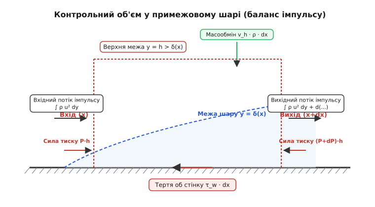
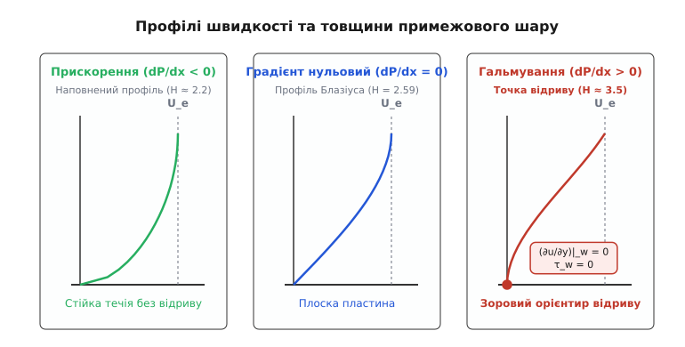
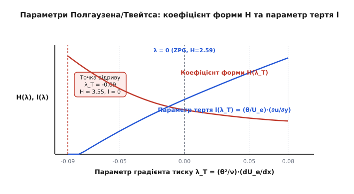
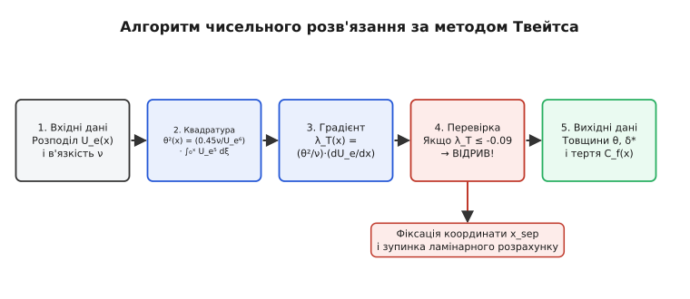

# Інтегральне рівняння імпульсу примежового шару

<preknowlist>
- [Рівняння Нав'є — Стокса](topic:ph-mechanics/navier-stokes) — закони збереження імпульсу в суцільному середовищі.
- [Примежовий шар](topic:ph-mechanics/boundary-layer) — концепція Прандтля та поняття товщини зміщення і втрати імпульсу.
- [Число Рейнольдса](topic:ph-mechanics/reynolds-number) — відношення інерційних сил до сил в'язкого тертя.
- [Динамічний тиск](topic:ph-mechanics/dynamic-pressure) — зв'язок між швидкістю течії та тиском Бернуллі.
- [Потенціальна течія](topic:ph-mechanics/potential-flow) — модель безвідривного обтікання ідеальною нев'язкою рідиною.
- [Відрив потоку](topic:ph-mechanics/flow-separation) — явище зірвання примежового шару під дією несприятливого градієнта тиску.
</preknowlist>

При обчисленні аеродинамічного опору тертя крила пасажирського літака розмахом у кілька метрів при швидкості польоту 50 м/с (число Рейнольдса `Re ≈ 6.5 · 10⁶`) товщина в'язкого примежового шару біля передньої кромки становить частки міліметра, а біля задньої кромки не перевищує 15–20 міліметрів. Безпосереднє розв'язання повних двовимірних або тривимірних диференціальних рівнянь Нав'є — Стокса чи рівнянь Прандтля для такого об'єкта вимагає побудови обчислювальних сіток із мільйонами вузлів уздовж нормалі до стінки, оскільки поперечний градієнт швидкості біля поверхні є надзвичайно великим. Ludwig Prandtl у 1904 році довів, що в'язкі сили зосереджені у вузькому шарі товщиною `δ(x)`, проте навіть спрощені диференціальні рівняння Прандтля у частинних похідних залишаються нелінійними й аналітично непрохідними при наявності довільного градієнта тиску `dP/dx`. У 1921 році Theodore von Kármán запропонував фундаментальний інженерний вихід: замість розв'язання нелінійних рівнянь для локального профілю швидкості `u(x,y)` у кожній просторовій точці `y`, проінтегрувати закон збереження імпульсу по всій товщині примежового шару. Це інтегрування знижує вимірність задачі, перетворюючи складну систему рівнянь у частинних похідних на один звичайний диференціальний рівняння першого порядку, яке пов'язало поздовжнє зростання товщини втрати імпульсу `θ(x)`, градієнт зовнішнього тиску та локальне напруження тертя на стінці `τ_w(x)`.

## 1. Від диференціального опису до інтегрального балансу

Локальний опису течії в'язкої рідини в примежовому шарі спирається на диференціальні рівняння Прандтля. Для стаціонарної двовимірної нестисливої течії вздовж гладкої стінки ці рівняння мають вигляд:

```
u·(∂u/∂x) + v·(∂u/∂y) = U_e·(dU_e/dx) + (1/ρ)·(∂τ/∂y)
∂u/∂x + ∂v/∂y = 0
```

де `u(x,y)` та `v(x,y)` — відповідно поздовжня та нормальна складові вектора швидкості, `U_e(x)` — швидкість на зовнішній межі примежового шару, визначена з потенційного рівняння Ейлера, `τ(x,y) = μ·(∂u/∂y)` — в'язке напруження зсуву, `ρ` — густина, а `μ` — динамічна в'язкість (з грецької *μ* — «мю», показник внутрішнього тертя).

Головна математична складність цих рівнянь полягає в нелінійних конвективних членах `u·(∂u/∂x)` та `v·(∂u/∂y)`. Навіть для найпростішої геометрії — поздовжнього обтікання плоскої пластини при відсутності градієнта тиску (`dU_e/dx = 0`) — точний розв'язок Блазіуса вимагає чисельного інтегрування нелінійного звичайного диференціального рівняння третього порядку. Якщо ж зовнішній потік прискорюється або гальмується (наприклад, на верхній поверхні аеродинамічного профілю), аналітичний розв'язок у замкненій формі взагалі не існує.

Розглянемо фізичну ситуацію при сітковому чисельному розв'язанні диференціальних рівнянь Прандтля. Для точного розрізнення вузького примежового шару товщиною `δ ≈ 1` мм потрібно розмістити принаймні 30–50 сіткових вузлів уздовж нормалі `y`. Якщо поверхня має довжину 2 метри, а поздовжній крок сітки `dx` становить 1 мм, то загальна сітка міститиме понад `100 000` вузлів лише для двовимірного профілю. Для тривимірного крила кількість вузлів сягає десятків мільйонів, що вимагає величезних ресурсів оперативної пам'яті та процесорного часу.

Однак для інженерної практики — розрахунку підйомної сили, опору тертя крила або визначення точки відриву течії — детальна картина розподілу швидкості `u(y)` у кожній координаті `y` є надлишковою інформацією. Конструкторові необхідно знати інтегральний ефект: сумарне напруження тертя `τ_w`, що діє на поверхню, та товщину зони гальмування.

Ідея фон Кармана полягала в переході від диференціального балансу нескінченно малого рідкого елемента розміром `dx × dy` до інтегрального балансу контрольного об'єму скінченної висоти `h > δ(x)` та довжини `dx`. Інтегрування рівняння імпульсу уздовж нормалі `y` від стінки (`y = 0`) до зовнішнього потоку (`y = h`) успадковує закони збереження маси та імпульсу, але усереднює деталі профілю швидкості через інтегральні параметри примежового шару.

## 2. Інтегральні товщини: геометричний та імпульсний дефіцит

При інтегруванні профілю швидкості біля стінки виникають три фундаментальні характеристики примежового шару, які мають чіткий фізичний та геометричний зміст.


*Схема контрольного об'єму та потоків маси й імпульсу в примежовому шарі.*

Перша величина — **товщина зміщення** (з німецької *Verdrängungsdicke*, позначається `δ*`):

```
δ* = ∫₀^∞ (1 - u(y) / U_e) dy
```

Фізичний зміст товщини зміщення `δ*` полягає в тому, що через гальмування рідини в'язкістю біля стінки витрата маси всередині примежового шару є меншою, ніж у потенційному течії ідеальної рідини. Якщо проінтегрувати цей дефіцит маси `∫₀^∞ ρ·(U_e - u) dy`, виявиться, що втрата витрати дорівнює `ρ · U_e · δ*`. Для компенсації цього дефіциту витрати зовнішні лінії току потенційного потоку відтісняються (зміщуються) від твердої поверхні на відстань `δ*`. З точки зору зовнішньої аеродинаміки тіло виглядає «товщим» на величину `δ*(x)`.

Друга величина — **товщина втрати імпульсу** (з німецької *Impulsverlustdicke*, позначається `θ`, грецька літера «тета»):

```
θ = ∫₀^∞ (u(y) / U_e) · (1 - u(y) / U_e) dy
```

Фізичний зміст товщини втрати імпульсу `θ` полягає у вимірюванні загального дефіциту потоку кінетичного імпульсу середовища, викликаного поверхневим тертям. Кожна рідка частинка в примежовому шарі переносить імпульс `ρ·u²`. Якби в'язкість була відсутня, той самий елемент маси переносив би імпульс `ρ·u·U_e`. Відносна втрата імпульсу становить `ρ·u·(U_e - u)`. Проінтегрувавши цей дефіцит по всій товщині шару, отримуємо величину `ρ · U_e² · θ`. Якщо проінтегрувати `θ` по всій поверхні тіла, отримуємо сумарний опір тертя. Сама величина `θ` має розмірність довжини й описує еквівалентну товщину шару повністю загальмованої рідини, яка переносила б такий самий дефіцит імпульсу.

Третя величина — безрозмірний **коефіцієнт форми** (з німецької *Formparameter*, позначається `H`):

```
H = δ* / θ
```

Коефіцієнт форми `H` описує ступінь наповненості профілю поздовжньої швидкості `u(y)`. Чим більшим є значення `H`, тим менш наповненим є профіль біля стінки і тим ближче течія перебуває до стану відриву. Для ламінарного профілю Блазіуса на плоскій пластині `H ≈ 2.59`. Для турбулентного примежового шару завдяки інтенсивному турбулентному перемішуванню профіль швидкості є набагато більш наповненим, тому `H ≈ 1.3–1.4`. При наближенні до точки відриву ламінарного шару значення `H` зростає до `3.55`.

Окрім `δ*` та `θ`, існує також **товщина втрати кінетичної енергії** `δ**` (або `δ_3`):

```
δ** = ∫₀^∞ (u(y) / U_e) · (1 - (u(y) / U_e)²) dy
```

Ця величина описує дефіцит потоку кінетичної енергії в примежовому шарі і використовується в дворядових інтегральних методах замикання.

Детальніше про те, як саме ці концепції створювалися у наукових дискусіях початку XX століття між Прандтлем, Карманом і Полгаузеном, можна прочитати у висвітленні [історію створення рівняння імпульсу Теодером фон Карманом](topic:ph-mechanics/momentum-integral/hist-von-karman.md).

## 3. Баланс контрольного об'єму та математична форма рівняння

Розглянемо контрольний об'єм, обмежений стінкою `y = 0`, верхньою межею `y = h > δ(x)` та двома вертикальними перерізами `x` та `x + dx`.

Закон збереження маси для цього контрольного об'єму вимагає, щоб різниця між вихідним і вхідним потоками маси через вертикальні грані компенсувалася масообміном через верхню грань `y = h`:

```
Маса входить через x :   M_in = ∫₀ʰ ρ·u dy
Маса виходить через x+dx : M_out = ∫₀ʰ ρ·u dy + d/dx [ ∫₀ʰ ρ·u dy ] dx
Маса через верхню межу : M_top = d/dx [ ∫₀ʰ ρ·u dy ] dx
```

Рідина, що входить через верхню грань із нормальним потоком маси `M_top`, несе з собою поздовжній імпульс зі швидкістю зовнішнього потоку `U_e(x)`. Отже, потік імпульсу через верхню грань дорівнює `U_e · M_top`.

Обчислимо тепер повний баланс поздовжніх сил і потоків імпульсу, що діють на контрольний об'єм:
1. Потік імпульсу через вхідну грань `x`: `I_in = ∫₀ʰ ρ·u² dy`.
2. Потік імпульсу через вихідну грань `x + dx`: `I_out = ∫₀ʰ ρ·u² dy + d/dx [ ∫₀ʰ ρ·u² dy ] dx`.
3. Сила тиску на ліву грань: `F_p1 = P(x) · h`.
4. Сила тиску на праву грань: `F_p2 = (P(x) + dP/dx · dx) · h`.
5. Сила тертя об стінку на нижній грані: `F_tau = τ_w · dx`.

Складаючи повний баланс поздовжнього імпульсу `I_out - I_in - I_top = F_p1 - F_p2 - F_tau`, після скорочень отримуємо:

```
d/dx [ ∫₀ʰ ρ·u² dy ] - U_e · d/dx [ ∫₀ʰ ρ·u dy ] = - h · (dP/dx) - τ_w
```

Скориставшись рівнянням Ейлера для зовнішнього потоку `dP/dx = -ρ·U_e·(dU_e/dx)` та підставивши визначення товщини зміщення `δ*` і товщини втрати імпульсу `θ`, перетворимо баланс до строгої алгебраїчної форми:

```
d/dx [ U_e² · θ ] + U_e · (dU_e/dx) · δ* = τ_w / ρ
```

Розкриваючи похідну добутку `d/dx [ U_e² · θ ] = U_e² · (dθ/dx) + 2·U_e·θ·(dU_e/dx)` за правилом Лейбніца та ділячи все рівняння на `U_e²`, отримуємо **інтегральне рівняння імпульсу фон Кармана**:

```
dθ/dx + (2 + H) · (θ / U_e) · (dU_e/dx) = C_f / 2
```

де `C_f = τ_w / (½·ρ·U_e²)` — місцевий коефіцієнт поверхневого тертя (з англійської *skin friction coefficient*).

Покрокові викладення кожного алгебраїчного перетворення, застосування правила Лейбніца та процедури інтегрування по частинах наведено у вставці [математичне виведення з контрольного об'єму](topic:ph-mechanics/momentum-integral/math-derivation.md).

Аналіз трьох членів канонічного рівняння Кармана розкриває фундаментальну фізику примежового шару:
1. `dθ/dx` — градієнт зростання товщини втрати імпульсу. Описує розширення примежового шару вздовж течії за рахунок в'язкої дифузії вихорості.
2. `(2 + H) · (θ / U_e) · (dU_e/dx)` — член градієнта тиску. Він описує вплив прискорення або гальмування зовнішнього потоку. Зверніть увагу на множник `(2 + H)`: двійка походить від зміни динамічного тиску `½·ρ·U_e²` зовнішнього потоку, а коефіцієнт `H` враховує роботу проти сил тиску, пов'язану з витісненням потоку на величину `δ*`.
3. `C_f / 2` — джерельний член в'язкого гальмування. Він показує, що безпосереднє тертя об стінку безперервно відбирає імпульс у течії.

## 4. Вплив градієнта тиску та фізика відриву потоку

Характер розвитку примежового шару принципово залежить від знаку та величини поздовжнього градієнта тиску `dP/dx`, який визначається формою обтікаємого тіла.


*Зміна профілю швидкості в примежовому шарі при різному градієнті тиску.*

### Нульовий градієнт тиску (`dP/dx = 0`, `dU_e/dx = 0`)
Це випадок поздовжнього обтікання плоскої пластини (течія Блазіуса). Другий член у рівнянні Кармана перетворюється на нуль, і рівняння набуває гранично простого вигляду:

```
dθ/dx = C_f / 2
```

Швидкість зростання товщини втрати імпульсу точно дорівнює половині місцевого коефіцієнта тертя. Зі зростанням координати `x` примежовий шар потовщується, градієнт швидкості на стінці `(∂u/∂y)|_w` паде, відповідно зменшуються напруження тертя `τ_w` та коефіцієнт `C_f`. За розв'язком Блазіуса `θ(x) = 0.664 · √(ν·x / U_inf)`, а `C_f(x) = 0.664 / √Re_x`.

### Сприятливий градієнт тиску (`dP/dx < 0`, `dU_e/dx > 0`)
Спостерігається у звужувальних каналах (конфузорах) та на передній частині аеродинамічних профілів (від передньої кромки до точки максимуму товщини). Зовнішній потік прискорюється, а тиск падає вздовж течії.

У цьому випадку сила тиску діє в напрямку руху рідини, додатково проштовхуючи повільні рідкі шари біля стінки. Профіль швидкості стає більш «наповненим», градієнт швидкості біля стінки зростає, а коефіцієнт форми `H` зменшується від `2.59` до `2.2`. Сприятливий градієнт тиску стабілізує ламінарну течію, затримує ламінарно-турбулентний перехід і унеможливлює відрив примежового шару.

### Несприятливий градієнт тиску (`dP/dx > 0`, `dU_e/dx < 0`)
Спостерігається у розширювальних каналах (дифузорах), на задній верхній поверхні крила та у кормовій частині транспортних засобів. Зовнішній потік гальмується, а тиск зростає вздовж течії.

Несприятливий градієнт тиску є головним ворогом аеродинаміки. Сила тиску направлена проти течії. Оскільки рідина у внутрішній частині примежового шару вже знесилена в'язким тертям і має малу кінетичну енергію, під дією зростаючого протитиску вона гальмується значно швидше, ніж зовнішній потенційний потік.

У результаті профіль швидкості деформується: на ньому з'являється точка перегину `(∂²u/∂y² = 0)`. При подальшому русі проти тиску швидкість рідких частинок безпосередньо біля стінки падає до нуля:

```
(∂u/∂y)|_{y=0} = 0   ⇒   τ_w = 0   ⇒   C_f = 0
```

Точка, у якій напруження тертя на стінці стає рівним нулю, називається **точкою відриву примежового шару** (з англійської *separation point*). За точкою відриву виникає зворотна течія (`u < 0`), примежовий шар відривається від поверхні, утворюючи велику вихрову слід-зону. Це призводить до різкого зростання опору тиску (формового опору) та падіння підйомної сили крила (явище звалювання / *stall*).

У момент ламінарного відриву коефіцієнт форми `H` досягає критичного значення `H_sep ≈ 3.55`.

## 5. Однопараметричні методи замикання для ламінарного шару

Рівняння імпульсу Кармана містить одну рівняння та три невідомі функції від `x`: `θ(x)`, `H(x)` та `C_f(x)`. Для того щоб розв'язати це рівняння, необхідно встановити додаткові зв'язки між коефіцієнтом форми `H`, тертям `C_f` та градієнтом зовнішньої швидкості `dU_e/dx`. Ця задача називається **проблемою замикання** (з англійської *closure problem*).


*Залежність параметра тертя та коефіцієнта форми від параметру градієнта тиску.*

### Метод Полгаузена (1921)
Karl Pohlhausen запропонував подати профіль поздовжньої швидкості всередині примежового шару у вигляді полінома четвертого степеня від відносної координати `η = y / δ`:

```
u(y) / U_e = a·η + b·η² + c·η³ + d·η⁴
```

Коефіцієнти полінома визначаються з граничних умов на стінці (`y = 0`) та на зовнішній межі (`y = δ`). На стінці з рівняння імпульсу випливає умова для другої похідної: `μ·(∂²u/∂y²)|_w = dP/dx`.

Полгаузен ввів безрозмірний параметр градієнта тиску `λ` (з грецької *λ* — «ламбда»):

```
λ = (δ² / ν) · (dU_e / dx)
```

Усі характеристики примежового шару в методі Полгаузена стають суто алгебраїчними функціями одного параметра `λ`:
- Точка відриву відповідає `λ = -12` (при цьому `τ_w = 0` та `H ≈ 3.5`).
- Межа допустимості профілю відповідає `λ = +12` (максимальне прискорення).
- Нульовий градієнт тиску відповідає `λ = 0` (`H = 2.59`).

### Однопараметричний метод Твейтса (1949)
Попри математичну стрункість, метод Полгаузена іноді давав відчутні похибки через прив'язку до фізичної товщини `δ`, яка не має чіткої межі. У 1949 році Bryan Thwaites проаналізував великий масив точних розв'язків і встановив, що значно точніші результати дає використання параметра градієнта тиску `λ_T`, побудованого на товщині втрати імпульсу `θ`:

```
λ_T = (θ² / ν) · (dU_e / dx)
```

Твейтс показав, що якщо переписати рівняння Кармана через параметр `λ_T`, воно набуває вигляду:

```
U_e / ν · d(θ²)/dx = 2 · [ l(λ_T) - λ_T · (2 + H(λ_T)) ] ≡ F(λ_T)
```

де `l(λ_T) = (θ / U_e) · (∂u/∂y)|_w` — безрозмірна функція тертя.

Головне відкриття Твейтса полягало в тому, що комбінована функція `F(λ_T)` з вражаючою точністю апроксимується лінійною залежністю для всього діапазону ламінарних течій:

```
F(λ_T) ≈ 0.45 - 6.0 · λ_T
```

Підставивши цю лінійну апроксимацію у рівняння імпульсу, Твейтс отримав лінійне звичайне диференціальне рівняння відносно `θ²`, яке розв'язується в замкненому вигляді у формі **квадратури Твейтса**:

```
θ²(x) = (0.45 · ν / U_e⁶(x)) · ∫₀ˣ U_e⁵(ξ) dξ
```

Ця формула є перлиною інженерної гідромеханіки. Вона дозволяє обчислити товщину втрати імпульсу `θ(x)` у будь-якому перерізі ламінарного примежового шару за допомогою одного єдиного інтегрування відомої функції зовнішньої швидкості `U_e(x)`, без жодного ітераційного розв'язання диференціальних рівнянь.

Після обчислення `θ(x)` знаходять параметр `λ_T(x) = (θ²/ν)·(dU_e/dx)` та обчислюють місцеві значення `H(λ_T)` і `C_f(x)` за універсальними апроксимаційними формулами:
- Уповільнена течія (`-0.09 < λ_T ≤ 0`): `l(λ_T) = 0.225 + 2.3·λ_T - 6.0·λ_T²`, `H(λ_T) = 2.61 - 3.75·λ_T + 80.0·λ_T²`.
- Точка відриву відповідає `λ_T = -0.09` (при цьому `l(-0.09) = 0`, що означає `τ_w = 0`).


*Блок-схема алгоритму чисельного інтегрування методом Твейтса.*

Подивитися на практичну [програмну реалізацію методу Твейтса](topic:ph-mechanics/momentum-integral/proj-thwaites-method.md) з реальними вихідними кодами мовами C та C++ можна у відповідній вставці.

## 6. Турбулентний примежовий шар та метод затягування Хеда

Якщо число Рейнольдса вздовж поверхні перевищує критичне значення (`Re_x > 5 · 10⁵`), у примежовому шарі розвивається ламінарно-турбулентний перехід. У турбулентному примежовому шарі основними носіями переносу імпульсу стають не молекулярна в'язкість `μ`, а хаотичні турбулентні пульсації швидкості, що створюють турбулентні напруження Рейнольдса `τ_turb = -ρ·u'v'`.

Рівняння імпульсу Кармана зберігає свою точну математичну форму і для турбулентного течії (якщо під `u` та `U_e` розуміти усереднені за часом швидкості Рейнольдса):

```
dθ/dx + (2 + H) · (θ / U_e) · (dU_e/dx) = C_f / 2
```

Проте зв'язки між `θ`, `H` та `C_f` суттєво змінюються через відмінність структури турбулентного профілю.

### Профіль швидкості та формула Людвіґа — Тіллманна
Турбулентний профіль є набагато більш наповненим біля стінки і добре описується степеневим законом `u/U_e = (y/δ)^(1/n)` (де `n ≈ 7` для помірних чисел Рейнольдса). Через високу наповненість турбулентний коефіцієнт форми є значно меншим: `H ≈ 1.3–1.4` (проти `2.59` у ламінарному шарі).

Для замикання турбулентного рівняння імпульсу широко використовують емпіричне співвідношення Людвіґа — Тіллманна (Hubert Ludwieg, Werner Tillmann, 1949) для коефіцієнта тертя:

```
C_f = 0.246 · 10^(-0.678 · H) · Re_θ^(-0.268)
```

де `Re_θ = U_e · θ / ν` — число Рейнольдса, розраховане за товщиною втрати імпульсу.

З формули видно, що при зростанні `H` (наближенні до відриву) коефіцієнт тертя `C_f` стрімко падає, але завдяки початково малим значенням `H ≈ 1.3` турбулентний шар здатен переносити значно більші несприятливі градієнти тиску без відриву, ніж ламінарний. Відрив турбулентного шару настає лише при `H ≈ 1.8–2.4`.

### Метод затягування Хеда (Head's Entrainment Method, 1958)
Для турбулентного шару однієї рівняння Кармана недостатньо навіть при відомому `C_f(H, Re_θ)`, оскільки сам коефіцієнт форми `H(x)` динамічно змінюється вздовж поверхні.

Британський дослідник Майкл Річард Хед (Michael Richard Head) запропонував додати друге інтегральне рівняння — **рівняння затягування** (з англійської *entrainment equation*). Воно описує швидкість затягування (*entrainment*) нев'язкої рідини з зовнішнього потоку всередину турбулентного примежового шару:

```
1/U_e · d/dx [ U_e · (δ - δ*) ] = E
```

де `E` — безрозмірний коефіцієнт затягування, який за гіпотезою Хеда залежить від спеціального коефіцієнта форми `H_1 = (δ - δ*) / θ`. За залежностями Хеда `H_1 = 0.8234 · (H - 1.1)⁻¹·²⁸7 + 3.3`, а коефіцієнт затягування `E = 0.035 · (H_1 - 3.0)⁻⁰·⁶¹⁶`.

Система двох звичайних диференціальних рівнянь (Рівняння Кармана для `θ` та рівняння Хеда для `H_1`) інтегрується сумісно чисельними методами Рунге — Кутти 4-го порядку, забезпечуючи високоточний інженерний розрахунок турбулентних примежових шарів на крилах і у дифузорах.

## 7. Інженерна техніка обчислень та обчислювальний алгоритм

На практиці розрахунок примежового шару на аеродинамічному профілі виконується за поетапною схемою.

> 🔧 **Навіщо це.**
> Інтегральний метод Кармана — Твейтса є обчислювальним серцем таких всесвітньо відомих програм розрахунку та проектування аеропрофілів, як **XFOIL** (розроблений професором Марком Дрелою в MIT) та **RFOIL**. Там де двовимірний розрахунок сітковими методами Нав'є — Стокса (RANS) вимагає хвилин або годин роботи процесора, інтегральне рівняння імпульсу в поєднанні з методом панелей розраховує повні характеристики профілю (підйомну силу, опір тертя, точку відриву та поля тиску) за **соті частки секунди**. Це дозволяє проводити багатокритеріальну оптимізацію форми крила у реальному часі.

### Алгоритм розрахунку профільного опору крила

Послідовність розрахунку поєднує потенційне моделювання зовнішнього потоку з послідовним інтегруванням ламінарної та турбулентної ділянок примежового шару вздовж контуру профілю для підсумкового обчислення опору.

1. **Розрахунок зовнішньої швидкості `U_e(x)`**: За формою профілю методом потенційних панелей або конформних відображень обчислюється розподіл потенційної швидкості `U_e(x)` та її похідної `dU_e/dx`.
2. **Ламінарна ділянка**: Від лобової точки гальмування (`x = 0`, `U_e = 0`) виконується чисельна квадратура Твейтса для обчислення `θ(x)`, `δ*(x)` та `C_f(x)`.
3. **Контроль відриву або переходу**:
   - Якщо `λ_T(x)` досягає `-0.09` до точки переходу, фіксується ламінарний відрив з утворенням ламінарної відривної бульбашки (*laminar separation bubble*).
   - Якщо `Re_θ(x)` досягає критичного значення переходу (за критерієм Мішеля `Re_θ,crit ≈ 1.174 · (1 + 22400 / Re_x)^0.46`), обчислення переключається на турбулентний режим.
4. **Турбулентна ділянка**: Починаючи від точки переходу `x_tr`, інтегрується система рівнянь Кармана та Хеда із початковими умовами неперервності `θ(x_tr)`.
5. **Розрахунок повного профільного опору**: На задній кромці крила (`x = c`) знаходяться значення `θ_te` та `H_te`. Повний коефіцієнт профільного опору крила `C_D,prof` обчислюється за відомою формулою Сквайра — Янга (Squire & Young):

```
C_D,prof = 2 · (θ_te / c) · (U_te / U_inf)^((H_te + 5) / 2)
```

З цією формулою повний опір крила обчислюється безпосередньо за параметрами примежового шару на задній кромці.

Докладний опис програмних структур даних, вхідних конфігурацій та підписів функцій для створення власного розв'язувача містить [довідник інтерфейсу розв'язувача](topic:ph-mechanics/momentum-integral/api-solver.md).

## 8. Порівняльний аналіз чисельної ефективності та методи замикання

Щоб зрозуміти фундаментальне значення інтегральних методів Кармана у сучасній гідроаеромеханіці, порівняємо їх із повновимірними сітковими методами чисельного розв'язання рівнянь Нав'є — Стокса (RANS — *Reynolds-Averaged Navier-Stokes*).

При розв'язанні 2D-задачі обтікання профілю крила сітковим методом RANS (наприклад, із використанням моделі турбулентності `k-ω SST`) розрахункова область ділиться на `50 000`–`200 000` комірок. Для досягнення числової точності в пристінковій зоні вимагається, щоб безрозмірна координата першої комірки дорівнювала `y⁺ < 1`. Це вимагає розв'язання нелінійних алгебраїчних систем високого порядку ітераційними методами (SIMPLE або PISO) із виділенням сотен мегабайт оперативної пам'яті.

Натомість інтегральний метод Кармана — Твейтса знижує вимірність задачі з 2D до 1D. Дискретизація поверхні крила вимагає лише `100`–`500` точок вздовж координати `x`. Розрахунок ламінарної ділянки зводиться до одного прямого інтегрування (квадратури), а турбулентної — до інтегрування двох звичайних диференціальних рівнянь.

В таблиці нижче наведено порівняння основних характеристик методів розрахунку примежового шару:

| Метод розрахунку | Модель течії | Необхідна кількість точок | Затрати часу (CPU) | Точність визначення відриву |
| :--- | :--- | :--- | :--- | :--- |
| **Аналітичний Блазіуса** | Ламінарний, `dP/dx = 0` | Точний аналітичний | `< 0.001` мс | Не застосовується (немає `dP/dx`) |
| **Інтегральний Твейтса** | Ламінарний з `dP/dx` | `100`–`300` точок по `x` | `0.01`–`0.05` мс | Висока (`λ_T = -0.09`) |
| **Інтегральний Хеда** | Турбулентний з `dP/dx` | `100`–`500` точок по `x` | `0.1`–`0.5` мс | Добра (`H ≈ 1.8–2.4`) |
| **В'язко-нев'язкий (XFOIL)** | Ламінарно-турбулентний | `150`–`300` панелей | `10`–`50` мс | Дуже висока (включаючи бульбашки) |
| **Повновимірний 2D RANS** | Турбулентний `k-ω SST` | `100 000` комірок (2D) | `10`–`300` секунд | Залежить від турбулентної моделі |

Завдяки неперевершеній швидкості обчислень інтегральні методи є незамінними у завданнях багатокритеріальної аеродинамічної оптимізації, розрахунках у реальному часі на бортових комп'ютерах та в тренажерах пілотування.

## 9. Фізичні аналогії та тепломасообмін у примежовому шарі

Фундаментальна ідея інтегрування рівняння збереження імпульсу уздовж нормалі має безпосереднє продовження у теорії тепломасообміну та конвективного переносу.

У тепловому примежовому шарі, що утворюється біля нагрітої стінки зі температурою `T_w`, розподіл температури `T(y)` описується диференціальним рівнянням енергії:

```
u · (∂T/∂x) + v · (∂T/∂y) = a · (∂²T/∂y²)
```

де `a = k / (ρ·c_p)` — коефіцієнт температуропровідності (з німецької *Temperaturleitfähigkeit*).

За аналогією із товщиною втрати імпульсу `θ`, вводиться **товщина втрати теплової енергії** `θ_T`:

```
θ_T = ∫₀^∞ (u / U_e) · (1 - (T - T_e) / (T_w - T_e)) dy
```

Проінтегрувавши рівняння теплового примежового шару уздовж нормалі `y`, отримуємо **інтегральне рівняння теплового балансу**:

```
d(θ_T) / dx + (θ_T / U_e) · (dU_e/dx) = St
```

де `St = q_w / (ρ · c_p · U_e · (T_w - T_e))` — безрозмірне число Стантона (назване на честь британського інженера Thomas Edward Stanton).

За аналогією Рейнольдса для ламінарного шару при числі Прандтля `Pr = ν / a = 1` тепловий коефіцієнт пов'язаний із гідродинамічним тертям простим співвідношенням `St = C_f / 2`. Це дозволяє використовувати розраховані значення товщини втрати імпульсу `θ(x)` для миттєвого визначення коефіцієнтів тепловіддачі `q_w(x)` на лопатках газових турбін та поверхнях космічних апаратів при входу в атмосферу.

## 10. Стисливість середовища та ефекти високих швидкостей Маха

При надзвукових та гіперзвукових швидкостях польоту (число Маха `M_e > 1`) внаслідок дисипації кінетичної енергії та стискання повітря густина `ρ(y)` та температура `T(y)` всередині примежового шару значно змінюються по товщині.

Для врахування стисливості використовується перетворення Іллінґворта — Стюартсона (C. R. Illingworth, K. Stewartson, 1949), яке деформує нормальну координату `y` за пропорцією `dη = (ρ / ρ_e) dy`.

У стисливому примежовому шарі товщина втрати імпульсу визначається з урахуванням густини:

```
θ_comp = ∫₀^∞ (ρ·u / (ρ_e·U_e)) · (1 - u / U_e) dy
```

Інтегральне рівняння імпульсу Кармана для стисливої течії набуває вигляду:

```
d(θ_comp)/dx + (2 + H_comp - M_e²) · (θ_comp / U_e) · (dU_e/dx) = C_f / 2
```

Присутність члена `-M_e²` показує, що при надзвукових швидкостях прискорення зовнішнього потоку справляє слабший стабілізуючий вплив на примежовий шар через розширення газу при зниженні тиску. Температура стінки при адіабатному обтіканні зростає до значення температури гальмування `T_aw = T_e · (1 + r · ((γ - 1) / 2) · M_e²)`, де `r ≈ √Pr` — коефіцієнт відновлення температури.

## 11. Експериментальна верифікація та вимірювання в аеродинамічних трубах

Для верифікації розрахованих за інтегральним рівнянням Кармана параметрів примежового шару в аеродинамічних трубах застосовують високоточні фізичні методи вимірювань:

1. **Гарячодротяна анемометрія (Hot-Wire Anemometry)**: Мікроскопічна платинова або вольфрамова нитка діаметром 2–5 мікрометрів вміщується в примежовий шар на спеціальному координатнику (мікротраверсері). Вимірюючи швидкість охолодження нитки потоком, отримують експериментальний профіль швидкості `u(y)` з високим часовим розрізненням.
2. **Оптична анемометрія за зображеннями частинок (Particle Image Velocimetry — PIV)**: Потік засівається мікроскопічними краплями олії чи диму, які освітлюються тонким імпульсним лазерним ножем. Дворазова швидка зйомка цифровою камерою дозволяє обчислити вектори швидкості `u(y)` та `v(y)` в усій площині примежового шару без уведення зондів у потік.

Чисельним інтегруванням виміряного профілю `u(y)` визначаються експериментальні товщини `θ_exp` та `δ*_exp`. Численні випробування профілів NACA у wind-tunnel аеродинамічних трубах підтвердили, що метод Твейтса прогнозує товщину втрати імпульсу `θ(x)` із похибкою не більше **1.5–3.0 %** аж до самої точки відриву.

## 12. Межі застосовності та сучасні гібридні підходи

Попри високу ефективність і швидкість, інтегральне рівняння імпульсу Кармана має чітко окреслені фізичні й математичні межі застосовності, нехтування якими призводить до хибних результатів:

1. **Гіпотеза тонкого примежового шару (`δ << L`)**: Рівняння виведено за припущення, що нормальний градієнт тиску відсутній (`∂P/∂y ≈ 0`). Поблизу гострих зламів поверхні або у зонах сильної кривизни стінки це припущення порушується.
2. **Відсутність масивних зворотних течій**: Канонічне рівняння Кармана є рівнянням параболічного типу і інтегрується строго за течією (від `x = 0` до `x_sep`). У зоні розвинутого відриву течії, де виникають розлогі рециркуляційні каверни, класичний інтегральний метод втрачає стійкість (явище математичної сингулярності Гольдштейна / *Goldstein singularity*).
3. **Двовимірність течії**: Рівняння у формі Кармана розроблене для 2D або осесиметричних течій. На стрілоподібних крилах реальних літаків виникає тривимірний примежовий шар із поперечним перетіканням (*cross-flow*), що вимагає використання векторних тривимірних інтегральних рівнянь.

У сучасній аерогідромеханіці інтегральне рівняння імпульсу переживає друге народження у складі **методів в'язко-нев'язкої взаємодії** (з англійської *Viscous-Inviscid Interaction*, VII). У цих підходах потенційний потік (метод панелей) та інтегральний примежовий шар розв'язуються не послідовно, а ітераційно замкнено через процедуру взаємного збурення товщиною зміщення `δ*(x)`. Це дозволяє усунути сингулярність Гольдштейна та розраховувати відривні течії та характеристики звалювання крила з точністю full RANS-моделей, але в сотні разів швидше.
