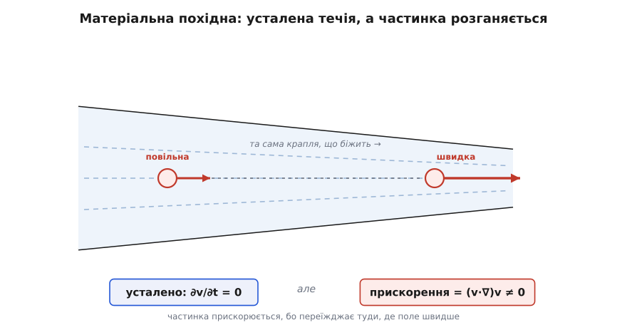
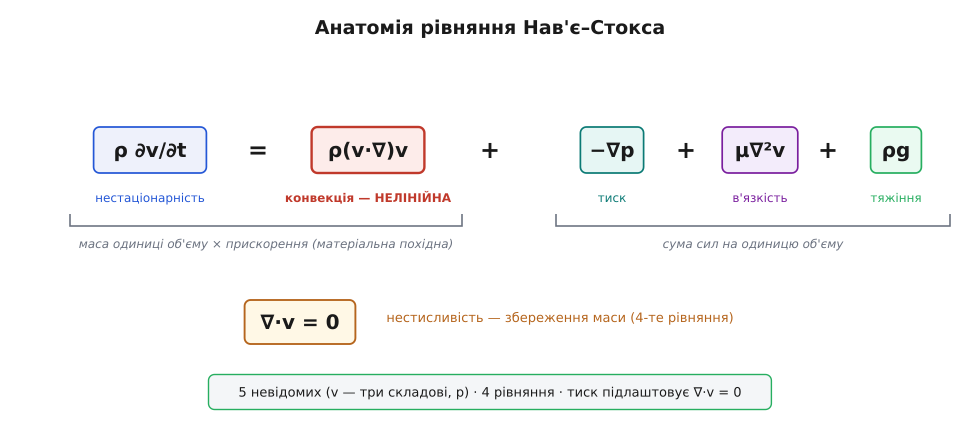

# Рівняння Нав'є–Стокса

<preknowlist>
- [Другий закон Ньютона](root:ph-mechanics/newtons-second-law) — сила = маса × прискорення; основний закон динаміки.
- [В'язкість](root:ph-mechanics/viscosity) — внутрішнє тертя рідини: опір, з яким сусідні шари ковзають один повз одного.
- [Тиск](root:ph-mechanics/pressure) — сила, що діє на одиницю площі всередині рідини.
- [Густина](root:ph-mechanics/density) — маса, що припадає на одиницю об'єму.
- [Нерозривність течії](root:ph-mechanics/flow-continuity) — збереження маси в потоці: скільки рідини витекло, стільки й притекло.
- [Похідна](root:math-analysis/derivative) — миттєвий темп зміни величини.
</preknowlist>

Коли ложка вершків потрапляє у гарячу каву, біла крапля за секунду розтягується в завиток, закручується у спіраль і розчиняється в однорідному бежевому кольорі. Та сама картина дифузії та вихорів керує рухом повітря навколо крила пасажирського лайнера на швидкості 900 км/год і течією крові в аорті людини під тиском 120 мм рт. ст. Усі ці явища — від молекулярного змішування до океанських течій — описує єдине векторне рівняння Нав'є–Стокса, яке переносить другий закон Ньютона у простір суцільного середовища.

Ньютонівський закон `F = m·a` початково сформульовано для точкового тіла або твердої кульки зі скінченною масою. У рідині чи газі немає окремого ізольованого тіла: це суцільний океан частинок, де кожна ділянка рухається, стискається чи деформується під дією сусідів. Щоб застосувати закон Ньютона до плинного середовища, його записують у формі для одиниці об'єму: густина, помножена на прискорення, дорівнює сумі сил, що діють на цей об'єм.

## Рідинна частинка та поле швидкостей

Молекул у найменшій краплі води — трильйони трильйонів, і стежити за траєкторією кожної з них окремо безнадійно. Тому механіка рідин спирається на концептуальну модель суцільного середовища (лат. *continuus* — безперервний): рідину чи газ вважають нескінченно подрібнюваною речовиною без атомарних порожнин.

Для опису течії подумки виділяють малий елемент — **рідинну частинку**. Вона мусить бути достатньо малою, щоб тиск, густина та швидкість усередині неї вважалися практично однаковими, і водночас достатньо великою, щоб містити мільярди молекул для усереднення мікроскопічних хаотичних ударів.

Рух усієї рідини задають **полем швидкостей** `v(x, y, z, t)` — вектором швидкості в кожній точці простору в кожен момент часу. Завдання теорії поля полягає в тому, щоб знайти це ландшафтне поле швидкостей за відомими початковими та межовими умовами середовища.

## Матеріальна похідна: прискорення в потоці

Найбільша пастка під час формулювання закону Ньютона для рідини полягає у визначенні прискорення. Звичайна часткова похідна за часом `∂v/∂t` показує швидкість зміни лише у фіксованій точці простору. Проте сама рідинна частинка не стоїть на місці: вона рухається разом із потоком у нові координати.

Прикладом слугує усталена течія води крізь звужувальне сопло. Картина швидкостей у просторі не змінюється з часом (`∂v/∂t = 0`), однак кожна крапля води, проходячи крізь звуження, відчутно розганяється. Прискорення рідинної частинки складається з двох суттєвих частин:

- **Локальне прискорення** (`∂v/∂t`) — зміна поля швидкостей у даній застиглій точці простору з часом.
- **Конвективне прискорення** (`(v·∇)v`) — зміна швидкості через переміщення частинки в точку з іншим значенням поля (лат. *convehere* — переносити разом).

Повне прискорення частинки називають **матеріальною похідною** (лат. *substantia* — суть) і позначають `Dv/Dt`:

```
a = Dv/Dt = ∂v/∂t + (v·∇)v
```


*Течія усталена — ∂v/∂t = 0, але частинка розганяється при переході у вужчу частину. Це прискорення описує конвективний член (v·∇)v.*

Член `(v·∇)v` містить добуток невідомої швидкості на її просторові похідні. Це **нелінійний** доданок: він робить рівняння Нав'є–Стокса складним для аналітичного розв'язання, забезпечуючи виникнення самопідтримуваних вихорів і турбулентного хаосу.

> 🔧 **Навіщо це.** Саме конвективний член пояснює зростання швидкості в соплах ракетних двигунів, утворює перепади тиску у звужених судинах і лежить в основі розрахунку підйомної сили крила літака за [рівнянням Бернуллі](root:ph-mechanics/dynamic-pressure).

## Три сили, що діють на рідину

Права частина закону Ньютона містить суму трьох типів сил, віднесених до одиниці об'єму середовища:

1. **Сила тиску (`−∇p`)**: Рівномірний [тиск](root:ph-mechanics/pressure) з усіх боків не здатний зрушити частинку з місця. Рух спричиняє лише перепад тиску — [градієнт](root:math-analysis/gradient) `∇p` (лат. *gradus* — крок). Знак «мінус» показує, що чиста сила напрямлена від ділянок високого тиску до низького.
2. **Сила в'язкого тертя (`μ∇²v`)**: Сусідні шари рідини, що ковзають один повз одного з різною швидкістю, чіпляються та гальмують чи розганяють один одного через [в'язкість](root:ph-mechanics/viscosity) `μ`. [Лапласіан](root:math-analysis/laplacian) `∇²v` вимірює відхилення швидкості в точці від середнього значення по сусідству. В'язкість дифузно згладжує гострі перепади швидкості.
3. **Об'ємна сила (`ρg`)**: Зовнішні сили, що діють безпосередньо на всю масу частинки (передусім сила тяжіння, де `g` — прискорення вільного падіння, а `ρ` — [густина](root:ph-mechanics/density)).

## Рівняння Нав'є–Стокса та збереження маси

Об'єднавши масу, матеріальне прискорення та діючі сили, отримуємо **рівняння Нав'є–Стокса** для нестисливої рідини:

```
ρ (∂v/∂t + (v·∇)v) = −∇p + μ∇²v + ρg
```

Поділивши обидві частини на густину `ρ`, рівняння часто записують через кінематичну в'язкість `ν = μ/ρ`:

```
∂v/∂t + (v·∇)v = −(1/ρ)∇p + ν∇²v + g
```


*Анатомія рівняння Нав'є–Стокса: інерція ліворуч, сили тиску, в'язкості й тяжіння праворуч, плюс рівняння нестисливості.*

Рівняння містить чотири невідомі величини (три компоненти вектора швидкості `v` і скалярний тиск `p`), але дає лише три векторні складові. Четвертим рівнянням є закон збереження маси для нестисливої рідини — [нерозривність течії](root:ph-mechanics/flow-continuity):

```
∇·v = 0
```

[Дивергенція](root:math-analysis/divergence) `∇·v` (лат. *divergere* — розходитися) дорівнює нулю, що означає відсутність внутрішніх джерел і стоків: скільки рідини втікає у довільний об'єм, стільки ж із нього витікає.

У нестисливій рідині тиск `p` відіграє роль невідкладного глобального регулятора: він миттєво підлаштовується по всьому об'єму середовища так, щоб у кожній точці виконувалася умова нерозривності `∇·v = 0`. Важливою межовою умовою на твердих стінках є умова прилипання, де швидкість рідини дорівнює швидкості межі, формуючи тонкий [примежовий шар](root:ph-mechanics/boundary-layer).

Деталі математичного виведення законів внутрішніх напружень наведено в [окремому розборі](root:ph-mechanics/navier-stokes/math-stress-tensor.md), а історичний шлях від праць Клода-Луї Нав'є до робіт Джорджа Ґабріеля Стокса висвітлено в [історичній довідці](root:ph-mechanics/navier-stokes/hist-navier-stokes.md). Чисельне розв'язання цієї системи для реальної течії реалізовано у [практичному проєкті](root:ph-mechanics/navier-stokes/proj-cfd-cavity.md).

## Турбулентність і відкрита загадка математики

Співвідношення між інерційним членом `(v·∇)v` та в'язким членом `ν∇²v` визначає фізичний характер всієї течії. Це змагання описує безрозмірне [число Рейнольдса](root:ph-mechanics/reynolds-number):

```
Re = ρ·v·L / μ
```

- **За малих `Re`** переважає в'язке тертя: течія залишається гладкою, впорядкованою та шаруватою (ламінарною). Прикладом є [течія Пуазейля](root:ph-mechanics/poiseuille-flow) у вузьких трубах.
- **За великих `Re`** панує конвективна нелінійність: течія втрачає стійкість і зривається в [турбулентність](root:ph-mechanics/turbulence) (лат. *turbulentus* — бурхливий). Утворюється складний вихоровий каскад, де енергія передається від великих закруток до дрібніших, поки не перетвориться на тепло за рахунок в'язкості на найменших масштабах.

Складність нелінійного переносу енергії зумовила одну з найбільших загадок сучасної науки. Інститут Клея включив питання про існування та гладкість розв'язків тривимірних рівнянь Нав'є–Стокса до списку семи Проблем тисячоліття. Попри щоденне застосування рівнянь у суперкомп'ютерних прогнозах погоди та моделюванні аеродинаміки, математики й досі не довели, чи завжди розв'язки залишаються гладкими й не створюють фізично неможливих нескінченностей.
