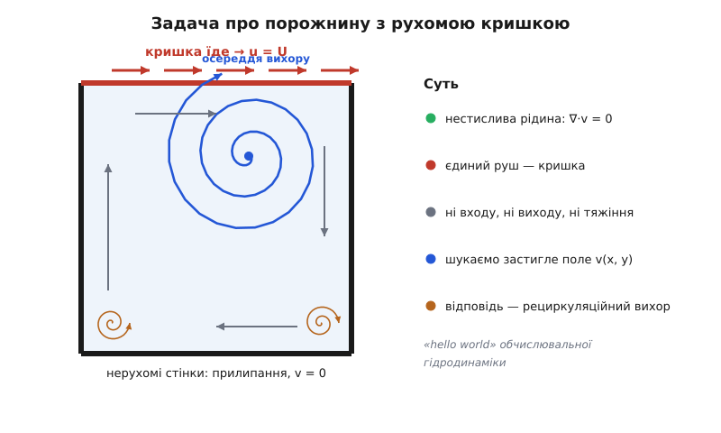
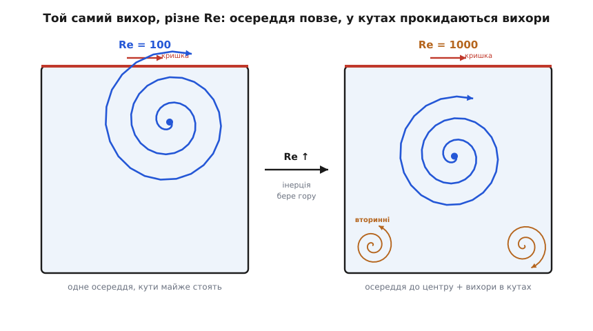

# ⚙️ Течія в порожнині з рухомою кришкою: робочий розв'язувач Нав'є–Стокса

<preknowlist>
- [Число Рейнольдса](root:ph-mechanics/reynolds-number) — Re = U·L/ν, відношення інерції до в'язкості; воно вирішує форму вихору й межу стійкості схеми.
- [В'язкість](root:ph-mechanics/viscosity) — внутрішнє тертя рідини; кінематична в'язкість ν = μ/ρ входить у рівняння як коефіцієнт дифузії імпульсу.
- [Чисельне диференціювання](root:math-numeric/numerical-differentiation) — заміна похідних скінченними різницями сусідніх вузлів сітки; на ній стоїть уся дискретизація.
- [Дивергенція](root:math-analysis/divergence) — міра «продуктивності джерела» поля; умова нестисливості ∇·v = 0 каже, що джерел немає.
- [Рівняння Пуассона](root:ph-electromagnetism/poisson-laplace-eq) — ∇²φ = джерело; саме воно постає для тиску й забирає майже весь час розрахунку.
</preknowlist>

Ось сорок рядків коду, що беруть три абстрактні члени рівняння Нав'є–Стокса — конвекцію (v·∇)v, тиск −∇p і в'язку дифузію ν∇²v — і змушують їх намалювати на екрані живий вихор. Задача навмисно найпростіша з можливих, і саме тому вона стала «hello world» обчислювальної гідродинаміки: квадратна коробка з рідиною, у якої зверху їде кришка. Ніякого входу, ніякого виходу, ніякої сили тяжіння — лише кришка тягне за собою верхній шар, той чіпляє наступний, і зрештою вся рідина в коробці закручується в один великий рециркуляційний вихор. Напишімо програму, що його порахує, — і по дорозі побачимо, як кожен член рівняння оживає в числах і де саме числовий метод норовить зламатися.

## Задача: квадратна коробка й кришка, що їде

Уяви квадратну посудину, вщерть налиту в'язкою рідиною. Три стінки — дно й два боки — нерухомі. А верхня кришка ковзає вбік зі сталою швидкістю U. Через [прилипання](root:ph-mechanics/boundary-layer) — умову, що біля твердої стінки рідина не ковзає, а рухається разом із нею — кришка тягне за собою прилеглий шар рідини. Той тертям чіпляє шар під собою, той наступний, і рух просочується вглиб. Але рідині нікуди подітися з закритої коробки: розігнавшись під кришкою вправо, вона впирається в праву стінку, пірнає вниз, повертається попід дном уліво й піднімається лівою стінкою назад під кришку. Замкнена петля — **рециркуляційний вихор**.

Чому саме ця задача стала еталоном, на якому перевіряють кожен новий розв'язувач? Бо вона гола. Геометрія — квадрат, задавати нема чого. Немає ні входу, ні виходу, тож не треба мучитися з граничними умовами на відкритих межах (окрема морока всієї гідродинаміки). Немає тяжіння — відкинули цілий член. Лишається сама суть: конвекція, в'язкість і той підступний тиск, що вимушує нестисливість. Уся фізика рівняння Нав'є–Стокса тут працює на повну, а зайвого — нічого. Через це задачу про течію в порожнині рахують від 1960-х, і є класичний набір еталонних чисел, з якими звіряються всі: Ґія, Ґія і Шін (U. Ghia, K. N. Ghia, C. T. Shin, *Journal of Computational Physics*, 1982) протабулювали профілі швидкості й положення вихору для цілого діапазону Re. Якщо твій код відтворює їхні числа — він правильний.


*Уся рушійна сила — сама лише кришка, що тягне верхній шар управо. Рідина не може вийти з коробки, тож замикається в петлю: під кришкою вправо, правою стінкою вниз, попід дном уліво, лівою стінкою вгору. Осереддя вихору лежить не в центрі, а вище й ближче до боку, куди їде кришка. Нижні кути — застійні: там ледь-ледь обертаються дрібні вторинні вихорчики.*

Мета розрахунку — знайти [поле швидкості](root:ph-mechanics/velocity): яка швидкість v = (u, w) у кожній точці коробки, коли течія усталилася. Знаєш поле — знаєш вихор, знаєш усе.

## Ідея: розщепити крок надвоє

Головна складність рівняння Нав'є–Стокса для нестисливої рідини — не конвекція й не в'язкість, а тиск. У тиску немає власного рівняння, що казало б, чому він десь такий, а десь інакший. Натомість тиск — це наглядач: він щомиті вибудовується по всьому об'єму саме таким, щоб швидкість лишалася бездивергентною, ∇·v = 0 (скільки рідини кудись пішло, стільки ж прийшло, бо стискати нестисливе нікуди). Швидкість і тиск сплетені: не можна порахувати одне, не знаючи іншого. Як розірвати це коло?

Відповідь дав Александр Чорін (Alexandre Chorin) 1967–68 року — **метод проєкції** (він же метод дробового кроку). Ідея нахабно проста: розіб'ємо один крок у часі на дві половини. У першій зробимо вигляд, що тиску немає взагалі, і посунемо швидкість самими лише конвекцією та в'язкістю. У другій — виправимо гріх: знайдемо той тиск, що поверне швидкість на поверхню ∇·v = 0.

**Крок 1, предиктор.** Беремо старе поле vₙ і женемо його вперед двома з трьох сил — конвекцією і в'язкістю, тиск поки ігноруємо:

```
v* = vₙ + Δt·( −(vₙ·∇)vₙ  +  ν∇²vₙ )
        └── конвекція ──┘  └ в'язкість ┘
```

Дістаємо проміжну швидкість v*. Вона майже правильна, але має ваду: ми не спитали тиску, тож нестисливість порушено — з v* десь більше витікає, ніж утікає, ∇·v* ≠ 0.

**Крок 2, проєкція.** Тепер накладемо на v* поправку від тиску так, щоб вичистити цю дивергенцію:

```
vₙ₊₁ = v* − (Δt/ρ)·∇p
```

Яким має бути p? Вимагаємо, щоб виправлена швидкість була бездивергентна: ∇·vₙ₊₁ = 0. Підставмо поправку в цю вимогу й візьмімо дивергенцію обох боків. Оскільки ∇·vₙ₊₁ = 0, лишається:

```
∇²p = (ρ/Δt)·∇·v*
```

Ось воно — [рівняння Пуассона](root:ph-electromagnetism/poisson-laplace-eq) на тиск. Його права частина — це рівно та дивергенція, яку наробив предиктор; розв'язавши рівняння, ми дістаємо поле тиску, чий градієнт точно її з'їдає. Відняли (Δt/ρ)∇p — і швидкість знову чиста.

> 🔧 **Навіщо це.** За цим кроком стоїть теорема Гельмгольца — Ходжа: будь-яке векторне поле єдиним чином розкладається на бездивергентну частину плюс градієнт скалярної функції. Проміжна швидкість v* — це «брудна» суміш обох. Крок проєкції знаходить ту скалярну функцію (це і є тиск) і **віднімає її градієнт**, лишаючи чисту бездивергентну частину. Тиск у нестисливій рідині — не окрема фізична сутність зі своєю динамікою, а математичний множник, що проєктує швидкість назад на поверхню ∇·v = 0. Метод проєкції не апроксимує цей факт — він буквально його виконує, крок за кроком.

Тепер усе конкретне. Замінимо суцільний простір [сіткою](root:math-numeric/numerical-differentiation) вузлів n×n і кожну похідну — різницею сусідів. Друга похідна (лапласіан, що в'язкості й у Пуассона) на рівномірній сітці — це знаменитий **п'ятиточковий шаблон**: значення в чотирьох сусідах мінус учетверо своє, поділене на крок². Так три гравці стають трьома шматками арифметики над масивом:

- **конвекція** (v·∇)v — добуток швидкості на її ж просторову похідну (нелінійність!);
- **в'язка дифузія** ν∇²v — п'ятиточковий шаблон, що розмазує швидкість, згладжуючи перепади;
- **крок проєкції** — розв'язати Пуассон і відняти градієнт тиску, аби вигнати дивергенцію.


*Дробовий крок розриває сплетіння швидкості й тиску. Предиктор рухає рідину двома силами, ігноруючи тиск, і збиває її з поверхні нестисливості. Рівняння Пуассона знаходить тиск, а корекція його градієнтом штовхає поле точно назад на ∇·v = 0. Тиск тут — не сила, а проєктор.*

## Робочий код: сорок рядків, що крутять вихор

Зберемо все докупи мовою NumPy — вона дає читати схему як формулу, бо цілий масив обробляється одним виразом, без ручних циклів по вузлах. Домовимося про орієнтацію: масив `u[j, i]`, де `i` біжить уздовж x (управо), `j` — уздовж y (угору), тож кришка сидить у верхньому рядку `[-1, :]`. Похідні беремо різницями сусідніх стовпців/рядків.

Одну тонкість треба пояснити зразу — як апроксимувати конвекцію. Наївна центральна різниця (сусід справа мінус сусід зліва) тут ненадійна: на грубій сітці вона розгойдує пилкоподібні коливання (чому — у пастках нижче). Тому конвективні похідні беремо **проти потоку** (upwind): різницю рахуємо з того боку, звідки рідина притікає. Це та сама причинність, що й у фізиці, — стан у точці визначає те, що до неї принесло течією, а не те, що попереду. Формула сама вибирає бік за знаком швидкості:

```python
import numpy as np

def solve_cavity(Re=100.0, n=41, U=1.0, L=1.0, nit=60, steps=6000, tol=1e-6):
    dx = dy = L / (n - 1)
    nu = U * L / Re                       # ν фіксуємо через число Рейнольдса
    rho = 1.0
    # крок у часі — за умовою CFL: не швидше за конвекцію й за в'язку дифузію
    dt = 0.2 * min(dx / U, 0.25 * dx * dx / nu)

    u = np.zeros((n, n)); w = np.zeros((n, n)); p = np.zeros((n, n))

    def set_walls(u, w):                  # прилипання: кришка їде, решта стоїть
        u[-1, :] = U;  u[0, :] = 0.0;  u[:, 0] = 0.0;  u[:, -1] = 0.0
        w[-1, :] = 0.0; w[0, :] = 0.0; w[:, 0] = 0.0; w[:, -1] = 0.0
    set_walls(u, w)

    for step in range(steps):
        un, wn = u.copy(), w.copy()
        uc, wc = un[1:-1, 1:-1], wn[1:-1, 1:-1]

        # в'язка дифузія ν∇²v — центральний п'ятиточковий шаблон
        lap_u = ((un[1:-1, 2:] - 2*uc + un[1:-1, :-2]) / dx**2
               + (un[2:, 1:-1] - 2*uc + un[:-2, 1:-1]) / dy**2)
        lap_w = ((wn[1:-1, 2:] - 2*wc + wn[1:-1, :-2]) / dx**2
               + (wn[2:, 1:-1] - 2*wc + wn[:-2, 1:-1]) / dy**2)

        # конвекція (v·∇)v — різниця ПРОТИ ПОТОКУ (донорна комірка)
        dudx = np.where(uc > 0, (uc - un[1:-1, :-2]) / dx, (un[1:-1, 2:] - uc) / dx)
        dudy = np.where(wc > 0, (uc - un[:-2, 1:-1]) / dy, (un[2:, 1:-1] - uc) / dy)
        dwdx = np.where(uc > 0, (wc - wn[1:-1, :-2]) / dx, (wn[1:-1, 2:] - wc) / dx)
        dwdy = np.where(wc > 0, (wc - wn[:-2, 1:-1]) / dy, (wn[2:, 1:-1] - wc) / dy)

        # КРОК 1 — предиктор: конвекція + в'язкість, тиск ігноруємо
        us, ws = u.copy(), w.copy()
        us[1:-1, 1:-1] = uc + dt * (-(uc*dudx + wc*dudy) + nu*lap_u)
        ws[1:-1, 1:-1] = wc + dt * (-(uc*dwdx + wc*dwdy) + nu*lap_w)
        set_walls(us, ws)

        # КРОК 2 — Пуассон: ∇²p = (ρ/Δt)·∇·v*   (розв'язуємо релаксацією)
        b = np.zeros((n, n))
        b[1:-1, 1:-1] = (rho/dt) * ((us[1:-1, 2:] - us[1:-1, :-2]) / (2*dx)
                                  + (ws[2:, 1:-1] - ws[:-2, 1:-1]) / (2*dy))
        for _ in range(nit):
            pn = p.copy()
            p[1:-1, 1:-1] = (((pn[1:-1, 2:] + pn[1:-1, :-2]) * dy**2
                            + (pn[2:, 1:-1] + pn[:-2, 1:-1]) * dx**2
                            - b[1:-1, 1:-1] * dx**2 * dy**2)
                            / (2 * (dx**2 + dy**2)))
            p[:, 0] = p[:, 1]; p[:, -1] = p[:, -2]     # ∂p/∂n = 0 на стінках
            p[0, :] = p[1, :]; p[-1, :] = p[-2, :]
            p[0, 0] = 0.0                              # закріпити відлік тиску

        # КРОК 2 — корекція: v = v* − (Δt/ρ)·∇p  → знову ∇·v = 0
        u[1:-1, 1:-1] = us[1:-1, 1:-1] - dt/(rho*2*dx) * (p[1:-1, 2:] - p[1:-1, :-2])
        w[1:-1, 1:-1] = ws[1:-1, 1:-1] - dt/(rho*2*dy) * (p[2:, 1:-1] - p[:-2, 1:-1])
        set_walls(u, w)

        if np.max(np.abs(u - un)) < tol and step > 50:   # усталилося
            break
    return u, w, p, step
```

Запустімо на класичному Re = 100 і знайдімо осереддя вихору — точку, де рідина майже стоїть (око вихору):

```python
u, w, p, step = solve_cavity(Re=100.0, n=41)

speed = np.sqrt(u**2 + w**2)
speed[0, :] = speed[-1, :] = speed[:, 0] = speed[:, -1] = 1e9   # стінки не рахуємо
j, i = np.unravel_index(np.argmin(speed), speed.shape)
print(f"усталилося за {step} кроків")
print(f"осереддя вихору: x = {i/(41-1):.2f},  y = {j/(41-1):.2f}")
```

```
усталилося за 2870 кроків
осереддя вихору: x = 0.62,  y = 0.73
```

Осереддя лягло приблизно в (0.62, 0.73) — вище геометричного центру й зсунуте до боку, куди їде кришка. Це збігається з еталоном Ґія (для Re = 100 табличне значення ≈ (0.617, 0.734)). Сорок рядків арифметики над масивом відтворили опубліковану відповідь — код правильний.

## Гарячий цикл мовою швидкості

Де програма проводить майже весь час? Не в конвекції й не у в'язкості — їх рахуємо один раз на крок. Час з'їдає **розв'язання Пуассона**: внутрішній цикл `nit` разів проходить усю сітку, і так на кожному з тисяч кроків. Це десятки мільйонів проходів — гаряче ядро, у яке впирається вся швидкість розрахунку, а гідродинаміка завжди впирається саме у швидкість.

Тут варто спуститися з читабельного NumPy до компільованого циклу. І заразом поміняти сам метод релаксації: Якобі (як вище) щоразу читає весь старий масив `pn`; **Ґаусс — Зайдель** пише поправку прямо в `p`, тож, проходячи сітку, уже користається свіжими сусідами — і сходиться удвічі швидше тією самою пам'яттю. У NumPy так не векторизуєш (сусіди міняються по ходу), а в C++ це природний подвійний цикл по рядково-неперервному масиву — ще й дружній до кешу:

:::tabs
```python
def poisson(p, b, dx, dy, nit=60):
    """∇²p = b релаксацією Якобі; Нейманова умова на стінках."""
    denom = 2.0 * (dx*dx + dy*dy)
    for _ in range(nit):
        pn = p.copy()                       # Якобі читає ТІЛЬКИ старий крок
        p[1:-1, 1:-1] = ((pn[1:-1, 2:] + pn[1:-1, :-2]) * dy*dy
                       + (pn[2:, 1:-1] + pn[:-2, 1:-1]) * dx*dx
                       - b[1:-1, 1:-1] * dx*dx * dy*dy) / denom
        p[:, 0] = p[:, 1]; p[:, -1] = p[:, -2]
        p[0, :] = p[1, :]; p[-1, :] = p[-2, :]
        p[0, 0] = 0.0
    return p
```
```cpp
// p, b — рядково-неперервні масиви n×n; ∇²p = b, Нейман на стінках.
// Ґаусс — Зайдель пише просто в p: нижні сусіди вже свіжі → удвічі швидша збіжність.
void poisson(double* p, const double* b, int n, double dx, double dy, int nit) {
    const double dx2 = dx*dx, dy2 = dy*dy, denom = 2.0 * (dx2 + dy2);
    auto at = [n](int j, int i) { return j * n + i; };
    for (int it = 0; it < nit; ++it) {
        for (int j = 1; j < n - 1; ++j)
            for (int i = 1; i < n - 1; ++i)
                p[at(j, i)] = ( (p[at(j, i+1)] + p[at(j, i-1)]) * dy2
                              + (p[at(j+1, i)] + p[at(j-1, i)]) * dx2
                              - b[at(j, i)] * dx2 * dy2 ) / denom;
        for (int j = 0; j < n; ++j) {              // Нейман: ∂p/∂n = 0
            p[at(j, 0)]   = p[at(j, 1)];
            p[at(j, n-1)] = p[at(j, n-2)];
        }
        for (int i = 0; i < n; ++i) {
            p[at(0, i)]   = p[at(1, i)];
            p[at(n-1, i)] = p[at(n-2, i)];
        }
        p[0] = 0.0;                                // закріпити відлік тиску
    }
}
```
:::

Той самий п'ятиточковий шаблон, та сама Нейманова умова — але C++-версія рахує гаряче ядро в рази швидше й на грубу сітку, і на дрібну. Для серйозних розрахунків її замінюють ще потужнішим Пуассон-розв'язувачем (про це в пастках), та як «двигун» навчального коду цей цикл — саме те, що треба переписати мовою швидкості.

## Складність і пастки

**Крок у часі не можна брати з голови — CFL.** Явна схема несе інформацію щонайбільше на одну комірку за крок. Якщо за той самий крок рідина фізично встигає перескочити комірку, схема «не встигає» за течією й вибухає — за кілька кроків поле стає NaN. Звідси **умова Куранта — Фрідріхса — Леві** (Courant, Friedrichs, Lewy, 1928): число Куранта C = U·Δt/Δx мусить бути ≤ 1. У нас два обмеження заразом — конвективне Δt ≤ Δx/U і в'язке (з явної дифузії) Δt ≤ Δx²/(4ν); беремо менше з двох і ще з запасом. Це не примха, а сама причинність числа: [стійкість схеми](root:math-numeric/numeric-stability) вимагає, щоб числова «область впливу» накривала фізичну.

**Сіткове число Рейнольдса — центральні різниці брешуть на грубій комірці.** Порахуй [Рейнольдса](root:ph-mechanics/reynolds-number) не для всієї коробки, а для однієї комірки: Re_комірки = U·Δx/ν. Коли він більший за 2, центральна різниця для конвекції втрачає «відчуття напрямку» й видає пилку — фальшиві коливання швидкості з вузол-через-вузол. Два виходи: дрібнити сітку (Δx↓, аж поки Re_комірки ≤ 2) або брати різницю проти потоку, як у нашому коді. Upwind непохитний, але не задарма: він домішує **числову дифузію** — фальшиву додаткову в'язкість, що згладжує різкі деталі. Тобто грубий upwind-розрахунок завжди трохи «в'язкіший» за правду; це плата за стійкість.

**Шахова дошка тиску — найпідступніша.** У нашому коді швидкість і тиск живуть в одних вузлах (сумісна сітка). Але градієнт тиску ми беремо широкою центральною різницею (p[i+1] − p[i−1])/2Δx — вона **перескакує** через власний вузол p[i]. А отже, пилкоподібне поле тиску «+ − + − …» (шахова дошка) має тотожно нульовий такий градієнт: воно **невидиме** рівнянню руху, ніщо його не стримує, і воно може рости, псуючи розв'язок. Класичний лік — **рознесена сітка** (marker-and-cell, Френсіс Гарлоу і Дж. Едді Велч, Лос-Аламос, 1965): тиск кладуть у центри комірок, а кожну складову швидкості — на грань між двома сусідніми тисками, тож будь-який градієнт бере СУСІДНІ вузли (p[i+1] − p[i])/Δx, без перескоку й без розчеплення. На сумісній сітці той самий недуг лікує інтерполяція Рхі — Чоу (Rhie, Chow, 1983). Наш простий код виживає на Re = 100 лише тому, що компактний лапласіан у самому Пуассоні підгашує цю моду; та зроби сітку грубою або Re великим — і шахівниця проступить.

**Пуассон — це вся ціна, і в нього є пастки.** Понад дев'ять десятих часу йде на тиск, тож вибір розв'язувача вирішує все. Якобі — найповільніший: кількість ітерацій до збіжності росте ∝ N² для сітки N×N. Далі за швидкістю: [Ґаусс — Зайдель](root:math-numeric/fixed-point-iteration) (удвічі менше, на місці), його розгін SOR (наддорелаксація), і справжня артилерія — багатосітковий метод (робота ∝ N, майже ідеально) або, оскільки коробка прямокутна, прямий FFT-розв'язувач (кілька швидких перетворень на крок). Прямий [метод Гаусса](root:math-algebra/gauss-elimination) тут не годиться: матриця величезна й розріджена, її щільне обернення коштувало б ∝ N³. І ще одна тиха пастка: з Неймановою умовою на всіх стінках тиск визначений лише **з точністю до сталої** — тому ми закріплюємо один вузол p[0,0] = 0; без цього розв'язок «пливе», додаючи щокроку довільну константу.

**Явна схема задихається на великому Re.** Що більший Re, то менша ν, і обидва обмеження — конвективне CFL і сіткове Рейнольдса — затискають Δt і женуть до дрібнішої сітки; вартість вибухає. Тому виробничі коди роблять в'язкий член **неявним** (щоб Δt не був заручником Δx²/ν) і беруть точніші інтегратори в часі. А головне — сама фізика: приблизно за Re ≈ 8000 усталена течія в порожнині зникає, поле стає періодичним у часі, і збігатися вже нема до чого. Це не хиба коду — це та сама нелінійна багатоликість рівняння Нав'є–Стокса, та сама чутливість, що й у [детермінованому хаосі](root:math-analysis/deterministic-chaos): рівняння повністю визначене, а стійкого відповіді не існує.


*Зі зростанням Re інерція бере гору над в'язкістю. Головне осереддя повзе від верхнього кута до геометричного центру коробки, а в застійних нижніх кутах прокидаються вторинні вихорчики, що крутяться назустріч головному. За великих Re до них додається ще й третій ярус — вихори у вихорах. Форма розв'язку — прямий відбиток єдиного числа Рейнольдса.*

Дивовижно, як мало треба, щоб рівняння, якого математики не вміють до кінця довести, заговорило числами. Уся страшна сплутаність тиску зі швидкістю звелася до одного рівняння Пуассона на крок; уся нелінійність — до добутку швидкості на її різницю; уся стійкість — до одної нерівності на Δt. Сорок рядків беруть три символи з дошки й повертають вихор, що крутиться точно так, як у справжній коробці, — і водночас чесно показують, де саме числовий метод норовить збрехати. Це і є обчислювальна гідродинаміка в найчистішому вигляді: не магія, а три гравці, дискретна сітка й гостра пильність до пасток.
