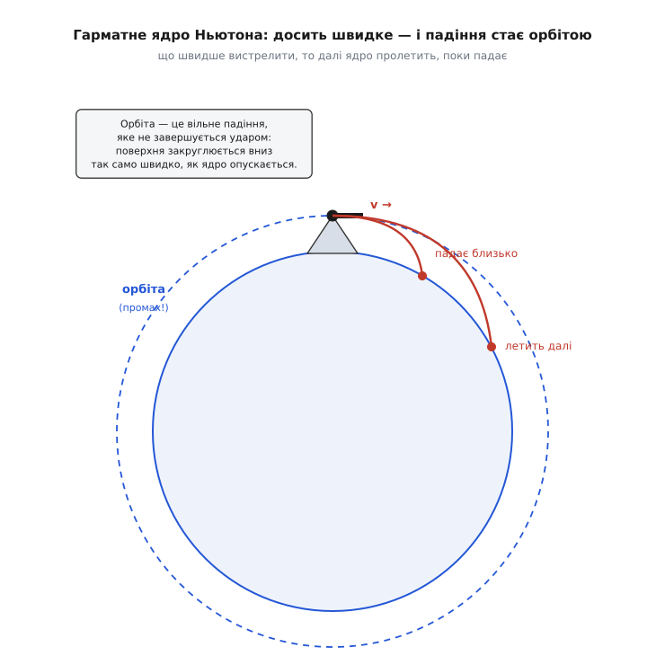
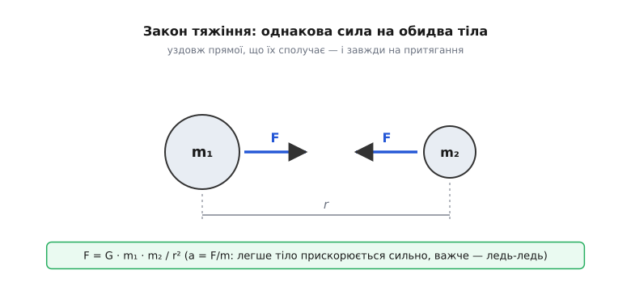

# Закон всесвітнього тяжіння: та сама сила, що ронить яблуко й тримає Місяць

<preknowlist>
- [Другий закон Ньютона](root:ph-mechanics/newtons-second-law) — сила дорівнює масі на прискорення (F = m·a); сила не «підтримує» рух, а змінює його.
- [Сила](root:ph-mechanics/force) — векторна дія однієї речі на іншу, має величину й напрям.
- [Прискорення](root:ph-mechanics/acceleration) — швидкість зміни швидкості; будь-яка ненульова сила дає прискорення.
- [Центрострімке прискорення](root:ph-mechanics/centripetal-acceleration) — тіло на коловій орбіті весь час прискорюється до центра: a = v²/r.
</preknowlist>

Двадцять століть небо й земля були двома різними фізиками. Тут, під ногами, усе падає, зношується, спиняється; там, угорі, Місяць і планети вічно кружляють і ніколи не спочивають. Здавалося очевидним, що це два окремі світи — земний, тлінний, і небесний, досконалий, — і що керують ними різні правила. Найсміливіша думка Ісаака Ньютона полягала в тому, що ніяких двох світів немає. Сила, яка тягне яблуко до землі, і сила, яка не пускає Місяць полетіти геть по прямій, — **одна й та сама сила**. Щойно ця думка виявилася правдою, небо й земля злилися в одну механіку, і та сама коротка формула стала правити і каменем у руці, і планетою на орбіті.

### Місяць — це камінь, що вічно падає

Найважче тут — повірити, що Місяць узагалі падає. Він же не наближається до нас, він кружляє. Але «падати» у фізиці означає не «летіти вниз», а «мати прискорення до чогось». І ось тут Ньютон зробив свій знаменитий уявний дослід із гарматою на високій горі.

Вистрелимо горизонтально. Ядро летить уперед і водночас падає — за секунду опускається на кілька метрів і врешті б'є об землю за кілометр. Насиплемо більше пороху — ядро летить швидше, падає так само, але встигає долетіти далі, перш ніж торкнеться землі. А тепер уявімо, що ми стріляємо так сильно, що поки ядро падає, **земля під ним встигає закруглитися й піти вниз рівно на стільки ж**. Тоді ядро падає — і промахується повз Землю. Падає ще — і знову промахується. Воно ніколи не долетить до поверхні, бо поверхня тікає з-під нього так само швидко, як воно опускається. Це і є орбіта (лат. *orbita* — «колія, коловий шлях»): **безкінечне падіння, яке ніяк не завершиться ударом**.

Місяць — таке саме ядро, тільки закинуте дуже далеко й дуже швидко. Він щомиті падає до Землі, щомиті промахується — і тому лишається кружляти. Та сама причина, що ронить яблуко, тримає Місяць: обидва падають до Землі, просто в яблука не вистачає бічної швидкості, щоб промахнутися.


*Гарматне ядро з горою Ньютона. Що більша початкова швидкість, то далі ядро встигає пролетіти, поки падає. За певної швидкості поверхня Землі закруглюється вниз так само швидко, як ядро опускається, — і воно падає «повз» планету, тобто виходить на колову орбіту. Орбіта — це падіння, яке промахується.*

### Одна формула на всі маси Всесвіту

Отже, тяжіння дотягується від Землі аж до Місяця. А до чого ще? Ньютонова відповідь була зухвало проста: **до всього**. Кожна маса у Всесвіті притягує кожну іншу масу. Не тільки Земля притягує тіла на ній — камінь притягує камінь, зоря притягує зорю, і навіть ви притягуєте сусіда в кімнаті (просто нестерпно слабко). Саме тому закон **всесвітній**: він не про Землю, він про будь-яку пару мас, де б вони не були.

Від чого має залежати ця сила? Що масивніше тіло, то дужче воно тягне — сила має рости з масою кожного з двох тіл. А що далі вони одне від одного, то слабше — сила має спадати з відстанню. Ньютон зібрав це в один вираз:

```
        m₁ · m₂
F = G · ─────────
          r²
```

де `m₁` і `m₂` — маси двох тіл, `r` — відстань між ними, а `G` — стала, однакова для всього Всесвіту. Сила спрямована вздовж прямої, що сполучає тіла, і завжди на притягання — тяжіння ніколи не відштовхує.

У цій формулі захована тонкість, яку легко проґавити: маси входять **симетрично**. Земля тягне яблуко рівно з такою ж силою, з якою яблуко тягне Землю, — це прямий наслідок [третього закону Ньютона](root:ph-mechanics/newtons-second-law). «Але ж Земля не рушає до яблука!» — рушає, тільки непомітно. Сила однакова, а прискорення — ні, бо прискорення це сила, поділена на масу. Яблуко масою 0.1 кг Земля тягне з силою ≈ 1 Н, і воно падає з прискоренням 9.8 м/с². Тією ж силою яблуко тягне Землю, але Земля важить 6·10²⁴ кг, тож її прискорення виходить ≈ 10⁻²⁵ м/с² — за все життя Всесвіту вона так не зрушить і на атом. Ось чому здається, ніби падає лише яблуко.


*Закон тяжіння між двома тілами. Сила пропорційна добутку мас і обернено пропорційна квадрату відстані; на обидва тіла діє однакова за величиною сила, спрямована одне до одного (третій закон). Легше тіло від цієї сили прискорюється сильно, важче — майже непомітно, бо a = F/m.*

### Чому саме квадрат відстані

Чому сила спадає як `1/r²`, а не як `1/r` чи `1/r³`? Тут є проста й глибока картинка. Уявімо, що від тіла тяжіння розходиться навсібіч рівномірно, як світло від крихітної лампи. На віддалі `r` уся ця «кількість впливу» розмазана по поверхні уявної кулі радіуса `r`. А площа кулі росте як `4πr²` — тобто як квадрат радіуса. Відійшли вдвічі далі — та сама «кількість» розмазалася по вчетверо більшій площі — отже, на одиницю площі припадає вчетверо менше. Утричі далі — увосьмеро... ні, у дев'ять разів менше. Звідси й береться квадрат: не тому, що хтось так забажав, а тому, що ми живемо у **тривимірному** просторі, де поверхня сфери масштабується як `r²`.

Ця геометрична причина — та сама, що робить обернено-квадратним і [закон Кулона](root:ph-electromagnetism/coulomb-law) для електричних зарядів: будь-який вплив, що розходиться від точки й ні на чому не «застряє», слабшає як `1/r²`. Тяжіння й електрика — родичі саме через цю спільну геометрію порожнього простору.

### Перевірка Місяцем

Красива ідея — ще не фізика. Ньютонові треба було **число**, яке можна порівняти з небом. І він його знайшов, зробивши те, що згодом назвуть «перевіркою Місяцем».

Логіка така. Біля поверхні Землі тіло падає з прискоренням `g = 9.8 м/с²`. Місяць — те саме тіло в тому самому полі, тільки далі. А наскільки далі? Виявляється, Місяць приблизно у 60 разів далі від центра Землі, ніж ми на поверхні. Якщо тяжіння справді спадає як `1/r²`, то прискорення Місяця до Землі має бути слабше в `60²  = 3600` разів. Це передбачення. Тепер порахуймо, з яким прискоренням Місяць насправді падає до Землі, — а це його [центрострімке прискорення](root:ph-mechanics/centripetal-acceleration), яке можна дістати з розміру орбіти й періоду обертання, не знаючи ніяких сил узагалі.

**Приклад (перевірка Місяцем).** Візьмімо відомі з астрономії числа й порівняймо два прискорення.

```
Відстань до Місяця:   r = 3.84·10⁸ м ≈ 60.3 радіуса Землі
Період обертання:     T = 27.3 доби = 2.36·10⁶ с

1) Скільки закон 1/r² ОБІЦЯЄ на такій віддалі:
   a = g / 60.3²  =  9.81 / 3636  ≈  2.70·10⁻³ м/с²

2) Скільки Місяць падає НАСПРАВДІ (центрострімке з орбіти):
   a = 4π²·r / T²  =  4π²·(3.84·10⁸) / (2.36·10⁶)²  ≈  2.72·10⁻³ м/с²
```

Два числа, здобуті геть різними шляхами — одне з падіння яблука на Землі, друге з руху Місяця по небу, — збіглися з точністю до відсотка. Це був момент, коли гіпотеза стала законом. Те саме тяжіння, послаблене рівно так, як велить квадрат відстані, керує і каменем, і супутником. Ньютон пізніше згадував, що в ті чумні роки, коли він порахував це вперше, числа зійшлися «доволі близько» — і саме ця близькість переконала його, що земне й небесне тяжіння — одне.

Уся драма народження цієї ідеї — юний Ньютон у Вулсторпі під час чуми, славнозвісне яблуко (яке він і справді згадував під кінець життя, хоч «на голову» воно ніколи не падало), суперечка з Робертом Гуком за першість і роль Едмонда Галлея, що змусив і оплатив видання «Начал», — зібрана в [окремій історії](root:ph-mechanics/newton-gravitation/hist-newton-principia.md).

### G — і як зважили Землю

У формулі лишилася нез'ясована буква — стала `G` (гравітаційна стала; від лат. *gravitas* — «вага, тягар»). Вона задає саму **силу** тяжіння: наскільки взагалі сильно маси тягнуться одна до одної. І тут ховається несподіванка — тяжіння приголомшливо слабке. Її значення:

```
G ≈ 6.674·10⁻¹¹  Н·м²/кг²
```

Щоб відчути, яке це мале число: дві гирі по тонні на відстані метра притягуються силою близько 10⁻⁴ Н — це вага порошинки. Тяжіння — найслабша з усіх сил природи, у незліченну кількість разів слабша за електричну. Чому ж тоді саме воно, а не електрика, керує планетами й галактиками? Бо тяжіння завжди на притягання й ніколи не гаситься: у великих тіл додатні й від'ємні заряди врівноважуються, а маса лише накопичується. Складіть досить багато маси — і найслабша сила стає володаркою космосу.

Сам Ньютон значення `G` не знав — його формула давала лише **пропорції** (у скільки разів одне тяжіння сильніше за інше), але не силу в ньютонах. Виміряти `G` означало впіймати тяжіння між двома звичайними тілами в лабораторії — а воно ж мізерне. Це вдалося аж через століття по «Началах»: 1798 року Генрі Кавендіш крутильними терезами вловив притягання між свинцевими кулями й тим самим уперше «зважив Землю».

Слово «зважив» тут точне. Щойно ми знаємо `G`, тяжіння одразу видає масу Землі. Адже прискорення `g` біля поверхні — це та сама формула, застосована до пари «Земля + тіло»:

```
        M_Землі
g = G · ─────────
          R²
```

де `R` — радіус Землі. Тут усе, крім `M`, вимірне: `g` і `R` знали здавна, `G` дав Кавендіш. Виражаємо масу:

**Приклад (зважити Землю).** Підставмо `g = 9.81`, радіус Землі `R = 6.37·10⁶ м` і виміряне `G`.

```
M = g·R² / G  =  9.81 · (6.37·10⁶)² / (6.674·10⁻¹¹)
  =  9.81 · 4.06·10¹³ / 6.674·10⁻¹¹
  ≈  5.97·10²⁴ кг
```

Шість септильйонів тонн — і все це з падіння тіл біля поверхні та крихітного закруту нитки в лабораторії. Кавендіш насправді шукав густину Землі й дістав ≈ 5.5 г/см³ (утричі за воду — отже, надра куди щільніші за каміння під ногами); значення `G` з його даних порахували вже пізніше. Як улаштований цей найтонший дослід, за що саме крутиться нитка й чому це справді «зважування планети» — у [розповіді про Кавендіша](root:ph-mechanics/newton-gravitation/hist-cavendish.md).

Та сама формула `g = G·M/R²` пояснює й буденне: чому на Місяці ви важите вшестеро менше (менша `M`, менший `R`), а на вершині гори — ледь-ледь менше, ніж унизу (більше `R`). Вага — не властивість тіла, а те, що тяжіння цієї конкретної планети робить із вашою масою в цьому конкретному місці. І оскільки `g` зовсім не залежить від маси тіла, що падає, усі тіла падають з однаковим прискоренням — той дивовижний факт, що з нього виростає [принцип еквівалентності](root:ph-mechanics/equivalence-principle).

### Від закону — до орбіт і законів Кеплера

Найбільший тріумф закону в тому, що з нього **виводяться** руху планет, які астрономи до Ньютона знали лише як загадкові емпіричні правила. За півстоліття до «Начал» Йоганн Кеплер, перекопавши спостереження Тихо Браге, встановив [три закони руху планет](root:ph-mechanics/keplers-laws): орбіти — еліпси, планета мете рівні площі за рівний час, а квадрат періоду пропорційний кубу розміру орбіти. Кеплер знав, *що* так є, але не знав *чому*. Ньютон показав: усі три — просто наслідки одного тяжіння `1/r²`.

Найлегше це побачити на коловій орбіті. Тіло тримається на колі, бо тяжіння постачає рівно ту центрострімку силу, якої треба:

```
 G·M·m         v²
───────  =  m·───     ⟹     v = √(G·M / r)
   r²           r
```

Маса супутника `m` скорочується — тому швидкість орбіти не залежить від того, що ви запускаєте: цеглину чи станцію, на цій висоті обидві мусять летіти однаково швидко. А підставивши сюди зв'язок швидкості з періодом, дістаємо рівно Кеплерів третій закон `T² ∝ r³`. Повне виведення — колова й еліптична швидкість, період, енергія орбіти й швидкість, потрібна, щоб відірватися від планети назавжди, — у [математичній вставці про орбіти](root:ph-mechanics/newton-gravitation/math-orbits-kepler.md).

> 🔧 **Навіщо це.** Кожен супутник на небі висить там за цією формулою. Хочете, щоб апарат обертався рівно за добу й тому «завмер» над однією точкою екватора (геостаціонарна орбіта для зв'язку й телебачення)? Прирівняйте `T` до 24 годин — і `v = √(G·M/r)` сама скаже єдину висоту, де це можливо: близько 36 тисяч кілометрів. Та сама механіка веде зонди до Марса й повертає екіпажі додому. А GPS іде ще далі: його супутники летять так швидко й так високо, що чистого Ньютона вже замало — доводиться враховувати поправки теорії відносності, інакше координати «попливли» б на кілометри за добу.

Побачити, як еліпс сам народжується з `1/r²`, можна й у коді: якщо крок за кроком рахувати силу й посувати планету, замкнена орбіта викреслюється сама — це маленький [симулятор двох тіл](root:ph-mechanics/newton-gravitation/proj-orbit-integrator.md).

### Де закон уступає

Закон Ньютона такий влучний, що ним досі водять кораблі до інших планет. Але він не остаточний — і сам Ньютон це відчував. Формула каже, *як* тяжіння діє, але мовчить, *чому* дві маси взагалі відчувають одна одну через порожнечу. Ідея миттєвої дії на відстані бентежила всіх, зокрема й самого автора. На докори він відповів знаменитою фразою «hypotheses non fingo» — «гіпотез не вигадую»: я описав тяжіння точною математикою, а вигадувати механізм, який із дослідів не випливає, не берусь.

Через два з чимось століття виявилася й перша тріщина в самій точності. Орбіта Меркурія повертається у просторі трохи швидше, ніж велить Ньютон, — на зайві 43 кутові секунди за століття (це помітив Урбен Левер'є ще 1859 року). Дрібниця, але вперта: скільки не додавай тяжіння інших планет, ці 43 секунди не сходяться. Розв'язок дав 1915 року Айнштайн: у [загальній теорії відносності](root:ph-quantum/general-relativity) тяжіння — не сила, що діє крізь порожнечу, а викривлення самого простору-часу масою, і тіла просто йдуть найпрямішими шляхами в цій викривленій геометрії. Її рівняння видали ті самі 43 секунди точно.

Отже, закон Ньютона — не помилка, а **межа** глибшої теорії: там, де швидкості малі проти світлової, а тяжіння не надто потужне (тобто майже скрізь у нашому житті), він дає відповіді, яких з головою вистачає, — і робить це незрівнянно простіше за Айнштайна.

### Що з цього лишається

Один рядок — `F = G·m₁·m₂/r²` — стягнув докупи те, що тисячі років здавалося непоєднанним. Яблуко й Місяць падають за тим самим правилом; планети кружляють, бо вічно промахуються повз Сонце; припливи в морях, форма Землі, шляхи комет і навіть обертання цілих галактик — усе це один і той самий закон, застосований до різних мас і відстаней. Ньютон не пояснив, *чому* існує тяжіння, — цього не зробив і ніхто після нього до кінця. Але він показав, що небо й земля слухаються однієї математики, — і саме тоді фізика вперше стала єдиною наукою про весь Всесвіт, а не окремими правилами для окремих його поверхів.
