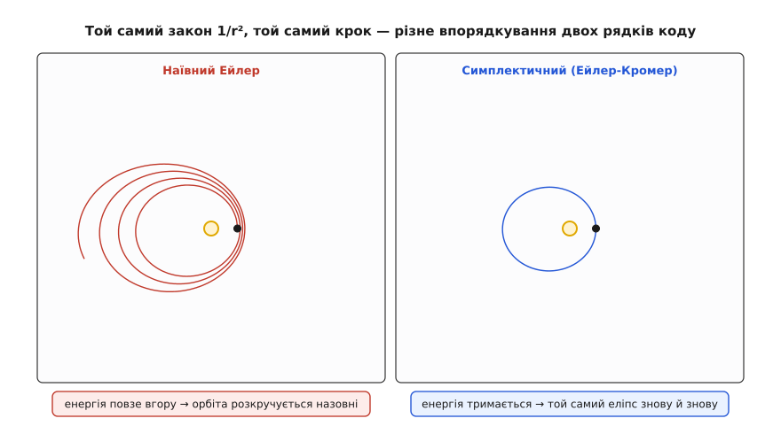
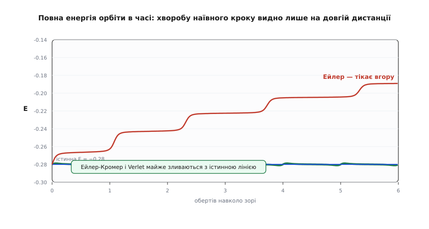

# ⚙️ Симулятор двох тіл: як еліпс викреслює себе сам

Ми знаємо весь закон, який керує планетою: тяжіння тягне її до зорі із силою `GM·m/r²`, а [другий закон Ньютона](root:ph-mechanics/newtons-second-law) перетворює силу на прискорення — `a = F/m`, тож маса планети скорочується й лишається чисте `a = GM/r²`, спрямоване до центра. Кеплерів еліпс для такого руху має готову формулу. Але спокуса тут в іншому: **не підставляти формулу еліпса, а взагалі про неї забути** — і попросити комп'ютер відкрити орбіту самотужки, знаючи лише місцеве правило «в цю мить сила напрямлена ось туди і має ось таку величину».

Задум простий до зухвалості. Візьмемо планету в якійсь точці з якоюсь швидкістю. Порахуємо силу тут і зараз. Трохи посунемо швидкість (бо є прискорення) і трохи посунемо саму планету (бо є швидкість). Порахуємо силу в новій точці. І так знову й знову, крихітними кроками `Δt`. Ніде в цьому циклі немає слова «еліпс» — є тільки `1/r²` і арифметика. Якщо наша фізика правдива, замкнений еліпс мусить викреслитися на екрані **сам**, без жодної підказки, якої він форми.

Це не пустощі. Щойно тіл стає троє, **короткої формули, як Кеплерів еліпс, більше не існує взагалі** — задача трьох тіл не розв'язується в елементарних функціях (це довів Пуанкаре наприкінці XIX століття). Єдиний спосіб, яким людство рахує, де завтра буде супутник Юпітера чи зонд по дорозі до Сатурна, — оце саме крокування. Тож навчитися чесно крокувати **два** тіла — це прочинити двері до всієї небесної механіки. А заразом — наткнутися на пастку, що ловить кожного новачка: найочевидніший спосіб кроку тихо бреше.

## Стан і закон руху

Усе, що описує планету цієї миті, — чотири числа: положення `(x, y)` і швидкість `(vₓ, v_y)`. Зоря сидить у початку координат. Відстань до неї — `r = √(x² + y²)`. Прискорення виписуємо просто з `GM/r²`, розклавши його на дві осі (напрямок до центра — це вектор `−(x, y)`, поділений на довжину `r`):

```
        x                    y
aₓ = −GM·───        a_y = −GM·───            (величина GM/r², напрям — до зорі)
        r³                   r³
```

Щоб числа були чисті, працюймо в одиницях, де гравітаційний параметр `GM = 1`. Це нічого не спрощує у фізиці — лише прибирає множники. Ось увесь апарат у коді: прискорення в точці й повна енергія, яка нам знадобиться як детектор брехні.

```py
import math

GM = 1.0                          # одиниці, де гравітаційний параметр = 1

def accel(x, y):
    r = math.hypot(x, y)          # відстань до зорі
    k = -GM / r**3                # спільний множник −GM/r³
    return k * x, k * y           # прискорення = −GM·(x, y)/r³, тягне до центра

def energy(x, y, vx, vy):
    return 0.5 * (vx*vx + vy*vy) - GM / math.hypot(x, y)   # ½v² − GM/r
```

Повна енергія `½v² − GM/r` для зв'язаної орбіти стала й від'ємна. Це наш головний свідок: справжня орбіта повторюється вічно, отже її енергія не має ні рости, ні спадати. Якщо в симуляції енергія попливла — попливла орбіта.

## Найпростіший крок: Ейлер

Означення прискорення й швидкості — це вже готовий алгоритм. Швидкість каже, як швидко міняється положення; прискорення каже, як швидко міняється швидкість. За малесенький проміжок `Δt` заморозимо їх сталими й посунемо обидві величини:

```
нове положення = положення + швидкість · Δt
нова швидкість = швидкість + прискорення · Δt
```

Це метод Ейлера — найпряміша дискретизація [похідної](root:math-analysis/derivative): похідна це відношення приростів, тож приріст ≈ похідна · крок. Запишімо крок так, щоб різні методи можна було порівняти на тому самому старті. Стан тримаємо списком `[x, y, vₓ, v_y]`, а функція-крок міняє його на місці:

```py
def step_euler(s, dt):
    x, y, vx, vy = s
    ax, ay = accel(x, y)
    s[0], s[1] = x + vx*dt,  y + vy*dt        # положення рухаємо СТАРОЮ швидкістю
    s[2], s[3] = vx + ax*dt, vy + ay*dt       # швидкість — старим прискоренням

def run(step, dt, nsteps, s0=(1.0, 0.0, 0.0, 1.2)):
    s = list(s0)
    E0 = energy(*s); emin = emax = E0
    for _ in range(nsteps):
        step(s, dt)
        e = energy(*s)
        emin, emax = min(emin, e), max(emax, e)
    return s, (emax - emin) / abs(E0)          # розмах енергії відносно початкової
```

Старт `(1, 0, 0, 1.2)` — це перигелій еліпса з витягнутістю `e = 0.44`: планета в найближчій точці, `1` одиниця від зорі, з поперечною швидкістю `1.2`. Період такої орбіти — близько `15` одиниць часу. Запустімо `8` обертів дрібним кроком `dt = 0.01` і подивімося на екран.

Орбіта **не замикається**. Замість того щоб раз по раз обводити той самий еліпс, планета щолапа відходить трохи далі — еліпс поволі розкручується назовні спіраллю. Наш код узявся нізвідки додавати планеті енергію.

**Один крок Ейлера власноруч (візьмімо навмисно грубий `Δt = 0.1`, щоб побачити ефект).** Старт у перигелії, `a = (−1, 0)`:

```
початок:   (x, y) = (1, 0),   (vₓ, v_y) = (0, 1.2),   E = −0.280

положення: x = 1 + 0·0.1     = 1.00      (рухаємо старою швидкістю)
           y = 0 + 1.2·0.1   = 0.12
швидкість: vₓ = 0 + (−1)·0.1 = −0.10
           v_y = 1.2 + 0     = 1.20

нова відстань r = √(1² + 0.12²) = 1.0072
нова енергія  E = ½(0.10² + 1.20²) − 1/1.0072 = 0.725 − 0.9929 = −0.268
```

За **один** крок енергія піднялася з `−0.280` до `−0.268` — на `0.012` з нічого. Помножте цей крадений дріб на тисячі кроків — і матимете спіраль. Ось цифри повного прогону: за 8 обертів кроком `0.01` енергія виростає з `−0.280` до `−0.175` (на 37%), а афелій роздувається з `2.57` аж до `4.39`. Симуляція вигадала третину орбітальної енергії.

## Чому Ейлер накачує енергію

Спокуса — звинуватити заокруглення: мовляв, комп'ютер рахує неточно. Це **не так**, і зрозуміти чому — половина справи. Річ у геометрії кроку, а не в машині.

Планета на орбіті весь час завертає **до зорі** — її шлях угнутий, загнутий усередину. А крок Ейлера прямий: він відкладає відрізок уздовж дотичної, по якій планета летить цієї миті. Пряма дотична до угнутої кривої завжди проходить **зовні** від неї. Тож куди б планета не рухалася, прямий крок ставить її трішки далі від зорі, ніж велить справжня крива. А прискорення ми ще й беремо в старій, ближчій точці — там, де воно на позір «правильне», але для нового, відсунутого положення вже застаріле. Дві похибки змовляються в один бік: назовні.


*Хвороба наївного кроку — геометрична, а не машинна. Крива орбіти загинається до зорі, а пряма дотична ні, тож крок `v·Δt` завжди трохи промахується назовні (ліворуч). Праворуч — той самий крок, записаний двома способами: наївний Ейлер рухає положення ще старою швидкістю й щокроку роздуває «площу» стану, а Ейлер-Кромер спершу оновлює швидкість і тим площу зберігає.*

Це міркування можна зробити точним. Біля будь-якої точки орбіта в площині «положення–швидкість» — це майже обертання, і найпростіша його модель — гармонічний осцилятор `dx/dt = v`, `dv/dt = −ω²x`. Крок Ейлера для нього — множення вектора `(x, v)` на матрицю `2×2`. У такої матриці є визначник — число, що каже, у скільки разів крок **розтягує площу** в площині стану:

```
                    ┌ 1      Δt ┐
Ейлер:   (x, v) ←   │           │ · (x, v)      det = 1 + (ω·Δt)²  >  1
                    └ −ω²Δt   1 ┘
```

Визначник `1 + (ω·Δt)²` **більший за одиницю**. А площа в площині стану — це, по суті, енергія (амплітуда в квадраті). Отже, щокроку площа й енергія множаться на щось трохи більше за `1` — і ростуть геометрично, лап за лапом. Це і є спіраль, виведена точно, без жодної згадки про заокруглення. Навіть на ідеальній арифметиці, з нескінченною точністю, `det > 1` — брехня зашита в **метод**, а не в машину. (Заокруглення [чисел із рухомою комою](root:hw-arch/floating-point) — то окремий, куди дрібніший гризун; тут воно ні до чого.) Зменшити `Δt` вдвічі — вдвічі сповільнити накачування, але ніколи його не спинити. Ейлер тече завжди.

## Однобуквене виправлення: Ейлер-Кромер

А тепер диво. Переставмо два рядки: оновімо спершу **швидкість**, а тоді посунемо положення вже **новою** швидкістю.

```py
def step_cromer(s, dt):
    x, y, vx, vy = s
    ax, ay = accel(x, y)
    vx, vy = vx + ax*dt, vy + ay*dt           # СПЕРШУ швидкість
    s[2], s[3] = vx, vy
    s[0], s[1] = x + vx*dt, y + vy*dt         # ПОТІМ рух — уже НОВОЮ швидкістю
```

Уся різниця з Ейлером — у тому, що в останньому рядку стоїть оновлена `vₓ, v_y` замість старої. Один символ. Проженімо той самий крок руками:

**Той самий крок, `Δt = 0.1`, але швидкість оновлюємо першою:**

```
початок:   (x, y) = (1, 0),   (vₓ, v_y) = (0, 1.2),   E = −0.280,   a = (−1, 0)

швидкість: vₓ = 0 + (−1)·0.1 = −0.10         (оновили ПЕРШОЮ)
           v_y = 1.2
положення: x = 1 + (−0.10)·0.1 = 0.99        (рух уже новою vₓ — усередину!)
           y = 0 + 1.20·0.1    = 0.12

нова відстань r = √(0.99² + 0.12²) = 0.9973
нова енергія  E = ½(0.10² + 1.20²) − 1/0.9973 = 0.725 − 1.0028 = −0.278
```

Замість того щоб лишити `x = 1`, крок посунув планету **всередину**, на `x = 0.99` — бо рухав її вже підкрученою швидкістю, що встигла хитнутися до зорі. Похибка з `+0.012` схудла до `+0.002`, і, головне, вона більше не тягне вперто в один бік. Проженіть це `8` обертів — і енергія тепер гойдається у волосяній смужці `[−0.281, −0.279]` і **нікуди не тікає**. Еліпс обводиться знову й знову, накладаючись сам на себе.


*Наслідок перестановки двох рядків. Обидві панелі — той самий старт, той самий крок `Δt = 0.02`, той самий закон тяжіння; різниця лише в порядку оновлення швидкості й положення. Ліворуч наївний Ейлер щолапа набирає енергію й розкручується назовні; праворуч Ейлер-Кромер тримає енергію й викреслює замкнений еліпс, який лягає сам на себе.*

## Чому цей фокус працює: площа фазового простору

Запишімо матрицю Ейлера-Кромера для того самого осцилятора й порахуймо її визначник:

```
                    ┌ 1 − ω²Δt²   Δt ┐
Кромер:  (x, v) ←   │                │ · (x, v)      det = 1   (точно!)
                    └ −ω²Δt       1  ┘
```

Визначник **точно дорівнює одиниці**. Крок не роздуває й не стискає площу в площині стану — він її **зберігає**. Такі перетворення, що бережуть площу фазового простору, звуть **симплектичними** (гр. *symplektikós* — сплетений, бо вони сплітають координати зі швидкостями в одну збережувану величину). А тут ховається залізний висновок: перетворення, що зберігає площу, **не може** відносити геть усі сусідні траєкторії — це роздуло б площу, чого воно робити не вміє. Тож орбіта опиняється **в пастці**: замкнена в тонкій оболонці навколо істини, вона гойдає енергію то вгору, то вниз щолапа, але прив'язана й ніколи не вирветься.

Глибша причина навіть красивіша. Симплектичний крок насправді **точно** зберігає не справжню енергію, а її ледь-ледь підправлену «тіньову» версію, що завжди сидить за волосину від справжньої. Ось чому справжня енергія гойдається, але не тікає: її тримає на прив'язі збережена тінь. Це дискретний відгомін глибокого зв'язку між симетрією й збереженням — того самого, що в неперервному світі дає [теорему Нетер](root:ph-mechanics/noether-theorem): де є збережена структура, там величина не пливе.

Чесна засторога: Ейлер-Кромер не бездоганний. Його еліпс поволі **прецесує** — велика вісь помаленьку обертається (за наших `dt` афелій за `8` обертів зсувається десь на градус від рівно протилежної перигелію точки). Розмір і енергію крок береже, а точну орієнтацію — ні. Але орбіта від цього не розсипається, а це і є вся суть: краще трохи повернутий, зате вічно живий еліпс, ніж точний на око, зате фальшива спіраль.

## Ще краще: leapfrog (метод Верле)

Ейлер-Кромер симплектичний, але грубуватий — його похибка спадає лише як `Δt` (перший порядок). Наступна сходинка коштує майже стільки ж, а точніша на порядок: **leapfrog**, він же метод Верле у «швидкісній» формі. Він другого порядку (похибка `~ Δt²`), теж симплектичний, ще й оборотний у часі — і все це за **один** рахунок сили на крок. Кращої угоди в чисельному інтегруванні немає.

Форма «півштовх–дрейф–півштовх» (kick–drift–kick): піврозгін швидкості, повний зсув положення, ще піврозгін уже з новою силою:

```py
def step_verlet(s, dt):
    x, y, vx, vy = s
    ax, ay = accel(x, y)
    x  = x + vx*dt + 0.5*ax*dt*dt             # дрейф: рух із піврозгоном
    y  = y + vy*dt + 0.5*ay*dt*dt
    ax2, ay2 = accel(x, y)                    # сила вже в НОВІЙ точці
    vx = vx + 0.5*(ax + ax2)*dt               # швидкість — середнім із двох прискорень
    vy = vy + 0.5*(ay + ay2)*dt
    s[0], s[1], s[2], s[3] = x, y, vx, vy
```

Проженіть його — і енергія тримається пласко до п'ятого знака за ті самі `8` обертів. Саме тому leapfrog — робочий кінь симуляцій галактик і молекулярної динаміки, де крокують мільярдами кроків і жодного дрейфу терпіти не можна. Історія методу довша за його славу: у сучасну форму його ввів французький фізик Лу Верле (Loup Verlet) 1967 року для моделювання рідин, але той самий крок норвежець Карл Штермер застосовував ще 1907-го для руху заряджених частинок у магнітному полі, а Cowell і Crommelin ним рахували орбіту комети Галлея 1909 року — геометрично ж його вживав ще сам Ньютон. *(Статус: усталена історія чисельних методів.)*

Оборотність у часі — окрема краса leapfrog. Оберніть час назад (змініть знак швидкостей) — і крок **точно** відмотає траєкторію назад, лапа в лапу. Наївний Ейлер так не вміє: його спіраль має вбудовану стрілу часу, назад вона не змотується. Саме ця симетрія й тримає енергію так вірно.

Кернел leapfrog — це той самий гарячий цикл, який у справжніх розрахунках N-тіл крутиться мільярди разів; там його пишуть не задля читабельності, а задля швидкодії, тісно й без зайвих алокацій. Той самий крок — прозоро Python-ом для розуміння і щільно C++ для гарячого циклу:

:::tabs
```py
# демо-мова: прозоро, стан — простий список
def accel(x, y):
    inv = -GM / (x*x + y*y)**1.5              # −GM / r³
    return inv*x, inv*y

def verlet_step(s, dt):
    x, y, vx, vy = s
    ax, ay = accel(x, y)
    x += vx*dt + 0.5*ax*dt*dt                 # дрейф
    y += vy*dt + 0.5*ay*dt*dt
    ax2, ay2 = accel(x, y)                    # сила в новій точці
    s[0], s[1] = x, y
    s[2] = vx + 0.5*(ax + ax2)*dt             # швидкість — середнім прискоренням
    s[3] = vy + 0.5*(ay + ay2)*dt

s = [1.0, 0.0, 0.0, 1.2]
for _ in range(100_000_000):                  # сто мільйонів кроків — і енергія не тікає
    verlet_step(s, 0.01)
```
```cpp
// гарячий цикл: тісно, без алокацій — так рахують N-тіл насправді
#include <cmath>
struct Body { double x, y, vx, vy; };
constexpr double GM = 1.0;

static inline void accel(double x, double y, double& ax, double& ay) {
    double r2 = x*x + y*y;
    double inv = -GM / (r2 * std::sqrt(r2));  // −GM / r³
    ax = inv*x;  ay = inv*y;
}

static inline void verlet_step(Body& b, double dt) {
    double ax, ay;  accel(b.x, b.y, ax, ay);
    b.x += b.vx*dt + 0.5*ax*dt*dt;            // дрейф
    b.y += b.vy*dt + 0.5*ay*dt*dt;
    double ax2, ay2;  accel(b.x, b.y, ax2, ay2);  // сила в новій точці
    b.vx += 0.5*(ax + ax2)*dt;                // швидкість — середнім прискоренням
    b.vy += 0.5*(ay + ay2)*dt;
}

int main() {
    Body b{1.0, 0.0, 0.0, 1.2};
    for (long i = 0; i < 100'000'000L; ++i)   // сто мільйонів кроків
        verlet_step(b, 0.01);
}
```
:::

## Перевірка рівних площ: другий закон Кеплера прямо з коду

У нас є ще один свідок правдивості, незалежний від енергії, — і це прямо Кеплерів **закон рівних площ**: відрізок від зорі до планети замітає рівні площі за рівні проміжки часу. Площа тонкого трикутничка, який радіус замітає за один крок, — це половина векторного добутку радіуса на переміщення, тобто `½·(x·v_y − y·vₓ)·Δt`. Вираз у дужках,

```
L = x·v_y − y·vₓ
```

— це питомий момент імпульсу (момент імпульсу на одиницю маси). Для сили, спрямованої точно до центра, він зберігається строго: рівні площі — це і є [збереження моменту імпульсу](root:ph-mechanics/angular-momentum). Тож `L` — готовий детектор: друкуй його щокроку й дивись, чи тримається.

```py
def angmom(x, y, vx, vy):
    return x*vy - y*vx                        # питомий момент імпульсу

L0 = angmom(1.0, 0.0, 0.0, 1.2)               # на старті L = 1·1.2 = 1.2
for name, step in [("Ейлер", step_euler), ("Кромер", step_cromer), ("Verlet", step_verlet)]:
    s, spanE = run(step, 0.01, int(8*15/0.01))   # 8 обертів, dt = 0.01; run повертає кінцевий стан
    print(f"{name:7} розмах E/|E₀| = {spanE:5.3f}   ΔL = {abs(angmom(*s) - L0):.1e}")
```

Виміряні числа кажуть усе:

```
Ейлер    розмах E/|E₀| = 0.375     ΔL = 2.0·10⁻¹
Кромер   розмах E/|E₀| = 0.008     ΔL = 2.0·10⁻¹⁵
Verlet   розмах E/|E₀| = 0.000     ΔL = 1.3·10⁻¹⁴
```

Обидва симплектичні методи тримають `L` до `10⁻¹⁴` — **машинної точності**. Це не випадковість: і для Кромера, і для leapfrog момент імпульсу зберігається до останнього біта саме тому, що штовхок швидкості напрямлений уздовж `r` (а `r × r = 0`, отже не крутить), а дрейф до `x·v_y − y·vₓ` теж нічого не додає. Рівні площі виходять **точно** — Кеплерів другий закон дістається задарма. А наївний Ейлер за ті самі `8` обертів губить `0.20` моменту імпульсу: його сектори **не рівні**, і це просто інше обличчя тієї самої вигаданої енергії.


*Той самий діагноз у часі. Наївний Ейлер щооберт піднімає повну енергію — орбіта розкручується; Ейлер-Кромер і Verlet тримають її пласко біля істинного значення (їхні криві майже зливаються з пунктиром). Хвороба Ейлера непомітна за один оберт і очевидна за шість — тому інтегратор і не можна судити по короткому прогону.*

> 🔧 **Навіщо це.** Правило просте: якщо ваш орбітальний симулятор тримає момент імпульсу й енергію, Кеплерові закони випадають з нього самі — і навпаки, дрейф будь-якої з цих величин одразу викриває або баг, або текучий метод. Тому в реальних розрахунках — від ефемерид супутників до симуляцій зіткнення галактик — щокроку стежать саме за збереженими величинами, а не за гарною картинкою першого витка.

## Складність і пастки

**Ціна кроку.** Ейлер, Кромер і leapfrog коштують по **одному** рахунку сили на крок — тож повний прогін це `O(кроків)`. Але для `N` тіл на кожному кроці треба перебрати всі пари, а їх `~N²` — оце та стіна, об яку б'ються симуляції галактик; її пробивають деревними методами (Barnes-Hut, FMM), що зрізають вартість до `O(N·log N)` чи навіть `O(N)`.

**Пастка «точнішого» методу.** Славетний Рунге-Кутта 4-го порядку точніший за крок (похибка `~ Δt⁴`) — і його часто хапають за замовчуванням. Але він **не симплектичний**: на довгому прогоні його енергія все одно поволі пливе, ще й коштує він чотири рахунки сили на крок. Для довгих небесних інтегрувань дешевий симплектичний б'є дорогий точний: на мільярді кроків потрібна **обмежена** похибка, а не крихітна, що все одно накопичується.

**Крок і найшвидша ділянка.** На витягнутій орбіті планета шмагає крізь перигелій і ледь повзе в афелії. Сталий `Δt`, що добре розділяє перигелій, марнує зусилля в афелії; а зручний для афелію — недороздільнює перигелій, і саме там похибка стрибає. Ліки — адаптивний крок (але наївна адаптивність **ламає симплектичність**, тож беруть час-симетричні схеми) або заміну координат (регуляризацію), що згладжує шмагання біля зорі.

**Особливість у нулі.** У знаменнику стоїть `r³`, і на близькому проході (комета майже черкає зорю, два тіла зіштовхуються) `r → 0` вибухає — один монструозний крок може жбурнути тіло на нескінченність. Тому в N-тіл силу «пом'якшують»: `r²  → r² + ε²`, обрізаючи пік так, щоб близький промах не рвав симуляцію.

**Не суди по одному витку.** Наївний Ейлер на **один** оберт виглядає чудово — хвороба видно лише на багатьох. Завжди ганяй інтегратор на **довгих** прогонах і стеж за збереженою величиною, а не милуйся першим гарним колом.

**Метод проти машини.** Дрейф, який ми ловили весь час, — це похибка **методу**, не [заокруглення](root:hw-arch/floating-point). Але коли метод уже такий добрий, як leapfrog, наступним ворогом стає саме додавання мільйонів крихітних кроків: тут рятує компенсоване підсумовування, що не дає загубитися молодшим бітам.

## Що з цього лишається

Еліпс викреслився сам — з нічого, крім правила «сила напрямлена сюди, ось такої величини», прикладеного знову й знову. Ніде в коді не було рівняння еліпса; форма орбіти вже **сиділа** в місцевому законі, чекаючи, поки її розмотають кроками. Це перший урок. А другий гостріший: **як** саме розмотувати — у якому порядку виконати два рядки — вирішує, побачите ви позачасовий Кеплерів еліпс чи вигадану спіраль. Той самий закон, той самий крок, та сама арифметика — і протилежні світи, розведені однією перестановкою. Постав силу правдиво, а крокування чесно — і той самий цикл, що обводить цей еліпс, поведе зонд до Сатурна.
