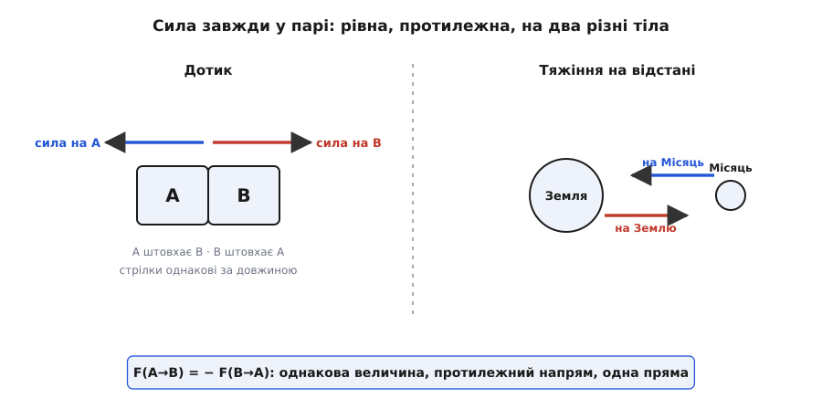
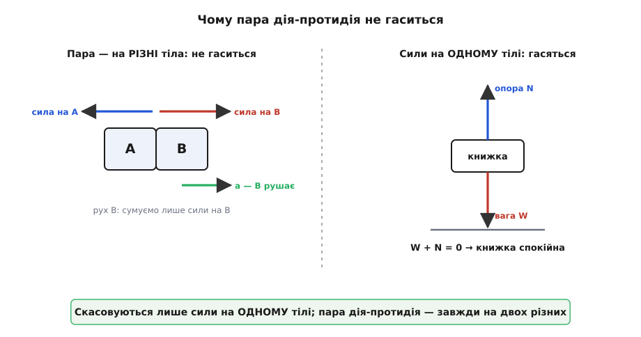
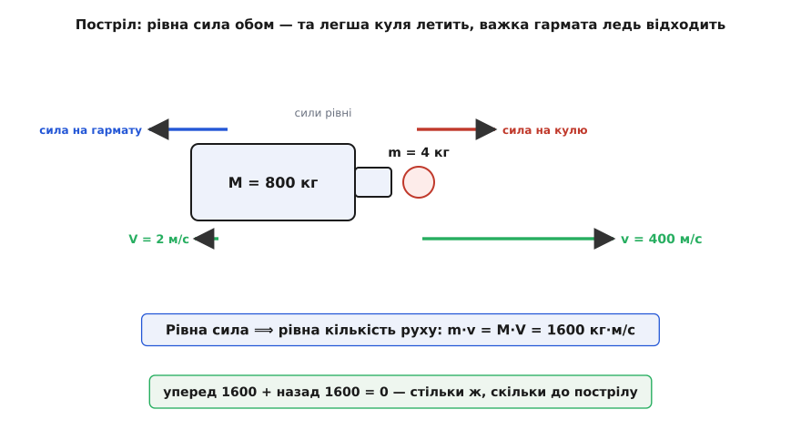

# Третій закон Ньютона: сила завжди приходить парою

<preknowlist>
- [Сила](root:ph-mechanics/force) — векторна дія одного тіла на інше; має величину й напрям, міряється в ньютонах.
- [Маса](root:ph-mechanics/mass) — міра інертності тіла: наскільки важко змінити його рух. Одиниця — кілограм.
- [Прискорення](root:ph-mechanics/acceleration) — швидкість зміни швидкості: куди й наскільки хутко міняється рух.
- [Другий закон Ньютона](root:ph-mechanics/newtons-second-law) — прискорення дорівнює силі, поділеній на масу: a = F/m.
- [Кількість руху](root:ph-mechanics/momentum) — запас руху тіла, добуток маси на швидкість: p = m·v.
</preknowlist>

Притисніть долоню до стіни й натисніть. Ви тиснете на стіну — а що відчуваєте самі? Стіна тисне на долоню, точно з тією ж силою. Натиснете легко — легкою буде й відсіч; наляжете щосили — стіна відповість щосили, аж пальці біліють. У неї немає ні м'язів, ні наміру відповідати — а вона відповідає, і рівно стільки, скільки дали ви. Штовхнути стіну, не діставши того самого назад, просто неможливо.

Це не примха стіни. Так поводиться **кожна** сила без винятку, і ось чому. Сила — не річ, яку одне тіло має в собі й виливає на інше. Сила — це **взаємодія** двох тіл, а у взаємодії завжди два кінці. Веслуєте — весло жене воду назад, і та сама вода жене човен уперед. Стріляєте — порохові гази штовхають кулю вперед, і ті самі гази б'ють прикладом вам у плече. [Земля тягне яблуко](root:ph-mechanics/newton-gravitation) вниз — і яблуко з такою самою силою тягне Землю вгору. Немає сили-одиначки; є лише пари.

Ньютон звів це у третій закон руху і поставив його поруч із двома іншими у «Началах» (Philosophiæ Naturalis Principia Mathematica, 1687). Словами: на кожну дію є завжди рівна їй і протилежна протидія. Мовою сил: якщо тіло A діє на тіло B із силою F(A→B), то B діє на A із силою тієї самої величини, спрямованою в протилежний бік:

```
F(A→B) = − F(B→A)
```

Увесь зміст — у знаку «мінус» і в тому, чого рівність **не** промовляє вголос. Мінус означає: однакова довжина, протилежний бік, уздовж однієї прямої, що з'єднує тіла. А мовчазне, але найважливіше — ці дві сили прикладені до **різних тіл**: одна до B, друга до A. Народжуються вони разом, тієї самої миті: немає «дії» раніше й «протидії» згодом — обидві є одночасно, поки триває взаємодія. Слова «дія» і «протидія» (лат. *actio* — «дія», *re-* — «навзаєм, у відповідь») тут рівноправні: котру із двох сил назвати дією — байдуже, пара цілком симетрична.


*Сила завжди у парі. При дотику (ліворуч) тіло A штовхає B, а B рівно так само штовхає A. При тяжінні на відстані (праворуч) Земля притягує Місяць — і Місяць притягує Землю з такою ж силою, хоч їхні маси незмірно різні. Обидві сили пари рівні за величиною й протилежні за напрямом.*

### Чому пара не гаситься

Тут чигає найпідступніша пастка думки. Сили рівні й протилежні — то, може, вони просто гасять одна одну, і тоді ніщо ніколи не зрушить з місця? Кінь тягне воза вперед, віз за третім законом тягне коня назад із такою ж силою — звідки ж тоді береться рух?

Розв'язок простий, і його варто закарбувати: дві сили пари діють на **різні тіла**, а щоб дізнатися, як рухається якесь тіло, складають лише сили, прикладені **до нього самого**. Сила коня прикладена до воза; сила воза — до коня. Вони в різних рахунках і ніколи не потраплять в одну суму, тому й скасувати одна одну не можуть у принципі. Віз рушає, бо на нього, крім коня, діє ще тертя коліс об землю — і щойно кінь пересилює це тертя, лишок штовхає воза вперед.

Сили гасяться лише тоді, коли прикладені **до одного тіла**. Книжка лежить на столі спокійно, бо на неї діють дві сили нараз: вага тягне вниз, опора стола підпирає вгору, і вони справді рівні та протилежні — обидві на книжці. Але це **не** пара «дія-протидія». Партнер ваги (Земля тягне книжку вниз) — це книжка, що тягне Землю вгору; партнер реакції стола (стіл штовхає книжку вгору) — це книжка, що тисне на стіл униз. Кожна пара — на двох різних тілах; а на книжці гасяться дві сили з **різних** пар, які просто випадково зрівнялися.


*Пара дія-протидія завжди прикладена до двох різних тіл, тому не скасовується (ліворуч): щоб знайти рух тіла, сумують лише сили на ньому, і B рушає. Скасуватися можуть тільки сили, прикладені до одного тіла (праворуч): вага й реакція опори на книжці дають нуль — і книжка спокійна.*

### Однакова сила — різний рух

Сили в парі рівні завжди. А рух, який вони спричиняють, — майже ніколи. Причина — у [другому законі Ньютона](root:ph-mechanics/newtons-second-law): прискорення дорівнює силі, поділеній на масу, a = F/m. Сила та сама, але поділити її треба на масу — тож легше тіло дістає велике прискорення, а важке при тій самій силі ледь ворухнеться.

Відштовхніться на ковзанах від стіни: ви покотитеся назад, а стіна (а з нею вся Земля) — ні. Сила на вас і сила на Землю рівні, але ваша маса — десятки кілограмів, а Землі — секстильйони тонн, тож усе прискорення дістається вам. Так само стрибок угору штовхає Землю вниз — на незмірно малу частку, якої ніхто й ніколи не виміряє. Ось звідки стара оманлива інтуїція: ми бачимо, як летить куля, і не бачимо, як відходить гармата, — а сила на обох була однакова.

**Задача.** Гармата масою 800 кг стріляє ядром 4 кг; ядро вилітає зі швидкістю 400 м/с. З якою швидкістю відкотиться гармата?

```
Ядро й гармату той самий тиск газів штовхає той самий час —
отже, обидва дістають рівну за величиною кількість руху, у протилежні боки.

Кількість руху ядра:   p = m · v = 4 · 400 = 1600 кг·м/с (уперед)
Стільки ж дістає гармата, назад:   M · V = 1600
Швидкість відкоту:      V = 1600 / 800 = 2 м/с (назад)
```

Гармата вдвісті разів важча за ядро — і відходить рівно вдвісті разів повільніше. Однакова сила, однаковий час її дії, а швидкості різняться у двісті разів: усе вирішила маса.

### Найглибший зміст: збереження кількості руху

У цій задачі сховано щось значно більше за розрахунок відкоту. Придивімося. Сили пари рівні й діють однаковий час, отже, дають однаковий за величиною **поштовх** (силу, помножену на час), тільки в протилежні боки. А поштовх — це і є зміна [кількості руху](root:ph-mechanics/momentum). Виходить, скільки кількості руху набуває одне тіло, стільки ж втрачає друге. Додаймо їхні кількості руху разом: приріст одного точно гасить спад другого, і **сумарна кількість руху двох тіл не міняється зовсім** — хоч би як шалено вони взаємодіяли.

Перевірмо на гарматі. До пострілу все спокійне, сумарна кількість руху — нуль. Після: ядро несе 1600 уперед, гармата 1600 назад, разом — знову нуль. Рахунок збігся до останку. Це **закон збереження кількості руху**, і він — найглибше обличчя третього закону. Для будь-якої замкненої системи, на яку не діють сили ззовні, усі внутрішні пари дія-протидія гасяться в загальній сумі, тож повна кількість руху системи стоїть незмінна навіки: усередині можуть коятися зіткнення, вибухи, розриви — а сума не здригнеться.


*Постріл із нерухомої гармати: сила на ядро й сила на гармату рівні (короткі стрілки однакові), але швидкості різні — легке ядро летить, важка гармата ледь відходить. Кількості руху рівні й протилежні, m·v = M·V, а разом дають нуль — стільки ж, скільки було до пострілу.*

> 🔧 **Навіщо це.** Так рухається все, що взагалі рухається саме. Щоб податися вперед, треба щось відкинути назад — іншого способу немає. Нога пішохода штовхає землю назад (за це чіпляється [тертя](root:ph-mechanics/friction)), і земля штовхає пішохода вперед; плавець жене воду назад — вода жене плавця вперед; ракета викидає розжарений газ назад — і летить уперед навіть у порожнечі космосу, де відштовхнутися нема від чого, крім власного викиду. Тому ж не можна підняти себе за волосся: рука й волосся — одне тіло, їхні сили внутрішні й гасяться. А от космонавт, що безпорадно завис поряд із кораблем, повернеться до нього, просто щосили жбурнувши геть гайковий ключ.

**Задача.** Космонавт масою 80 кг нерухомо висить у відкритому космосі й кидає ключ масою 1 кг зі швидкістю 8 м/с. Куди й як швидко полине сам космонавт?

```
До кидка сумарна кількість руху = 0, і такою вона й лишиться.

Ключ забирає вперед:   p = 1 · 8 = 8 кг·м/с
Космонавт дістає стільки ж назад:   80 · V = 8
Швидкість космонавта:  V = 8 / 80 = 0.1 м/с (у бік, протилежний ключу)
```

Десята метра за секунду — повільно, та цього досить: за хвилину космонавт відпливе на шість метрів у потрібний бік. Він рушив, ні від чого не відштовхуючись, — лише поділивши з ключем ту нульову кількість руху, що була.

### Діє й на відстані

Третій закон не потребує дотику. Земля притягує Місяць — і Місяць притягує Землю з такою самою силою; тому обидва кружляють не один навколо одного, а навколо спільного [центра мас](root:ph-mechanics/center-of-mass), і Земля ледь помітно похитується в такт місячному обертові. Два магніти, два заряди — усюди та сама рівна взаємність. Ньютон особливо наполягав, що закон чинний і для тяжіння на відстані, а не тільки для поштовхів.

Тут, щоправда, ховається межа простої картини. Коли сила передається не миттєво, а мандрує від тіла до тіла зі скінченною швидкістю — як поле рухомого заряду, що доходить до іншого заряду лише через мить, зі швидкістю світла, — «рівні й протилежні просто зараз» може на коротку хвилю не справдитися. Кількість руху при цьому не зникає: її на час підхоплює саме **поле**, яке теж несе кількість руху. Долучиш до рахунку поле — і баланс знову сходиться до останку. Як це виглядає докладно й чому збереження кількості руху виявляється навіть міцнішим за сам третій закон — [окреме виведення](root:ph-mechanics/newtons-third-law/math-momentum-conservation.md). А як цей закон визрівав — від суперечок про зіткнення тіл, які Лондонське королівське товариство винесло на змагання 1668 року, до Ньютонових «Начал» — [коротка історія](root:ph-mechanics/newtons-third-law/hist-third-law.md).

Побачити збереження кількості руху на власні очі найлегше числом: [маленька симуляція зіткнень](root:ph-mechanics/newtons-third-law/proj-collision-sim.md) стежить за кількома тілами, що взаємодіють лише парами дія-протидія, і показує, як їхня спільна кількість руху тримається сталою до останнього знаку.

Отож сила — ніколи не самотній поштовх, а радше рукостискання: не можна діяти на світ, щоб світ не діяв на тебе — рівно так само й рівно протилежно. Кожен твій натиск є заразом натиском на тебе; кожен рух, який ти десь починаєш, започатковує рівний і протилежний рух деінде. Всесвіт веде свій рахунок бездоганно.
