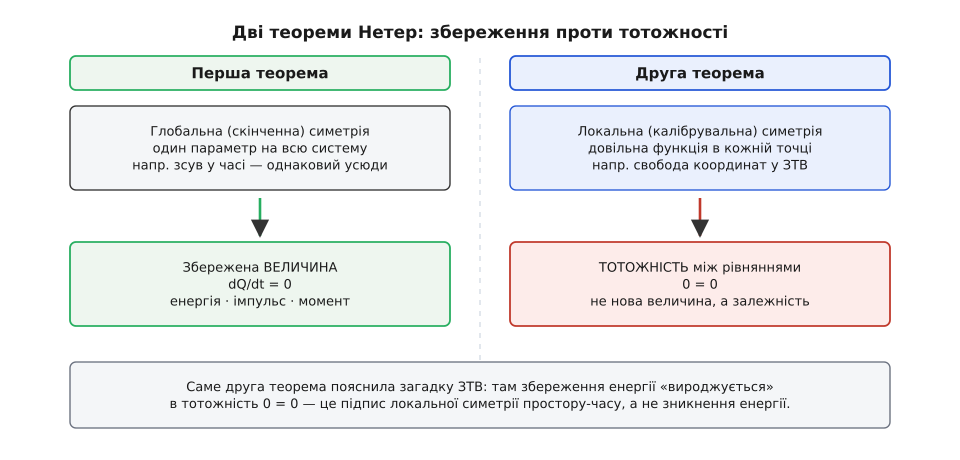

# 📜 Як загадка зниклої енергії покликала Емілі Нетер

1915 рік, Ґеттінґен — найкраще математичне місто світу. Двоє з найбільших математиків доби, Давид Гільберт (David Hilbert) і Фелікс Клейн (Felix Klein), застрягли на одній тонкій дивовижі. Ейнштейн саме доводив до пуття загальну теорію відносності — теорію тяжіння як викривлення простору-часу, — а Гільберт мчав тим самим шляхом майже пліч-о-пліч із ним. І десь у нових рівняннях коївся конфуз, від якого віяло скандалом: звичне, майже священне збереження енергії поводилося не так. Там, де стара фізика ставила твердий закон «енергія не виникає й не зникає», у рівняннях загальної відносності вилазила порожнеча — рівність виду 0 = 0. Тотожність, яка нічого не забороняє й нічого не стверджує. Здавалося, ніби в найглибшій теорії про простір, час і гравітацію найнадійніший закон фізики просто розчиняється в повітрі.

Щоб розплутати цей вузол, Гільберт і Клейн покликали до Ґеттінґена людину, яка знала про інваріанти більше за будь-кого живого. Цією людиною була жінка — Емілі Нетер (нім. Amalie Emmy Noether). І ось найгостріший бік історії: у ту саму мить, коли двоє найповажніших професорів запрошували її розв'язати одну з найтонших загадок фізики, той самий університет забороняв їй офіційно читати лекції — бо вона була жінкою. Із цього подвійного вузла — фізичної загадки й людської несправедливості — і народилася теорема, що досі тримає всю фундаментальну фізику.


*Півстоліття життя: від дівчинки, яку не пускали на університетську лаву, до математикині, чиє ім'я носять і теорема у фізиці, і цілий клас алгебраїчних об'єктів.*

## Дівчинка з Ерлангена

Емілі Нетер народилася 23 березня 1882 року в баварському Ерлангені, у заможній німецькій родині єврейського походження. Це варто сказати точно: німкеня, уродженка Баварії, з єврейської сім'ї — і кожен із цих вимірів згодом важитиме в її долі окремо. Батько, Макс Нетер (Max Noether), був відомим математиком, професором того самого Ерлангенського університету; математика оточувала дівчину змалку, як інших оточують музика чи торгівля.

Але оточувати — не означає пускати. У тодішній Німеччині жінці шлях до університету був майже замурований. Нетер не могла просто записатися студенткою: вона мусила відвідувати лекції як вільна слухачка, за окремим дозволом кожного професора, який мав право їй і відмовити. Аж коли правила трохи попустили, вона склала іспити й дістала право на повноцінне навчання. У 1907 році — докторат в Ерлангені, під орудою Пауля Ґордана (Paul Gordan), майстра, якого сучасники звали «королем теорії інваріантів».

Ґорданова школа була суто обчислювальною: інваріант — це комбінація, що не міняється при певних перетвореннях, і Ґордан із учнями виводили їх голими руками, стос за стосом. Дисертація Нетер у цьому дусі й закінчувалася списком із понад трьохсот явно виписаних інваріантів — гора чесної, виснажливої лічби. Найкрасномовніше, що сама вона згодом судила ту роботу нещадно: називала дисертацію коротким німецьким словом «Mist» — буквально «гній», а по суті «казна-що», «мотлох». Це не кокетство. У цьому вироку вже чути майбутню Нетер: людину, якій обчислювати конкретні приклади було нудно, а хотілося бачити **чому** — загальну структуру, з якої всі ці приклади випадають самі. Саме цей поворот від лічби до структури зробить її згодом однією з творчинь сучасної алгебри. Але то попереду; поки що — молода докторка наук без жодної надії на посаду, бо посад для жінок не існувало. Кілька років вона безоплатно викладала в Ерлангені, часто заміняючи хворого батька.

## Загадка, якої не було в Ньютона

Щоб зрозуміти, навіщо її покликали в Ґеттінґен, треба відчути, що саме там не сходилося.

У звичайній фізиці збереження енергії тверде, як стіл. Але Ейнштейнова загальна теорія відносності збудована на незвичайній свободі: у ній можна як завгодно переназвати координати простору-часу — розтягти, зігнути, перемішати сітку, якою ми розмічаємо події, — і закони фізики не зміняться. Ця свобода зветься загальною коваріантністю; вона й є серцем теорії, бо каже, що тяжіння — не сила на тлі жорсткої сцени, а сама геометрія сцени. Свобода прекрасна — але за неї довелося платити несподівану ціну.

Коли Гільберт і Клейн узялися виписувати для цієї теорії закон збереження енергії, він вироджувався. Замість змістовного твердження «ось величина, і вона стала» виходила рівність, що виконувалася сама собою за будь-якого руху, — тотожність 0 = 0. Гільберт навіть висловив здогад, що в теоріях із такою свободою збереження енергії **завжди** мусить бути такою «несправжньою» тотожністю, на відміну від звичайних теорій. Ейнштейнові це не подобалося: він не погоджувався, що його закон збереження порожній, і між ученими точилася жвава суперечка. Хтось мав нарешті сказати строго й до кінця: що це за виродження, звідки воно береться і що насправді означає. Це була не так фізична, як **математична** задача про інваріанти — а на інваріантах ніхто не знався краще за молоду докторку з Ерлангена.

## Ґеттінґен кличе

На початку 1915 року Гільберт і Клейн запросили Нетер до Ґеттінґена. Мотив був прямий і засвідчений: Гільберт заглибився у фізику відносності, впритул до Ейнштейнових ідей, — і зрозумів, що йому потрібен фаховий знавець теорії інваріантів. Такий знавець в усій Німеччині був один, і це була вона.

Нетер узялася до діла з тією потугою, яка згодом стане легендою. Вона не просто допомогла — вона довела результати, що лягли в самісіньку основу того, як фізики відтоді розуміють симетрію й збереження. Ейнштейн, побачивши її викладки, написав Гільбертові захоплений відгук: тут працює справжня сила, а не помічниця на побігеньках. Задачу про зниклу енергію належало розв'язати не латкою, а поглядом згори — і Нетер саме такий погляд і принесла.

## «Ми університет, а не лазня»

І тут історія робить свій найгіркіший поворот. Жінка, без якої двоє найбільших математиків не могли дати ради з фізикою, за законом не мала права обійняти навіть найнижчу викладацьку посаду — приват-доцента. Для цього потрібна габілітація (право читати лекції від власного імені), а жінок до неї не допускали.

Гільберт бився за неї на факультетських зборах, і опір був брутальний. Один із професорів обурювався: що подумають наші солдати, повернувшись із фронту, коли виявлять, що мусять учитися біля ніг жінки? На це Гільберт, за переказом, відрубав, що не бачить, чому стать кандидатки взагалі має значення, — адже це університет, а не лазня (нім. Badeanstalt — купальня). Слова ці цитують так часто, що варто чесно застерегти: точного формулювання не збереглося, і фраза дійшла до нас у переказах. Але суть суперечки задокументована твердо, і сам образ — науковий заклад, який раптом переймається статтю, наче громадська купальня, — б'є в ціль незалежно від дослівності.

Поки тривала боротьба, знайшли обхідний хід, що дорівнював приниженню: Нетер таки викладала — але курси оголошували в розкладі під **іменем Гільберта**, а Нетер значилася при них «на допомогу». Вона читала лекції, які формально належали чоловікові. Аж 1919 року, уже по війні, коли пруські правила нарешті попустили, Ґеттінґен допустив її до габілітації; вона склала іспит навесні й прочитала габілітаційну лекцію влітку. Опір їй, зауважмо, живився не самим лише упередженням до статі: муляли декому і її ліві, соціал-демократичні погляди, і єврейське походження. Три причини для ворожості — і жодної, що стосувалася б математики.

## Стаття 1918 року

Найважливіше сталося ще до габілітації. У 1918-му Нетер завершила працю «Invariante Variationsprobleme» («Інваріантні варіаційні задачі») — і вона виявилася однією з найглибших статей в історії фізики. Показова дрібниця, у якій відбилася вся доба: доповісти роботу Ґеттінґенському науковому товариству мала не авторка. 26 липня 1918 року її від імені Нетер зачитав Фелікс Клейн — бо жінка не могла бути членкинею товариства. Вона написала теорему, що переверне фізику, і не мала права навіть стати й розповісти про неї вголос.

У статті — не одна теорема, а дві, і саме друга розплутала загадку, задля якої все й починалося.

**Перша теорема** — та, яку фізики й називають «теоремою Нетер». Вона про **глобальні** симетрії — ті, що описуються скінченним набором параметрів: зсунути весь дослід у часі, перенести всю лабораторію в просторі, повернути всю установку. Кожній такій неперервній симетрії відповідає своя **збережена величина**: однорідність часу дає енергію, однорідність простору — імпульс, ізотропність — момент імпульсу. Це той словник, що ним досі користується вся механіка.

**Друга теорема** — про симетрії іншого, могутнішого ґатунку: **локальні**, або калібрувальні. Тут параметр перетворення — не одне число на всю систему, а ціла довільна функція, своя в кожній точці простору-часу. І Нетер строго довела: така симетрія дарує не нову збережену величину, а **тотожність** — рівняння, що виконується саме собою, залежність між самими рівняннями руху.

```
Перша теорема — симетрія ГЛОБАЛЬНА (скінченна):
   симетрія дії  →  величина Q, для якої  dQ/dt = 0
                    (нова, змістовна константа руху)

Друга теорема — симетрія ЛОКАЛЬНА, калібрувальна
(параметр ε(x) — довільна функція точки):
   симетрія дії  →  тотожність між рівняннями руху,
                    яка справджується сама собою:  0 = 0
                    (не нова величина, а залежність)
```

Ось де ключ до загадки. Загальна коваріантність відносності — свобода як завгодно переназивати координати — це ж рівно **локальна** симетрія: свій довільний зсув у кожній точці. А отже, за другою теоремою, її «закон збереження енергії» неминуче має вигляд тотожності. Виродження 0 = 0, що бентежило Гільберта й Клейна, виявилося не діркою в теорії й не зникненням енергії — а **точним підписом** того, що симетрія тут локальна, а не глобальна. Загадка розчинилася, щойно її назвали правильним ім'ям.



*Дві теореми — два різні наслідки симетрії. Змістовна константа руху постає з глобальної симетрії; порожня на позір тотожність — із локальної. Плутанина в загальній відносності була саме плутаниною цих двох випадків.*

> 🔧 **Навіщо це.** Пильне око тут помітить не невдачу, а інструмент. Коли ваш закон збереження раптом «схлопується» в тотожність 0 = 0, це не збій розрахунку — це сигнал, що симетрія теорії **локальна**, калібрувальна. Друга теорема Нетер зробила з цієї прикмети робочий метод: сучасні фізики будують теорії взаємодій, **починаючи** із заданої локальної симетрії й дозволяючи їй самій продиктувати рівняння. Так постала вся Стандартна модель частинок. Те, що 1918 року виглядало прикрою хибою в рівняннях гравітації, згодом стало наріжним прийомом побудови фізики — треба було лише прочитати підказку правильно. Тонкощі того, що взагалі означає «локальна симетрія», — окрема глибока тема [калібрувальної симетрії](root:ph-electromagnetism/gauge-symmetry).

Чесно додам і про суперечку, бо вона теж частина історії. Ейнштейн і далі не в усьому пристав на тлумачення Гільберта й Клейна, і питання «що таке енергія в загальній відносності» лишилося тонким і дискутованим на десятиліття вперед — воно й досі має свої підводні камені. Але математичний кістяк, який під усе це підвела Нетер, ніхто не заперечив: він виявився остаточним.

## Не фізика, а алгебра зробила її славною

Тут криється чи не найбільша іронія цієї долі. Теорема, яку сьогодні знає кожен фізик, за життя Нетер була для неї радше побічним епізодом. Славу серед математиків їй принесло зовсім інше — абстрактна алгебра.

Пам'ятаєте той юний бунт проти голої лічби, той вирок «Mist»? Він визрів у цілу нову манеру думати. У праці 1921 року «Idealtheorie in Ringbereichen» («Теорія ідеалів у кільцевих областях») Нетер піднялася над конкретними прикладами до чистих структур. Вона показала, як багато глибоких тверджень випливає з однієї скромної на вигляд умови — що будь-який висхідний ланцюг ідеалів рано чи пізно уривається (умова обриву висхідних ланцюгів). Кільця, які цю умову справджують, на її честь назвали **нетеровими** — і термін цей математик вимовляє щодня, часто вже й не згадуючи, чиє це ім'я.

Навколо неї в Ґеттінґені зібралася школа відданих учнів — їх напівжартома звали «нетерові хлопці» (Noether-Knaben). Її спосіб бачити алгебру — згори, через структуру, а не знизу, через обчислення — став способом бачити її для цілого покоління. Голландець Бартел ван дер Варден (B. L. van der Waerden), один із тих учнів, поклав її лекції в основу свого підручника «Moderne Algebra» (1930–31) — книжки, з якої відтоді вчилася сучасної алгебри вся Європа. Її недарма звуть матір'ю сучасної абстрактної алгебри: це не поетичне перебільшення, а опис того, як реально змінилося ремесло.

## Стаття 3 Закону про держслужбу

Настав 1933 рік. Гітлер прийшов до влади, і за кілька тижнів вийшов «Закон про відновлення професійного чиновництва» від 7 квітня 1933 року — юридична машина для очищення університетів від євреїв і неугодних. Нетер підпадала під його третій параграф одразу з кількох боків: єврейка, жінка, лівих поглядів. Наказ був сухий, як усі накази того ґатунку: цим у вас відкликається право викладати.

Найдужче вражає, як вона це прийняла. Свідки згадують ту саму Нетер — привітну, зосереджену на математиці, без крихти озлоблення. Позбавлена кафедри, вона просто збирала студентів у себе вдома й вела заняття далі, наче нічого не сталося; серед тих, хто приходив, були й молодики в нацистській формі. Математика для неї стояла над політикою тих, хто політикою руйнував їй життя.

Урятував її Захід. Фонд Рокфеллера допоміг знайти місце в жіночому коледжі Брін-Мор (Bryn Mawr) у Пенсильванії, з давньою традицією серйозної математики. Наприкінці 1933 року Нетер виїхала з Німеччини за океан. Щотижня вона їздила до Принстона — читати в Інституті перспективних досліджень, тодішній Мецці світової науки, де вже осів і сам Ейнштейн. Уперше за все життя вона працювала як рівна серед рівних, без принизливих застережень про стать.

## Брін-Мор

Ця пізня, чесно виборена весна тривала недовго. Навесні 1935 року лікарі виявили в неї пухлину. Операцію зробили, вона начебто пройшла добре, і кілька днів усе йшло на поправку — аж раптом, на четвертий день, Нетер зненацька знепритомніла, температура шалено підскочила, і 14 квітня 1935 року вона померла. Їй було п'ятдесят три.

За два тижні, 1 травня 1935 року, «Нью-Йорк Таймс» надрукувала лист Альберта Ейнштейна. Він назвав її, за власними словами, «найзначнішим творчим математичним генієм» від часу, коли жінкам відкрили вищу освіту. Сказано людиною, яка на власні очі бачила, як її розум розплутав те, з чим не впоралися найкращі.

Коло замкнулося саме там, де починалося. Її покликали до Ґеттінґена по відповідь на вузьке технічне питання — чому в новій теорії тяжіння зникає збереження енергії. Вона дала відповідь, що переросла і питання, і саму теорію: показала, що за кожним законом збереження стоїть симетрія, а там, де симетрія локальна, збереження й мусить обертатися тотожністю. Жінка, якій забороняли стати за кафедру й читати вголос власну працю, знайшла один із найглибших принципів природи — і зробила це, поки навколо неї сперечалися, чи гідно взагалі пускати її в аудиторію.

Насамкінець — коротка мірка певності сказаного. Дати (23 березня 1882, докторат 1907, виклик у Ґеттінґен 1915, стаття 1918 з доповіддю Клейна 26 липня, габілітація 1919, теорія ідеалів 1921, звільнення квітень 1933, смерть 14 квітня 1935), імена, назви праць, нетерові кільця, лист Ейнштейна до «Таймс» — усе це усталені, задокументовані факти. Що загальна коваріантність відносності — локальна симетрія й тому веде до «несправжнього» збереження енергії, а розібралася в цьому саме друга теорема Нетер, — теж добре засвідчено, хоч сам зміст «енергії в загальній відносності» лишався предметом суперечок (зокрема з Ейнштейном) і згодом. А ось знамените Гільбертове про «університет, а не лазню» — щире за духом, але переказане: дослівного запису тих слів не збереглося.
