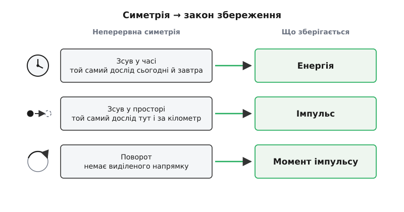
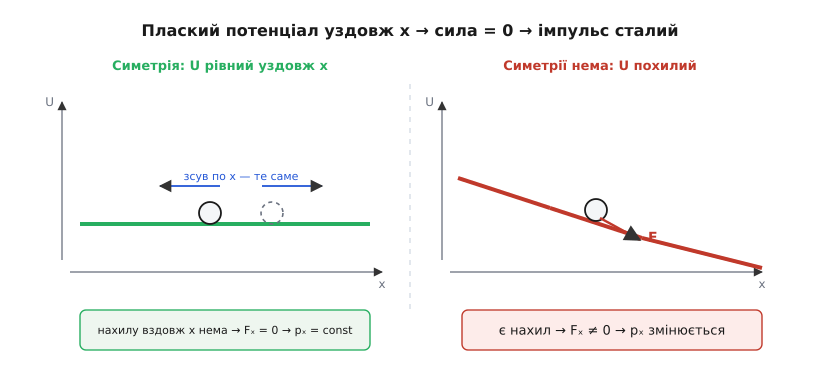
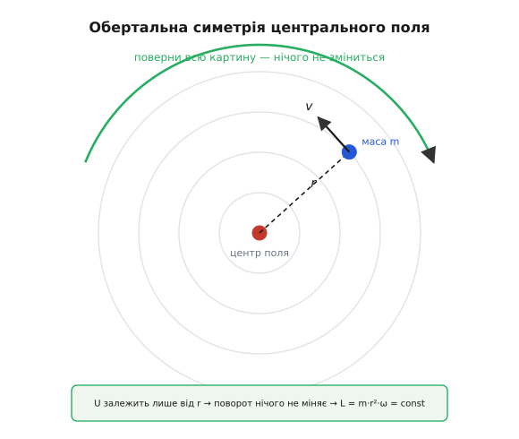

# Теорема Нетер

<preknowlist>
- [Похідна](root:math-analysis/derivative) — миттєва швидкість зміни величини; «величина зберігається» означає рівно «її похідна за часом дорівнює нулю».
- [Принцип найменшої дії](root:ph-mechanics/least-action-principle) — рух системи йде шляхом, на якому дія (інтеграл від функції Лагранжа L = T − U) стаціонарна; це формальна домівка теореми.
- [Екстремум](root:math-analysis/extrema) — стаціонарна точка, де похідна нульова; саме такою — стаціонарною — є дія на справжній траєкторії.
</preknowlist>

Фізик XIX століття знав кілька законів збереження й приймав їх як окремі подарунки природи. Енергія не виникає з нічого й нікуди не зникає. Повний імпульс замкненої системи сталий. Момент імпульсу — теж. Кожен закон відкрили нарізно, кожен рятував розрахунки — але чому саме ці величини, а не якісь інші? Чи стоїть за трьома різними правилами одна причина, чи це просто три щасливі збіги?

Емілі Нетер (нім. Emmy Noether) 1918 року дала відповідь, яка досі тримає всю сучасну фізику: **за кожним законом збереження стоїть симетрія**. Не збіг і не окремі дарунки, а тінь того, що певну зміну можна зробити — і у фізиці нічого не зрушиться. Енергія зберігається не «просто так», а тому, що закони природи однакові сьогодні й завтра. Це не гарна метафора; це точна теорема з доведенням, і саме вона перетворила закони збереження з набору спостережень на глибокий принцип.

## Що таке симетрія

Слово «симетрія» (гр. symmetría — сумірність, злагодженість) у побуті означає дзеркальну гарність метелика. У фізиці воно вужче й точніше: симетрія — це зміна, яку можна зробити з системою так, що **нічого спостережуваного не зміниться**.

Три приклади здаються банальними, аж доки в них не вдуматися:

- Поставте дослід сьогодні або через тиждень — за тих самих умов результат буде той самий. У законів немає годинника, який відлічує «абсолютний час». Це **однорідність часу**.
- Перенесіть усю лабораторію на кілометр убік — і знову нічого не зміниться. У простору немає виділеної «нульової точки», від якої він веде відлік. Це **однорідність простору**.
- Розверніть установку на північ замість сходу — результат той самий. У простору немає виділеного напрямку, «правильної» орієнтації. Це **ізотропність простору** (гр. ísos + tropḗ — однаковий у всіх напрямках).

Усі три — **неперервні** симетрії: зсунути можна на будь-яку, скільки завгодно малу величину, плавно, без стрибка. Ця прикмета не косметична — саме неперервність робить можливим наступний крок. Дзеркальне відбиття теж симетрія, але стрибкова: воно або є, або його нема, проміжного стану немає. Такі, стрибкові, симетрії класична теорема Нетер не охоплює — їй потрібна саме плавність.

## Що таке збереження

Друге слово теж варто уточнити. Величина зберігається, якщо, поки система рухається й усе в ній змінюється, **ця конкретна комбінація тримається сталою**. Формально: її похідна за часом дорівнює нулю. Кулька котиться, планета летить по орбіті, маятник хитається — а якесь одне число, зшите з їхніх швидкостей і положень, стоїть, наче прибите. Уся сила закону збереження в тому, що серед хаосу руху є острівець непорушності.

## Місток між ними

Тепер найдивовижніше. Візьміть будь-яку неперервну симетрію системи — і їй **однозначно відповідає** якась збережувана величина. І навпаки: кожна збережувана величина, яку знає фізика, — це слід якоїсь симетрії. Ось словник, що його дала Нетер:

- однорідність часу ⇄ збереження **енергії**;
- однорідність простору ⇄ збереження **імпульсу**;
- ізотропність простору ⇄ збереження **моменту імпульсу**.



*Кожна неперервна симетрія простору-часу породжує свій закон збереження — це і є словник теореми Нетер.*

Прочитайте перший рядок ще раз, бо він приголомшливий. Питання «чому зберігається енергія?» дістає відповідь «бо завтрашня фізика така сама, як сьогоднішня». Це не гра слів. Якби фундаментальні константи природи повільно повзли з часом — час перестав би бути однорідним, і енергія б **не** зберігалася; а її незбереження, якби його виявили, було б прямим доказом, що закони світу з часом дрейфують. Абстрактне «закони не залежать від того, коли» і практичне «енергію не можна взяти з нічого» — це одне твердження, побачене з двох боків.

## Чому так — механізм

Звідки береться цей зв'язок? Найкоротше вікно в нього — знайомий випадок, який ви вже знаєте від Ньютона, тільки не називали його симетрією.

Уявіть кульку на пагорбистій поверхні; висота в кожній точці задає потенціальну енергію U. Сила, що штовхає кульку, — це стрімкість схилу: круто вниз — велика сила, рівне місце — сили нема. Тепер нехай уздовж одного напрямку (позначмо його x) поверхня **рівна**: який профіль не зсувай по x, він той самий. Це і є трансляційна симетрія — зсув по x нічого не міняє. Але «рівно вздовж x» означає нульовий нахил у цьому напрямку, тобто **нульову силу** по x. А нема сили — нема й зміни імпульсу: pₓ стоїть сталим (це вже чистий Ньютон). Ланцюжок замкнувся: «U не залежить від x» (симетрія) ⇒ «уздовж x немає сили» ⇒ «pₓ зберігається» (закон збереження).



*Плаский уздовж напрямку потенціал (симетрія) означає відсутність сили в цьому напрямку — і саме тому відповідний імпульс не змінюється.*

Ось ідея в зародку. Нетер зробила з цього спостереження точний і загальний механізм — не для однієї кульки й не лише для зсуву, а для **будь-якої** неперервної симетрії будь-якої системи, заданої [принципом найменшої дії](root:ph-mechanics/least-action-principle). Система рухається не абияк: з усіх мислимих траєкторій вона обирає ту, на якій дія — інтеграл від функції Лагранжа L = T − U уздовж усього руху — стаціонарна, тобто не змінюється в першому порядку від крихітних варіацій шляху. І якщо тепер симетрія каже, що при зсуві якоїсь координати на малесеньке ε функція Лагранжа не міняється, а сам рух уже стаціонарний, то ці дві умови, зіткнувшись, алгебраїчно видають конкретну величину, чия похідна за часом — точно нуль. Ця величина — «нетерівський заряд» симетрії; повне, на диво коротке [виведення](root:ph-mechanics/noether-theorem/math-noether-derivation.md) вміщується в кілька рядків обчислень.

## Приклад: обертання й момент імпульсу

Візьмімо найчистіший випадок — рух у **центральному полі**, де сила тягне до однієї точки, а її величина залежить лише від відстані r до центру (тяжіння Сонця, кулонівське притягання ядра). Запишемо функцію Лагранжа в полярних координатах — відстань r і кут θ:

**Умова: частинка маси m у центральному полі U(r); координати — r і кут θ.**
```
L = ½·m·(ṙ² + r²·θ̇²) − U(r)

Головне помітити: кут θ у L НЕ входить —
є тільки його швидкість θ̇. Тобто якщо повернути
всю картину на будь-який сталий кут, L не зміниться.
Це рівно обертальна симетрія (U залежить лише від r).

Рівняння руху для θ (Ейлера–Лагранжа):
   d/dt(∂L/∂θ̇) − ∂L/∂θ = 0
   ∂L/∂θ  = 0             ← θ немає в L
   ∂L/∂θ̇ = m·r²·θ̇
звідси:
   d/dt(m·r²·θ̇) = 0   ⇒   m·r²·θ̇ = const
```

Величина m·r²·θ̇ — це [момент імпульсу](root:ph-mechanics/angular-momentum). Він тримається сталим упродовж усього руху — і саме тому планета, підлітаючи ближче до Сонця (r меншає), мусить кружляти швидше (θ̇ більшає): добуток мусить стояти. Це та сама рівність, яку Кеплер за століття до всяких лагранжіанів вивів зі спостережень як закон рівних площ. Координата, якої нема в L явно, зветься циклічною, і Нетер у цьому найпростішому вбранні каже коротко: **кожна циклічна координата дарує збережений спряжений імпульс**.



*Оскільки потенціал залежить тільки від відстані до центру, поворот усієї системи нічого не міняє — ця симетрія й тримає момент імпульсу сталим.*

## Де теорема працює, а де ні

Теорема могутня, але не всесильна — і чесно окреслити її межі означає зрозуміти її глибше.

По-перше, симетрія має бути **неперервною**. Дзеркальне відбиття чи обмін двох однакових частинок місцями — симетрії стрибкові, і класична теорема Нетер збереженої величини їм не дає. (У квантовому світі дискретні симетрії теж пов'язані зі збереженими числами, як-от парність, але вже іншою дорогою, не через цю теорему.)

По-друге, система має походити з **принципу дії** — мати функцію Лагранжа. Це не дрібна формальність: теорема говорить саме про симетрії дії, і без неї містка немає.

По-третє, і найцікавіше: а як же тертя? Кулька з тертям зупиняється, її механічна енергія «зникає» — виходить, енергія не зберігається? Пастка розчиняється, щойно поглянути ширше. Тертя не знищує енергію, а зливає її в мільярди мікроскопічних рухів молекул — у тепло, якого немає в нашій спрощеній моделі кульки. Для повної, замкненої системи час однорідний, і повна енергія зберігається точно. Незбереження в дисипативній моделі — не діра в теоремі, а ознака, що ми свідомо викинули з опису частину світу — саме ту, куди й тече енергія.

> 🔧 **Навіщо це.** Коли рух моделюють на комп'ютері, наївний покроковий інтегратор помалу «губить» або «надуває» енергію, і за довгий час орбіта сповзає в нісенітницю. Спеціальні, симплектичні інтегратори будують так, щоб вони поважали ту саму симетрію, що й справжня система, — і тоді збережена величина тримається біля сталої як завгодно довго. Теорема Нетер тут не абстракція: вона підказує, **що саме** має зберігатися, і це стає точним мірилом якості чисельного розрахунку. Показова [чисельна перевірка](root:ph-mechanics/noether-theorem/proj-symmetry-conservation.md) робить це відчутним на кеплерівській орбіті.

## Розмах

Тим, що почалося як витончене зауваження в механіці, тримається вся сучасна фундаментальна фізика. Коли теорію переписали мовою полів, кожен закон збереження виявився нетерівським струмом якоїсь симетрії. Збереження [електричного заряду](root:ph-electromagnetism/charge-conservation) — наслідок особливої, [калібрувальної симетрії](root:ph-electromagnetism/gauge-symmetry) електромагнітного поля. У Стандартній моделі частинок симетрії йдуть першими, а закони збереження й навіть самі взаємодії випливають із них — теорема Нетер стала не підсумком, а вихідним інструментом побудови теорій.

Є й історична іронія, з якої теорема, власне, і народилася. Коли Ейнштейн побудував загальну теорію відносності, звичне збереження енергії повелося в ній дивно — обернулося майже тотожністю, порожнім рівнянням «0 = 0». Саме щоб зрозуміти, що ж означає «збереження енергії» у викривленому просторі-часі, математики Давид Гільберт і Фелікс Клейн у Ґеттінґені й залучили Нетер до задачі; її відповідь переросла конкретне питання й стала одним із наріжних каменів фізики. [Як це сталося](root:ph-mechanics/noether-theorem/hist-noether.md) — окрема й дуже людська історія.

Отже, три закони, що колись здавалися окремими дарунками природи, — це один принцип, побачений під різними кутами. Природа зберігає енергію, імпульс і момент імпульсу не з примхи, а тому, що час однорідний, простір усюди однаковий і не має виділеного напрямку. Симетрії простору-часу — не декорація, а джерело найнадійніших законів фізики. Запитайте «чому це зберігається?» — і Нетер щоразу відповість тим самим: **бо щось можна змінити, а світ цього не помітить**.
