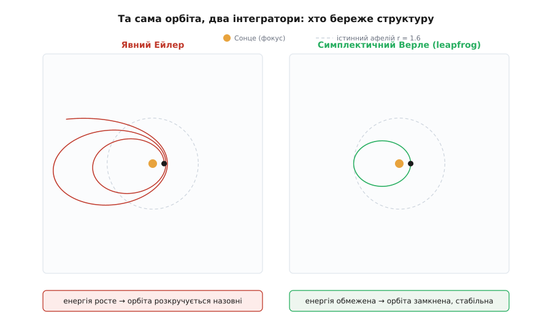

# ⚙️ Симетрія на екрані: збереження на кеплерівській орбіті чисельно

Теорема Нетер дає обіцянку про **точний** рух: планета в центральному полі кружляє так, що момент імпульсу m·r²·θ̇ і повна енергія стоять незмінно — перше з обертальної симетрії поля, друге з того, що закони не залежать від часу. Обіцянка бездоганна, поки рух рахує сама природа. Але комп'ютер природою не є. Він ніколи не розв'язує рівняння точно — він робить скінченні кроки завдовжки Δt і на кожному трохи схибить. Звідси питання, від якого залежить кожен орбітальний розрахунок, кожна молекулярна динаміка, кожна симуляція багатьох тіл: чи переживе нетерівська симетрія дискретизацію? Чи тримається збережена величина в дискретному світі — чи вона потихеньку витікає крізь щілини між кроками?

Відповідь напрочуд гостра: **залежить від того, чи поважає інтегратор ту саму структуру, що й справжня система**. Той самий фізичний закон один чисельний метод береже до останнього біта, а інший руйнує так, що за кілька обертів орбіта розлітається в порожнечу. Різниця між ними — крихітна, буквально порядок двох рядків коду. Порахуймо це на власні очі й побачимо, як абстрактне «симетрія → збереження» перетворюється на цілком практичне мірило якості симуляції.

## Сцена: одна планета, одне Сонце

Візьмімо найчистіший випадок — пробну частинку в центральному тяжінні `U(r) = −μ/r`, де `μ = G·M`. Щоб числа були охайні, виберемо нормовані одиниці: `μ = 1`, маса частинки `m = 1`. Рахувати зручніше не в полярних координатах `(r, θ)`, а в декартових `(x, y)` — так немає особливості на `r = 0`, і структура методу лишається прозорою. Прискорення дає закон тяжіння, спрямований точно на центр:

```
a = −μ · q / |q|³        (q = (x, y) — вектор положення)
```

Дві збережені величини, за які ми стежитимемо, — це рівно нетерівські заряди двох симетрій цього поля:

```
Енергія:          E = ½·(v_x² + v_y²) − μ/√(x²+y²)     (симетрія зсуву часу)
Момент імпульсу:  L = x·v_y − y·v_x  ( = r²·θ̇ при m=1 )  (симетрія обертання)
```

Стартові умови задамо так, щоб орбіта була наочним еліпсом. Пустимо частинку з перигелію (найближчої до центру точки) `r = 0.4` поперек радіуса зі швидкістю `v = 2`. Формула живої сили `v² = μ·(2/r − 1/a)` дає велику піввісь `a = 1`, звідси ексцентриситет `e = 0.6`, період `T = 2π ≈ 6.283`, афелій `r = 1.6`. Точні значення зарядів на старті — `E = −0.5`, `L = 0.8`; саме їх мусить утримати чесний інтегратор.

```py
import numpy as np

mu = 1.0                          # G·M (нормовані одиниці)
q0 = np.array([0.4, 0.0])         # старт у перигелії
v0 = np.array([0.0, 2.0])         # a=1, e=0.6 → E=−0.5, L=0.8, T=2π

def accel(q):
    r = np.hypot(*q)
    return -mu * q / r**3

def energy(q, v):
    return 0.5 * v @ v - mu / np.hypot(*q)

def ang_mom(q, v):
    return q[0]*v[1] - q[1]*v[0]   # = r²·θ̇  (m = 1)
```

Лишається мірило — проста петля, що жене орбіту заданим методом `step` на 20 обертів і стежить за найбільшим відхиленням обох зарядів та найдальшим досягнутим радіусом:

```py
def integrate(step, dt, n_orbits=20):
    q, v = q0.copy(), v0.copy()
    E0, L0 = energy(q, v), ang_mom(q, v)
    dE_max = dL_max = r_max = 0.0
    for _ in range(int(n_orbits * 2*np.pi / dt)):
        q, v = step(q, v, dt)                       # один крок обраного методу
        dE_max = max(dE_max, abs(energy(q, v) - E0))
        dL_max = max(dL_max, abs(ang_mom(q, v) - L0))
        r_max  = max(r_max,  np.hypot(*q))
    return energy(q, v), dE_max, dL_max, r_max
```

Це вся оснастка. Далі — три способи зробити крок у часі, і вся драма в тому, **чим саме** вони відрізняються.

## Наївний крок — і орбіта розкручується

Найочевидніший інтегратор — **явний метод Ейлера**. Він бере поточний стан, питає «яка зараз швидкість і яке прискорення?» і лінійно екстраполює обидва на весь крок Δt:

```py
def explicit_euler(q, v, dt):
    return q + dt*v, v + dt*accel(q)      # обидва — зі СТАРОГО стану
```

Ключове слово тут — «зі старого стану»: і нове положення, і нову швидкість рахуємо з **однакового**, ще не оновленого стану. Логічно й симетрично на вигляд. Пустімо його на 20 обертів із кроком Δt = 0.01 і подивімося на заряди:

```
явний Ейлер           E_end=−0.0733   max|ΔE|=4.27e−01   max|ΔL|=2.56e−01   r_max=13.057
```

Катастрофа. Енергія повзе вгору — від `−0.5` майже до нуля; максимальне відхилення `ΔE ≈ 0.43` — це майже вся глибина потенціальної ями. Момент імпульсу, що мав би стояти як укопаний, з'їхав на третину. А орбіта, чий справжній афелій `1.6`, розкрутилася до `r ≈ 13` — у вісім разів далі. Візьміть крок удвічі більший, Δt = 0.02, і повна енергія перетинає **нуль**: `E_end = +0.031`, `r_max = 17.75`. Додатна енергія означає, що частинка вже не зв'язана — уявна планета за двадцять обертів **вилетіла з системи**, хоча жодна фізична сила її не виштовхувала.

Звідки взялася ця енергія? Її накачав сам метод. Найясніше видно на спорідненій задачі — гармонічному осциляторі, чия траєкторія у площині «координата–швидкість» є коло сталої енергії. Явний Ейлер щокроку йде по **дотичній** до цього кола, а дотична завжди веде **назовні** кола. Точний множник за крок — `√(1 + (ω·Δt)²) > 1`: амплітуда й енергія ростуть геометрично, хоч як здрібнюй крок. Кеплерівська орбіта поводиться так само якісно — Ейлер систематично зіскакує з траєкторії назовні, додаючи трохи енергії щокроку, і еліпс невпинно розмотується у спіраль.



*Обидві панелі — той самий фізичний старт, той самий крок, однаковий масштаб. Явний Ейлер накачує енергію й жене частинку геть; симплектичний метод тримає її на замкненій орбіті. Різниця не в точності арифметики, а в тому, чи береже метод структуру задачі.*

Особливо повчальна доля моменту імпульсу, бо його руйнування суперечить чистій геометрії. Сила в нас **центральна** — спрямована точно на центр, тобто вздовж `q`. Момент сили `τ = q × F` для такої сили тотожно нульовий (векторний добуток паралельних векторів — нуль), а `L̇ = τ`, отже істинний момент **не може** мінятися. Це і є обертальна симетрія Нетер у чистому вигляді. Подивімося, що робить із нею крок Ейлера. Позначмо через `×` двовимірний (скалярний) векторний добуток `p × w = p_x·w_y − p_y·w_x`; тоді `L = q × v`. Розпишемо новий момент:

```
L_new = q_new × v_new = (q + Δt·v) × (v + Δt·a)
      = q×v  +  Δt·(q×a)  +  Δt·(v×v)  +  Δt²·(v×a)
        └L_old┘   └── 0 ──┘   └── 0 ──┘   └ залишок ┘
```

Два середні члени зникають самі: `q × a = 0`, бо прискорення радіальне (центральна сила!), а `v × v = 0` завжди. Здавалося б, момент мав би зберегтися. Але лишається **квадратичний по Δt залишок** `Δt²·(v × a)`, який щокроку підкидає в `L` дрібочку — і за десятки тисяч кроків ці дрібочки складаються в той самий 30-відсотковий дрейф. Метод «бачить» центральність сили (член `Δt·(q×a)` занулився), але однаково ламає збереження, бо змішує старе `q` з обома приростами одночасно. Симетрія є, а заряд тече.

## Одна переставлена стрічка — симплектичний Ейлер

Тепер зробімо крихітну зміну, від якої все перевертається. Замість того щоб рахувати обидва прирости зі старого стану, оновимо **спершу швидкість**, а тоді зсунемо координату вже **новою** швидкістю:

```py
def symplectic_euler(q, v, dt):
    v = v + dt*accel(q)                   # спершу швидкість…
    return q + dt*v, v                    # …і НОВОЮ швидкістю зсуваємо q
```

Одна переставлена стрічка коду — швидкість оновлюється перед координатою. Той самий обсяг обчислень, те саме прискорення. Пустімо той самий прогін:

```
симплектичний Ейлер   E_end=−0.5109   max|ΔE|=1.46e−02   max|ΔL|=3.44e−15   r_max= 1.604
```

Світ інший. Енергія більше не тікає: вона коливається у **вузькій обмеженій смузі** біля `−0.5` (розмах `ΔE ≈ 0.015` замість Ейлерових `0.43`) і за двадцять обертів не має жодного дрейфу вгору. Орбіта тримається біля свого афелію `1.6`. А момент імпульсу зберігається до `ΔL ≈ 3·10⁻¹⁵` — це **машинна точність**, рівень округлення 64-бітного числа з рухомою комою, тобто «нуль» настільки, наскільки взагалі можна на комп'ютері. Величину `r²·θ̇`, яку тема називає [моментом імпульсу](root:ph-mechanics/angular-momentum), метод береже буквально ідеально.

Чому переставлення однієї стрічки дає таку прірву? Повторімо алгебру моменту для нового порядку. Крок «оновити швидкість» — це радіальний **поштовх** (kick): `v' = v + Δt·a(q)`, і момент зі старим `q` не змінюється, бо `q × a = 0`:

```
q × v' = q × v + Δt·(q × a) = q × v = L_old      (kick радіальний → момент цілий)
```

Крок «зсунути координату новою швидкістю» — це **знос** (drift): `q' = q + Δt·v'`, і

```
L_new = q' × v' = (q + Δt·v') × v' = q × v' + Δt·(v' × v') = q × v' = L_old
```

бо `v' × v' = 0`. Обидва підкроки лишають `q × v` недоторканим — **точно**, без будь-якого залишку. Симплектичний Ейлер застосовує силу як чистий радіальний поштовх і жодного разу не спарює старе `q` з приростом так, щоб виник паразитний член `Δt²·(v×a)`. Ось у чому вся суть: обертальна симетрія — центральна сила дає нульовий момент сили — **успадковується дискретним відображенням точно**, слово в слово з тим, що каже неперервна теорема Нетер. Метод не «наближає» збереження моменту; він його **має**.

Слово «симплектичний» (від гр. symplektikós — сплетений, переплетений; термін увів Герман Вейль 1939 року як грецьку кальку латинського «complex», щоб підкреслити переплетення пар «координата–імпульс») означає рівно те, що відображення за крок зберігає **фазовий об'єм** — ту саму геометричну структуру простору станів, яку зберігає й точний гамільтонів потік (теорема Ліувілля). Явний Ейлер її роздуває (тому фазові «кола» повзуть назовні); симплектичний — зберігає, тому й тримає заряди в шорах. Ця структура коренями сягає [принципу найменшої дії](root:ph-mechanics/least-action-principle), з якого й виростає вся гамільтонова механіка.

## Верле: другий порядок і дзеркальний час

Симплектичний Ейлер точний лише в першому порядку — його смуга енергії, хоч і обмежена, ще широкувата. Стандартний робочий кінь наукових симуляцій — **швидкісний метод Верле** (velocity Verlet), він же **leapfrog** («стрибок через спину»): половина поштовху швидкості, повний знос координати, друга половина поштовху:

```py
def velocity_verlet(q, v, dt):
    v_half = v + 0.5*dt*accel(q)          # півкрок швидкості (kick)
    q = q + dt*v_half                     # повний крок координати (drift)
    v = v_half + 0.5*dt*accel(q)          # другий півкрок (kick)
    return q, v
```

```
velocity Verlet       E_end=−0.4998   max|ΔE|=3.71e−04   max|ΔL|=9.33e−15   r_max= 1.602
```

Смуга енергії стиснулася ще у **сорок разів** (`ΔE ≈ 3.7·10⁻⁴`), момент — знову машинна точність, орбіта незрушно лягає на свій еліпс. Причина другого порядку — **симетрія в часі**: схема kick–drift–kick читається однаково зліва направо й справа наліво, тож обернути напрям часу означає просто пройти ті самі підкроки назад. Через цю дзеркальність гасяться всі непарні (за Δt) члени похибки, і серед них — саме ті, що дають систематичний дрейф. У методу немає «стрілки часу», якою він потайки викачував би чи накачував енергію.

> 🔧 **Навіщо це.** Той самий leapfrog жене майже кожну довгу симуляцію руху: молекулярну динаміку (де Верле й народив цей метод для рідин 1967 року), космологічні розрахунки еволюції галактик на мільярди років, орбітальну механіку супутників і міжпланетних зондів. Причина не в точності на один крок — тут RK4 точніший, — а в тому, що для **довгого** інтегрування головне не миттєва похибка, а відсутність дрейфу збережених величин. Симулятор Сонячної системи на мільярд років на явному Ейлері викинув би планети геть; на симплектичному Верле вони кружлятимуть стабільно, бо метод береже рівно ту структуру, що її гарантує теорема Нетер. Знати, **що саме** мусить зберігатися, — це знати, чим міряти чесність симуляції.

Історична деталь, що замикає коло просто на цій темі. Метод носить ім'я французького фізика Лу Верле (фр. Loup Verlet, 1931–2019), який 1967 року застосував його до комп'ютерних дослідів над класичними рідинами. Але сам крок значно давніший: по суті це **дискретна побудова Ньютона** з «Principia». У Пропозиції 1 першої книги Ньютон доводить кеплерівський закон рівних площ, будуючи орбіту як многокутник: тіло летить рівномірно, а центральна сила діє **поштовхами** через рівні проміжки часу. Ключ доведення — трикутники, що їх радіус-вектор замітає за однакові такти, мають **рівну площу**, бо мають рівні основи й спільну вершину-центр. Рівна площа за такт — це рівно сталість `r²·θ̇`, тобто **збереження моменту імпульсу**. Ньютонова геометрична конструкція — це наш kick–drift крок, і те, що вона точно зберігає дискретну площу, — то й є причина, чому Верле тримає `L` до останнього біта. Закон площ Кеплера і машинна точність нашого `max|ΔL|` — те саме твердження, розказане мовою XVII і мовою XXI століття.

## Чому енергія обмежена, а не точна

Придивімося до чисел уважніше — там ховається тонкість, повз яку легко проскочити. Момент імпульсу симплектичні методи бережуть до `10⁻¹⁵`, до машинного нуля. А от енергія — ні: її смуга хоч і обмежена, та цілком відчутна (`10⁻⁴` для Верле), і вона **не** сходить до машинної точності, скільки не крути. Чому такий різний результат для двох зарядів однієї теореми?

Розгадка — у **тіньовому гамільтоніані** (shadow / modified Hamiltonian). Симплектичний інтегратор насправді не розв'язує наближено справжню задачу з енергією `H`. Він розв'язує **точно** — до машинної точності — трохи іншу, «тіньову» систему з енергією

```
H̃ = H + Δt²·H₂ + Δt⁴·H₄ + …        (для симетричного методу — лише парні степені Δt)
```

Оскільки чисельний потік точно зберігає цей `H̃`, справжня енергія `H` не може від нього далеко відбігти: вона навічно лишається в межах `O(Δt²)` від сталого `H̃` — звідси обмежена смуга без дрейфу (строго це доводить зворотний аналіз похибки, backward error analysis, і гарантія тримається експоненційно довгий час). Тіньова орбіта — це трішки інший еліпс, що дуже повільно прецесує; тому справжня енергія й **коливається** в тонкій смузі, а не стоїть колом. Явний Ейлер несиметричний і несимплектичний — у нього немає збереженого тіньового гамільтоніана, і енергію ніщо не тримає: вона вільна дрейфувати без меж.


*Дрейф проти обмеженості — весь сюжет в одній картинці. Несимплектичний Ейлер накачує енергію, аж поки орбіта не стає незамкненою (E > 0). Симплектичні методи тримають енергію в сталій смузі як завгодно довго: вони бережуть тіньовий гамільтоніан, тож справжня енергія лише злегка гойдається довкола нього.*

Ця різниця між моментом і енергією не випадкова, і в ній — глибокий урок про Нетер у дискретному світі. Момент імпульсу `L = x·v_y − y·v_x` **квадратичний** (білінійний) за змінними фазового простору, і симетрія, з якої він походить — обертання, — лінійна; таку структуру дискретне відображення здатне вловити й берегти **точно**, що ми й бачили в алгебрі радіального поштовху. Енергія ж містить `−μ/r` — нелінійний, неквадратичний доданок; жоден стандартний симплектичний метод не зберігає її точно, лише її тіньову родичку. Дві симетрії однієї теореми Нетер зустрічають дискретизацію по-різному: **обертальна виживає точно, часова — лише приблизно, зате без дрейфу**. Один континуальний закон, дві різні долі під сіткою часу — і обидві досконало передбачувані, щойно зрозумієш механізм.

## Складність і пастки

**Дрейф — це не «велика похибка», це похибка систематична.** Явний Ейлер не грубіший за симплектичний на **один** крок — локальна похибка в обох `O(Δt²)`. Його гріх у тому, що похибка **однобока**: щокроку трохи в той самий бік, і вона накопичується. Зменшення кроку не рятує якісно — воно лише вповільнює дрейф, а не спиняє його. Симплектичний метод при будь-якому Δt робить дрейф **обмеженим**; це властивість структури, а не дрібності кроку.

**Точний метод — не значить придатний для довгого інтегрування.** Класична пастка: узяти високоточний, але несимплектичний метод (той-таки RK4) і думати, що раз похибка на крок крихітна, то й на мільйон кроків усе гаразд. Ні — RK4 теж потроху дисипує чи накачує енергію, просто повільніше; на дистанції в мільярди кроків він програє скромному другопорядковому Верле, який дрейфу не має **зовсім**. Для довгих прогонів обмеженість зарядів важливіша за порядок точності. Загальний огляд сімейств методів і їхніх порядків — у темі [числові методи розв'язку ОДУ](root:math-numeric/numerical-ode).

**Машинна точність моменту тримається лише на центральності.** `max|ΔL| ≈ 10⁻¹⁵` виходить саме тому, що сила радіальна: `q × a = 0`. Додайте нецентральне збурення (сплюснутість планети, тягу друга тіла) — і момент почне мінятися **фізично**, по-справжньому; тоді добрий інтегратор має відстежувати цю справжню зміну `dL`, а не тримати `L` силоміць сталим. Машинний нуль тут — підпис симетрії, а не самоціль.

**Змінний крок ламає симплектичність.** Спокуса — прискорювати симуляцію, беручи великий Δt на повільному афелії й дрібний на швидкому перигелії (де `θ̇ = L/r²` найбільше). Але наївне адаптивне подрібнення кроку **руйнує** збережений тіньовий гамільтоніан: смуга енергії знову починає дрейфувати. Тому в симплектичних розрахунках або тримають крок сталим, або застосовують спеціальні прийоми (перехід до фіктивного рівномірного часу), що зберігають структуру.

**Крок мусить розв'язувати перигелій.** Найшвидша, найкрутіша частина орбіти — проходження перигелію; саме там метод найлегше «зривається». Надто великий Δt — і навіть Верле спотворить орбіту, а Ейлер вилетить іще стрімкіше. Груба перевірка: на найшвидшій ділянці має припадати щонайменше кілька десятків кроків. У нашому прикладі `θ̇` у перигелії дорівнює `L/r² = 0.8/0.16 = 5`, тобто на «швидкий» радіан припадає близько 20 кроків при Δt = 0.01 — надійний запас; на Δt = 0.05 орбіта вже попливе.

**Машинний нуль має своє дно.** `max|ΔL|` сідає не на строгий `0`, а на `~10⁻¹⁵` — це не залишок методу, а **округлення** самих чисел з рухомою комою (машинний епсилон `float64 ≈ 2.2·10⁻¹⁶`, помножений на кілька тисяч додавань). Нижче цього дна не опуститися жодним алгоритмом; хто плутає його з похибкою інтегратора, дарма шукатиме, «звідки взялися ці 10⁻¹⁵». Природа й межі цього дна — у темі [числа з рухомою комою](root:hw-arch/floating-point).

Підсумок короткий і несподівано практичний. Неперервна теорема Нетер не просто гарна ідея для підручника — вона каже комп'ютерному розрахунку, **що саме** мусить зберігатися, і тим дає точне мірило його чесності. А доля цих збережених величин у симуляції залежить не від того, скільки знаків після коми рахує метод, а від того, чи поважає він **структуру** задачі — симплектичність і симетрії. Поважає — обертальна симетрія виживає точно, часова тримається в обмеженій смузі, орбіта кружляє тисячі обертів. Не поважає — і за двадцять обертів уявна планета вилітає у порожнечу, хоча жодна сила її не штовхала. Симетрія на екрані виявляється не менш реальною, ніж симетрія на небі.
