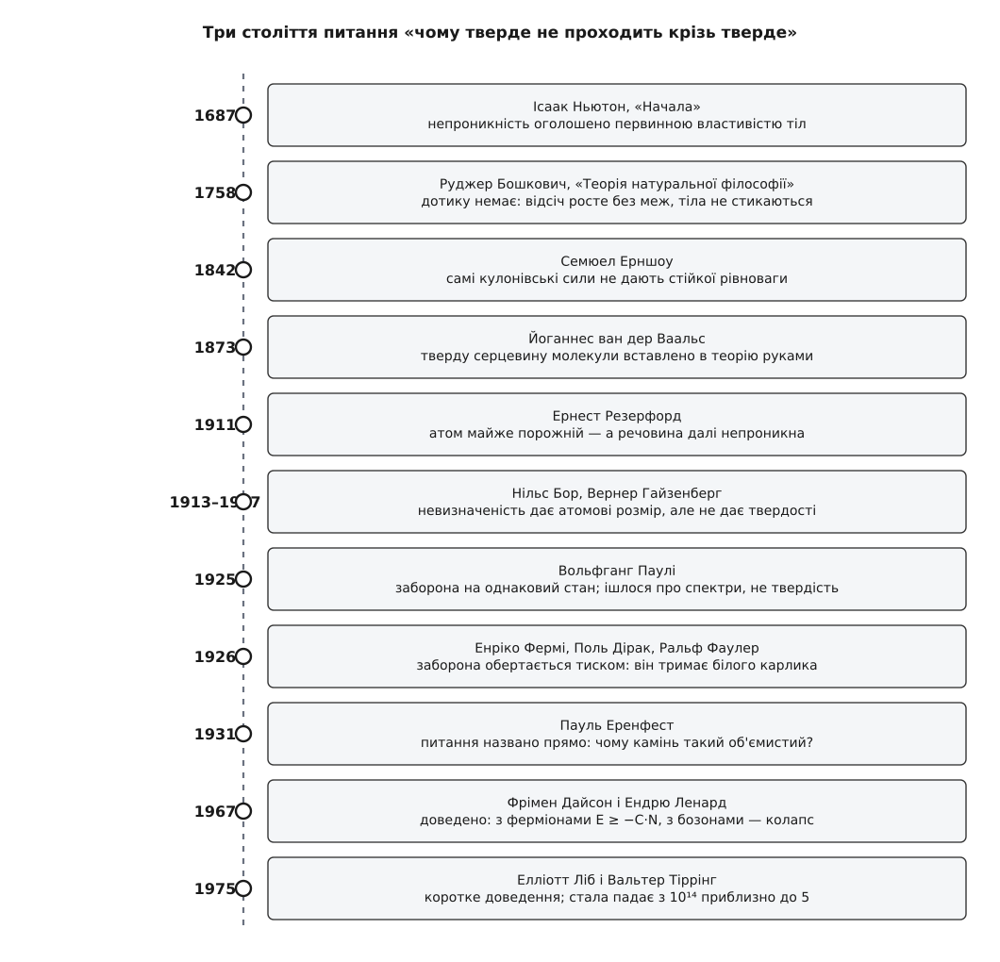
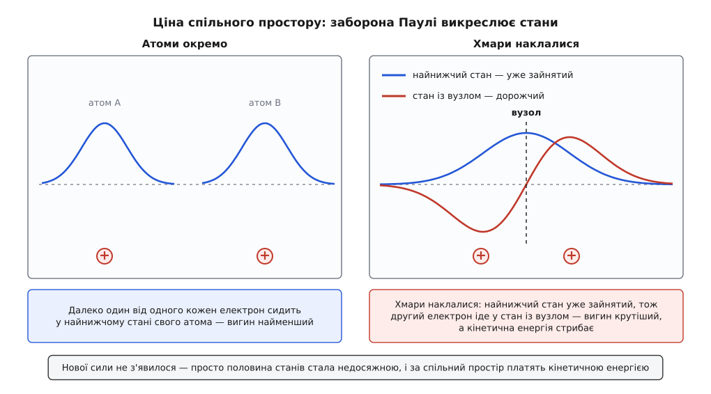

# 📜 Чому тверде тіло непроникне: від Ньютонової «непроникності» до принципу Паулі

Найбуденніша властивість речовини — те, що крізь стільницю не просунути долоню, — виявилася найважчою для виведення: щоб дістати її з перших засад, знадобилося майже три століття, теорія, придумана заради атомних спектрів, і математична теорема, доведена аж 1967 року. Найцікавіше в цій дорозі те, що звична відповідь «електрони відштовхуються» на ній не просто неточна — вона хибна, і показати це вміла ще класична фізика XIX століття.


*Питання «чому тверде не проходить крізь тверде» довго не мало навіть форми, у якій його можна поставити: спершу непроникність оголосили первинною властивістю, потім показали, що класична фізика її не дає взагалі, і лише квантова заборона дозволила довести те, що всі бачать щодня.*

## Ньютон: непроникність оголошено первинною

У «Началах» (1687) Ісаак Ньютон (англ. Isaac Newton, 1643–1727) склав правила міркувань про природу, і третє з них дозволяє переносити на всі тіла світу ті властивості, яких не можна ні посилити, ні прибрати в жодному досліді. Далі йде перелік таких властивостей: протяжність, твердість, **непроникність**, рухливість, інерція. Логіка коротка: тіла, які ми тримаємо в руках, ми знаходимо непроникними — отже, непроникність належить усім тілам узагалі.

Це не дрібниця, а рішення про будову теорії. Ньютон не пояснює непроникність — він оголошує її **первинною**, такою самою нерозкладною даністю, як протяжність. Пояснювати тоді нема чого: тіла непроникні, бо матерія така. Механіка від цього не втрачає нічого, бо вся система «Начал» тримається на силах і рухах, а не на тому, з чого зроблена твердість. Але разом з відповіддю з порядку денного зникає й питання.

Сам Ньютон у пізніх «питаннях» до «Оптики» (у латинському виданні 1706 року це питання 23, у другому англійському 1717–18 — уже 31) припускав протилежне: найдрібніші частинки тіл діють одна на одну на малих відстанях силами, то притягуючись, то відштовхуючись. Одна людина в одній книжці робить твердість аксіомою, а в другій натякає, що вона мала б випливати з коротких сил. Другий шлях і виявився правильним — але щоб на нього стати, треба було спершу припустити, що дотику взагалі не існує.

## Бошкович: тіла ніколи не стикаються

Цей крок зробив Руджер Йосип Бошкович (хорв. Ruđer Josip Bošković, лат. Rogerius Josephus Boscovich, 1711–1787) — єзуїт, астроном і математик із Дубровницької республіки, що працював у Римі, Відні, Парижі й Мілані. *(Про його походження досі сперечаються: батько родом із Герцеговини, мати італійка, писав він латиною й італійською; хорватська історіографія числить його хорватом, сербська — сербом. Певне лиш те, що він був дубровчанином і жодним «італійським» ученим у вузькому сенсі не був.)*

У «Теорії натуральної філософії» (лат. *Theoria philosophiae naturalis*, Відень 1758, друга редакція Венеція 1763) Бошкович зробив річ, на яку не наважився ніхто до нього: **скасував дотик**. Матерія в нього складається не з маленьких твердих кульок, а з безрозмірних точок, між якими діє єдиний закон сили, що залежить лише від відстані. Далеко ця сила — ньютонівське притягання. Ближче вона кілька разів міняє знак (звідси в нього беруться зчеплення, пружність, хімічні перетворення). А на найменших відстанях вона стає відштовхувальною й **зростає без меж**.

Наслідок і є те, заради чого все будувалося. Дві точки ніколи не зійдуться: перш ніж відстань стане нулем, відсіч виросте настільки, що зупинить будь-який натиск. Тіла не стикаються — вони гальмують одне одного полем. Твердість перестає бути даністю й стає **наслідком закону сили**; удару як зіткнення поверхонь немає, є плавне відбивання.

Слабке місце теж на видноті: сам закон Бошковича нізвідки не виводиться. Криву з нескінченним відштовхуванням він, по суті, намалював такою, якою вона мусить бути, щоб світ вийшов знайомим. Це чесна здогадка про **форму** відповіді — але не відповідь. Через сто п'ятнадцять років цю ж таки здогадку припасують до дослідних даних: Йоганнес ван дер Ваальс (нід. Johannes Diderik van der Waals, 1837–1923) у лейденській дисертації 1873 року допише до рівняння стану газу сталу *b* — «зайнятий об'єм», куди центрам інших молекул зась. Тверду серцевину молекули знову вставлено в теорію руками, бо без неї числа не сходяться.

## Резерфорд: тверде виявляється порожнім

1911 року Ернест Резерфорд (англ. Ernest Rutherford, 1871–1937), новозеландець, що працював у Манчестері, витлумачив досліди Ганса Ґайґера й Ернеста Марсдена з розсіянням альфа-частинок на золотій фользі: майже весь заряд і майже вся маса атома зібрані в крихітному ядрі, решта — простір, у якому рухаються електрони ([будова атома](root:basic-chemistry/inside-atom): важке ядро з протонів і нейтронів, довкола нього — легкі електрони, і розміри цих двох частин різняться на п'ять порядків).

Порахуймо, скільки в «твердому» тілі речовини.

**Алюміній: яку частку об'єму атома займає його ядро** (радіус ядра R ≈ 1.2·A^(1/3) фм, A = 27).

```
Радіус ядра:      R_яд = 1.2 · 27^(1/3) фм = 1.2 · 3 = 3.6 фм = 3.6·10⁻¹⁵ м
Радіус атома:     R_ат ≈ 1.25·10⁻¹⁰ м

Відношення радіусів:  R_яд / R_ат = 3.6·10⁻¹⁵ / 1.25·10⁻¹⁰ = 2.9·10⁻⁵
Відношення об'ємів:   (2.9·10⁻⁵)³ = 2.4·10⁻¹⁴
```

Ядро займає близько двох стотрильйонних об'єму атома, а електрони, наскільки ми знаємо й досі, взагалі не мають розміру. Тобто «речовини» в шматку алюмінію — дві стотрильйонні об'єму, все інше порожнє. І крізь цю порожнечу не проходить ані вістря голки, ані інший шматок алюмінію.

Гірше того: за класичними правилами такий атом не проживе й миті. Електрон, що обертається, — це прискорений заряд, а прискорений заряд випромінює й втрачає енергію; підстановка чисел дає час падіння на ядро близько 10⁻¹¹ секунди. Класична фізика не тільки не пояснює, чому речовина непроникна, — вона не пояснює, чому речовина взагалі існує.

## Чому «електрони відштовхуються» — хибна відповідь

Найпоширеніше пояснення твердості звучить так: електронні хмари двох тіл заряджені однаково, однойменні заряди відштовхуються, тому тіла й не проходять одне крізь одне. Воно приваблює тим, що згадує правильні дійові особи — сили між атомами таки електромагнітні. Але як пояснення воно не працює, і то з трьох різних боків.

**Перше.** Ще 1842 року Семюел Ерншоу (англ. Samuel Earnshaw, 1805–1888), англійський математик і священник, довів теорему, яка ріже цю відповідь під корінь: набір точкових зарядів **не може** триматися в стійкій нерухомій рівновазі самими лише кулонівськими силами. Причина суто геометрична: потенціал у порожньому просторі задовольняє рівняння Лапласа, а таке поле не має ані ям, ані горбів усередині — тільки сідла. Куди заряд не постав, знайдеться напрям, у який він поїде. Отже, речовина, зліплена самим [законом Кулона](root:ph-electromagnetism/coulomb-law) — силою, що спадає як 1/r² між точковими зарядами, — не тримається купи взагалі, ні як ціле тіло, ні як стінка між тілами.

**Друге.** Атоми нейтральні. Коли два нейтральні атоми зближуються, електрони одного відштовхуються від електронів другого — але їх водночас **притягує чуже ядро**, і сумарна електростатика на помірних відстанях виходить не відштовхувальною, а притягальною. Саме тому атоми злипаються в молекули й тверді тіла ([хімічний зв'язок](root:basic-chemistry/why-bond): атоми з'єднуються, бо спільний стан електронів вигідніший енергетично за два окремі). Якби всім заправляла електростатика, дві поверхні не відпихалися б — вони зливалися б.

**Третє.** Навіть якби якесь відштовхування знайшлося, воно мусило б мати **масштаб**: стінка стоїть саме на відстані близько ангстрема, а не десятої частки й не сотні. У законі Кулона немає жодної довжини — сама лише 1/r², однакова на будь-якій шкалі. Взяти масштаб нізвідки.

Три різні докази, і всі кажуть одне: стінка, об яку впирається долоня, не може походити з електричних сил самих по собі. Потрібне щось, чого в класичній фізиці немає взагалі.

## Невизначеність дає атомові розмір

Перший поверх відповіді збудували на квантовій механіці, і стосується він одного-єдиного атома. Нільс Бор (дан. Niels Bohr, 1885–1962) 1913 року просто постулював дозволені орбіти й дістав правильний розмір атома; після 1927 року, коли Вернер Гайзенберг (нім. Werner Heisenberg, 1901–1976) сформулював [принцип невизначеності](root:ph-quantum/uncertainty-principle) — що точніше локалізована частинка, то більший розкид її імпульсу, — цей розмір стало видно як наслідок змагання двох енергій.

**Звідки береться розмір атома водню.**

```
Загнати електрон в область розміру r → розкид імпульсу щонайменше p ≈ ħ/r.

Кінетична енергія (ціна стиснення):   T(r) ≈ p²/(2mₑ) = ħ²/(2mₑ·r²)   ~ 1/r²
Кулонівське притягання до ядра:       U(r) = −e²/(4πε₀·r)             ~ −1/r

Повна:   E(r) = ħ²/(2mₑr²) − e²/(4πε₀r)
Мінімум: dE/dr = 0  →  r₀ = 4πε₀ħ²/(mₑe²) = 5.29·10⁻¹¹ м  (борівський радіус)
Глибина: E(r₀) = −13.6 еВ
```

Тут уперше з'являється те, чого бракувало Ерншоу: **довжина**. Стала Планка вносить у задачу масштаб, і 1/r² кінетичної енергії перемагає 1/r притягання на відстані близько половини ангстрема. Атом не падає на ядро не тому, що щось його відпихає, а тому, що подальше стиснення коштує більше [кінетичної енергії](root:ph-mechanics/kinetic-energy), ніж дає виграшу притягання.

Це називають **стійкістю першого роду**: окремий атом має скінченну енергію й скінченний розмір. Але твердості з цього ще не випливає. Один атом свій ангстрем тримає — а що заважає другому атомові влізти в той самий ангстрем? Нічого. Якби електрони могли юрмитися без обмежень, речовина спокійно стиснулася б у багато разів щільніше, і жодна невизначеність цьому б не завадила.

## Паулі: заборона, придумана заради спектрів

Відповідь на це прийшла з зовсім іншого боку — з розшифрування атомних спектрів і періодичної таблиці. Восени 1924 року англієць Едмунд Стонер (англ. Edmund Clifton Stoner, 1899–1968) надрукував у *Philosophical Magazine* спостереження: число станів, на які розщеплюється рівень у магнітному полі, збігається з числом електронів, що заповнюють відповідну оболонку. Вольфганг Паулі (нім. Wolfgang Pauli, 1900–1958) — віденець, який згодом став громадянином Швейцарії, — прочитав цю статтю й побачив у ній ключ. 16 січня 1925 року він подав до *Zeitschrift für Physik* роботу «Про зв'язок замикання електронних груп в атомі зі складною структурою спектрів» (т. 31, с. 765–783), де сформулював [заборону](root:ph-quantum/pauli-exclusion): у жодному атомі два електрони не можуть мати однаковий повний набір квантових чисел.

Варто затримати погляд на тому, **навіщо** це було зроблено. Паулі не думав ні про твердість тіл, ні про стійкість речовини — він пояснював, чому періоди таблиці мають довжини 2, 8, 18 і чому спектральні лінії розщеплюються саме так. Заборона була бухгалтерським правилом заповнення рівнів. Те, що з неї випливає непроникність каменю, з'ясується за шість років і не ним.

Щоб набір квантових чисел зійшовся, Паулі довелося ввести четверте — двозначність, яку, за його власним висловом, «не можна описати класично». Що це за двозначність, зрозуміли не одразу. На початку 1925-го Ральф Кроніг (Ralph Kronig, 1904–1995, народжений у Дрездені в американській родині) припустив, що електрон обертається довкола власної осі; Паулі висміяв ідею, і Кроніг її не надрукував. У жовтні того самого року до того самого висновку дійшли нідерландці Джордж Юленбек (нід. George Uhlenbeck, 1900–1988) і Семюел Ґаудсміт (нід. Samuel Goudsmit, 1902–1978); їхня замітка в *Naturwissenschaften* датована 17 жовтня 1925 року. Коли Гендрік Лоренц показав, що класично «дзиґа» не сходиться, автори хотіли відкликати текст, але Пауль Еренфест уже надіслав його до редакції й відповів: ви обидва досить молоді, щоб дозволити собі дурницю. Так у фізику ввійшов [спін електрона](root:ph-quantum/electron-spin) — власний момент імпульсу, що не має класичного відповідника й набуває лише двох орієнтацій.

За наступний рік заборону піднесли з правила про атом до статистики: Енріко Фермі (італ. Enrico Fermi, 1901–1954) у лютому 1926-го й Поль Дірак (англ. Paul Dirac, 1902–1984) у серпні того ж року незалежно вивели розподіл для частинок, які не терплять однакових станів. Дірак показав і глибшу причину (того ж року симетрію станів багатьох електронів розбирав і Гайзенберг): хвильова функція тотожних електронів **антисиметрична** — переставте два електрони місцями, і функція міняє знак. Якщо ж обидва в одному стані, переставляння нічого не міняє, і функція мусить дорівнювати самій собі зі знаком мінус, тобто нулю. Заборона Паулі — не додаткова сила, дописана в рівняння, а те, що станів із двома однаковими електронами **просто не існує**.

## Фаулер: заборона обертається тиском

Що з цього виходить механічна дія, першим побачив астрофізик. У грудні 1926 року Ральф Фаулер (англ. Ralph H. Fowler, 1889–1944) надрукував у *Monthly Notices of the Royal Astronomical Society* (т. 87, с. 114–122) статтю «Про густу речовину». Білі карлики були на той час скандалом: речовина з густиною тонни на кубічний сантиметр мала б давно охолонути й стиснутися, а зорі трималися.

Фаулер застосував щойно народжену статистику Фермі — Дірака й дістав відповідь. Стиснутий електронний газ не може скинути енергію й «улягтися»: нижні стани вже зайняті, тож електрони змушені сидіти в станах із великими імпульсами. А великі імпульси означають [тиск виродженого газу](root:ph-thermodynamics/degeneracy-pressure) — тиск, який лишається навіть при нулі температури, бо походить не від тепла, а від заборони. Саме він і тримає білого карлика. За кілька років Субраманьян Чандрасекар (англ. Subrahmanyan Chandrasekhar, 1910–1995, народжений у Лахорі в тамільській родині) покаже, що в цієї підпори є межа: понад приблизно 1.4 маси Сонця вироджений газ не витримує.

Це поворотний пункт усієї історії. Заборона Паулі, придумана як правило заповнення рівнів у спектроскопії, виявилася **джерелом тиску** — тобто механічної сили, яка стримує стиснення.

## Еренфест ставить питання про камінь

Телескоп навели назад на землю 31 жовтня 1931 року в Амстердамі. Пауль Еренфест (Paul Ehrenfest, 1880–1933) — віденець із єврейської родини, професор у Лейдені — виголошував промову з нагоди вручення Паулі медалі Лоренца й поставив питання прямо: чому певна кількість речовини не займає значно менше місця?

Хід його міркування простий і нищівний. Атом «товстий» не тому, що щось відпихає його електрони назовні: ядро притягує їх дуже сильно, і на внутрішніх орбітах могло б поміститися ще багато електронів, перш ніж їхнє взаємне відштовхування стало б завеликим. Що ж тоді заважає атомові зменшитися? Відповідь Еренфеста — **тільки принцип Паулі**: жодних двох електронів в одному квантовому стані. Тому атоми, за його словами, «так непотрібно товсті» — і тому камінь та шматок металу такі об'ємисті. Наприкінці він пожартував, що коли б Паулі частково поступився своєю забороною, людство позбулося б чималих клопотів. *(Переказ цього жарту різниться: у друкованому тексті промови йдеться про заощадження на новому чорному святковому вбранні, у спогадах присутніх — про тисняву на вулицях.)*

Жарт жартом, а питання нарешті прозвучало в тій формі, у якій його можна розв'язувати: чому N електронів займають об'єм, пропорційний N, а не тиснуться в цятку.

## Чому заборона коштує енергії

Тут корисно розділити те, що описали, і те, що зрозуміли. Форму стінки припасували до дослідів **раніше**, ніж дізналися її причину. 1924 року, за рік до статті Паулі, Джон Леннард-Джонс (англ. John Lennard-Jones, 1894–1954) підібрав для міжатомної взаємодії формулу з відштовхувальним доданком ~1/r¹²: він шукав не виведення, а зручність — щоб число сходилося з властивостями газів. 1932 року Макс Борн (нім. Max Born, 1882–1970) і Джозеф Маєр (амер. Joseph E. Mayer, 1904–1983) для іонних кристалів замінили степінь на експоненту ~exp(−r/ρ), яка лягала на дані краще. Обидві формули — портрети стінки, змальовані з натури.

Причина ж стінки така. Візьміть два атоми із заповненими оболонками й почніть їх зсувати. Поки хмари ледве торкаються, панує притягання. Але щойно хмари накладаються, електрони одного атома опиняються там, де вже «зайняті» стани другого, — а двом електронам в одному стані бути не можна. Виходу два, і обидва дорогі: або електрон іде у вищий, ще вільний стан, або спільна хвильова функція перебудовується так, щоб лишатися ортогональною до вже зайнятих. Обидва варіанти означають одне — **більше вузлів, крутіший вигин хвильової функції, більший імпульс**. А більший імпульс — це та сама кінетична енергія ħ²/(2mₑr²), що не дала атомові впасти на ядро; тільки тепер вона протестує не проти стиснення в ядро, а проти **спільного користування простором**.


*Заборона Паулі не додає в рівняння жодної нової сили — вона викреслює частину станів. Коли хмари накладаються, електронам лишаються тільки стани з додатковими вузлами; такі стани крутіше вигнуті, а отже дорожчі за кінетичною енергією. Цей стрибок ціни й відчувається як стінка.*

Це варто вимовити чітко, бо тут найчастіше плутають. «Сили Паулі» не існує: у гамільтоніані немає доданка з такою назвою, заборона не притягує й не відштовхує. Вона обмежує **набір дозволених станів**. Але енергія системи, яка залежить від відстані між тілами, — це і є потенціал, а похідна потенціалу по відстані — сила. Заборона перетворюється на відсіч не через нову взаємодію, а через те, що зближення стає енергетично дорогим.

У квантовій хімії ту саму річ описують і з іншого боку: антисиметрія виганяє електронну густину з проміжку між ядрами, ядра гірше екрануються одне від одного, і їхнє кулонівське відштовхування зростає. Обидва описи — про один і той самий ефект антисиметрії, просто в різній бухгалтерії; сперечаються не про фізику, а про те, який доданок зручніше називати «відштовхуванням».

Порядок величини цієї відсічі легко відчути на металі, де електрони не прив'язані до окремих атомів.

**Мідь: тиск виродженого електронного газу** (модель вільних електронів; концентрація n = 8.5·10²⁸ м⁻³, [енергія Фермі](root:ph-condensed/fermi-level) E_F = 7.0 еВ).

```
P ≈ (2/5)·n·E_F
  = 0.4 · 8.5·10²⁸ м⁻³ · 7.0 · 1.602·10⁻¹⁹ Дж
  = 0.4 · 8.5·10²⁸ · 1.121·10⁻¹⁸
  = 3.8·10¹⁰ Па  =  38 ГПа   (близько 380 000 атмосфер)

Для порівняння, справжній модуль об'ємного стиску міді:  B ≈ 140 ГПа
```

Груба модель дає той самий порядок, що й виміряна жорсткість металу. Електронний газ усередині мідного дроту вже зараз тисне назовні десятками гігапаскалів, а врівноважує цей тиск притягання електронів до іонів ґратки. Ось із чого зроблена «цупкість» — не з електростатичного відштовхування, а з ціни, яку заборона править за стиснення.

## Стійкість матерії: від здогаду до теореми

Лишалося довести, що з цієї заборони справді випливає світ, у якому ми живемо. Питання формулюють так: чи правда, що енергія основного стану N заряджених частинок обмежена знизу величиною, пропорційною **самому N**, а не якомусь вищому степеню? Це називають **стійкістю другого роду**, і вона рівносильна всьому, що ми звемо звичайною речовиною. Енергія пропорційна N — отже й об'єм пропорційний N, отже густина не залежить від розміру шматка, отже два бруски, складені разом, не вибухають, отже взагалі можлива термодинаміка.

Грубий аргумент на користь цього подав 1939 року Ларс Онсагер (норв. Lars Onsager, 1903–1976). Різко й точно питання поставили Майкл Фішер (англ. Michael E. Fisher, 1931–2021) і Давід Рюель (фр. David Ruelle, 1935 р. н.) у статті «Стійкість систем багатьох частинок» (*Journal of Mathematical Physics*, лютий 1966): для кулонівських сил доведення немає.

Воно з'явилося за рік. Фрімен Дайсон (англ. Freeman Dyson, 1923–2020) і Ендрю Ленард у двох частинах праці «Стійкість матерії» (*Journal of Mathematical Physics*, 1967 і 1968) довели: якщо від'ємні частинки — ферміони, енергія знизу обмежена як −C·N. І в тому ж 1967-му Дайсон окремою статтею показав зворотний бік: якби заряджені частинки були бозонами, тобто заборона не діяла, енергія падала б як −C·N^(7/5). Показник 7/5 замість 1 — це не технічна дрібниця.

**Що означає показник 7/5** (оцінка порядку, у дусі зауваги Дайсона).

```
Візьмімо N = 10²³ частинок (порядок для грама речовини), C ~ 1 ридберг = 13.6 еВ.

Ферміони:  |E|/N = C                              → 13.6 еВ на частинку
Бозони:    |E|/N = C·N^(7/5)/N = C·N^(2/5)
           N^(2/5) = (10²³)^0.4 = 10^9.2 ≈ 1.6·10⁹
           |E|/N ≈ 13.6 еВ · 1.6·10⁹ ≈ 2.2·10¹⁰ еВ = 22 ГеВ на частинку

Уся енергія:  10²³ · 2.2·10¹⁰ еВ = 2.2·10³³ еВ = 3.5·10¹⁴ Дж ≈ 84 кілотонни в тротиловому вимірі
```

Тобто без заборони Паулі речовина була б не просто щільнішою — вона була б **вибуховою**: зведіть докупи два шматочки такої «речовини» вагою по грамові, і вивільниться енергія масштабу атомної бомби. Речовина не могла б існувати окремими тілами, бо кожне їхнє злиття давало б вибух.

Перше доведення було перемогою, але з кошмарною сталою: у Дайсона й Ленарда C виходила порядку 10¹⁴ (у ридбергах на частинку) — скінченна, та безглуздо далека від дійсності. 1975 року Елліотт Ліб (амер. Elliott Lieb, 1932 р. н.) і Вальтер Тіррінг (австр. Walter Thirring, 1927–2014) у статті на три сторінки (*Physical Review Letters*, т. 35, с. 687) дали інше доведення — через нерівність, що зв'язує кінетичну енергію ферміонів із їхньою густиною (нині вона зветься нерівністю Ліба — Тіррінга). Стала впала з 10¹⁴ приблизно до 5. Уперше математична межа опинилася поруч зі справжніми енергіями зв'язку речовини.

## Що з цього виходить

Ланцюг замикається так. Кулонівські сили самі по собі не дають ані стійкої речовини, ані масштабу довжини — це знав ще Ерншоу. Невизначеність додає масштаб і рятує окремий атом від падіння на ядро. А заборона Паулі забезпечує останнє й найдивніше: те, що N електронів займають об'єм, пропорційний N. Не сила, не поле, не відштовхування — обмеження на дозволені стани, яке обертається на кінетичну ціну за спільний простір.

Через це найзвичніша річ у світі — те, що долоня не проходить крізь стіл, — має вельми незвичну природу. Ви впираєтеся не в речовину (її там дві стотрильйонні об'єму) і не в електричну відсіч (нейтральні атоми на цій відстані радше притягуються). Ви впираєтеся в те, що двом електронам заборонено бути в одному стані, а тому вашим електронам довелося б перейти у стани з крутішим вигином, і природа виставляє за це рахунок у кінетичній енергії. Ньютон мав рацію в тому, що непроникність — властивість універсальна; він помилявся тільки в тому, що вона первинна.
