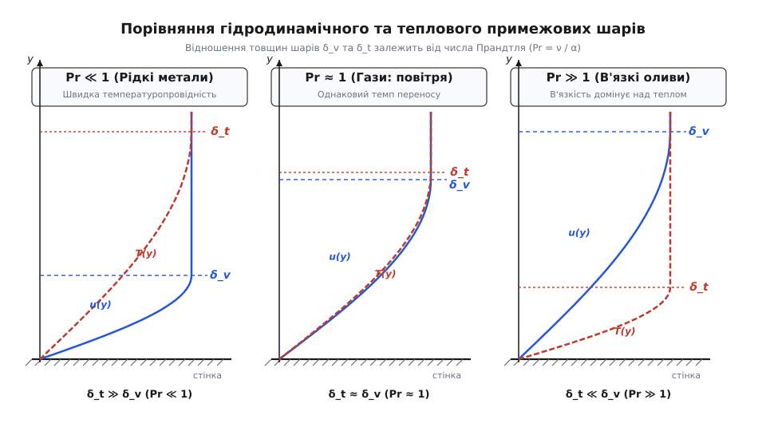
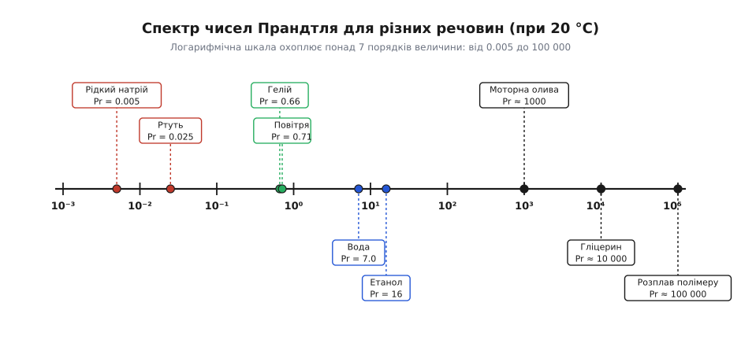
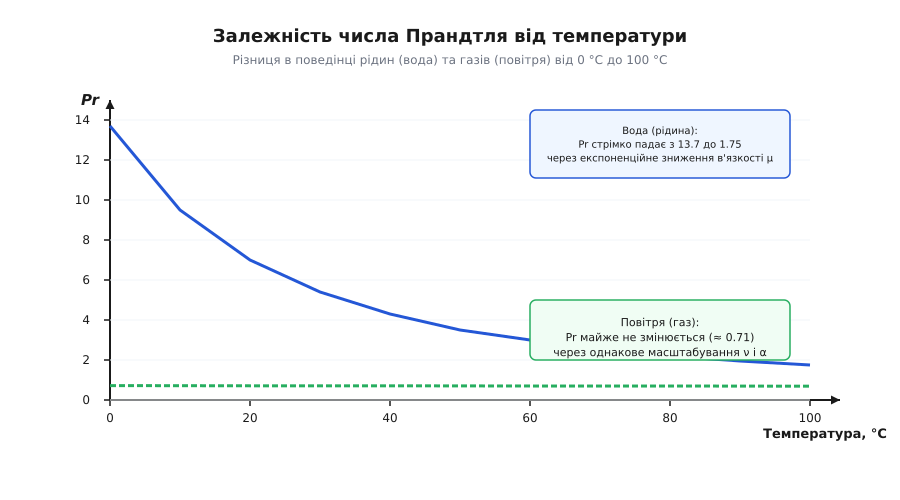
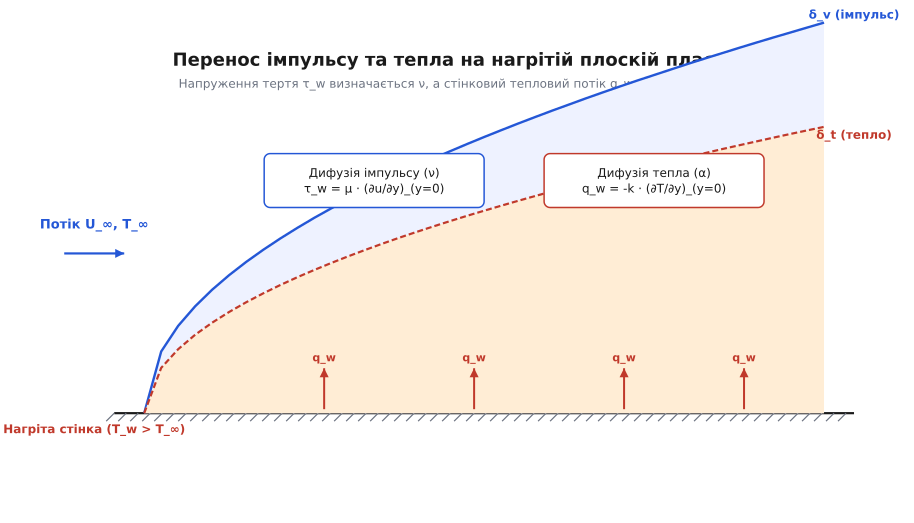

# Число Прандтля

<preknowlist>
- [В'язкість](topic:ph-mechanics/viscosity) — внутрішнє тертя рідини та кінематична в'язкість `ν = μ / ρ`, яка визначає швидкість дифузії імпульсу.
- [Теплопровідність і температуропровідність](topic:physics/heat-conduction) — здатність речовини передавати тепло кондукцією та коефіцієнт температуропровідності `α = k / (ρ·c_p)`.
- [Примежовий шар](topic:ph-mechanics/boundary-layer) — тонка область біля поверхонь, де панують градієнти швидкості й температури через умови прилипання та ізотермічності стінки.
- [Число Рейнольдса](topic:ph-mechanics/reynolds-number) — відношення інерційних сил до сил в'язкості `Re = u·L / ν`, яке визначає режим течії (ламінарний чи турбулентний).
</preknowlist>

Коли гаряча металева пластина охолоджується в потоці повітря або води, у рухомому середовищі одночасно розгортаються дві незалежні фізичні історії. Перша історія — це сповільнення течії об поверхню: через прилипання рідини до твердого тіла біля стінки формується шар загальмованого середовища, у якому в'язке тертя поступово передає гальмівний імпульс від шар за шаром назовні. Друга історія — це виточування тепла від нагрітої стінки вглиб потоку: теплова енергія передається молекулярним хаотичним рухом та конвективним перенесенням, утворюючи навколо тіла шар підвищеної температури.

Швидкість, з якою ці дві області — затримки швидкості та прогріву температури — розростаються впоперек потоку, майже ніколи не збігається. В моторній оливі гальмівна дія тертя поширюється вглиб середовища в тисячу разів швидше, ніж тепло встигає прогрети сусідні шари. У рідкому натрії, навпаки, теплова хвиля миттєво пронизує товщу середовища, залишаючи гідродинамічний шар сповільнення мікроскопічно тонким. Відношення швидкостей цих двох процесів молекулярної дифузії — дифузії імпульсу та дифузії тепла — визначає безрозмірний критерій фізичної подібності, який називають **числом Прандтля** (нім. *Prandtl-Zahl*, на честь німецького фізика й аеродинаміка Людвіга Прандтля).

## Перший крок: два змагання переносу в одній рідині

Щоб збагнути сутність числа Прандтля, варто подивитися на рідину або газ не як на суцільний континуум, а як на середовище, у якому одночасно відбуваються два процеси розсіювання (дифузії):

1. **Перенос імпульсу (в'язкість).** Якщо один шар рідини рухається швидше за сусідній, між ними виникають дотичні напруження тертя `τ = μ · (du/dy)`. Швидкість розмивання градієнта швидкості впоперек течії задається коефіцієнтом кінематичної в'язкості `ν = μ / ρ` (вимірюється в м²/с). Можна сказати, що `ν` — це температуропровідність імпульсу, або коефіцієнт дифузії руху.
2. **Перенос тепла (температуропровідність).** Якщо в середовищі існує різниця температур, тепловий потік за законом Фур'є дорівнює `q = -k · (dT/dy)`. Проте швидкість вирівнювання температури залежить не лише від теплопровідності `k` (Вт/(м·К)), а й від того, скільки енергії треба витратити на нагрівання одиниці об'єму. Цю швидкість описує коефіцієнт температуропровідності `α = k / (ρ · c_p)` (теж вимірюється в м²/с), де `c_p` — питома ізобарна теплоємність, а `ρ` — густина.

Оскільки обидві величини — і кінематична в'язкість `ν`, і температуропровідність `α` — мають однакову фізичну розмірність (м²/с), їхнє відношення є чисто безрозмірним числом:

```
Pr = ν / α
```

Якщо підставити вирази через первинні термодинамічні та транспортерні властивості речовини, отримаємо зручну формулу:

```
Pr = (μ / ρ) / [k / (ρ · c_p)]
   = (μ · c_p) / k
```

Тут `μ` — динамічна в'язкість (Па·с), `c_p` — питома теплоємність при постійному тиску (Дж/(кг·К)), `k` — коефіцієнт теплопровідності (Вт/(м·К)).

Найважливіша риса числа Прандтля полягає в тому, що воно є **виключно параметром речовини**. На відміну від числа Рейнольдса `Re = u · L / ν` або числа Фруда, які містять зовнішню швидкість потоку `u` та характерний геометричний розмір тіла `L`, число Прандтля не залежить від геометрії каналу, швидкості обтікання чи форми тіла. Воно повністю задається внутрішньою молекулярною природою флюїду, його температурою та тиском.

> 🔧 **Навіщо це.** Коли інженер розраховує систему охолодження двигуна або теплообмінник ядерного реактора, перше питання, на яке відповідає число Прандтля: що є головним вузьким місцем переносу — гідродинамічне тертя чи теплова провідність? Знаючи `Pr`, розробник одразу розуміє, чи буде тепловий примежовий шар схований усередині в'язкого шару, чи вийде далеко за його межі.

## Анатомія двох примежових шарів: гідродинамічний проти теплового

Коли потік із незбуреною швидкістю `U` та температурою `T_∞` набігає на плоску нагріту пластину з температурою поверхні `T_w`, біля стінки одночасно формуються два примежові шари:

1. **Гідродинамічний примежовий шар товщиною `δ_v`** — область, у якій поздовжня швидкість змінюється від `u = 0` на стінці (через умову прилипання) до `u = 0.99 · U` на зовнішній межі.
2. **Тепловий примежовий шар товщиною `δ_t`** — область, у якій температура середовища змінюється від `T = T_w` на поверхні до `T = T_w - 0.99 · (T_w - T_∞)` у вільному потоці.


*Формування гідродинамічного u(y) та теплового T(y) профілів у ламінарному примежовому шарі на плоскій пластині для трьох характерних діапазонів числа Прандтля. Зліва: у рідких металах (Pr ≪ 1) тепловий шар δ_t значно товщий за гідродинамічний δ_v. У центрі: у газах (Pr ≈ 1) товщини шарів майже однакові. Справа: у в'язких оливах (Pr ≫ 1) тепловий шар стиснутий у мікроскопічну плівку біля самої стінки.*

Відношення товщин цих двох шарів прямим чином масштабується залежно від числа Прандтля. Для ламінарного обтікання плоскої пластини з теорії ламінарного примежового шару випливає співвідношення:

```
δ_v / δ_t ≈ Pr^(1/3)        (для Pr ≥ 0.6)
```

Це просте степеневе співвідношення відкриває чітку фізичну картину:

- Якщо `Pr = 1`, то `δ_v ≈ δ_t`. Профілі безрозмірної швидкості `u / U` та безрозмірної температури `(T - T_w) / (T_∞ - T_w)` дзеркально збігаються. Імпульс і тепло поширюються вглиб потоку з однаковою швидкістю.
- Якщо `Pr ≫ 1`, то `Pr^(1/3) ≫ 1`, і отже `δ_v ≫ δ_t`. Гідродинамічний шар виходить набагато товщим за тепловий. Тепловий градієнт виявляється затиснутим у вузенькій пристінній плівці всередині глибокої в'язкої області.
- Якщо `Pr ≪ 1`, то `Pr^(1/3) ≪ 1`, і отже `δ_v ≪ δ_t`. Тепловий шар поширюється далеко за межі в'язкісного примежового шару. Потік тепла "пробиває" гідродинамічний шар і проникає в область майданчика незбуреної швидкості.

Детальне виведення цих масштабувань із систем диференціальних рівнянь руху та енергії подано у відповідній вставці: [математичне виведення відношення товщин примежових шарів](topic:ph-mechanics/prandtl-number/math-prandtl-derivation.md).

## Фізика молекулярного переносу в газах і рідинах

Аби пояснити числові значення числа Прандтля для різних речовин, слід зануритися на молекулярний рівень і розглянути мікроскопічні механізми, які відповідають за перенос імпульсу та теплової енергії.

### Молекулярно-кінетична теорія газів і формула Ейкена

У розрідженому газі молекули більшість часу вільно летять зі середньою швидкістю теплового руху `v_th = √(8 · R · T / (π · M))` і лише зредка зазнають пружних зіткнень. Середня довжина вільного пробігу молекули позначимо як `l`.

Коли молекула перелітає з одного шару газу в сусідній шар, що рухається з іншою макроскопічною швидкістю, вона переносить із собою свій механічний імпульс `m · u`. Це створює в'язке тертя:

```
μ ≈ (1/3) · ρ · v_th · l
```

Одночасно та сама молекула переносить свою кінетичну енергію хаотичного руху, що створює молекулярну теплопровідність:

```
k ≈ (1/3) · ρ · v_th · l · c_v · f_Eucken
```

де `c_v` — питома теплоємність при постійному об'ємі, а `f_Eucken` — поправковий коефіцієнт Арнольда Ейкена (Eucken factor). Ейкен з'ясував, що поступальні ступені вільності молекули переносять енергію ефективніше за обертальні та коливальні, оскільки швидші молекули зіштовхуються частіше. Для ідеального газу коефіцієнт Ейкена становить:

```
f_Eucken = 1 + 9/4 · (R / (M · c_v))
```

Якщо підставити ці вирази у визначення числа Прандтля `Pr = μ · c_p / k`, то загальні мікроскопічні параметри — густина `ρ`, середня швидкість `v_th` та довжина пробігу `l` — повністю скорочуються! Залишається виключно співвідношення теплоємностей і внутрішньої структури молекули:

```
Pr = c_p / (c_v · f_Eucken) = γ / (1 + 9/4 · (γ - 1))
   = 4 · γ / (9 · γ - 5)
```

Ця видатна формула показує, що для ідеальних газів число Прандтля диктується суто кількістю ступеней вільності молекули (значенням показника адіабати `γ = c_p / c_v`):

- **Одноатомні гази (He, Ne, Ar, Kr):** мають 3 поступальні ступені вільності, `γ = 5/3 ≈ 1.667`. Формула Ейкена дає `Pr = 4 · (5/3) / (15 - 5) = 2/3 ≈ 0.667`. Експеримент для гелію та аргону дає точно `Pr = 0.66–0.67`.
- **Двохатомні гази (N₂, O₂, H₂, повітря):** мають 3 поступальні та 2 обертальні ступені вільності, `γ = 7/5 = 1.40`. Формула Ейкена провіщає `Pr = 4 · 1.4 / (12.6 - 5) = 5.6 / 7.6 ≈ 0.737`. Точніший розрахунок за теорією Чапмана — Енскога з урахуванням потенціалу Леннард-Джонса дає `Pr ≈ 0.71` для повітря при кімнатній температурі.
- **Багатоатомні гази (CO₂, CH₄, H₂O пара):** залучають додаткові обертальні та коливальні ступені вільності, `γ ≈ 1.25 – 1.33`. Оскільки складні молекули запасають багато енергії у внутрішніх коливаннях, які повільніше передаються при зіткненнях, їхня теплопровідність відносно зростає, і число Прандтля піднімається до `Pr ≈ 0.85 – 0.95`.

### Механізм переносу у рідинах: діркова теорія Ейрінга та фонони

У крапельних рідинах відстані між молекулами сумірні з їхніми розмірами. Вільний пробіг відсутній; молекула здійснює коливання в потенціальній ямі, утвореній сусідніми молекулами, і лише згодом здійснює стрибок у сусіднє вільне місце ("дірку").

Згідно з теорією абсолютних швидкостей реакцій Генрі Ейрінга, динамічна в'язкість рідини пропорційна енергії активації `E_a`, необхідної для розриву міжмолекулярних зв'язків та створення дірки:

```
μ = (h_Planck · N_A / V_m) · exp(E_a / (R · T))
```

де `h_Planck` — стала Планка, `N_A` — число Авогадро, `V_m` — молярний об'єм. При нагріванні розширення рідини збільшує кількість дірок, а теплові коливання полегшують подолання бар'єра `E_a`, через що в'язкість `μ` падає за експонентою.

Натомість перенос тепла в рідинах відбувається за рахунок двох механізмів:
1. **Колективні акустичні коливання (фонони):** теплова хвиля поширюється зі швидкістю звуку в рідині `c_sound`. Теплопровідність описується формулою Бріджмена: `k ≈ 3 · (k_B · c_sound / V_mol^(2/3))`.
2. **Вільні електрони (лише в рідких металах):** електронний газ переносить тепло зі швидкістю Фермі `v_F`, яка перевищує швидкість звуку в тисячі разів.

Оскільки в рідких металах швидкість електронного переносу тепла `v_F` велетенська, а в'язкість визначається звичайним іонним каркасом, температуропровідність `α` стає колосальною, що й забезпечує наднизькі значення `Pr ≪ 1`. У в'язких органічних рідинах (оливи, полімери), навпаки, фононна теплопровідність низька, а міжмолекулярне зачеплення макромолекул велетенське, що дає `Pr ≫ 1`.

## Спектр речовин: від рідких металів до в'язких полімерів

Значення числа Прандтля в природі та техніці охоплюють велетенський діапазон — понад вісім порядків величини. Переконаємося в цьому, розглянувши основні класи теплоносіїв і робочих тіл.


*Логарифмічна шкала чисел Прандтля при температурі 20 °C і атмосферному тиску. Величина Pr змінюється від 0.005 для рідкого натрію до 100 000 для високов'язкого гліцерину та розплавів полімерів.*

### 1. Рідкі метали (`Pr ≪ 1`, діапазон `0.003 – 0.03`)

У рідких металах — ртуті (`Pr ≈ 0.025`), рідкому натрії (`Pr ≈ 0.005–0.007`), сплаві натрій-калій (NaK) та евтектичному сплаві свинець-вісмут — основними носіями тепла є вільні електрони провідності. Вони забезпечують колосальну теплопровідність `k` (десятки Вт/(м·К)), тоді як молекулярне тертя `μ` залишається порівняним зі звичайною водою. 

У результаті температуропровідність `α` перевищує кінематичну в'язкість `ν` у 30–300 разів. Тепловий примежовий шар стає настільки товстим, що навіть далеко від стінки, де швидкість середовища дорівнює незбуреному значенню `U`, потік уже інтенсивно прогрівається. Це робить рідкі метали незамінними теплоносіями в ядерних реакторах на швидких нейронах (де потрібно знімати гігавати тепла з малого об'єму активної зони), але ззвичайні інженерні формули теплообміну для них повністю ламаються.

### 2. Гази (`Pr ≈ 0.7 – 1.0`)

Для більшості простих газів (повітря, азот, кисень, водень, гелій, аргон) число Прандтля лежить біля одиниці, зазвичай у вузькому інтервалі `0.65 – 0.9`.

Як ми бачили вище, для двохатомних газів (повітря) теоретичне значення становить `Pr ≈ 0.71`. Через те що `Pr ≈ 0.71`, у повітряних потоках товщина теплового шару лише трохи більша за товщину швидкісного шару (`δ_t ≈ 1.12 · δ_v`).

### 3. Вода та ззвичайні рідини (`Pr ≈ 2 – 13`)

У крапельних рідинах молекули упаковані щільно, і міжмолекулярні сили притягання суттєво гальмують їхній зсувний рух, підвищуючи в'язкість. Натомість перенос тепла здійснюється фононними коливаннями та локальними соприкосновеннями.

Для чистої води при `20 °C` динамічна в'язкість `μ ≈ 1.0 × 10⁻³ Па·с`, теплоємність `c_p ≈ 4182 Дж/(кг·К)`, а теплопровідність `k ≈ 0.598 Вт/(м·К)`:

```
Pr = (1.0×10⁻³ · 4182) / 0.598 ≈ 7.0
```

Це означає, що у воді гідродинамічний шар приблизно вдвічі товщий за тепловий (`δ_v / δ_t ≈ 7.0^(1/3) ≈ 1.91`). Перенос імпульсу у воді передує переносу тепла.

### 4. В'язкі оливи та полімерні розплави (`Pr ≫ 1`, діапазон `100 – 100 000`)

У трансформаторних та моторних оливах, силіконах, гліцерині й розплавах полімерів довгі вуглеводневі або полімерні ланцюги заплутуються, створюючи колосальну в'язкість. Для моторної оливи при `20 °C` число Прандтля сягає `Pr ≈ 1040`, для важкого гліцерину — `Pr ≈ 10 000`, а для розплаву поліетилену високого тиску — перевищує `100 000`.

У таких середовищах `δ_v / δ_t ≈ 1040^(1/3) ≈ 10.1`. Тепловий примежовий шар стиснутий у вузьку смужку біля самої поверхні. Через це тепло від стінки проникає вглиб потоку вкрай повільно, що створює загрозу локального перегріву та термодеструкції матеріалу під час витискання (екструзії) полімерів або мащення високонавантажених підшипників.

## Температурна залежність числа Прандтля: чому гази й рідини поводяться протилежно

Оскільки число Прандтля є комбінацією фізичних властивостей `Pr = μ · c_p / k`, воно чутливо реагує на зміну температури середовища. Проте характер цієї залежності кардинально різниться для газів та рідин.


*Зміна числа Прандтля для води та повітря в інтервалі температур від 0 °C до 100 °C. Число Прандтля води падає з 13.7 до 1.75 через експоненційне зменшення в'язкості, тоді як для повітря воно залишається практично сталим (0.71–0.69).*

### Рідини: експоненційне падіння `Pr` при нагріванні

У рідинах в'язкість задається міжмолекулярним зчепленням. Зі зростанням температури теплові коливання молекул розхитують міжмолекулярні зв'язки, і динамічна в'язкість `μ` падає за експоненційним законом Френкеля — Андраде. Водночас питома теплоємність `c_p` та теплопровідність `k` змінюються порівняно слабко (у межах 10–20%). У результаті число Прандтля для рідин стрімко зменшується під час нагрівання:

- Для води при `0 °C`: `μ = 1.79×10⁻³ Па·с`, `Pr = 13.7`
- Для води при `20 °C`: `μ = 1.00×10⁻³ Па·с`, `Pr = 7.0`
- Для води при `50 °C`: `μ = 0.55×10⁻³ Па·с`, `Pr = 3.6`
- Для води при `100 °C`: `μ = 0.28×10⁻³ Па·с`, `Pr = 1.75`

Для моторної оливи цей ефект ще вражаючіший: при розігріві від `20 °C` до `100 °C` її число Прандтля обвалюється від `1000` до `60`.

### Гази: дивовижна стабільність `Pr`

У газах в'язкість виникає не через міжмолекулярне притягання, а через хаотичний перенос імпульсу молекулами. Середня швидкість теплового руху молекул зростає як `√T`. Тому в'язкість і теплопровідність газів зростають пропорційно одна одній: `μ ~ √T`, `k ~ √T`. Оскільки теплоємність ідеального газу `c_p` від температури не залежить, їхній добуток і відношення `Pr = μ · c_p / k` залишаються майже нерухомими:

- Для повітря при `-50 °C`: `Pr = 0.72`
- Для повітря при `0 °C`: `Pr = 0.715`
- Для повітря при `100 °C`: `Pr = 0.695`
- Для повітря при `500 °C`: `Pr = 0.68`

> 🔧 **Навіщо це.** У розрахунках теплообміну в рідинах через великий перепад `Pr` між гарячою стінкою й холодним потоком вводять поправкові коефіцієнти видами `(Pr_f / Pr_w)^0.25`, де `Pr_f` обчислюється при температурі потоку, а `Pr_w` — при температурі стінки. Для газів таку поправку зазвичай не застосовують, бо `Pr_f ≈ Pr_w`.

## Перенос імпульсу та тепла у безрозмірних рівняннях


*Дифузія імпульсу задається в'язкістю ν та визначає напруження тертя τ_w, а дифузія тепла задається температуропровідністю α та визначає стінковий тепловий потік q_w.*

Аби побачити математичне коріння числа Прандтля, випишемо стаціонарні 2D-рівняння ламінарного примежового шару несжимаємої рідини для поздовжньої швидкості `u` та температури `T`:

```
u · (∂u/∂x) + v · (∂u/∂y) = ν · (∂²u/∂y²)
u · (∂T/∂x) + v · (∂T/∂y) = α · (∂²T/∂y²)
```

Зверніть увагу на дивовижну симетрію цих двох рівнянь. Вони мають абсолютно однаковий математичний вигляд. Ліва частина описує конвективний перенос (швидкістю потоку), а права — молекулярну дифузію. Єдина відмінність полягає у фізичному коефіцієнті перед другою похідною за поперечною координатою `y`: у рівнянні руху стоїть кінематична в'язкість `ν`, а в рівнянні енергії — температуропровідність `α`.

Якщо знерозмірити ці рівняння, ввівши безрозмірну швидкість `u* = u / U`, безрозмірну температуру `θ = (T - T_∞) / (T_w - T_∞)` та відповідні масштаби координат, то перед дифузійним членом у рівнянні енергії природним чином з'являється добуток двох чисел:

```
Pe = Re · Pr
```

де `Pe` — **число Пекле** (на честь французького фізика Жана Клода Пекле). Число Пекле визначає відношення конвективного переносу тепла потоком до кондуктивного переносу теплопровідністю. Воно показує, що число Прандтля слугує мостом між суто гідродинамічним масштабом Рейнольдса `Re` та тепловим масштабом Пекле `Pe`.

Простежимо роль числа Прандтля в ключових критеріальних рівняннях теплообміну:

1. **Число Нуссельта (`Nu = h · L / k`)** — безрозмірний коефіцієнт тепловіддачі. Для ламінарного обтікання плоскої пластини розв'язок Блазіуса — Польгаузена дає:

```
Nu_x = 0.332 · Re_x^(1/2) · Pr^(1/3)
```

2. **Течія в трубах (задача Гретца та формула Черчиля).** Під час ламінарної течії в круглих трубах довжина початкової гідродинамічної ділянки становить `L_hy = 0.05 · Re · D`, тоді як довжина теплової початкової ділянки дорівнює:

```
L_th ≈ 0.05 · Re · Pr · D = 0.05 · Pe · D
```

Для моторних олив (`Pr = 1000`) теплова ділянка встановлення у 1000 разів довша за гідродинамічну! Це означає, що середовище може пройти весь трубка теплообмінника, так і не прогрівшись до центру.

3. **Число Стантона (`St = Nu / (Re · Pr) = h / (ρ · c_p · U)`)** — описує відношення переданого стінці тепла до теплоємності потоку:

```
St_x = 0.332 · Re_x^(-1/2) · Pr^(-2/3)
```

4. **При природній (вільній) конвекції**, де течія викликана виштовхувальною силою від розширення нагрітого середовища, число Прандтля входить до складу **числа Релея (`Ra`)**:

```
Ra = Gr · Pr = [g · β · (T_w - T_∞) · L³ / ν²] · [ν / α]
             = g · β · (T_w - T_∞) · L³ / (ν · α)
```

Для узагальненого розрахунку вільної конвекції біля вертикальних стінок для будь-яких чисел Прандтля (від рідких металів до важких мастил) Черчиль і Чоу запропонували знамените універсальне рівняння:

```
Nu^(1/2) = 0.825 + [0.387 · Ra^(1/6)] / [1 + (0.492 / Pr)^(9/16)]^(8/27)
```

## Аеродинамічне нагрівання при зверхзвукових швидкостях

У надзвуковій аеродинаміці (літаки, ракети, космічні апарати) число Прандтля відіграє вирішальну роль у визначенні температури обшивки тіла. Коли потік газу загальмовується об стінку літального апарата, його кінетична енергія переходить у теплову.

Проте через наявність теплопровідності частина тепла витікає з примежового шару назовні. Ступінь збереження тепла біля стінки описується **коефіцієнтом відновлення температури (recovery factor `r`)**:

```
r = (T_aw - T_∞) / (T_0 - T_∞)
```

де `T_aw` — адіабатична температура стінки (до якої розігріється теплоізольована обшивка), `T_0` — температура повного гальмування потоку, `T_∞` — температура вільного потоку.

Теорія примежового шару стисливого газу доводить, що коефіцієнт відновлення `r` залежить майже виключно від числа Прандтля:

- **Для ламінарного примежового шару:** `r ≈ √Pr`
- **Для турбулентного примежового шару:** `r ≈ Pr^(1/3)`

Оскільки для повітря `Pr ≈ 0.71`, то `r_lam ≈ √0.71 ≈ 0.843`, а `r_turb ≈ (0.71)^(1/3) ≈ 0.892`. Це означає, що при надзвуковому польоті зі числом Маха `Ma = 3` обшивка літака розігрівається не до повної температури гальмування `T_0`, а до температури `T_aw = T_∞ · [1 + r · ((γ - 1) / 2) · Ma²]`. Точне знання `Pr` повітря дає змогу точно вирахувати температурний режим планера й обрати відповідні титанові або жароміцні сплави.

## Поведінка теплового підшару у турбулентній течії при високих `Pr`

У розвиненому турбулентному потоці біля гладенької стінки виділяють три традиційні області:
1. **В'язкісний підшар (`y⁺ < 5`):** де завихрення згасають через молекулярну в'язкість, і профіль швидкості є лінійним `u⁺ = y⁺`.
2. **Перехідний буферний шар (`5 < y⁺ < 30`).**
3. **Логарифмічний шар (`y⁺ > 30`):** де турбулентні моли повністю доомінують над молекулярним переносом.

Коли число Прандтля є надзвичайно великим (`Pr = 1000`, як у моторних оливах), виникає унікальна ситуація. Оскільки молекулярний перенос тепла набагато слабший за перенос імпульсу (`α ≪ ν`), турбулентні вихори, які знищуються біля стінки на безрозмірній відстані `y⁺ = 5`, все ще є занадто потужними для теплового шару!

Тепловий conduction-підшар (в якому панує суто молекулярна теплопровідність) стискається до глибини:

```
y_t⁺ ≈ 5 · Pr^(-1/3)
```

Для моторної оливи з `Pr = 1000` отримуємо `y_t⁺ ≈ 5 / 10 = 0.5`. Це означає, що тепловий підшар захоплений у глибочині в'язкісного підшару, де турбулентність повністю відсутня. Весь опір теплопередачі концентрується у цій мікроскопічній плівці, товщина якої становить десяті частки мікрометра. Будь-яка мікроскопічна шорсткість поверхні стінки, яка перевищує `y_t⁺`, повністю руйнує цей тепловий підшар і дає колосальний стрибок тепловіддачі.

## Емпіричне визначення та експериментальні методи

Хоча число Прандтля обчислюється через фундаментальні властивості речовини `Pr = μ · c_p / k`, безпосереднє експериментальне вимірювання окремих параметрів (особливо теплопровідності `k` та в'язкості `μ` при високих температурах і тисках) є складним завданням.

У сучасних теплофізичних лабораторіях застосовують такі комплексні методи:

1. **Метод гарячої нитки (Transient Hot-Wire):** платинова нитка діаметром кілька мікрометрів занурюється у флюїд і слугує одночасно нагрівачем та термометром опору. Швидкість зростання температури нитки після подачі імпульсу струму дає пряме значення теплопровідності `k`.
2. **Диференціальна скануюча калориметрія (DSC):** дає змогу виміряти питому теплоємність `c_p` з точністю до 0.5%.
3. **Ротаційна та вібраційна віскозиметрія:** вимірює динамічну в'язкість `μ` у широкому діапазоні швидкостей зсуву та температур.
4. **Оптичні інтерферометричні та лазерні методи (PLIF / LDA):** дозволяють одночасно візуалізувати й виміряти товщину гідродинамічного та теплового примежових шарів біля нагрітої пластини й отримати значення `Pr` прямо з відношення товщин `δ_v / δ_t`.

## Турбулентне число Прандтля та аналогія Рейнольдса

У турбулентному режимі течії молекулярне перемішування пригнічується хаотичним молом вихорів (турбулентними пульсаціями). Турбулентні моли переносять і масиви рідини з їхнім імпульсом, і теплові згустки. 

Для опису турбулентного переносу в рамках концепції довжини змішування Прандтля вводять коефіцієнти турбулентної (вихрової) в'язкості `ν_t` та турбулентної температуропровідності `α_t`. Вони не є властивостями самої речовини, а залежать від структури й інтенсивності турбулентності в даній точці потоку.

За аналогією з молекулярним числом Прандтля визначають **турбулентне число Прандтля**:

```
Pr_t = ν_t / α_t
```

Оскільки великомасштабні турбулентні вихори переносять імпульс і тепло практично однаково ефективно, значення турбулентного числа Прандтля для більшості пристінних та струминних течій виявляється близьким до одиниці: `Pr_t ≈ 0.85 – 0.90`.

Це фундаментальне спостереження лежить в основі **аналогії Рейнольдса — Кармана — Колберна**: у розвиненому турбулентному потоці поверхневе тертя та теплопередача жорстко пов'язані між собою. 

Зокрема, **аналогія Чілтона — Колберна** стверджує, що фактори тертя `C_f` і теплообміну `j_H` поєднані через число Прандтля:

```
j_H = St · Pr^(2/3) = C_f / 2
```

Знаючи поверхневе тертя (опір течії в трубі чи на крилі), інженер може безпосередньо обчислити коефіцієнт тепловіддачі `h`, не проводячи складних теплових вимірювань. Деталі розгортання цієї ідеї та внесок видатних учених висвітлено в ілюстрованому нарисі: [історія відкриття числа Прандтля та аналогії теплообміну](topic:ph-mechanics/prandtl-number/hist-prandtl-number.md).

## Практичний розрахунок і розробка ПЗ

Для автоматизації теплогідравлічних розрахунків у сучасних CFD-пакетах (ANSYS Fluent, OpenFOAM) та автономних інженерних калькуляторах створюють програмні модулі аппроксимації термодинамічних властивостей середовищ і обчислення числа Прандтля.

Чисельний аналіз взаємозв'язку між гідродинамічним і тепловим примежовими шарами реалізовано в навчально-інженерному проекті: [числовий розрахунок теплового примежового шару](topic:ph-mechanics/prandtl-number/proj-prandtl-boundary-layer.md). Моделюючи рівняння Блазіуса — Польгаузена методом стрільби з інтегруванням Рунге — Кутти 4-го порядку, програма обчислює точні профілі `u(y)` і `T(y)` для будь-яких заданих `Pr`.

Опис архітектури, структур даних та публічного контракту бібліотеки розрахунку властивостей робочих тіл наведено у відповідній довідці: [модуль розрахунку фізичних властивостей та числа Прандтля](topic:ph-mechanics/prandtl-number/api-prandtl-solver.md).

> 🔧 **Навіщо це.** Під час розробки алгоритмів чисельного моделювання (CFD) для речовин із екстремальними числами Прандтля (`Pr ≪ 1` або `Pr ≫ 1`) вимагається адаптація розрахункової сітки. Якщо `Pr = 1000`, то теплова сітка біля стінки повинна мати крок у 10 разів дрібніший за гідродинамічний, інакше виникнуть фатальні чисельні осциляції або розбіжність за тепла. Натомість для рідких металів (`Pr = 0.01`) теплова сітка повинна сягати далеко за межі гідродинамічного домену.

## Інженерні пастки та крайові випадки

1. **Нехтування в'язкісним дисипативним розігрівом (число Брінкмана).** У високов'язких рідинах (оливи, полімери) при високих швидкостях зсуву тертя шарів створює потужні внутрішні джерела тепла. Співвідношення між дисипативним розігрівом і кондуктивним відведенням тепла описується **числом Брінкмана (`Br`)**:

```
Br = Pr · Ec = (μ · U²) / (k · ΔT)
```

де `Ec = U² / (c_p · ΔT)` — число Еккерта. Якщо `Br > 1`, нехтувати саморозігрівом оливи заборонено: рідина в каналі нагрівається самостійно за рахунок роботи сил тертя, що може спричинити тепловий розгін і вихід агрегату з ладу.

2. **Застосування класичних кореляцій для рідких металів.** Формули видами `Nu = 0.023 · Re^0.8 · Pr^0.4` (рівняння Діттуса — Белтера) виведені для рідин із `0.6 ≤ Pr ≤ 160`. Використання їх для рідкого натрію (`Pr = 0.005`) дає помилку тепловіддачі у 3–5 разів! Для рідких металів застосовують спеціальні формули (наприклад, суперечливе рівняння Лайона — Мартінеллі `Nu = 5.0 + 0.025 · Pe^0.8`).

3. **Вибір термодинамічної температури визначення властивостей.** Оскільки `Pr` рідин сильно залежить від температури, обчислення `Pr` при температурі потоку `T_∞` замість середньої температури плівки `T_f = (T_w + T_∞) / 2` дає фатальні похибки при великих температурних напорах.

Число Прандтля залишається одним із найелегантніших і найпрактичніших концептів фізики суцільних середовищ. Воно виступає мостом між гідродинамікою та теплопередачею, показуючи, як на молекулярному рівні змагаються імпульс і хаотична теплова енергія середовища.
