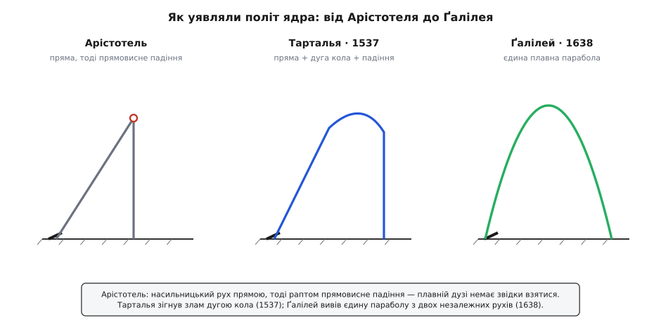
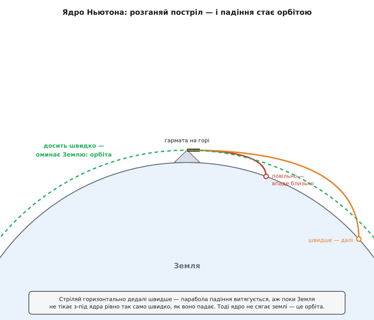

# 📜 Дуга, якій дві тисячі років не було звідки взятися

> Історична вставка до теми про політ тіла, кинутого під кутом. Дугу, яку креслить у повітрі камінь, стріла чи гарматне ядро, бачив кожен, хто бодай раз жбурляв каменем, — і понад дві тисячі років ніхто не міг сказати, **звідки** ця дуга береться. Це розповідь про картину світу, у якій плавна крива була просто неможлива; про заїкуватого гармаша з Брешії, що перший навів на постріл математику; про Ґалілея, який розсік політ на дві прості історії; і про Ньютона, що розігнав ядро так, аж воно перестало падати на землю.

Найдивніше в цій історії — що загадкою була сама очевидність. Не якесь тонке явище на межі досліду, а звичайнісінька дуга кинутого каменя, яку бачить дитина. Найкращі уми Європи дивилися на неї століттями — і не пояснювали. Причина не в тому, що бракувало спостережень; причина в тому, що вся тодішня картина руху **забороняла** цій дузі існувати. Щоб її нарешті побачити, довелося спершу зруйнувати цю картину до підмурку.

## Світ, у якому дуга неможлива: Арістотель

Почнімо з того, проти чого всі боролися. **Арістотель** (Ἀριστοτέλης, 384–322 до н. е.) поділив увесь рух на два роди. Є рух **природний**: важке тіло само прагне вниз, до центру світу, і летить туди прямо; дим і полум'я природно йдуть угору. І є рух **насильницький** (примусовий) — будь-який інший, супроти природного, і він вимагає, щоб хтось **безперервно штовхав** тіло. Ось наріжний камінь цієї фізики: тіло рухається, лише **поки на нього діє сила**. Забери силу — і рух умить припиняється. Поняття інерції — того, що тіло само́ несе свій рух далі, — тут просто немає.

І тут-таки визирає халепа, яку сам Арістотель чудово бачив. Кинутий камінь: рука його штовхнула й **відпустила**. Він летить далі — але що́ його тепер жене? Рука позаду, дотику немає, а рух триває. За власним законом Арістотеля цього бути не може. Порятунок він знайшов у повітрі: мовляв, камінь, летячи, розсуває повітря перед собою, а воно збігається ззаду, заповнює порожнечу за тілом і **підпихає** його вперед. Цей механізм назвали **антиперистасис** (гр. antiperístasis — «взаємна заміна місцями»). Повітря нібито передає естафету поштовху, аж поки та не вичерпається.

А коли вичерпається — насильницький рух скінчився, і тіло згадує про свою природу: **падає прямовисно вниз**. Ось і вся траєкторія: пряма (чи майже пряма) лінія примусового польоту, тоді різкий злам — і стрімке падіння. Двох рухів заразом ця схема не терпить: тіло в кожну мить робить **щось одне** — або летить, або падає. Плавній дузі просто немає з чого скластися. Гармаш бачив криву на власні очі, але теорія запевняла: кривої бути не повинно. Двадцять століть люди дивилися на політ каменя крізь окуляри, що робили головне в ньому невидимим.

> 🔧 **Навіщо це.** Головна перешкода була не в гарматах, а в одній відсутній думці — що тіло здатне **само́** нести свій рух далі. Поки цієї думки немає, дуга буквально немислима: рух треба щомиті «годувати» силою, а звідки їй узятися в летючому камені — незрозуміло. Уся дальша історія — це, по суті, повільне народження поняття [інерції](topic:ph-mechanics/newtons-first-law), і аж на його ґрунті виростає крива польоту.

## Перша тріщина: імпетус

Незгодні знайшлися рано. Ще в VI столітті олександрійський грек **Іван Філопон** (Ἰωάννης ὁ Φιλόπονος, бл. 490–570) висміяв повітряний механізм простим доказом: якщо тіло жене повітря ззаду, то навіщо взагалі напинати лук — розмахуй руками позаду стріли, та й полетить. Ні, казав Філопон, метальник вкладає в саме тіло якусь **безтілесну рушійну силу**, і вона несе його далі, а повітря радше заважає рухові, ніж помагає.

Цю думку підхопив і відточив перський учений **Ібн Сіна** (ابن سینا, Авіценна, бл. 980–1037), а в XIV столітті паризький магістр **Жан Бурідан** (Jean Buridan, бл. 1301–1360) дав їй тверде ім'я — **імпетус** (лат. impetus — натиск, порив). За Буріданом, метальник передає тілу певну кількість імпетусу, пропорційну до його ваги та швидкості; цей запас і жене тіло, а тяжіння й опір повітря поволі його **проїдають**.

І ось де важливо: тепер траєкторія **може гнутися**. Поки імпетусу багато, він тягне тіло вперед-угору; він тане — і тяжіння бере своє, загинаючи політ донизу дедалі крутіше. Не злам, а плавний перехід. Саме звідси невдовзі виросте «пряма плюс дуга» перших балістиків. Бурідан пішов і далі: на небі повітря немає, спиняти імпетус нічому — тож, раз штовхнуті на початку, світила кружляють вічно, без жодних ангелів, що їх підпихають. Це вражаюче передчуття інерції — щоправда, з осторогою: сам Бурідан інерції ще не мав, так його читають історики заднім числом, і читання це слушне лише почасти.

Зверніть увагу, хто вже долучився до розгадки: грек, перс, француз. Балістику ніхто не «винайшов» одноосібно й тим паче не одна нація — це естафета, яку передавали через культури й століття. Наступний, хто прийме її палицю, вкладе в неї математику.

## Заїкуватий гармаш із Брешії: Нікколо Тарталья

**Нікколо Фонтана** (Niccolò Fontana, бл. 1499/1500–1557) увійшов в історію під прізвиськом, що народилося з рани. Хлопчиком років дванадцяти він пережив розграбування рідної Брешії французьким військом (1512, під час Війни Камбрейської ліги проти Венеції). Родина сховалася в соборі, та солдати вдерлися й туди; шабля розсікла хлопцеві щелепу й піднебіння й лишила його напівмертвим. Мати його виходила, але каліцтво зосталося з ним назавжди стійкою вадою мови — заїканням. Звідси й **Тарталья** (від іт. tartagliare — заїкатися); під цим ім'ям бідний, майже самотужки вивчений математик і став знаменитий. (Це той самий Тарталья, що згодом розв'яже кубічне рівняння й гірко посвариться через нього з Кардано, — але то вже інша історія.)

Дитинство під шаблею залишило в ньому ненависть до війни — і саме вона зробила драматичною його головну книжку. Року 1537 у Венеції виходить **«Нова наука»** (Nova Scientia), присвячена герцогові Урбінському Франческо Марії делла Ровере, — перша спроба навести на гарматний постріл строгу математику. Але у вступному листі Тарталья зізнається в дивній для збройного трактату речі: він довго вважав ганебним і гріховним удосконалювати мистецтво вбивати ближнього, і навіть **спалив свої обрахунки**, вирішивши не давати людям цієї науки. Опублікувати його змусила турецька загроза християнському світові: перед лицем спільного ворога він визнав за оборонний обов'язок віддати своє знання на захист. Це не легенда — так він пише сам у присвяті (статус: задокументовано з першоджерела; наскільки щире було каяття, судити вже годі).

Що ж він побачив у польоті ядра? Його траєкторія складалася з **трьох частин**: прямого відрізка примусового руху, дуги кола, дотичної до нього, і нарешті прямовисного падіння вниз — чистий спадок імпетусу. Тарталья добре розумів, що це ідеалізація: він прямо писав, що насправді **жодна частина шляху не буває строго прямою**, крива всюди. Але математики для справжньої кривої він не мав, тож ламав її на прямі й дугу, з якими вмів рахувати. І попри цю грубість він видобув перлину — правило, що дожило до наших днів: **найдалі ядро летить, коли ствол піднято під 45°** до горизонту. Він навіть оцінив, наскільки виграє такий постріл проти настильного.

Ось де межа його прориву. Тарталья **виміряв** явище й **угадав правильне число**, але зробив це всередині старої геометрії. Чому крива саме така, звідки береться сама дуга — цього його «пряма плюс коло» не пояснювали. Постріл дістав математику, але ще не дістав **причину**. Щоб дуга нарешті мала звідки взятися, хтось мав відмовитися від головної Арістотелевої заборони — і зробити те, що дві тисячі років вважали неможливим.

*Як мінялася сама картина польоту. В Арістотеля дузі немає звідки взятися — насильницький рух прямою, тоді раптовий злам і падіння вниз. Тарталья (1537) згладив злам дугою кола, але це ще склейка з трьох шматків. І лише Ґалілей (1638) дістав єдину плавну параболу — з двох простих рухів заразом.*

## Дві історії водночас: Ґалілео Ґалілей

Заборону зняв **Ґалілео Ґалілей** (Galileo Galilei, 1564–1642), і зробив це одним зухвалим припущенням: тіло здатне робити **два незалежні рухи заразом** — саме те, що Арістотель уважав неможливим. Уздовж землі — рівномірний рух за інерцією, бо вбік нічого не тягне. Униз — рівноприскорене [вільне падіння](topic:ph-mechanics/free-fall), у якому шлях росте з квадратом часу. Дуга — не окремий загадковий рух, а проста **сума** цих двох, накладених один на одного; і головне — кожен із них геть не помічає іншого, тож горизонтальний біг нічого не знає про тяжіння, а падіння нічого не знає про те, що тіло кудись летить.

І ось що красиво: він це не просто вигадав, а **виміряв**. Близько 1608 року в Падуї (тоді — володіння Венеційської республіки) Ґалілей пускав бронзові кульки по похилому жолобу й далі з краю стола, відмічаючи, куди вони падають. На одному з його робочих аркушів — знаменитому «folio 116v» — уціліли ці числа. І вони казали ясно: горизонтальний відхід росте **рівно з часом**, а падіння — **із квадратом часу**; склади їх — і точки падіння лягають на параболу (гр. parabolḗ — прикладання). Крива польоту нарешті дістала причину: вона така, бо одне число росте як t, а друге — як t², і ця несиметрія й загинає пряму в дугу.

Чому ж світ дізнався про це аж 1638-го, через тридцять років по досліді? Бо між дослідом і книжкою став суд. Після процесу Інквізиції 1633 року й вироку про домашній арешт Церква заборонила друкувати праці Ґалілея. Рукопис довелося переправити на протестантську північ, до Лейдена, де його й видав дім Ельзевірів під назвою **«Бесіди й математичні доведення про дві нові науки»** (Discorsi... intorno a due nuove scienze). У «Четвертому дні» цих «Бесід» Ґалілей уже строго **доводить** те, що Тарталья лише вгадав: дальність найбільша під 45°, а кути, що доповнюють один одного до прямого (30° і 60°, 15° і 75°), б'ють на однакову відстань.

> 🔧 **Навіщо це.** Ґалілеїв прийом — це рецепт усієї подальшої фізики: спершу **прибери ускладнення**, знайди чистий закон, а тоді додавай складнощі назад. Він чудово знав, що повітря псує картину, — і свідомо його відкинув, щоб побачити ідеальну параболу. Тарталья зробив цей крок наполовину; Ґалілей — до кінця, і саме тому дійшов до суті. Опір повітря нікуди не подівся, але тепер було від чого відштовхуватися.

## Ядро, що вже не впало: Ісаак Ньютон

Лишався останній, найбільший крок — і зробив його **Ісаак Ньютон** (Isaac Newton, 1643–1727). Ґалілеєва парабола описувала камінь чи ядро; Ньютон показав, що та сама крива, розігнана як слід, стає **орбітою планети**. Місток він перекинув в уявному досліді — у трактаті «Система світу» (De mundi systemate), доступнішому супутнику до третьої книги «Начал»; написаний близько 1685 року, вийшов він уже посмертно, 1728-го.

Уяви, каже Ньютон, гору таку високу, що її вершина стирчить понад усе повітря, а на вершині — гармату, і стріляє вона строго горизонтально. Слабкий заряд — ядро окреслить коротку параболу й упаде неподалік. Дужчий — упаде далі, бо поверхня під ним встигає трохи піти вниз своєю кривиною. Ще дужчий — і настає диво: **земля вигинається донизу рівно так само швидко, як ядро на неї падає**. Ядро весь час падає — і весь час промахується повз землю, бо та тікає з-під нього. Воно вже не сягає ґрунту ніколи: обходить усю планету по колу й повертається до тієї самої гори ззаду. Ще швидше — і коло витягнеться в еліпс; іще швидше — ядро втече від Землі назовсім.

*Постріл Ньютона з захмарної гори. Що більша початкова швидкість, то далі падає ядро, аж поки крива його падіння не збіжиться з кривиною Землі — тоді воно «падає», не наближаючись до поверхні, тобто виходить на орбіту. Гарматна дуга й орбіта Місяця — одна безперервна родина кривих.*

А скільки ж насправді треба розігнати? Побіля самої землі — близько **7.9 км/с**, майже 28 000 км/год (сучасне число, «перша космічна швидкість»). Жодна гармата такого не видасть — ядро згорить чи розлетиться від перевантаження, та й густе повітря внизу вмить його загальмує. Ось чому від Ньютонового задуму до першого справжнього супутника минуло понад два з половиною століття: знадобилася не гармата, а ракета, яка розганяється поступово й уже за межами щільного повітря. Але сам принцип — той самісінький, що на високій горі: супутник не «висить» у космосі, він **безупинно падає** на Землю, вічно її промахуючись.

І ось у чому велич цієї картинки. Дуга гармаша Тартальї й [орбіта](topic:ph-mechanics/keplers-laws), якою Місяць обходить Землю, — це **одне й те саме** явище, лише за різних швидкостей. Місяць весь час падає на Землю — і весь час її промахується; він робить рівно те, що ядро на високій горі. [Всесвітнє тяжіння](topic:ph-mechanics/newton-gravitation) стерло межу між земним і небесним: камінь під ногами й світило в небі кориться одному законові. А заразом ця картина заднім числом уточнює й Ґалілея: його «парабола» — насправді малесенький клаптик велетенського еліпса, випрямлений лише тому, що поблизу землі планета здається пласкою, а тяжіння — прямовисним і всюди однаковим.

## Через дві тисячі років

Озирнімося на весь шлях — і побачимо, що кожен крок був не так новою формулою, як новим **дозволом** тій самій дузі існувати.

- **Арістотель** дугу забороняв: рух живе, лише поки штовхають, і робиться щось одне заразом — або летиш, або падаєш.
- **Імпетус** (Філопон → Ібн Сіна → Бурідан) дав кривій зігнутися: внутрішній поштовх поволі тане, тяжіння загинає політ.
- **Тарталья** (1537) її виміряв, знайшов золоте правило 45°, але вбрав у стару геометрію — пряма, дуга кола, падіння.
- **Ґалілей** (1638) розсік політ на два чесні рухи — рівномірний убік і вільне падіння вниз — і дістав нарешті чисту параболу, довівши й 45°, і рівність доповняльних кутів.
- **Ньютон** (1728, посмертно) розігнав постріл доти, доки парабола не зімкнулася в орбіту, — і показав, що ядро й Місяць кориться одному тяжінню.

Кілька слів про самих героїв, щоб не приліпити зайвих ярликів. Тарталья був підданим Венеційської республіки; Ґалілей народився в Пізі (герцогство Тосканське) і головні досліди робив у Падуї під Венецією — «Італії» як єдиної держави тоді ще не існувало, до неї лишалося понад три століття; Ньютон був англійцем. Жодна одна країна цієї науки не «породила»: її, як ми бачили, зводили грек, перс, француз, кілька італійців і англієць, передаючи одне одному з рук у руки крізь тисячоліття.

А наприкінці лишається образ, простіший за всі формули. Те саме падіння, що повертає підкинутий камінь тобі в долоню, тримає Місяць у небі. Летіти по дузі — це просто **падати, не перестаючи водночас рухатися вбік**. Дві тисячі років цю немудру думку не пускала у світ картина, у якій тіло могло робити лише щось одне заразом. Варто було дозволити йому робити двоє нараз — і загадкова дуга виявилася найзвичайнісіньким, найчеснішим рухом у природі.
