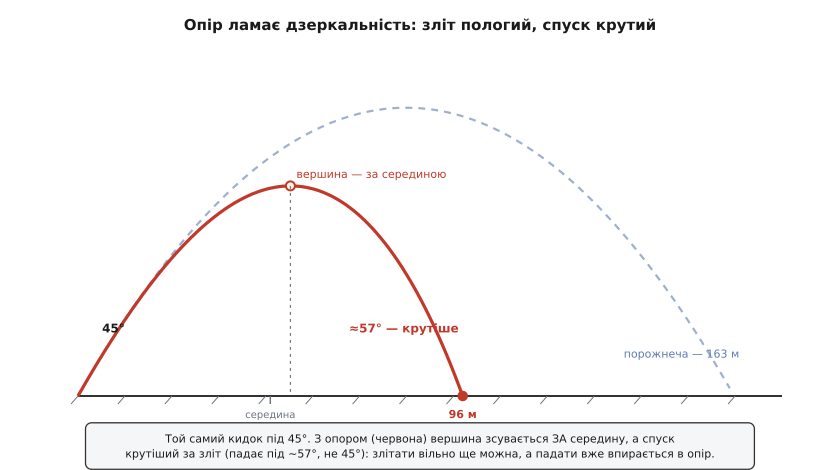
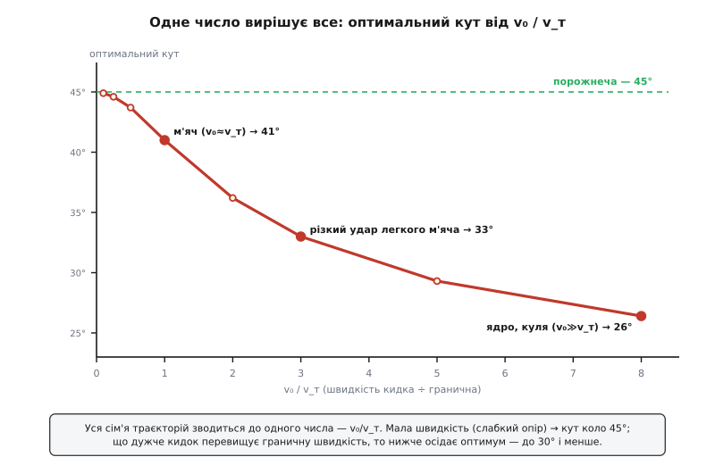
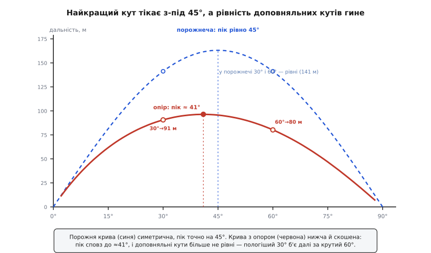

# ⚙️ Політ з опором ∝ v²: інтегруємо криву, якої нема у формулі

У порожнечі кинуте тіло — це подарунок: горизонтальна швидкість стала, вертикальна рівномірно тане, а весь політ згортається в один рядок `y = x·tanα − (g/2v₀²cos²α)·x²`, чисту параболу. Впустімо в задачу повітря — і цей рядок гине на очах. Опір тисне назустріч рухові й тим дужче, чим швидше тіло мчить; горизонтальна швидкість більше **не стала**, бо її гальмує опір; вертикальна теж не просто тане під g, бо опір домішується й туди. Гірше того, обидві осі тепер **зчеплені**: сила опору дивиться проти повного вектора швидкості, тож у неї входить `|v| = √(vₓ² + v_y²)` — а це змішує рух угору з рухом убік в один нерозв'язний клубок. Первісної, а тим паче елементарної функції, що дала б «де впаде», для цього клубка **не існує**.

І тут комп'ютер починає заробляти свій хліб. Раз формули на весь політ нема, тіло проводять крізь час **дрібними кроками**: знаючи стан зараз, обчислюють силу, роблять крихітний крок уперед, у новій точці рахують силу знову — і з тисячі таких кроків складають усю криву. Це не академічна вправа: саме цю марудну лічбу артилерійських траєкторій із опором армія США колись поставила за головну мету машині ENIAC — контракт на неї підписали 1943 року, а перші балістичні траєкторії вона перемолола в грудні 1945-го, за секунди замість днів ручного рахунку. *(Усталена історія: ENIAC замовила Балістична лабораторія (BRL) Абердинського полігону саме під стрілецькі таблиці.)* Розберімо, як улаштований цей марш, і що він показує: реальна дуга не просто коротша за параболу — вона **скошена** (спуск крутіший за зліт), а її найвигідніший кут сповзає **нижче 45°**, і все це вирішує одне-єдине число.

## Задача: сила відома, а крива — ні

На тіло масою m діють дві сили. Тяжіння тягне вниз сталою `m·g`. [Опір повітря](topic:ph-mechanics/aerodynamic-drag) на побутових швидкостях **квадратичний** — пропорційний квадрату швидкості й спрямований точно проти руху: `F_оп = −c·|v|·v`, де множник `|v|·v` дає і величину `c·|v|²`, і напрямок (проти вектора `v`). Чому квадратичний, а не лінійний, вирішує [число Рейнольдса](topic:ph-mechanics/reynolds-number): для звичайних тіл у повітрі воно велике, і опір диктує інерція повітря, що його тіло розштовхує, — а вона росте як квадрат швидкості. Коефіцієнт `c = ½·ρ·C_d·A` збирає густину повітря ρ, коефіцієнт форми C_d і лобову площу A.

Другий закон перетворює сили на прискорення, `a = F/m`, і маса опору скорочується не повністю — лишається `c/m`. Позначмо `k = c/m` (одиниця — 1/м). Стан тіла цієї миті — чотири числа: положення `(x, y)` і швидкість `(vₓ, v_y)`. Увесь закон руху вкладається у дві векторні рівності:

```
dr/dt = v                        положення тягнеться за швидкістю
dv/dt = −g·ĵ − k·|v|·v            швидкість — за прискоренням (тяжіння + опір)
```

Ось де ховається зчеплення осей. Розпишімо праву частину покомпонентно:

```
dvₓ/dt =      − k·|v|·vₓ          горизонталь гальмує опір
dv_y/dt = −g  − k·|v|·v_y         вертикаль: тяжіння + опір
```

У кожен рядок входить **спільний** множник `|v| = √(vₓ² + v_y²)`. Тому вертикальний рух тепер знає про горизонтальний, і навпаки: розігнався вбік — зросло `|v|` — подужчав опір і **вгору-вниз** теж. Незалежності двох рухів, на якій трималася чиста парабола, більше немає.

Одну величину варто дістати одразу — вона стане ключем до всього. Пустімо тіло падати прямовисно й спитаймо, коли опір **зрівноважить** тяжіння: `g = k·v²`. Швидкість, за якої це стається, — **гранична** (термінальна):

```
v_т = √(g / k) = √(m·g / c)
```

Далі за неї опір падати не пускає — це та швидкість, з якою висить парашутист і падає крапля дощу (докладніше — у [вільному падінні](topic:ph-mechanics/free-fall)). І ось фокус: `k = g / v_т²`, тож у рівнянні руху `k` можна геть прибрати, лишивши натомість `v_т`:

```
dv/dt = −g·ĵ − (g/v_т²)·|v|·v = −g·[ ĵ + (|v|/v_т)·(v/v_т) ]
```

Помасштабуймо швидкість граничною, `u = v/v_т`, а час — величиною `v_т/g`. Тоді все скорочується до голого

```
du/dτ = −ĵ − |u|·u
```

— рівняння **без жодного параметра**. Уся різниця між усіма кидками у світі сидить тепер в одному числі: **у відношенні швидкості кидка до граничної, `v₀/v_т`** (плюс кут). Кинули повільно проти граничної (`v₀ ≪ v_т`) — опір ледь чутний, повертається парабола. Кинули швидко (`v₀ ≫ v_т`) — опір панує, і крива на себе не схожа.

> 🔧 **Навіщо це.** Одне число `v₀/v_т` заздалегідь каже, наскільки взагалі варто перейматися повітрям. Для м'яча (маса 145 г, C_d ≈ 0.35) гранична швидкість виходить `v_т ≈ 40 м/с` — рівно того порядку, що й добрий удар. Тому кинутий на 40 м/с м'яч живе в найцікавішому режимі `v₀/v_т ≈ 1`, де опір псує все помітно. А ось важка щільна куля має `v_т` у сотні м/с: доки її швидкість набагато менша, повітря їй майже байдуже — та сама причина, чому монетка й пір'їна падають однаково лише у вакуумі.

## Ідея: закон — це рецепт одного кроку

Похідна — це нахил ([похідна як швидкість зміни](topic:math-analysis/derivative)): `dv/dt` каже, скільки швидкості набігає за одиницю часу. За дуже короткий проміжок `Δt` можна вдати, що прискорення стале, і ступити один прямий крок уздовж нього — і так само для положення вздовж швидкості. Це **явний метод Ейлера**:

```
v(t + Δt) ≈ v(t) + Δt·a          a = −g·ĵ − k·|v|·v — прискорення тут і тепер
r(t + Δt) ≈ r(t) + Δt·v
```

Прозоро, як скло, але грубо: прискорення-бо міняється й **усередині** кроку, а ми вдали, ніби ні. Ейлер лишає похибку першого порядку (за весь політ вона спадає лише як `Δt`), а на завеликому кроці ще й вибухає чи тихо накачує енергію — цей звіринець хвороб і ліків (стійкість, симплектичність, неявний крок) розібрано окремо на [числовому інтегруванні F = m·a](topic:ph-mechanics/newtons-second-law/proj-numerical-integration.md). Тут візьмімо метод, що на порядок акуратніший майже задарма, — **Рунге–Кутту 4-го порядку (RK4)**.

Ідея RK4 — не вірити нахилові лише на початку кроку, а зазирнути всередину. Він міряє прискорення в **чотирьох** точках: на старті (`k₁`), двічі посередині (`k₂`, `k₃`, кожна на пробному півкроці попередньої) і в кінці (`k₄`), а тоді бере їх зваженим середнім `(k₁ + 2k₂ + 2k₃ + k₄)/6`. Це середнє гасить похибку аж до `Δt⁴`: здрібнив крок удесятеро — похибка менша в **десять тисяч** разів. Метод придумав німецький математик Карл Рунге (1895), а до сьогоднішньої «класичної» форми четвертого порядку довів його співвітчизник Мартін Вільгельм Кутта (1901). *(Усталена історія чисельних методів.)*

Наскільки це вигідно, видно з одного прогону нашого м'яча під 45°. Точна дальність — 95.6 м; порахуймо її грубим кроком `Δt = 0.1 с` двома методами:

```
Δt = 0.1 с        дальність     похибка
явний Ейлер        96.6 м       +1.0 м  (майже 1%)
RK4                95.607 м     +0.001 м
точне (Δt→0)       95.608 м
```

RK4 навіть таким недбалим кроком влучає в третій знак, тимчасом як Ейлерові для тієї ж точності треба крок у сотні разів дрібніший. Ось код обох крокувальників. Задача — навчальне інтегрування звичайних диференціальних рівнянь, де Python читається майже як сам запис; але той самий крок RK4 щосекунди мільйонами крутиться в гарячих циклах фізичних рушіїв та польотних контролерів, де вирішує сира швидкодія, — тож поряд ідіоматичний C++:

:::tabs
```python
import math

g = 9.81                                    # м/с², тяжіння вниз

def accel(state, k):
    """Похідна стану. k = c/m — коефіцієнт квадратичного опору (1/м)."""
    x, y, vx, vy = state
    speed = math.hypot(vx, vy)              # |v| — саме воно зчіплює осі
    ax = -k * speed * vx                     # опір проти горизонтального руху
    ay = -g - k * speed * vy                 # тяжіння + опір проти вертикального
    return (vx, vy, ax, ay)                  # (ẋ, ẏ, v̇ₓ, v̇_y)

def rk4_step(state, k, dt):
    add = lambda s, d, h: tuple(si + h*di for si, di in zip(s, d))
    k1 = accel(state, k)                      # нахил на старті
    k2 = accel(add(state, k1, dt/2), k)       # …на пробному півкроці
    k3 = accel(add(state, k2, dt/2), k)       # …ще раз посередині
    k4 = accel(add(state, k3, dt), k)         # …у кінці кроку
    return tuple(s + dt/6*(a + 2*b + 2*c + d)  # зважене середнє чотирьох
                 for s, a, b, c, d in zip(state, k1, k2, k3, k4))
```
```cpp
#include <cmath>

struct State { double x, y, vx, vy; };
constexpr double g = 9.81;

// похідна стану: прискорення від тяжіння + квадратичного опору
static State accel(State s, double k) {
    double sp = std::hypot(s.vx, s.vy);       // |v| зчіплює осі
    return { s.vx, s.vy, -k*sp*s.vx, -g - k*sp*s.vy };
}
static State axpy(State s, State d, double h) {  // s + h·d покомпонентно
    return { s.x + h*d.x, s.y + h*d.y, s.vx + h*d.vx, s.vy + h*d.vy };
}
static State rk4_step(State s, double k, double dt) {
    State k1 = accel(s, k);                    // нахил на старті
    State k2 = accel(axpy(s, k1, dt/2), k);    // …на пробному півкроці
    State k3 = accel(axpy(s, k2, dt/2), k);    // …ще раз посередині
    State k4 = accel(axpy(s, k3, dt), k);      // …у кінці кроку
    auto mix = [&](double a, double b, double c, double d) {
        return dt/6 * (a + 2*b + 2*c + d);     // зважене середнє
    };
    return { s.x  + mix(k1.x, k2.x, k3.x, k4.x),
             s.y  + mix(k1.y, k2.y, k3.y, k4.y),
             s.vx + mix(k1.vx, k2.vx, k3.vx, k4.vx),
             s.vy + mix(k1.vy, k2.vy, k3.vy, k4.vy) };
}
```
:::

## Робочий код: марш до землі й звірка з порожнечею

Один крок — ще не політ. Потрібен цикл, що жене тіло, доки воно не торкнеться землі, і — тонкість, яку легко проґавити, — акуратно ловить **саму мить** торкання. Бо тіло перетинає землю **всередині** кроку, а не рівно на його межі: зчитаєш дальність з останнього стану — і промахнешся аж на цілий крок. Правильно — помітити зміну знаку `y` й **лінійно інтерполювати** точку перетину `y = 0` між двома станами:

```python
def flight(v0, angle_deg, k, dt=0.005):
    """Кинути під кутом, крокувати до землі; повернути (дальність, вершина, кут падіння)."""
    a = math.radians(angle_deg)
    s = (0.0, 0.0, v0*math.cos(a), v0*math.sin(a))     # старт із початку координат
    apex = 0.0
    while True:
        nxt = rk4_step(s, k, dt)
        apex = max(apex, nxt[1])                        # найвища точка дорогою
        if nxt[1] <= 0.0 < nxt[0]:                      # перетнули землю всередині кроку
            frac = s[1] / (s[1] - nxt[1])               # частка кроку до y = 0
            xr = s[0] + frac*(nxt[0] - s[0])            # інтерполюємо дальність
            vx = s[2] + frac*(nxt[2] - s[2])
            vy = s[3] + frac*(nxt[3] - s[3])
            return xr, apex, math.degrees(math.atan2(-vy, vx))  # +кут удару об землю
        s = nxt
```

Тепер зберімо коефіцієнт опору з фізичних даних м'яча й пустімо його під 45° — порівнюючи з тим, що дала б порожнеча:

```python
m, rho, Cd, A = 0.145, 1.225, 0.35, 0.0042    # м'яч: 145 г, повітря, форма, лобова площа
c = 0.5 * rho * Cd * A                          # квадратичний коефіцієнт, кг/м
k = c / m                                        # = 6.21·10⁻³ 1/м
v_term = math.sqrt(g / k)                        # гранична швидкість ≈ 39.8 м/с

xr, apex, land = flight(40.0, 45.0, k)
print(f"дальність {xr:.1f} м, вершина {apex:.1f} м, кут падіння {land:.1f}°")
# → дальність 95.6 м, вершина 29.7 м, кут падіння 57.4°
```

Тепер порівняймо це число з ідеальною параболою. У порожнечі той самий кидок дав би дальність `v₀²·sin(90°)/g = 1600/9.81 = 163.1 м` і підйом 40.8 м, і крива була б **дзеркально симетрична**: злітало б тіло під 45° і падало б назад теж під 45°. Опір усе це ламає:

```
                    порожнеча        з опором
дальність            163.1 м          95.6 м        (з'їдено 41%)
висота підйому        40.8 м          29.7 м
час у повітрі         5.77 с          4.90 с
кут зльоту            45°             45°
кут падіння           45°             57°           ← спуск помітно крутіший
```

Погляньмо на форму цієї скошеної дуги уважніше. Вершина припадає на `x ≈ 52.8 м` — це **за** серединою польоту (середина була б на 47.8 м): тіло довго й полого набирає висоту, покриваючи 52.8 м угору-вперед, а тоді падає крутіше й ближче, лишаючи на спуск усього 42.8 м. Причина проста, щойно її вимовити: **вгору тіло ще може летіти майже вільно, а вниз уже впирається в опір**. На зльоті опір і тяжіння разом гасять рух, але тіло швидке — воно далеко залітає. На спуску тіло встигло пригальмувати, повна швидкість менша, тож дуга крутішає й коротшає, а падає воно, наближаючись до своєї граничної швидкості, майже прямовисно.


*Асиметрія, якої в параболі не буває. Пунктир — політ у порожнечі, симетричний, 163 м. Червона крива — з опором: коротша (96 м), вершина зсунута **за** середину, а спуск крутіший за зліт (падає під ~57°, не 45°). Причина — вгору ще можна злітати майже вільно, а вниз тіло вже впирається в опір коло граничної швидкості.*

## Найкращий кут тікає з-під 45°

У порожнечі відповідь на «під яким кутом летіти найдалі» відома напам'ять: рівно 45°, і доповняльні кути (30° і 60°, 15° і 75°) б'ють в одну точку, бо `sin(2α)` їх не розрізняє. Опір руйнує **обидва** ці правила. Проженімо той самий м'яч під трьома кутами:

```python
for a in (30, 45, 60):
    print(a, "°→", round(flight(40.0, a, k)[0], 1), "м")
# 30 °→ 90.6 м     ← у порожнечі 30° і 60° РІВНІ (по 141 м); з опором 30° б'є далі!
# 45 °→ 95.6 м
# 60 °→ 80.2 м
```

Дзеркальна рівність доповняльних кутів **зникла**: пологий 30° тепер б'є на 90.6 м, а крутий 60° — лише на 80.2 м, хоча в порожнечі вони лягали б рівно в одну точку. Причина та сама зчепленість: крутий постріл довго висить у повітрі повільним вертикальним рухом, і весь цей час опір гризе його швидкість; пологий швидко доправляє м'яч уперед, поки опір не встиг з'їсти забагато. Компроміс «довго летіти проти швидко посуватися вбік» зсувається на бік **пологішого** пострілу — а отже, й найкращий кут падає нижче 45°. Знайдімо його прямо перебором:

```python
def best_angle(v0, k, lo=10, hi=60):
    R = lambda a: flight(v0, a, k)[0]
    coarse = max(range(lo, hi + 1), key=R)          # найкращий цілий градус
    fine = [coarse - 1 + 0.1*i for i in range(21)]  # уточнити ±1° по 0.1°
    return round(max(fine, key=R), 1)

print(best_angle(40.0, k))    # → 40.9°  (не 45°!)
```

Для нашого м'яча оптимум сповз до **≈41°**. Зсув скромний, бо `v₀/v_т ≈ 1` — опір відчутний, але ще не панує. А оскільки вся фізика залежить лише від `v₀/v_т`, поставмо це питання універсально: як оптимальний кут залежить від того, наскільки кидок перевищує граничну швидкість?

```python
v_ref = 30.0                      # довільна гранична швидкість
k_ref = g / v_ref**2              # відповідний коефіцієнт опору
for ratio in (0.25, 0.5, 1, 2, 3, 5, 8):
    print(f"v₀/v_т = {ratio}:  оптимум {best_angle(ratio*v_ref, k_ref)}°")
# v₀/v_т = 0.25:  оптимум 44.6°      ← слабкий опір: майже 45°
# v₀/v_т =  0.5:  оптимум 43.7°
# v₀/v_т =    1:  оптимум 41.0°      ← м'яч
# v₀/v_т =    2:  оптимум 36.2°
# v₀/v_т =    3:  оптимум 33.0°
# v₀/v_т =    5:  оптимум 29.3°
# v₀/v_т =    8:  оптимум 26.4°      ← опір панує
```

Крива монотонна й гарна: доки кидок слабкий проти граничної швидкості, оптимум тулиться до 45° (порожнеча); що дужче `v₀` переростає `v_т`, то нижче осідає найкращий кут — до 30° і глибше. Одне число вирішує все.


*Універсальна крива: оптимальний кут — функція **одного** числа `v₀/v_т`. Слабкий опір (ліворуч) — кут коло 45°, як у порожнечі. Що швидший кидок проти граничної швидкості, то нижче найкращий кут: м'яч (≈41°), різко вдарений легкий м'яч (33°), швидка куля чи ядро (нижче 30°).*

Ту саму історію видно й у профілі дальності від кута — де порожня крива симетрична з піком точно на 45°, а крива з опором нижча, скошена, з піком коло 41°:


*Дальність від кута. Порожня крива (синя) симетрична, пік рівно на 45°, доповняльні кути рівні. Крива з опором (червона) нижча й скошена: пік сповз до ≈41°, а доповняльні кути розійшлися — пологіший 30° б'є далі за крутий 60°.*

Наскільки радикальним стає зсув на межі, показують крайні випадки. Легкий м'яч для пінг-понгу (маса 2.7 г, діаметр 40 мм) має мізерну граничну швидкість `v_т ≈ 8.3 м/с`; різко вдарений на 25 м/с, він живе в режимі `v₀/v_т ≈ 3`, і його оптимум — **33°**, а дальність під 30° (11.4 м) уже вища за дальність під 45° (10.9 м). На протилежному кінці — гарматне ядро: щільне залізо має високу `v_т`, зате й вилітає зі швидкістю в сотні м/с, знову ставлячи `v₀/v_т` далеко за одиницю, — тож найдальший постріл дає кут помітно нижчий за 45°, а сама дальність — лише частка від «шкільної». Саме тому далекобійники ніколи не рахували стрільбу шкільною формулою й не наводили на 45°, а зводили багатосторінкові таблиці з дослідів — ті самі, під які й будували ENIAC.

> 🔧 **Навіщо це.** У фізиці ігор і симуляціях «під яким кутом кинути, щоб долетіло» — щоденне питання, і 45° тут майже завжди **хибна** відповідь, щойно ввімкнено опір. Той самий марш дає й обернену задачу — навести кидок у ціль: перебери кути, для кожного крокни політ, візьми той, що влучає. Дорослі системи наведення (від артилерії до дронів-перехоплювачів) роблять рівно це — інтегрують траєкторію моделлю опору й шукають кут чисельно, бо аналітичної формули для нього просто нема.

## Складність і пастки

Усі методи тут коштують `O(кроків)` — один прохід, жменя накопичувачів, жодної зайвої пам'яті. RK4 витрачає **чотири** обчислення сили на крок проти одного в Ейлера, але його точність дозволяє брати крок у десятки разів більший — тож на гладкому польоті він майже завжди виграє чистим часом. Уся тонкість не у швидкості, а в тому, що легко проґавити.

**Крок і стійкість.** У явних методів завжди є межа: завеликий крок обертає гладкий розрахунок на зигзаг, що розлітається в безмежжя. Характерний час задачі — порядку `v_т/g` (а на високій швидкості, де опір реагує різкіше, ще коротший); крок мусить бути помітно меншим за нього. RK4 стійкіший за Ейлер, але не безсмертний. Золоте правило розрізнення: **побачив дивину — здрібни крок удвічі й проженися знову**. Зникла — то був числовий привид, треба менший `Δt`. Лишилася — дивина фізична. Повний розбір стійкості, симплектичності й неявних методів для жорсткого опору — на [числовому інтегруванні F = m·a](topic:ph-mechanics/newtons-second-law/proj-numerical-integration.md).

**Лови землю між кроками.** Тіло перетинає землю **всередині** кроку. Зчитаєш дальність з останнього стану — і систематично перелітаєш аж на цілий крок. Завжди інтерполюй перетин `y = 0` (як робить `flight`); те саме — для влучання в стіну, поріг, ціль.

**Коефіцієнт опору не сталий.** Ми взяли `C_d` за константу — це навчальна модель. Насправді `C_d` гуляє: біля певного числа Рейнольдса він різко падає (криза опору — саме тому гладкий і шорсткий м'ячі летять по-різному), а на навколозвукових швидкостях (швидка куля, ядро) круто **зростає** коло Маха 1. Тому реальні стрілецькі таблиці міряли `C_d` як функцію швидкості з дослідів, а не брали одне число. Наш код готовий до цього: досить зробити `k` функцією `speed`.

**Обертання й вітер — окремі сили.** Модель `−c·|v|·v` не знає про **обертання** тіла: закручений м'яч (кручений удар, підрізаний гольф) відхиляє ще й бічна сила Маґнуса, якої в нашому рівнянні нема. І пам'ятай: опір залежить від швидкості тіла **відносно повітря**, а не землі, — щоб додати вітер, підстав у член опору `(v − v_вітру)` замість `v`. Це дешево й часто вирішальне.

**RK4 не симплектичний.** На дуже довгих **консервативних** прогонах (орбіти, коливання без тертя) RK4 поволі втрачає енергію, і там його б'є нижчий за порядком, зате симплектичний Верле. Але політ снаряда — короткий і **дисипативний** (опір і так забирає енергію), тож тут ця засторога не діє: для п'ятисекундної дуги RK4 — правильний вибір. Плутати задачі не варто — та сама пастка з іншого боку розібрана в сусідньому інтеграторі орбіт.

## Що лишається

Чиста парабола — не «справжній» політ із виправленням на повітря, а лише його кутовий випадок, той куток, де `v₀ ≪ v_т` і опором можна знехтувати. Щойно повітря відповідає силою `∝ v²`, зникає й незалежність осей, і дзеркальна симетрія: дуга скошується (вершина за серединою, спуск крутіший за зліт), коротшає, а її найвигідніший кут сповзає нижче 45° — і вся ця сім'я траєкторій, від тенісного м'яча до ядра, кермується **одним** числом `v₀/v_т`. Формули на цю криву не існує; її дає лише марш — чотири виміри нахилу на кожен крок, тисячі кроків на політ. Дай законові реалістичну силу, що залежить від швидкості, лови землю акуратно між кроками — і той самий цикл, що малює справжню дугу кинутого м'яча, колись перемолов ті стрілецькі таблиці, задля яких зібрали цілу кімнату радіоламп.
