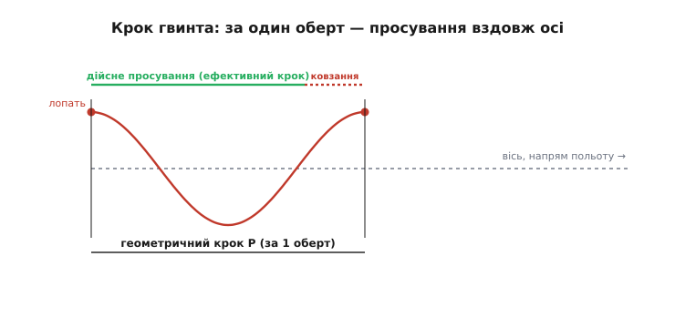
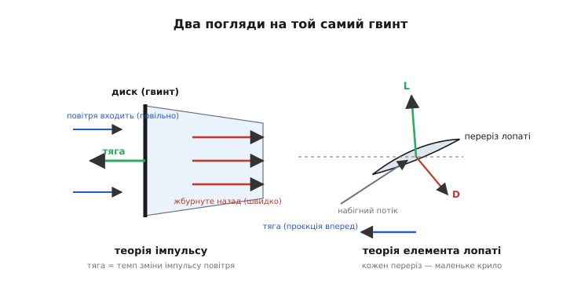
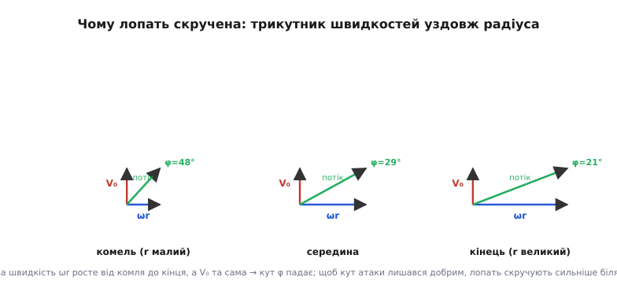

# Гвинт: як скручена лопать вкручується в повітря

Гвинт (від пол. *gwint* ← нім. *Gewinde* — «різьба») — це та сама ідея, що й шуруп, тільки середовище м'яке. Шуруп, обертаючись, вгвинчується в дерево: коса нарізка ловить деревину й тягне тіло вперед на крок різьби за кожен оберт. Лопать гвинта робить те саме з повітрям — обертається, коса поверхня ловить повітря, відкидає його назад, а сама тягне вал уперед. Ба більше, українське слово «гвинт» позначає і шуруп, і повітряний рушій літака чи дрона одним словом — і це не випадковий збіг, а вказівка на спільну геометрію: **гелікоїд**, косу поверхню, намотану на вісь.

Різниця в одному, і вона все визначає. Дерево тверде — шуруп проходить рівно на крок різьби. Повітря податливе — воно піддається, розганяється назад, і лопать проходить **менше** за геометричний крок. Оця недосяжена частина — і є вся фізика тяги: гвинт створює тягу рівно настільки, наскільки він **не** довкручує, наскільки повітря встигло податися назад. Розберімо це від самого шурупа.

### Крок: скільки гвинт «мав би» пройти за оберт

Уявімо одну точку лопаті на радіусі r від осі. За повний оберт вона обходить коло довжиною 2πr. Але лопать не пласка — вона поставлена під кутом до площини обертання, наче сходинка гвинтових сходів. Тому, обходячи коло, точка водночас повзе вздовж осі вперед. Скільки вона пройде вперед за один оберт, якби повітря було твердим, — це і є **геометричний крок** P (англ. *pitch* — «крок»).

Зв'язок кроку з кутом лопаті — чиста геометрія прямокутного трикутника. Розгорнімо один виток гелікоїда на площину: коли точка обходить коло 2πr «убік», вона піднімається на P «вперед». Кут β між лопаттю й площиною обертання (кут установки, *pitch angle*) задає їхнє відношення:

```
tan β = P / (2·π·r)
```

Ця формула — ключ до всієї геометрії гвинта, і з неї відразу випливає дещо неочевидне. Крок P — величина стала для всієї лопаті (гвинт вгвинчується як єдине ціле). А от радіус r у знаменнику росте від вала до кінця. Отже, щоб P лишався той самий, **кут β мусить зменшуватися до кінця лопаті**: біля вала лопать стоїть майже сторч (велике β), на кінці — майже плазом (мале β). Ось чому лопать гвинта **скручена** — не для краси, а щоб кожен її переріз задавав однаковий крок.


*Точка лопаті описує гелікоїд: обертаючись, вона повзе вперед. За один оберт «твердий» гвинт пройшов би геометричний крок P (унизу). Насправді повітря піддається, тож гвинт просувається менше — на ефективний крок (зелене), а різницю (пунктир) називають ковзанням.*

> 🔧 **Навіщо це.** Крок гвинта пишуть просто на маркуванні: пропелер дрона «5045» — це діаметр 5 і крок 4.5 дюйма. Дві цифри, і вони визначають характер тяги. Малий крок (наприклад, «6×3») — гвинт бере повітря дрібними «укусами»: легкий для мотора, швидко розкручується, дає велику статичну тягу на місці, але «упирається» на швидкості. Великий крок («6×5.5») тягне гвинт далі за оберт: гірший старт і важчий для мотора, зате вища крейсерська швидкість. Обираючи пропелер під раму й мотор, інженер насамперед вирішує саме цей компроміс кроку.

### Ковзання: чому справжнє просування менше за крок

Тверде дерево не дає шурупу вибору — той проходить рівно на крок. Повітря дає. Коли лопать натискає на повітря косою поверхнею, повітря не стоїть на місці, як деревина, а зсувається назад. Тому за реальний оберт гвинт просувається вперед на **ефективний крок** — менший за геометричний. Різницю називають **ковзанням** (англ. *slip*):

```
ковзання = геометричний крок − ефективний крок
```

І тут ховається головний парадокс гвинта, вартий того, щоб зупинитися. Ковзання — це «втрата»: гвинт не довкрутив, проїхав менше, ніж обіцяла геометрія. Але водночас **саме ковзання й створює тягу**. Адже тяга — це реакція на відкинуте назад повітря; якби повітря зовсім не піддавалося (нульове ковзання), гвинт не відкинув би ані грама повітря — і не мав би ані грама тяги, як шуруп у дереві не штовхає викрутку вперед. Тяга народжується рівно з того, що повітря піддалося.

Звідси видно межу: **не буває гвинта з нульовим ковзанням і ненульовою тягою одночасно**. Гарний гвинт не той, що не ковзає, а той, що дає потрібну тягу за мінімального ковзання, — бо надлишкове ковзання означає, що енергія пішла на розганяння повітря вбік і назад, а не на корисний рух. Це не дефект конкретної лопаті, а фундаментальна риса будь-якого рушія, що працює на відкиданні маси.

### Два погляди на той самий гвинт

Як же порахувати тягу? Фізика дає два різні погляди на одну лопать, і кожен по-своєму правдивий. Разом вони — основа всіх інженерних розрахунків гвинта.

**Погляд перший — гвинт як диск, що жбурляє повітря.** Забудьмо про лопаті. Уявімо просто тонкий диск, крізь який повітря входить повільно, а виходить швидко. За третім законом Ньютона: диск надав повітрю імпульсу назад — повітря штовхнуло диск уперед. Тяга дорівнює темпові, з яким гвинт додає повітрю імпульсу:

```
T = ṁ · Δv
```

де ṁ — маса повітря, що проходить крізь диск за секунду, а Δv — приріст її швидкості. Ця картина зветься **теорією імпульсу** (актуаторного диска) і дає дуже глибокий висновок про ефективність. Одну й ту саму тягу T можна отримати двома способами: узяти **багато** повітря й розігнати його **трохи** (велика ṁ, мала Δv), або взяти **мало** повітря й розігнати його **сильно** (мала ṁ, велика Δv). Тяга та сама — а от витрачена енергія ні. Енергія, «закачана» в повітря, росте як Δv², тож розганяти багато повітря потроху — ощадніше. Ось чому великий гвинт (велика ṁ) ефективніший за маленький верескливий пропелер (велика Δv) при тій самій тязі, і чому вертолітний ротор із його величезним диском такий економний у висінні. Той самий закон робить величезні тихохідні гвинти транспортних літаків ефективнішими за маленькі швидкі.

**Погляд другий — кожен переріз лопаті як маленьке крило.** Тепер повернімося до самих лопатей і розглянемо тонку смужку лопаті на радіусі r. Ця смужка обтікається повітрям, як крило літака, і — точнісінько як крило — дає **піднімальну силу** L (перпендикулярно потоку) і **опір** D (уздовж потоку). Тільки «підйом» тут спрямований не вгору, а **вперед**, уздовж осі: це і є внесок смужки в тягу. А опір D, помножений на радіус, дає гальмівний момент, який мусить долати мотор. Розклавши L і D на осі, дістаємо і тягу, і потрібний момент кожної смужки; просумувавши по всій лопаті — тягу й момент усього гвинта. Це **теорія елемента лопаті**.


*Ліворуч — теорія імпульсу: гвинт як диск, що бере повільне повітря й жбурляє його назад; реакція на відкинутий імпульс і є тягою. Праворуч — теорія елемента лопаті: кожен переріз обтікається як крило, дає піднімальну силу L (проєкція вперед — тяга) і опір D (створює гальмівний момент на валу).*

Ці два погляди не суперечать — вони доповнюють один одного, і саме їхнє поєднання дає робочий інструмент. Теорія імпульсу знає, скільки повітря треба відкинути, але нічого не каже про форму лопаті. Теорія елемента лопаті знає, що робить кожна смужка, але їй потрібна швидкість набігного потоку — а та залежить від того, наскільки повітря вже підтягнулося до диска, тобто від теорії імпульсу. Замкнувши ці дві теорії одна на одну, дістаємо метод, яким гвинти рахують і донині. Хто хоче побачити, як точно вони зшиваються в робочі рівняння тяги й моменту вздовж радіуса, — [метод елемента лопаті виводить це крок за кроком](root:ph-mechanics/propeller-geometry/math-blade-element.md).

### Чому лопать мусить бути скручена — тепер уже фізично

Формула tan β = P/(2πr) уже сказала: кут установки мусить падати від вала до кінця. Але за геометрією стоїть жива фізика, і побачити її варто через **швидкість, з якою повітря набігає на переріз**.

Кожен переріз лопаті рухається складно: він обертається (колова швидкість ωr убік) і летить уперед разом із апаратом (швидкість V₀). Повітря набігає на переріз по діагоналі цих двох рухів. І тут головне: колова швидкість ωr **росте разом з радіусом** — кінець лопаті мете повітря набагато швидше за комель, — а от швидкість польоту V₀ для всіх перерізів **однакова**. Отже, напрям набігного потоку не той самий уздовж лопаті. Біля вала колова швидкість мала, домінує V₀, потік набігає під великим кутом до площини обертання. На кінці колова швидкість величезна, вона переважає, потік майже лягає в площину обертання — кут малий.


*Трикутник швидкостей у трьох перерізах. Колова швидкість ωr (синя) росте від комля до кінця; швидкість польоту V₀ (червона) всюди однакова. Тому кут набігного потоку φ (зелений) падає від комля до кінця — і лопать мусить бути скручена так, щоб кожен переріз зустрічав свій потік під добрим кутом атаки.*

А крилу — щоб добре працювати, а не зірватися в застій, — потрібен **правильний кут атаки** до набігного потоку (невеликий, зазвичай кілька градусів). Якщо потік уздовж лопаті набігає під різними кутами, то й лопать треба поставити під різними кутами: круто біля вала, положе на кінці. Це і є скрут (*twist*). Не скручена лопать працювала б добре лише на одному радіусі, а на решті або зривалася б у застій, або різала повітря плазом без користі. Скрут узгоджує кожен переріз із його власним набігним потоком — тому гвинт і скручений так характерно.

> 🔧 **Навіщо це.** Скрут пояснює, чому не можна взяти пропелер від однієї моделі й безкарно поставити на іншу з іншими обертами чи швидкістю. Скрут лопаті «заточений» під певне співвідношення обертів і швидкості польоту (його задають безрозмірним **коефіцієнтом ходу** J = V₀/(n·D), де n — оберти за секунду, D — діаметр). Женеш гвинт швидше або летиш повільніше, ніж передбачав скрут, — кути атаки перерізів «пливуть», гвинт втрачає ККД, а то й зривається у застій із гулом і тряскою. Тому дрон-гонщик і вантажний октокоптер мають геть різні пропелери навіть за однакового діаметра.

### Скільки ж тяги: рахунок на пальцях

Найпростіший корисний рахунок дає теорія імпульсу для випадку **висіння на місці** (V₀ = 0) — саме так працює гвинт квадрокоптера в польоті на місці. Тут удається виразити тягу через потужність мотора й площу диска, і вже це показує, від чого залежить піднімальна сила апарата.

Для висіння теорія імпульсу дає швидкість, з якою повітря протягується крізь диск, — так звану **індуковану швидкість**:

```
v = √( T / (2·ρ·A) )
```

де T — тяга (Н), ρ — густина повітря (≈ 1.2 кг/м³), A = π·R² — площа, заметена гвинтом (м²). Потужність, яку гвинт вкладає в повітря, дорівнює T·v; підставивши сюди v, дістаємо ідеальну потужність висіння й обертаємо її, щоб знайти тягу за заданої потужності:

```
P_ideal = T · v = T · √( T / (2·ρ·A) )
звідси:  T = ( 2 · ρ · A · P² )^(1/3)
```

Ця формула — золоте правило прикидки для мультикоптерів. З неї відразу видно два важелі: тяга росте з **потужністю** мотора й з **площею** диска (тобто з квадратом діаметра). Подвоїш діаметр — учетверо більше площі, і за тієї самої потужності тяга помітно зросте. Ось математичне підтвердження, чому великий повільний гвинт кращий за маленький швидкий.

**Приклад (тяга гвинта дрона на висінні).** Пропелер діаметром D = 0.25 м (R = 0.125 м), мотор віддає в повітря P = 180 Вт корисної потужності, повітря ρ = 1.2 кг/м³. Яку тягу дасть один гвинт?

:::tabs
```cpp
#include <cmath>

// Ідеальна статична тяга гвинта за теорією імпульсу (висіння, V0 = 0).
// P_shaft — механічна потужність на валу (Вт), R — радіус гвинта (м).
float hover_thrust(float P_shaft, float R, float rho) {
    float A = 3.14159265f * R * R;          // заметена площа, м^2
    // T = (2 * rho * A * P^2)^(1/3)
    return std::cbrt(2.0f * rho * A * P_shaft * P_shaft);
}

int main() {
    float T = hover_thrust(180.0f, 0.125f, 1.2f);
    // A = π·0.125² = 0.0491 м²
    // T = (2 · 1.2 · 0.0491 · 180²)^(1/3)
    //   = (2 · 1.2 · 0.0491 · 32400)^(1/3)
    //   = (3817)^(1/3) ≈ 15.6 Н
    return 0;
}
```
```python
import math


# Ідеальна статична тяга гвинта за теорією імпульсу (висіння, V0 = 0).
# P_shaft — механічна потужність на валу (Вт), R — радіус гвинта (м).
def hover_thrust(p_shaft, r, rho):
    a = math.pi * r * r                     # заметена площа, м^2
    # T = (2 * rho * A * P^2)^(1/3)
    return (2.0 * rho * a * p_shaft * p_shaft) ** (1 / 3)


T = hover_thrust(180.0, 0.125, 1.2)
# A = π·0.125² = 0.0491 м²
# T = (2 · 1.2 · 0.0491 · 180²)^(1/3)
#   = (2 · 1.2 · 0.0491 · 32400)^(1/3)
#   = (3817)^(1/3) ≈ 15.6 Н
```
:::

Результат — близько 15.6 Н, тобто гвинт піднімає приблизно 1.6 кг. Для квадрокоптера це вчетверо — близько 6.3 кг гранично на висінні, отже апарат вагою 2–3 кг матиме здоровий запас тяги для маневру. Це ідеальна (завищена) оцінка: реальний гвинт через опір лопатей і закрутку струменя дає десь 60–75 % цього — його досконалість описують **коефіцієнтом якості** (figure of merit ≈ 0.7). Але навіть груба прикидка миттєво відповідає на головне питання компонування: чи підніме цей мотор із цим гвинтом цей апарат.

**Приклад (кут установки лопаті на 75 % радіуса).** Гвинт має геометричний крок P = 0.114 м (пропелер «5045»: 4.5 дюйма) і радіус R = 0.064 м (5 дюймів у діаметрі). Під яким кутом стоїть лопать на характерному перерізі 0.75·R, за яким заведено називати «кут лопаті»?

:::tabs
```cpp
#include <cmath>

// Кут установки перерізу лопаті на радіусі r за геометричним кроком P.
// tan(beta) = P / (2·π·r)  →  beta = atan( P / (2·π·r) )
float blade_angle_deg(float pitch_m, float r_m) {
    float beta = std::atan(pitch_m / (2.0f * 3.14159265f * r_m));
    return beta * 180.0f / 3.14159265f;
}

int main() {
    float r75 = 0.75f * 0.064f;                 // 0.048 м — переріз 75 % радіуса
    float beta = blade_angle_deg(0.114f, r75);
    // tan β = 0.114 / (2·π·0.048) = 0.114 / 0.3016 = 0.378
    // β = atan(0.378) ≈ 20.7°
    return 0;
}
```
```python
import math


# Кут установки перерізу лопаті на радіусі r за геометричним кроком P.
# tan(beta) = P / (2·π·r)  →  beta = atan( P / (2·π·r) )
def blade_angle_deg(pitch_m, r_m):
    beta = math.atan(pitch_m / (2.0 * math.pi * r_m))
    return math.degrees(beta)


r75 = 0.75 * 0.064                              # 0.048 м — переріз 75 % радіуса
beta = blade_angle_deg(0.114, r75)
# tan β = 0.114 / (2·π·0.048) = 0.114 / 0.3016 = 0.378
# β = atan(0.378) ≈ 20.7°
```
:::

Виходить близько 20.7° на перерізі 75 % радіуса. Порахуймо подумки для порівняння комель і кінець: на 25 % радіуса (r = 0.016 м) той самий крок дає tan β = 0.114/0.1005 ≈ 1.13, тобто β ≈ 48°; на самому кінці (r = 0.064 м) — tan β = 0.114/0.402 ≈ 0.284, β ≈ 16°. Від 48° біля вала до 16° на кінці — ось той самий скрут у числах, що ми бачили в геометрії: кут падає до кінця саме так, щоб крок P лишався сталим.

### Історія: від корабельного гребного до крила, що обертається

Ідея гвинта старша за авіацію: спершу він штовхав кораблі, і лише потім піднявся в повітря. Дорога від «водяного шурупа» до сучасного скрученого крила — це історія, у якій зійшлися шотландський інженер, англійська корабельна наука, польський конструктор підводних човнів і двоє американських велосипедних майстрів. [Хто і як перетворив шуруп на теорію повітряного гвинта](root:ph-mechanics/propeller-geometry/hist-propeller.md) — окрема гарна історія; тут лиш зазначимо, що першими **поєднали** обидва погляди на гвинт — диск, що жбурляє повітря, і лопать як крило — брати Райт, коли рахували пропелери для свого літака 1903 року, і саме тому їхні гвинти виявилися напрочуд ефективними.

---

Отже, гвинт — це коса поверхня, намотана на вісь, що вкручується в повітря, як шуруп у дерево, але з однією визначальною поправкою: повітря піддається. Геометричний крок каже, скільки гвинт «мав би» пройти за оберт; ковзання — наскільки повітря податилося; і саме це ковзання, ця «недокрутка», народжує тягу як реакцію на відкинуте назад повітря. Лопать скручена тому, що вздовж неї змінюється швидкість набігного потоку, і кожен переріз треба поставити під свій кут. А порахувати гвинт можна двома взаємодоповнювальними мовами — жбурляння повітря диском і роботи кожної смужки як крила, — які інженери зшивають в один метод. Розуміючи ці кілька ідей, дивишся на будь-який пропелер — від дрона до транспортника — і бачиш не просто закручені лопаті, а точно розрахований компроміс кроку, площі й скруту.
