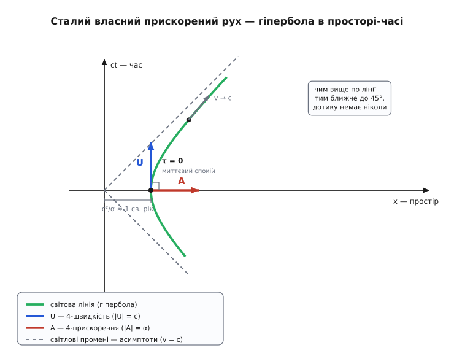
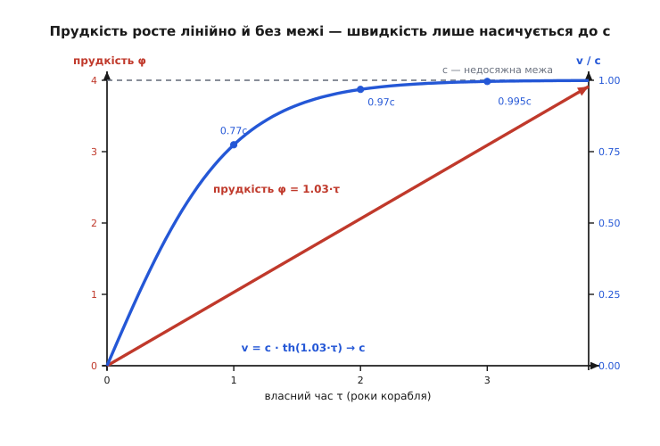

# 🧮 Чотиривектор прискорення: власне прискорення в просторі-часі

На звичних швидкостях уся історія власного прискорення вичерпується одним реченням: це те, що відчуває тіло, — координатне прискорення мінус гравітація, показ акселерометра. Але саме слово «власне» прийшло не з механіки візків і ліфтів, а з теорії відносності, і там воно означає щось точніше й глибше. При швидкостях, близьких до світлової, власне й координатне прискорення розходяться вже **без жодної гравітації** — просто тому, що час і простір самого тіла не збігаються з часом і простором стороннього спостерігача. Щоб побачити, як саме вони розходяться, треба перекласти невиразне «прискорення, яке відчуваєш» точною мовою чотиривимірного простору-часу.

Нам знадобиться лише кілька готових інструментів теорії відносності, і кожен варто мати перед очима. **Лоренців множник** γ = 1/√(1 − v²/c²) — на скільки розтягується час і стискається простір рухомого тіла; при v → c він росте до нескінченності, при v = 0 дорівнює 1. **Власний час** τ — час на годиннику, що летить разом із тілом; він пов'язаний із часом t зовнішнього спостерігача через dt/dτ = γ (рухомий годинник цокає повільніше рівно в γ разів). І **простір-час**: подію задають чотири числа (ct, x, y, z), а величини, що перетворюються між системами відліку так само, як ці координати, звуть чотиривекторами. Уся хитрість, яку ми зараз розгорнемо, — правильно продиференціювати рух у цьому чотиривимірному світі.

### Миттєво супутня система — зроблена точною

Побутове означення власного прискорення спиралось на систему, «що в цю мить рухається разом із тілом». Зробімо цю фразу точною, бо в ній захована вся конструкція.

Тіло прискорюється, тож його швидкість v(t) весь час міняється — само тіло **не** утворює інерціальної системи, і застосувати до нього прості формули відносності напряму не можна. Хитрість у тому, щоб на кожну мить підставляти замість тіла **інерціальну** систему-дублера. Візьмімо момент t. Тіло має в цю мить швидкість v(t). Розгляньмо інерціальну систему S′, яка рухається зі **сталою** швидкістю, що дорівнює v(t), — вона нікуди не прискорюється, просто летить рівномірно й у цю саму мить має ту саму швидкість, що й тіло. Тоді в цю мить тіло в системі S′ **миттєво спочиває**: їхні швидкості збіглися. Оцю S′ і звуть **миттєво супутньою інерціальною системою** (англ. *momentarily comoving inertial frame*, MCIF; або *rest frame*, MCRF).

Ключове слово — «миттєво». За мить швидкість тіла стане v(t) + dv, а супутня система, бувши інерціальною, летітиме далі зі старою v(t) — і тіло в ній уже рухатиметься. Тобто для кожної миті **своя** окрема супутня система, і тіло весь час «перестрибує» з однієї на наступну, трохи швидшу. MCRF — це не одна система на весь політ, а нескінченна їх низка, дотичних до руху тіла по черзі.

Навіщо ця морока? Бо в MCRF, де тіло в цю мить спочиває, його прискорення — це **чисте, відчутне** прискорення, те саме, що зафіксує акселерометр. Ми міряємо «штовхання» саме там, де тіло на мить нерухоме, а отже, де немає плутанини від його власного руху. **Власне прискорення** α — це прискорення тіла, поміряне в його миттєво супутній інерціальній системі, у ту мить, коли вони супутні.

> 🔧 **Навіщо це.** Так насправді й рахують усе про прискорений корабель у відносності. Одну інерціальну систему на весь політ узяти не можна — корабель не інерціальний. Натомість на кожну мить стрибають у MCRF, де корабель спочиває, там знімають просту фізику (акселерометр показує α, годинник цокає власним часом), а тоді стежать, як сама MCRF розганяється відносно Землі. Уся релятивістська механіка прискореного руху — це бухгалтерія цих передач між супутніми системами.

### Чотиришвидкість: рух крізь простір-час

Звичайна швидкість v = dx/dt — не чотиривектор, і в цьому корінь усіх труднощів. Ми ділимо переміщення dx на проміжок часу dt, але dt — величина **відносна**, у різних системах різна. Похідна за чужим, залежним від системи часом сама виходить залежною від системи й перетворюється негарно.

Ліки прості й глибокі: диференціюймо не за чиїмось t, а за **власним** часом τ — за годинником самого тіла, показ якого всі системи погоджують. Візьмімо чотиривектор події X = (ct, x, y, z) і продиференціюймо його за τ. Оскільки dt/dτ = γ, вигляд виходить такий:

```
X   = (ct, x, y, z)                подія в просторі-часі
U   = dX/dτ = (dX/dt)·(dt/dτ)
    = γ·(c, v⃗)                     чотиришвидкість (4-швидкість)
```

Чотиришвидкість U = γ(c, v⃗). А тепер порахуймо її «довжину» в сенсі простору-часу. У Мінковського скалярний добуток рахують не як у школі: у чотиривекторів P = (P⁰, P⃗) і Q = (Q⁰, Q⃗) добуток є P·Q = P⁰Q⁰ − P⃗·Q⃗ — часову частину додаємо, просторову **віднімаємо**. Тоді квадрат чотиришвидкості:

```
U·U = (γc)² − (γv)²
    = γ²·(c² − v²)
    = γ²·c²·(1 − v²/c²)
    = γ²·c² · (1/γ²)          бо γ² = 1/(1 − v²/c²)
    = c²
```

U·U = c² — **завжди**, для будь-якого руху. Чотиришвидкість має незмінну довжину c. Це не збіг, а найглибший факт кінематики простору-часу: кожне тіло рухається крізь простір-час зі сталою «швидкістю» c, і весь рух — це лише **перехил** цього вектора незмінної довжини між часовою й просторовими осями. Тіло у спокої має U = (c, 0⃗): усі c спрямовані «в час» — воно мчить у майбутнє з максимальним темпом. Коли тіло розганяється, частина цього вектора перехиляється в простір, і рівно настільки менше лишається на рух у часі — ось звідки сповільнення часу. Бюджет c один на все; тому й не можна перегнати світло — просторова частина не може перевищити всю довжину вектора.

### Чотириприскорення й власне прискорення як інваріант

Тепер продиференціюймо чотиришвидкість за власним часом ще раз — дістанемо **чотириприскорення** (4-прискорення):

```
A = dU/dτ
```

Це знову чотиривектор — похідна чотиривектора за інваріантним τ. У ньому й сидить власне прискорення, але дістати його треба акуратно.

Спершу — одне тотожне спостереження, з якого все випливе. Ми знаємо, що U·U = c² **стала**. Продиференціюймо цю сталу за τ. Похідна сталої — нуль, а похідна добутку дає:

```
d(U·U)/dτ = 2·(U·A) = 0     ⟹     U·A = 0
```

Чотириприскорення **завжди ортогональне** (в сенсі Мінковського) до чотиришвидкості. А оскільки U «часоподібне» (U·U = c² > 0 — вектор дивиться переважно в часову вісь), ортогональний до нього A мусить бути «простороподібним»: A·A ≤ 0. Це формальний бік того, що прискорення відхиляє світову лінію **вбік** від чистого руху в часі.

Тепер саме означення. **Власне прискорення** α — це інваріантна довжина чотириприскорення:

```
α² = −A·A          (мінус — бо A простороподібне, A·A ≤ 0)
```

Чому це число і є показом акселерометра? Перевірмо в MCRF — саме там означення й народжується. У миттєво супутній системі тіло в цю мить спочиває: v = 0, γ = 1, U = (c, 0⃗). Умова ортогональності U·A = 0 дає c·A⁰ − 0 = 0, тобто A⁰ = 0 — часова частина 4-прискорення в цій системі зникає. Лишається сама просторова:

```
у MCRF:   U = (c, 0⃗),   A = (0, a⃗)
```

де a⃗ — звичайне прискорення dv⃗/dt, поміряне в цій супутній системі, тобто рівно те «штовхання», яке чує прилад. Тоді A·A = 0² − |a⃗|² = −|a⃗|², і

```
α = √(−A·A) = |a⃗|     — показ акселерометра
```

Ось де замикається все. Ми означили α через A·A — а це **скаляр Мінковського**, однаковий у кожній системі відліку. Порахуй його хоч у системі Землі, хоч у системі далекої галактики — вийде те саме число. Тому власне прискорення **абсолютне**: усі спостерігачі, хоч як сперечалися б про швидкість тіла, погодяться, з якою силою його вдавлює в крісло. Побутова інтуїція це лише стверджувала — тут воно **доведене**: абсолютність власного прискорення є прямий наслідок того, що воно є інваріантна довжина чотиривектора.

### Прямолінійний рух: чому α = γ³·a

Візьмімо найпростіший і найважливіший випадок — розгін по прямій, уздовж осі x, без гравітації. Тут можна довести до кінця й побачити точний зв'язок між тим, що **відчуває** корабель (власне α), і тим, що **бачить** Земля (координатне a = dv/dt).

Чотиришвидкість одновимірного руху U = (γc, γv). Щоб знайти A = dU/dτ, згадаймо dt/dτ = γ, тож A = γ·dU/dt. Уся робота — продиференціювати γ і γv за t. Похідна Лоренцевого множника (ланцюгове правило, a = dv/dt):

```
dγ/dt = γ³·(v/c²)·a
```

Звідси обидві компоненти:

```
dU⁰/dt = c·dγ/dt          = γ³·v·a / c
dU¹/dt = d(γv)/dt = a·γ + v·dγ/dt
       = a·γ + v·γ³·v·a/c²
       = a·γ·(1 + γ²·v²/c²)
       = a·γ·γ²  = γ³·a          бо 1 + γ²v²/c² = γ²
```

Домножуємо на γ (бо A = γ·dU/dt):

```
A = ( γ⁴·v·a/c ,  γ⁴·a )
```

І нарешті інваріантна довжина:

```
A·A = (A⁰)² − (A¹)²
    = γ⁸a²·(v²/c²) − γ⁸a²
    = γ⁸a²·(v²/c² − 1)
    = −γ⁸a² · (1/γ²)            бо 1 − v²/c² = 1/γ²
    = −γ⁶·a²

α = √(−A·A) = γ³·a
```

Ось він — точний зв'язок для прямолінійного руху:

```
α = γ³ · a          (розгін уздовж швидкості)
```

Відчутне власне прискорення α у **γ³ разів** більше за координатне a, яке міряє Земля. При v = 0 (γ = 1) вони збігаються — на старті «відчуте» дорівнює «побаченому». Але γ³ росте без меж, коли v → c, і тут ховається вся драма зорельоту. Тримати сталий **відчутний** 1g означає α = const; тоді координатне прискорення

```
a = α / γ³
```

**згасає** до нуля в міру наближення до світлової швидкості. Двигун штовхає так само рівно, екіпаж незмінно чує 1g, — а Земля бачить, що корабель додає до швидкості дедалі менше й менше. Саме через це він **підповзає** до c, ніколи її не сягаючи: щоб додати останні краплі швидкості, з погляду Землі, треба нескінченне власне прискорення, а його ресурс скінченний.

**Числа роблять це відчутним.** Хай корабель тримає рівний 1g (α = 9.8 м/с²). Порахуймо, яке координатне прискорення a = α/γ³ бачить Земля на різних швидкостях:

```
v = 0        →  γ = 1.00   →  γ³ = 1.00     →  a = 9.80 м/с²
v = 0.6 c    →  γ = 1.25   →  γ³ = 1.95     →  a = 5.02 м/с²
v = 0.9 c    →  γ = 2.29   →  γ³ = 12.1     →  a = 0.81 м/с²
v = 0.99 c   →  γ = 7.09   →  γ³ = 356      →  a = 0.0275 м/с²
v = 0.999 c  →  γ = 22.4   →  γ³ = 11190    →  a = 0.000876 м/с²
```

На швидкості 0.999c екіпаж досі відчуває повний 1g — крісло тисне, як удома, — а Земля бачить, що корабель набирає менш ніж міліметр за секунду щосекунди. Відчуте й побачене розійшлися в десять тисяч разів, і жодної гравітації для цього не знадобилось.

Одне застереження про геометрію. Множник саме **γ³** стосується прискорення **вздовж** швидкості (поздовжнього — розгін чи гальмування по прямій). Якщо ж прискорення **перпендикулярне** до швидкості (наприклад, тіло заходить у поворот на сталій швидкості), зв'язок інший: α = γ²·a. Різниця між γ³ і γ² — це релятивістський слід того, що «важче» підганяти швидкість уздовж руху, ніж повертати її вбік; для прямолінійного зорельоту працює γ³.

### Сталий власний час: гіпербола й прудкість

А тепер найкрасивіше. Хай α = const — двигун тримає незмінний відчутний 1g. Як виглядає така світова лінія в просторі-часі? Щоб побачити це без бою з формулами, введімо величину, заради якої відносність узагалі стає прозорою, — **прудкість** (англ. *rapidity*).

Прудкість φ означують так, щоб вона грала роль «кута» в просторі-часі. Замість швидкості v беруть φ через гіперболічний тангенс:

```
v = c · th φ
```

де th — гіперболічний тангенс (гіперболічні косинус, синус і тангенс — це ch, sh, th; для тих, кому звичніші англійські позначення, ch = cosh, sh = sinh, th = tanh). З основної тотожності ch²φ − sh²φ = 1 одразу випливає, що всі релятивістські множники стають простими гіперболічними функціями прудкості:

```
v/c = th φ           γ = ch φ           γ·v/c = sh φ
```

Підставмо це в чотиришвидкість:

```
U = γ·(c, v) = c·(ch φ, sh φ)
```

Чотиришвидкість — це вектор сталої довжини c, **повернутий** від часової осі на «гіперболічний кут» φ. Тут і криється друга душа теорії відносності: Лоренцове перетворення (перехід між системами відліку) — це поворот у просторі-часі, тільки не звичайний, на кут θ через (cos θ, sin θ), а **гіперболічний**, на прудкість φ через (ch φ, sh φ). Швидкості не додаються просто (інакше дві по 0.8c дали б 1.6c) — а **прудкості додаються** як звичайні кути: розігнатися вдруге означає докрутити ще один гіперболічний кут. Прудкість — це справжня, адитивна міра «наскільки ти розігнався»; швидкість — лише її обмежена тінь.

Тепер знайдімо чотириприскорення через прудкість. Диференціюємо U = c(ch φ, sh φ) за τ:

```
A = dU/dτ = c·(sh φ, ch φ)·(dφ/dτ)
A·A = c²·(dφ/dτ)²·(sh²φ − ch²φ) = −c²·(dφ/dτ)²
α = √(−A·A) = c · dφ/dτ
```

Дивовижно просте: **власне прискорення дорівнює c, помноженому на швидкість накопичення прудкості**. А отже, сталий α означає сталу dφ/dτ, тобто

```
сталий α   ⟺   φ = (α/c)·τ
```

Прудкість росте **лінійно** з власним часом. Тримаєш рівний 1g — і твій гіперболічний кут накручується рівномірно, секунда за секундою, без стелі. Швидкість же — його насичувана тінь:

```
v = c · th(α·τ/c)   →   c   (але ніколи не досягає, бо th < 1)
```

Лишилось знайти саму траєкторію в просторі-часі. Інтегруємо dt/dτ = γ = ch(ατ/c) і dx/dτ = γv = c·sh(ατ/c):

```
прудкість φ:   v = c·th φ,   γ = ch φ,   γv/c = sh φ
сталий α   ⟺   φ = (α/c)·τ           прудкість росте лінійно з τ
t = (c/α)·sh(α·τ/c)                   час Землі
x = (c²/α)·ch(α·τ/c)                  координата (беремо x = c²/α при τ = 0)
```

І тепер вирахуймо комбінацію x² − (ct)². Оскільки ch² − sh² = 1:

```
x² − (ct)² = (c²/α)²·(ch² − sh²) = (c²/α)²
```

Це рівняння **гіперболи** в площині (x, ct). Ось чому рух зі сталим власним прискоренням звуть **гіперболічним рухом**. Асимптоти цієї гіперболи — прямі x = ±ct, тобто **світлові промені**. Корабель приходить здалеку зверху-праворуч (гальмуючи), торкається вершини x = c²/α у мить τ = 0 (де він миттєво спочиває), і знову вигинається геть — вічно наближаючись до світлової прямої під 45°, та ніколи її не перетинаючи, бо v < c завжди.


*Рух зі сталим власним прискоренням креслить у просторі-часі гіперболу x² − (ct)² = (c²/α)². Її асимптоти — світлові промені (штрихові), тож світова лінія завжди крутіша за 45° і лишається всередині світлового конуса: швидкість менша за c у кожній точці. У вершині (τ = 0) тіло миттєво спочиває, і там 4-швидкість U (уздовж часу, довжина c) точно перпендикулярна до 4-прискорення A (уздовж простору, довжина α) — це і є миттєво супутня система. Що вище по лінії, то ближче рух до світлового променя, але дотику немає ніколи.*

У цій картині ховається ще один разючий факт. Точка перетину асимптот («вершина» гіперболи як кривої) стоїть на відстані c²/α **позаду** корабля. Для 1g це c²/α = c·(c/α) ≈ 0.97 світлового року, тобто майже рівно один світловий рік. Світло, послане навздогін із точки, що далі за цей світловий рік позаду, **ніколи не наздожене** корабель, який вічно тримає 1g, — за спиною в нього виникає справжній **горизонт**, породжений самим лише прискоренням. Це не випадковість: сталий власний прискорений рух локально не відрізнити від стояння в однорідному гравітаційному полі, а такий горизонт — прискорений родич горизонту чорної діри.

> Сталий 1g на кораблі відчувається точнісінько як 1g на поверхні планети — прискорення й гравітацію локально не розрізнити. Ця нерозрізненність — зміст [принципу еквівалентності](topic:ph-mechanics/equivalence-principle): вільне падіння невідчутне, а вагу дає опора, що стримує падіння; звідси гравітація постає як геометрія простору-часу.

### Ракета на 1g: політ до Проксіми

Зберімо все в конкретний політ — це найкраща перевірка апарату. Зручні одиниці: беремо c = 1 світловий рік за рік (світло долає світловий рік за рік — за означенням). Тоді 1g виходить майже магічно круглим:

```
g = 9.8 м/с² = 1.03 світлового року / рік²
c/α  = 0.97 року           («час розгону» до релятивістських швидкостей)
c²/α = 0.97 світлового року  (≈ 1 св. рік — плече горизонту)
```

Тобто прудкість зростає приблизно на 1.03 за кожен рік власного часу корабля. За рік польоту на 1g гіперболічний кут φ доходить до ≈ 1.03, а це вже v = c·th(1.03) ≈ 0.77c; за два роки φ ≈ 2.06 і v ≈ 0.97c. Прудкість накопичується як проста лінійка, а швидкість тим часом тисне до світлової межі.

Політ будуємо так, щоб **прибути з зупинкою**: першу половину відстані розганяємось на 1g, потім розвертаємо корабель дюзами вперед і другу половину так само гальмуємо. За симетрією гіперболи обидві половини забирають рівний власний час. Відстань до Проксіми Центавра — найближчої до Сонця зорі — за виміром Gaia становить 4.24 світлового року.

**Задача.** d = 4.24 св. року, α = 1g. Знайти власний час екіпажу на переліт із зупинкою.

```
половина шляху:  d/2 = 2.12 св. року
розгін від спокою на цю половину, з  x − x₀ = (c²/α)·(ch(α·τ/c) − 1):

   ch(α·τ½ /c) = 1 + (α/c²)·(d/2)
               = 1 + 2.12 / 0.97
               = 3.19

   α·τ½ /c = arch(3.19) = 1.83        (arch — обернена до ch;
                                        а 1.83 — це і є прудкість у середині шляху!)
   τ½ = 0.97 · 1.83 = 1.77 року

на середині:  φ = 1.83  →  v = c·th(1.83) = 0.95c,   γ = ch(1.83) = 3.2

розгін + гальмування (прибути в спокої біля зорі):
   τ_туди = 2 · τ½ ≈ 3.5 року власного часу

а час на Землі:
   t_туди = 2 · (c/α)·sh(1.83) = 2 · 0.97 · 3.03 ≈ 5.9 року
```

Отже, долетіти до Проксіми й зупинитись — близько **3.5 року** за годинником екіпажу, тоді як на Землі мине близько 5.9 року (і це, як і має бути, більше за 4.24 — навіть корабель на 1g не перегонить світло). А **зробити весь рейс туди-й-назад**, зупинившись біля зорі й повернувшись додому, — це чотири однакові плечі розгону-гальмування:

```
туди-й-назад:   τ_повна ≈ 2 · 3.5 ≈ 7 років власного часу
                а на Землі мине  ≈ 2 · 5.9 ≈ 12 років
```

Близько **7 років** життя екіпажу на подорож до найближчої зорі й назад, за яку Земля постаріє років на дванадцять. Уся ця кінематика — прямий наслідок того, що рівний 1g щороку докладає ≈ 1.03 до прудкості: те число 1.83 у розрахунку, що задає швидкість на середині, є просто накопичена прудкість, а власне прискорення — це рівномірний внесок прудкості, 1.03 за рік корабля.


*Корабель тримає сталий 1g. Прудкість φ (пряма) додається рівномірно — ≈ 1.03 за кожен рік власного часу, без стелі. Швидкість v/c (крива) — її гіперболічна тінь: круто росте спочатку, тоді тисне до c і зупиняється під самою межею, ніколи її не сягаючи (0.77c за рік, 0.97c за два, 0.995c за три). Саме тому прудкість, а не швидкість, є природною, адитивною мірою розгону: вона й накопичується лінійно від сталого власного прискорення.*

Прудкість пояснює й останнє диво. Прудкість росте лінійно, зате відстань, яку корабель устигає покрити, росте як ch(ατ/c) — тобто **експоненційно** з власним часом. Тому на 1g галактичний центр за 30 000 світлових років — це лише близько 20 років корабельного часу, а Туманність Андромеди за 2.5 мільйона світлових років — близько 28 років. Людське життя вистачає перетнути видимий Всесвіт — от тільки Земля за цей час постаріє на мільйони років, бо саме стільки триває політ у **її** часі. Межа міжзоряних відстаней — не швидкість світла, яку не перегнати, а запас пального, що годує сталий α; і весь цей висновок виростає з одного скромного числа — інваріантної довжини чотириприскорення.

### Хто ввів прудкість

Гіперболічний кут у відносності з'явився не одразу під теперішньою назвою. Ідею, що Лоренцове перетворення — це поворот на **уявний кут** у просторі-часі, увів 1908 року німецький математик Герман Мінковський (Hermann Minkowski) — той самий, хто дав відносності геометричну мову простору-часу й був колись учителем Айнштайна. Розгорнуту побудову відносності на **гіперболічній геометрії** — з величиною, що поводиться як кут, — від 1910 року розробляв хорватський математик Владімір Варічак (Vladimir Varićak). А саму назву «прудкість» (*rapidity*) для цього кута дав 1911 року фізик Альфред Робб (Alfred Robb) із Белфаста, і термін прижився. Це усталений, документований епізод історії науки — колективний, як і більшість у фізиці: ідея, геометрична розбудова й вдала назва прийшли від різних людей.

Так замикається дорога від акселерометра до простору-часу. Прилад у кишені міряє α — інваріантну довжину чотириприскорення. На малих швидкостях α ≈ a, і вся історія стискається до «координатне мінус гравітація». Але те саме α лишається сталим у зорельоті, рівномірно накопичує прудкість і креслить гіперболу, що тулиться до світлового конуса. Власне прискорення — то місток між відчутним світом мандрівника й геометрією часу та простору.
