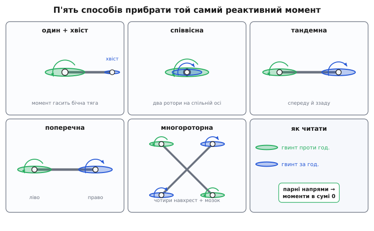

# 📜 Хвостовий гвинт: як гелікоптер перестав крутитися сам

Уявіть інженера 1930-х років, який твердо знає фізику й тому знає свою біду наперед. Він хоче підняти машину вертикально вгору силою одного великого гвинта над головою. Гвинт розкрутиться — і за третім законом Ньютона для обертання та сама пара сил, що крутить гвинт в один бік, поверне фюзеляж у протилежний. Двигун сильний, ротор важкий, момент величезний. Отже, щойно машина відірветься від землі й утратить зчеплення коліс із ґрунтом, вона почне безпорадно обертатися під власним ротором — як велосипедне коліщатко, розкручене на осі в долонях. Пасажира закрутить дзиґою.

Ця біда має назву — **реактивний момент несного ротора**, — і саме вона, а не підйомна сила, півстоліття не давала гелікоптеру злетіти по-справжньому. Підняти щось у повітря лопатями вміли й раніше. Проблема була в тому, **куди подіти обертання, яким ротор віддячує корпусу**. Історія гелікоптера — це насамперед історія боротьби з реактивним моментом, і в ній не було одного «еврика». Було десятиліття проб: кілька зовсім різних способів скасувати цей момент, і всі вони працювали. Просто один із них виявився найпростішим у виробництві й найзручнішим у керуванні — і саме він став класикою, яку ми бачимо в небі досі.

## Задача, яку не можна обійти

Спершу варто відчути, чому реактивний момент — не дрібна незручність, а стіна.

Несний ротор гелікоптера — це кілька тонн тяги, зібраних на одному валу. Щоб крутити його з потрібною швидкістю, двигун долає опір повітря на лопатях; і рівно цей момент повітря повертає назад — через вал у корпус. Груба оцінка одразу лякає. Хай двигун віддає ротору потужність P на кутовій швидкості ω. Момент на валу тоді

```
M = P / ω
```

Візьмімо ранній практичний гелікоптер: потужність порядку 150 кВт (≈ 200 к.с.), ротор крутиться повільно — скажімо, 250 обертів за хвилину, тобто

```
ω = 250 · 2π / 60 ≈ 26 рад/с
M = 150 000 / 26 ≈ 5 800 Н·м
```

Майже шість тисяч ньютон-метрів, які безперервно намагаються провернути весь корпус. Це момент, з яким доросла людина не впорається й важелем; він розверне машину за секунди. І — головне — його **не можна зменшити, не зменшивши тягу**: сама природа несного гвинта в тому, що він відкидає повітря вниз, спираючись на опір, а опір і породжує момент. Зменшите момент — зменшите тягу — машина не злетить.

> 🔧 **Навіщо це.** Ось чому в гелікоптера завжди щось «зайве» стирчить: довга хвостова балка, другий ротор, спарені вали. Це не окраса й не примха конструктора — це фізична плата за один несний гвинт. Пілот на землі бачить готову машину; інженер бачив насамперед оці шість тисяч ньютон-метрів, які треба кудись подіти, інакше все інше не має сенсу.

Природа реактивного моменту та сама, що й у гвинта дрона чи в маховика на легкій рамі, — просто в гелікоптера він доведений до краю. Хто хоче розібрати механізм від першопричин — від третього закону й [збереження моменту імпульсу](topic:ph-mechanics/angular-velocity), — знайде його в самій темі про реактивний момент. Тут нас цікавить інше: як з цією стіною воювали люди й що з того вийшло.

## Ідея була давня, машини — ні

Сама думка «поставмо два гвинти, хай крутяться навстріч, і їхні моменти скасуються» напрочуд стара — старша за будь-який двигун, здатний її втілити. І тут треба бути обережним із гучними «першостями», бо навколо ранньої історії гелікоптера накопичилося чимало національних міфів.

Часто пишуть, що ідея співвісного ротора «походить від Михайла Ломоносова», який 1754 року показав Петербурзькій академії наук модель із двома співвісними гвинтами. Модель справді була: пружинна іграшка на кшталт китайської літальної дзиґи, з двома лопатевими гвинтами на спільній осі, що крутилися в різні боки, — Ломоносов будував її, щоб піднімати вгору легкі прилади (термометри) для метеорології. Це цікавий і, найпевніше, **справжній** епізод: збереглися протоколи академії. Але тверезо: це була **демонстраційна модель-іграшка**, а не літальна машина й не «винахід гелікоптера»; фраза «ідея співвісних роторів походить від Ломоносова» — уже **імперсько-національне обрамлення**, бо співвісні дзиґи будували й до нього (китайська літальна дзиґа відома з давнини, а в Європі нею бавилися ще у XVIII столітті). Чесний статус такий: **окремий ранній приклад співвісної моделі — так; «джерело ідеї» чи «перший гелікоптер» — ні.** Ідея врівноважити момент зустрічним обертанням напрошується щоразу, щойно людина покрутить у руках дві дзиґи; заслуга не в тому, щоб її подумати, а в тому, щоб змусити її **підняти людину** — а на це знадобилося ще півтора століття й двигун внутрішнього згоряння.

Перші машини, що справді відірвали пілота від землі, з'явилися разом — восени 1907 року, у Франції, і одразу двома різними шляхами обходу реактивного моменту.

**29 вересня 1907** брати Луї та Жак Бреге (фр. Louis і Jacques Bréguet) разом із фізіологом Шарлем Ріше (фр. Charles Richet) підняли свій **Gyroplane No. 1** — громіздку споруду з чотирма роторами. Вона відірвалася від землі приблизно на два фути, але її **тримали за кути люди**: некерований, прив'язаний до землі підйом. Це «злетіло», але ще не «полетіло».

**13 листопада 1907** Поль Корню (фр. Paul Cornu) на своєму двороторному апараті («летючому велосипеді») відірвався від землі метрів на півтора-два й протримався менш ніж хвилину — уже **вільно, без рук помічників**. Це традиційно вважають першим вільним підйомом людини на гвинтокрилі; чесно, однак, сказати, що статус спірний: сучасні інженерні перерахунки машини Корню показують, що вона навряд чи мала запас потужності на справжній усталений вільний політ, тож ідеться радше про короткий підскок, ніж про впевнене висіння. Так чи так, обидва його ротори крутилися назустріч один одному — знову той самий прийом: два гвинти, два протилежні моменти, у сумі нуль. Керованості не було майже ніякої, і далі демонстрації справа не пішла, — але принцип «зустрічні ротори гасять момент» уже стояв у металі.

Зверніть увагу: **жоден із цих піонерів не ставив хвостового гвинта.** Найпростіша на сьогодні схема — один несний ротор і маленький бічний гвинт на хвості — тоді нікому не здавалася очевидною. Навпаки: очевидним здавалося саме **симетричне** рішення, коли момент гаситься другим таким самим ротором. Хвостовий гвинт тривалий час виглядав марнотратством — гвинт, що не тримає машину в повітрі, а лише «з'їдає» частину потужності на боротьбу з моментом. Знадобилося переконатися, скільки клопоту в симетричних схемах, щоб оцінити цю «марнотратну» простоту.

## Чотири ротори над головою: спроба грубою силою

Найпрямолінійніший спосіб скасувати момент — поставити кілька роторів і крутити половину в один бік, половину в інший. Саме так міркував **Джордж де Ботезат** (рум. Gheorghe Botezatu, рос. Георгий Ботезат) — інженер, народжений 1882 року в Санкт-Петербурзі (тоді Російська імперія), румунсько-російського роду, який 1918-го втік від більшовиків до США. Армія США найняла його побудувати перший армійський гелікоптер.

Його машина злетіла **18 грудня 1922 року** — величезна хрестувата споруда з чотирма шестилопатевими роторами на кінцях ферм, стягнутих роялевим дротом. За розхристаний вигляд її прозвали **«летючим восьминогом»** (*Flying Octopus*). Чотири ротори підіймали її в повітря, а їхні моменти врівноважувалися взаємно — точнісінько як згодом у квадрокоптера.

І тут ховається гарний історичний місток. **Схема де Ботезата — це, по суті, квадрокоптер 1922 року.** Той самий принцип, який сьогодні тримає в повітрі мільйони дронів: кілька роторів, розставлених симетрично, з протилежними напрямами обертання, так що реактивні моменти гасяться. Різниця лише в тому, чого в 1922-му **не було**: не було електроніки, здатної сотні разів на секунду підправляти оберти кожного ротора. Людина-пілот мусила керувати чотирма роторами водночас руками й ногами — і не встигала. «Восьминіг» літав, але кермувався жахливо: складний, ненажерливий, ледве повз уперед і то лише за попутного вітру. Армія закрила програму 1924 року, машину порізали.

Урок був не «схема погана», а **«схемі бракує мозку»**. Симетричний многороторник — прекрасне рішення задачі реактивного моменту, але воно **перекладає всю складність на керування**: що більше роторів, то більше незалежних обертів треба узгоджувати щомиті. У 1920-х цей мозок міг бути тільки людський — і його не вистачало. Через вісімдесят років дешевий гіроскоп і мікроконтролер зроблять рівно те, чого не зміг пілот «восьминога», — і симетрична схема з поразки перетвориться на панівну для малих апаратів. Але це вже інша сторінка; у 1920-х висновок був простий: **треба схема, якою здатна керувати людина.**

## Два ротори замість чотирьох: співвісні й тандемні

Якщо чотири ротори — забагато для рук пілота, розумно звести їх до двох. Так з'явилися дві схеми, що й досі в ужитку: **співвісна** й **тандемна**.

**Співвісна** (*coaxial*): два ротори на одному валу, один над одним, крутяться назустріч. Верхній дає момент в один бік, нижній — рівний у протилежний; на корпус не йде нічого. Момент скасовано **в самому серці машини**, хвіст не потрібен зовсім. Уся потужність двигуна йде на підйом, ніщо не витрачається на антимоментний гвинт. Плата — механічна: два співвісні вали, вкладені один в один, із незалежним керуванням кроком лопатей кожного, — це складний і дорогий вузол. Цю схему доведе до досконалості згодом інженерна школа Миколи Камова; співвісні машини впізнавані здалеку — над фюзеляжем два ротори й **немає хвостового гвинта**.

**Тандемна** (*tandem*): два великі ротори на протилежних кінцях довгого фюзеляжу, теж назустріч. Моменти гасяться так само, а бонусом виходить велика, витягнута кабіна — зручно для важких вантажів. Плата — довгі вали чи рознесені двигуни й хитра механіка синхронізації, щоб ротори не зіштовхнулися лопатями. Класика тандему — важкі транспортні гелікоптери видовженої форми з двома роторами спереду й ззаду.

Була й **поперечна** (*side-by-side*) схема — два ротори на кронштейнах ліворуч і праворуч. Саме нею полетів **перший по-справжньому практичний гелікоптер** в історії — німецький **Focke-Wulf Fw 61** Генріха Фокке (нім. Henrich Focke). Його прототип уперше вільно злетів **26 червня 1936 року** (пілот Евальд Рольфс) і вперше показав світові, що гелікоптер може стійко висіти, летіти вперед, розвертатися й сідати керовано — усе, чого не вміли попередники. Два ротори по боках крутилися назустріч, і їхні моменти гасилися; той самий прийом, що в Бреге тридцятьма роками раніше, тільки доведений до робочої машини. Саме рекорд тривалості польоту, поставлений Fw 61, згодом поб'є машина Сікорського — і цим ознаменує зміну панівної схеми.

Отже, до кінця 1930-х задача реактивного моменту вже мала **кілька робочих розв'язків**: многороторний (де Ботезат), співвісний, тандемний, поперечний. Усі вони йшли одним шляхом — **гасити момент другим несним ротором**. І всі ділили одну ваду: **два несні ротори — це вдвічі більше складної, важкої, дорогої механіки**, яку до того ж треба точно синхронізувати. Напрошувалося єретичне питання: а що, як несний ротор лишити **один**, а момент гасити чимось **дрібним і дешевим**?

## Сікорський: не «винайшов одним махом», а намацав пробами

Тут на сцену виходить **Ігор Сікорський** — і його ім'я варто одразу вимовити точно, бо навколо нього теж багато недбалих ярликів.

Ігор Сікорський народився **25 травня 1889 року в Києві**, тоді це була територія Російської імперії (нині Київ — столиця України). Питання його ідентичності не зводиться до одного слова. Родина була **православна, священицького роду**, і сам Сікорський самоідентифікувався як росіянин: на запитання про коріння він відповідав, що його рід «російського походження», а предки «з часів Петра Першого були російськими православними священиками». Його батько, Іван Сікорський, професор психіатрії Київського університету, був палким російським націоналістом. Тобто **писати просто «російський винахідник» — неточно у два боки**: з одного, це людина, народжена **в Києві**, вихована в українському за географією місті, чиї найважливіші винаходи (гелікоптер із хвостовим гвинтом, серійні багатомоторні літаки) створені **у США як американського інженера**; з іншого — сам він **не називав себе українцем**, а свідомо тримався російської імперської ідентичності родини. Чесно про Сікорського звучить так: **киянин за місцем народження, росіянин за самоідентифікацією родини, американець за громадянством і за місцем усіх головних досягнень** — і всі три виміри треба тримати разом, а не стирати два заради зручного ярлика.

Ще одна деталь ламає легенду про «геніальний винахід одним махом». Сікорський брався за гелікоптер **двічі — і перший раз програв**. Ще юнаком у Києві, **1909–1910 років**, він побудував дві гвинтокрилі машини: перша з двигуном Anzani (25 к.с.) не піднімала навіть себе, друга піднімала власну вагу (≈ 180 кг), але не могла підняти ще й пілота. Він тверезо визнав, що доба ще не готова — бракує двигунів, матеріалів, грошей і досвіду, — **покинув гелікоптери й перейшов на літаки**. І саме на літаках зробив собі ім'я: у Російській імперії він збудував перший у світі чотиримоторний літак «Російський витязь» (1913) і серію «Ілля Муромець». Після революції, рятуючись від більшовиків (йому як «другові царя» погрожували розстрілом), Сікорський **1918-го втік** — спершу до Франції, а коли по війні там згорнули військові замовлення, **на кораблі «Лоррейн» дістався Нью-Йорка наприкінці березня 1919 року**. До гелікоптера він повернувся у США аж наприкінці 1930-х — через тридцять років після київської невдачі.

І коли повернувся — знову йшов **пробами й помилками**, а не осяянням. Це найважливіше для нашої теми: класична схема «один ротор + хвостовий гвинт» не була накреслена наперед. Її **намацали руками**.

## VS-300: як хвостовий гвинт народжувався в металі

Машина, на якій Сікорський шукав схему, називалася **VS-300** (Vought-Sikorsky). Її будували й переробляли просто неба, ганяли на прив'язі й у вільному польоті, і за два роки вона змінила вигляд кілька разів — це був **летючий стенд для перебору конфігурацій**, а не готовий проєкт.

**14 вересня 1939 року** VS-300 уперше відірвалася від землі — але **на прив'язі**, тросами: Сікорський-пілот тримав її над самою землею секунд десять, лише щоб перевірити, що вона взагалі керована. Перший **вільний** політ (без тросів) відбувся пізніше — **13 травня 1940 року**.

Одразу вилізла та сама стіна — реактивний момент — і ще одна біда: **керування**. Щоб нахиляти й вести машину вперед, ротору потрібен був так званий циклічний крок (лопаті міняють кут по колу обертання). Він ніяк не давався. Сікорський, аби впоратися, **заблокував циклічний крок несного ротора взагалі** й натомість начепив **два додаткові маленькі ротори з вертикальною віссю** обабіч хвостової балки — керувати нахилом і моментом. Вийшла машина з несним ротором і **аж кількома допоміжними гвинтами на хвості**. Літала — але кепсько: у такій конфігурації VS-300 **майже не могла летіти вперед**, і Сікорський жартував, що простіше розвернути крісло пілота назад, ніж змусити її йти носом уперед. Пробували ще й вертикальне хвостове оперення для боротьби з моментом — теж прибрали, бо не допомагало.

Ось де народжується головна думка цієї історії. **Схему не вгадали — до неї доповзли, відрізаючи зайве.** Спершу було багато гвинтів на хвості (спроба грубою силою, як у «восьминога», тільки менша); машина була слухняна на висінні, але не хотіла летіти вперед. Крок за кроком Сікорський **прибирав** допоміжні ротори, і **1941 року** — коли нарешті запрацював новий, робочий циклічний крок несного ротора — з усього хвостового господарства лишився **один-єдиний бічний гвинт**. Несний ротор сам, через циклічний крок, узяв на себе керування нахилом і рухом уперед; а хвостовому гвинту зосталася **одна чиста робота — гасити реактивний момент і давати рискання**. Схема, яку ми сьогодні звемо класичною, — це не задум із чистого аркуша, а **те, що лишилося, коли з летючого стенда зняли все зайве**.

Що вийшло в підсумку, легко зрозуміти через єдину формулу — момент сили як силу на плече:

```
момент хвоста = T_хвіст · L
```

де T_хвіст — бічна тяга маленького хвостового гвинта, а L — довжина балки від несного ротора до хвоста. Щоб цей добуток зрівнявся з тими ~5 800 Н·м реактивного моменту несного ротора, є два важелі: більша тяга T_хвіст або довше плече L. Зробити плече довгим **дешево** — це просто балка; зробити тягу великою **дорого** — це потужніший гвинт, що з'їдає більше потужності двигуна. Тому балку роблять **довгою**: маленький гвинт на довгому важелі перемагає могутній момент несного ротора, майже не забираючи потужності від підйому.

**Задача.** Реактивний момент несного ротора M = 5 800 Н·м; хвостова балка L = 6 м. Яка бічна тяга хвостового гвинта потрібна, щоб зрівноважити момент?

```c
// Момент хвостового гвинта = тяга × плече. Прирівнюємо до реактивного.
float M    = 5800.0f;   // Н·м, реактивний момент несного ротора
float L    = 6.0f;      // м, довжина хвостової балки (плече)

float T = M / L;        // потрібна бічна тяга хвостового гвинта
//      = 5800 / 6
//      ≈ 967 Н
```

```
потрібна бічна тяга хвоста ≈ 970 Н  (≈ 99 кгс)
```

Менш ніж тонна бічної тяги на кінці шестиметрової балки тримає в шорах момент, який інакше розкрутив би кількатонну машину. А **вкоротіть балку вдвічі** — і хвостовому гвинту знадобиться вдвічі більша тяга, отже, помітно більший гвинт і більше з'їденої потужності. Ось чому в гелікоптера класичної схеми хвіст **завжди довгий**: довге плече — найдешевший спосіб перемогти реактивний момент. І цю саму фізику VS-300 не вивела формулою наперед — вона **виповзла** з неї, коли пілотові набридло, що коротка машина не хоче летіти.

**6 травня 1941 року** VS-300 побила світовий рекорд тривалості польоту, який доти належав німецькому Fw 61: протрималася в повітрі **1 годину 32 хвилини 26 секунд**. Це був символічний момент: **поперечну схему-піонера обійшла однороторна з хвостовим гвинтом** — саме та, що виявиться найдешевшою у виробництві.

## Чому саме ця схема перемогла

VS-300 була дослідним стендом. Але висновки з неї Сікорський утілив у машину, призначену для серії, — **R-4** (військове позначення; прототип XR-4). XR-4 уперше злетів **14 січня 1942 року**, а R-4 став **першим у світі серійним гелікоптером**: їх збудували 131 штуку, вони служили в арміях і флотах США й Британії. Класична схема з дослідної стала промисловою.

Тепер варто чесно сказати, **чому** перемогла саме вона — і чому це **не означає, що інші схеми погані**. Кожна з чотирьох антимоментних схем розв'язує ту саму задачу, просто платить різну ціну:

```
співвісна   — момент гасять два ротори на спільній осі;
              хвіст не потрібен, уся потужність — на підйом;
              плата: складний подвійний вал і керування двома роторами.

тандемна    — два ротори на кінцях фюзеляжу;
              велика кабіна для вантажу;
              плата: довгі вали, синхронізація, важка механіка.

поперечна   — два ротори на кронштейнах з боків;
              стійка, історично перша практична (Fw 61);
              плата: широкий розмах, ті самі два ротори.

один + хвіст — несний ротор один, момент гасить дрібний бічний гвинт;
              найпростіша й найдешевша механіка, один головний вал;
              плата: 5–15 % потужності «згоряє» у хвостовому гвинті даремно
                     (він нічого не піднімає), і хвіст небезпечний біля землі.
```


*П'ять способів прибрати той самий реактивний момент. Зелений гвинт крутиться «проти годинникової» (і штовхає корпус за годинниковою), синій — навпаки; де напрями парні, моменти в сумі гасяться самі. Класична схема (перша) — єдина, де момент прибирає не другий несний ротор, а дрібний бічний гвинт на плечі. Усі однаково розв'язують задачу — різниться лише ціна.*

Класична схема перемогла **не тому, що краще гасить момент**, — усі гасять його однаково добре. Вона перемогла, бо в неї **найменше складної механіки**: один несний ротор, один головний вал, одна коробка, а весь антимомент — це маленький гвинт на балці, приводжуваний від того самого двигуна. Дешево будувати, просто обслуговувати, зрозуміло пілотувати. Ціна — та частина потужності, що безплідно йде в хвостовий гвинт (він **нічого не піднімає**, лише впирається вбік), і відома небезпека відкритого хвостового гвинта біля землі й людей. Але для більшості машин ця ціна виявилася меншою, ніж ціна подвійних валів співвісної схеми чи синхронізації тандему. Інженерія — це завжди вибір, чим платити; світ здебільшого обрав платити **потужністю хвоста**, а не **складністю двох роторів**.

І саме тому інші схеми **нікуди не зникли** — там, де їхня плата вигідніша, вони й досі панують. Співвісна виграє, коли важить компактність і кожен відсоток потужності (немає марного хвоста); тандемна — коли треба велика вантажна кабіна. А коли з'явилася дешева електроніка, ожив і **найстаріший** підхід — многороторний, той самий «восьминіг» де Ботезата: **квадрокоптер** гасить момент чотирма гвинтами навхрест, а незліченні поправки обертів, яких не встигав робити пілот 1922 року, тепер сотні разів на секунду робить мікроконтролер.

## Постскриптум: гелікоптер зовсім без хвостового гвинта

Наостанок — гарний доказ того, що навіть «класична» схема не є останнім словом. Хвостовий гвинт має дві біди: він **з'їдає потужність** і він **небезпечний** — відкриті лопаті на висоті людського зросту скалічили чимало необережних. Тож інженери спитали: а чи можна гасити момент **без гвинта взагалі**?

Можна. Схема називається **NOTAR** (англ. *NO TAil Rotor* — «без хвостового ротора») і працює на тонкій аеродинаміці. Усередину хвостової балки вентилятор нагнітає повітря; воно виходить крізь поздовжні щілини збоку балки й, огортаючи її круглий бік, за **ефектом Коанди** (струмінь «прилипає» до опуклої поверхні й тягне за собою потік) створює бічну силу — рівно ту, що потрібна проти реактивного моменту. Дрібне доведення дає поворотне сопло в самому кінці балки. Хвостового гвинта немає зовсім: балка гладенька, ламатися нічому, скалічити нікого.

NOTAR розробляла фірма Hughes; уперше система полетіла на переробленому OH-6A **17 грудня 1981 року**, а перша серійна машина з нею (MD 520N) здобула сертифікат **у вересні 1991-го**. Схема не витіснила класику — вона дорожча й нішева, — але вона показує головне: **задача реактивного моменту має не один «правильний» розв'язок, а сімейство**. Два зустрічні ротори; чотири ротори з електронним мозком; один ротор плюс дрібний гвинт на довгому плечі; один ротор плюс струмінь Коанди вздовж балки. Усі вони роблять одне — **повертають кудись убік те обертання, яким несний ротор за третім законом віддячує корпусу**. Історія гелікоптера — це історія того, як людство перебирало способи це зробити; а класичний хвостовий гвинт переміг не тому, що єдино правильний, а тому, що виявився найдешевшим, і саме його — уже не як задум, а як **те, що лишилося на летючому стенді VS-300, коли прибрали все зайве**, — ми досі найчастіше й бачимо в небі.
