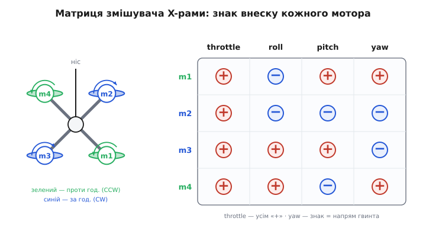

# ⚙️ Змішувач моторів: як команда рискання стає обертами кожного гвинта

Пілот штовхнув стик рискання вбік — хоче, щоб дрон повернувся носом ліворуч навколо вертикальної осі. Але жоден мотор не вміє «повертати наліво». Мотор уміє одне: крутити свій гвинт швидше чи повільніше. Уся хитрість політного контролера в тому, щоб цю єдину абстрактну команду — «рискай ліворуч, з ось такою силою» — розкласти на чотири конкретні числа: наскільки додати газу мотору 1, скільки зняти з мотора 2, і так далі. Ця розкладка зветься **змішувач моторів** (*motor mixer*), і живе вона у прошивці рівно між регулятором орієнтації та регуляторами обертів окремих моторів.

Розберемо змішувач до останнього рядка коду. Він короткий — десяток формул, — але кожен знак у ньому має фізичну причину, а кожна пастка в ньому вже колись роняла реальний апарат із неба.

## Задача

На вхід контролер орієнтації віддає чотири незалежні бажання, кожне — одне число:

- **`throttle`** — скільки загальної тяги (спільний газ на всі мотори, тримає висоту);
- **`roll`** — момент крену (нахилити ліворуч/праворуч);
- **`pitch`** — момент тангажу (клюнути носом/задерти);
- **`yaw`** — момент рискання (повернути навколо вертикалі).

Ці чотири величини описують, що апарат має **робити** як єдине тіло. А керувати ми можемо чотирма зовсім іншими величинами — обертами (а точніше, газом) кожного з чотирьох моторів: `m1, m2, m3, m4`. Задача змішувача — перекласти з першої мови на другу: із чотирьох бажань тіла зробити чотири команди моторам.

Чому це взагалі можливо — що чотири виходи точно покривають чотири входи? Бо в квадрокоптера рівно стільки моторів, скільки осей керування плюс газ: 4 = 3 + 1. Кожен мотор дає свій внесок у кожну з чотирьох величин, і, підібравши оберти, можна отримати будь-яку їх комбінацію (доки моторів вистачає тяги). У цьому сенсі квадрокоптер — мінімальна повністю керована конструкція: заберіть один мотор — і рівнянь стане менше, ніж невідомих, апарат перестане керуватися по всіх осях одночасно.

Три з чотирьох каналів — `throttle`, `roll`, `pitch` — інтуїтивно зрозумілі: більше газу з одного боку рами нахиляє її в протилежний. А от `yaw` — найтонший, бо він працює не через тягу, а через **реактивний момент**: керування рисканням тримається на тому, що гвинти, які крутяться в різні боки, штовхають раму навколо вертикалі в різні боки. Саме на каналі рискання і зосередимось, хоч код напишемо для всіх чотирьох одразу — інакше його не перевірити на насичення.

> 🔧 **Навіщо це.** Змішувач — не «математична формальність», а точка, де фізика реактивного моменту стає рядком C, що біжить у циклі керування сотні разів на секунду. Помилитеся тут знаком одного `yaw` — і дрон, замість повертати ліворуч, почне сам себе розкручувати дедалі швидше, аж поки не перекинеться. Це не рідкісний баг, а класична помилка складання нового апарата: мотор крутиться правильно, тяга є, а рискання «тікає» в один бік.

## Ідея

Стик рискання просить надлишок реактивного моменту в один бік. Реактивний момент гвинта напрямлений **проти** його обертання: гвинт, що крутиться проти годинникової стрілки (CCW), штовхає раму за годинниковою, і навпаки. Отже, щоб дати раді моменту рискання «за годинниковою», треба **додати газу гвинтам, які крутяться проти годинникової**, і **зняти газ із тих, що крутяться за годинниковою**. Перші створять більший CCW-момент на гвинтах — а отже більший CW-реактив на раму; другі зменшать свій внесок у протилежний бік. Сумарний реактивний момент рами зсунеться в потрібний бік, і апарат повернеться.

Ключ до всієї конструкції — **знак**. Домовимось, як у більшості польотних прошивок (Betaflight, PX4): мотор, що крутиться **проти годинникової (CCW)**, отримує коефіцієнт рискання **+1**, а мотор **за годинниковою (CW)** — **−1**. Тоді додатна команда `yaw` автоматично підганяє газ CCW-моторам угору, а CW — униз, і рама повертається в наперед узгоджений бік. Цей знак — не абстракція: він фізично прив'язаний до того, у який бік намотано конкретний гвинт на конкретному куті рами.

А тепер найкрасивіше. Внесок кожного мотора в кожен із чотирьох каналів — стала величина, що залежить лише від геометрії рами (де мотор сидить) і напряму його обертання. Тобто весь змішувач — це проста **лінійна комбінація**: газ мотора є сумою чотирьох доданків зі своїми знаками. Для типової X-рами (мотори по кутах квадрата, ніс дивиться між двома переднім моторами) знаки такі:

| мотор | розташування | обертання | throttle | roll | pitch | yaw |
|-------|--------------|-----------|:--------:|:----:|:-----:|:---:|
| m1 | зад-право | CCW | +1 | −1 | +1 | +1 |
| m2 | перед-право | CW | +1 | −1 | −1 | −1 |
| m3 | зад-ліво | CW | +1 | +1 | +1 | −1 |
| m4 | перед-ліво | CCW | +1 | +1 | −1 | +1 |


*Кожен мотор (кут X-рами) додає свій внесок у чотири канали. Газ (throttle) — усім «+», однаково. Roll і pitch — «+» чи «−» залежно від того, з якого боку рами сидить мотор (лівий/правий бік для крену, передній/задній для тангажу). Yaw — «+» для гвинтів проти годинникової, «−» для тих, що за годинниковою. Одна ця табличка знаків і є весь змішувач.*

Прочитаймо табличку в стовпчику `yaw`: `+1` стоїть рівно навпроти двох CCW-моторів (m1, m4), `−1` — навпроти двох CW (m2, m3). Ці два мотори по одній діагоналі крутяться в один бік, два по іншій — у протилежний. Порушивши їхній баланс командою `yaw`, ми і дістаємо керований поворот, який фізично розбирає стаття про реактивний момент. Змішувач — просто спосіб записати цей фізичний факт чотирма коефіцієнтами.

## Робочий код: базовий змішувач

Найперше — «наївна» версія, як її пише кожен, хто вперше складає квадрик. Вона правильна по суті й неправильна в дрібницях, які ми далі полагодимо.

:::tabs
```cpp
// Один рядок матриці змішувача: внесок мотора в кожен канал.
typedef struct {
    float throttle;   // завжди +1: спільний газ
    float roll;       // ±1: лівий/правий бік рами
    float pitch;      // ±1: передній/задній бік рами
    float yaw;        // +1 для CCW-гвинта, −1 для CW-гвинта
} MixRow;

// X-рама, 4 мотори. Порядок m1..m4 — як у таблиці вище.
static const MixRow MIX[4] = {
    // throttle  roll  pitch  yaw
    {  +1.0f,  -1.0f,  +1.0f,  +1.0f },  // m1: зад-право,  CCW
    {  +1.0f,  -1.0f,  -1.0f,  -1.0f },  // m2: перед-право, CW
    {  +1.0f,  +1.0f,  +1.0f,  -1.0f },  // m3: зад-ліво,   CW
    {  +1.0f,  +1.0f,  -1.0f,  +1.0f },  // m4: перед-ліво,  CCW
};

// Вхід: команди від регулятора орієнтації, кожна вже масштабована в частку.
// throttle ∈ [0..1]; roll/pitch/yaw ∈ [−1..+1] (нуль = без моменту).
void mix_naive(float throttle, float roll, float pitch, float yaw,
               float motor[4])
{
    for (int i = 0; i < 4; ++i) {
        motor[i] = MIX[i].throttle * throttle
                 + MIX[i].roll     * roll
                 + MIX[i].pitch    * pitch
                 + MIX[i].yaw      * yaw;
    }
}
```
```python
# Один рядок матриці змішувача: внесок мотора в кожен канал.
# (throttle, roll, pitch, yaw) — коефіцієнти:
#   throttle завжди +1: спільний газ
#   roll  ±1: лівий/правий бік рами
#   pitch ±1: передній/задній бік рами
#   yaw   +1 для CCW-гвинта, −1 для CW-гвинта

# X-рама, 4 мотори. Порядок m1..m4 — як у таблиці вище.
#      throttle  roll  pitch  yaw
MIX = (
    (+1.0, -1.0, +1.0, +1.0),  # m1: зад-право,  CCW
    (+1.0, -1.0, -1.0, -1.0),  # m2: перед-право, CW
    (+1.0, +1.0, +1.0, -1.0),  # m3: зад-ліво,   CW
    (+1.0, +1.0, -1.0, +1.0),  # m4: перед-ліво,  CCW
)


# Вхід: команди від регулятора орієнтації, кожна вже масштабована в частку.
# throttle ∈ [0..1]; roll/pitch/yaw ∈ [−1..+1] (нуль = без моменту).
def mix_naive(throttle, roll, pitch, yaw):
    motor = [0.0] * 4
    for i, (kt, kr, kp, ky) in enumerate(MIX):
        motor[i] = (kt * throttle
                    + kr * roll
                    + kp * pitch
                    + ky * yaw)
    return motor
```
:::

Це працює на око, поки команди малі. Але щойно пілот дасть повний газ і одночасно різко крутне рискання, вилазить перша серйозна проблема — **насичення**.

## Пастка перша: насичення й пріоритет осей

Газ мотора — фізична величина з жорсткими межами: нижче нуля мотор не крутиться (від'ємної тяги гвинт не дає), вище одиниці — впирається в стелю (`ESC` уже на повній). Але сума чотирьох доданків легко вилазить за `[0..1]`. Хай `throttle = 0.9`, і водночас `yaw = +0.3`: мотору m1 (`+1` по газу, `+1` по рисканню) виходить `0.9 + 0.3 = 1.2`. Куди подіти зайві `0.2`?

Наївний рефлекс — просто обрізати (`clamp`) кожен мотор у `[0..1]` окремо. І це **найгірше** з можливого. Обрізавши m1 до `1.0`, ми відняли в нього `0.2` саме того рискання, яке щойно замовили, — а решта моторів своє рискання отримали сповна. Момент рискання перекосився, а заразом підмішався паразитний крен-тангаж, якого ніхто не просив: обрізаний мотор дає не ту комбінацію, що інші. Дрон замість чистого повороту сіпнеться й хитнеться.

Правильний підхід ділить біду порівну й у **правильному порядку пріоритетів**. Ідея: осі керування важливіші за абсолютний газ — краще трохи просісти/піднятися по висоті, ніж втратити керованість. А серед осей крен і тангаж важливіші за рискання: втратити рискання на пів секунди неприємно, але апарат лишиться в повітрі рівним; втратити крен чи тангаж — і він перекинеться. Саме таку ієрархію використовує PX4: спершу забезпечити крен і тангаж, потім — скільки лишилось — рискання, і лише тоді підганяти спільний газ, зменшуючи його, щоб уся комбінація влізла в межі.

Ось змішувач, який робить це чесно: додає канали за пріоритетом і, коли не влазить, **зсуває спільний газ**, а не ріже окремі мотори.

:::tabs
```cpp
#include <math.h>

static inline float clampf(float v, float lo, float hi) {
    return v < lo ? lo : (v > hi ? hi : v);
}

// Змішувач із коректним насиченням і пріоритетом осей.
// Повертає motor[4] у [0..1]. throttle ∈ [0..1], осі ∈ [−1..+1].
void mix_saturate(float throttle, float roll, float pitch, float yaw,
                  float motor[4])
{
    // 1. Спершу лише моментні канали (без спільного газу).
    //    Це «різницева» частина — вона й нахиляє, і крутить апарат.
    float m[4];
    for (int i = 0; i < 4; ++i) {
        m[i] = MIX[i].roll  * roll
             + MIX[i].pitch * pitch
             + MIX[i].yaw   * yaw;
    }

    // 2. Знайти діапазон різницевої частини по всіх моторах.
    float mmin = m[0], mmax = m[0];
    for (int i = 1; i < 4; ++i) {
        if (m[i] < mmin) mmin = m[i];
        if (m[i] > mmax) mmax = m[i];
    }
    float span = mmax - mmin;   // повний розмах моментної частини

    // 3. Якщо сам розмах уже ширший за вікно [0..1] — момент не влазить
    //    фізично. Стиснути всю моментну частину пропорційно (spread scale).
    //    Тут крен/тангаж/рискання просядуть РАЗОМ, зберігши напрям.
    if (span > 1.0f) {
        float k = 1.0f / span;
        for (int i = 0; i < 4; ++i) m[i] *= k;
        mmin *= k; mmax *= k;
    }

    // 4. Тепер вибрати спільний газ так, щоб уся комбінація влізла.
    //    Дозволений діапазон газу: [ -mmin .. 1 - mmax ].
    //    Бажаний throttle затиснути в цей діапазон — газ «поступається»
    //    моменту, а не навпаки.
    float lo = -mmin;
    float hi = 1.0f - mmax;
    float thr = clampf(throttle, lo, hi);

    // 5. Скласти: газ + моментна частина. Гарантовано в [0..1].
    for (int i = 0; i < 4; ++i)
        motor[i] = clampf(thr + m[i], 0.0f, 1.0f);  // clamp — лише страховка
}
```
```python
# Змішувач із коректним насиченням і пріоритетом осей.
# Повертає motor[4] у [0..1]. throttle ∈ [0..1], осі ∈ [−1..+1].
def mix_saturate(throttle, roll, pitch, yaw):
    # 1. Спершу лише моментні канали (без спільного газу).
    #    Це «різницева» частина — вона й нахиляє, і крутить апарат.
    m = [kr * roll + kp * pitch + ky * yaw
         for (_kt, kr, kp, ky) in MIX]

    # 2. Знайти діапазон різницевої частини по всіх моторах.
    mmin = min(m)
    mmax = max(m)
    span = mmax - mmin   # повний розмах моментної частини

    # 3. Якщо сам розмах уже ширший за вікно [0..1] — момент не влазить
    #    фізично. Стиснути всю моментну частину пропорційно (spread scale).
    #    Тут крен/тангаж/рискання просядуть РАЗОМ, зберігши напрям.
    if span > 1.0:
        k = 1.0 / span
        m = [v * k for v in m]
        mmin *= k
        mmax *= k

    # 4. Тепер вибрати спільний газ так, щоб уся комбінація влізла.
    #    Дозволений діапазон газу: [ -mmin .. 1 - mmax ].
    #    Бажаний throttle затиснути в цей діапазон — газ «поступається»
    #    моменту, а не навпаки.
    lo = -mmin
    hi = 1.0 - mmax
    thr = min(max(throttle, lo), hi)

    # 5. Скласти: газ + моментна частина. Гарантовано в [0..1].
    #    clamp — лише страховка.
    return [min(max(thr + mi, 0.0), 1.0) for mi in m]
```
:::

Придивіться до логіки кроків 4–5. Замість того щоб рвати окремий мотор, ми **рухаємо всю четвірку разом** уздовж осі газу, знаходячи таке спільне зміщення, за якого і найслабший мотор не пірне під нуль, і найсильніший не перевалить за одиницю. Момент (різниця між моторами) при цьому зберігається недоторканим — а саме різниця й керує апаратом. Газ «дихає» вгору-вниз, момент лишається чистим. Це та сама думка, що стоїть за «airmode» у польотних прошивках: краще ледь-ледь програти у висоті, ніж зіпсувати керованість.

> 🔧 **Навіщо це.** Пріоритет осей — не смакова примха, а різниця між «сів рівно» і «розбився». Уявіть різкий маневр на повному газі: мотори вже майже на стелі, а регулятор просить іще й момент. Якщо газ упреться й не поступиться, момент не буде виконано — апарат не вирівняється і зірветься. Тому в бойовому коді газ завжди «поступається» осям, а рискання — крену з тангажем. Хто цю ієрархію переставить, той рано чи пізно втратить апарат саме в найгостріший момент, коли керування потрібне найдужче.

Насичення тісно ріднить змішувач із проблемою [насичення інтегратора в ПІД-регуляторі](root:embedded/pid-tuning-cascade): і там, і там виконавчий орган упирається в межу, і те, як ви з цим обійдетеся, вирішує стійкість усього контуру.

## Пастка друга: знак рискання для CW/CCW

Найпідступніша помилка змішувача не валить компіляцію й не видно на землі — вона чекає першого зльоту. Це **переплутаний знак рискання**.

Уявіть, що при складанні ви прикрутили гвинти правильно (тяга вгору), моторчики крутяться, апарат навіть висить — але хтось помилився в таблиці й поставив CW-мотору `+1` замість `−1` у стовпці `yaw`. Що станеться? Команда рискання попросить надлишок реактивного моменту в один бік. Апарат почне повертатися. Регулятор орієнтації бачить, що поворот **не** туди, куди просив пілот (бо знак перевернуто), і, щоб виправитися, додає рискання ще сильніше — у той самий хибний бік. Виходить **додатний зворотний зв'язок**: що більше апарат крутиться не туди, то дужче контролер його туди штовхає. Рискання «тікає», апарат стрімко розкручується навколо вертикалі й перекидається. Класичний «yaw spin» новозібраного дрона.

Чому це саме про знак, а не про «слабкий мотор»? Бо перевернутий знак робить із від'ємного зворотного зв'язку (який гасить помилку) додатний (який її роздуває). Величина коефіцієнта може бути ідеальною — важить лише його **напрям**. Ось чому в бойовій прошивці знак рискання не пишуть «на віру», а прив'язують до фізичного факту — до того, у який бік реально намотано гвинт на цьому куті:

:::tabs
```cpp
// Напрям обертання конкретного гвинта — фізичний факт, не вподобання.
typedef enum { PROP_CCW = +1, PROP_CW = -1 } PropSpin;

// Коефіцієнт рискання ВИВОДИТЬСЯ з напряму гвинта, а не вбивається вручну.
// Так неможливо випадково розійтися зі знаком реактивного моменту.
static float yaw_coeff(PropSpin spin) {
    // CCW-гвинт штовхає раму CW → додатна команда yaw має пришвидшити його.
    return (float)spin;   // PROP_CCW → +1, PROP_CW → −1
}

// Заповнити стовпець yaw матриці з фактичних напрямів моторів.
void build_yaw_column(const PropSpin spin[4], MixRow mix[4]) {
    for (int i = 0; i < 4; ++i)
        mix[i].yaw = yaw_coeff(spin[i]);
}
```
```python
from enum import IntEnum


# Напрям обертання конкретного гвинта — фізичний факт, не вподобання.
class PropSpin(IntEnum):
    CCW = +1
    CW = -1


# Коефіцієнт рискання ВИВОДИТЬСЯ з напряму гвинта, а не вбивається вручну.
# Так неможливо випадково розійтися зі знаком реактивного моменту.
def yaw_coeff(spin):
    # CCW-гвинт штовхає раму CW → додатна команда yaw має пришвидшити його.
    return float(spin)   # PropSpin.CCW → +1, PropSpin.CW → −1


# Заповнити стовпець yaw матриці з фактичних напрямів моторів.
# rows — список рядків [throttle, roll, pitch, yaw]; правимо на місці.
def build_yaw_column(spin, rows):
    for i in range(4):
        rows[i][3] = yaw_coeff(spin[i])
```
:::

Тут знак рискання неможливо переплутати незалежно від решти: він **обчислюється** з того, як стоїть гвинт, а не набирається пальцями в таблиці. Поміняли напрям мотора при перепайці — поміняли `spin`, і знак поїхав за ним автоматично. Ця дрібна дисципліна — «виводь знак із фізики, не з пам'яті» — рятує від найдорожчого класу помилок змішувача. Звідки береться сам напрям реактивного моменту й чому CCW-гвинт штовхає раму саме CW — це фізика, яку розбирає [керування по осях roll/pitch/yaw](root:sys-dron/roll-pitch-yaw-control); змішувач лише сумлінно її кодує.

## Пастка третя: інерційний ривок J·α при різкій зміні обертів

Останнє, і найтонше. Досі ми мовчки припускали, що реактивний момент мотора пропорційний його газу — і в усталеному польоті це так: аеродинамічний реактив росте як квадрат обертів. Але змішувач працює **в динаміці** — він щоцикл міняє команди, іноді різко. І тут прокидається друга складова реактивного моменту, **інерційна**: щоб розкрутити гвинт швидше, мотор мусить надати йому додаткового моменту імпульсу, і цей момент теж повертається в раму.

Величина його — з другого закону Ньютона для обертання:

```
M_інерц = J · α
```

де J — момент інерції гвинта разом із ротором мотора (кг·м²), α — кутове прискорення гвинта (рад/с²). Поки оберти сталі, α = 0 і ця складова спить. Але щойно змішувач стрибком змінює команду рискання — скажімо, з нуля на повний — мотори мусять різко перекрутитися, α злітає, і в раму б'є **короткий, але потужний** імпульс рискання, набагато різкіший, ніж дав би самий аеродинамічний момент. Що таке кутове прискорення й чому саме воно, а не швидкість, входить у цей момент — це [кутова швидкість і прискорення](root:ph-mechanics/angular-velocity).

Це двобічний ефект. З одного боку, інерційний ривок **корисний** — саме завдяки йому дрон рискає так жваво: різка зміна обертів дає миттєвий поштовх повороту ще до того, як устигне змінитися аеродинамічний реактив. Гоночні квадрики буквально живуть на цьому — їхня скажена реакція на стик рискання це переважно J·α, а не усталений момент. З іншого боку, той самий ривок **шкодить**, коли команда рискання смикається туди-сюди (шум давача, надто агресивний регулятор): гвинти без потреби то розганяються, то гальмують, кожне смикання — новий J·α-удар у раму, апарат дрібно тремтить, а мотори й батарея марно гріються.

Тому змішувач у бойовій прошивці майже ніколи не віддає команду мотору «як є» — між ним і ESC стоїть обмежувач швидкості наростання (*slew-rate limit*), що не дає газу мінятися надто різко:

:::tabs
```cpp
// Обмежувач наростання газу: гасить непотрібні J·α-ривки.
// max_step — максимальна зміна газу за один цикл керування.
void slew_limit(const float target[4], float state[4],
                float max_step, float out[4])
{
    for (int i = 0; i < 4; ++i) {
        float delta = target[i] - state[i];
        if (delta >  max_step) delta =  max_step;
        if (delta < -max_step) delta = -max_step;
        state[i] += delta;
        out[i]    = state[i];
    }
}
```
```python
# Обмежувач наростання газу: гасить непотрібні J·α-ривки.
# max_step — максимальна зміна газу за один цикл керування.
# state — список зі станом на місці; повертаємо новий out.
def slew_limit(target, state, max_step):
    out = [0.0] * 4
    for i in range(4):
        delta = target[i] - state[i]
        if delta > max_step:
            delta = max_step
        elif delta < -max_step:
            delta = -max_step
        state[i] += delta
        out[i] = state[i]
    return out
```
:::

Тонкість тут — вибрати `max_step` із розумом. Затиснете надто туго — уб'єте ту саму жваву J·α-реакцію, заради якої й городили город, апарат стане млявим на рискання. Відпустите зовсім — назад повернеться тремтіння й перегрів моторів на смиканому рисканні. Золота середина залежить від інерції конкретних гвинтів: важкі великі гвинти (з великим J) б'ють у раму сильніше й вимагають м'якшого обмеження, легкі — терплять різкіші команди. І це вже не абстракція коду, а вимір реального заліза: перш ніж підбирати `max_step`, треба знати момент інерції своєї гвинто-моторної пари.

> 🔧 **Навіщо це.** Різниця між гоночним квадриком і повільним знімальним — значною мірою в тому, як налаштований цей обмежувач і які гвинти стоять. Той самий змішувач із тим самим кодом дасть скажену вертку реакцію на легких гвинтах і плавну «кінематографічну» — на важких, саме через J·α. Розуміти, що керованість рискання наполовину прихована в інерції гвинта, а не лише в аеродинаміці, — і означає розуміти змішувач по-справжньому, а не просто переписати матрицю знаків.

## Складаємо все докупи

Повний тракт від стика до ESC — це три ланки поспіль, і кожна закриває одну з розібраних пасток:

:::tabs
```cpp
// Повний вихідний тракт: команди осей → газ кожного мотора → ESC.
// Викликається щоцикл керування (типово 1–8 кГц у сучасних FC).
void motor_output_stage(float throttle, float roll, float pitch, float yaw,
                        float slew_state[4], float max_step)
{
    float mixed[4], limited[4];

    // 1. Змішування з насиченням і пріоритетом осей.
    mix_saturate(throttle, roll, pitch, yaw, mixed);

    // 2. Обмеження наростання — гасимо зайві J·α-ривки.
    slew_limit(mixed, slew_state, max_step, limited);

    // 3. Віддати кожен газ своєму регулятору обертів.
    for (int i = 0; i < 4; ++i)
        esc_set_throttle(i, limited[i]);   // напр., через DShot
}
```
```python
# Повний вихідний тракт: команди осей → газ кожного мотора → ESC.
# Викликається щоцикл керування (типово 1–8 кГц у сучасних FC).
# slew_state — список зі станом обмежувача, живе між викликами.
def motor_output_stage(throttle, roll, pitch, yaw, slew_state, max_step):
    # 1. Змішування з насиченням і пріоритетом осей.
    mixed = mix_saturate(throttle, roll, pitch, yaw)

    # 2. Обмеження наростання — гасимо зайві J·α-ривки.
    limited = slew_limit(mixed, slew_state, max_step)

    # 3. Віддати кожен газ своєму регулятору обертів.
    for i in range(4):
        esc_set_throttle(i, limited[i])   # напр., через DShot
```
:::

Ось і весь змішувач — від фізичної ідеї до останнього виклику `esc_set_throttle`. Матриця знаків народжується з геометрії рами й напрямів гвинтів; насичення ділить дефіцит газу за чесним пріоритетом осей; знак рискання виводиться з фізики реактивного моменту, а не з пам'яті програміста; обмежувач наростання приборкує інерційний ривок J·α. Кожен рядок тут — пряме прочитання того, що робить реактивний момент на легкій рамі з чотирма гвинтами, які крутяться навхрест.

І остання думка про красу цієї конструкції. Гелікоптеру для рискання потрібен окремий хвостовий гвинт, ціла механічна система; квадрику — рівно чотири числа зі знаками `+1`/`−1` у стовпці `yaw`. Керування поворотом не коштує апаратові жодної зайвої деталі — воно вже вбудоване в те, що половина гвинтів крутиться в один бік, а половина в інший. Змішувач лише записує цей факт кодом. Те, що фізика реактивного моменту дала безкоштовно, прошивка забирає одним рядком лінійної комбінації — і саме в цьому лаконізмі й криється інженерна елегантність квадрокоптера. Як команди осей `roll/pitch/yaw` народжуються ще раніше, до змішувача, у самому регуляторі орієнтації — окрема ланка того самого тракту, [мікшер у ланцюжку керування](root:sys-dron/motor-mixer).
