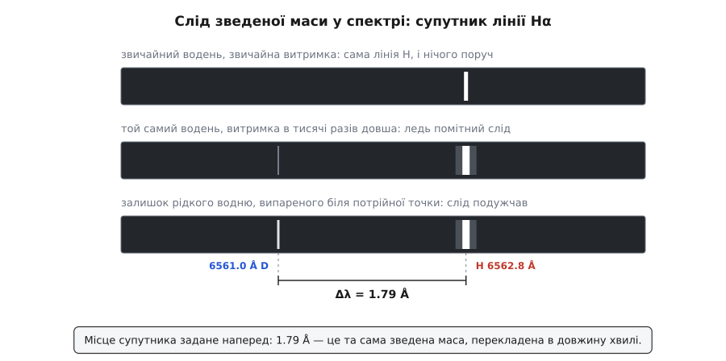

# 📜 Як розбіжність у п'ятому знаку видала важкий водень

Другий різновид найпростішого елемента знайшли не терезами й не хімічною реакцією, а лінійкою: у спектрі водню мав стояти блідий двійник кожної лінії, відсунутий рівно на 1.79 ангстрема, — і це число наперед порахувала зведена маса. У цій історії хибний вимір привів до правильного відкриття, та сама маленька величина спершу вказала адресу пошуку, а потім послужила ситом, а суперечка про назву протривала довше за все інше.

## Дві шкали атомної ваги розходяться

До 1929 року хімія й фізика важили атоми двома різними лінійками — і були певні, що лінійки збігаються. Хіміки взяли за одиницю кисень: природному кисневі призначили атомну вагу рівно 16 і від нього перерахували все інше через ваги речовин, що вступають у реакції. Фізики важили атоми поштучно, у [мас-спектрографі](topic:ph-quantum/mass-spectrometry) — приладі, що розганяє йони електричним полем і розводить їх магнітним за відношенням маси до заряду, тож кожен різновид атома лишає на плівці свою окрему смужку; там за 16 брали масу найпоширенішого різновиду кисню.

Поки кисень вважали однорідним, обидві шістнадцятки означали те саме. Але 1929 року канадсько-американський хімік Вільям Джіок (William Giauque) і Геррік Джонстон (Herrick Johnston) знайшли в повітрі кисень із масами 17 і 18 — [ізотопи](topic:ph-quantum/isotopes), тобто атоми того самого елемента, у яких ядра різної маси, а заряд ядра однаковий, тож хімічно вони майже нерозрізненні. Природний кисень виявився сумішшю. Хімічна шістнадцятка стала середнім по суміші, фізична лишилася масою чистого кисню-16 — і дві шкали розійшлися приблизно на три десятитисячні.

Розбіжність крихітна, зате через неї довелося перераховувати одне в одне всі давні числа. І на водні числа не зійшлися. Перерахований на хімічну шкалу результат Френсіса Астона (Francis Aston), здобутий мас-спектрографом, давав 1.00756. Пряме хімічне зважування давало 1.00777. Різниця в п'ятому знаку — але більша за оголошені похибки обох способів, а отже, десь за нею мусить стояти фізична причина, а не недбальство.

У травні 1931 року фізик Реймонд Бердж (Raymond Birge) і астрофізик Дональд Мензел (Donald Menzel) назвали причину — і вона була та сама, що з киснем. Якщо у звичайному водні на кожні 4500 легких атомів припадає один із удвічі важчим ядром, то хімічна вага, як середнє по суміші, саме на стільки й перевищить фізичну вагу чистого легкого водню. Число 4500 вони дістали просто з величини розбіжності.

Тепер найцікавіше. Розбіжність, з якої все почалося, була несправжня: Астон занизив масу водню, тож число, з якого Бердж і Мензел вирахували свої 4500, нічого не варте. А важкий водень усе одно існував — і майже там, де його поставили: один атом на приблизно 6400, а не на 4500. Юрі пізніше, у примітці до своєї Нобелівської лекції, визнав, що без Астонової помилки відкриття дейтерію відклалося б надовго; сам Астон 1935 року сказав, що ніколи не шкодуватиме про ту занижену масу, хоч якою серйозною вона виявиться, — бо саме вона підштовхнула пошук. Обидві оцінки не переказ із чуток: їх лишили у друку самі учасники подій.

## Адреса, за якою шукати

Хибний аргумент дав здогад, але здогад — це ще не пошук. Шукати треба за адресою, а адресу дала зведена маса.

Ядро не прибите цвяхом до простору. Електрон і ядро крутяться навколо спільного центра, і в рівні енергії атома входить не маса електрона, а зведена маса пари. Через це стала Рідберга, з якої обчислюють [довжини хвиль ліній водню](topic:ph-quantum/hydrogen-spectrum) — тих дискретних кольорів, що їх випромінює атом, коли електрон переходить із вищого рівня на нижчий, — не є сталою: вона трохи залежить від маси ядра.

```
R_M = R_∞ / (1 + mₑ/M)        стала Рідберга з поправкою на рух ядра
λ ∝ 1/R                        довжина хвилі обернена до сталої
```

Ядро дейтерію майже точно вдвічі важче за протон, тож доважок mₑ/M для нього вдвічі менший:

```
mₑ/m_p = 1/1836.15 = 5.4462·10⁻⁴      звичайний водень
mₑ/m_d = 1/3670.48 = 2.7244·10⁻⁴      важкий водень (ядро вдвічі важче)
```

Інакше кажучи, «ефективна» маса електрона у звичайному водні менша за справжню на 0.054 %, а у важкому — лише на 0.027 %. Уся різниця між двома видами водню, з якої й виріс пошук, — це двадцять сім стотисячних відсотка маси електрона. Але вона переводиться просто в число ангстремів:

**Наскільки зсунеться найяскравіша лінія водню, червона Hα?**

```
λ_H/λ_D = (1 + 5.4462·10⁻⁴) / (1 + 2.7244·10⁻⁴)
        = 1.00027210
Δλ/λ    = 1 − 1/1.00027210 = 2.7203·10⁻⁴
Δλ(Hα)  = 6562.79 Å · 2.7203·10⁻⁴ = 1.785 Å
```

Лінія важкого водню має стояти на 1.79 Å ближче до фіолетового кінця, тобто на 6561.0 Å. Так само рахуються решта ліній серії Бальмера: 1.32 Å для Hβ, 1.18 Å для Hγ, 1.12 Å для Hδ. Не «десь поруч», а чотири числа з точністю до сотих ангстрема — і всі чотири мають справдитися разом.

> 🔧 **Навіщо це.** Зведена маса перетворює туманний здогад «може, буває важчий водень» на завдання з адресою: подивитися в чотири наперед названі місця на плівці. Такий прогноз можна спростувати — якщо в тих місцях порожньо, гіпотеза мертва. Саме тому спектральний слід виявився сильнішим доказом, ніж будь-яке зважування: він каже не лише «ядро важче», а «важче рівно вдвічі».

Цей доважок був не новинкою. 1913 року Альфред Фаулер (Alfred Fowler) закинув Борові, що його щойно оприлюднена теорія атома не сходиться з лабораторними вимірами: відношення сталих Рідберга для йонізованого гелію й для водню за теорією мало дорівнювати рівно 4, а вимірювання давали 4.0016. Бор замінив у своїй формулі масу електрона на зведену масу пари «електрон — ядро», і відношення стало 4.00163. Фаулер визнав згоду. Тобто до 1931 року поправка на рух ядра була вже не екзотикою, а прийомом, який одного разу врятував цілу теорію.

Сам Бор тоді ж спробував тим самим способом виловити водень масою 3, порахувавши для нього відносний зсув близько 3.6·10⁻⁴, — і нічого не знайшов. Ані про спробу, ані про розрахунок він не друкував; про цей епізод відомо з листування й пізніших спогадів, тож на роль передбачення він не претендує — приватний здогад, який не став частиною науки свого часу.

## Чому важкий водень не знайшли раніше

Здогади, що водень може бути сумішшю, з'являлися й до того, але жоден не мав ані сили теорії, ані сили досліду. Резерфорд у Бейкерівській лекції 1920 року допускав існування «атома масою 2 з одним зарядом» — але то був радше доказ від можливості: якщо ядра складаються з протонів, склеєних електронами, то чому б і ні. Такий доказ ні до чого не зобов'язує й нічого не забороняє.

Єдину справжню спробу зробили ще 1919 року німецькі науковці — фізик Отто Штерн (Otto Stern) і хімік Макс Фольмер (Max Volmer). Вони теж помітили, що атомні ваги водню й кисню відхиляються від цілих чисел, теж припустили важкий водень (за їхньою оцінкою — близько 0.8 % суміші, тобто у півсотні разів більше за справжню частку) і взялися ловити його розділенням дифузією. Не знайшли нічого — і написали, що довели: водень і кисень не є сумішами ізотопів. Насправді їхній дослід показував лише, що важких атомів менше ніж десять на мільйон; справжня частка — близько ста п'ятдесяти на мільйон, тобто чутливості бракувало разів у п'ятнадцять. Астон 1924 року впевнено повторив цей висновок у своїй монографії, і питання закрилося на десять років. Негативний результат, оголошений сильніше, ніж дозволяв прилад, коштував дорожче за будь-яку помилку в числах.

## Один атом на кілька тисяч

Саме в цю закриту справу й повернувся Гарольд Юрі (Harold Clayton Urey), доцент хімії Колумбійського університету: прочитавши статтю Берджа й Мензела, він вирішив перетворити припущення на факт. Труднощі були очевидні з самої гіпотези: якщо важких атомів один на 4500, то й лінія від них у 4500 разів слабша за сусідню. На фотопластинці це означає, що поки супутник ледь проступить, головна лінія розпливеться в сліпучу пляму.

Порятунком була роздільна здатність. У підвалі фізичного корпусу університету (Pupin Hall) щойно поставили новий ґратковий спектрограф із фокусною відстанню 21 фут — близько 6.4 метра: що довший шлях від ґратки до плівки, то далі розходяться сусідні довжини хвиль і то більше чистого місця лишається між ними. Юрі й Джордж Мерфі (George Murphy) зняли звичайний водень із колосальною передержкою і справді побачили ледь помітні позначки в усіх чотирьох розрахованих місцях.

І це нічого не доводило. Слабка риска в потрібному місці може бути привидом ґратки, домішкою чужого газу, порошинкою на емульсії. Доказ мусив бути іншим: коли важкого водню в пробі стане більше, риска мусить помітно подужчати, а всі перелічені підробки — ні. Отже, треба було навчитися згущувати важкий водень.

## Зведена маса вдруге: чому холодний залишок важчає

Тут та сама величина заходить у справу вдруге, вже не як мітка, а як знаряддя.

Молекула в рідині утримується притяганням сусідів, і навіть за абсолютного нуля вона не завмирає: квантова механіка лишає їй [нульові коливання](topic:ph-quantum/zero-point-energy) з енергією ħω/2, яку не можна відібрати. Частота цих коливань задана зведеною масою тієї пари, що коливається, ω = √(k/μ). Замініть один атом водню в молекулі на важкий — μ зросте, ω впаде, а з нею впаде й нульова енергія. Важча молекула сидить у ямі притягання глибше, тож відірватися їй важче: її тиск пари нижчий, вона менш летка. Видно це просто з температур кипіння: H₂ кипить за 20.3 К, HD — за 22.1 К, D₂ — за 23.7 К.

Отже, коли рідкий водень випаровується, легкі молекули відлітають охочіше, а важкі накопичуються в залишку. Юрі порахував відношення тисків пари за теорією Дебая й побачив головне: відбір слабенький біля точки кипіння і помітно сильніший ближче до потрійної точки, де водень уже майже твердне. Тому переганяти треба на самому холоді.

Цю частину роботи взяв на себе Фердинанд Бріквідде (Ferdinand Brickwedde), фізик Національного бюро стандартів у Вашингтоні — одне з небагатьох місць у країні, де вміли робити рідкий водень літрами. Газ під тиском близько 2500 фунтів на квадратний дюйм попередньо холодили в рідкому азоті й зріджували, випускаючи крізь дросель. Перший зразок був залишком після випаровування шести літрів рідини за звичайного тиску, коло 20 К, — кілька останніх мілілітрів. Другий і третій готували інакше: чотири літри рідини випарювали за тиску лише на кілька міліметрів ртутного стовпа вище тиску потрійної точки, тобто градусів на шість холодніше, і збирали останні два-три мілілітри. Зразки поїхали до Нью-Йорка залізницею.

## День подяки 1931 року

У четвер 26 листопада 1931 року, на День подяки, Юрі зняв спектр згущеного зразка й побачив те, заради чого все затівалося: слабкі лінії помітно подужчали. Він запізнився додому на святкову вечерю.

Виміряні зсуви лягли поруч із розрахованими так, як лягають чесні виміри — з розкидом у соті частки ангстрема:

```
лінія   розрахунок   звич. H   1-й зразок   2-й зразок     (Δλ, Å)
Hα        1.793         —          —           1.820
Hβ        1.326       1.346      1.330         1.315
Hγ        1.185       1.206      1.119         1.176
Hδ        1.119       1.145      1.103           —
```

*(таблиця з праці Юрі, Бріквідде й Мерфі, Physical Review 40, 1932)*

Згода не ідеальна — і саме тому переконлива: похибка виміру тут більша за похибку теорії, а не навпаки. Головне ж не в цих сотих, а в тому, що лінії росли разом із концентрацією: у другому зразку важкого водню було вже приблизно один атом на 800 замість одного на кілька тисяч.


*У звичайному водні супутник видно лише на передержаній пластинці, і сам по собі він нічого не доводить; доказом стало те, що в залишку після перегонки він подужчав, а місце його не зрушилося.*

29–30 грудня 1931 року на тридцять третіх щорічних зборах Американського фізичного товариства в Тулейнському університеті в Новому Орлеані Юрі виклав це в десятихвилинній доповіді. Лист до редакції «A Hydrogen Isotope of Mass 2» вийшов у новорічному числі Physical Review 1 січня 1932 року, повна стаття — 1 квітня. Поширеність нового ізотопу автори оцінили як один на чотири тисячі; сучасне значення для океанської води — один на 6420. Заразом вони чесно записали, що шукали й водень масою 3, але слідів не знайшли; тритій дався в руки лише в 1934–1939 роках, і кому саме приписати те відкриття, історики сперечаються досі.

Є в цій історії деталь, яку легко проминути. Із чого зроблене нове ядро, першовідкривачі не знали: у їхній статті воно мовчазно вважається двома протонами, склеєними електроном. Нейтрон Джеймс Чедвік (James Chadwick) знайшов лише за кілька тижнів, того ж 1932 року, і аж тоді дейтрон став тим, чим є, — протоном і нейтроном. Спектральний слід повідомляє масу ядра й нічогісінько про його нутрощі; для відкриття цього вистачило.

## Як його звати — і чи це взагалі ізотоп

Відкриття прийняли швидко, за рік про новий ізотоп вийшло понад сотню робіт — а от із назвою почалася тяганина на кілька років.

Юрі пропонував систему з трьох імен: протій, дейтерій, тритій (від гр. prôtos — перший, deúteros — другий, trítos — третій), а для ядра дейтерію — дейтрон. Резерфорд у листі до Юрі від 20 червня 1933 року перебирав «дейтероген» і «діоген», але схилявся до «диплогену» (від гр. diplóos — подвійний), а ядро волів звати диплоном; у Кавендіші так і казали. Ходили ще «дейтон», «дайген» і «дайон». Аргумент Юрі проти диплогену був суто практичний: назви сполук виходили нестерпні — аміак, у якому два атоми водню важкі, а один звичайний, довелося б звати ди-диплоген-моногідроген-нітридом. До того ж диплоген свого часу пропонував сам Бріквідде, і трійця цю назву вже відкидала.

Перемогли назви Юрі; офіційно їх закріпив IUPAC, остаточно — у 1971 році. Дейтерій і тритій донині лишаються єдиними ізотопами, яким дозволено мати власні імена й власні символи: усім іншим ізотопам належить зватися номером.

Було й глибше заперечення. На обговоренні в Королівському товаристві 1934 року Фредерік Содді (Frederick Soddy) — той, хто 1913 року й увів слово «ізотоп» і дістав за свої роботи Нобелівську премію з хімії за 1921 рік, — заявив, що важкий водень ізотопом звати неправильно. Його критерій ізотопності був хімічний: ізотопи не розділяються хімічними засобами. А важкий водень розділяється, та ще й легко. Критерій Содді програв — ізотопність відтоді визначають за зарядом ядра, — але вказував він на річ справжню: більше ніде заміна ізотопу не міняє хімію так сильно, як у водні, бо ніде більше маса ядра не подвоюється.

## Кому дісталася нагорода

Нобелівську премію з хімії 1934 року, оголошену 15 листопада, дали Юрі одному — за відкриття важкого водню. Це не було самоочевидним рішенням. Серйозним суперником вважали Гілберта Ньютона Льюїса (Gilbert Newton Lewis) із Берклі, колишнього вчителя Юрі: щойно вийшла стаття 1932 року, Льюїс узявся за важку воду й уже 1933-го разом із Рональдом Макдоналдом (Ronald Macdonald) виділив її електролізом майже чистою. Шведський фізико-хімік Теодор Сведберг (Theodor Svedberg) у відгуку для комітету від 18 травня 1934 року писав, що головна заслуга у відкритті поза сумнівом належить Юрі, — і все ж радив ділити премію з Льюїсом; лише після дальших обговорень він змінив думку, вирішивши, що роботи Льюїса похідні.

Поділити премію між Юрі та його співавторами в Стокгольмі не розглядали взагалі. Юрі, схоже, вважав інакше: половину грошової частини він віддав Мерфі й Бріквідде.

Відтоді ізотопний зсув перестав бути дивиною й став приладом: за розсувом ліній читають масу ядра, ні до чого не торкаючись. А те, що першою здобиччю цього прийому став не якийсь екзотичний елемент, а другий різновид найпростішого з усіх, добре показує, як глибоко може ховатися різниця у дві сотих відсотка.
