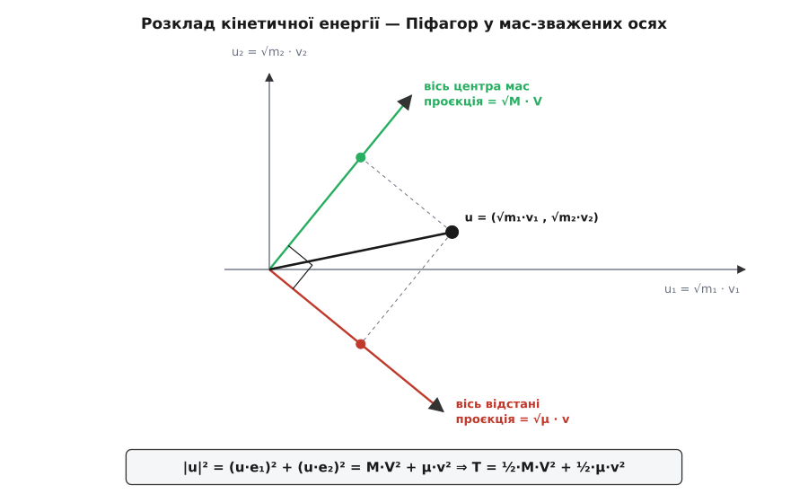
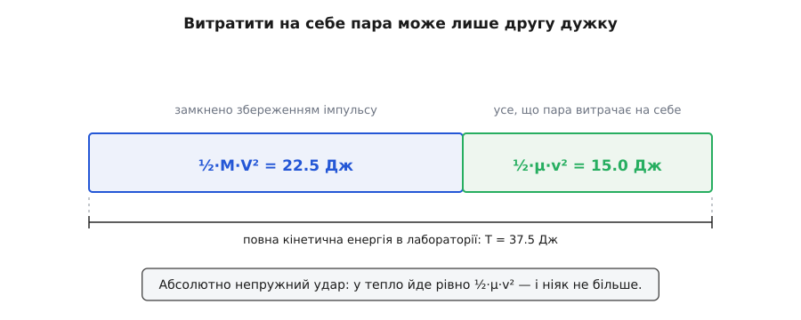

# 🧮 Розклад пари надвоє: імпульс, енергія, момент імпульсу

Заміна змінних (r₁, r₂) → (R, r) окупається не лише в рівнянні руху: та сама пара нових змінних розколює навпіл усі три головні механічні величини пари тіл — імпульс, кінетичну енергію й момент імпульсу. Нижче кожен із цих розколів виведено до кінця, з відповіддю на два питання: чому в них щоразу виринають рівно дві маси — повна M і зведена μ — і чому не буває перехресних доданків, які змішали б рух пари як цілого з рухом усередині неї.

## Обернена заміна

Нові величини означені так:

```
M = m₁ + m₂
R = (m₁·r₁ + m₂·r₂) / M
r = r₁ − r₂
```

Два вектори на вході, два на виході — заміну можна обернути, тобто виразити r₁ і r₂ назад. Підставмо r₁ = r₂ + r у означення R:

```
M·R = m₁·(r₂ + r) + m₂·r₂ = (m₁ + m₂)·r₂ + m₁·r
```

звідки одразу

```
r₂ = R − (m₁/M)·r
r₁ = r₂ + r = R + (m₂/M)·r
```

Коефіцієнти при r варто переписати інакше. Домножмо чисельник і знаменник дробу m₂/M на m₁:

```
m₂/M = m₁·m₂ / (m₁·M) = μ/m₁        (бо μ = m₁·m₂/M)
m₁/M = m₁·m₂ / (m₂·M) = μ/m₂
```

тобто

```
r₁ = R + (μ/m₁)·r
r₂ = R − (μ/m₂)·r
```

Зведена маса стоїть уже тут — у самій геометрії заміни, ще до того, як згадано хоч якусь силу. Відхилення тіл від центра мас, ρ₁ = r₁ − R і ρ₂ = r₂ − R, — це той самий вектор r, поділений між тілами обернено до їхніх мас:

```
ρ₁ = +(μ/m₁)·r
ρ₂ = −(μ/m₂)·r

m₁·ρ₁ + m₂·ρ₂ = μ·r − μ·r = 0
```

Останній рядок — це [центр мас](root:ph-mechanics/center-of-mass) (зважена за масами середня точка системи, яку внутрішні сили не зрушують), переписаний як рівність нулю: зважена сума відхилень від нього дорівнює нулю за означенням. Виглядає як дрібниця, а насправді це той єдиний важіль, який далі тричі поспіль вбиватиме перехресні доданки. Сила цієї рівності — у симетрії: обидва відхилення, помножені кожне на свою масу, дають ту саму μ·r з протилежними знаками, і однакові вони саме тому, що в ρ₁ зведена маса поділена на m₁, а в ρ₂ — на m₂.

## Імпульс: одна велика стрілка й дві однакові маленькі

Маси сталі, тож продиференціювати обернену заміну за часом означає просто поставити крапки:

```
v₁ = V + (μ/m₁)·v
v₂ = V − (μ/m₂)·v
```

де V = Ṙ — швидкість центра мас, а v = ṙ — швидкість першого тіла відносно другого. Помножмо кожен рядок на свою масу й дістанемо [імпульси](root:ph-mechanics/momentum) (добуток маси на швидкість; сума імпульсів замкненої системи не міняється):

```
p₁ = m₁·V + μ·v
p₂ = m₂·V − μ·v
```

Внесок відносного руху в обидва імпульси однаковий за величиною — рівно μ·v — і протилежний за знаком. У сумі він гине:

```
P = p₁ + p₂ = (m₁ + m₂)·V = M·V
```

Повний імпульс пари не знає про внутрішній рух нічого: хоч би як шалено тіла кружляли одне навколо одного, P залежить тільки від пливу центра мас. Але та частина, що зникла із суми, нікуди не поділася — вона і є другою половиною розкладу. Назвімо її внутрішнім імпульсом:

```
q = μ·v
```

Тепер розклад читається в обидва боки:

```
p₁ = (m₁/M)·P + q
p₂ = (m₂/M)·P − q
```

У системі центра мас, де V = 0, лишається p₁ = +q і p₂ = −q: імпульси тіл однакові за величиною й протилежні за напрямом. Це не окрема властивість тієї системи відліку, а її означення, прочитане навпаки, — система центра мас і є та єдина, у якій імпульси зрівноважені. Величина цих зрівноважених імпульсів дорівнює μ·|v|, і вона однакова в будь-якій інерціальній системі: v — різниця швидкостей, а перехід до іншої інерціальної системи додає обом швидкостям те саме, тож різниця не міняється.

Рівняння руху в нових змінних розпадається так само надвоє: dP/dt = 0, бо зовнішніх сил немає, а внутрішні гасяться попарно; dq/dt = F(r), бо похідна від μ·v — це μ·a_відн.

## Кінетична енергія: як гине перехресний доданок

[Кінетична енергія](root:ph-mechanics/kinetic-energy) пари (для кожного тіла — ½mv², міра роботи, яку тіло здатне віддати, гальмуючи) — це сума двох доданків, у кожному з яких сидить своя швидкість. Підставмо в них ту саму обернену заміну:

```
½·m₁·v₁² = ½·m₁·(V + (μ/m₁)·v)²
         = ½·m₁·V² + m₁·(μ/m₁)·(V·v) + ½·m₁·(μ/m₁)²·v²
         = ½·m₁·V² + μ·(V·v) + ½·(μ²/m₁)·v²

½·m₂·v₂² = ½·m₂·V² − μ·(V·v) + ½·(μ²/m₂)·v²
```

Тут V² означає скалярний квадрат V·V, а (V·v) — скалярний добуток двох різних векторів; саме він і є перехресним доданком. Складімо два рядки. Перехресні доданки мають однакову величину μ·(V·v) і протилежні знаки — бо m₁·(μ/m₁) = μ і m₂·(μ/m₂) = μ, та сама μ з обох боків, — тож вони знищуються, і лишається:

```
T = ½·(m₁ + m₂)·V² + ½·μ²·(1/m₁ + 1/m₂)·v²
  = ½·M·V² + ½·μ²·(1/μ)·v²
  = ½·M·V² + ½·μ·v²
```

Другий крок тримається на тотожності 1/μ = 1/m₁ + 1/m₂ — тій самій, якою зведену масу означено. Вона тут не «випадково підійшла»: означення μ є рівно вимогою, щоб сума обернених мас згорталася в одне число, а сума обернених мас виринає щоразу, коли якусь величину ділять між двома тілами обернено до їхньої маси. Тому одна тотожність обслуговує і рівняння руху, і енергію, і момент імпульсу.

Поділ на «рух цілого плюс рух відносно центра мас» чинний для системи з будь-якої кількості тіл: повна кінетична енергія завжди дорівнює ½M·V² плюс кінетична енергія руху частинок відносно центра мас. Це твердження зветься теоремою Кеніга — за роботою німецького математика Йоганна Самуеля Кеніга (1712–1757), опублікованою 1751 року в *Nova Acta Eruditorum*. Особливість саме пари в тому, що для двох тіл уся внутрішня частина згортається в один-єдиний доданок ½μ·v² — з однією масою й однією швидкістю.

## Та сама енергія через імпульси

Обидва доданки можна переписати у формі p²/2m:

```
½·M·V² = (M·V)²/(2·M) = P²/(2·M)
½·μ·v² = (μ·v)²/(2·μ) = q²/(2·μ)

T = P²/(2·M) + q²/(2·μ)
```

Форма p²/2m — це форма вільної частинки. Пара взаємодійних тіл у нових змінних виглядає як дві незалежні вільні частинки: одна з масою M й імпульсом P, друга з масою μ й імпульсом q. Уся взаємодія сидить у потенціальній енергії U(r), яка залежить лише від відстані між тілами, тобто чіпає тільки другу з цих двох частинок:

```
E = ½·M·V² + ½·μ·v² + U(r)
  = [ ½·M·V² ] + [ ½·μ·v² + U(r) ]
```

У першій дужці немає жодної r-величини, у другій — жодної R-величини. Це і є повний зміст слів «задача розпадається на дві»: не «зручно розділити», а немає доданка, який зв'язував би дужки між собою. Наслідок сильніший за збереження повної енергії: раз V стала, то стала й перша дужка, а отже друга зберігається окремо від неї. Саме друга дужка й вирішує долю пари — чи зв'язана вона (для тяжіння це E_вн < 0), де точки повороту, яка амплітуда коливань.

Між дужками є ще одна різниця. Величина ½M·V² залежить від системи відліку й у системі центра мас дорівнює нулю, а E_вн однакова в усіх інерціальних системах, бо складена з v і r — самих різниць. [Принцип відносності Ґалілея](root:ph-mechanics/galilean-relativity) (перехід між інерціальними системами додає всім швидкостям ту саму сталу, і закони руху від цього не міняються) робить перший доданок питанням вибору спостерігача, а другий — властивістю самої пари.

## Момент імпульсу: та сама тотожність утретє

[Момент імпульсу](root:ph-mechanics/angular-momentum) (векторний добуток r×p — міра обертального руху, стала за відсутності моменту зовнішніх сил) складається з внесків обох тіл:

```
L = r₁×p₁ + r₂×p₂
```

Підставмо обернену заміну для положень і щойно знайдені імпульси, а тоді розкриймо дужки:

```
r₁×p₁ = (R + (μ/m₁)·r) × (m₁·V + μ·v)
      = m₁·(R×V) + μ·(R×v) + μ·(r×V) + (μ²/m₁)·(r×v)

r₂×p₂ = (R − (μ/m₂)·r) × (m₂·V − μ·v)
      = m₂·(R×V) − μ·(R×v) − μ·(r×V) + (μ²/m₂)·(r×v)
```

Мішані доданки — ті, де один множник із R-світу, а другий із r-світу, — знову виходять однаковими за величиною й протилежними за знаком, а квадратичний доданок знову згортається через 1/m₁ + 1/m₂ = 1/μ:

```
L = M·(R×V) + μ·(r×v) = R×P + r×q
```

Момент пари як цілого відносно початку координат — плюс момент уявної частинки μ відносно центра мас. Для плоского руху друга частина в полярних координатах (r, φ) має величину ℓ = μ·r²·φ̇, і тоді внутрішня енергія стає задачею про одну відстань:

```
½·μ·v² = ½·μ·(ṙ² + r²·φ̇²)
E_вн   = ½·μ·ṙ² + ℓ²/(2·μ·r²) + U(r)
```

Зведена маса стоїть і при радіальній інертності, і у відцентровому доданку — на цьому тримається весь розрахунок орбіт і коливань пари.

## Чому перехресного доданка не буває: геометрія

Алгебра показала, що доданки скорочуються. Геометрія показує, що інакше й бути не могло.

Кінетична енергія — квадратична форма від швидкостей, і маси в ній стоять множниками при квадратах:

```
T = ½·(m₁·v₁² + m₂·v₂²)
```

Розтягнімо осі так, щоб маси зникли:

```
u₁ = √m₁ · v₁
u₂ = √m₂ · v₂

T = ½·(u₁² + u₂²) = ½·|u|²
```

У цих мас-зважених координатах енергія — просто половина квадрата довжини одного вектора u = (u₁, u₂). (Коли тіла рухаються в просторі, така площина своя для кожної з трьох декартових складових; усі викладки покомпонентні, тож нічого не міняється.)

Тепер погляньмо, чим у цій площині є V і v. Візьмімо два напрямки:

```
e₁ = ( √m₁ , √m₂ ) / √M
e₂ = ( √(μ/m₁) , −√(μ/m₂) )
```

Обидва одиничні, і вони перпендикулярні:

```
|e₁|² = (m₁ + m₂)/M = 1
|e₂|² = μ/m₁ + μ/m₂ = μ·(1/m₁ + 1/m₂) = μ·(1/μ) = 1
e₁·e₂ = ( √m₁·√(μ/m₁) − √m₂·√(μ/m₂) ) / √M = ( √μ − √μ ) / √M = 0
```

Нульовий [скалярний добуток](root:math-algebra/dot-product) (сума добутків однойменних складових; для одиничних векторів — косинус кута між ними) і означає перпендикулярність: проєкція одного напрямку на другий дорівнює нулю. А проєкції вектора u на ці дві осі — рівно ті величини, з яких складено розклад:

```
u·e₁ = (√m₁·v₁·√m₁ + √m₂·v₂·√m₂)/√M = (m₁·v₁ + m₂·v₂)/√M = M·V/√M = √M·V
u·e₂ = √m₁·v₁·√(μ/m₁) − √m₂·v₂·√(μ/m₂) = √μ·(v₁ − v₂) = √μ·v
```

Далі — теорема Піфагора, і більше нічого:

```
|u|² = (u·e₁)² + (u·e₂)² = M·V² + μ·v²
T = ½·|u|² = ½·M·V² + ½·μ·v²
```

Отже перехід від (v₁, v₂) до (V, v) у мас-зважених осях — це поворот: той самий вектор, ті самі точки, лише інші дві перпендикулярні осі, на які його розкладають. Розклад енергії — це Піфагор, а відсутність перехресного доданка — перпендикулярність нових осей.


*Проєкції вектора u на дві перпендикулярні осі дорівнюють √M·V і √μ·v; квадрат довжини дорівнює сумі квадратів проєкцій — це і є розклад енергії.*

Звідси видно й найголовніше: чому саме M і μ, а не якісь інші дві маси. Напрямок «сума» (√m₁, √m₂) має квадрат довжини m₁ + m₂ — щоб зробити його одиничним, ділять на √M. Напрямок «різниця» (1/√m₁, −1/√m₂) має квадрат довжини 1/m₁ + 1/m₂ — щоб зробити одиничним його, ділять на корінь із цієї суми, тобто множать на √μ. Повна маса — це нормування осі центра мас; зведена — нормування осі відстані. Одна й та сама операція над двома перпендикулярними напрямками.

Той самий прийом повторюють для трьох і більше тіл: кожну нову вісь беруть перпендикулярною до всіх попередніх, і кожна приходить зі своєю зведеною масою (координати Якобі). А що заміна — поворот, вона зберігає в мас-зваженому просторі довжини й об'єми, тому в нових змінних не виникає ні перехресних доданків, ні зайвих множників.

## Числа

**Два візки на прямій напрямній: перший наздоганяє другий.**

```
m₁ = 2.0 кг,  v₁ = +6.0 м/с
m₂ = 3.0 кг,  v₂ = +1.0 м/с
```

Спершу величини цілого й величини нутра:

```
M = 2.0 + 3.0 = 5.0 кг
P = 2.0·6.0 + 3.0·1.0 = 12.0 + 3.0 = 15.0 кг·м/с
V = P/M = 15.0/5.0 = 3.0 м/с

v = v₁ − v₂ = 6.0 − 1.0 = 5.0 м/с
μ = 2.0·3.0/5.0 = 1.2 кг
q = μ·v = 1.2·5.0 = 6.0 кг·м/с
```

Перевірмо розклад імпульсу — відніміть від кожного імпульсу його центромасову частку:

```
p₁ − m₁·V = 12.0 − 6.0 = +6.0 = +q
p₂ − m₂·V =  3.0 − 9.0 = −6.0 = −q
```

Тепер енергія — прямо й через розклад:

```
T      = ½·2.0·6.0² + ½·3.0·1.0² = 36.0 + 1.5 = 37.5 Дж
½·M·V² = ½·5.0·3.0²                            = 22.5 Дж
½·μ·v² = ½·1.2·5.0²                            = 15.0 Дж
                                 22.5 + 15.0   = 37.5 Дж ✓
```

Через імпульси виходить те саме:

```
P²/(2·M) = 15.0²/(2·5.0) = 225/10 = 22.5 Дж
q²/(2·μ) =  6.0²/(2·1.2) = 36/2.4 = 15.0 Дж
```

І мас-зважений Піфагор на тих самих числах:

```
u₁ = √2.0·6.0 = 8.485      u₂ = √3.0·1.0 = 1.732
|u|²  = 72.0 + 3.0 = 75.0             →  T = ½·75.0 = 37.5 Дж
u·e₁ = √5.0·3.0 = 6.708               →  (u·e₁)² = 45.0
u·e₂ = √1.2·5.0 = 5.477               →  (u·e₂)² = 30.0
                       45.0 + 30.0    = 75.0 ✓
```

**Погляд із машини, що їде поруч.** Перейдімо в систему відліку, яка рухається зі швидкістю u = +3.0 м/с, тобто рівно з V:

```
v₁' = 6.0 − 3.0 = +3.0 м/с
v₂' = 1.0 − 3.0 = −2.0 м/с

T'  = ½·2.0·3.0² + ½·3.0·2.0² = 9.0 + 6.0 = 15.0 Дж
V'  = 0                        → ½·M·V'² = 0
v'  = 3.0 − (−2.0) = 5.0 м/с   → ½·μ·v'² = 15.0 Дж
```

Із 37.5 Дж лишилося 15.0 — зникла рівно центромасова частка, а внутрішня не здригнулася. Зміна спостерігача нічого не перерозподіляє всередині пари: вона тільки додає або віднімає першу дужку.

**Скільки з цієї енергії пара взагалі здатна витратити.** Хай візки зчепляться — абсолютно непружний удар, найгірший для енергії випадок [зіткнення](root:ph-mechanics/collisions). Імпульс зберігається, тож спільна швидкість після удару — та сама V:

```
T_після = ½·M·V² = 22.5 Дж
у тепло й деформацію: 37.5 − 22.5 = 15.0 Дж = ½·μ·v²
```

Це не збіг для цих чисел, а тотожність: збереження імпульсу прибиває дужку ½M·V² намертво, бо P внутрішні процеси змінити не можуть. Витратити на себе — на нагрів, деформацію, розрив зв'язку, збудження атома — пара здатна щонайбільше свою другу дужку, ½μ·v². Тому нерелятивістський поріг будь-якої реакції рахують саме через μ, а не через лабораторну T.


*Збереження імпульсу тримає ліву частку незмінною, хоч би що діялося всередині пари; на будь-який внутрішній процес лишається тільки права.*

Наостанок одна проста формула. Якщо мішень спочатку стоїть (v₂ = 0), то v = v₁, і доступна частка енергії рахується в один рядок:

```
T      = ½·m₁·v₁²
½·μ·v² = ½·μ·v₁²
частка = μ/m₁ = m₂/M = m₂/(m₁ + m₂)
```

Доступна частка дорівнює відношенню маси мішені до повної маси пари. Б'ючи по нерухомій мішені такої самої маси, витратити на сам удар можна рівно половину своєї кінетичної енергії; по стіні (m₂ → ∞) — усю; по пушинці (m₂ → 0) — майже нічого: снаряд летить далі, ледве помітивши зустріч.
