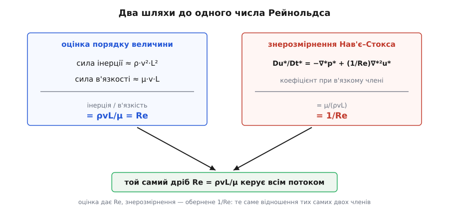

# 🧮 Строге виведення числа Рейнольдса: знерозмірнення Нав'є–Стокса

Оцінка «інерція поділити на в'язкість» дає правильний дріб ρ·v·L/μ — але робить це на пальцях: бере одну представницьку грудку рідини, прикидає дві сили й ділить одну на одну. Лишається законний сумнів. Звідки певність, що це саме ТЕ число, а не одне з кількох рівноправних? Що потоком керує справді воно одне, а не ще пара схованих комбінацій густини, швидкості й розміру? Прикидка порівнює дві величини — вона не доводить, що ціле рівняння руху рідини стискається до одного-єдиного параметра.

Строгий шлях знімає сумнів раз і назавжди. Візьмімо точне рівняння, якому підкоряється кожна частинка рідини, і перепишімо його в чистих числах — так, щоб у ньому не лишилося ні метра, ні секунди, ні кілограма. Тоді число Рейнольдса не «збирають руками» як зручне відношення: воно **випадає само**, як єдиний коефіцієнт, що виживає перед в'язким членом. А це вже не оцінка, а теорема. Два потоки з однаковим Re задовольняють ОДНЕ й те саме рівняння з однаковими крайовими умовами — отже, малюють ОДИН і той самий розв'язок. Динамічна подібність із правдоподібної аналогії перетворюється на доведений факт.

## Рівняння, якому кориться кожна крапля

Уся динаміка нестисливої рідини сталої густини вміщається в один рядок — рівняння Нав'є–Стокса. Це просто другий закон Ньютона, записаний не для тіла, а для нескінченно малого клаптика рідини, на одиницю об'єму:

```
ρ (∂u/∂t + (u·∇)u)  =  −∇p  +  μ ∇²u

u — швидкість (вектор, м/с)      p — тиск (Па)
ρ — густина (кг/м³)              μ — динамічна в'язкість (Па·с)
∇ — градієнт (набла, 1/м)        ∇² — оператор Лапласа (1/м²)
```

Прочитаймо його по-фейнманівськи, член за членом — бо саме з їхніх розмірів народиться Re.

Ліва частина — це **маса × прискорення** на одиницю об'єму. Множник ρ — маса кубика рідини одиничного об'єму. У дужках стоїть прискорення тієї частинки рідини, яку ми стежимо на льоту, — так звана матеріальна похідна. Вона з двох доданків. Перший, ∂u/∂t, — це як швидкість у даній точці простору міняється з часом (нестаціонарність). Другий, (u·∇)u, — тонший і найважливіший: частинка сама себе зносить у місця з іншою швидкістю. Навіть коли картина в цілому застигла в часі, частинка, пливучи, потрапляє то в швидшу, то в повільнішу зону — і тому прискорюється. Цей доданок квадратичний за швидкістю (u помножене на похідну від u), нелінійний — і саме він плодить вихори. Це та сама **інерція**, спільниця безладу з базової статті, тільки записана точно. Про темп зміни як границю — [похідна](topic:math-analysis/derivative).

Права частина — це сили, що діють на кубик. Перша, −∇p, — тиск: рідину штовхає з місць високого тиску в місця низького, у бік найкрутішого спаду тиску (звідси знак мінус і [градієнт](topic:ph-mechanics/pressure)). Друга, μ∇²u, — в'язке тертя. Оператор Лапласа ∇²u вимірює, наскільки швидкість у точці відрізняється від середньої в сусідів; де є така «горбинка» швидкості, в'язкість її розгладжує, перекачуючи імпульс від швидших шарів до повільніших. Множник μ — [в'язкість](topic:ph-mechanics/viscosity), міра цього внутрішнього тертя. Це **в'язкість**, спільниця ладу.

До рівняння руху додається закон збереження маси. Для сталої густини він каже, що рідина нікуди не накопичується й нізвідки не береться — скільки втекло з малого об'єму, стільки й притекло:

```
∇·u = 0        (нестисливість — [дивергенція](topic:math-analysis/divergence) швидкості нульова)
```

Два слова про походження цих рівнянь, бо тут легко змазати внесок. Форму рівняння вперше отримав француз Клод-Луї Нав'є 1822 року — щоправда, з хибних молекулярних міркувань, відштовхуючись від теорії пружних тіл; правильний вигляд він угадав радше попри метод, ніж завдяки йому. На міцну основу суцільного середовища його поставив ірландський математик Джордж Ґабріел Стокс 1845 року, вивівши в'язкі члени строго й підперши їх дослідом. Тому й ім'я подвійне — Нав'є–Стокс. (Це усталений історичний факт.)

## Ідея знерозмірнення: міряти все в мірках самої задачі

Рівняння напхане розмірними величинами — метрами, секундами, паскалями. Але природа не знає ні метра, ні секунди; вона знає лише пропорції. Отже, спробуймо позбутися одиниць зовсім — виміряймо кожну величину не в стандартних мірках, а в тих, що природні саме для ЦІЄЇ задачі.

Що тут природне? Розмір задачі — характерна довжина L (діаметр труби, хорда крила, розмір тіла). Швидкість — характерна v (швидкість набігання). З них двох сам собою складається природний **масштаб часу** L/v — час, за який рідина пробігає повз тіло одну його довжину. А природний масштаб тиску? Ось тут ховається фізика. У швидкому потоці перепади тиску створює інерція: щоб звернути струмінь густини ρ і швидкості v, потрібен тиск порядку ρ·v². Це не випадкова здогадка — це той самий динамічний напір, що виникає скрізь, де інерція рідини впирається в перешкоду; докладніше — [динамічний тиск](topic:ph-mechanics/dynamic-pressure). Тому тиск міряймо в мірках ρ·v².

Тепер уведімо безрозмірні (зі зірочкою) змінні — кожну як «скільки таких мірок»:

```
x* = x / L          — координата в частках характерного розміру
u* = u / v          — швидкість у частках характерної швидкості
t* = t / (L/v)      — час у частках характерного часу
p* = p / (ρv²)      — тиск у частках динамічного напору
```

Зірочкові змінні за побудовою — порядку одиниці: у цікавій нам ділянці x* пробігає від 0 до кількох, u* коливається біля 1, і так далі. Уся розмірність винесена в чотири мірки L, v, L/v, ρv². Лишається підставити ці означення в рівняння й подивитися, що вціліє.

## Підстановка: як 1/Re виринає само

Виразімо старі величини через нові (просто переставивши означення) і, головне, перерахуймо похідні. Похідна по x — це зміна на одиницю довжини; якщо довжину міряти в L, кожне ∇ дає множник 1/L, а ∇² (дві похідні) — множник 1/L². Похідна по часу дає v/L. Зберімо:

```
x  = L·x*        →   ∇   = (1/L) ∇*        →   ∇²  = (1/L²) ∇*²
u  = v·u*        →   ∂/∂t = (v/L) ∂/∂t*
p  = ρv²·p*
```

Тепер прожену кожен член рівняння Нав'є–Стокса крізь ці заміни. Дивімося, який розмірний множник вилазить перед кожним зірочковим (порядку-одиниці) виразом:

```
ρ ∂u/∂t    =  ρ · v · (v/L) · ∂u*/∂t*        =  (ρv²/L) · ∂u*/∂t*
ρ (u·∇)u   =  ρ · v · v · (1/L) · (u*·∇*)u*  =  (ρv²/L) · (u*·∇*)u*
−∇p        =  −(1/L) · ρv² · ∇*p*            =  −(ρv²/L) · ∇*p*
μ ∇²u      =  μ · v · (1/L²) · ∇*²u*         =  (μv/L²) · ∇*²u*
```

Придивімося до множників. Перед трьома членами — інерцією, тиском — стоїть той самий ρv²/L. Перед в'язким членом стоїть інший — μv/L². Оце й уся суть. Зберімо рівняння докупи:

```
(ρv²/L)·[ ∂u*/∂t* + (u*·∇*)u* ]  =  −(ρv²/L)·∇*p*  +  (μv/L²)·∇*²u*
```

І тепер — вирішальний крок. Поділімо все рівняння на спільний інерційний множник ρv²/L. Зліва й перед тиском він скорочується начисто, лишаючи чисті зірочкові члени. А перед в'язким членом лишається відношення двох множників:

```
μv/L²     μv       L        μ          1
──────  = ──── · ──────  = ─────  =  ────
ρv²/L     L²      ρv²      ρvL         Re
```

Ось воно. Ділення розчинило L, v, ρ і μ поодинці — і лишило рівно ОДНУ їхню комбінацію, μ/(ρvL). А це обернене число Рейнольдса. Знерозмірнене рівняння руху набирає вигляду:

```
∂u*/∂t* + (u*·∇*)u*  =  −∇*p*  +  (1/Re) ∇*²u*

∇*·u* = 0            Re = ρvL / μ
```

Зупинімося й усвідомимо, що сталося. У вихідному рівнянні жило чотири окремі фізичні величини — густина, швидкість, розмір, в'язкість. У знерозмірненому не лишилося жодної з них поодинці: усі чотири злилися в один-єдиний безрозмірний коефіцієнт Re, що сидить перед в'язким членом. Рівняння нестисливості й поготів не має жодного параметра. Отже, **увесь розв'язок — усе поле швидкостей і тисків, кожен вихор, точка зриву, форма сліду — залежить рівно від одного числа Re** (та ще від безрозмірної форми межі й крайових умов). Змінюй ρ, v, L, μ як завгодно — доки їхня комбінація ρvL/μ та сама, зірочкове рівняння те саме, тож і зірочковий розв'язок u*(x*, t*), p*(x*, t*) той самий. Оце й є **динамічна подібність**, тепер доведена, а не вгадана: продув зменшеної моделі при тому самому Re дає чесну копію справжнього потоку, яку лишається перерахувати назад у розмір. Про цю логіку моделювання — [подібність і масштабування](topic:ph-mechanics/similarity-scaling).

І звідси випливає ще й практичний висновок про будь-яку безрозмірну характеристику потоку — коефіцієнт опору, число Струхаля зриву вихорів, критичну точку переходу. Раз усе рівняння знає тільки Re, то й будь-яка така величина може залежати тільки від Re (і геометрії) — ні від чого більше. Тому її й малюють однією кривою «величина проти Re», що накриває всі рідини, розміри й швидкості разом. Систематику таких безрозмірних груп постачає [розмірний аналіз](topic:math-numeric/dimensional-analysis).

> 🔧 **Навіщо це.** Коефіцієнт 1/Re — не просто гарний символ; його мализна має грізний фізичний зміст. Для води у крані Re ≈ 15000, тобто 1/Re ≈ 0.00007 — в'язкий член у сотні тисяч разів менший за інерційний майже скрізь. Здавалося б, викинь його — і матимеш ідеальну рідину без тертя. Але викинути найвищу похідну (∇²u — друга похідна) не можна безкарно: тоді нема чим виконати умову «на стінці швидкість нуль». Розв'язок ділиться на дві частини — товщу потоку, де в'язкість справді дарма, і тонкий **пограничний шар** біля стінки, де ∇²u величезне й компенсує крихітне 1/Re. Уся аеродинаміка крила, весь опір тертя, увесь відрив потоку живуть у цьому шарі. Одне число в коефіцієнті наперед каже інженерові, що бій розігрується не в товщі, а в плівці завтовшки з часточку розміру.

## Чому оцінка й строгий вивід дають те саме число

Тепер зведімо два шляхи віч-на-віч. Базова стаття склала Re як відношення двох сил:

```
Re  =  F_інерц / F_в'язк  =  (ρ·v²·L²) / (μ·v·L)  =  ρvL/μ
```

Знерозмірнення дало Re в коефіцієнті 1/Re перед в'язким членом. Це не два числа, що випадково збіглися, — це **той самий дріб, порахований двічі**: один раз нашвидку на одній грудці, другий раз строго на всьому полі. Ось точна відповідність.

Оцінка каже: інерційна сила порядку ρv²L², в'язка — порядку μvL. Придивімося, звідки взялися ці порядки. Інерційний член рівняння — ρ(u·∇)u; його величина порядку ρ·v·(v/L) = ρv²/L (на одиницю об'єму). В'язкий член μ∇²u — порядку μ·v/L² = μv/L². Прикидка «на пальцях» — це рівно оцінка величин цих двох членів. А тепер згадаймо, що зробило знерозмірнення: замінивши u на v·u* і x на L·x*, воно **вбудувало ці самі оцінки в рівняння**. Сказати «u* і x* та їхні похідні порядку одиниці» — це рівно те саме, що сказати «u порядку v, а ∂u/∂x порядку v/L». Тому множник ρv²/L перед інерційним членом і множник μv/L² перед в'язким — це не що інше, як ті самі порядки величин із прикидки, лише винесені акуратно за дужку. А ділення в'язкого множника на інерційний — це буквально те саме відношення двох сил, що його брала оцінка:

```
оцінка:          F_інерц / F_в'язк  =  (ρv²/L) / (μv/L²)  =  ρvL/μ  =  Re
знерозмірнення:  коеф. при в'язк.   =  (μv/L²) / (ρv²/L)  =  μ/ρvL  =  1/Re
```

Обидва рахують ВІДНОШЕННЯ ТИХ САМИХ ДВОХ членів рівняння — оцінка бере його прямо (інерція/в'язкість = Re), знерозмірнення лишає обернене (в'язкість/інерція = 1/Re) як коефіцієнт. Оцінка робить це грубо, на одній представницькій частинці; знерозмірнення — раз і чисто, для всього поля відразу. Ось чому число те саме: воно й є одне число.

Що ж додає строгість понад прикидку? Дві важливі речі. Перша — вона показує, де ховаються всі численні «десь-близько-одиниці» множники, що їх оцінка мовчки ковтає. Вибір характерного L — угода: для труби це діаметр, а міг би бути радіус; від цього Re зміниться вдвічі. У знерозмірненні ця сваволя чесно видна: інші означення L лише перемасштабовують Re на сталий множник, а вся «геометрична решта» сидить у безрозмірному розв'язку й крайових умовах. Саме тому **група ρvL/μ фіксована, а числовий поріг переходу — місцевий**: для труби ≈ 2300, для кулі чи крила інший. Оцінка не могла цього пояснити — строгий вивід пояснює.

Друга річ тонша й найкрасивіша. Ми вибрали міряти тиск у мірках ρv² — бо чекали, що тиск задає інерція. А якби потік був повільний і в'язкий, тиск задавала б не інерція, а саме в'язкість — і природна мірка тиску була б μv/L. Проженімо знерозмірнення з цим вибором (p* = p/(μv/L), решта та сама) і поділімо рівняння на в'язкий множник μv/L². Тоді єдиний коефіцієнт вискакує вже перед ІНШИМ членом:

```
Re · [ ∂u*/∂t* + (u*·∇*)u* ]  =  −∇*p*  +  ∇*²u*
```

Той самий Re, тільки тепер він міряє, наскільки інерція збурює в'язку течію. І ось нагорода: коли Re → 0 (бактерія, мікроканал), лівий бік прямує до нуля — інерція зникає з рівняння зовсім, лишаючи рівняння Стокса −∇*p* + ∇*²u* = 0. Це і є суворий сенс «світу без інерції» з базової статті: не метафора, а член, що формально випав. Отже, обидва знерозмірнення — це два кінці однієї історії, і Re — ручка гучності в обох: при великому Re нехтуємо в'язким членом (майже ідеальна рідина плюс пограничний шар), при малому — інерційним (повзка течія Стокса).

**Приклад (перевірмо числами, вода в крані).** Візьмімо ті самі числа, що й у базовій статті: v = 1 м/с, L = 0.015 м, ρ = 1000 кг/м³, μ = 1×10⁻³ Па·с. Оцінімо величину двох членів рівняння окремо (на одиницю об'єму, Н/м³):

```
інерційний ≈ ρv²/L  = 1000 · 1² / 0.015        ≈ 66700
в'язкий    ≈ μv/L²  = 1×10⁻³ · 1 / 0.015²       ≈ 4.44

відношення = 66700 / 4.44 ≈ 15000 = Re          ✓
1/Re ≈ 0.000067
```

Число сходиться з Re = 15000 із базової статті, а коефіцієнт 1/Re ≈ 6.7×10⁻⁵ прямо каже: у товщі потоку в'язкий член у п'ятнадцять тисяч разів слабший — вода тече майже як ідеальна рідина, лишаючи тертя тонкому шару біля стінки.

**Приклад (той самий рахунок для бактерії).** L = 1×10⁻⁶ м, v = 3×10⁻⁵ м/с, вода:

```
інерційний ≈ ρv²/L  = 1000 · (3×10⁻⁵)² / 1×10⁻⁶   ≈ 0.9
в'язкий    ≈ μv/L²  = 1×10⁻³ · 3×10⁻⁵ / (1×10⁻⁶)²  ≈ 30000

відношення = 0.9 / 30000 = 3×10⁻⁵ = Re            ✓
1/Re ≈ 33000
```

Тут усе навпаки: в'язкий член у тридцять тисяч разів дужчий за інерційний. Коефіцієнт при інерції (у другому знерозмірненні — сам Re ≈ 3×10⁻⁵) мізерний, тож інерційний член сміливо викидаємо — і лишається рівняння Стокса. Це строге підтвердження того, що для бактерії інерції просто немає в рівнянні; вода для неї — чистий в'язкий клей.


*Кожен член рівняння Нав'є–Стокса має свій розмірний масштаб. Інерція й тиск несуть однаковий множник ρv²/L, в'язкість — інший, μv/L². Ділення всього рівняння на спільний ρv²/L лишає перед в'язким членом єдиний коефіцієнт μ/(ρvL) = 1/Re. Так одне число вбирає всю чотиривимірну залежність.*


*Оцінка «на пальцях» бере відношення інерційної сили до в'язкої й дістає Re. Знерозмірнення лишає обернене, 1/Re, коефіцієнтом перед в'язким членом. Обидва шляхи рахують відношення тих самих двох членів рівняння — тому й приходять до однієї безрозмірної групи ρvL/μ.*

## Одне рівняння, один параметр

Строге виведення каже те саме, що й прикидка на пальцях, — але каже це з незрівнянно більшою силою. Прикидка порівнює дві сили й повідомляє рахунок у їхньому двобої. Знерозмірнення доводить, що весь двобій — усе поле течії, до останнього вихору — розігрується за правилами, у яких лишилося рівно одне число. Оцінка дає тобі рахунок матчу; рівняння доводить, що цим рахунком матч і вичерпується.

Одне застереження про межі цієї сили. Ми взяли рідину сталої густини й в'язкості (нестисливу, ньютонівську) без зовнішніх сил — і в цьому світі Re справді єдиний. Впусти в рівняння стисливість — і поряд вигулькне число Маха; додай вільну поверхню під тяжінням — з'явиться число Фруда; зроби потік різко нестаціонарним — вилізе число Струхаля. Кожне з них народжується так само — як коефіцієнт перед своїм членом при знерозмірненні. Але число Рейнольдса особливе тим, що їде разом із в'язким членом, а в'язкість є в будь-якій реальній рідині. Тому, хоч суддів у складнішій задачі буває кілька, Re серед них — незмінний і, як правило, головний. І щоразу воно виринає не з нашої примхи, а з самого рівняння руху — варто лише спитати його чистими числами.
