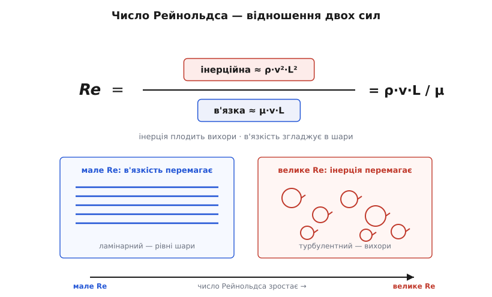
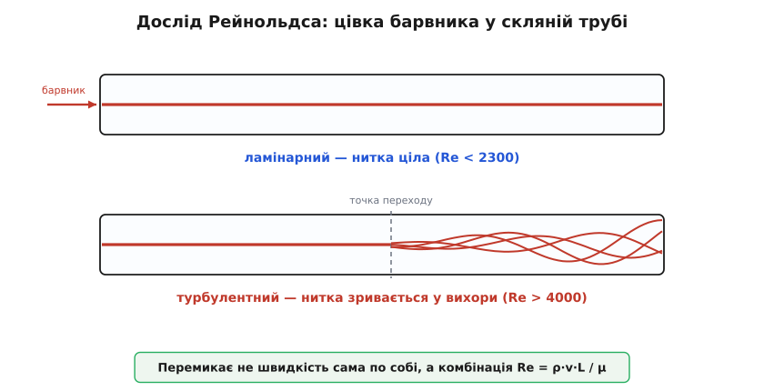
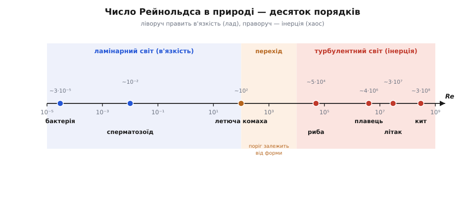

# Число Рейнольдса

<preknowlist>
- [В'язкість](root:ph-mechanics/viscosity) — внутрішнє тертя рідини чи газу: опір, з яким сусідні шари ковзають один повз одного.
- [Густина](root:ph-mechanics/density) — маса, що припадає на одиницю об'єму речовини.
</preknowlist>

Запали свічку в тихій кімнаті й придивися до диму. Перші сантиметри над ґнотом він підіймається рівною, майже скляною ниткою — гладенькою, впорядкованою, наче тонка цівка. А тоді, на певній висоті, нитка раптом здригається, завивається й розсипається на клубки, що безладно крутяться й перемішуються. Нічого ж не змінилося — той самий дим, те саме повітря, та сама кімната. Але потік на очах перескочив з одного стану в геть інший: із плавного, шаруватого — у розірваний на вихори. Що його перемкнуло? І чому саме там, а не на сантиметр нижче?

Уся відповідь ховається в одному-єдиному числі — і воно виявляється тим самим для диму над свічкою, для води в трубі, для крила літака й для бактерії, що вигрібає джгутиком у краплині. Це **число Рейнольдса**. Щоб зрозуміти, звідки воно береться й чому таке всевладне, треба спершу побачити, що будь-яка течія — це безнастанне змагання двох сил.

## Дві сили, що тягнуть у різні боки

Кожен клаптик рідини в потоці намагається робити дві протилежні речі водночас.

Перша сила — **інерція** (лат. *inertia* — бездіяльність, млявість): щойно клаптик рушив, він хоче й далі пертися вперед, проскакувати, зривати з місця сусідів. Саме інерція дає життя вихорам — раз закручений завиток крутиться далі власним розгоном, зачіпає нові порції рідини й породжує нові завитки. Інерція — спільниця безладу.

Друга сила — **в'язкість**, внутрішнє тертя рідини. Сусідні шари чіпляються один за одного й гальмують того, хто вирвався вперед, зрівнюючи швидкості. В'язкість згладжує завитки, розчісує потік у рівні паралельні пасма. В'язкість — спільниця ладу. Це той самий опір зсуву шарів, що робить мед густим, а воду — легкоплинною; докладніше — [в'язкість](root:ph-mechanics/viscosity).

Хто з цих двох переважить, той і задає характер течії. А число Рейнольдса — це просто рахунок у їхньому двобої: **у скільки разів інерція дужча за в'язкість**. Побудуймо цей рахунок із нуля, нічого не приймаючи на віру.

Візьмімо грудку рідини характерного розміру L, що рухається зі швидкістю v, при густині ρ. Оцінімо кожну силу.

**Інерційна сила** — це та сила, яку здатна розвинути маса рідини, розігнана до v (сила, потрібна, щоб її звернути чи спинити). Маса грудки — це густина на об'єм, тобто ρ·L³. Щоб помітно змінити свій рух, грудка мусить розвернутися на відстані порядку L, а на це в неї є час порядку L/v. Отже, її прискорення — порядку v поділити на (L/v), тобто v²/L. Перемножмо:

```
інерційна сила  ≈  маса × прискорення  ≈  ρ·L³ · (v²/L)  =  ρ·v²·L²
```

**В'язка сила** — це тертя між шарами. Дотичне напруження (сила на одиницю площі) від в'язкості — це в'язкість μ, помножена на те, як швидко швидкість міняється впоперек потоку, тобто на v/L. Ця сила діє по поверхні порядку L²:

```
в'язка сила  ≈  напруження × площа  ≈  μ·(v/L) · L²  =  μ·v·L
```

Тепер поділимо одну на одну — і громіздкі L самі скорочуються, лишаючи напрочуд простий дріб:

```
Re  =  інерційна / в'язка  =  (ρ·v²·L²) / (μ·v·L)  =  ρ·v·L / μ
```

Ось і все число Рейнольдса. Воно зібране з чотирьох найпростіших запитань до потоку: наскільки густа рідина, як швидко тече, який завбільшки, наскільки в'язка. І жодних одиниць у відповіді — величина **безрозмірна**, чисте число:

```
Re = ρ·v·L / μ = v·L / ν

ρ — густина (кг/м³)
v — характерна швидкість (м/с)
L — характерний розмір (м)
μ — динамічна в'язкість (Па·с)
ν = μ/ρ — кінематична в'язкість (м²/с)
```

Що воно безрозмірне — не випадковість, а суть. Перевірмо, підставивши, що паскаль-секунда Па·с = кг/(м·с):

```
[ρ·v·L / μ] = (кг/м³)·(м/с)·(м) / (кг/(м·с)) = (кг/(м·с)) / (кг/(м·с)) = 1   ✓
```

Усі одиниці скоротилися начисто. А безрозмірність означає, що Re не прив'язане ні до метра, ні до секунди — це властивість самого потоку, однакова хоч у краплі, хоч в океані. Саме тому одне число вміє говорити про такі різні речі. Часто зручніша права форма з **кінематичною в'язкістю** ν = μ/ρ — вона одразу поєднує густину й в'язкість в одну властивість рідини (для води ν ≈ 10⁻⁶ м²/с, для повітря ≈ 1.5×10⁻⁵ м²/с). Те, як Re виринає строго — з рівнянь руху рідини, коли їх звести до безрозмірного вигляду, — показано окремо: [виведення числа Рейнольдса](root:ph-mechanics/reynolds-number/math-reynolds-derivation.md).


*Течія — це двобій інерції (ρ·v²·L², що плодить вихори) і в'язкості (μ·v·L, що згладжує їх у шари). Число Рейнольдса — відношення цих сил. Мале Re: в'язкість переважує, потік шаруватий. Велике Re: інерція бере гору, потік зривається у вихори.*

> 🔧 **Навіщо це.** Перш ніж рахувати щось складне про потік, інженер рахує Re — бо це число одним махом каже, у якому світі він працює. Насос, що жене воду трубою, «побачить» зовсім різний опір за ламінарного й турбулентного режиму: втрати тиску відрізняються в рази. Хімічний змішувач за малого Re взагалі не перемішає реагенти — там нема вихорів, лишається кволе дифундування. Канал охолодження за великого Re відводить тепло чудово, а за малого — ледь-ледь. Одне число визначає режим, а режим тягне за собою все інше, тож із нього й починають.

## Що число каже про потік

Тепер прочитаймо два полюси цього дробу.

Коли Re **мале** (в'язкість переважує), потік **ламінарний** (лат. *lamina* — пластинка, шар): рідина тече впорядкованими паралельними шарами, що ковзають один повз одного, не змішуючись. Пусти в такий потік цівку барвника — вона протягнеться рівною ниткою від початку до кінця. Усе гладко, передбачувано, майже оборотно.

Коли Re **велике** (інерція бере гору), потік **турбулентний** (лат. *turbulentus* — бурхливий, неспокійний): він розпадається на юрму вихорів усіх розмірів, які безладно крутяться, наскакують один на одного й люто перемішують рідину. Ниточка барвника тут-таки лопається й розмазується по всьому перерізу.

А між цими полюсами лежить **перехідна** смуга, де потік мовби не може визначитися: він миготить, зриваючись то в спокій, то в хаос, і назад.

Саме це 1883 року побачив на власні очі британо-ірландський інженер Осборн Рейнольдс. Він пускав тонку цівку барвника в потік води всередині скляної труби й повільно відкривав кран. За малої швидкості барвник тягнувся рівною ниткою; за більшої — на певній точці нитка раптово вибухала й розпливалася. І головне, що він виснував: перемикання залежить не від самої лише швидкості, а від тієї-таки комбінації ρ·v·L/μ. Подвоїш діаметр труби, а швидкість удвічі зменшиш — Re те саме, і потік поводиться так само. Уся [історія цього досліду](root:ph-mechanics/reynolds-number/hist-reynolds-experiment.md) — від здогаду Стокса до того, як число врешті назвали Рейнольдсовим, — варта окремої розповіді.

Для труби межі виходять такі:

```
потік усередині круглої труби:
Re < ~2300      — ламінарний  (гладкий, шаруватий)
~2300 … ~4000   — перехідний  (миготить)
Re > ~4000      — турбулентний (вихровий)
```

Важливе застереження: ці числа — саме **для труби**. Куля, крило, відкритий канал, зерня в потоці — кожне має свій поріг переходу, бо «характерний розмір» і геометрія в них інші. Універсальне тут не конкретне значення 2300, а сам принцип: є критичне Re, нижче якого лад, вище якого хаос. Саме число — спільна мова, а поріг — місцевий діалект.

**Приклад (вода в домашній трубі).** Холодна вода тече крізь трубу діаметром d = 15 мм зі швидкістю v = 1 м/с. Ламінарна вона чи турбулентна? Беремо ρ = 1000 кг/м³, μ = 1×10⁻³ Па·с, за характерний розмір — діаметр труби:

```
Re = ρ·v·d / μ
   = 1000 · 1 · 0.015 / (1×10⁻³)
   = 15 / (1×10⁻³)
   = 15000
```

15000 — це далеко за порогом 4000, тож вода у вашому крані тече **турбулентно**, з вихорами. Ось чому вона так гучно шумить і так добре перемішується: буденний водогін живе у турбулентному світі. Щоб та сама труба потекла ламінарно, воду довелося б сповільнити разів у сім. Аби не рахувати це щоразу вручну — для будь-якої рідини, розміру й швидкості визначити режим і одразу оцінити втрати тиску в трубі — придасться [невеликий калькулятор Re й режиму](root:ph-mechanics/reynolds-number/proj-reynolds-regime.md).


*Дослід Рейнольдса. Зверху (мале Re): цівка барвника тягнеться рівною ниткою — потік ламінарний. Знизу (велике Re): за критичною точкою нитка вибухає й розпливається вихорами — потік турбулентний. Перемикання визначає не швидкість сама по собі, а комбінація ρ·v·L/μ.*

Ламінарна течія в трубі має ще й гарну впорядковану будову — профіль швидкості виходить параболічним, з максимумом посередині; це [течія Пуазейля](root:ph-mechanics/poiseuille-flow).

## Одне число — однакова течія

Ось найглибший наслідок безрозмірності. Оскільки Re вбирає в себе весь баланс сил і не залежить від одиниць, **два потоки з однаковим Re малюють однакову картину** — байдуже, наскільки різні вони за розміром, швидкістю чи навіть рідиною. Ті самі вихори, той самий безрозмірний коефіцієнт опору, та сама форма сліду за тілом — лише в різному масштабі. Природа не знає абсолютного розміру чи швидкості; вона знає тільки відношення Re.

Це і є **динамічна подібність** — і саме на ній тримається вся інженерна практика випробувань на моделях. Не можна збудувати справжній літак «просто спробувати», зате можна продути в трубі його зменшену копію — і якщо підібрати умови так, щоб Re моделі збіглося з Re справжнього польоту, потік навколо моделі буде чесною копією справжнього, яку лишається перерахувати назад у повний розмір. Докладніше про цю логіку — [подібність і масштабування](root:ph-mechanics/similarity-scaling).

Число Рейнольдса — головний, але не єдиний такий безрозмірний суддя; систематично їх постачає [розмірний аналіз](root:math-numeric/dimensional-analysis), який показує, що складну задачу завжди можна переписати через жменьку безрозмірних груп. І ось у чому практична вигода: коли ти знаєш, що якась величина залежить від швидкості, розміру й в'язкості **лише через Re**, тобі більше не треба окремої відповіді на кожну їхню комбінацію. Одна крива «величина проти Re» накриває всі рідини, всі розміри й усі швидкості разом. Саме так, наприклад, будують [коефіцієнт аеродинамічного опору](root:ph-mechanics/aerodynamic-drag) — не таблицею на кожен випадок, а однією залежністю від Re.

> 🔧 **Навіщо це.** На цьому стоїть уся аеро- й гідродинамічна перевірка: продувка моделі авто чи літака в трубі, буксирування моделі корабля в басейні, валідація комп'ютерних симуляцій потоку. Інженер свідомо підганяє умови досліду так, щоб критичне безрозмірне число збіглося з реальним, — інакше гарні на вигляд дані з труби нічого не скажуть про справжній політ. І навпаки: якщо Re не збігається, маленька модель бреше. Тому «чи однакове Re?» — перше питання перед будь-яким модельним випробуванням.

## Світ, де немає інерції

Найяскравіше Re показує себе на межах. Для нас, великих і швидких, воно велетенське: людина, що пливе басейном, живе при Re близько мільйона — інерція панує безроздільно. Тому ми можемо **котитися**: відштовхнувся від бортика — і ковзаєш далі, вода несе. А тепер зменшмо плавця до бактерії й погляньмо, що станеться.

**Приклад (бактерія у воді).** Клітина розміром L ≈ 1 мкм = 1×10⁻⁶ м пливе зі швидкістю v ≈ 30 мкм/с = 3×10⁻⁵ м/с у воді:

```
Re = ρ·v·L / μ
   = 1000 · 3×10⁻⁵ · 1×10⁻⁶ / (1×10⁻³)
   = 3×10⁻⁵
```

Re ≈ 0.00003 — інерція мізерна, в'язкість абсолютна. І наслідки цього приголомшливі. Якщо бактерія перестане махати джгутиком, вона спиниться **миттєво** — за час близько мікросекунди, проїхавши менше, ніж завширшки атом. Жодного ковзання: вода для неї — не вода, а густий клей, густіший за будь-який мед у нашому досвіді. У цьому світі не розганяються й не гальмують — рух є рівно доти, доки триває зусилля.

Ба більше, у цьому світі не спрацьовує звичне махання туди-сюди. За такого малого Re потік майже цілком оборотний: симетричний гребок (розкрив — стулив, як мушля-гребінець) уперед просуне рівно настільки ж, наскільки назад поверне назад, і сумарно — нікуди. Це відоме як «теорема гребінця», яку сформулював американський фізик Едвард Перселл у славетній лекції «Життя за малого числа Рейнольдса» (1977). Саме тому бактерії плавають не веслами, а обертовими джгутиками-штопорами або гнучкими хвилястими хвостиками — несиметричними рухами, які не скасовують самі себе. Число Рейнольдса тут не абстракція: воно буквально визначає, що взагалі означає «плисти» у твоєму світі.


*Число Рейнольдса в природі й техніці охоплює десяток порядків. Ліворуч — світ в'язкості (бактерія, сперматозоїд): усе ламінарне, інерції немає. Праворуч — світ інерції (плавець, автомобіль, літак, кит): усе турбулентне. Той самий об'єкт у різних масштабах чи швидкостях живе за різними правилами.*

> 🔧 **Навіщо це.** Цим світом малого Re живе вся мікрофлюїдика — «лабораторія на чипі», де рідину ганяють каналами завтовшки з волосину. Там Re завжди крихітне, вихорів нема, і два потоки, зведені разом, **не перемішуються самі** — течуть пліч-о-пліч і лише повільно дифундують крізь спільну межу. Тому мікрозмішувачі доводиться хитромудро конструювати (зигзаги, перешкоди), а мікророботи не можуть котитися по інерції й потребують несиметричного руху, як бактерія. Не врахуєш мализну Re — і чип не працюватиме так, як підказує «велика» інтуїція.

## Одне число, цілі світи

Число Рейнольдса — це єдиний безрозмірний вирок над потоком: хто тут головний, інерція чи тертя? І, змінивши саме лише це відношення, ти міняєш геть усе — від скляної нитки диму до кипучого клубка, від плавця, що ковзає з розгону, до бактерії, приклеєної до місця. Дивовижа не в самій формулі ρ·v·L/μ — вона проста, — а в тому, що одне число, зібране з густини, швидкості, розміру й в'язкості, стискає в себе поведінку всіх рідин і газів на всіх масштабах. Природа не має власної лінійки й власного годинника абсолютних значень; вона знає лише пропорції — і Re з них найголовніша.
