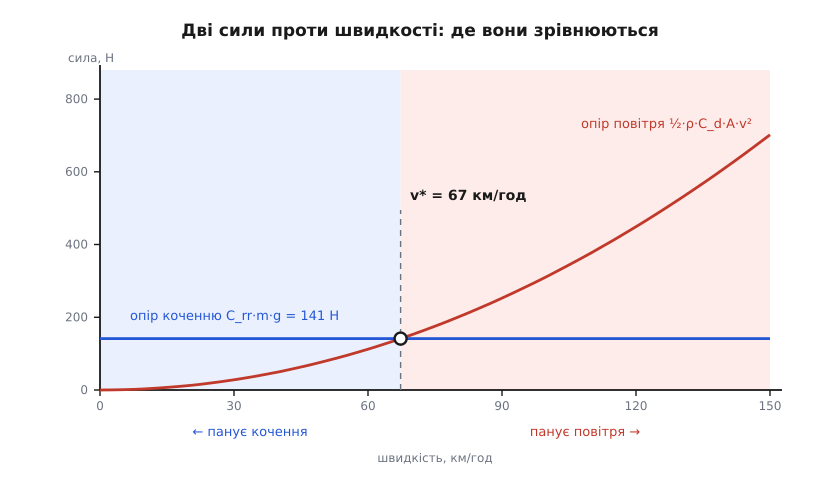
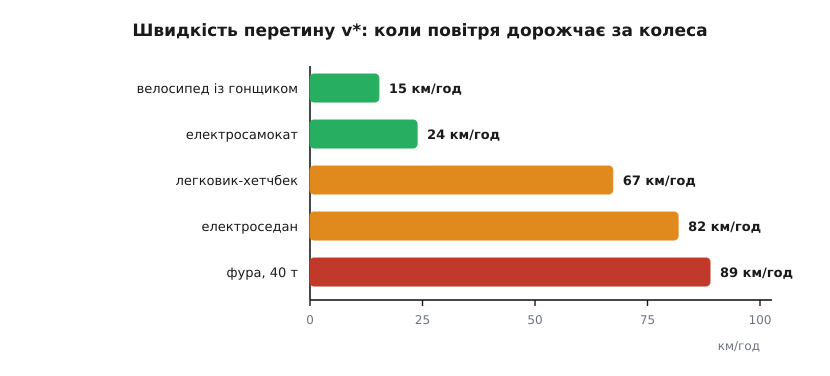

# ⚙️ Де повітря дорожчає за колеса: рахуємо швидкість перетину

<preknowlist>
- [Аеродинамічний опір](topic:ph-mechanics/aerodynamic-drag) — сила, з якою повітря спротивляється рухові: F = ½·ρ·C_d·A·v², де ρ — густина повітря, A — лобова площа, C_d — коефіцієнт форми. Головне тут: вона росте як квадрат швидкості.
- [Механічна робота](topic:ph-mechanics/work) — сила, помножена на пройдений уздовж неї шлях. Звідси ньютон дорівнює джоулю на метр, тож будь-яка сила опору читається ще й як витрата енергії на кожен метр дороги.
- [Потужність](topic:ph-mechanics/power) — робота за одиницю часу, P = F·v; через неї сила опору перетворюється на кіловати під педаллю.
- [Двійковий пошук](topic:sf-algorithms/binary-search) — половина відрізка відкидається за однією перевіркою. Чисельний варіант розв'язку — це він, тільки відрізок неперервний: ділимо навпіл діапазон швидкостей.
</preknowlist>

Дві сили гальмують усе, що котиться дорогою, і залежать вони від швидкості протилежно: опір коченню її майже не помічає, опір повітря росте як її квадрат. Отже, існує рівно одна швидкість, на якій вони зрівнюються, — і саме вона коротко відповідає на дуже практичне запитання: у що вкладати гроші й зусилля, у шини чи в обтічність. Порахувати її — три рядки арифметики. Прочитати відповідь правильно значно важче, бо це число гуляє від вітру, морозу й ухилу дужче, ніж від самої машини.

## Задача: два доданки, одна невідома

Сила, потрібна, щоб котити машину рівномірно, складається з двох доданків, і кожен має свою залежність від швидкості:

```
F_кочення = C_rr · m · g              — від v майже не залежить
F_повітря = ½ · ρ · C_d · A · v²      — росте як квадрат v
```

Перший тримається сталим, бо його джерело — деформація шини під навантаженням: скільки ваги на колесі, стільки й м'ятиметься гума за оберт, байдуже, прудко чи поволі. Другий росте квадратично, бо тіло щосекунди мусить розштовхати тим більше повітря, чим швидше летить, і надати йому тим більшої швидкості.

Швидкість перетину v\* — та, на якій два вирази дорівнюють один одному. Прирівнюємо й розв'язуємо щодо v:

```
C_rr · m · g = ½ · ρ · C_d · A · v*²

v* = √( 2 · C_rr · m · g / (ρ · C_d · A) )
```

**Хетчбек на асфальті.** Маса m = 1200 кг, коефіцієнт опору коченню C_rr = 0.012, коефіцієнт форми C_d = 0.30, лобова площа A = 2.2 м², густина повітря ρ = 1.225 кг/м³.

```
C_rr · m · g   = 0.012 · 1200 · 9.81 = 141.3 Н
½ · ρ · C_d·A  = 0.5 · 1.225 · 0.66  = 0.4043 Н·с²/м²
v*²            = 141.3 / 0.4043      = 349.5 м²/с²
v*             = 18.69 м/с           = 67.3 км/год
```

Шістдесят сім кілометрів на годину — і на цій швидкості кожна з двох сил тягне рівно по 141 ньютону, а разом вони з'їдають 5.3 кВт. Але цікаве починається, коли ту саму рівність підставити назад у відношення двох сил. Знаменник за означенням v\* дорівнює ½·ρ·C_d·A·v\*², тож усе, крім швидкостей, скорочується:

```
F_повітря / F_кочення = (v / v*)²
```

Ось де ховається справжня цінність цього числа. Уся задача з її п'ятьма параметрами стиснулася до однієї величини: знаєш v\* — знаєш співвідношення сил на будь-якій швидкості, бо воно дорівнює просто квадратові відносної швидкості. Удвічі повільніше за перетин — повітря коштує вчетверо менше за кочення. Удвічі швидше — вчетверо більше. Для нашого хетчбека на міських 30 км/год шини дорожчі за повітря вп'ятеро, а на трасових 120 усе перевертається: повітря дорожче втричі.


*Пряма й парабола перетинаються рівно один раз — тому «хто дорожчий» має однозначну відповідь у вигляді єдиного числа. Ліворуч від v\* кожен зайвий ньютон найдешевше знімати з шин, праворуч — із кузова.*

> 🔧 **Навіщо це.** Оскільки ньютон — це джоуль на метр, крива сили водночас є кривою витрати енергії на кілометр, а множення обох доданків на v (перехід до потужності) відношення не міняє. Тому v\* — та сама межа й для сили, і для потужності, і для палива на сотню: одна перевірка «швидше чи повільніше за v\*» відразу каже, що саме дасть віддачу — низькогістерезисні шини й вища накачка чи обтічники, закриті ґратки й прилизане днище.

## Чому це число майже однакове у всіх машин

Розкладімо формулу на дві частини — те, що залежить від середовища, і те, що залежить від машини:

```
v* = √(2·g/ρ) · √( C_rr · m / (C_d·A) )
```

Друга дужка й вирішує все. У ній маса ділиться на «аеродинамічний переріз» C_d·A — тобто питання стоїть так: скільки кілограмів припадає на одиницю площі, якою машина ловить повітря. Важка й прилизана перетинає межу пізно, легка й розчепірена — рано. Велосипед із гонщиком має 85 кг на C_d·A ≈ 0.30 м², хетчбек — 1200 кг на 0.66 м². Переріз у хетчбека більший удвічі, зате маса — у чотирнадцять разів, та ще й C_rr утричі більший; разом дужка розходиться майже вдвадцятеро.

А далі за роботу береться корінь і стискає цей розрив удвічі: назовні виходить різниця в чотири з лишком рази, 15 проти 67 км/год. Тому й будь-яка спроба зрушити межу навмисне така невдячна: щоб підняти v\* лише на десяту частину, треба або збільшити C_rr на 21 %, або зрізати C_d·A на 17 %. Саме через це всі легковики, попри всю різницю в масі, шинах і кузовах, тісняться у вузькій смузі 65–90 км/год.


*П'ять машин, у яких маса різниться в п'ятсот разів, укладаються всього в шестикратний розкид перетину — це робота кореня. Велосипедист живе за межею майже завжди, фура підходить до неї рівно на своїй крейсерській швидкості.*

## Робочий код

Задача суто арифметична, і головне в ній не швидкодія, а зручність підставляти свої числа й одразу бачити наслідок, — тож пишемо мовами, якими такий калькулятор читається як формула. Обидві версії дають однакові цифри до останнього знака.

:::tabs
```python
import math

G   = 9.81      # м/с², прискорення вільного падіння
RHO = 1.225     # кг/м³, повітря за 15 °C і 101.3 кПа


def crossover_speed(m, c_rr, cd_a, rho=RHO):
    """Швидкість (м/с), на якій опір повітря зрівнюється з опором коченню."""
    return math.sqrt(2.0 * c_rr * m * G / (rho * cd_a))


def aero_share(v, v_star):
    """Частка повітря в повному опорі на швидкості v (м/с)."""
    r = (v / v_star) ** 2          # F_повітря / F_кочення
    return r / (1.0 + r)


def crossover_speed_var(m, c0, c1, c2, cd_a, rho=RHO):
    """Те саме, але C_rr(v) = c0 + c1·v + c2·v² (форма моделі SAE J2452).
    None означає, що перетину немає взагалі: кочення дорожчає не повільніше."""
    a = 0.5 * rho * cd_a - c2 * m * G      # спільний коефіцієнт при v²
    if a <= 0.0:
        return None
    b = -c1 * m * G
    c = -c0 * m * G
    return (-b + math.sqrt(b * b - 4.0 * a * c)) / (2.0 * a)


def crossover_speed_num(m, c_rr_fn, cd_a, rho=RHO, v_hi=120.0):
    """Загальний випадок: C_rr задано довільною функцією швидкості.
    Ділимо відрізок навпіл за знаком різниці «повітря мінус кочення»."""
    def gap(v):
        return 0.5 * rho * cd_a * v * v - c_rr_fn(v) * m * G
    if gap(v_hi) <= 0.0:
        return None
    lo, hi = 0.0, v_hi                     # gap(0) < 0, gap(v_hi) > 0
    for _ in range(60):
        mid = 0.5 * (lo + hi)
        if gap(mid) > 0.0:
            hi = mid
        else:
            lo = mid
    return 0.5 * (lo + hi)


def crossover_ground_speed(m, c_rr, cd_a, headwind=0.0, grade=0.0, rho=RHO):
    """Швидкість відносно ДОРОГИ з поправкою на зустрічний вітер і ухил."""
    theta = math.atan(grade)
    c_eff = c_rr * math.cos(theta) + math.sin(theta)
    return crossover_speed(m, c_eff, cd_a, rho) - headwind


def air_density(t_c, p_pa=101325.0):
    """ρ = p/(R·T), R = 287.05 Дж/(кг·К) для сухого повітря."""
    return p_pa / (287.05 * (t_c + 273.15))


FLEET = [
    # назва                   маса, кг   C_rr    C_d·A, м²
    ("велосипед із гонщиком",       85,  0.0040,  0.30),
    ("електросамокат",             100,  0.0150,  0.55),
    ("легковик-хетчбек",          1200,  0.0120,  0.66),
    ("електроседан",              1900,  0.0090,  0.53),
    ("фура, 40 т",               40000,  0.0060,  6.30),
]

for name, m, c_rr, cd_a in FLEET:
    v_star = crossover_speed(m, c_rr, cd_a)
    print("%-22s v* = %5.1f км/год   на 90 км/год повітря дає %4.1f %%"
          % (name, v_star * 3.6, 100.0 * aero_share(90 / 3.6, v_star)))

m, c_rr, cd_a = 1200, 0.012, 0.66
rho_cold = air_density(-10)
c_rr_v = lambda v: 0.0105 + 4.0e-6 * v * v      # v у м/с


def show(label, v_star):
    print("  %-28s %s" % (label, "—" if v_star is None
                          else "%5.1f км/год" % (v_star * 3.6)))


print()
print("той самий хетчбек, різні умови:")
show("рівна дорога, безвітря", crossover_speed(m, c_rr, cd_a))
show("зустрічний вітер 5 м/с", crossover_ground_speed(m, c_rr, cd_a, headwind=5.0))
show("підйом 3 %", crossover_ground_speed(m, c_rr, cd_a, grade=0.03))
show("мороз −10 °C (ρ = %.3f)" % rho_cold, crossover_speed(m, c_rr, cd_a, rho_cold))
show("C_rr = 0.0105 + 4e−6·v²", crossover_speed_var(m, 0.0105, 0.0, 4.0e-6, cd_a))
show("те саме половинним поділом", crossover_speed_num(m, c_rr_v, cd_a))
show("а якби c₂ = 4e−5", crossover_speed_var(m, 0.0105, 0.0, 4.0e-5, cd_a))
```
```ts
const G = 9.81;              // м/с², прискорення вільного падіння
const RHO = 1.225;           // кг/м³, повітря за 15 °C і 101.3 кПа

interface Vehicle {
  name: string;
  mass: number;   // кг
  cRR: number;    // безрозмірний коефіцієнт опору коченню
  cdA: number;    // C_d·A — «аеродинамічний переріз», м²
}

/** Швидкість (м/с), на якій опір повітря зрівнюється з опором коченню. */
function crossoverSpeed(m: number, cRR: number, cdA: number, rho = RHO): number {
  return Math.sqrt((2 * cRR * m * G) / (rho * cdA));
}

/** Частка повітря в повному опорі на швидкості v (м/с). */
function aeroShare(v: number, vStar: number): number {
  const ratio = (v / vStar) ** 2;            // F_повітря / F_кочення
  return ratio / (1 + ratio);
}

/** C_rr(v) = c0 + c1·v + c2·v² (форма моделі SAE J2452).
 *  null — перетину немає взагалі: кочення дорожчає не повільніше. */
function crossoverSpeedVar(
  m: number, c0: number, c1: number, c2: number, cdA: number, rho = RHO,
): number | null {
  const a = 0.5 * rho * cdA - c2 * m * G;    // спільний коефіцієнт при v²
  if (a <= 0) return null;
  const b = -c1 * m * G;
  const c = -c0 * m * G;
  return (-b + Math.sqrt(b * b - 4 * a * c)) / (2 * a);
}

/** Загальний випадок: C_rr — довільна функція швидкості; ділимо навпіл. */
function crossoverSpeedNum(
  m: number, cRRof: (v: number) => number, cdA: number, rho = RHO, vHi = 120,
): number | null {
  const gap = (v: number) => 0.5 * rho * cdA * v * v - cRRof(v) * m * G;
  if (gap(vHi) <= 0) return null;
  let lo = 0, hi = vHi;                      // gap(0) < 0, gap(vHi) > 0
  for (let i = 0; i < 60; i++) {
    const mid = (lo + hi) / 2;
    if (gap(mid) > 0) hi = mid; else lo = mid;
  }
  return (lo + hi) / 2;
}

/** Швидкість відносно ДОРОГИ з поправкою на зустрічний вітер і ухил. */
function crossoverGroundSpeed(
  m: number, cRR: number, cdA: number, headwind = 0, grade = 0, rho = RHO,
): number {
  const theta = Math.atan(grade);
  const cEff = cRR * Math.cos(theta) + Math.sin(theta);
  return crossoverSpeed(m, cEff, cdA, rho) - headwind;
}

/** ρ = p/(R·T), R = 287.05 Дж/(кг·К) для сухого повітря. */
function airDensity(tC: number, pPa = 101325): number {
  return pPa / (287.05 * (tC + 273.15));
}

const FLEET: Vehicle[] = [
  { name: "велосипед із гонщиком", mass: 85,    cRR: 0.0040, cdA: 0.30 },
  { name: "електросамокат",        mass: 100,   cRR: 0.0150, cdA: 0.55 },
  { name: "легковик-хетчбек",      mass: 1200,  cRR: 0.0120, cdA: 0.66 },
  { name: "електроседан",          mass: 1900,  cRR: 0.0090, cdA: 0.53 },
  { name: "фура, 40 т",            mass: 40000, cRR: 0.0060, cdA: 6.30 },
];

for (const { name, mass, cRR, cdA } of FLEET) {
  const vStar = crossoverSpeed(mass, cRR, cdA);
  console.log(
    `${name.padEnd(22)} v* = ${(vStar * 3.6).toFixed(1).padStart(5)} км/год` +
    `   на 90 км/год повітря дає ${(100 * aeroShare(90 / 3.6, vStar)).toFixed(1).padStart(4)} %`,
  );
}

const m = 1200, cRR = 0.012, cdA = 0.66;
const rhoCold = airDensity(-10);
const cRRof = (v: number) => 0.0105 + 4e-6 * v * v;   // v у м/с

const show = (label: string, vStar: number | null) =>
  console.log("  " + label.padEnd(28) +
    (vStar === null ? "—" : `${(vStar * 3.6).toFixed(1).padStart(5)} км/год`));

console.log("\nтой самий хетчбек, різні умови:");
show("рівна дорога, безвітря", crossoverSpeed(m, cRR, cdA));
show("зустрічний вітер 5 м/с", crossoverGroundSpeed(m, cRR, cdA, 5));
show("підйом 3 %", crossoverGroundSpeed(m, cRR, cdA, 0, 0.03));
show(`мороз −10 °C (ρ = ${rhoCold.toFixed(3)})`, crossoverSpeed(m, cRR, cdA, rhoCold));
show("C_rr = 0.0105 + 4e−6·v²", crossoverSpeedVar(m, 0.0105, 0, 4e-6, cdA));
show("те саме половинним поділом", crossoverSpeedNum(m, cRRof, cdA));
show("а якби c₂ = 4e−5", crossoverSpeedVar(m, 0.0105, 0, 4e-5, cdA));
```
:::

Що друкується:

```
велосипед із гонщиком  v* =  15.3 км/год   на 90 км/год повітря дає 97.2 %
електросамокат         v* =  23.8 км/год   на 90 км/год повітря дає 93.5 %
легковик-хетчбек       v* =  67.3 км/год   на 90 км/год повітря дає 64.1 %
електроседан           v* =  81.8 км/год   на 90 км/год повітря дає 54.7 %
фура, 40 т             v* =  88.9 км/год   на 90 км/год повітря дає 50.6 %

той самий хетчбек, різні умови:
  рівна дорога, безвітря        67.3 км/год
  зустрічний вітер 5 м/с        49.3 км/год
  підйом 3 %                   125.9 км/год
  мороз −10 °C (ρ = 1.341)      64.3 км/год
  C_rr = 0.0105 + 4e−6·v²       67.0 км/год
  те саме половинним поділом    67.0 км/год
  а якби c₂ = 4e−5             —
```

Ці числа підтверджують, що межа — властивість не дороги, а машини. Велосипедист живе за нею завжди: уже на 30 км/год чотири п'ятих його зусиль ідуть на повітря, тому в гонках воюють за посадку, а не за шини. Електросамокат зі своїми дозволеними 25 км/год якраз упирається у власний перетин. А фура на крейсерських 90 км/год ділить дорожній опір майже точно навпіл — і саме тому на ній однаково окупаються обтічники над кабіною, бокові щити причепа й низькогістерезисні шини: на цій швидкості жоден із двох боків не має переваги.

## Складність і пастки

Арифметика тут задарма: замкнена формула — це один корінь, а половинний поділ за 60 кроків стискає відрізок у 10¹⁸ разів, тобто впирається в точність самих чисел задовго до того, як устигне коштувати щось помітне. Уся ціна задачі — у параметрах, і кожен із них ховає пастку.

**C_rr не стала.** Гума гріється й гнеться тим інтенсивніше, чим частіше проминається пляма дотику, тож коефіцієнт опору коченню поволі росте зі швидкістю. Стандарт SAE J2452, за яким шину міряють на вибігу (англ. *coastdown* — розгін і вільне котіння з записом уповільнення), описує це залежністю виду P^α·Z^β·(a + b·v + c·v²), де P — тиск у шині, Z — навантаження. Придивися до останнього доданка: c·v² має точнісінько ту саму форму, що й опір повітря. У балансі він просто віднімається від аеродинамічного коефіцієнта — тому `crossover_speed_var` і рахує спільний множник при v² як `0.5·ρ·C_d·A − c₂·m·g`. Наслідок буденний: реалістичне c₂ ≈ 4·10⁻⁶ с²/м² зсуває межу на кілька відсотків. Наслідок структурний різкіший: якщо c₂·m·g доросте до ½·ρ·C_d·A, спільний множник обернеться на нуль, і перетину не стане взагалі — кочення дорожчатиме не повільніше за повітря на будь-якій швидкості. Для хетчбека цей поріг лежить коло 3.4·10⁻⁵, увосьмеро вище за реальне значення, — тому останній рядок виводу з навмисно завищеним c₂ і повертає прочерк замість числа.

**Повітря не стандартне.** У формулу входить густина, а вона не стала, а величина, яку диктує [рівняння стану газу](topic:ph-thermodynamics/ideal-gas-law): ρ = p/(R·T), де R = 287.05 Дж/(кг·К) для сухого повітря. Морозного січневого ранку, за −10 °C, повітря майже на десяту частину густіше за стандартне, і межа сповзає з 67.3 до 64.3 км/год; на перевалі, де тиск нижчий, вона, навпаки, підіймається. Кілька відсотків — небагато, але вони пояснюють, чому взимку витрата на трасі росте не лише через холодне мастило.

**Вітер міряється не спідометром.** Повітря знає тільки свою відносну швидкість, а не показ приладу. Прирівнявши ½·ρ·C_d·A·(v + w)² до сталого доданка, дістаємо просте правило: перетин по спідометру дорівнює v\* − w, тобто зустрічний вітер просто віднімається від межі. П'ять метрів за секунду — і хетчбек перетинає її вже на 49 км/год, тобто в місті. Від'ємний результат теж має сенс, і читати його треба буквально: на такому вітрі повітря дорожче за кочення на будь-якій швидкості, включно зі стоянням на місці.

**Ухил підмішується до C_rr.** На підйомі до сталого доданка додається складова ваги вздовж дороги, m·g·sin θ, — а це в балансі те саме, що збільшити коефіцієнт опору коченню на sin θ. Три відсотки ухилу дають 0.030, у два з половиною рази більше за власні 0.012 шини, і межа відлітає на 126 км/год. Тобто на будь-якому пристойному підйомі машина взагалі не виходить в «аеродинамічний» режим: там воюють із земним тяжінням, а обтічність не важить майже нічого.

**Перетин — не найекономніша швидкість.** Спокуса прочитати v\* як «оптимум» велика, а висновок хибний. Сума двох доданків росте монотонно, тож із погляду самого лише опору повільніше завжди дешевше на кілометр. Але машина витрачає ще й сталу потужність на стороннє — обігрів, світло, холостий хід двигуна, — а вона ділиться на швидкість, тому дуже повільна їзда знову дорожчає. Мінімум витрати на кілометр сидить помітно нижче за v\*, і шукати його треба окремо: перетин відповідає не на питання «як швидко їхати», а на питання «що покращувати».

**Звідки взагалі беруться C_rr і C_d·A.** Для готової машини їх не вимірюють нарізно: її розганяють, пускають котитися вільно, записують уповільнення й підганяють до нього [методом найменших квадратів](topic:math-probability/least-squares) параболу повного дорожнього опору F₀ + F₁·v + F₂·v². Далі F₀ оголошують коченням, F₂ — повітрям. Але жоден вибіг не вміє відрізнити ньютон, що народився в гумі, від ньютона, що народився в сліді за кузовом: поділ на «шини» й «аеродинаміку» — умовність підгонки, а не результат вимірювання. Іноді ця умовність відверто ламається. Залізниця тому й досі рахує опір за формулою, яку 1926 року запропонував інженер компанії General Electric В. Дж. Девіс-молодший (*The Tractive Resistance of Electric Locomotives and Cars*, «General Electric Review», т. XXIX, № 10): R = A + B·v + C·v², де середній лінійний доданок узагалі не має чистого фізичного двійника, а «аеродинамічний» C залежить від кількості вагонів і щілин між ними, тож жодного одного C_d·A у півторакілометрового поїзда немає. За оглядовими даними, у вантажних потягів вище приблизно 115 км/год повітря дає вже 75–80 % опору — а це відповідало б перетину десь коло 60 км/год, і то попри мізерний опір коченню сталі по сталі. Коли модель із двох доданків перестає описувати машину, чесніше міряти повний дорожній опір і не вдавати, що знаєш, як він поділений.
