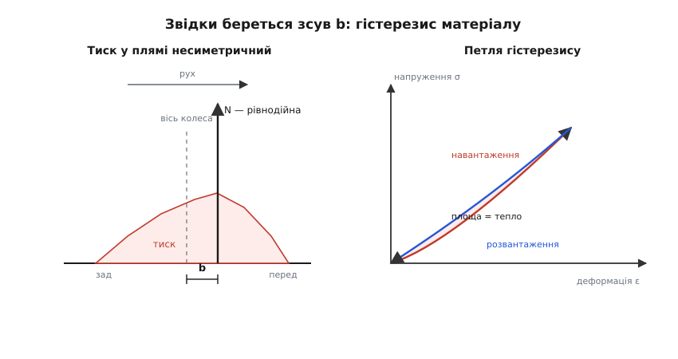
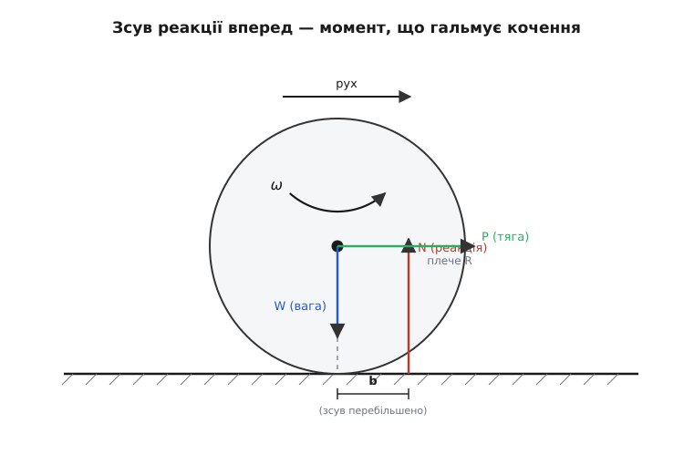
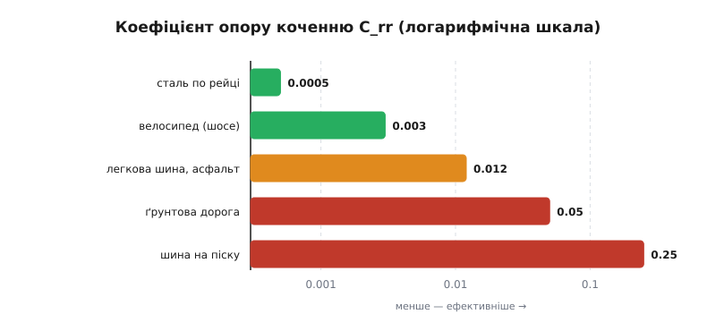

# Тертя кочення

<preknowlist>
- [Тертя](topic:ph-mechanics/friction) — сила, що опирається ковзанню поверхонь одна по одній; майже не залежить від швидкості й площі, зате росте з притисканням. Тут вона потрібна як контраст: котити коштує в десятки разів дешевше, ніж волочити.
- [Нормальна сила](topic:ph-mechanics/normal-force) — з якою силою тіло притиснуте до опори. Це «навантаження» N, що входить у формули опору коченню.
- [Момент сили](topic:ph-mechanics/torque) — сила, помножена на плече. Колесо гальмує чи розкручує саме момент, а не сама сила, тож усе зведеться до плеча однієї реакції.
</preknowlist>

Ідеально тверда кулька на ідеально твердій підлозі котилася б вічно. Дотик — одна-єдина точка, ковзати нічому, і тертю ніде взятися. Проте справжнє колесо, яке ніде не проковзує, все одно сповільнюється, а щоб котити візок рівномірно, його доводиться безперервно тягнути. Звідки береться опір, якщо нічого не треться?

Спершу переконаймося, що ідеальне колесо справді нічого не коштує. Кочення без проковзування означає, що точка дотику в кожну мить нерухома відносно опори — вона не ковзає, тому [тертя](topic:ph-mechanics/friction) ковзання не робить роботи й нічого не розсіює. А якщо і колесо, і опора нескінченно тверді, дотик стягується в точку, і реакція опори тисне вертикально вгору просто крізь вісь. Сила, лінія якої проходить через вісь, не має плеча — момент нульовий, гальмувати нема чому. Отже опір не захований у жорсткій геометрії. Він народжується там, де ми злукавили, сказавши «нескінченно тверде»: у деформації.

Під навантаженням N колесо й опора трохи сплющуються, і дотик із точки розпливається в невелику пляму. Тепер важливе питання: чи симетрична ця пляма? Коли колесо котиться вперед, її передній край якраз вдавлюється — набирає деформацію, — а задній тим часом розправляється, деформацію віддає.

Якби матеріал був ідеально пружним, як досконала пружина, симетрія була б повною. [Пружна деформація](topic:ph-condensed/elastic-deformation) повертає всю запасену енергію: задній край відштовхував би колесо рівно з тією силою, з якою передній його гальмує, тиск спереду й ззаду зрівнявся б, рівнодійна стала б точно під віссю — і момент знову вийшов би нульовим. Але справжні матеріали в'язкопружні: розправляючись, матеріал повертає менше сили, ніж забрав, коли його стискали. Частину роботи з'їдає внутрішнє тертя — це і є гістерезис (гр. hystéresis — «відставання»: віддача відстає від навантаження) — і перетворює її на тепло. Якщо намалювати залежність напруження від деформації, шлях «стиснули» проходить вище за шлях «відпустили», і між ними лишається петля, площа якої дорівнює втраченій за цикл енергії.


*Несиметричний тиск (зліва) — прямий наслідок гістерезису матеріалу (справа): віддача відстає від навантаження, і за цикл лишається незамкнена петля втрат.*

Наслідок прямий. Раз при однаковій деформації передній край тисне дужче за задній, то рівнодійна всього тиску в плямі зсувається трохи вперед — на невелику відстань b у бік руху. І ось ця зсунута вперед реакція вже має плече b відносно осі, тобто створює момент N·b, спрямований проти обертання. Саме цей момент і є тертя кочення: не сила тертя об поверхню, а гальмівний момент від несиметрично зсунутої опорної реакції.


*Реакція опори зсунута вперед на b; пара сил дає гальмівний момент N·b, і рівно його долає тяга через плече R.*

Тепер порахуймо, скільки треба тягнути. Щоб колесо каталося рівномірно, прикладена до осі горизонтальна тяга P мусить створити момент, який точно скасує гальмівний N·b. Плече тяги над точкою дотику — це радіус колеса R, тож рівновага [моментів](topic:ph-mechanics/torque) дає:

```
P · R = N · b
P     = (b / R) · N = C_rr · N
```

Тут b — коефіцієнт опору коченню з розмірністю довжини (той самий зсув реакції вперед), а C_rr = b/R — безрозмірний коефіцієнт, яким користуються на практиці. Що опір пропорційний навантаженню й обернено пропорційний радіусу колеса, помітили ще наприкінці XVIII століття — [як відкривали й уточнювали цей закон](topic:ph-mechanics/rolling-resistance/hist-coulomb-dupuit.md). А [точне виведення з рівноваги всіх сил](topic:ph-mechanics/rolling-resistance/math-force-shift.md) показує, що втрачена за оберт енергія дорівнює саме площі петлі гістерезису.

**Легкова машина на асфальті.**
```
m    = 1200 кг,   C_rr = 0.012,   R = 0.30 м
N    = m · g    = 1200 · 9.81   = 11772 Н
P    = C_rr · N = 0.012 · 11772 ≈ 141 Н
b    = C_rr · R = 0.012 · 0.30  = 0.0036 м = 3.6 мм
```

Котити машину рівномірно — це тягнути її з силою всього ~141 Н, тоді як волочити ту саму масу по асфальту ковзанням (μ ≈ 0.8) коштувало б близько 9400 Н — у шістдесят із гаком разів більше. І весь цей виграш дає зсув реакції лише на 3.6 мм уперед. Ось навіщо колесо: воно міняє дороге ковзання на дешевий гістерезис.

Чому ж C_rr буває таким різним? У формулі C_rr = b/R сховані два важелі. Твердіші матеріали деформуються менше й мають менший гістерезис — тому сталеве колесо по сталевій рейці має C_rr ≈ 0.0005, разів у двадцять менше за автомобільну шину: сталь майже не сплющується й повертає майже всю енергію, і саме тому один локомотив тягне тисячі тонн. Більший радіус R зменшує відношення b/R — велике колесо легше перекочується через ту саму нерівність. І навпаки: на м'якому ґрунті деформація величезна, петля гістерезису широка, і C_rr для шини на піску сягає 0.2–0.3. Тому ж і недокачана шина, що гнеться дужче, котиться важче й помітно гріється.


*Той самий механізм і та сама формула, але залежно від твердості пари й глибини деформації опір змінюється на три порядки.*

Куди ж дівається робота тяги? На кожен метр шляху витрачається P · 1 = C_rr · N джоулів, і вся ця енергія стає теплом у матеріалі, що безперервно мнеться й розправляється, — [вона нікуди не зникає, лише міняє форму](topic:ph-mechanics/energy-conservation). Саме тому шини під час їзди теплішають, а не через тертя об асфальт.

> 🔧 **Навіщо це.** Опір коченню задає нижню межу витрати пального на малій швидкості й пробігу електромобіля: чималу частку енергії в міському циклі з'їдає саме він. Тому «економні» шини роблять із гуми з малим гістерезисом, а залізниця, де C_rr крихітний, лишається найдешевшим способом возити важке на суходолі.

Зі швидкістю ця картина змінюється. Опір коченню майже не залежить від того, як швидко ти їдеш (росте лише трохи), а [аеродинамічний опір](topic:ph-mechanics/aerodynamic-drag) росте як квадрат швидкості. Тому на малому ходу панує кочення, а десь за 70–90 км/год повітря починає переважати — [де саме проходить ця межа, неважко порахувати](topic:ph-mechanics/rolling-resistance/proj-rolling-vs-drag.md). Нижче за неї боротьба йде не з вітром, а з тими кількома міліметрами, на які реакція дороги вперто зсунута вперед.
