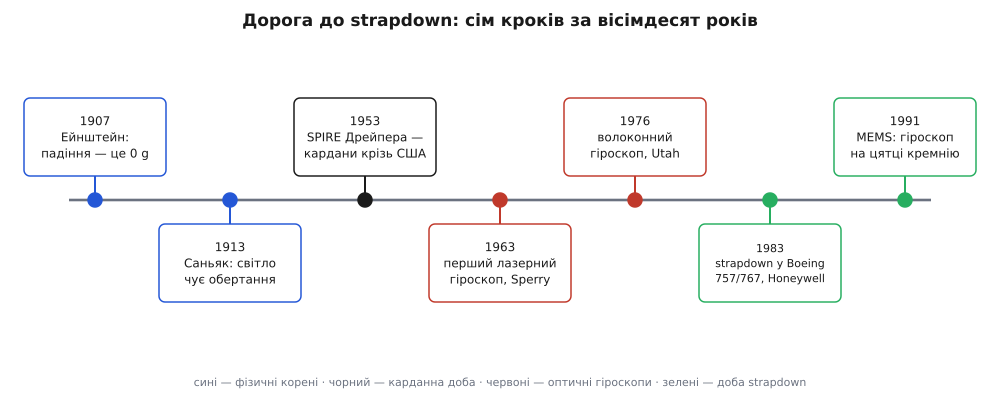
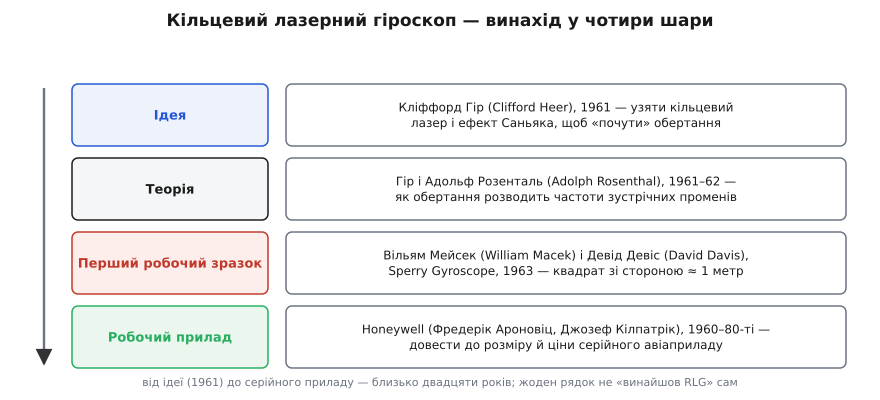

# 📜 Дорога до strapdown: від найщасливішої думки до платформи з чисел

Уявіть, що вам дали коробку, замкнули в ній усі відчуття світу — і сказали: знайди дорогу через континент, не визирнувши назовні жодного разу. Ні зірок, ні маяків, ні радіо, ні супутника. Тільки те, що коробка сама відчуває всередині: поштовхи й повороти. Це стара мрія — рахувати свій шлях **наосліп**, самим лише відчуттям руху. Мрія здавалася безнадійною, бо ховала в собі дві таємниці, розгадані з різницею в десятиліття й зовсім різними людьми. Перша пояснювала, чому давач сили взагалі може щось сказати про рух. Друга — як змусити світло чути, що ти повертаєшся. Історія інерціальної навігації — це історія того, як ці дві таємниці зійшлися, спершу в громіздкому залізі, а тоді розчинилися в арифметиці.


*Вісім десятиліть однієї ідеї, що розгортається. Два фізичні корені ліворуч, карданна доба посередині, доба strapdown праворуч — коли обчислення й тверде тіло гіроскопа нарешті наздогнали задачу.*

### Найщасливіша думка: чому в акселерометра нема ваги

Почнімо з кореня, який мало хто пов'язує з навігацією. У 1907 році Альберт Ейнштейн (Albert Einstein) сидів над оглядовою статтею про відносність і спіймав думку, яку згодом — у неопублікованому рукописі 1920 року, писаному для журналу *Nature*, — назве «найщасливішою думкою мого життя» (нім. *der glücklichste Gedanke meines Lebens*). Думка була проста до зухвалості: **людина, що вільно падає, не відчуває власної ваги**. Зірветься покрівельник з даху — і, доки летить, він невагомий; випущені з рук молоток і цвях висять поруч, наче в порожнечі. Для нього, у його падінні, гравітаційного поля **немає**.

Звідси Ейнштейн зробив крок, що виріс у загальну теорію відносності: гравітація локально **невідрізненна** від прискорення. Але нам тут важливий не космос, а зовсім земний наслідок. Якщо вільне падіння відчувається як невагомість, то прилад, який міряє силу на пробній масі — акселерометр — у вільному падінні покаже **нуль**. Він сліпий до тяжіння не через ваду, а тому, що тяжіння розганяє його пробну масу й корпус пліч-о-пліч, і пружині нема чого напинати. Прилад чує лише **негравітаційні** сили: опору опори, тягу, підіймальну силу. Ту відчуту силу на одиницю маси й називають питомою силою; вона дорівнює справжньому прискоренню мінус те, що дала б сама гравітація.

> 🔧 **Навіщо це.** Уся інерціальна навігація тримається на цьому одному факті. Раз акселерометр не бачить гравітації, то щоб із його показів дістати справжній рух, гравітацію треба **знати наперед і додати назад**. А щоб додати правильно, треба щомиті знати, **куди дивляться осі давача** відносно світу — де «низ». Ось чому центральною задачею навігації виявляється не вимір сили, а стеження за **орієнтацією**. [Принцип еквівалентності](root:ph-mechanics/equivalence-principle) — важка маса точно дорівнює інертній — це і є та скеля, на якій усе стоїть.

Так народилося поняття. А будувати з нього прилади взявся зовсім інший чоловік, по інший бік Атлантики й на пів століття пізніше.

### «Док» Дрейпер і платформа, що полетіла крізь Америку

Чарльза Старка «Дока» Дрейпера (Charles Stark «Doc» Draper, 1901–1987) — американського інженера, засновника й багаторічного керівника Лабораторії приладобудування Массачусетського технологічного інституту (MIT Instrumentation Laboratory) — заслужено називають батьком інерціального наведення. Його шлях до цього почався не з навігації, а зі стрільби. У Другу світову Дрейпер створив для флоту США гіроскопічний приціл (Mark 14), що механічно вираховував випередження для зенітних гармат: гіроскоп «пам'ятав» напрям і підказував, куди стріляти по маневровому літаку. Приціл урятував незліченні кораблі — і переконав Дрейпера, що дзиґи можуть **приборкати** рух незгірше за очі й розум навідника.

Ключем була одна його винахідницька знахідка — **плаваючий інтегрувальний гіроскоп**: чутливий елемент занурювали в рідину, яка тримала його майже без опертя на підшипники, знімаючи згубне тертя. Такий гіроскоп міг годинами тримати напрям із неймовірною для доби вірністю. З нього й виросли інерціальні системи Дрейпера.

Спершу була система FEBE — інерціальний блок із **зоряним** давачем, що підправлявся по небесних світилах. Але справжнім потрясінням стала наступна, суто інерціальна: SPIRE (Space Inertial Reference Equipment) — без зірок, без радіо, взагалі без погляду назовні. 8 лютого 1953 року (за день-два перед тим машину обкатали коротким пробним злетом) переобладнаний бомбардувальник B-29 із 2700-фунтовим (близько 1.2 тонни) блоком SPIRE на борту знявся з бази Генском у Бедфорді, штат Массачусетс. Пілот Чіп Коллінз (Chip Collins) вивів літак на курс — і **віддав керування коробці**. Далі машина вела себе сама, читаючи лише власні акселерометри й гіроскопи, поки Дрейпер із командою фотографували краєвиди, звіряючись, чи тримається курсу. Тримався. Літак перетнув увесь материк і сів у Лос-Анджелесі. Уперше в історії апарат пройшов від океану до океану, знаючи свій шлях **з нічого, крім відчутого поштовху й крену**.

Це був тріумф. Але приглянемося, як саме SPIRE тримав орієнтацію, — бо саме звідти виросте вся подальша драма.

### Доба карданів: орієнтація, викута з латуні

SPIRE і всі перші інерціальні системи розв'язували задачу орієнтації **механічно**. Сенсорний блок садили на гніздо вкладених одне в одне [карданових](root:hw-sensing/gyroscope) кілець із гіроскопами й моторчиками-датчиками моменту. Хоч би як кидало й перевертало літак, серводвигуни доверталися так, щоб внутрішня платформа лишалася наведеною в **незмінних** напрямках простору. Акселерометри на ній завжди дивилися вздовж відомих осей світу — і відняти гравітацію ставало дитячою задачею: «низ» був там само, де вчора.

Чому не інакше? Бо в 1953 році **не було чим порахувати** орієнтацію на льоту. Щоб тримати «низ» числами, треба тисячі разів на секунду обертати вектори в просторі — а обчислювальної потуги для цього не існувало ні на борту, ні деінде. Карданова платформа була, по суті, **механічним аналоговим комп'ютером** орієнтації: латунь, підшипники й сервоприводи робили ту роботу, якої не могла зробити електроніка. Це витвір інженерного мистецтва — і саме тому такий важкий, дорогий і крихкий. Прецизійні кільця, ідеально збалансовані підвіси, десятки рухомих деталей, які тертя, знос і вібрація помалу вбивають. Одна тонна з гаком — і ціна, як у літака.

І все ж карданова платформа два десятиліття лишалася **єдиним** способом. На ній трималося наведення балістичних ракет; на її нащадку — блоці PGNCS тієї ж лабораторії Дрейпера — Apollo дійшов до Місяця й повернувся. Металева платформа працювала. Вона просто коштувала цілого статку й важила як людина.

### Чому strapdown мусив чекати

Була й інша, спокуслива відповідь: а що, як **не крутити залізо взагалі**? Прикрутити акселерометри й гіроскопи намертво до рами апарата — англійською *strap down*, «притягнути ремінцями» — а орієнтацію тримати **числами** в комп'ютері? Тоді нема кардан, нема сервоприводів, нема прецизійних підшипників: сама коробка давачів і машина, що безупинно довертає уявний, обчислений поворот. «Платформою» стає набір чисел.

Ідея була очевидна вже в 1950-ті. Але вона наштовхувалася на **дві стіни** одразу.

Перша — обчислення. Тримати орієнтацію числами означає інтегрувати кутову швидкість сотні або тисячі разів на секунду, повертати кожен вектор сили, стежити, щоб накопичений поворот не «попливав». У добу лампових і перших транзисторних машин такої дешевої, легкої, надійної арифметики на борту просто не було.

Друга стіна тонша, і про неї часто забувають — **сам гіроскоп**. На кардановій платформі гіроскоп живе в тепличному світі: платформа тримає його майже нерухомо, він відчуває лишень крихітні відхилення від інерціального спокою. А прикручений до рами strapdown-гіроскоп відчуває **весь** розмах руху апарата — кожен різкий крен винищувача, кожну вібрацію, повні кутові швидкості на всіх осях. Йому потрібен велетенський діапазон і вірність за найгрубших умов, які механічним дзиґам тієї доби були не до снаги. Тобто strapdown потребував не просто швидшого комп'ютера, а **гіроскопа зовсім іншого роду** — без масивного ротора, без підшипників, що втомлюються, з негайним відгуком і зручним для машини виходом. Такого гіроскопа ще не існувало. Він народжувався окремо — і теж не в одній голові.

### Світло, що чує обертання: кільцевий лазерний гіроскоп

Другий корінь усієї історії — фізичний факт, відкритий 1913 року французьким фізиком Жоржем Саньяком (Georges Sagnac). Саньяк пустив промінь світла двома шляхами вздовж **того самого** замкненого кільця — за годинниковою стрілкою й проти — і звів їх назад. Коли кільце оберталося, дві хвилі приходили трохи не в лад: інтерференційні смуги зсувалися рівно за швидкістю обертання. (Схожий дослід двома роками раніше, 1911-го, ставив німець Франц Гаррес (Franz Harress), не до кінця усвідомивши, що бачить.) Світло, виявляється, **чує**, що ти повертаєшся, — і байдуже, чи є за що зачепитися оком назовні. Це саме те відчуття абсолютного обертання, якого потребує strapdown-блок. Бракувало лише джерела досить когерентного світла, щоб ефект став вимірним приладом. Таким джерелом став лазер — і щойно він з'явився на початку 1960-х, за Саньяків ефект узялися негайно.

Ось тут особливо важливо не збрехати про авторство, бо кільцевий лазерний гіроскоп (англ. ring laser gyroscope, RLG) — **не винахід однієї людини**, а класичний колективний винахід, де ідея, теорія, перший зразок і робочий прилад належать різним людям і різним рокам.


*Кільцевий лазерний гіроскоп шар за шаром. Задум, теорія, перший робочий зразок і серійний прилад — чотири різні ролі, розтягнуті майже на двадцять років. Жоден рядок не «винайшов RLG» наодинці.*

**Ідею** подав 1961 року американський фізик Кліффорд Гір (Clifford V. Heer): побачив, що властивості щойно винайденого лазера можна повернути на вимір обертання за Саньяком, замкнувши промені в лазерне кільце. **Теорію** того ж часу розробляли Гір і Адольф Розенталь (Adolph H. Rosenthal); Розенталева стаття 1962 року описала, що згодом назвуть кільцевим лазером, — і, за переказом, саме на його доповіді 1961 року в залі сидів інженер Sperry, який візьметься все це втілити. **Перший робочий зразок** зібрали й показали 1963 року Вільям Мейсек (William M. Macek) і Девід Девіс (David T. M. Davis Jr.) у компанії Sperry Gyroscope: квадратне гелій-неонове кільце зі стороною близько **метра** — незграбний прадід теперішніх приладів завбільшки з кулак. А довгу, невдячну працю **довести** RLG до розміру й ціни серійного авіаприладу винесли на собі вже інші — інженери Honeywell, серед них Фредерік Ароновіц (Frederick Aronowitz) і Джозеф Кілпатрік (Joseph Killpatrick), і забрала вона майже двадцять років.

Чому саме RLG так ідеально ліг у strapdown, видно з його роботи. Два лазерні промені біжать кільцем назустріч. Коли прилад обертається, ефективна довжина шляху для них стає різною, а отже — різними стають їхні резонансні частоти. Різниця частот (**биття**) прямо пропорційна швидкості обертання:

```
Δf = (4·A / (λ·L)) · Ω

A — площа, охоплена кільцем;  L — периметр (довжина оберту променя);
λ — довжина хвилі світла;      Ω — швидкість обертання приладу.
```

Погляньте, який дарунок. Прилад видає **частоту** — а частоту рахувати легко: кожне биття є крихітний, уже проінтегрований приріст кута. Полічив імпульси — маєш накопичений поворот, готовий цифровий вихід просто в комп'ютер. Жодного масивного ротора, жодних підшипників, що зношуються; миттєва готовність; байдужість до прискорень і струсів; величезний діапазон. Це гіроскоп **без рухомих частин** — рівно те, чого потребувала прикручена до рами коробка. Дві стіни, що стримували strapdown, падали одночасно: комп'ютери дешевшали, а RLG давав саме той твердотільний, цифровий, витривалий гіроскоп, якого бракувало.

### Зсув: коли залізо програло арифметиці

На зламі 1970–80-х усе зійшлося. Мікропроцесор зробив бортову арифметику дешевою й легкою; RLG дозрів до серії. Металеву платформу орієнтації можна було нарешті замінити платформою з чисел — і галузь повернула цілком.

Помітною межею став вибір Boeing. Контракт із Honeywell на інерціальну систему відліку (IRS) для нових лайнерів Boeing 757 і 767 підписали ще 1976 року; перші серійні блоки пішли на початку 1980-х, а з 1983-го RLG-strapdown полетів у регулярних рейсах — **уперше** і strapdown, і лазерний гіроскоп потрапили на пасажирський літак. Airbus не забарився: на A310 став лазерний гіроскоп Litton. Причини вибору були сухі й переконливі — цифровий вихід, миттєва готовність, відсутність кардан, байдужість до перевантажень, обіцянка високої надійності. Карданова платформа, два десятиліття незамінна, за кілька років зробилася спадщиною.

Варто ясно бачити, що саме сталося. Задача **нікуди не поділася** — вона переїхала з латуні в кремній. Кардани стали математикою. Ту саму роботу, яку колись виконували підшипники й серводвигуни, тепер тисячі разів на секунду робить процесор, довертаючи обчислений поворот. Зникло залізо — лишилася фізика: щоб із питомої сили дістати рух, ми досі **знаємо** гравітацію й **додаємо** її назад, тільки орієнтацію для цього тримаємо числами.

### Униз до цятки кремнію: волокно і MEMS

Раз гіроскоп став оптичним, його заходилися здешевлювати й зменшувати — і тут відкрилися ще два шляхи вниз.

Перший — **волоконно-оптичний гіроскоп** (fiber-optic gyroscope, FOG). Його задумали й уперше показали 1976 року Віктор Валі (Victor Vali) і Річард Шортгілл (Richard W. Shorthill) в Університеті Юти. Той самий Саньяків ефект, але без лазерного резонатора: світло женуть двома напрямами крізь довгу котушку тонкого волокна, а зсув фаз між зустрічними хвилями читають інтерферометром. Немає дзеркал і плазми — лише пасивна намотка волокна, дешева й тверда, як камінь. FOG заповнив ту нішу, де RLG був завеликий чи задорогий.

Другий шлях звернув із оптики зовсім убік. **MEMS-гіроскоп** — мікроелектромеханічна система — не має нічого спільного з Саньяком; він працює на [ефекті Коріоліса](root:ph-mechanics/coriolis-effect). Крихітну кремнієву масу змушують дрібно вібрувати; коли пристрій повертається, коріолісова сила відхиляє вібрацію вбік, і це відхилення, пропорційне швидкості обертання, зчитують ємнісно. Перші такі гіроскопи виростила наприкінці 1980-х лабораторія Дрейпера — та сама, що колись будувала карданові платформи для Apollo; кремнієвий монолітний зразок Пола Грайффа (Paul Greiff) і Бертона Боксенгорна (Burton Boxenhorn) показали 1991 року, а перша придатна для діла вірність кремнієвого MEMS-гіроскопа з'явилася близько 1992-го. Далі все пішло лавиною: 1998 року Bosch поставив перший автомобільний MEMS-гіроскоп у системи стабілізації, і давач обертання з приладу завбільшки з людину зробився цяткою на кристалі за копійки.

Ось де історія замикає коло. Той самий strapdown-алгоритм, що колись потребував переобладнаного B-29 і тонни латуні, тепер уміщається на кристалику в кишеньковому телефоні. Акселерометр і гіроскоп у ньому — прямі, здешевлені до краю нащадки коробки Дрейпера. Мрія рахувати свій шлях наосліп стала такою буденною, що ми носимо її, не помічаючи.

### Що з цього лишається

Оглянемося на весь шлях. Ейнштейнів покрівельник, який летить і не відчуває ваги, сказав нам річ, від якої залежить усе: давач сили сліпий до гравітації, тож рух із нього можна дістати, лише **знаючи, де низ** — тобто стежачи за орієнтацією. Тридцять років ми стежили за нею **залізом** — карданова платформа тримала «низ» латунню й підшипниками, бо машини не вміли рахувати досить швидко. А тоді два потоки зустрілися: дешева цифрова арифметика й твердотільний гіроскоп, що виріс із Саньякового досліду про світло, яке чує обертання. Латунь поступилася арифметиці, платформа з металу — платформою з чисел, і та сама коробка з'їхала від бомбардувальника до цятки кремнію.

І в кожній ланці варто чесно казати, **хто** що зробив. Дрейпер — американець, який дав інерціальному наведенню тіло. Кільцевий лазерний гіроскоп — не чийсь особистий тріумф, а робота багатьох рук: ідея Гіра, теорія Гіра й Розенталя, перший зразок Мейсека й Девіса, серійний прилад інженерів Honeywell. Волоконний гіроскоп — Валі й Шортгілла. MEMS — лабораторії Дрейпера й тих, хто підхопив. Винаходи такого штибу не народжуються в одній голові; вони визрівають шарами — задум, теорія, зразок, прилад, — і кожен шар вартий свого імені. А під усіма шарами, від B-29 до телефона в кишені, тихо лежить один незмінний рядок фізики: відчута сила — це прискорення без тієї частки, що її дала б сама гравітація.
