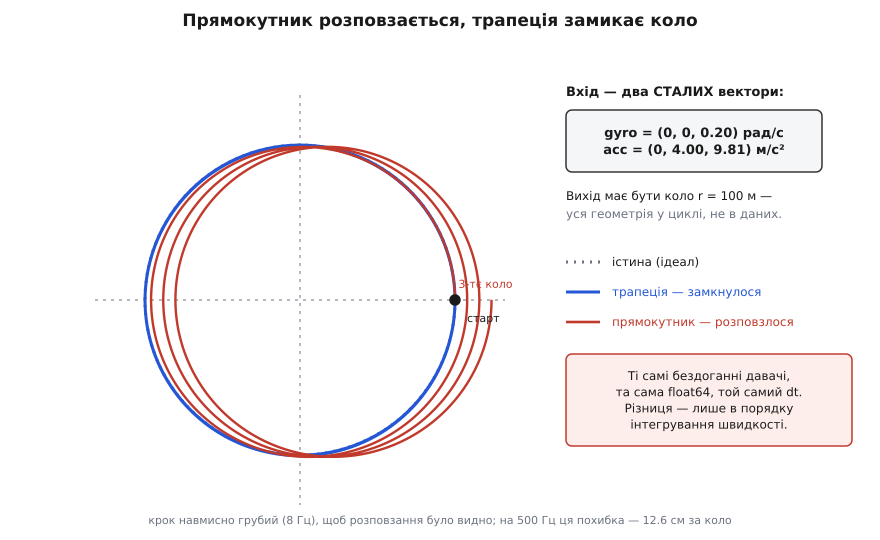
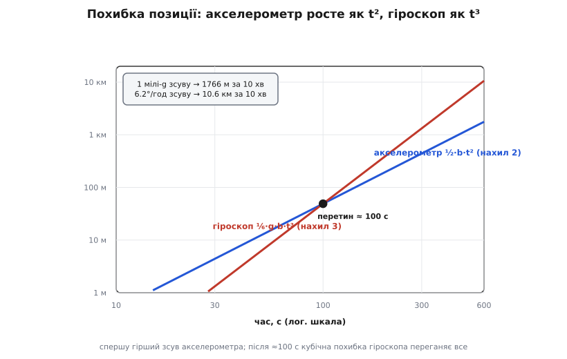

# ⚙️ Робочий strapdown-інтегратор: коло з двох сталих векторів — і як його руйнує дрейф давача

Одна річ — розписати цикл механізації на папері: тримай орієнтацію, поверни відчуту силу у світ, додай гравітацію, двічі проінтегруй. Зовсім інша — зібрати це в програму, яка справді відновлює шлях, і **побачити на власні очі**, як вона це робить і де починає брехати. Зберімо її повністю, женімо через траєкторію, істину якої знаємо до останньої коми, а тоді підкиньмо давачам крихітну ваду — і подивімося, як бездоганне числення розповзається на кілометри. Весь код нижче — справжній: ядро — таке, яке лягає в польотний контролер, драйвер — такий, що його можна вставити в порожній файл і запустити просто зараз.

## Задача: як перевірити навігатор, якому нема з чим звіритися

Інерціальний навігатор рахує свій шлях **наосліп** — самим лише відчуттям поштовхів і поворотів, без жодного погляду назовні. І тут-таки постає підступне питання: якщо він нікуди не дивиться, **як переконатися, що він рахує правильно**? Порівняти з супутником не вийде — уся суть у тому, щоб супутника не потребувати. Виїхати на полігон і зміряти рулеткою — дорого, повільно й однаково неточно.

Чесний спосіб один: **згенерувати істину самому**. Ми задаємо траєкторію математично — так, щоб знати положення, швидкість та орієнтацію апарата в кожну мить точно. З цієї заданої правди ми **обчислюємо назад**, що саме відчували б у цьому русі ідеальні гіроскоп і акселерометр. Оці синтетичні покази й згодовуємо навігаторові — а тоді порівнюємо відновлений ним шлях із заздалегідь відомою істиною. Тепер похибка видна до мікрона, і то без жодного заліза.

Уся хитрість — у виборі траєкторії. Кепський вибір — прямий рівномірний політ: він майже не вмикає ні обертання апарата, ні поворот вектора сили, тож перевіряє хіба інтегратори. Найкраща траєкторія — та, що при позірній простоті **вмикає всі частини циклу одночасно**: і стеження за орієнтацією, і поворот сили, і віднімання гравітації, і подвійне інтегрування. Є один напрочуд елегантний кандидат.

## Ідея: рівний віраж, де обидва давачі показують сталі

Летімо по колу. Радіус R = 100 м, стала шляхова швидкість V = 20 м/с; ніс апарата весь час дивиться вздовж швидкості, крила рівні — звичайний координований віраж. Кутова швидкість обходу кола:

```
Ω = V / R = 20 / 100 = 0.20 рад/с
```

Що в цьому русі відчуває **гіроскоп**? Апарат рівно, без крену й тангажу, довертається довкола своєї вертикальної осі — рівно настільки, щоб ніс встигав за швидкістю. Отже кутова швидкість у власних осях стала й дивиться лише вгору-вниз по тілу:

```
gyro = ω_тіла = (0, 0, Ω) = (0, 0, 0.20) рад/с    ← стала
```

Що відчуває **акселерометр**? Він міряє питому силу f = a − g. Справжнє прискорення тут суто доцентрове — спрямоване в центр кола, величиною

```
|a| = V² / R = Ω²·R = 0.04 · 100 = 4.0 м/с²
```

Розкладімо його та реакцію опори по осях тіла — «уперед / до центра / угору»: уперед нуль (швидкість не міняється), до центра доцентрові 4.0, а вгору рівно g, бо опора (підіймальна сила) тримає висоту проти тяжіння:

```
acc = f_тіла = (0, Ω²·R, g) = (0, 4.00, 9.81) м/с²    ← стала
```

Ось воно, диво цієї задачі: **геометрія кола однакова в кожній його точці**, тому обидва вектори застигають — у власних осях тіла гіроскоп і акселерометр показують два незмінних набори чисел. А проте у світі апарат виписує повне коло радіусом 100 метрів. Жодного кола нема у вхідних даних — усе воно **виготовляється всередині циклу механізації**. Якщо навігатор із двох застиглих трійок чисел відновить коло — значить, працює геть усе: і кватерніон точно накопичив поворот, і силу він повернув правильно, і гравітацію відняв там, де треба, і подвійне інтегрування не збрехало. Кращого пробного каменя годі й шукати.

## Робочий код: кватерніонне ядро

Спершу — арифметика орієнтації. Поворот «тіло → світ» тримаємо [кватерніоном](topic:math-geometry/quaternions): чотири числа кодують орієнтацію без вироджень, множення ⊗ докручує один поворот іншим, спряження q* обертає назад, а одиничну довжину треба берегти — саме вона робить обертання чистим обертанням, без розтягу. Потрібні чотири операції: множення, нормування, обертання вектора й побудова малого приросту повороту з виміряної кутової швидкості.

Ядро — гарячий цикл реального часу на борту, тож пишемо його мовою заліза; поруч — той самий код читабельною мовою, який можна одразу запустити.

:::tabs
```c
#include <math.h>

typedef struct { float x, y, z; }    Vec3;
typedef struct { float w, x, y, z; } Quat;

// Добуток кватерніонів a ⊗ b (складання двох поворотів).
static Quat quat_mul(Quat a, Quat b) {
    return (Quat){
        a.w*b.w - a.x*b.x - a.y*b.y - a.z*b.z,
        a.w*b.x + a.x*b.w + a.y*b.z - a.z*b.y,
        a.w*b.y - a.x*b.z + a.y*b.w + a.z*b.x,
        a.w*b.z + a.x*b.y - a.y*b.x + a.z*b.w
    };
}

// Повернути до одиничної довжини — інакше обертання «попливе» масштабом.
static Quat quat_unit(Quat q) {
    float inv = 1.0f / sqrtf(q.w*q.w + q.x*q.x + q.y*q.y + q.z*q.z);
    return (Quat){ q.w*inv, q.x*inv, q.y*inv, q.z*inv };
}

// Повернути вектор тіла у світ:  v_світ = q ⊗ (0,v) ⊗ q*.
static Vec3 quat_rotate(Quat q, Vec3 v) {
    Quat p  = { 0.0f, v.x, v.y, v.z };
    Quat qc = { q.w, -q.x, -q.y, -q.z };
    Quat r  = quat_mul(quat_mul(q, p), qc);
    return (Vec3){ r.x, r.y, r.z };
}

// Точний приріст орієнтації з вектора повороту θ = ω·dt за крок.
static Quat quat_delta(Vec3 rotvec) {
    float a = sqrtf(rotvec.x*rotvec.x + rotvec.y*rotvec.y + rotvec.z*rotvec.z);
    if (a < 1e-9f)                      // мала межа: θ/2 просто у векторну частину
        return (Quat){ 1.0f, 0.5f*rotvec.x, 0.5f*rotvec.y, 0.5f*rotvec.z };
    float s = sinf(a * 0.5f) / a;
    return (Quat){ cosf(a * 0.5f), rotvec.x*s, rotvec.y*s, rotvec.z*s };
}
```
```py
import math

def qmul(a, b):                       # добуток кватерніонів a ⊗ b
    aw, ax, ay, az = a
    bw, bx, by, bz = b
    return (aw*bw - ax*bx - ay*by - az*bz,
            aw*bx + ax*bw + ay*bz - az*by,
            aw*by - ax*bz + ay*bw + az*bx,
            aw*bz + ax*by - ay*bx + az*bw)

def qunit(q):                         # повернути до одиничної довжини
    inv = 1.0 / math.sqrt(sum(c*c for c in q))
    return tuple(c*inv for c in q)

def qrot(q, v):                       # повернути вектор тіла у світ
    w, x, y, z = q
    r = qmul(qmul(q, (0.0,) + tuple(v)), (w, -x, -y, -z))
    return (r[1], r[2], r[3])

def quat_delta(rotvec):               # точний приріст із θ = ω·dt
    a = math.sqrt(sum(c*c for c in rotvec))
    if a < 1e-12:                     # мала межа: θ/2 у векторну частину
        return (1.0, 0.5*rotvec[0], 0.5*rotvec[1], 0.5*rotvec[2])
    s = math.sin(a/2) / a
    return (math.cos(a/2), rotvec[0]*s, rotvec[1]*s, rotvec[2]*s)
```
:::

Чому приріст будуємо саме так? За крок dt апарат довертається на вектор повороту θ = ω·dt. Точний одиничний кватерніон такого повороту — це (cos(|θ|/2), θ̂·sin(|θ|/2)), де θ̂ — вісь, а |θ| — кут. Це не наближення: для сталої за крок кутової швидкості формула точна, і добуток одиничних кватерніонів лишається одиничним аж до похибки заокруглення. (Чому «навпіл» і звідки кінематика q̇ = ½·q⊗ω — окрема тема; тут ми користуємося готовим результатом.)

## Ядро: один крок механізації

Тепер сам чотирикроковий цикл: докрутити орієнтацію, повернути питому силу у світ, додати гравітацію, проінтегрувати у швидкість і положення. Один тонкий момент заклали одразу — інтегруємо не прямокутником, а **трапецією**: швидкість нарощуємо середнім прискоренням початку й кінця кроку, положення — середньою швидкістю. Навіщо саме так, побачимо на числах трохи згодом; поки що просто закладімо це в код.

:::tabs
```c
static const Vec3 G_WORLD = { 0.0f, 0.0f, -9.81f };   // гравітація вниз, вісь Z угору

// Один крок strapdown-механізації.
// q — орієнтація «тіло → світ»; v, p — швидкість і положення у світі;
// a_prev — світове прискорення з попереднього кроку (для трапеції);
// gyro — кутова швидкість тіла (рад/с); acc — питома сила тіла (м/с²).
void strapdown_step(Quat *q, Vec3 *v, Vec3 *p, Vec3 *a_prev,
                    Vec3 gyro, Vec3 acc, float dt)
{
    // 1. Орієнтація: докрутити точним приростом і ОБОВ'ЯЗКОВО нормувати.
    Vec3 rotvec = { gyro.x*dt, gyro.y*dt, gyro.z*dt };
    *q = quat_unit(quat_mul(*q, quat_delta(rotvec)));

    // 2. Питому силу з осей тіла — у світ.   3. Додати гравітацію.
    Vec3 fw = quat_rotate(*q, acc);
    Vec3 aw = { fw.x + G_WORLD.x, fw.y + G_WORLD.y, fw.z + G_WORLD.z };

    // 4. Трапеція: швидкість — середнім прискоренням, позиція — середньою швидкістю.
    Vec3 vn = {
        v->x + 0.5f*(a_prev->x + aw.x)*dt,
        v->y + 0.5f*(a_prev->y + aw.y)*dt,
        v->z + 0.5f*(a_prev->z + aw.z)*dt
    };
    p->x += 0.5f*(v->x + vn.x)*dt;
    p->y += 0.5f*(v->y + vn.y)*dt;
    p->z += 0.5f*(v->z + vn.z)*dt;
    *v = vn;
    *a_prev = aw;
}
```
```py
G_WORLD = (0.0, 0.0, -9.81)           # гравітація вниз, вісь Z угору

def strapdown_step(q, v, p, a_prev, gyro, acc, dt):
    # 1. Орієнтація: докрутити точним приростом і ОБОВ'ЯЗКОВО нормувати.
    q = qunit(qmul(q, quat_delta((gyro[0]*dt, gyro[1]*dt, gyro[2]*dt))))

    # 2. Питому силу у світ.   3. Додати гравітацію.
    fw = qrot(q, acc)
    aw = (fw[0], fw[1], fw[2] + G_WORLD[2])

    # 4. Трапеція: швидкість — середнім прискоренням, позиція — середньою швидкістю.
    vn = tuple(v[i] + 0.5*(a_prev[i] + aw[i])*dt for i in range(3))
    p  = tuple(p[i] + 0.5*(v[i]     + vn[i])*dt for i in range(3))
    return q, vn, p, aw
```
:::

Уся динамічна пам'ять навігатора — оці кілька чисел: кватерніон (4), швидкість (3), положення (3) та одне минуле прискорення (3). Тринадцять чисел утримують увесь стан руху апарата. Це і є та «математична платформа», що заступила кардани.

## Прогнати й порівняти

Лишилося вигнати нашу синтетичну істину й драйвер, що крутить цикл. Це вже не гарячий борт, а звичайний офлайн-скрипт — пишемо його читабельним Python:

```py
R, V = 100.0, 20.0                    # радіус і швидкість віражу
OM   = V / R                          # 0.20 рад/с — стала кутова швидкість
G    = 9.81
DT   = 1.0 / 500                      # 500 Гц — типова частота IMU

GYRO = (0.0, 0.0, OM)                 # ← стала (виведено вище)
ACC  = (0.0, OM*OM*R, G)              # ← стала: (0, 4.00, 9.81)

def truth(t):                         # де апарат насправді, у кожну мить
    return (R*math.cos(OM*t), R*math.sin(OM*t), 0.0)

def start():                          # орієнтація на θ=0: курс +90° (ніс на +Y)
    q = qunit((math.cos(math.pi/4), 0.0, 0.0, math.sin(math.pi/4)))
    return q, (0.0, V, 0.0), (R, 0.0, 0.0)

def run(seconds):
    q, v, p = start()
    fw = qrot(q, ACC)                 # засіяти «минуле» прискорення з початку
    a_prev = (fw[0], fw[1], fw[2] - G)
    worst = 0.0
    for k in range(round(seconds / DT)):
        q, v, p, a_prev = strapdown_step(q, v, p, a_prev, GYRO, ACC, DT)
        true = truth(DT * (k + 1))
        worst = max(worst, math.dist(p, true))
    return worst, math.dist(p, (R, 0.0, 0.0))   # (найгірша похибка, незамикання)
```

Один віток кола — це 2π/Ω ≈ 31.4 с, тобто близько 15 700 кроків на 500 Гц. Запускаємо на цілий віток і дивимося, наскільки далеко відновлене положення відбігає від істини й чи вертається коло само в себе:

```
ВІРАЖ  R=100 V=20  Ω=0.20 рад/с  віток=31.42 с  dt=0.0020 (500 Гц)
  gyro=(0,0,0.20)  acc=(0,4.00,9.81)  — обидва СТАЛІ
  трапеція      найгірша похибка=9.42e-06 м   незамикання=1.48e-03 м
```

Дев'ять **мікрометрів** найбільшого відхилення за цілий віток і півтора міліметра незамикання. Із двох застиглих трійок чисел цикл виткав стометрове коло й повернувся майже точно в старт. Механіка працює: орієнтація, поворот сили, гравітація, подвійне інтегрування — усе сходиться.


*Те саме коло, той самий бездоганний вхід — і два способи інтегрувати. Трапеція замикає коло, прямокутник з тими самими даними спіраллю тікає назовні. Крок тут навмисно грубий, щоб різницю було видно оком.*

Але тепер — обіцяне пояснення трапеції. Замінимо в кроці інтегрування назад на найнаївніше, прямокутне (швидкість += прискорення·dt, як у першому-ліпшому виведенні), і той самий пробіг дає:

```
  прямокутник   найгірша похибка=1.26e-01 м   незамикання=1.26e-01 м
```

**Дванадцять із половиною сантиметрів** за один-єдиний віток — при тих самих ідеальних давачах, тій самій подвійній точності, тому самому кроці. Різниця з трапецією — у **чотири порядки**. Звідки вона? Прямокутник бере прискорення на **початку** кроку й вважає його сталим до кінця — а прискорення весь час доцентрово повертається. Систематичний недобір накопичується виток за витком, і коло **спіраллю розкручується назовні**, як показує червона крива на фігурі. Трапеція ж усереднює початок і кінець кроку, ловлячи поворот майже точно. Вибір між [прямокутником і трапецією](topic:math-numeric/numerical-integration) — не педантизм: він вирішує, чи похибка методу росте пропорційно dt чи пропорційно dt², а це десятки сантиметрів проти мікронів. Порядок інтегрування — не дрібниця.

## Тепер зламаймо його: зсув давача

Досі давачі були бездоганні. У житті вони брешуть, і найпідступніша брехня — **сталий зсув** (англ. *bias*): давач тихо додає до кожного заміру ту саму малу похибку. Уведімо її й нехай апарат стоїть **нерухомо** — так чистіше видно, як зсув сам собою породжує рух із нічого. Нерухомо гіроскоп мав би показувати нулі, акселерометр — саму опору (0, 0, g). Додаймо до цих чесних показів невеликий сталий зсув:

```py
def vadd(a, b): return (a[0]+b[0], a[1]+b[1], a[2]+b[2])

def run_static(seconds, acc_bias, gyro_bias, sample):
    q, v, p = (1.0, 0.0, 0.0, 0.0), (0., 0., 0.), (0., 0., 0.)
    acc0 = (0., 0., G)                            # нерухомо: лише опора
    fw = qrot(q, vadd(acc0, acc_bias)); a_prev = (fw[0], fw[1], fw[2] - G)
    nxt, rows = sample, []
    for k in range(round(seconds / DT)):
        gyro = gyro_bias                          # істинна ω = 0, лишається зсув
        acc  = vadd(acc0, acc_bias)               # істинна f + зсув
        q, v, p, a_prev = strapdown_step(q, v, p, a_prev, gyro, acc, DT)
        t = DT * (k + 1)
        if t >= nxt - 1e-9:
            rows.append((t, math.hypot(p[0], p[1]))); nxt += sample
    return rows
```

Спершу — **зсув акселерометра** завбільшки 1 мілі-g (тисячна частка g, 0.00981 м/с²) по одній горизонтальній осі. Це скромно навіть для дешевого MEMS-давача. Женемо десять хвилин:

```
ЗСУВ АКСЕЛЕРОМЕТРА b = 1 мілі-g (0.00981 м/с²), нерухомо:
  t= 120 с   горизонт=    70.63 м   ½·b·t²=    70.63 м
  t= 240 с   горизонт=   282.53 м   ½·b·t²=   282.53 м
  t= 360 с   горизонт=   635.69 м   ½·b·t²=   635.69 м
  t= 480 с   горизонт=  1130.11 м   ½·b·t²=  1130.11 м
  t= 600 с   горизонт=  1765.80 м   ½·b·t²=  1765.80 м
```

Апарат стоїть як укопаний, а навігатор певен, що той поїхав майже на **два кілометри**. І цифри лягають точно на формулу ½·b·t²: сталий зсув прискорення інтегрується раз у хибну швидкість (лінійно), другий раз — у хибне положення (**квадратично**). Подвійне інтегрування нічого не прощає: похибка не додається, вона розганяється.

Тепер найцікавіше — **зсув гіроскопа**. Це не зсув прискорення, це зсув **кутової швидкості**: давач гадає, що апарат ледь-ледь обертається, хоча той нерухомий. Візьмімо крихітний зсув 3·10⁻⁵ рад/с — це якихось 6.2 градуса за **годину**, показник пристойного давача:

```
ЗСУВ ГІРОСКОПА b = 3e-5 рад/с (≈ 6.2°/год), нерухомо:
  t= 120 с   горизонт=    84.76 м   ⅙·g·b·t³=    84.76 м
  t= 240 с   горизонт=   678.07 м   ⅙·g·b·t³=   678.07 м
  t= 360 с   горизонт=  2288.46 м   ⅙·g·b·t³=  2288.48 м
  t= 480 с   горизонт=  5424.48 м   ⅙·g·b·t³=  5424.54 м
  t= 600 с   горизонт= 10594.63 м   ⅙·g·b·t³= 10594.80 м
```

Десять із половиною **кілометрів** за ті самі десять хвилин — від зсуву в 6 градусів за годину. І закон уже **кубічний**, ½·b·t² поступилося ⅙·g·b·t³. Ось звідки береться ця зайва степінь часу, і це чиста фізика питомої сили. Зсув гіроскопа помалу **нахиляє обчислену вертикаль**: кут нахилу δθ = b·t росте лінійно. А щойно «низ» перекошено, при відніманні гравітації частка g завбільшки g·sin(δθ) ≈ g·b·t **протікає в горизонтальний канал** як прискорення, якого нема. Це хибне прискорення **саме росте з часом** (лінійно), тож інтегрується не в t², а в **t³**:

```
хибне горизонт. прискорення:  ε(t) ≈ g · δθ = g · b · t
похибка швидкості:            ∫ε dt   = ½ · g · b · t²
похибка положення:            ∫∫ε dt  = ⅙ · g · b · t³
```


*Дві похибки в подвійному лог-масштабі — тому степеневі закони лягають прямими. Спершу гірший зсув акселерометра (нахил 2), але кубічна похибка гіроскопа (нахил 3) круто його переганяє близько 100-ї секунди й далі росте без упину.*

Порівняймо два закони поряд. Спочатку гірший саме акселерометр: усю першу хвилину його парабола йде поперед — на 60-й секунді 17.7 м проти 10.6 гіроскопових. Але перетин настає близько сотої секунди (там, де 3·b_акс = g·b_гіро·t), і далі кубіка бере своє безроздільно: на 120-й уже 85 м гіроскопових проти 71 акселерометрового, а на 600-й — 10.6 км проти 1.8 км. Тому в інерціальному блоці **найдорожче коштує саме гіроскоп**: його похибка тече в положення на цілу степінь часу швидше.

> 🔧 **Навіщо це.** Ці два закони — не академічна вправа, а те, що диктує всю архітектуру бортової навігації. Саме вони кажуть, **як часто** інерціальний блок мусить стягуватися абсолютним орієнтиром — супутником, зоряним давачем, візуальною одометрією. Якщо кубічний закон з'їдає бюджет точності за півтори хвилини, то корекцію треба давати частіше, ніж раз на хвилину. Через це в паспорті гіроскопа стабільність зсуву (bias stability) стоїть найважливішим числом і коштує найдорожче, а «просто проінтегрувати IMU» ніколи не буває навігацією само по собі — лише гладким містком між рідкісними абсолютними замірами.

## Складність і пастки

Цикл виглядає невинно — кілька множень кватерніонів на крок, — але за цією простотою чигають три пастки, кожна з яких коштує метрів.

**Пастка перша: нормування кватерніона.** У ядрі стоїть `quat_unit`, і спокуса її прибрати велика — це ж зайвий корінь на кожному кроці. Порахуймо ціну. Наш точний приріст `quat_delta` сам зберігає одиничну довжину, тож із ним нормування — лише страховка від повільного дрейфу заокруглення. Але дуже поширений **дешевший** приріст першого порядку — q̇ = ½·q⊗ω, тобто `q += ½·(q⊗ω)·dt` — одиничність **не зберігає**: він щокроку трішки видовжує кватерніон. Проженімо той самий віраж цим приростом, з нормуванням і без:

```
НОРМУВАННЯ (дешевий приріст ½·q⊗ω, один віток):
  нормуємо      |q|−1 макс = 2.2e-16   похибка шляху = 8.4e-06 м
  НЕ нормуємо   |q|−1 макс = 3.1e-04   похибка шляху = 1.02e+00 м
```

Без нормування за один віток кватерніон видовжується на 3·10⁻⁴ — і оскільки обертання вектора масштабується як |q|², кожну повернуту силу помножено на зайвий множник, а шлях відбігає на **цілий метр** там, де з нормуванням було вісім мікронів. Мораль: якщо приріст не зберігає довжину сам — нормуй щокроку, беззастережно.

**Пастка друга: порядок інтегрування.** Її вже показали числа вище — прямокутник проти трапеції, 12.6 см проти мікронів за виток. Варто лиш додати, чому це важить навіть із бездоганними давачами: інтегрування — це підсумовування скінченними кроками того, що насправді змінюється неперервно, і **спосіб узяти цю суму** сам вносить похибку, окрему від будь-яких вад заліза. Прямокутник дає похибку методу порядку dt, трапеція — порядку dt². На додачу справжні системи ще й довертають орієнтацію не наприкінці кроку, а посередині (щоб силу повертати «середнім» поворотом), і додають поправки на швидке обертання під час кроку — так звані конічні та човникові члени. Але вже проста заміна прямокутника трапецією зрізає похибку методу на порядки — задешево.

**Пастка третя: накопичення похибки float на високій частоті.** П'ятсот кроків на секунду — це мільйони [операцій із рухомою комою](topic:hw-arch/floating-point) за хвилину, і кожна заокруглюється. Одинарна точність (`float`, ~7 значущих цифр) — природний вибір на борту, бо швидша й економніша. Але заокруглення **накопичуються випадковим блуканням**, тож на довгому пробігу вони помітні. Женемо той самий віраж багато вітків, порівнюючи 32- та 64-бітну арифметику:

```
FLOAT32 vs FLOAT64 (трапеція, незамикання):
    1 віток   (   31 с):  float64 = 1.5e-03 м   float32 = 1.6e-03 м
   20 вітків  (  628 с):  float64 = 1.0e-02 м   float32 = 2.0e-01 м
  100 вітків  ( 3142 с):  float64 = 1.2e-02 м   float32 = 9.5e-01 м
```

За перший віток різниці катма — на коротких часах панує похибка методу, а не заокруглення. Але за годину `float32` наблукав майже **метр**, тимчасом як `float64` тримається на сантиметрі. Тому позицію й швидкість — накопичувачі, що ростуть весь політ, — на серйозних системах ведуть у подвійній точності (або регулярно скидають абсолютним замером), а `float` лишають гарячій дрібноті кватерніонних множень, де числа малі й обмежені.

**Ціна кроку.** А коштує все це напрочуд мало: кілька кватерніонних множень, один квадратний корінь на нормування, пара синусів-косинусів на приріст, жменя множень-додавань на інтеграли — кілька десятків операцій із рухомою комою на крок. Навіть на скромному мікроконтролері це вкладається в частку мілісекунди, тому частоту й тримають високою — 500 Гц, а то й кілька кілогерц: що частіші кроки, то менша похибка методу й то краще цикл ловить швидке обертання між замірами. Пам'яті — тринадцять чисел стану. Уся інерціальна навігація тримається на цьому крихітному, дешевому, невпинному циклі — і на дисципліні пильнувати три його пастки, бо подвійне інтегрування не пробачає жодної.
