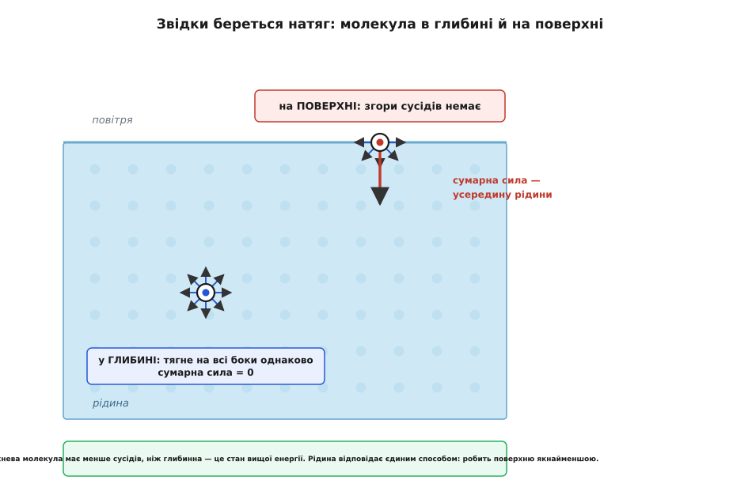
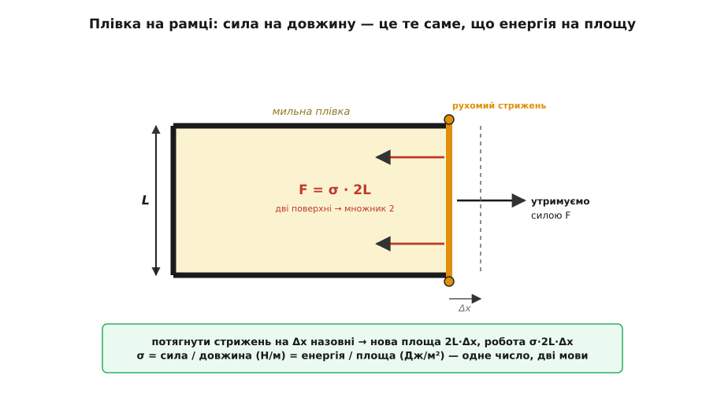
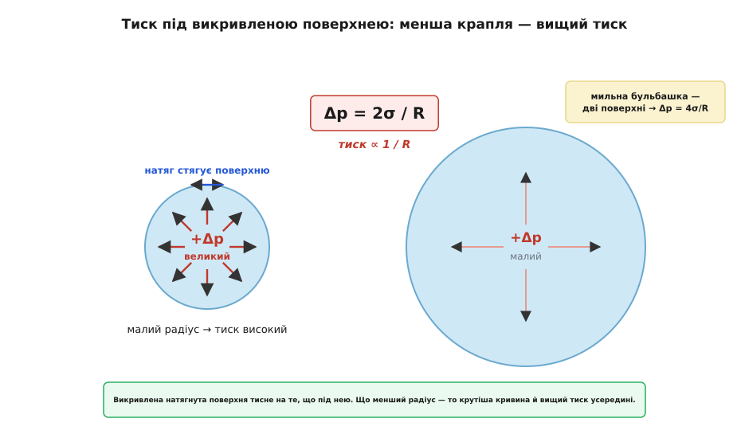
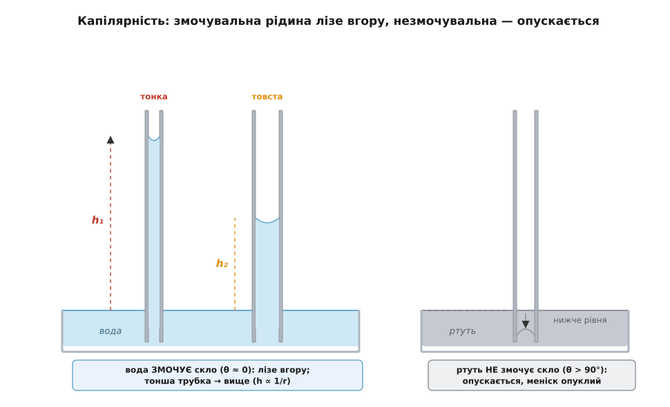

# Поверхневий натяг

<preknowlist>
- [Міжмолекулярні сили](root:basic-chemistry/intermolecular-forces) — молекули рідини притягуються одна до одної (у воді до звичайного притягання додаються ще й водневі зв'язки); саме це притягання й породжує натяг.
- [Атоми й молекули](root:basic-chemistry/atoms-molecules) — речовина складається з окремих молекул, що безперервно рухаються й туляться одна до одної.
</preknowlist>

Водомірка бігає поверхнею ставка й не тоне. Обережно покладена сталева голка лежить на воді, хоч сталь важча за воду всемеро. Крапля роси збирається в кульку, а не розповзається плямою. Вода в налитій по вінця склянці стоїть горбиком вище за край і не переливається. У кожному з цих випадків поверхня рідини поводиться так, ніби її затягнули тонкою пружною плівкою — невидимою шкіркою, що опирається розтягуванню й прагне стягнутися. Тільки плівки там жодної немає: це та сама вода, що й глибше. Розберімо, звідки береться ця «шкірка» — і чому вона тягне саме так, як тягне.

## Звідки береться натяг

Спустімося до молекул. Молекула в глибині рідини оточена сусідами з усіх боків, і кожен її притягує. Тягнуть рівномірно навсібіч — угору, вниз, вбік, — тож усі ці притягання гасять одне одного, і сумарна сила на неї дорівнює нулю. Тепер піднімімо погляд до самої поверхні. Молекула на межі з повітрям має сусідів знизу й з боків, але **згори сусідів немає** — там розріджене повітря, молекули якого настільки далекі й рідкі, що майже не притягують. Баланс порушено: усе притягання тепер тягне таку молекулу лише вниз і вбік, а сумарна сила спрямована **всередину рідини**.



*У глибині притягання зрівноважене, на поверхні — ні. Ця незрівноважена сила всередину й робить поверхню особливою.*

Із цього випливає головне. Опинитися на поверхні для молекули **невигідно**: вона недоотримує частину тих притягань, якими тішиться молекула в глибині, а отже, сидить у стані вищої енергії. Щоб побільшити поверхню, доведеться витягти молекули зі зручної середини нагору, розірвавши частину їхніх зв'язків, — а за це треба заплатити енергією. Природа ж поводиться просто: усе саме собою скочується до найнижчої енергії. Тому рідина робить свою поверхню **якнайменшою** за даного об'єму. Оце «небажання мати зайву поверхню», ця тенденція стягнутися до мінімальної площі — і є поверхневий натяг. Для води притягання ще й підсилене [водневими зв'язками між молекулами](root:basic-chemistry/intermolecular-forces), тому в неї натяг помітно більший, ніж у більшості звичайних рідин.

Аналогія з напнутою шкіркою точна в одному: і поверхня, і розтягнута гумка опираються збільшенню площі й тягнуть краї всередину. А от ламається вона у важливому місці. Гумка тягне тим сильніше, що дужче її розтягли: більше видовження — більша сила, бо в неї є довжина спокою, від якої вона відлічує напруження. Поверхнева ж плівка тягне **однаково**, хоч скільки її «розтягуй»: скільки нових молекул винесеш нагору, стільки й заплатиш за кожну, а сила на одиницю довжини лишається та сама. У поверхні немає пам'яті про якийсь спокійний розмір — на місце винесених молекул одразу підходять нові з глибини. Тож натяг — це не пружність розтягнутого, а стала ціна кожного клаптика поверхні.

## Дві мови одного явища: сила й енергія

Тепер зробімо це число. Поверхневий натяг σ (позначають грецькою «сигмою») можна виміряти двома на позір різними способами — і диво в тому, що виходить те саме.

Перший спосіб — **сила на одиницю довжини**. Уявімо дротяну П-подібну рамку, по відкритому боці якої ковзає легкий стрижень завдовжки L; на рамку натягнуто мильну плівку. Плівка тягне стрижень усередину — щоб її поверхня зменшилася, — і щоб стрижень утримати, треба прикласти назустріч силу F. Виявляється, F пропорційна довжині стрижня: `F = σ · 2L`. Множник 2 — бо в плівки дві поверхні, передня й задня, і кожна тягне. Звідси σ = F / 2L, і вимірюють її в ньютонах на метр (Н/м): це сила, з якою поверхня стягується вздовж будь-якої проведеної в ній лінії.



*Той самий σ можна прочитати як силу на довжину або як роботу на нову площу — обидва прочитання дають однакове число з однаковими одиницями.*

Другий спосіб — **енергія на одиницю площі**. Потягнімо стрижень назовні на маленьку віддаль Δx. Плівка при цьому побільшала: з'явилося `2L · Δx` нової поверхні (знову дві сторони). Робота, яку ми виконали проти натягу, — це `F · Δx = σ · 2L · Δx = σ · ΔA`, тобто σ помножити на площу створеної поверхні. Отже, σ — це ще й **робота, потрібна на кожен новий квадратний метр поверхні**, і міряють її в джоулях на квадратний метр (Дж/м²). А тепер найкрасивіше: Дж/м² — це те саме, що Н·м/м² = Н/м. Одиниці збіглися, і не випадково: сила стягування й енергетична ціна поверхні — це один і той самий σ, побачений з двох боків. Поверхневий натяг **дорівнює** поверхневій енергії на одиницю площі.

Для води за 20 °C σ ≈ 0.073 Н/м — тобто близько 73 мільйджоулів, щоб створити один квадратний метр нової водної поверхні. Порівняймо: у спирту σ ≈ 0.022 Н/м, у мильної води — усього ≈ 0.025 Н/м (мило різко знижує натяг), а в ртуті — аж ≈ 0.49 Н/м, бо її атоми тримаються один за одного надзвичайно міцно. Саме тому вода на жирній поверхні збирається в опуклі краплі, а спирт розтікається тонкою плівкою — у спирту платити за поверхню вшестеро дешевше.

> 🔧 **Навіщо це.** Поверхнева енергія вирішує, розтечеться рідина по поверхні чи збереться в кульки. Щоб фарба лягла рівним шаром, а не зіщулилася острівцями; щоб припій під час паяння розтікся по контактній площадці, а не завмер краплею; щоб чорнило струменевого принтера сіло охайною крапкою — усюди борються саме з поверхневим натягом: або знижують його (флюс, поверхнево-активні добавки), або підвищують спорідненість поверхні до рідини. Не розумієш натягу — не керуєш змочуванням.

## Чому краплі круглі

З «рідина мінімізує поверхню» одразу випливає форма вільної краплі. Серед усіх тіл заданого об'єму найменшу площу поверхні має **куля** — жодна інша форма не загортає той самий об'єм у меншу оболонку. Тому дрібні краплі, бульбашки, крапельки в невагомості чи у вільному падінні набувають кулястої форми: натяг стискає їх, доки нема куди зменшуватися далі.

Круглими лишаються, щоправда, лише **малі** краплі. Велику калюжу натяг округлити не годен — заважає тяжіння, що розтікає воду в пласку пляму. Хто переможе, вирішує розмір, і межу задає так звана капілярна довжина `ℓ = √(σ / ρg)` — для води це приблизно 2.7 мм. Дрібніше за цю мірку панує натяг (краплі-намистинки), більше — панує тяжіння (пласкі калюжі). Ось чому туман — це рій ідеальних кульок, а розлита склянка — плаский розлив.

Той самий опір поверхні збільшенню площі тримає на воді водомірку й покладену голку. Щоб пропустити тіло крізь поверхню, її треба прогнути, а прогин — це більша площа, за яку доводиться платити енергією; тому поверхня опирається й штовхає тіло вгору. Прикинемо для водомірки: сила натягу вздовж лінії контакту — це приблизно σ помножити на довжину цієї лінії. Кілька сантиметрів сумарного контакту лапок дають `0.073 · 0.03 ≈ 2 мН` — а важить комаха частки міліньютона. Запас на порядок; тому вона й бігає поверхнею, наче та тверда.

## Тиск під викривленою поверхнею: закон Лапласа

Оскільки поверхня натягнута й до того ж **викривлена**, вона тисне на те, що під нею, — точно як натягнута оболонка повітряної кульки стискає повітря всередині. Для сферичної поверхні радіуса R цей надлишок тиску всередині над зовнішнім дорівнює:

```
Δp = 2σ / R
```

Що менший радіус — то крутіша кривина, то дужче натяг стягує поверхню і то вищий тиск усередині. Цей результат — рівняння Юнга–Лапласа; його якісно, самими словами, описав [Томас Юнг 1805 року, а строгу математику дав П'єр-Симон Лаплас 1806-го](root:ph-mechanics/surface-tension/hist-surface-tension.md). Звідки саме береться двійка й куди дівається радіус — видно з [короткого виведення через баланс сил](root:ph-mechanics/surface-tension/math-young-laplace.md): натяг по «екватору» краплі проти тиску на її переріз.



*Менша крапля напружена сильніше: внутрішній надлишок тиску зростає обернено до радіуса.*

**Умова.** Крапля води (σ = 0.073 Н/м) двох розмірів: R = 1 мм і R = 1 мкм.

```
R = 1 мм = 1·10⁻³ м:   Δp = 2 · 0.073 / 1·10⁻³ = 146 Па
R = 1 мкм = 1·10⁻⁶ м:  Δp = 2 · 0.073 / 1·10⁻⁶ = 1.46·10⁵ Па ≈ 1.4 атм
```

**Висновок.** У міліметровій краплі надлишок тиску мізерний — соті частки відсотка атмосфери. А в мікронній крапельці туману той самий натяг створює вже понад атмосферу тиску всередині. Ось чому крихітні краплі й бульбашки такі «напружені», чому дуже дрібний туман випаровується блискавично (велика кривина й високий тиск виштовхують молекули геть) і чому найважче роздути бульбашку саме на початку, коли вона ще манюсінька: `2σ/R` тоді найбільший. До речі, у мильної бульбашки дві поверхні, тож у неї `Δp = 4σ/R`; якщо з'єднати трубочкою велику й малу бульбашки, мала здується у велику — бо в меншої тиск вищий. Позірний парадокс, а випливає прямо з формули.

> 🔧 **Навіщо це.** У ваших легенях — сотні мільйонів крихітних пухирців-альвеол, і кожен, за законом `2σ/R`, мав би схлопнутися, а менші — здутися у більші, роблячи дихання пекельно важким. Рятує сурфактант — природна поверхнево-активна речовина, яку виділяє легеня: вона знижує σ саме там, де пухирець найменший, і вирівнює тиск між великими й малими. Той самий закон Лапласа керує зародженням бульбашок при кипінні, кавітацією на гвинтах і тим, чому перегріта без «зародків» вода може довго не закипати.

## Змочування й капілярність

Досі поверхня в нас межувала лише з повітрям. Додаймо тверду стінку — і з'явиться нове питання: як рідина поводиться там, де сходяться три середовища (рідина, повітря й тверде тіло)? Відповідь ховається в **крайовому куті** θ — куті, під яким поверхня рідини підходить до стінки. Його визначає змагання двох притягань: рідини до самої себе (когезія) і рідини до стінки (адгезія). Якщо рідина липне до стінки дужче, ніж сама до себе, вона розтікається по ній, і θ малий — кажуть, рідина **змочує** поверхню (вода на чистому склі, θ ≈ 0). Якщо ж рідина воліє триматися купи, вона збирається в краплю, і θ великий, більший за 90° — рідина **не змочує** (вода на воску чи на листку лотоса; ртуть на склі).

Звідси — капілярність. Устромімо тонку трубку у воду. Вода змочує скло, тобто «хоче» вкрити його стінки, і задля цього тягне стовпчик угору; на певній висоті вага піднятого стовпа врівноважує натяг, що тримає його за меніск. Баланс дає закон Жюрена (за ім'ям [Джеймса Жюрена, який відкрив його 1718 року](root:ph-mechanics/surface-tension/hist-surface-tension.md)):

```
h = 2σ · cos θ / (ρ · g · r)
```

Головне тут — `r` у знаменнику: **що тонша трубка, то вище підіймається рідина**.



*Змочувальна рідина лізе тонкою трубкою вгору, незмочувальна — опускається; що вужча трубка, то сильніший ефект.*

**Умова.** Скляний капіляр із внутрішнім радіусом r = 0.3 мм, вода змочує скло (θ ≈ 0, cos θ ≈ 1), ρ = 1000 кг/м³, g = 9.81 м/с².

```
h = 2 · 0.073 · 1 / (1000 · 9.81 · 3·10⁻⁴)
  = 0.146 / 2.943
  ≈ 0.050 м = 5 см
```

**Висновок.** У трубочці діаметром лише 0.6 мм вода сама, без жодного насоса, підіймається на п'ять сантиметрів. Звузьте канал до трьох мікрометрів — як пори в ґрунті, деревині чи паперовому рушнику — і та сама формула дає підйом у сотні разів вищий, метри. Так вода лізе вгору стеблом рослини, так убирає вологу серветка, так сохне цегла. А ртуть, що скла не змочує, поводиться навпаки: cos θ стає від'ємним, `h` виходить зі знаком мінус — рідина в трубці **опускається** нижче рівня, а меніск не вгинається, а горбиться догори.

> 🔧 **Навіщо це.** Капілярність — це насос без рухомих частин, і на ньому тримається пів світу: живлення рослин, ґнотик у гасовій лампі, вологовідвідні тканини, промокальний папір, паперова хроматографія, а в сучасній техніці — мікрофлюїдні чипи, що женуть краплю реагенту вузесеньким каналом самою лише геометрією стінок. Той самий ефект буває й ворогом: волога підсмоктується капілярами в бетон і мури, а потім там замерзає й руйнує їх.

## Що змінює натяг: температура і ПАР

Натяг — не константа рідини раз і назавжди; його легко зрушити. Найпростіший важіль — **температура**. Гарячіша рідина — це жвавіші молекули, а жвавіший тепловий рух розхитує притягання, що й тримає поверхню. Тому з нагріванням σ спадає, майже лінійно, і зовсім обертається на нуль при критичній температурі — там, де межа між рідиною й газом зникає, а отже, зникає й сама поверхня. Ось чому гаряча вода відмиває краще: нижчий натяг легше пускає її в тканину й пори.

Другий, набагато різкіший важіль — **поверхнево-активні речовини** (скорочено ПАР; до них належить будь-яке мило й будь-який детергент). Їхні молекули двоїсті: один кінець любить воду, другий її цурається. Потрапивши у воду, такі молекули юрмляться саме на поверхні, виставивши водобоязкі хвости назовні, і цим розривають щільну сітку водневих зв'язків, якою вода тримає свою поверхню. Натяг обвалюється з 73 до приблизно 25 мН/м. Саме тому мильна вода змочує, піниться й відмиває: з низьким натягом вона просочується в тканину й обгортає жирову бруднеку, якої чиста вода лише цуралася б. А там, де натяг на поверхні неоднаковий, він жене рідину від місць із низьким натягом до місць із високим — цей потік звуть ефектом Марангоні, і саме він малює «сльози вина» на стінці келиха.

Уся тема тримається на одній-єдиній картинці: молекула на поверхні має менше сусідів, тому поверхня коштує енергії, а рідина відповідає тим, що робить її якнайменшою. Оце «прагнення стягнутися» і є натяг — а з нього самого випливає геть усе решта: круглі краплі (найменша площа), тиск усередині за законом `2σ/R` (натягнута кривина тисне тим дужче, чим менший радіус), капілярний підйом (змочувальна рідина лізе тонким каналом), водомірка на воді й перевертання світу, щойно у воду впало мило. Одна невидима «шкірка» — а стільки наслідків.
