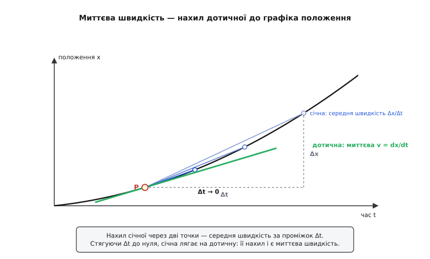
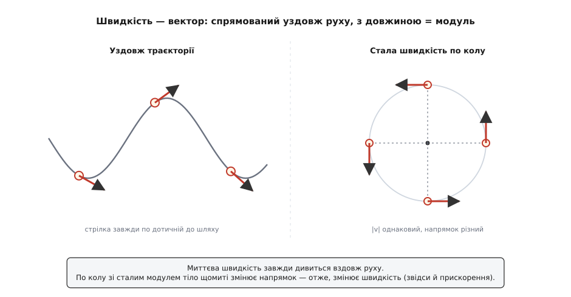
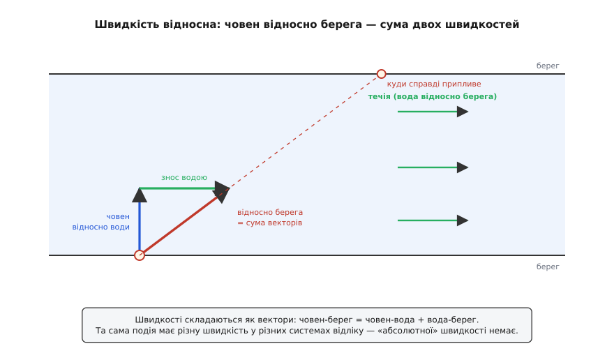

# Швидкість

<preknowlist>
- [Похідна](topic:math-analysis/derivative) — швидкість зміни величини як границя відношення приростів; миттєва швидкість — це буквально похідна положення за часом.
- [Складові вектора](topic:math-algebra/vector-components) — що таке вектор (величина + напрямок) і його проєкції на осі; швидкість — векторна величина, а не просто число.
</preknowlist>

Спідометр показує число — скажімо, 60. Він каже, **як швидко** ти їдеш, але мовчить про те, **куди**. А для більшості питань про рух саме напрямок вирішує все: два автомобілі мчать по шосе кожен на 60 км/год, але назустріч один одному — і зближуються так, наче один стоїть, а другий летить на 120. Той самий спідометр, ті самі числа, а рух геть інший. Тому фізика розводить два поняття, які в побуті зливаються в одне слово. **Швидкість** (від «швидкий») — це не просто «як швидко», а «як швидко **й куди**» змінюється положення тіла. Це величина з напрямком — вектор.

Варто одразу владнати термін, бо тут криється плутанина. Українська (як і багато мов) одним словом «швидкість» тягне обидва змісти; англійська їх розділяє — *speed* (саме число, «як швидко») і *velocity* (число з напрямком). Щоб не збиватися, домовимося так: коли важить лише величина, казатимемо **модуль швидкості** — те саме число, що на спідометрі; коли важить і куди — **вектор швидкості**. Різниця не буквоїдство. На ній тримається головне: тіло може мчати з незмінним модулем і при цьому щомиті змінювати швидкість — досить йому повертати.

## Середня швидкість: переміщення за час

Найпростіше, що можна спитати про рух, — наскільки швидко тіло просунулося **в середньому**. Відповідь напрошується: узяти, як далеко воно опинилося, і поділити на час, що на це пішов. Але «як далеко опинилося» приховує пастку, і саме тут уперше вилазить векторна природа швидкості.

Одна річ — **пройдений шлях**, уся довжина звивистого маршруту, кожна його петля й гак. Зовсім інша — **переміщення**: пряма стрілка від початкової точки до кінцевої, якій байдуже, як тіло туди дісталося. Проїхав ти до сусіднього міста навпростець чи гаком через півобласті — переміщення те саме, а шлях різний. Ці дві величини збігаються лише тоді, коли рух прямий і в один бік; щойно маршрут гнеться чи повертає назад, вони розходяться. [Переміщення проти шляху](topic:ph-mechanics/displacement) — окреме поняття, і воно якраз те, з якого будується вектор швидкості.

Звідси два різні «середні». Середня швидкість як **вектор** — це переміщення, поділене на час. Середній **модуль** швидкості (його ще звуть шляховою швидкістю) — це пройдений шлях, поділений на час. Поки рух прямий, обидва дають одне число. А варто тілу повернути назад — вони розлітаються так, що аж дивно.

**Приклад (коло стадіоном).** Бігун подолав повне коло доріжки — 400 м — за 80 с і спинився рівно там, де стартував.

```
шлях          = 400 м
переміщення   = 0 м          (старт і фініш — та сама точка)

середній модуль швидкості = 400 / 80 = 5.0 м/с
середня швидкість (вектор) =   0 / 80 = 0
```

За модулем він біг по п'ять метрів щосекунди — жвавий темп. А середня швидкість як вектор — рівно нуль: у підсумку він нікуди не перемістився. Це не гра слів, а чесний фізичний факт. Вектор швидкості пам'ятає напрямок, і відрізки маршруту в протилежні боки взаємно гасяться. Тому питання «яка твоя середня швидкість» без уточнення, що ділимо — шлях чи переміщення, — насправді неоднозначне.

## Швидкість цієї миті

Середня за всю поїздку майже нічого не каже про те, що коїться **саме зараз**. Стрілка спідометра показує не середнє за годину дороги — вона показує швидкість цієї-таки миті, і за мить може стрибнути. Що це взагалі означає — «швидкість в одну-єдину мить»?

Питання не таке невинне, як здається, і воно бентежило думку тисячоліттями. Ще Зенон Елейський загострив його загадкою про стрілу в польоті. Візьми будь-яку окрему мить — застигни її, наче кадр. У цю мить стріла займає рівно свій обсяг простору й нікуди не зсувається — вона нерухома, як на фотографії. Але ж увесь політ складений із таких завмерлих митей, і в кожній стріла стоїть. То звідки береться рух? Як із суми нерухомостей набігає політ?

Розв'язок — не втуплюватися в одну застиглу мить (там руху й справді не видно), а дивитися, як положення міняється за **крихітний проміжок** довкола неї. Візьми Δx — наскільки тіло зсунулося за час Δt — і поділи: Δx/Δt, середня швидкість за цей проміжок. А тепер стягуй Δt: секунда, десята, соті, тисячні частки секунди. Відношення Δx/Δt не розсипається й не втікає в безкінечність — воно прямує до цілком певного числа.

```
v = границя (Δx / Δt),   коли Δt → 0
```

Оце граничне число і є **миттєва швидкість**. Математика зве його [похідною](topic:math-analysis/derivative) положення за часом і записує v = dx/dt. Зенонів парадокс розв'язується не запереченням очевидного, а новим поняттям: швидкість цієї миті — не властивість застиглого кадру, а границя, до якої тиснеться середня швидкість, коли проміжок стає все меншим. Те, що людство доходило до цієї думки болісно й довго — від Зенонових парадоксів через середньовічне «правило середньої швидкості» до строгої похідної Ньютона й Ляйбніца, — окрема й повчальна [історія](topic:ph-mechanics/velocity/hist-velocity.md).


*Нахил січної через дві точки графіка — це середня швидкість за проміжок Δt між ними. Що ближчі точки (менший Δt), то ближча січна до дотичної. У границі січна лягає на дотичну, і її нахил — миттєва швидкість у точці P.*

> 🔧 **Навіщо це.** Уся автоматика руху живиться саме миттєвою швидкістю, а не середньою за поїздку. Круїз-контроль, ABS, стабілізація дрона реагують на те, як швидко ти рухаєшся **зараз**, і мусять оновлювати цю оцінку десятки разів на секунду. Спідометр в авто, доплерівська швидкість у GPS-приймачі, тахометр на валу — усі вони по-різному, але міряють одне: похідну положення за часом у поточну мить.

На практиці, до речі, миттєву швидкість рідко ловлять напряму. Частіше беруть положення через рівні проміжки — відліки GPS, кроки енкодера — і ділять прирости, наближаючи ту саму границю. Але наївне ділення Δx/Δt по сирих даних жорстоко підсилює шум, тож роблять це хитріше; робочий [код-приклад](topic:ph-mechanics/velocity/proj-velocity-from-samples.md) показує, як оцінити швидкість із дискретних відліків положення й не потонути в шумі.

## Швидкість дивиться вздовж руху

Рух по прямій обходився одним числом зі знаком. Але тіло рухається як хоче — по дузі, по колу, по хитромудрій кривій, — і тут векторна природа швидкості розкривається сповна.

У кожну мить миттєва швидкість спрямована **вздовж руху** — по дотичній до траєкторії, туди, куди тіло прямує саме зараз. Це не домовленість, а прямий наслідок означення: за крихітний проміжок Δt тіло зсувається на маленьку стрілку переміщення, майже злиту з траєкторією, і швидкість — це та стрілка, поділена на час. Тому вектор швидкості завжди лежить по дотичній: розкрути камінь на мотузці й відпусти — він полетить не від центра назовні, а рівно по тій дотичній, у якій його застало звільнення. Довжина цієї стрілки — модуль швидкості, «як швидко»; її напрямок — «куди». Строге означення через похідну вектора положення r(t), розклад на складові й зв'язок модуля зі складовими зібрано в [окремій математичній вставці](topic:ph-mechanics/velocity/math-velocity-derivative.md).


*Ліворуч: миттєва швидкість завжди спрямована по дотичній до шляху. Праворуч: рух по колу зі сталим модулем — усі стрілки однакової довжини, але дивляться в різні боки. Модуль незмінний, а вектор швидкості весь час крутиться.*

Ось де модуль і вектор розходяться найяскравіше. Уяви тіло, що біжить по колу з незмінним модулем — стрілка спідометра застигла. Чи змінюється його швидкість? Як вектор — так, безперервно: напрямок руху крутиться щомиті, а разом із ним крутиться і вектор швидкості, хоч його довжина стала. А будь-яка зміна швидкості — це вже [прискорення](topic:ph-mechanics/acceleration). Звідси неочевидний, але залізний висновок: рух по колу зі сталим модулем — це рух **із прискоренням**, спрямованим до центра. Саме тому в повороті тебе тисне вбік, хоча спідометр не ворухнувся. Швидкість обертання по колу міряють окремою величиною — [кутовою швидкістю](topic:ph-mechanics/angular-velocity), яка каже, скільки радіанів кута тіло замітає за секунду; вона й пов'язує модуль швидкості з радіусом кола.

## Відносно чого рахувати?

Лишилося найглибше запитання, яке зазвичай прослизає повз увагу: швидкість **відносно чого**? Коли кажуть «60 км/год», мовчки мають на увазі «відносно землі». Але це вибір, а не істина. Пасажир, що йде по вагону потяга зі швидкістю 1 м/с відносно підлоги, для людини на пероні летить на 1 м/с плюс уся швидкість потяга — скажімо, 41 м/с. Хто ж рухається «насправді»? Обидва, і жоден: **абсолютної** швидкості не існує. Швидкість завжди рахують у якійсь [системі відліку](topic:ph-mechanics/inertial-frame), і в різних системах вона різна — це не похибка вимірювання, а сама природа величини.

Як пов'язані швидкості в різних системах? Вони **складаються як вектори**. Швидкість пасажира відносно перону — це його швидкість відносно вагона плюс швидкість вагона відносно перону, складені за правилом [додавання векторів](topic:math-algebra/vector-addition). Якщо напрямки збігаються — числа просто додаються; якщо перпендикулярні — додаються стрілки, і результат іде навскіс. Класичний випадок — човен, що гребе поперек річки, тимчасом як течія зносить його вниз.

**Приклад (човен через річку).** Човняр веслує строго поперек річки завширшки 60 м зі швидкістю 2.0 м/с відносно води. Течія несе воду вздовж русла на 1.5 м/с відносно берега. Яка швидкість човна відносно берега й куди він припливе?

```
поперечна складова (відносно берега) = 2.0 м/с   (веслування)
поздовжня складова (відносно берега) = 1.5 м/с   (течія зносить)

модуль швидкості = √(2.0² + 1.5²) = √6.25 = 2.5 м/с

час переправи   = 60 / 2.0 = 30 с        (річку перетинає лише поперечна складова)
знос за течією  = 1.5 · 30 = 45 м        (нижче від точки навпроти старту)
```

Відносно води човен пливе прямо поперек. Відносно берега — навскіс, на 2.5 м/с, і виходить на протилежний берег на 45 м нижче, ніж цілив. Жодна з двох швидкостей не «правдивіша» за іншу — просто вони в різних системах відліку, а зв'язує їх векторне додавання.


*Швидкість човна відносно берега — векторна сума його швидкості відносно води (поперек) і швидкості течії (вздовж). У системі води човен пливе прямо; у системі берега — навскіс. Немає «справжньої» з них: є дві різні системи відліку.*

> 🔧 **Навіщо це.** Векторне додавання швидкостей — щоденний хліб навігації. Літак веде повітря: його швидкість відносно землі — це повітряна швидкість плюс вектор вітру, і пілот мусить брати поправку на знос, інакше збочить із курсу так само, як човен із прикладу. А радар протизіткнення й системи автопілота стежать не за абсолютними швидкостями об'єктів, а за **відносною** — швидкістю зближення: два літаки на 250 м/с кожен небезпечні, коли летять назустріч (зближення 500 м/с), і майже нешкідливі, коли поряд і в один бік.

Одне застереження. Це просте векторне додавання швидкостей — класичний [принцип відносності Ґалілея](topic:ph-mechanics/galilean-relativity) — насправді чудове наближення, яке працює, доки швидкості малі проти швидкості світла (близько 3·10⁸ м/с). Коли складати доводиться швидкості, близькі до світлової, наївна сума перестає бути правдою: додай до майже-світлового пучка ще один — і не отримаєш «понад світло». Це вже царина спеціальної теорії відносності; для потягів, човнів і літаків поправка мізерна, і векторне додавання лишається точним до багатьох знаків.

## Одиниці й порядок величин

Швидкість — це довжина, поділена на час, тож у СІ її одиниця — **метр за секунду (м/с)**. Побутова одиниця — кілометр за годину; перехід простий, бо в годині 3600 с, а в кілометрі 1000 м:

```
1 м/с = 3.6 км/год        (множимо на 3.6)
90 км/год = 90 / 3.6 = 25 м/с
```

На морі й у повітрі часто рахують у **вузлах** (knot): один вузол — це одна морська миля за годину, рівно 1.852 км/год (≈ 0.514 м/с). Назва лишилася від старовинного способу міряти хід — вимотуючи за борт линву з вузлами й лічачи, скільки їх пройде крізь руку за проміжок часу.

Кілька орієнтирів, щоб відчути шкалу: пішохід іде десь на 1.4 м/с (5 км/год), автомобіль на трасі — близько 25 м/с (90 км/год), звук у повітрі біжить на ≈ 343 м/с, а світло — на майже 3·10⁸ м/с, і швидше за нього у Всесвіті ніщо не рухається. Між кроком людини й променем світла — двісті мільйонів разів, а поняття швидкості для них одне.

## Що лишається

Швидкість — це темп, з яким змінюється положення, і вона від початку вектор: не лише «як швидко», а «як швидко й куди». Середня швидкість — це переміщення (пряма стрілка старт-фініш), поділене на час; не плутати з середнім модулем, що ділить увесь пройдений шлях, — на замкненому маршруті перша нуль, а другий ні. Миттєва швидкість — границя відношення Δx/Δt, коли проміжок стягується до нуля, тобто похідна положення за часом; вона завжди спрямована по дотичній до траєкторії. Її модуль — те, що показує спідометр, а напрямок робить можливим прискорення навіть при незмінному модулі: рух по колу зі сталим ходом усе одно прискорений, бо вектор швидкості крутиться. І нарешті, швидкість завжди відносна — існує лише в обраній системі відліку, а між системами перераховується векторним додаванням. «Абсолютної» швидкості немає; є рух одного відносно іншого — і саме його, а не якийсь всесвітній спокій, міряє кожна стрілка спідометра.
