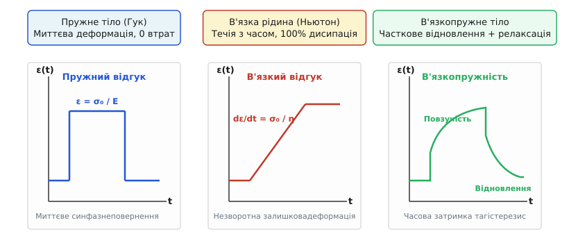
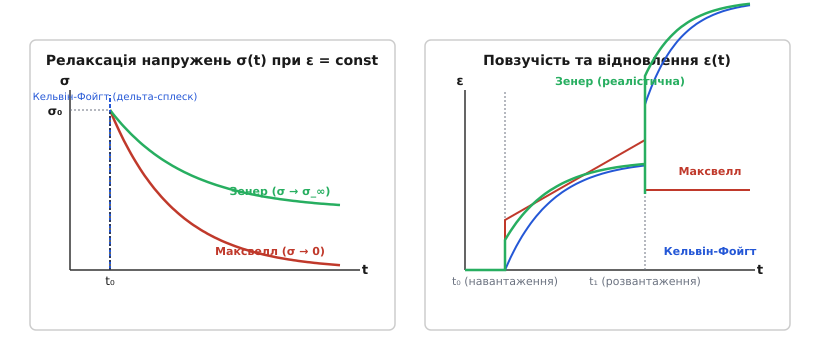
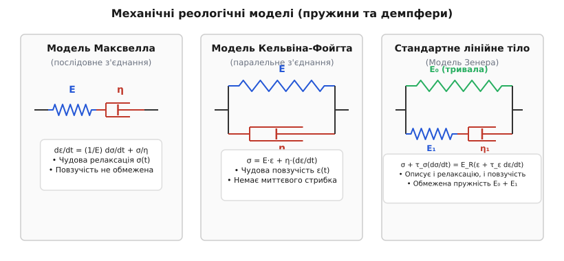
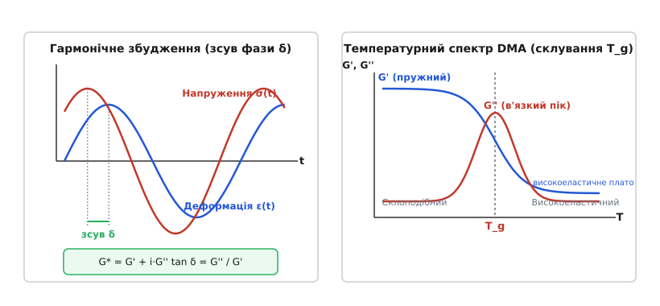
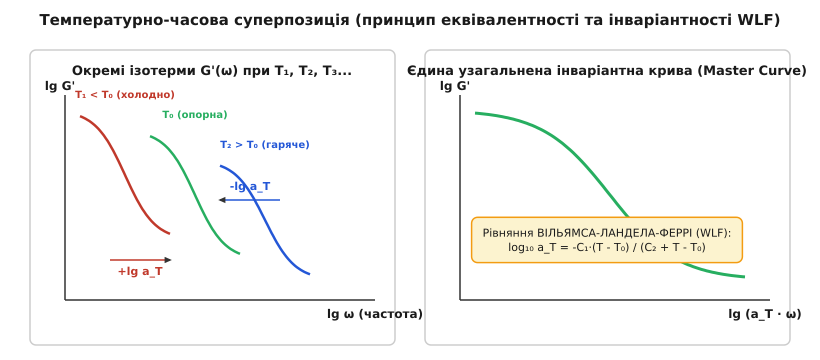

# В'язкопружність

<preknowlist>
- [Закон Гука](topic:ph-mechanics/hookes-law) — зв'язок між деформацією та напруженням у суто пружному тілі.
- [В'язкість](topic:ph-mechanics/viscosity) — внутрішнє тертя в рідинах та зв'язок між швидкістю деформації й дотичним напруженням.
- [Похідна](topic:math-analysis/derivative) — миттєва швидкість зміни величини в часі.
- [Комплексні числа](topic:math-analysis/complex-numbers) — алгебраїчний апарат для опису гармонічних коливань із зсувом фази.
</preknowlist>

Коли дитина кидає кульку з так званого «дурного пластиліну» (Silly Putty) на підлогу, матеріалознавець бачить фізичний парадокс. Зіткнувшись із плиточкою за тисячні частки секунди, кулька пружно відскочить майже як сталева кулька від ковадла. Але якщо залишити ту саму кульку на столі на пів години, вона під дією власної ваги повільно розпливеться на плаский млинець, немов крапля густого меду. Один і той самий матеріал поводиться як твердий кристал під час швидкого удару і як рідкий бальзам під час тривалого вилежування.

Ще яскравішим прикладом є знаменитий експеримент з капанням бітумної смоли, розпочатий Томасом Парнеллом у Квінслендському університеті в 1927 році. На вигляд бітум є твердим, крихким як скло чорним каменем, який можна легко розбити молотком на скалки. Проте, вміщений у скляну лійку, цей самий бітум повільно витікає під дією гравітації: за дев'ять десятиліть з лійки впало лише дев'ять крапель. Розрахована в'язкість бітуму виявилася приблизно в 230 мільярдів разів більшою за в'язкість води.

Цей двоїстий характер поєднує пружне збереження енергії та в'язке тертя. Матеріали з такою подвійною природою називають в'язкопружними. Їхній механічний відгук визначається не лише тим, **наскільки** їх деформували, а й тим, **як швидко** це зробили та **скільки часу** матеріал перебуває під навантаженням.



*В'язкопружність поєднує реакцію пружини та поршня: швидкість деформування вирішує, чи опиратиметься матеріал пружно, чи почне повільно текти.*

## Межа між твердим тілом і рідиною

У класичній механіці суцільних середовищ існує сувора математична межа між двома ідеальними полюсами. Справа стоїть пружне тіло Гука: при прикладанні напруження `σ` воно миттєво набуває деформації `ε = σ / E`, а після зняття сили негайно й безлишне повертається до початкової форми. Уся виконана робота зберігається у вигляді потенціальної енергії деформованих міжатомних зв'язків. Зліва стоїть ньютонівська рідина: напруження породжує не деформацію саму по собі, а швидкість деформації `dε/dt = σ / η`. Рідина не має пам'яті про початкову форму, а вся механічна робота незворотно дисипує в тепло через внутрішнє тертя.

В'язкопружне тіло займає простір між цими полюсами. Його можна уявити як систему, де міжатомні чи міжмолекулярні зв'язки розтягуються пружно, але одночасно з цим повільно перебудовуються під дією теплового руху, даючи молекулам змогу проковзувати одна повз одну.

Щоб розрізнити, що перед нами в даному фізичному процесі — тверде тіло чи рідина, використовують безрозмірне **число Дебори** (`De`). Його назвав ізраїльський реолог Маркус Райнер на честь біблійної пророчиці Дебори, яка у своєму піснеспіві мовила: *«Гори танули перед лицем Господа»* — тобто навіть гори течуть, якщо постати перед вагою часу:

```
De = τ / t_obs
```

де `τ` — характерний час релаксації матеріалу (час, потрібний для перебудови його внутрішньої мікроструктури), а `t_obs` — час спостереження або тривалість механічного впливу.

Якщо `De ≫ 1` (час спостереження значно менший за час релаксації), матеріал поводиться як тверде пружне тіло. Саме це відбувається з кулькою Silly Putty при ударі об підлогу (`t_obs ~ 1 мс ≪ τ ~ 1 с`). Якщо `De ≪ 1` (час навантаження набагато більший за час релаксації), той самий матеріал тече як рідина (`t_obs ~ 3600 с ≫ τ ~ 1 с`). 

Вода має час релаксації `τ ~ 10⁻¹² с`, тому в повсякденному житті вона завжди є рідиною; але при ультракоротких ударах лазерного фемтосекундного імпульсу навіть вода реагує як пружна тверда поверхня. Лід у гірських льодовиках має час релаксації `τ ~ 10⁵ с` (кілька діб), тому для ковзаняра на ковзанці він є твердим кришталем, а для геолога — повільною рідиною, що стікає з гірських долин протягом десятиліть.

## Дві магістральні прояви: релаксація та повзучість

В'язкопружний матеріал проявляє часову залежність у двох фундаментальних експериментальних режимах: релаксації напружень та повзучості.



*Релаксація «розряджає» напруження при фіксованому зсуві, тоді як повзучість розтягує матеріал під постійним ваговим навантаженням.*

### Релаксація напружень

Якщо в'язкопружний зразок миттєво деформувати на величину `ε₀` і зафіксувати його геометричні розміри (`ε = const`), початкове напруження `σ₀` не залишається сталим. З часом воно почне плавно спадати (релаксувати).

Це відбувається тому, що внутрішні макромолекули чи дефекти ґратки, опинившись у напруженому стані, під дією хаотичного теплового руху поступово змінюють свої конформації, знімаючи внутрішнє напруження та перетворюючи пружну деформацію на в'язке ковзання. Здатність зберігати напруження виражають часовим модулем релаксації `E(t) = σ(t) / ε₀`.

У рідинах та незшитих полімерних розплавах напруження врешті-решт релаксує до повного нуля. У в'язкопружних твердих тілах (як-от вулканізованих каучуках чи зшитих сітках) напруження падає не до нуля, а до певного скінченного рівноважного значення `σ_∞ = E_∞ · ε₀`.

### Повзучість та відновлення

Якщо до зразка прикласти стале напруження `σ₀` (`σ = const`), виникає зворотне явище — **повзучість** (нім. *Kriechen*, англ. *creep*). Спочатку матеріал деформується миттєво на пружну величину `ε_e = σ₀ / E₀`, але потім деформація продовжує неперервно зростати з часом.

У загальному випадку процес повзучості розбивають на три послідовні стадії:
1. **Первинна (неусталена) повзучість:** Швидкість деформації `dε/dt` висока, але швидко зменшується з часом через зміцнення внутрішньої структури.
2. **Вторинна (усталена) повзучість:** Швидкість деформації досягає стабільного мінімуму `dε/dt = const`. Тут процеси зміцнення та в'язкої релаксації повністю врівноважують один одного.
3. **Третинна повзучість:** Швидкість деформування стрімко зростає через утворення мікропорожнеч та тріщин, що завершується механічним руйнуванням матеріалу (creep rupture).

Якщо до настання руйнування напруження повністю зняти, деформація спадає за три етапи:
- **Миттєве пружне повернення:** Негайне зменшення деформації на пружну частку `ε_e`.
- **Затримане в'язкопружне відновлення:** Повільне зменшення деформації з часом за рахунок випрямлення пружно зігнутих полімерних елементів.
- **Залишкова незворотна деформація:** Пластичний або в'язкий зсув, який матеріал не здатен повернути самостійно.

Здатність накопичувати деформацію виражають функцією податливості повзучості `J(t) = ε(t) / σ₀`. Повна історична хроніка відкриття цих явищ наведена у вставці [Історія дослідження в'язкопружності](topic:ph-mechanics/viscoelasticity/hist-viscoelasticity.md).

**Умова.** Полімерна прокладка з початковим модулем `E₀ = 200 МПа` та часом релаксації `τ = 50 годин` затиснута у болтовому з'єднанні з постійною деформацією `ε₀ = 0.02`. Розрахувати початкове напруження та напруження через 100 годин роботи вузла за одноелементною моделлю Максвелла.

```
σ₀ = E₀ · ε₀ = 200 · 10⁶ · 0.02 = 4.0 · 10⁶ Па = 4.0 МПа   [миттєве напруження]

σ(t) = σ₀ · exp(-t / τ)                                 [закон релаксації]
σ(100) = 4.0 · exp(-100 / 50) = 4.0 · exp(-2.0)
       = 4.0 · 0.1353 = 0.541 МПа                       [напруження через 100 год]
```

**Висновок.** За 100 годин перебування під сталою деформацією напруження затискання прокладки впало з 4.0 МПа до 0.541 МПа — тобто на 86.5%. Якщо вузол герметично тримався лише за рахунок початкового притиску, з'єднання неминуче потече.

> 🔧 **Навіщо це.** Релаксація напружень — головна причина протікання фланцевих з'єднань, пластикових водопровідних труб та ослаблення натягу затискних клем. Інженер-конструктор мусить прораховувати не лише початкову міцність пластикового корпусу чи силіконового ущільнювача, а й залишкове зусилля притиску через 5–10 років експлуатації.

## Механічні реологічні моделі: пружини та демпфери

Щоб математично наочно описати поведінку в'язкопружних матеріалів, механіки створюють комбіновані схеми з двох базових елементів: ідеально пружної пружини Гука (характеризується модулем `E`) та ідеально в'язкого поршня-демпфера Ньютона (характеризується в'язкістю `η`).



*Конструктор з пружин та демпфери дає змогу наочно скласти диференціальне рівняння будь-якої складності.*

### Модель Максвелла (послідовна)

З'єднаємо пружину й демпфер послідовно. При прикладанні сили через обидва елементи тече однаковісіньке напруження `σ`, а загальна деформація є сумою деформацій: `ε = ε_e + ε_v`.

Продиференціювавши за часом, отримуємо диференціальне рівняння Максвелла:

```
dε/dt = (1/E) · (dσ/dt) + σ / η
```

Модель Максвелла чудово описує релаксацію напружень: при `ε = const` напруження згасає за експоненціальним законом `σ(t) = σ₀ · exp(-t / τ_R)`, де `τ_R = η / E` — час релаксації.

Проте ця модель погано описує повзучість твердих тіл: під дією сталого напруження `σ₀` поршень тече нескінченно з постійною швидкістю `dε/dt = σ₀ / η`, тобто модель Максвелла поводиться як в'язка рідина.

### Модель Кельвіна-Фойгта (паралельна)

З'єднаємо пружину й демпфер паралельно. Тепер обидва елементи змушені деформуватися на однакову величину (`ε_e = ε_v = ε`), а загальне напруження складається з їхніх сил:

```
σ(t) = E · ε(t) + η · (dε(t) / dt)
```

Ця модель ідеально описує затриману повзучість: при `σ = const` деформація наростає за законом `ε(t) = (σ₀ / E) · [1 - exp(-t / τ_D)]`, асимптотично наближаючись до обмеженого значення `σ₀ / E` з часом затримки `τ_D = η / E`.

Однако Кельвін-Фойгт зовсім не описує миттєву пружну деформацію (поршень не дає пружині стиснутися в перший момент) і передбачає нескінченно велике напруження при спробі миттєво змінити деформацію.

### Стандартне лінійне тіло (Модель Зенера)

Щоб усунути недоліки двох перших моделей, їх об'єднують. Модель Зенера (Standard Linear Solid, SLS) складається з пружини `E₀`, підключеної паралельно до послідовного елемента Максвелла (`E₁`, `η₁`).

Конститутивне рівняння моделі Зенера має вигляд:

```
σ + τ_σ · (dσ/dt) = E_R · [ε + τ_ε · (dε/dt)]
```

де `E_R = E₀` — рівноважний тривалий модуль, `E_U = E₀ + E₁` — мгновенний модуль, `τ_σ = η₁ / E₁` — час релаксації напружень, а `τ_ε = τ_σ · (E_U / E_R)` — час затримки деформації.

Модель Зенера є найпростішою фізично адекватною моделлю в'язкопружного твердого тіла: вона одночасно демонструє миттєвий пружний стрибок, скінченну релаксацію до ненульового рівня та обмежену повзучість.

Для точного кількісного аналізу складних полімерів розгортають ряди Проні — узагальнені моделі з десятками паралельних віток Максвелла. Строгий математичний вивід усіх рішень міститься у вставці [Математичний апарат в'язкопружності](topic:ph-mechanics/viscoelasticity/math-viscoelasticity.md).

## Динамічний механічний аналіз (DMA) та комплексний модуль

У реальних конструкціях (від амортизаторів підвіски до авіаційних деталей) в'язкопружні матеріали найчастіше працюють у умовах значних циклічних навантажень. Для їх дослідження використовують **Динамічний механічний аналіз** (Dynamic Mechanical Analysis, DMA).



*DMA розкладає відгук матеріалу на дві компоненти: пружну G' (пам'яті форми) та в'язкову G'' (поглинання шуму й тепла).*

Якщо піддати зразок гармонічній деформації з круговою частотою `ω`:

```
ε(t) = ε₀ · sin(ωt)
```

відгук напруження також буде синусоїдальним із тією самою частотою `ω`, але випереджатиме деформацію на кут фазового зсуву `δ`:

```
σ(t) = σ₀ · sin(ωt + δ)
```

За допомогою тригонометричного розкладу це напруження розбивають на дві компоненти:

```
σ(t) = ε₀ · [G'(ω) · sin(ωt) + G''(ω) · cos(ωt)]
```

де:
- **`G'(ω)` — модуль накопичення (Storage Modulus):** виражає пружну енергію, яка зворотно накопичується та віддається матеріалом за один цикл деформації. Він пропорційний `cos(δ)`.
- **`G''(ω)` — модуль втрат (Loss Modulus):** виражає механічну енергію, яка незворотно дисипує в тепло внаслідок внутрішнього в'язкого тертя за один цикл. Він пропорційний `sin(δ)`.

Використовуючи комплексний запис Ейлера `exp(i·ωt)`, вводять **комплексний модуль зсуву**:

```
G*(ω) = G'(ω) + i · G''(ω)
```

Абсолютна величина комплексного модуля `|G*| = √((G')² + (G'')²)` каже про загальну жорсткість матеріалу на даній частоті.

Важливим безрозмірним параметром є **тангенс кута механічних втрат**:

```
tan(δ) = G''(ω) / G'(ω)
```

Цей коефіцієнт показує відношення розсіяної енергії до накопиченої. Якщо `tan(δ) ≪ 0.01`, матеріал є майже суто пружним кристалом (сталь, кварц); якщо `tan(δ) ≫ 10`, перед нами рідка маса; якщо ж `tan(δ) ~ 0.1 ... 1.0`, матеріал є високоефективним вібродемпфером.

При зміні температури полімер проходить через кілька фізичних станів. Найважливішою є **температура склування** (`T_g`):
1. **Склоподібний стан (`T < T_g`):** Макромолекули заморожені, модуль `G'` високий (`1 ... 3 ГПа`), `tan(δ)` малий. Матеріал твердий та крихкий.
2. **Область склування (`T ≈ T_g`):** Сегменти полімерних ланцюгів набувають рухливості. Модуль накопичення `G'` падає на 3–4 порядки величини, а модуль втрат `G''` та `tan(δ)` доходять до свого максимуму.
3. **Високоеластичний стан (`T > T_g`):** Матеріал переходить у ґумоподібне плато. Модуль `G'` стабілізується на рівні `0.5 ... 10 МПа`, зразок легко розтягується й відновлюється.

**Умова.** Віброізолююча опора з еластомеру працює на частоті `f = 50 Гц` (`ω = 2π·f = 314.16 рад/с`). Вхідна деформація зсуву `ε₀ = 0.05`. При цій частоті за вимірюваннями DMA `G' = 4.0 МПа`, а `tan(δ) = 0.25`. Розрахувати модуль втрат `G''`, амплітуду напруження `σ₀` та дисиповану в 1 м³ матеріалу енергію за 1 секунду.

```
G'' = G' · tan(δ) = 4.0 · 0.25 = 1.0 МПа                [модуль втрат]

|G*| = √((G')² + (G'')²) = √(4.0² + 1.0²) = √(17.0)
     = 4.123 МПа                                        [комплексний модуль]

σ₀ = |G*| · ε₀ = 4.123 · 10⁶ · 0.05 = 2.061 · 10⁵ Па    [амплітуда напруження]
   = 206.1 кПа

W_loss = π · G'' · ε₀²                                  [енергія втрат за 1 цикл на м³]
W_loss = 3.14159 · 1.0·10⁶ · (0.05)² = 7854 Дж/м³

P_loss = W_loss · f = 7854 · 50 = 3.927 · 10⁵ Вт/м³     [розсіювана потужність]
       = 392.7 кВт/м³
```

**Висновок.** Кожен кубічний метр еластомерного демпфера при циклічному деформуванні розсіює майже 393 кіловати механічної енергії, перетворюючи її на тепло. Якщо не забезпечити тепловідведення, віброізолятор швидко перегріється та розплавиться внаслідок теплового розгону (thermal runaway).

> 🔧 **Навіщо це.** На балансі `G'` та `G''` базується розробка автомобільних шин. Щоб шина мала малий опір коченню на низьких частотах обертання колеса (10–20 Гц), матеріал мусить мати низький `tan(δ)` при кімнатній температурі. Але щоб шина надійно чіплялася за асфальт при мікроковзанні на високих частотах (10⁴–10⁶ Гц), її `tan(δ)` на цих частотах має бути максимальним. Створення таких «розумних» протекторів — вершина полімерної реології.

## Температурно-часова суперпозиція (TTS) та рівняння WLF

Виміряти в'язкопружні характеристики матеріалу у всьому діапазоні часу (наприклад, оцінити повзучість пластмасової кришки за 30 років) у звичайній лабораторії прямим шляхом неможливо. Для розв'язання цієї проблеми застосовують **Принцип температурно-часової суперпозиції** (Time-Temperature Superposition, TTS).



*Гаряче і повільне еквівалентне холодному й швидкому: підвищення температури просто прискорює годинник молекулярних релаксацій.*

Фізична основа принципу полягає в тому, що молекулярні релаксаційні процеси в полімерах мають термоактивовану природу. Підвищення температури прискорює хаотичний рух сегментів макромолекул, що еквівалентно розтягуванню або стисканню масштабу часу. Іншими словами: **поведінка полімеру при високій температурі протягом короткого часу достеменно тотожна його поведінці при низькій температурі протягом тривалого часу**.

Щоб побудувати узагальнену криву (Master Curve):
1. Вимірюють криві `G'(ω)` або `E(t)` у вузькому доступному діапазоні частот (наприклад, 0.1 ... 100 Гц) при серії різних температур `T₁, T₂, T₃...`.
2. Обирають опорну температуру `T₀` (зазвичай `T_g`).
3. Криві, зняті при інших температурах, зсувають горизонтально вздовж логарифмічної осі частоти `log₁₀(ω)` або часу `log₁₀(t)` на величину **коефіцієнта зсуву** `log₁₀(a_T)`.

Для аморфних полімерів у діапазоні від `T_g` до `T_g + 100 °C` коефіцієнт зсуву `a_T` описується емпіричним **рівнянням Вільямса-Ландела-Феррі (WLF)**:

```
log₁₀(a_T) = - C₁ · (T - T₀) / [C₂ + (T - T₀)]
```

де `C₁` та `C₂` — константи матеріалу. Якщо за опорну температуру `T₀` взяти температуру склування `T_g`, то для більшості аморфних полімерів константи виявляються близькими до універсальних значень: `C₁ ≈ 17.44`, `C₂ ≈ 51.6 К`.

При `T > T₀` коефіцієнт `a_T < 1` (крива зсувається вправо, в бік вищих ефективних частот). При `T < T₀` коефіцієнт `a_T > 1` (крива зсувається вліво). Це дає змогу за кілька годин лабораторних випробувань при підвищених температурах отримати узагальнений спектр жорсткості матеріалу, що охоплює 10–15 порядків величини за часом.

Нижче температури склування (`T < T_g`) коефіцієнт зсуву `a_T` підпорядковується не рівнянню WLF, а класичному закону Арреніуса з постійною енергією активації `E_a`:

```
ln(a_T) = (E_a / R) · (1/T - 1/T₀)
```

Це пояснюється тим, що при `T < T_g` великомасштабний рух ланцюгів заморожений, і релаксація відбувається лише за рахунок обертання бокових груп або малих сегментів ланцюга (вторинні `β`- та `γ`-релаксації).

## Нелінійна в'язкопружність та реологічні ефекти

При великих деформаціях або високих швидкостях зсуву лінійна теорія Больцмана перестає працювати: модуль релаксації починає залежати від самої величини деформації `E(t, ε)`, виникають нелінійні феномени.

### 1. Ефект Вайссенберга (піднімання по ротору)
Якщо у звичайну ньютонівську рідину (наприклад, воду) опустити вертикальний стержень і швидко його закрутити, відцентрова сила відкине рідину до стінок посудини, утворивши воронку в центрі.

Проте якщо закрутити стержень у в'язкопружному розчині полімеру (наприклад, розчині поліакриламіду чи сирому курячому білку), рідина поводиться навпаки: вона вилізає вгору по стержню проти сили тяжіння. Це відбувається через виникнення першої різниці нормальних напружень `N₁ = σ_11 - σ_22`. Розтягнуті вздовж колових ліній току полімерні макромолекули діють подібного до розтягнутих гумових кілець, стискаючи рідину до осі обертання й виштовхуючи її вгору.

### 2. Здуття струменя при екструзії (Die Swell / Extrudate Swell)
Коли висококонцентрований розплав полімеру під тиском продавлюється крізь вузьке сопло екструдера з діаметром `D₀`, на виході зі сопла діаметр струменя `D` несподівано зростає в 1.5–3 рази (`D > D₀`).

Фізична причина полягає в тому, що під час проходження крізь вузький канал полімерні клубки сильно орієнтуються й поздовжньо витягуються. На виході з сопла обмежувальні стінки зникають, і пружно орієнтовані макромолекули миттєво конформаційно скорочуються назад, розширюючи діаметр струменя.

### 3. Ефект відкритого сифона (Tubeless Siphon)
В'язкопружну полімерну рідину можна переливати через край стакана взагалі без фізичної трубки. Якщо започаткувати цівку за допомогою шприца й підняти його над поверхнею, цівка продовжуватиме самостійно висмоктувати рідину зі стакана вгору за рахунок високих поздовжніх натяжних напружень уздовж орієнтованих полімерних ланцюгів.

## Мікроскопічна природа в'язкопружності

Звідки береться часова залежність механічних властивостей на рівні внутрішньої структури речовини? Відповідь залежить від класу матеріалу.

### Полімери та аморфні речовини

У полімерах в'язкопружність визначена конформаційною рухливістю гнучких макромолекулярних ланцюгів. 
- При миттєвому розтягу полімерні клубки запізнюються з розгортанням — розтягуються лише міжмолекулярні вандерваальсові зв'язки (високий склоподібний модуль).
- З часом під дією теплового руху сегменти ланцюгів починають повертатися довкола одинарних `C-C` зв'язків, розгортаючи клубки у витягнуті конформації. Це створює ентропійну пружність (ґумоподібний стан).
- У незшитих полімерах макромолекули поступово вислизають зі своїх зачеплень. Видатний фізик П'єр-Жіль де Жен описав цей рух моделлю **рептації**: полімерний ланцюг змієподібно поповзом просувається всередині вузької трубчастої області, сформованої оточуючими сусідніми ланцюгами.

### Метали та кераміка при високих температурах

Хоча метали при кімнатній температурі вважають суто пружно-пластичними матеріалами, при нагріванні понад `(0.4 ... 0.5)·T_melt` (у абсолютних Кельвінах) вони демонструють виражену в'язкопружність та повзучість.

Мікроскопічні механізми тут інші:
1. **Міжзеренне ковзання:** Кристалічні зерена металу розділені тонким хаотичним міжзеренним прошарком, який при високій температурі поводиться як аморфна в'язка плівка, дозволяючи зеренам повільно зміщуватися одне відносно одного.
2. **Дифузійне повзання (Creep):** Атоми й вакансії в кристалічній ґратці спрямовано дифундують від граней зерен, що перебувають під стиском, до граней, що перебувають під розтягом (дифузія Набарро-Геррінґа крізь об'єм зерна та дифузія Кобла вздовж меж зерен).
3. **Переповзання дислокацій:** Дислокації, заблоковані домішками чи іншими дефектами, під дією температури захоплюють вакансії й «вибираються» в сусідні площини ковзання, знімаючи внутрішнє напруження.

### Біологічні тканини

Суглобовий хрящ, зв'язки, шкіра та стінки кровеносних судин є високообводненими двофазними в'язкопружними композитами. Вони складаються з твердого колагеново-протеогліканового каркасу, просоченого міжклітинною рідиною.

При стисканні хряща в суглобі напруження спочатку сприймається тиском затиснутої рідини. Потім рідина починає повільно видавлюватися крізь мікроскопічні пори колагенової сітки. Цей перенос маси рідини у порваному середовищі створює фільтраційну в'язкопружність, яка захищає кістки від руйнівних ударних навантажень під час стрибків.

## Інженерний розрахунок та чисельне моделювання

Сучасне проектування відповідальних в'язкопружних деталей виконується за допомогою скінченноелементного аналізу (FEA) у пакетах Abaqus, ANSYS чи COMSOL.

Для математичного опису матеріалу в солевер вносять коефіцієнти дискретного **ряду Проні** (узагальненої моделі Максвелла):

```
G(t) = G_∞ + ∑_{i=1}^N G_i · exp(-t / τ_i)
```

де `G_∞` — тривалий модуль зсуву, `G_i` — модулі окремих віток, а `τ_i` — відповідні часи релаксації. Для перекриття діапазону від мілісекунд до років використовують від 3 до 10 віток Проні з часовими інтервалами, рознесеними на один порядок величини (`τ_i = 0.001, 0.01, 0.1, 1, 10, 100...` с).

Солевер розв'язує систему диференціальних рівнянь на кожному кроці за часом `Δt`, використовуючи внутрішні змінні стану (State Variables) для кожного скінченного елемента. Ознайомитися з реалізацією чисельних солеверів мовами C та C++ можна у вставці [Чисельне моделювання в'язкопружної релаксації](topic:ph-mechanics/viscoelasticity/proj-viscoelasticity.md). Повні матриці рівнянь та інженерні таблиці параметрів наведено у [Довіднику в'язкопружних моделей та параметрів](topic:ph-mechanics/viscoelasticity/api-viscoelasticity.md).

Типові помилки, яких припускаються недосвідчені інженери при неврахуванні в'язкопружності:
- **Розрахунок за короткочасним модулем Юнга:** Використання паспортного модуля з довідника (отриманого за 1 хвилину стандартного розтягу) для деталей, що працюють під навантаженням роками, призводить до перевищення допустимих деформацій у 3–5 разів.
- **Ігнорування температурного розігріву:** Нехтування в'язкими втратами `G''` в амортизаторах чи сайлентблоках призводить до їхнього швидкого саморазогреву, деструкції полімеру та катастрофічної відмови.
- **Нехтування релаксацією болтових з'єднань:** Затягування сталевих болтів у пластикових корпусах без використання металевих втулок спричиняє швидке падіння притискного зусилля та розгерметизацію приладу.

Урахування законів в'язкопружності перетворює часовий чинник із непередбачуваного ворога конструкції на керований параметр надійності.
