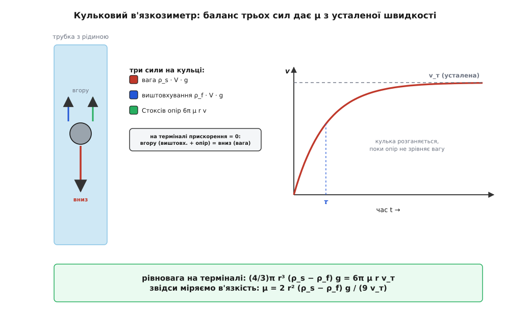

# ⚙️ Кульковий в'язкозиметр: μ зі швидкості падіння кульки

**Задача.** Перед нами склянка невідомої рідини — цукровий сироп, трансформаторна олія, гліцерин, розплав полімеру, плазма крові — і одне питання: яка в неї в'язкість? Не «густа чи рідка на око», а число, μ у паскаль-секундах, яке можна записати в паспорт партії чи підставити у формулу течії. Дорогого ротаційного реометра під рукою немає. Зате є найдешевший вимірювач з усіх: кинути в рідину кульку й подивитися, як швидко вона тоне.

Уся хитрість у тім, що кулька тоне не як заманеться, а зі строго визначеною швидкістю, яку диктує в'язкість. Густіша рідина тримає кульку дужче — та опускається ліниво; рідша майже не опирається — кулька падає прудко. Тобто швидкість падіння **несе в собі** μ, і лишається прочитати її звідти назад. Це і є кульковий (Стоксів) в'язкозиметр — один з небагатьох *абсолютних* приладів, що дають в'язкість прямо з фізики, а не з порівняння з еталонною рідиною. Він охоплює приголомшливий діапазон — від легких олив до майже застиглого гліцерину й силікатних розплавів, — прозорий до останнього гвинтика й коштує як пробірка та кулька від підшипника. За цю простоту, щоправда, доводиться платити пильністю: під нею сховані рівно три пастки, і кожна легко зіпсує результат у рази. Спершу розберімо, звідки береться число, тоді — як його порахувати, і аж наприкінці — де воно бреше.

**Ідея: баланс трьох сил.** Щойно кулька занурилась, на неї діють три сили, і всі вздовж однієї вертикалі. Вниз тягне **вага** — стільки, скільки важить сама кулька. Угору штовхають дві: **виштовхування** (Архімедова сила — вага витісненої рідини) і **опір** рідини рухові. Перші дві сталі — їм байдуже, швидко чи повільно кулька йде. А от опір росте разом зі швидкістю: що прудкіше кулька продирається крізь рідину, то дужче та впирається.

На старті кулька нерухома, опору ще нема, і вага перемагає — кулька рушає й пришвидшується. Але з кожним доданим метром за секунду опір міцнішає, аж поки не дожене вагу за відрахуванням виштовхування. Тоді три сили зрівноважуються, прискорення падає до нуля, і далі кулька йде **рівномірно** — з так званою усталеною (термінальною) швидкістю v_т. Оце та єдина швидкість, яку ми міряємо.

Опір повільної кульки в рідині описує закон Стокса — Джордж Ґабріел Стокс вивів його 1851 року, розв'язуючи, як в'язке середовище гальмує гойдання маятника (праця «Про вплив внутрішнього тертя рідин на рух маятників»). Сила виходить прямою й чистою: F_о = 6·π·μ·r·v. Прирівняймо на терміналі верх до низу:

```
вниз:   ρ_s · V · g                       (вага;  V = ⁴⁄₃·π·r³)
вгору:  ρ_f · V · g   +   6π·μ·r·v_т       (виштовхування + Стоксів опір)

термінал:  ρ_s·V·g  =  ρ_f·V·g + 6π·μ·r·v_т
           (ρ_s − ρ_f) · ⁴⁄₃·π·r³ · g  =  6π·μ·r·v_т
```

Придивіться, що ліворуч лишилась **різниця** густин ρ_s − ρ_f, а не сама густина кульки — і це аж ніяк не дрібниця. Виштовхування з'їдає частину ваги, тож кулька тоне не так, наче вона в порожнечі. Для сталевої кульки у воді поправка на виштовхування — близько 13 %; для легкої кульки в густій рідині вона може з'їсти майже всю вагу, а якщо кулька легша за рідину — та взагалі спливе, і жодного падіння не буде. Важить саме різниця густин, яку сюди приносить [густина](root:ph-mechanics/density) обох тіл.

Лишилось виразити звідси μ. Скорочуємо спільне π·r, зводимо дроби — і весь прилад стискається в один рядок:

```
μ = 2 · r² · (ρ_s − ρ_f) · g / (9 · v_т)
```

Зміряй радіус кульки, візьми з довідника дві густини — і одна-єдина зміряна швидкість дає в'язкість.



*Кулька розганяється лише доти, доки опір, що росте зі швидкістю, не зрівняє вагу за виштовхуванням. Далі вона йде рівномірно — і саме ця усталена швидкість, підставлена в один рядок, дає в'язкість.*

Дві речі, однак, ця гарна формула мовчки припускає, і обидві доведеться перевірити. **Перше:** кулька справді має йти *усталено* — якщо ми засікли її, поки вона ще розганяється, v виявиться заниженою, а μ — завищеною. Наскільки швидко встановлюється термінал? Рівняння руху лінійне за швидкістю, тож вона підходить до межі за експонентою, v(t) = v_т·(1 − e^(−t/τ)), з характерним часом

```
τ = 2 · ρ_s · r² / (9 · μ)
```

Для сталевої кульки в гліцерині це якісь 1.7 мілісекунди — кулька виходить на термінал майже миттю, ще не пройшовши й сотні мікрометрів. Ось чому в'язкі рідини так зручно міряти. **Друге:** опір і досі має бути суто Стоксовим, 6πμrv, а не чимось складнішим — а це вимагає, щоб кулька саме *повзла*, а не мчала. Обидва припущення зводяться до одного: рух має бути повільним і встановленим. Тримаймо це в голові — з нього виростуть усі три пастки.

**Робочий код.** Задача суто числова й майже не має «мови» — це три формули й одна перевірка, — тож пишемо Python, де вони читаються так само, як на папері. Уся фізика вміщається в чотири короткі функції.

```py
import math

g = 9.81  # м/с²   прискорення вільного падіння

def stokes_viscosity(r, rho_s, rho_f, v):
    "μ з усталеної швидкості: Стокс із поправкою на виштовхування. → Па·с"
    return 2.0 * r*r * (rho_s - rho_f) * g / (9.0 * v)

def reynolds(r, rho_f, v, mu):
    "Число Рейнольдса за діаметром кульки d = 2r. Стокс чинний, поки Re « 1."
    return rho_f * v * (2.0 * r) / mu

def wall_factor(r, R):
    "Пристінкове гальмо L = 1 + 2.104·(r/R). Уявну μ ділимо на L.  (r/R ≲ 0.1)"
    return 1.0 + 2.104 * (r / R)

def faxen_factor(r, R):
    "Повний ряд Факсена для осі циліндра — чинний аж до r/R ≈ 0.3."
    x = r / R
    return 1.0 / (1.0 - 2.10444*x + 2.08877*x**3 - 0.94813*x**5)
```

Тепер зразковий дослід. Хромована сталева кулька діаметром 2 мм падає у вертикальній трубці внутрішнім діаметром 25 мм, повній гліцерину. Секундоміром засікаємо: між двома позначками, що за 100 мм одна від одної, кулька йшла 8.13 с.

```py
r     = 1.0e-3     # радіус кульки, м       (діаметр 2 мм)
R     = 12.5e-3    # внутрішній радіус трубки, м  (діаметр 25 мм)
rho_s = 7850.0     # хромована сталь, кг/м³
rho_f = 1260.0     # гліцерин при 20 °C, кг/м³

v_meas  = 0.100 / 8.13                          # усталена швидкість у трубці, м/с
mu_app  = stokes_viscosity(r, rho_s, rho_f, v_meas)
L       = wall_factor(r, R)
mu_corr = mu_app / L                            # прибираємо пристінкове гальмо
Re      = reynolds(r, rho_f, v_meas, mu_corr)

print(f"v_виміряна      = {v_meas*100:.2f} см/с")
print(f"μ (сира)        = {mu_app:.3f} Па·с   ← ще з пристінковим гальмом")
print(f"r/R = {r/R:.3f}   L = {L:.3f}")
print(f"μ (з поправкою) = {mu_corr:.3f} Па·с")
print(f"Re              = {Re:.4f}")
```

Запуск друкує:

```
v_виміряна      = 1.23 см/с
μ (сира)        = 1.168 Па·с   ← ще з пристінковим гальмом
r/R = 0.080   L = 1.168
μ (з поправкою) = 1.000 Па·с
Re              = 0.0310
```

Прочитаймо це рядок за рядком, бо кожен щось важить. Сира швидкість дає **1.168 Па·с** — але це ще не в'язкість гліцерину, а в'язкість гліцерину *плюс* гальмо від близьких стінок трубки. Кулька мала проти трубки — її радіус лише вісім сотих трубчастого (r/R = 0.08), — та навіть так близькі стінки підгальмовують її, наче рідина трохи «густіша», ніж насправді. Пристінковий множник L = 1.168 знімає цю ілюзію: **1.168 / 1.168 = 1.000 Па·с** — рівно та в'язкість, яку й має чистий гліцерин при 20 °C. І остання, найважливіша перевірка: **Re = 0.031**, глибоко в повзкому режимі — Стокс тут точний, і формулі можна вірити. Три числа, один рядок арифметики — і невідома рідина видала свою в'язкість.

**Складність і пастки.** Обчислень тут — два множення й ділення, і боятися їх нема чого: жодних циклів, жодної збіжності, відповідь миттєва. Уся небезпека в іншому — чи виконуються ті мовчазні припущення. Ось три пастки, розставлені за підступністю: перша ламає результат у рази, друга — тихо зміщує, третя — псує на десятки відсотків, якщо її проґавити.

*Пастка перша, найгрубша: кулька мчить, а не повзе (завелике Re).* Стоксів опір 6πμrv — це закон **повзкої** течії, коли рідина слухняно обтікає кульку шар за шаром, а інерція не важить. Щойно кулька розганяється, за нею зривається слід, потім вихори, і опір перестає бути лінійним за швидкістю — до нього додається інерційний доданок (перша поправка — Осінова, F ≈ 6πμrv·(1 + 3/16·Re)), а далі опір і зовсім переходить у квадратичний. Межу стереже [число Рейнольдса](root:ph-mechanics/reynolds-number) — безрозмірне відношення інерції потоку до в'язкого тертя, Re = ρ_f·v·d/μ. Стокс точний при Re → 0; до 10 % він тримається, поки Re < 1; для чесних результатів беруть Re < 0.1. У нашому гліцерині Re = 0.031 — запас потрійний.

А тепер спокуса, якої слід уникати: узяти ту саму сталеву кульку, але кинути її не в гліцерин, а у **воду**.

```py
mu_water = 1.0e-3
v_pred   = 2*r*r*(7850 - 1000)*g / (9 * mu_water)     # що «пророчить» Стокс
print(v_pred, reynolds(r, 1000, v_pred, mu_water))
# → 14.9 м/с ,  Re ≈ 3·10⁴   ← нонсенс
```

Стокс «пророчить» кульці 15 метрів за секунду й число Рейнольдса під тридцять тисяч. Це, звісно, дичина: за таких швидкостей рідина давно зривається в турбулентний слід, і насправді така кулька тоне десь 0.6 м/с — удвадцятеро повільніше за Стоксову фантазію, під владою вже квадратичного опору. Якби ми наївно вставили *справжню* виміряну швидкість (ті 0.6 м/с) у нашу формулу, вона видала б в'язкість води разів у двадцять завищену. Логіка помилки одна на всі випадки: додатковий інерційний опір гальмує кульку сильніше, ніж чистий Стокс, — вона йде повільніше, а формула читає цю повільність як зайву в'язкість і завищує μ. Захист простий — рахувати Re й голосно спинятися, коли він перестрибує одиницю:

```py
if Re > 1.0:
    print(f"УВАГА: Re = {Re:.1f} — вже не повзка течія, Стокс НЕ діє")
```

Лік звідси такий: під в'язку рідину кулька майже будь-яка; під рідку — бери крихітну або менш контрастну за густиною, аби Re лишався малим. Кульковий в'язкозиметр — прилад для *в'язкого*, і тим він в'язкіший, тим на ньому легше.


*Той самий прилад чинний лише в лівій частині осі. Крихітне Re гліцеринового досліду — золота середина; сталева кулька у воді вилітає на протилежний край, у турбулентність, де Стоксова формула бреше в рази.*

*Пастка друга, тиха: кулька ще не встановилась.* Формула вимагає *усталеної* швидкості, а біля поверхні кулька ще розганяється й іде повільніше за термінал. Засічеш її там — занизиш v, завищиш μ. Ми вже бачили характерний час розгону τ = 2·ρ_s·r²/(9·μ), а відстань, яку кулька пробігає, поки виходить на термінал, — порядку v_т·τ. Підставмо залежності: v_т ∝ 1/μ і τ ∝ 1/μ, тож **розгінна відстань спадає як 1/μ²**. Для гліцерину це двадцять мікрометрів — кулька усталюється, ще не встигнувши й ворухнутись помітно. А от у рідині вдесятеро рідшій та сама відстань уже в сто разів більша — сантиметри, і першу позначку доводиться ставити добряче нижче поверхні, давши кульці спокійно розігнатись. Звідси проста осторога: не міряй згори; перша позначка — після кількох сантиметрів вільного ходу.

Зверніть увагу, як дві перші пастки чіпляються одна за одну. В'язка рідина усталюється миттєво (мала τ) *і* повзе (мале Re) — рай для методу. Рідка рідина усталюється поволі *і* норовить у турбулентність — обидві пастки клацають разом. Тому солодка пляма приладу — це саме густі, в'язкі рідини з маленькою щільною кулькою: така пара і повзе, і встановлюється майже вмить.

*Пастка третя, підступна числом: стінки трубки (поправка Ладенбурга).* Закон Стокса виведено для кульки в **безмежній** рідині. У реальній трубці рідина, яку кулька розштовхує, мусить кудись подітися — а їй нікуди, крім вузького зазору між кулькою й стінкою. Це протискання додає опору, кулька йде повільніше, ніж ішла б у безмежжі, і сира μ виходить завищеною. Поправку на це першим дав 1907 року Рудольф Ладенбург (німецький фізик) у вигляді лінійного множника; трохи згодом Гілдінг Факсен (шведський фізик) уточнив коефіцієнт до 2.104 і виписав повний збіжний ряд. У нашому коді обидві форми поряд:

```py
for ratio in (0.08, 0.15):
    lin = wall_factor(ratio, 1.0)          # 1 + 2.104·(r/R)
    fax = faxen_factor(ratio, 1.0)         # повний ряд
    print(f"r/R={ratio}:  лінійна={lin:.3f}  Факсен={fax:.3f}  "
          f"розбіжність={100*(fax-lin)/fax:.1f}%")
# r/R=0.08:  лінійна=1.168  Факсен=1.201  розбіжність=2.7%
# r/R=0.15:  лінійна=1.316  Факсен=1.447  розбіжність=9.1%
```

Лінійне «1 + 2.1·r/R» — не універсальна істина, а лише перший доданок, чинний доти, доки кулька дрібна проти трубки: r/R ≲ 0.1. Уже за нашого скромного r/R = 0.08 повний ряд на 2.7 % вищий — це прямий доданок до похибки μ. А візьміть удвічі більшу кульку (r/R = 0.15) — і лінійна форма занижує гальмо аж на 9 %: стільки ж і збрешете у в'язкості, якщо не перейдете на ряд Факсена. Тому в коді пристінкова поправка не вбита числом, а рахується щоразу під конкретне r/R.


*Стінки завжди підгальмовують кульку, і що вона більша проти трубки, то дужче. Лінійної поправки досить для тонких кульок; за товстіших треба повний ряд, інакше в'язкість попливе на відсотки.*

І це ще не вся геометрія. Крім бічних стінок, гальмує й **скінченна довжина** стовпа — близькі дно та вільна поверхня додають меншу, «торцеву» поправку (порядку 1 + 3.3·r/H, де H — відстань до кінців), тож кульку тримають подалі від обох. І сама кулька має падати **точно по осі**: збита до стінки, вона гальмується інакше, ніж каже осьова формула. Гарний спосіб перевірити себе без довідника — прогнати кілька кульок різного розміру: після правильної пристінкової поправки всі мають дати ту саму μ; розповзаються — виправлення взято не те.

Нарешті, дві осторони поза самою механікою падіння. **Температура:** в'язкість круто залежить від неї (для гліцерину чи олив кілька десятих градуса вже помітно зсувають число), тому серйозний прилад тримають у водяній сорочці — саме так влаштований класичний в'язкозиметр Фріца Гьопплера (німецький хімік), що 1933 року стандартизував кульковий метод; у ньому трубку ще й нахиляють на 80°, щоб кулька котилася вздовж стінки в незмінній геометрії. Ціна за цю відтворюваність — прилад стає **відносним**: його калібрують еталонною рідиною, і наша чиста абсолютна формула для нього вже лише кістяк. **Ньютонівськість:** уся викладка припускає, що μ — стала рідини. Для сиропу чи олії так і є, а от у кетчупу, крові чи полімерного розчину в'язкість залежить від того, як швидко їх зсувають, і кулька зміряє якесь *ефективне* μ при тій швидкості зсуву, яку сама й створює довкола себе, — одним числом такі рідини не описати.

> 🔧 **Навіщо це.** На цьому падінні тримається не лише лабораторний вимір. Тим самим балансом ваги, виштовхування й Стоксового опору осідає мул у стоячій воді, повагом опускається планктон, роками не сідає пил у повітрі кімнати — усе це кульки, що знайшли свою термінальну швидкість. Той-таки розрахунок каже геологові, як довго частинки різного розміру мандрують у товщі води (звідки й сортування осадів за крупністю), а біохімікові — з якою силою центрифугувати, щоб осадити клітину заданого розміру. Один рядок μ = 2r²(ρ_s−ρ_f)g/(9v_т) працює в обидва боки: знаєш в'язкість — передбачиш, хто як тоне; зміряв, хто як тоне, — дістав в'язкість.

Ось у чому краса цього приладу. Він не має ні рухомих частин, ні електроніки — сама фізика падіння. Три сили сходяться в одну рівновагу, рівновага дає одне число, а три перевірки — повзе, встановилась, не чіпає стінок — стережуть, щоб те число було правдою, а не артефактом. Кинь кульку, засічи час, поділи — і рідина сама зізнається, наскільки вона густа на плин.
