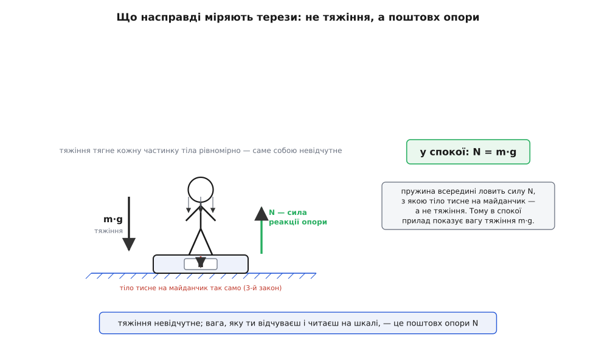
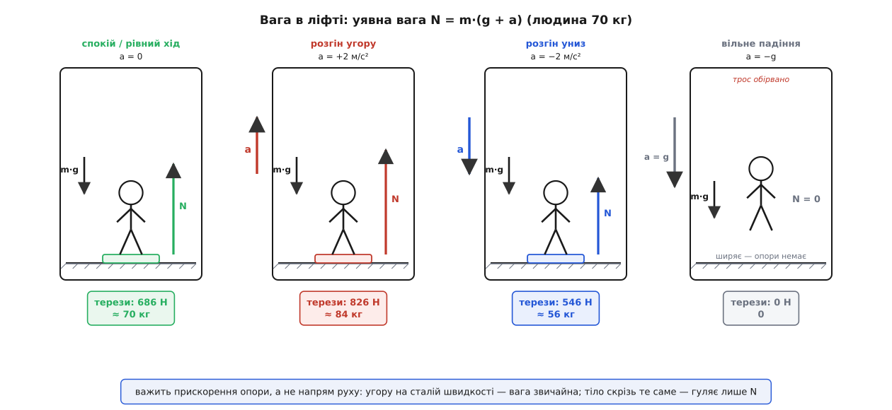
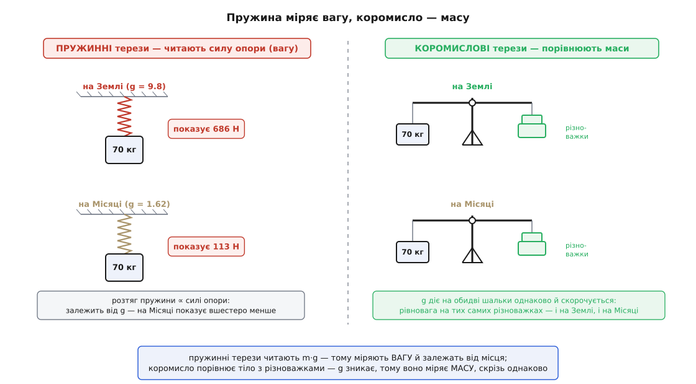

# Вага: сила, з якою тебе притискає до опори

<preknowlist>
- [Сила](topic:ph-mechanics/force) — штовхання чи тяжіння; вага — це різновид сили, тож міряється в ньютонах, а не в кілограмах.
- [Маса](topic:ph-mechanics/mass) — стала міра інертності тіла; вага дається добутком m·g, і плутати одне з одним не можна.
- [Прискорення](topic:ph-mechanics/acceleration) — швидкість зміни швидкості; щойно опора під тобою прискорюється, вага, яку ти відчуваєш, змінюється.
- [Другий закон Ньютона](topic:ph-mechanics/newtons-second-law) — сила = маса · прискорення; саме з нього виходить, скільки покажуть терези під тобою.
- [Закон всесвітнього тяжіння](topic:ph-mechanics/newton-gravitation) — звідки береться прискорення g і чому вага залежить від того, де ти опинився.
</preknowlist>

«Скільки ти важиш?» Питання здається найпростішим у світі: стань на терези, глянь на число. Та за цим числом ховається більше, ніж видно. Терези не міряють тяжіння. Показане ними «важиш» — не стала прикмета твого тіла: воно росте в ліфті, що рушає вгору, зникає геть на орбіті, і навіть коли ти спокійно стоїш, прилад під ногами насправді ловить не те, що ти думаєш. Вага — одне з тих буденних слів, які при найменшому натиску розсипаються на кілька різних речей.

Саме слово підказує, звідки танцювати. «Вага» прийшла до нас із давньоверхньонімецького *wāga* — «терези, шальки» (спорідненого з сучасним нім. *Waage* — ваги, *wiegen* — важити, і з англ. *weigh* — зважувати, *wain* — віз), імовірно через польське *waga*. Тобто в корені лежить не абстрактна «сила тяжіння», а цілком конкретний прилад — коромисло терезів — і дія зважування на ньому. Це не випадковість. Вага від початку прив'язана до **зважування**, до того, як тіло тисне на щось, що його тримає. Тримаймося цієї нитки — вона доведе до самої суті.

### Вага — це сила, а не маса

Найперше треба розчепити вагу й [масу](topic:ph-mechanics/mass), бо в щоденній мові це одне, а у фізиці — різні речі. Маса — стала властивість самого тіла: скільки в ньому впертості, скільки речовини; вона в кілограмах і не міняється, хоч на Землю тіло понеси, хоч на Місяць. Вага — це **сила**, з якою тяжіння тягне тіло донизу, тож вона в ньютонах і дається добутком

```
P = m · g
```

де g — прискорення вільного падіння в цьому місці (біля поверхні Землі ≈ 9.8 м/с²). Понесіть те саме тіло на Місяць — маса лишиться тією самою, а вага впаде десь вшестеро, бо там слабше тяжіння. Оце й уся арифметика на позір. Але вона оманливо проста, і щоб побачити, у чім підступ, треба спитати не «чому тіло важить», а зовсім інше: **що саме показують терези?**

### Терези міряють не тяжіння

Ось перша несподіванка, і вона глибша, ніж здається. Коли ти стоїш на вагах, тяжіння тягне вниз кожну клітинку твого тіла — рівномірно, усю до останньої. А рівномірне тяжіння **невідчутне**. Уяви, що на тебе не діє нічого, крім нього: ти просто вільно падаєш, і кожна частинка падає нарівні з сусідньою, ніхто нікого не притискає, ніде нічого не стискається. Тяжіння само собою не породжує в тілі жодного напруження, а отже, й жодного відчуття.

Що ж ти тоді відчуваєш, стоячи на підлозі? Ти відчуваєш **опору** — підлогу, що тисне вгору на твої підошви. Тяжіння тягне тебе вниз, а підлога не пускає: вона впирається знизу рівно там, де ти на неї ліг, і цей поштовх, зосереджений на маленькій площі стоп, стискає тіло, продавлює м'які тканини, і саме його нерви й переказують мозку як «вагу». Оту силу, з якою опора відпихає тіло назовні, перпендикулярно до своєї поверхні, звуть [силою реакції опори](topic:ph-mechanics/normal-force) (її ще називають нормальною реакцією — від латинського *normalis*, «поставлений під пряму, за косинцем»).

І терези ловлять саме її. Усередині них — пружний елемент, що трохи прогинається під натиском; ти тиснеш на майданчик, майданчик за [третім законом Ньютона](topic:ph-mechanics/newtons-third-law) тисне на тебе такою ж силою назад, і прилад показує величину цього взаємного натиску. Не тяжіння — а силу опори. На нерухомій підлозі ці дві сили рівні: тіло не розганяється, отже, поштовх опори точно врівноважує тяжіння, N = m·g, і терези показують саме твою «тяжіннєву» вагу. Через це легко повірити, ніби вони міряють тяжіння. Але вони міряють N — силу реакції опори, — і ця відмінність вирішує все, бо N і m·g розходяться тієї ж миті, щойно щось починає прискорюватися. Ту силу опори, яку показують терези й відчуває тіло, називають **уявною вагою** (на противагу «істинній» m·g) — і далі йтиметься здебільшого саме про неї, бо це вона і є вага в живому, відчутному сенсі.


*Що насправді міряють терези. Тяжіння m·g тягне рівномірно кожну частинку тіла (тонкі стрілки) і саме собою не відчувається. Відчуваєш і показуєш ти інше — силу реакції опори N, якою майданчик відпихає стопи вгору; тіло за третім законом тисне на майданчик так само вниз, і пружина всередині ловить цей натиск. У спокої N = m·g, тож прилад показує «вагу» тяжіння — але міряє він опору.*

> 🔧 **Навіщо це.** Ця відмінність — не гра слів, а робочий принцип цілого класу давачів. Акселерометр у смартфоні чи в системі стабілізації дрона влаштований так само, як терези: усередині — крихітна пробна маса на пружних балках, і давач міряє силу, якою балки не пускають її падати, тобто ту саму реакцію опори на одиницю маси. Лежить телефон на столі — давач «бачить» вектор 1 g вгору (стіл підпирає), хоч телефон нікуди не рухається; зірвався зі столу й вільно падає — усі осі показують нуль, бо підпирати стало нічим. Пристрій за цим нулем встигає за десяті частки секунди розпізнати падіння й підготуватися до удару. Прилад міряє не тяжіння, а рівно те саме, що й терези, — поштовх опори.

### Вага в ліфті: коли тебе більшає й меншає

Тепер, коли вага — це сила опори N, стає видно найцікавіше: досить опорі під тобою прискоритися, і N перестане дорівнювати m·g. Найзнайоміша сцена — ліфт.

Розпишімо, що діє на людину в кабіні. Донизу тягне тяжіння m·g. Угору штовхає підлога з силою N — тією самою, яку показали б підкладені терези. Рівнодійна цих двох сил і розганяє людину разом із кабіною. За [другим законом Ньютона](topic:ph-mechanics/newtons-second-law), узявши напрямок «угору» за додатний, дістаємо:

```
N − m·g = m·a        ⇒        N = m·(g + a)
```

де a — прискорення кабіни (додатне, коли напрямлене вгору). Уся вага-в-ліфті вміщається в цій одній формулі, і читати її треба по ситуаціях.

Кабіна **стоїть** або їде **рівномірно** (a = 0): N = m·g, терези показують звичне. Кабіна **розганяється вгору** (a > 0): N = m·(g + a) більше за m·g — тебе притискає до підлоги дужче, ти важчаєш. Кабіна **розганяється вниз** (a < 0, тобто прискорення напрямлене донизу): N меншає — тебе відпускає, ти легшаєш. А якщо трос обірветься й кабіна полетить у **вільне падіння** (a = −g): N = m·(g − g) = 0 — опора зникає, вага дощенту зникає разом із нею.

Тут криється тонкість, яку плутають чи не всі. Важить не те, куди ліфт **їде**, а те, як він **прискорюється**. Піднімаючись угору на сталій швидкості, ти важиш рівно стільки ж, скільки на землі, — жодного «я ж їду вгору, тож важчий». Важчаєш ти лише в перші секунди, поки кабіна **розганяється** знизу, і легшаєш наприкінці, коли вона **гальмує** перед верхнім поверхом. Оте коротке «підняло-опустило» в животі на старті й на зупинці — це і є мить, коли a ≠ 0 і вага стрибнула.

**Задача.** Людина масою 70 кг стоїть на вагах у ліфті (g = 9.8 м/с²). Що покажуть терези, коли кабіна нерухома; розганяється вгору з a = 2 м/с²; розганяється вниз з a = 2 м/с²; вільно падає?

```
Нерухомо:        N = 70 · 9.8            = 686 Н   → на шкалі ≈ 70 кг
Розгін угору:    N = 70 · (9.8 + 2)      = 826 Н   → на шкалі ≈ 84 кг
Розгін униз:     N = 70 · (9.8 − 2)      = 546 Н   → на шкалі ≈ 56 кг
Вільне падіння:  N = 70 · (9.8 − 9.8)    =   0 Н   → на шкалі  0
```

Маса весь час одна — 70 кг, тіло не набрало й не втратило ані грама речовини. А «вага», яку читають терези, гуляла від 84 до 56 кілограмів і провалилася до нуля. Терези чесні — вони справді показують силу, з якою ти на них тиснеш; просто ця сила залежить не лише від тяжіння, а й від того, як розганяється підлога під приладом. Як показ терезів «пливе» впродовж цілої поїздки ліфтом — стрибок угору на старті, звичайна вага на рівному ходу, провал при гальмуванні перед зупинкою — крок за кроком розраховує маленький [код-приклад](topic:ph-mechanics/weight/proj-elevator-ride.md), що проганяє реалістичний профіль руху й друкує N(t) у ньютонах і в частках g.


*Уявна вага N = m·(g + a) у ліфті для людини 70 кг. У спокої (a = 0) опора врівноважує тяжіння: 686 Н. Розгін угору додає до g — тіло притискає дужче, 826 Н. Розгін униз віднімає — 546 Н. У вільному падінні (a = −g) реакція опори падає до нуля: невагомість. Тіло скрізь те саме, змінюється лише поштовх опори.*

### Невагомість і перевантаження: вага в частках g

Формулу вигідно переписати так, щоб вага порівнювалася зі своїм «нормальним» значенням m·g. Поділивши, дістанемо, у скільки разів опора тисне дужче чи слабше за звичайну вагу:

```
N / (m·g) = (g + a) / g
```

Це відношення — число, яким зручно міряти вагу «у переживанні». Спокій дає 1 (одне g — звичне тіло). Розгін угору з a = 2 м/с² дає 1.2 — важчаєш на п'яту частину. Вільне падіння дає 0 — **невагомість**.

І тут стає видно найважливіше про невагомість космонавтів: вона настає не тому, що на орбіті немає тяжіння. На висоті станції (близько 400 км) g усе ще ≈ 8.7 м/с² — майже земне. Космонавти плавають тому, що станція разом із усім вантажем **вільно падає**, безупинно промахуючись повз Землю через величезну бічну швидкість, — і всі всередині падають нарівні з нею, ніхто нікого не підпирає. Опори немає — уявна вага нуль. Це те саме, що обірваний ліфт, тільки без дна, об яке колись упадеш. Докладніше, чому падаючи тіло нічого не важить, розібрано у [вільному падінні](topic:ph-mechanics/free-fall), а глибша причина — нерозрізненність тяжіння й прискорення — у [принципі еквівалентності](topic:ph-mechanics/equivalence-principle).

У другий бік те саме відношення дає **перевантаження**. Коли винищувач виходить із піке, крісло штовхає пілота вгору з силою в кілька разів більшою за його вагу; при п'ятьох g опора тисне вп'ятеро дужче за звичне, і кров відпливає від голови — саме тому пілоти носять протиперевантажувальні костюми. Петля американських гірок, різкий поворот, зліт ракети — усе це миті, коли a додається до g і уявна вага злітає над m·g. Те, що відчуває пілот, що показали б терези під ним і що зареєстрував би [акселерометр](topic:ph-mechanics/specific-force) на його грудях, — одне й те саме число: реакція опори на одиницю маси, [власне прискорення](topic:ph-mechanics/proper-acceleration) тіла. Вага, перевантаження й невагомість — не три різні явища, а один-єдиний поштовх опори, узятий у різних частках g.

### Вага залежить від того, де ти

Досі ми грали прискоренням опори. Але й «істинна» вага m·g — та, що на нерухомій землі, — не однакова всюди, бо не однакове саме g. [Закон всесвітнього тяжіння](topic:ph-mechanics/newton-gravitation) диктує біля поверхні планети `g = G·M / R²`: що масивніша планета й що ближче ти до її центра, то дужче тяжіння.

Навіть на самій Землі g гуляє. На екваторі воно ≈ 9.78 м/с², на полюсі ≈ 9.83 — різниця близько піввідсотка з двох причин відразу. По-перше, Земля не ідеальна куля: вона трохи сплюснута, тож на полюсі поверхня ближча до центра, і тяжіння там сильніше. По-друге, Земля обертається, і на екваторі частина тяжіння витрачається на те, щоб закручувати тіло по колу разом із планетою, — [відцентровий](topic:ph-mechanics/centrifugal-force) ефект ніби трошки «підважує» тебе, і на терезах лишається менше. Тому та сама людина на полюсі важить приблизно на півкіло «терезових» більше, ніж на екваторі, — маса ж її незмінна. Повний векторний вигляд уявної ваги — коли опора прискорюється не лише вгору-вниз, а й убік, і сам «низ» відхиляється (як у різко гальмівному вагоні виска відхиляється від прямовисної), а також те, як із відцентрового члена ω²R виходить різниця ваги екватор–полюс числом, — розібрано в [окремій математичній вставці](topic:ph-mechanics/weight/math-apparent-weight.md).

Понесіть тіло далі — різниця стає разючою. На Місяці g ≈ 1.62 м/с², тож вага падає майже вшестеро:

```
Земля:  P = 70 · 9.8  ≈ 686 Н
Місяць: P = 70 · 1.62 ≈ 113 Н     (маса скрізь та сама — 70 кг)
```

Через цю мінливість фізики домовилися про єдине **стандартне** значення `g₀ = 9.80665 м/с²`, яке 1901 року затвердила 3-тя Генеральна конференція з мір і ваг саме для того, щоб однозначно переводити масу у вагу. Ним означено й побутовий «кілограм-силу»: 1 кгс = 9.80665 Н — вага, яку має один кілограм за стандартного g. Це та угода, завдяки якій напис «важить 3 кг» на пакунку означає одне й те саме на будь-якій широті. Як поняття ваги століттями відокремлювалося від маси — від Арістотелевого поділу тіл на «важкі», що прагнуть униз, і «легкі», що линуть угору, через усвідомлення ваги як сили до цього самого рішення 1901 року, що врешті прив'язало вагу до маси через стандартне g, — [окрема історія](topic:ph-mechanics/weight/hist-weight.md).

### Чим важать: пружина проти коромисла

Розчепивши вагу й масу, легко зрозуміти й давню плутанину приладів. «Зважити» можна двома геть різними способами, і вони міряють різні речі.

**Пружинні терези** (безмін, кухонні ваги, підлогові) працюють так, як ми весь час і описували: тіло розтягує чи стискає пружину, і по її деформації прилад читає силу опори. За [законом Гука](topic:ph-condensed/elastic-deformation) розтяг пружини прямо пропорційний силі, тож шкалу можна градуювати одразу в ньютонах чи, поділивши на прийняте g, у кілограмах. Але саме тому пружинні терези міряють **вагу** — реакцію опори: вони спантеличаться в ліфті, що прискорюється, і покажуть на Місяці вшестеро менше, бо там менше g.

**Коромислові терези** (аптечні, лабораторні — дві шальки на важелі) роблять зовсім інше. Вони не міряють силу — вони **порівнюють**: на одну шальку кладуть тіло, на другу — відомі різноважки, і дивляться, коли важіль урівноважиться. А урівноважиться він тоді, коли вага тіла зрівняється з вагою різноважок. Ось у чому фокус: обидві шальки стоять в одному й тому самому тяжінні, тож g входить у вагу тіла й у вагу різноважок **однаково** і при порівнянні скорочується. Понесіть коромислові терези на Місяць — і рівновага настане на тих самих різноважках, що й на Землі, хоч кожна вага впала вшестеро. Тому коромисло вимірює не вагу, а **масу** — і робить це незалежно від місця. Не випадково всі первинні еталони маси століттями звіряли саме на коромислових терезах.


*Два прилади — дві різні величини. Пружинні терези (ліворуч) читають силу реакції опори: на Землі показують повну вагу, на Місяці — вшестеро меншу, бо міряють m·g. Коромислові (праворуч) порівнюють тіло з різноважками; g діє на обидві шальки однаково й скорочується, тож рівновага настає на тих самих різноважках і на Землі, і на Місяці. Пружина дає вагу, коромисло — масу.*

Є ще й тонкий доважок, про який згадують лише при точних вимірах. Терези в повітрі показують трохи менше за справжню вагу, бо повітря, як і будь-яка рідина, [виштовхує](topic:ph-mechanics/buoyancy) занурене в нього тіло вгору за законом Архімеда. Для людини цей виграш мізерний — соті частки ньютона, — але у високоточній метрології, де зважують еталони до мікрограмів, поправку на виштовхування повітрям вводять обов'язково.

> 🔧 **Навіщо це.** Різниця «пружина міряє вагу, коромисло — масу» — не тонкощі для екзамену, а щоденний клопіт там, де важать точно. Аналітичні ваги в лабораторії, хоч і електронні, у душі пружинні: вони міряють силу й переводять її в масу через закладене g. Тому їх калібрують еталонною гирею **на місці встановлення** — щоб урахувати місцеве g, — і тому чутливі ваги «пливуть», якщо стіл під ними вібрує чи будівля хитається: будь-яке прискорення підмішується в реакцію опори рівно так само, як розгін ліфта. А там, де треба істина маса незалежно від широти, дотепер незамінне коромисло.

### Що з цього лишається

У питання «скільки ти важиш» немає однієї відповіді, бо вага — не одна річ. Є тяжіннєва вага m·g — сила, з якою планета тягне тіло; вона змінюється від місця до місця разом із g і зникає лише там, де немає тяжіння. І є вага в живому сенсі — сила опори, яку ти відчуваєш і яку показують терези; вона дорівнює m·g тільки тоді, коли ніщо не прискорюється, набрякає під перевантаженням і провалюється до нуля у вільному падінні. Друга й є справжня вага переживання: не те, що тяжіння робить із тобою потай, а те, що ти відчуваєш, коли щось — підлога, крісло, шалька терезів — **не пускає** тебе падати. Прибери опору, і вага зникне, хоч тяжіння нікуди не поділося. Тому вага — не власність тіла, як маса, а **стосунок**: натиск між тобою й тим, що тебе тримає. Слово недарма виросло з назви терезів: вага завжди про зважування, про те, як тіло тисне на свою опору.
