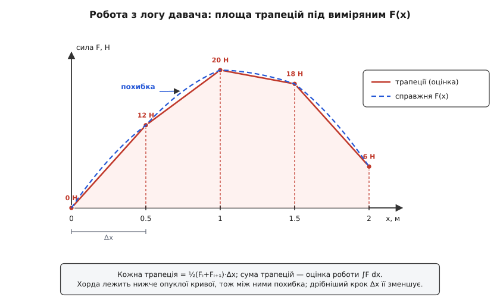
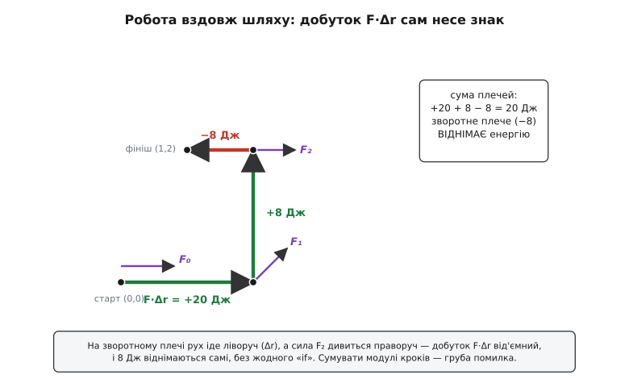

# ⚙️ Робота й енергія з дискретних вимірів

## Задача

Формула W = F·d гарна на папері, де силу знаєш точним виразом. У реальному пристрої силу ніхто не задає формулою — її **міряють**: тензодавач повертає ньютони, енкодер повертає міліметри, струмовий шунт повертає ампери, з яких виходить сила на валу. На виході — не рівняння, а **таблиця відліків**: колонка чисел, знята такт за тактом. І з цієї таблиці треба дістати одне число — виконану роботу або передану енергію.

Три задачі трапляються раз у раз, і всі три — про той самий перехід «лог → джоулі».

- **Робота змінної сили.** Ти протягнув щось через сенсор сили, а положення писав енкодером. У логу пари (x, F): де було тіло і яка сила діяла там. Треба ∫F dx — площа під виміряною силою.
- **Енергія двигуна за цикл.** Мотор чи привод жене навантаження; ти щотакту знімаєш силу (або струм → силу) і швидкість. Треба енергію, яку двигун віддав за повний цикл, ∑F·v·Δt.
- **Робота вздовж траєкторії.** Тіло їде кривим шляхом на площині; ти пишеш його положення rᵢ = (xᵢ, yᵢ) і вектор сили Fᵢ = (Fxᵢ, Fyᵢ). Треба ∑F·Δr — роботу з урахуванням того, що сила й рух дивляться в різні боки.

Спокуса — сказати «та це ж один цикл із додаванням» і написати `for` у три рядки. Так і є — рівно доти, доки лог чистий і рух простий. А він не такий: сила гальмує на частині шляху й **віднімає** енергію, крок дискретизації грубий і трапеції **промахуються повз горб**, тіло іноді **вертається назад**, а давач мовчки віддає міліметри там, де код чекає метри. Кожна з цих чотирьох дрібниць по-своєму псує суму, і саме про них — уся задача.

## Ідея

Почнімо з площі, бо решта — її різновиди. Коли сила стала, робота — прямокутник F·d. Коли сила міняється, розбий шлях на короткі плечі й на кожному вважай силу **лінійною** — тоді смужка під нею це трапеція з двома «висотами» Fᵢ та Fᵢ₊₁ й основою Δx. Площа трапеції — півсума висот на основу:

```
Wᵢ = ½·(Fᵢ + Fᵢ₊₁)·(xᵢ₊₁ − xᵢ)
```

Склади всі смужки — і маєш **метод трапецій**, найпряміший спосіб узяти інтеграл із таблиці. Формула сама тримає нерівний крок: Δx береться щоразу свій, тож давач може віддавати відліки як завгодно нерівномірно.

> Метод трапецій — окремий шматок науки про наближене інтегрування: чому півсума висот, яка похибка й коли брати замість трапеції параболу Сімпсона, розібрано в темі [чисельне інтегрування](topic:math-numeric/numerical-integration).

Що ця «площа = накопичена величина» — думка стародавня, показує несподіване джерело. Вавилонські астрономи на клинописних табличках (близько 350–50 рр. до н. е.) рахували, наскільки Юпітер зсунеться по небу за 60 днів, як **площу трапеції** під графіком його швидкості від часу — і навіть ділили цю трапецію навпіл, щоб знайти мить половини шляху. Це найдавніший відомий слід геометричного інтегрування в абстрактному просторі «величина–час», за чотирнадцять століть до європейських учених (прочитання М. Оссендрайвера, *Science*, 2016 — усталений факт). Наша задача — той самий хід: тільки під графіком у нас не швидкість, а сила, і площа дає не відстань, а роботу.

Дві інші задачі — та сама сума з поворотом. Енергія за цикл: замість шляху вздовж осі x накопичуємо в часі, а «висота» смужки — це миттєва [потужність](topic:ph-electromagnetism/instantaneous-power) P = F·v, тож енергія є ∑P·Δt = ∑F·v·Δt. Робота на кривій: замість числа F·Δx беремо [скалярний добуток](topic:math-algebra/dot-product) векторів F·Δr = Fx·Δx + Fy·Δy, і цей добуток **сам** виходить від'ємним там, де сила тягне проти руху.

І одразу — розлом, що вирішує вибір мови й методу. Лічильник енергії двигуна працює **наживо**, на такті керування: коли треба додати внесок цього такту, наступного відліку ще **не існує**. Тож наживо доступна тільки прямокутна сума (взяв поточні F, v — додав F·v·Δt). Аналіз логу, навпаки, бачить усю таблицю відразу, тож може брати трапецію — середину двох сусідніх відліків, точнішу на порядок. Одна й та сама фізика розпадається на два коди: причинний лічильник у прошивці й точніший розбір логу опісля.

## Код

Ці два способи життя й диктують мови. Лічильник крутиться на мікроконтролері в жорсткому такті — там панує **C**: голі масиви, жодних алокацій, передбачуваний час. Розбір логу — це вже настільний скрипт над колонками чисел, і там природний **Python** з numpy, де сума по масиву це один векторний вираз. Обидва — гарячий шлях над масивами, обидва лягають; тож нижче кожен приклад іде обома, і кожна вкладка — ідіоматична своєю мовою, а не переклад чужої.

### Змінна сила: ∫F dx по трапеціях

Пряма сума трапецій по логу (x, F). Крок навмисне не припускаємо рівним — беремо (xᵢ₊₁ − xᵢ) щоразу:

:::tabs
```c
#include <stddef.h>

/* Робота змінної сили: ∫F dx методом трапецій.
   x[i] — положення (м), F[i] — сила там (Н), n — довжина логу.
   Крок Δx може бути нерівним і навіть від'ємним (рух назад). */
double trapz_work(const double *x, const double *F, size_t n) {
    double W = 0.0;
    for (size_t i = 0; i + 1 < n; ++i) {
        double dx = x[i + 1] - x[i];
        W += 0.5 * (F[i] + F[i + 1]) * dx;   /* площа однієї смужки */
    }
    return W;                                 /* Дж, якщо x у м, F у Н */
}
```
```python
def trapz_work(x, F):
    """∫F dx по трапеціях для логу (x, F); крок може бути нерівним."""
    return sum(0.5 * (F[i] + F[i + 1]) * (x[i + 1] - x[i])
               for i in range(len(x) - 1))


# те саме однією вбудованою: numpy інтегрує y по x
import numpy as np
W = np.trapezoid(F, x)      # NumPy ≥ 2.0; у старіших версіях — np.trapz(F, x)
```
:::

**Приклад: протягли крізь липку ділянку.** Сила росла, поки тіло входило в затор, тоді спадала. Лог із рівним кроком Δx = 0.5 м:

```
x, м:   0.0   0.5   1.0   1.5   2.0
F, Н:   0     12    20    18    6

плече 0.0→0.5:  ½·(0 + 12)·0.5  = 3.0
плече 0.5→1.0:  ½·(12 + 20)·0.5 = 8.0
плече 1.0→1.5:  ½·(20 + 18)·0.5 = 9.5
плече 1.5→2.0:  ½·(18 + 6)·0.5  = 6.0
разом:  W = 3.0 + 8.0 + 9.5 + 6.0 = 26.5 Дж
```

Двадцять шість із половиною джоулів пішло на цю протяжку. А тепер злочин, який роблять постійно: обійтися **двома** відліками — початком і кінцем.

```
лише кінці (0.0, 0) і (2.0, 6):  ½·(0 + 6)·2.0 = 6 Дж
```

Шість замість двадцяти шести з половиною — учетверо менше, бо між кінцями стирчав горб сили 20 Н, а пряма хорда від 0 до 6 його **не побачила**. Ось чому крок дискретизації — не дрібниця: трапеції добрі рівно настільки, наскільки густо відліки ловлять зміну сили.


*Метод трапецій з'єднує сусідні відліки прямими хордами й підсумовує площі під ними. Там, де справжня сила вигинається над хордою, трапеція трохи недобирає — це і є похибка дискретизації, і вона тим менша, чим густіші відліки.*

### Енергія двигуна за цикл: ∑F·v·Δt

Тепер лічильник, що біжить наживо. Кожен такт керування ти читаєш силу на валу й швидкість і доливаєш у скарбничку внесок цього такту, F·v·Δt. Це причинний, прямокутний спосіб — і саме те, що вміє прошивка. У C він природний до непристойності: структура з одним полем і рядок додавання, який кличеться з переривання таймера.

:::tabs
```c
/* Лічильник енергії реального часу.
   Кожен такт: energy += P·Δt = F·v·Δt. Знак зберігається сам —
   гальмівний такт (сила проти швидкості) дає від'ємний внесок. */
typedef struct {
    double energy_J;        /* накопичена робота, Дж */
} EnergyMeter;

static inline void meter_tick(EnergyMeter *m,
                              double force_N, double vel_mps, double dt_s) {
    m->energy_J += force_N * vel_mps * dt_s;
}
```
```python
import numpy as np

def cycle_energy(F, v, dt):
    """Енергія за цикл із логу сили й швидкості, рівний крок dt (с)."""
    return float(np.sum(F * v) * dt)          # Σ F·v·Δt — знак і все

# нерівний такт: беремо справжні мітки часу t і трапецію по потужності
def cycle_energy_uneven(F, v, t):
    P = F * v                                  # миттєва потужність
    return float(np.sum(0.5 * (P[:-1] + P[1:]) * np.diff(t)))
```
:::

**Приклад: робочий хід із гальмуванням.** Привод розганяв навантаження, тоді на кінці ходу почав його стримувати — сила стала від'ємною (проти руху), хоч тіло ще їхало вперед. Такт Δt = 0.1 с:

```
такт   F, Н    v, м/с   P = F·v, Вт    +P·Δt, Дж    E разом, Дж
 1     150     0.4       60             +6.0          6.0
 2     200     0.6      120            +12.0         18.0
 3     250     0.8      200            +20.0         38.0
 4     100     0.6       60             +6.0         44.0
 5     −50     0.4      −20             −2.0         42.0   ← гальмо
разом:  E = 42.0 Дж
```

Стеж за колонкою «E разом»: вона лізе вгору до 44.0 Дж — а тоді **падає** до 42.0. П'ятий такт не додав, а забрав: сила дивилася назад, потужність вийшла від'ємна, і 2 джоулі повернулися з навантаження назад у привод (так само, як рекуперативне гальмо повертає заряд у батарею). Це не збій обліку — це і є чесна енергія, віддана за цикл: 42 Дж, а не сума всього підряд.

Якби ти під час гальмування взяв **модуль** потужності (мовляв, «двигун же працює, отже додаємо»), вийшло б 60+120+200+60+20 = 460, тобто **46.0 Дж** — на чотири джоулі більше правди. Знак у F·v — не оздоба; він розрізняє «двигун штовхає» і «двигуна штовхають», і викидати його не можна нізащо.

> 🔧 **Навіщо це.** Рівно такий лічильник сидить у контролері батареї (BMS) і в кожному кулонометрі електромотора: щотакту `energy += voltage·current·dt`, і від'ємний добуток на гальмуванні сам віднімає віддану назад енергію. З цієї накопиченої суми рахують залишок заряду й пробіг. Зіпсуй знак — і машина «зарядиться» від гальмування до понад 100 %.

### Робота вздовж траєкторії: ∑F·Δr

Найзагальніший випадок: тіло їде по кривій, сила щомиті дивиться кудись убік від руху. Тут працює не число, а **вектор**. На кожному плечі береш переміщення Δr = rᵢ₊₁ − rᵢ і скалярно множиш на силу — а щоб не втратити точність, силу на плечі усереднюєш (та сама трапеція, тільки векторна):

:::tabs
```c
#include <stddef.h>

/* Робота вздовж траєкторії: Σ F·Δr = Σ (Fx·Δx + Fy·Δy).
   Силу на плечі беремо серединою двох відліків; знак дає сам добуток. */
double path_work(const double *x, const double *y,
                 const double *Fx, const double *Fy, size_t n) {
    double W = 0.0;
    for (size_t i = 0; i + 1 < n; ++i) {
        double dx = x[i + 1] - x[i];
        double dy = y[i + 1] - y[i];
        double fx = 0.5 * (Fx[i] + Fx[i + 1]);
        double fy = 0.5 * (Fy[i] + Fy[i + 1]);
        W += fx * dx + fy * dy;               /* скалярний добуток F·Δr */
    }
    return W;
}
```
```python
import numpy as np

def path_work(r, F):
    """r, F — масиви форми (N, 2): положення й сила у відліках.
    W = Σ F·Δr із силою-серединою на кожному плечі."""
    dr = np.diff(r, axis=0)                    # Δr на кожному плечі, (N-1, 2)
    F_mid = 0.5 * (F[:-1] + F[1:])             # середина сили, (N-1, 2)
    return float(np.sum(F_mid * dr))           # Σ (Fx·Δx + Fy·Δy)
```
:::

**Приклад: рух уперед, угору й трохи назад.** Тіло пройшло з (0,0) у (2,0), тоді в (2,2), тоді вернулося в (1,2) — усе в метрах; сила (у ньютонах) міряна в кожній точці:

```
i   r = (x, y)    F = (Fx, Fy)
0   (0, 0)        (12, 0)
1   (2, 0)        ( 8, 8)
2   (2, 2)        ( 8, 0)
3   (1, 2)        ( 8, 0)

плече 0→1:  Δr = (2, 0)    F̄ = (10, 4)   F·Δr = 10·2 + 4·0   = +20
плече 1→2:  Δr = (0, 2)    F̄ = ( 8, 4)   F·Δr = 8·0  + 4·2   = +8
плече 2→3:  Δr = (−1, 0)   F̄ = ( 8, 0)   F·Δr = 8·(−1)+ 0·0  = −8
разом:  W = 20 + 8 − 8 = 20 Дж
```

Третє плече — уся сіль. Тіло їхало **ліворуч** (Δx = −1), а сила показувала **праворуч** (Fx = +8): добуток вийшов −8, і вісім джоулів **самі** відняли себе від суми. Ніякого `if «а чи не гальмуємо ми зараз»` писати не довелося — скалярний добуток несе знак усередині себе. Якби ти піддався спокусі скласти **модулі** внесків (20 + 8 + 8 = 36 Дж), то приписав би зворотному плечу додатну роботу, якої не було.


*На кожному плечі знак роботи задає скалярний добуток сили на переміщення. Зворотне плече, де рух і сила розходяться, віднімає енергію без жодної окремої перевірки — досить чесно порахувати F·Δr.*

Тут же ховається й пастка немонотонного шляху. Координата x пробігла 0 → 2 → 2 → 1 — вона **не зростає весь час**, вертається назад. Наївне ∫F dx «по осі x» тут збрехало б: ділянку x від 1 до 2 тіло пройшло **двічі** (туди й назад), і скалярний інтеграл по x їх злив би чи подвоїв. Векторне Δr від цього застраховане: воно рахує **справжнє** переміщення на кожному плечі, а не проєкцію на вісь, тож рух назад чесно входить від'ємним доданком.

## Складність і пастки

**Складність — усюди один прохід.** Кожна з трьох задач — це O(n) за часом, один `for` по логу, без вкладених циклів. Пам'ять: аналіз логу тримає масиви, O(n); а лічильник реального часу **потоковий**, O(1) — йому досить одного числа `energy_J` і поточних F, v, тож він живе на мікроконтролері з кількома кілобайтами. Обчислень на відлік — кілька множень; насправді цикл упирається не в арифметику, а в **пропускну здатність пам'яті** (протягти масив крізь процесор). Саме тому наживо на такті виграє C із голими масивами, а офлайн по мільйонах рядків — векторний numpy, що жене ту саму суму пакетом.

**Знак — ніколи не бери модуль.** Гальмівні ділянки мусять **віднімати**: F·v на рекуперації від'ємне, F·Δr на зворотному плечі від'ємне. І добуток, і скалярний добуток несуть цей знак самі — довіряй їм і не «випрямляй» доданки через `abs`. Сума модулів завищує роботу рівно на подвоєну від'ємну частину.

**Крок і похибка трапецій.** Похибка методу трапецій на плечі росте як (Δx)³·|F″|, а на всьому логу — як (Δx)²: удвічі дрібніший крок — учетверо менша похибка. Але страшніший не цей плавний недобір, а **промах повз пік**: якщо між двома відліками сила встигла злетіти й упасти, трапеція проведе хорду попід горбом і втратить його весь (наші 6 Дж замість 26.5). Правило те саме, що й для дискретизації сигналу: відліки мусять бути густіші за найшвидшу зміну сили, інакше жодна формула площі вже не врятує — інформації просто нема в логу.

**Немонотонний шлях — Δ зі знаком, не модуль.** Коли тіло вертається, (xᵢ₊₁ − xᵢ) стає від'ємним — і має таким лишитися. Не сортуй лог за x, не бери |Δx|, не рахуй «пройдену відстань» замість переміщення: усе це підмінить інтеграл. Для кривих шляхів завжди мисли вектором Δr — переміщення, а не довжина шляху, дає роботу.

**Одиниці — зводь до СІ на вході.** Ньютон на метр дає джоуль; але енкодер часто віддає **міліметри**, тензодавач — сирі відліки АЦП, такт — **мілісекунди**. Помнож ненавмисно міліметри на ньютони — і робота вийде в тисячу разів меншою, мовчки, без жодної помилки виконання. Переводь усе в метри, ньютони, секунди **на межі** (одразу після давача), а не десь усередині формули. Якщо треба ват-години для батареї — це вже після: 1 Дж = 1/3600 Вт·год.

**Причинний лічильник ≠ офлайн-трапеція.** Прямокутна сума наживо систематично трохи зміщена проти трапеції (на півсмужки різниці сусідніх значень). Спокусившись «зробити точніше», не тягни трапецію ½(Pᵢ+Pᵢ₊₁) прямо в переривання: там **нема** Pᵢ₊₁, він у майбутньому. Точну трапецію наживо роблять лише ціною **затримки на один відлік** (тримати попередній і додавати вже його трапецію) — і ця затримка не завжди прийнятна в контурі керування. Офлайн такої проблеми нема: бери трапецію вільно.

**Накопичення float на довгому лозі.** Лічильник, що тикає роками по 1 кГц, додасть мільярди дрібних внесків до великої суми — і молодші біти почнуть губитися (додаєш крихітне до величезного — крихітне зникає в округленні). На довгому пробігу бери **сумування Кагана** (тримай окремий доданок-компенсацію втрачених бітів) або накопичуй у цілих мікроджоулях фіксованою комою — надійно для МК без FPU й без повільного дрейфу суми.
