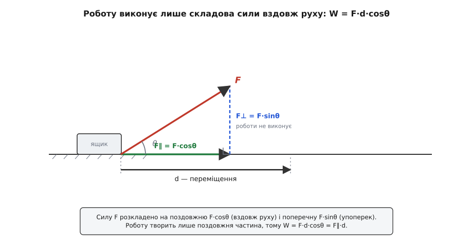
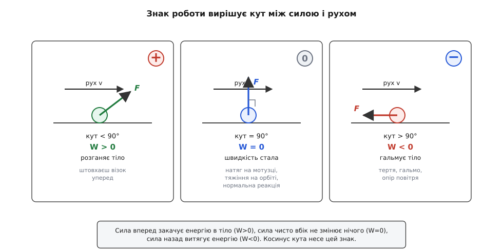
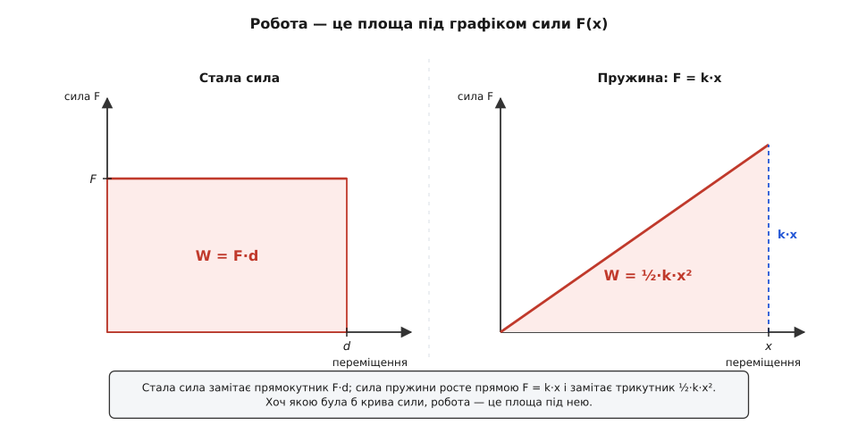

# Механічна робота

<preknowlist>
- [Сила](topic:ph-mechanics/force) — що штовхає чи тягне тіло; вектор із напрямом і величиною в ньютонах. Робота рахується саме від сили.
- [Переміщення і шлях](topic:ph-mechanics/displacement) — переміщення як вектор від початку до кінця руху; робота залежить від того, наскільки й куди тіло зрушило.
- [Скалярний добуток](topic:math-algebra/dot-product) — як із двох векторів дістати число F·d·cosθ: проєкцію одного вектора на напрям іншого.
</preknowlist>

Штовхни важку шафу через кімнату — і ти видихнешся, спітнієш, натрудиш спину. Потримай наповнену валізу нерухомо на витягнутій руці — рука заниє вже за хвилину. А тепер обіприся щосили в цегляну стіну й тисни, аж поки не забракне сил. У всіх трьох випадках мʼязи горять, і ти певен, що добряче «наробився». Але фізика скаже дивне: над валізою й над стіною ти не виконав **ніякої** роботи, а над шафою — виконав, і рівно стільки, скільки долав тертя, помножене на пройдений нею шлях. Різниця в одному: шафа **зрушила під твоєю силою**, а валіза й стіна — ні.

Ось зерно поняття. Сила сама собою ще не каже, який слід вона лишить. Тією самою силою можна ледь торкнути тіло, а можна протягти його через півкімнати — і наслідки будуть незрівнянні. Важить не лише, **як сильно** ти штовхаєш, а й **як далеко** сила протягла тіло. Величина, що зводить це докупи — силу, помножену на пройдений під нею шлях, — і зветься **механічна робота** (фр. travail — праця, робота). Робота міряє, скільки сила «накачала» в тіло чи, навпаки, відібрала, поки штовхала його вздовж дороги. Що слово це молоде й народилося не в кабінеті філософа, а в цеху — з потреби оцінити машину числом, — розказано в [історії поняття «робота»](topic:ph-mechanics/work/hist-work-concept.md): силі, помноженій на відстань, дав імʼя інженер, який рахував віддачу водяних коліс і парових машин.

## Сила, помножена на шлях

Найпростіший випадок: стала сила F тягне тіло рівно в той бік, куди воно й рухається, на шляху d. Тоді робота — просто добуток двох чисел:

```
W = F · d
```

Одиниця роботи — **джоуль** (Дж), на честь Джеймса Джоуля (Англія), чиї досліди довели, що робота й тепло — та сама річ у різних подобах. Один джоуль — це робота сили в один ньютон на шляху в один метр: 1 Дж = 1 Н·м. Це небагато: підняти яблуко на метр — приблизно один джоуль.

**Приклад: підняти ящик на полицю.** Ящик масою 20 кг треба підняти на 1.5 м. Рука тягне вгору проти ваги mg, і на всьому підйомі ця сила стала:

```
F = m·g = 20 · 9.81 = 196.2 Н
W = F · d = 196.2 · 1.5 ≈ 294 Дж
```

Ці 294 джоулі нікуди не поділися — вони осіли в піднятому ящику як запас, готовий повернутися рухом, щойно ящик зірветься з полиці. Та простий добуток F·d, яким ми щойно порахували, годиться ще не завжди — і межу цього спрощення видно, щойно сила перестає дивитися точно вздовж руху.

## Тільки те, що вздовж руху

Сила нечасто дивиться точно туди, куди тіло їде. Тягнеш санки за мотузку, задерту вгору під кутом θ — уперед санки посуває лише **горизонтальна** частина твого ривка; вертикальна ж тільки трохи піднімає їх, полегшуючи ковзання, а самого руху вздовж дороги не творить. Розклади силу на дві складові: F∥ = F·cosθ вздовж руху й F⊥ = F·sinθ упоперек. Роботу виконує тільки поздовжня:

```
W = F · d · cosθ
```

Цей множник cosθ — не що інше, як [скалярний добуток](topic:math-algebra/dot-product) вектора сили на вектор переміщення: він бере проєкцію сили на напрям їзди й відкидає все, що поперек. Коли сила вздовж руху, θ = 0, cosθ = 1 — робота найбільша, F·d, як і було. Коли сила відхилена — робота менша рівно в cosθ разів.


*Роботу творить лише та частина сили, що дивиться вздовж руху, — F·cosθ. Поперечна складова тягне вбік і на переміщення вздовж дороги не впливає, тож у роботу не входить. Тому W = F·d·cosθ.*

**Приклад: тягти санки під кутом.** Сила F = 50 Н напрямлена під θ = 30° до горизонту, санки проїхали d = 10 м по рівному:

```
W = F · d · cosθ = 50 · 10 · cos30° = 500 · 0.866 ≈ 433 Дж
```

Хоч тягнув із силою 50 ньютонів на десяти метрах, у роботу пішло не 500 джоулів, а 433 — решту «зʼїв» нахил мотузки, бо частина зусилля йшла вгору, а не вперед.

Тепер найважливіше. Косинус несе **знак**, і саме цей знак вирішує, робота додає енергію чи відбирає:

```
θ < 90°   cosθ > 0   W > 0   сила має складову вперед  → тіло розганяється
θ = 90°   cosθ = 0   W = 0   сила чисто вбік            → нічого не додає
θ > 90°   cosθ < 0   W < 0   сила має складову назад    → тіло гальмується
```

Середній випадок вартий, щоб на ньому спинитися. Сила, напрямлена точно впоперек руху, не виконує роботи взагалі — хоч би якою потужною була. Несеш валізу рівною підлогою: тримаєш її вгору чималою силою, але сила вертикальна, а рух горизонтальний — над валізою робота нульова (натруджена рука тут ні до чого, втома мʼязів — то окрема бухгалтерія тіла). Розкрути камінь на мотузці зі сталою швидкістю: натяг весь час напрямлений до центра, тобто перпендикулярно до руху, тож роботи не виконує — і камінь ні пришвидшується, ні стишується. З тієї ж причини супутник на круговій орбіті летить зі сталою швидкістю, хоч тяжіння смикає його щомиті; і з тієї ж причини нормальна реакція підлоги ніколи не виконує роботи над тілом, що ковзає по ній.


*Знак роботи диктує кут між силою і рухом. Уперед — енергія втікає в тіло, воно розганяється; чисто вбік — нуль, швидкість стала; назад — енергія витікає, тіло стишується. Тертя й гальма — це завжди відʼємна робота.*

> 🔧 **Навіщо це.** Правило «поперечна сила не працює» щодня економить інженерові розрахунки. Кранівник підвозить вантаж по горизонтальній балці — трос тримає вагу, але руху вбік не творить, тож на цьому переносі двигун візка не бореться з вагою взагалі, лише з тертям котків. Гіроскоп, підвіска, орбіта супутника — усюди, де сила стоїть перпендикулярно до руху, енергія не витрачається й швидкість тримається сама. Розпізнати такі напрями наперед — значить одразу викреслити з енергетичного балансу те, що нічого не коштує.

## Робота — це передана енергія

Куди ж дівається вкладена робота? Прямісінько в енергію тіла. Штовхни вільне тіло вперед — і повна робота всіх сил над ним дорівнює **зміні** його [кінетичної енергії](topic:ph-mechanics/kinetic-energy): додатна робота розганяє, відʼємна стишує, і величина розгону чи гальмування дорівнює виконаній роботі рівно до джоуля. Це співвідношення — місток між силою й рухом, і саме через нього кінетична енергія й означується.

Піднімай натомість тіло повільно — і робота проти тяжіння не обертається на швидкість, а лягає в запас [потенціальної енергії](topic:ph-mechanics/potential-energy) висоти, готовий вилитися назад у рух, щойно тіло почне падати. Так чи так, виконати роботу — це не що інше, як **перенести енергію з одного сховку в інший**. Тому робота і є універсальна валюта механіки: енергію означують як здатність виконати роботу, а кожен перетік енергії — це, зрештою, якась сила, що працює на якійсь відстані. У цьому обміні нічого не зʼявляється з нічого й [нічого не гине](topic:ph-mechanics/energy-conservation) — облік завжди сходиться.

> 🔧 **Навіщо це.** Гальма автомобіля — машина відʼємної роботи. Колодка тисне на диск проти обертання, виконує над ним відʼємну роботу й забирає кінетичну енергію авта, обертаючи її на тепло розжареного металу. Скільки енергії треба зняти — стільки роботи мусять виконати гальма, і саме з цієї цифри рахують їхній розмір і тепловідведення: важча чи прудкіша машина везе більше кінетичної енергії, отже, вимагає більшої відʼємної роботи, щоб спинитися.

## Коли сила міняється: робота як площа

Справжні сили рідко тримаються сталими. Розтягнута пружина тягне то сильніше, що далі її відвести; тяга ракети спадає, поки вигоряє пальне. Коли F міняється вздовж шляху, простим множенням уже не обійтися — доводиться посікти шлях на кроки Δx, такі короткі, що на кожному сила майже стала, скласти дрібні порції F·Δx і згустити крок. Сума стає **площею під кривою** F(x): робота — це площа, яку сила замітає, поки тіло проходить свій шлях. Стала сила дає прямокутник (висота F, основа d — знову F·d); змінна — фігуру складнішого обрису, але правило те саме.


*Робота завжди дорівнює площі під графіком сили від переміщення. Для сталої сили це прямокутник F·d, для пружини — трикутник під прямою F = k·x, тобто ½k·x². Форма графіка — і форма площі — залежить від того, як сила поводиться на шляху.*

Пружина — найчистіший приклад. За [законом Гука](topic:ph-condensed/elastic-deformation) її сила росте прямою лінією з видовженням, F = k·x. Розтягни її від 0 до x — і площа під цією прямою є трикутник: половина основи на висоту, тобто половина x на kx:

```
W = ½ · x · (k·x) = ½ · k · x²
```

**Приклад: стиснути пружину.** Пружина з жорсткістю k = 200 Н/м стиснута на x = 0.10 м. Роботу, вкладену в стиск:

```
W = ½ · k · x² = ½ · 200 · 0.10² = ½ · 200 · 0.01 = 1.0 Дж
сила на кінці стиску:  F = k·x = 200 · 0.10 = 20 Н
```

Хоч наприкінці пружина відпирається силою 20 Н, робота — лише 1 джоуль, а не 20·0.10 = 2: адже спершу сила була нульова й доросла до 20 Н поступово, тож у площу входить лише **половина** прямокутника. Ці самі 1.0 Дж пружина віддасть назад, коли розтиснеться, бо вона консервативна — її робота повертається сповна.

На практиці силу рідко знають гарною формулою — її вимірюють давачем. Тоді роботу рахують чисельно, підсумовуючи виміряні F·Δx по трапеціях; так само з логів сили й швидкості дістають енергію, яку двигун віддав за цикл. Робочий код і його пастки — знак скалярного добутку, крок дискретизації, немонотонний шлях — розібрано в [окремому проєкті](topic:ph-mechanics/work/proj-work-integral.md).

## Повертається чи згорає

Тут криється поділ, що формує всю механіку. Піднімай ящик хоч прямовисно, хоч пологим пандусом, хоч зиґзаґом — робота проти тяжіння вийде однакова, mgh, задана самою лише зміною висоти, а не дорогою. Занеси його вгору й спусти назад — і повна робота тяжіння дорівнює нулю: на спуску тяжіння віддає рівно те, що відібрало на підйомі. Сили такого штибу — тяжіння, ідеальна пружина — звуть **консервативними** (лат. conservare — зберігати): їхня робота залежить лише від початку й кінця, а замкнений обхід не коштує нічого. Саме тому їхню роботу можна скласти в запас [потенціальної енергії](topic:ph-mechanics/potential-energy) — рахунок, привʼязаний до положення, який завжди виплачує сповна.

Тертя — протилежність. Протягни ящик по підлозі туди й назад, у ту саму точку: [тертя](topic:ph-mechanics/friction) опиралося всю дорогу туди й усю дорогу назад, щоразу проти руху, тож на обох плечах виконало відʼємну роботу — замкнений обхід дає чистий збиток. Ба більше, ця робота залежить від **усієї довжини шляху**: що довше ковзаєш, то більше втрачено. Такі сили звуть **дисипативними** — вони не складають енергію в запас, а розсіюють її, стираючи впорядкований рух на тепло. Тертя не повертає нічого; довша дорога завжди дорожча. Та «втрачена» енергія не гине — вона переходить у безлад молекулярного руху, у теплоту, і в повному обліку [зберігається](topic:ph-mechanics/energy-conservation) до крихти.

Чому робота тяжіння сліпа до шляху, а робота тертя — ні, як це перевіряє замкнений обхід (∮F·dr = 0), і який точний звʼязок повʼязує консервативну силу з її потенціалом — виведено в [окремій математичній вставці](topic:ph-mechanics/work/math-conservative-work.md).

## Наскільки швидко: потужність

Робота каже, скільки енергії перейшло з рук у руки, але мовчить про те, як **швидко**. Занеси сто цеглин на дах — по одній за годину чи всі за хвилину — робота однакова, mgh у будь-якому разі. Різниця в **темпі** роботи, і цей темп звуть [потужністю](topic:ph-mechanics/power): робота за одиницю часу, у ватах (на честь Джеймса Ватта) — один ват є один джоуль за секунду. А оскільки робота — це сила на відстань, а відстань за час є швидкість, миттєва потужність дорівнює силі на швидкість, P = F·v. Потужний двигун — не той, що виконує більше роботи, а той, що виконує ту саму роботу скоріше.

**Приклад: кран піднімає вантаж.** Кран рівномірно піднімає 500 кг зі швидкістю 0.5 м/с. Сила підйому дорівнює вазі, а потужність — сила на швидкість:

```
F = m·g = 500 · 9.81 = 4905 Н
P = F · v = 4905 · 0.5 ≈ 2453 Вт ≈ 2.45 кВт
```

Той самий вантаж на ту саму висоту можна підняти й слабшим мотором — просто повільніше; удвічі прудкіший підйом вимагає удвічі більшої потужності, хоч робота на метр висоти незмінна.

## Що лишається

Механічна робота — це сила, помножена на пройдений під нею шлях, а точніше — на ту частину шляху, що вздовж сили: W = F·d·cosθ, у джоулях. Косинус кута вирішує все: сила вперед виконує додатну роботу й розганяє, сила впоперек не виконує ніякої (тому камінь на мотузці й супутник на орбіті летять зі сталою швидкістю), сила назад виконує відʼємну роботу й гальмує. Коли сила міняється, робота дорівнює площі під графіком F(x) — для пружини це трикутник ½kx². Виконати роботу означає перенести енергію: повна робота над тілом дорівнює зміні його кінетичної енергії, а робота проти тяжіння лягає в потенціальну. Консервативні сили (тяжіння, пружина) віддають роботу назад і дозволяють запасати її як потенціальну енергію; дисипативні (тертя) розсіюють її на тепло безповоротно, хоч у повному обліку не гине й вона. А темп, з яким робота твориться, — це вже потужність, P = F·v. Секрет натрудженої, але «безробітної» руки під валізою виявляється простим: у фізиці працює не зусилля, а зусилля, помножене на пройдений під ним шлях.
