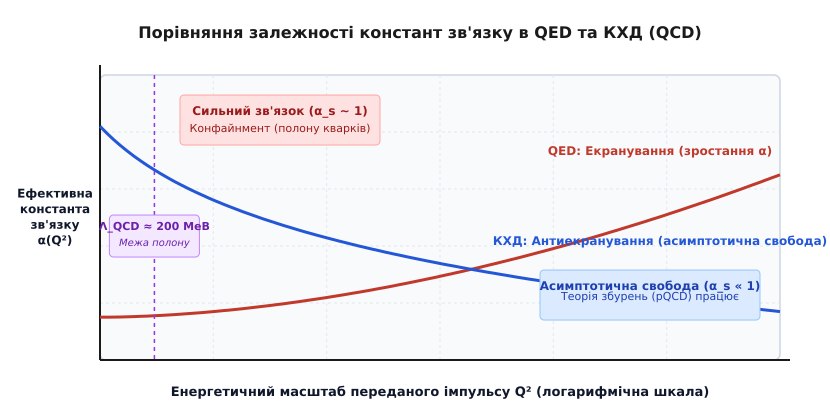
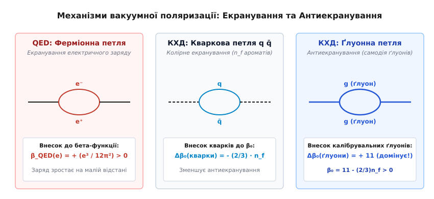
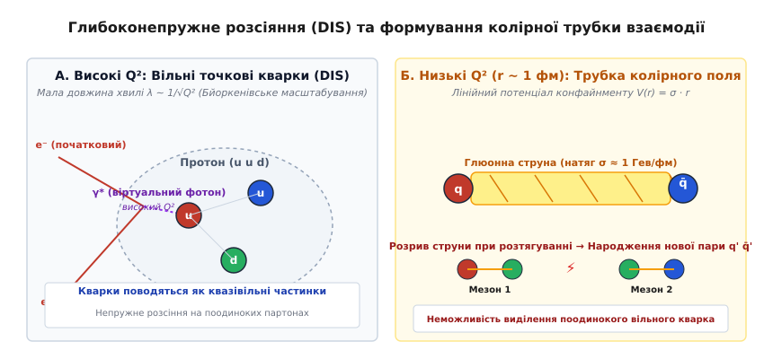

# Асимптотична свобода в квантовій хромодинаміці

<preknowlist>
- [Квантова хромодинаміка та колірний заряд](topic:physics/quantum-chromodynamics) — калібрувальна симетрія SU(3), колірний заряд та 8 векторних ґлуонів.
- [Ренормалізація у квантовій теорії поля](topic:physics/renormalization) — усунення ультрафіолетових розбібностей та залежність констант зв'язку від енергетичного масштабу.
- [Група ренормалізації та бета-функція](topic:physics/renormalization-group) — рівняння Гелл-Манна — Лоу та еволюція ефективного заряду з масштабом переданого імпульсу.
</preknowlist>

При проведенні експериментів із зондування внутрішньої структури протона за допомогою високоенергетичних електронів на прискорювачах із великим переданим чотиривимірним імпульсом `Q² » 1 Гев²` виявилося дивовижне фізичне явище: фундаментальні складові частинки матерії — кварки — поводяться всередині адронів як абсолютно точкові, вільні ферміони, які майже не відчувають взаємного притягання. Протім при спробі відокремити поодинокий кварк від його сусіда на відстань, що перевищує характерний розмір ядра протона (`r > 1 фм = 10⁻¹⁵ м`), сила взаємодії не зменшується до нуля, а навпаки — зростає до колосальної величини близько `10–15 тонн` (`10⁵ Н`), унеможливлюючи існування вільного колірного заряду у вакуумі.

Цей фізичний парадокс співіснування повного конфайнменту (полону кварків) на великих відстанях та майже абсолютної відсутності взаємодії на малих відстанях розв'язується фундаментальною властивістю неабелевих калібрувальних теорій — **асимптотичною свободою** (*Asymptotic Freedom*).

Докладніше про те, як подолання кризи «нуль-заряду» Ландау та інтерпретація бйоркенівського масштабування у глибоконепружному розсіянні привели до відкриття асимптотичної свободи та присудження Нобелівської премії з фізики 2004 року, розказано у [історичному екскурсі про відкриття асимптотичної свободи та Нобелівську премію 2004 року](topic:ph-quantum/asymptotic-freedom/hist-gross-wilczek-politzer.md).

---

## Квантова вакуумна поляризація: Екранування у QED проти Антиекранування у КХД

Для того щоб зрозуміти глибокий фізичний механізм асимптотичної свободи, необхідно детально зіставити мікроскопічні квантові процеси вакуумної поляризації у двох фундаментальних квантовопольових теоріях: Квантовій Електродинаміці (QED) та Квантовій Хромодинаміці (КХД).

У квантовій електродинаміці вакуум не є абсолютно порожнім простором. Згідно з квантовомеханічним принципом невизначеності Гейзенберга, вакуумний стан неперервно заповнений флуктуаціями віртуальних електрон-позитронних пар (`e⁺ e⁻`). Коли у такий квантовий вакуум вміщується точковий пробний електричний заряд `e_bare` (наприклад, «голий» електрон), віртуальні квантові флуктуації миттєво орієнтуються в його зовнішньому електростатичному полі. Віртуальні позитрони із додатним електричним зарядом притягуються ближче до центрального електрона, тоді як віртуальні негативні електрони відштовхуються на периферію.


*Залежність ефективної константи зв'язку від енергетичного масштабу Q²: екранування заряду у QED (зростання α) та антиекранування у КХД (зменшення α_s до нуля при високих енергіях).*

Внаслідок такої просторової поляризації навколо центрального заряду утворюється сферична вакуумна хмара електричних диполів. Ця хмара **екранує** (тобто зменшує) ефективний заряд для віддаленого спостерігача. На великих відстанях спостерігач реєструє суттєво зменшений фізичний заряд `e_phys ≈ e_bare / ε_vac`. Якщо ж експериментатор починає наближатися до електрона на дуже малі відстані `r` (що відповідає передачі великих імпульсів `Q² ∝ 1/r²`), він проникає всередину екрануючої дипольної хмари вакууму. При цьому екранувальний шар залишається зовні, і спостерігач виявляє некомпенсований «голий» заряд більшої величини. Отже, у QED ефективна константа зв'язку `α(Q²) = e²(Q²) / (4·π)` монотонно зростає зі збільшенням переданого імпульсу.

У Квантовій Хромодинаміці ситуація докорінно змінюється завдяки наявності неабелевої калібрувальної групи колірної симетрії `SU(3)_c`. На відміну від фотонів у QED, які є електрично нейтральними і не взаємодіють безпосередньо один з одним, ґлуони КХД самі несуть колірний заряд. Кожен із 8 векторних ґлуонів володіє комбінацією кольору та антикольору (наприклад, `червоний–антисиній`). Це означає, що калібрувальні ґлуонні поля володіють нелінійною автовзаємодією у формі триґлуонних `A³` та чотириґлуонних `A⁴` вершин.

У квантовому вакуумі КХД відбуваються два конкуруючі процеси поляризації:

1. **Ферміонне колірне екранування:** Віртуальні кварк-антикваркові пари (`q q̄`) утворюють колірні диполі, які традиційно екранують центральний колірний заряд, зменшуючи його на великих відстанях (аналогічно до електронних петель у QED).

2. **Калібрувальне колірне антиекранування:** Віртуальні ґлуонні петлі та автовзаємодії калібрувальних бозонів за рахунок наявності власного колірного заряду створюють специфічний парамагнітний відгук вакууму. Замість зосередження заряду в центрі, віртуальні ґлуонні флуктуації розсіюють та «розмазують» колірний заряд по об'єму вакуумної хмари.

Внаслідок парамагнітного ефекту ґлуонних автовзаємодій колірний заряд при наближенні до кварка на малу відстань не зростає, а навпаки — стрімко зменшується. Це явище поширюваного розсіювання заряду отримало назву **антиекранування** (*Anti-screening*). Оскільки внесок віртуальних ґлуонних петель чисельно переважає внесок кваркових петель, сумарний вакуумний відгук КХД стає антиекранним. На малих відстанях ефективний колірний заряд логарифмічно прямує до нуля, перетворюючи кварки на квазівільні частинки.

---

## Математичний формалізм: Рівняння ренормалізаційної групи та від'ємний знак бета-функції

Кількісний опис еволюції константи зв'язку зі зміною енергетичного масштабу здійснюється за допомогою рівняння ренормалізаційної групи Гелл-Манна — Лоу. Диференціальне рівняння для ефективного калібрувального заряду `g(μ)` має вигляд:

```
μ · ( d g / d μ ) = β(g)
```

де `μ` — масовий масштаб ренормалізації (шкала ‘т Хоофта), а `β(g)` — бета-функція квантової теорії поля. Для константи тонкої структури сильної взаємодії `α_s = g² / (4·π)` рівняння записується у вигляді пертурбативного розкладу за ступенями `α_s`:

```
d α_s / d ln(Q²) = β(α_s) = - (β₀ / (4·π)) · α_s² - (β₁ / (16·π²)) · α_s³ - (β₂ / (64·π³)) · α_s⁴ - ...
```

де `Q²` — квадрат чотиривимірного переданого імпульсу у процесі розсіяння, а `β₀`, `β₁`, `β₂` — універсальні коефіцієнти бета-функції.


*Квантові вакуумні петлі у КХД: ферміонна петля кварк-антикварк (екранування) та ґлуонні автовзаємодії (антиекранування).*

Точний однопетельний розрахунок фейнманівських діаграм вакуумної поляризації у калібрувальній теорії Янга — Міллса із групою симетрії `SU(N)` дає наступний вираз для першого коефіцієнта бета-функції `β₀`:

```
β₀ = (11 / 3) · C_A - (4 / 3) · T_F · n_f
```

Складові компоненти цієї формули мають чіткий алгебраїчний зміст:
- `C_A` — значення квадратичного оператора Казимира для приєднаного представлення калібрувальної групи. Для групи колірної симетрії КХД `SU(3)_c` це число дорівнює `C_A = 3`. Член `(11/3)·C_A = 11` описує внесок самодії калібрувальних ґлуонів та духів Фаддєєва — Попова (антиекранування).
- `T_F` — коефіцієнт нормалізації генераторів у фундаментальному представленні. Для `SU(3)` значення дорівнює `T_F = 1/2`.
- `n_f` — кількість активних кваркових ароматів, чия маса спокою є меншою за поточний енергетичний масштаб `Q`. Член `(4/3)·T_F·n_f = (2/3)·n_f` описує внесок кваркових петель (екранування).

Підставляючи алгебраїчні значення для групи `SU(3)_c`, отримуємо вирази для перших двох коефіцієнтів бета-функції КХД:

```
β₀ = 11 - (2 / 3) · n_f
β₁ = 102 - (38 / 3) · n_f
```

Фундаментальна умова існування асимптотичної свободи вимагає, щоб перший коефіцієнт бета-функції був строго додатним (`β₀ > 0`). Це накладає суворе обмеження на максимальну кількість кваркових ароматів у природі:

```
n_f < 33 / 2 = 16.5
```

У Стандартній Моделі існує рівно `6` кваркових ароматів (`u`, `d`, `s`, `c`, `b`, `t`). Оскільки `n_f = 6 < 16.5`, перший коефіцієнт є додатним: `β₀ = 11 - (2/3)·6 = 7 > 0`.

Оскільки `β₀` є додатним числом, бета-функція КХД `β(α_s) = - (β₀ / (4·π)) · α_s²` набуває строго **від'ємного знака**. Саме від'ємний знак бета-функції математично забезпечує асимптотичну свободу: при зростанні енергетичного масштабу `Q² → ∞` ефективна константа зв'язку `α_s(Q²)` логарифмічно зникає.

Детальний алгебраїчний розрахунок поправок до вершин взаємодії, скорочення абелевих членів у тотожностях Славнова — Тейлора та виведення двопетельних поправок наведено у [математичному виведенні 1-петельного розкладу бета-функції та залежності константи зв'язку](topic:ph-quantum/asymptotic-freedom/math-beta-function-qcd.md).

---

## Еволюція константи зв'язку α_s(Q²) та параметр масштабу Λ_QCD

Інтегрування однопетельного рівняння ренормалізаційної групи у межах від опорного імпульсу `μ²` до кінематичного масштабу `Q²` дає вираз для еволюції ефективної константи зв'язку:

```
α_s(Q²) = α_s(μ²) / [ 1 + (β₀ / (4·π)) · α_s(μ²) · ln(Q² / μ²) ]
```

Для вилучення залежності від довільного опорного масштабу `μ` вводиться інваріантний фізичний параметр — **параметр масштабу КХД** `Λ_QCD` (*Dimensional Transmutation*):

```
Λ_QCD² = μ² · exp( - (4 · π) / ( β₀ · α_s(μ²) ) )
```

Виразивши константу зв'язку через `Λ_QCD`, отримуємо стандартну формулу 1-петельного наближення:

```
α_s(Q²) = (4 · π) / [ β₀ · ln(Q² / Λ_QCD²) ]
```

У двопетельному наближенні з урахуванням вищих поправок формула набуває вигляду розкладу за логарифмічною змінною `t = ln(Q² / Λ_QCD²)`:

```
α_s^{(2-loop)}(Q²) = (4 · π) / ( β₀ · t ) · [ 1 - (β₁ / β₀²) · ( ln(t) / t ) ]
```

Експериментально виміряне значення параметра `Λ_QCD` у схемах MS-bar становить `Λ_QCD ≈ 200–300 МеВ` (`0.2–0.3 Гев`), що відповідає просторовому масштабу `r_0 = ℏ · c / Λ_QCD ≈ 0.8–1.0 фм`.

Залежність `α_s(Q²)` чітко ділить фізику сильної взаємодії на два енергетичні режими:

1. **Пертурбативний режим КХД (pQCD, `Q² » Λ_QCD²`):**
   На великих енергіях, наприклад на масі `Z`-бозона `Q = m_Z = 91.19 Гев`, знаменник логарифма є великим, і константа зв'язку спадає до `α_s(m_Z²) ≈ 0.1179`. Оскільки `α_s « 1`, фізики можуть використовувати теорію збурень за фейнманівськими діаграмами для обчислення перерізів колайдерних процесів із високою точністю. Це область **асимптотичної свободи**.

2. **Непертурбативний режим КХД (Confinement, `Q² → Λ_QCD²`):**
   При зменшенні енергії до масштабу `Q ≈ 1 Гев` (відстані `r ≈ 1 фм`) логарифм у знаменнику прямує до нуля, а константа зв'язку стрімко зростає, досягаючи одиниці і більше (`α_s ~ 1`). Взаємодія стає настільки сильною, що кварки та ґлуони навічно замикаються всередині безколірних адронів. Це область **конфайнменту**.

---

## Глибоконепружне розсіяння, бйоркенівське масштабування та DGLAP-еволюція

Головним експериментальним підтвердженням асимптотичної свободи стало дослідження процесів глибоконепружного розсіяння лептонів на протонах. У процесі DIS високоенергетичний електрон випромінює віртуальний фотон `γ*` із високим переданим імпульсом `Q² = -q²`.


*Схема глибоконепружного розсіяння віртуального фотона на кварку всередині адрона при високих переданих імпульсах Q².*

Згідно з принципом невизначеності Гейзенберга, віртуальний фотон розпізнає просторові деталі розміром `λ ≈ ℏ / √Q²`.
- При низьких імпульсах (`Q² « 1 Гев²`) довжина хвилі є великою (`λ > 1 фм`), і фотон розсіюється на протоні як на цілісній розмитій системі.
- При високих імпульсах (`Q² » 1 Гев²`) довжина хвилі фотона стає значно меншою за розмір протона (`λ « 0.1 фм`). Завдяки асимптотичній свободі взаємодія між кварками на таких відстанях прямує до нуля. Віртуальний фотон розсіюється миттєво та когерентно на поодинокому «замороженому» точковому кварку, який не встигає обмінятися ґлуонами з оточенням.

Ця фізична картина виражається у бйоркенівському масштабуванні структурних функцій `F₂(x, Q²) → F₂(x)`. Додатково спираючись на співвідношення Каллана — Ґросса `F₂(x) = 2 · x · F₁(x)`, експерименти довели, що партони мають спін `1/2`.

Невеликі логарифмічні порушення бйоркенівського масштабування при зростанні `Q²` строго описуються рівняннями еволюції DGLAP (Докшицер — Ґрибов — Липатов — Альтареллі — Парізі):

```
d q_i(x, Q²) / d ln(Q²) = (α_s(Q²) / (2·π)) · ∫_x¹ (dy / y) · [ q_i(y, Q²) · P_{qq}(x/y) + g(y, Q²) · P_{qg}(x/y) ]
```

Вимірювання логарифмічного зсуву структурних функцій `F₂(x, Q²)` на прискорювачі HERA (DESY, Гамбург) у широкому діапазоні імпульсів повністю підтвердило формулу асимптотичної свободи `α_s(Q²)` із точністю до часток відсотка.

Для аналізу чисельного алгоритму розрахунку `α_s(Q²)` у 1-петельному та 2-петельному наближеннях і порогових переходів кварків зверніться до [чисельного моделювання залежності α_s(Q²) та порогових переходів кваркових ароматів](topic:ph-quantum/asymptotic-freedom/proj-qcd-running-coupling.md).

---

## Фізика струнної моделі конфайнменту та струмени на колайдерах

Коли в результаті глибоконепружного зіткнення кварк отримує величезний віддачу та намагається залишити протон, сила сильної взаємодії демонструє феномен колірної трубки (струни).

На великих відстанях `r » 0.1 фм` самодія ґлуонів стискає силові лінії колірного електричного поля у вузький циліндричний джгут — **колірну струну** з постійною густиною енергії. Потенціал взаємодії між кварком та антикварком описується потенціалом Корнелла:

```
V(r) = - (4 / 3) · ( α_s / r ) + σ · r
```

де `σ ≈ 1 Гев / фм ≈ 0.18 Гев²` — постійний натяг колірної струни. 

При збільшенні відстані `r` потенціальна енергія розтягнутої струни `V(r) = σ · r` лінійно зростає. Коли енергія натягу струни досягає порогу утворення маси пари легких кварків `2 · m_q ≈ 300 МеВ`, енергетично найвигіднішим стає розрив струни з народженням нової вакуумної пари кварк-антикварк `q' q̄'`. 

Розірвані кінці струни замикаються на новонароджених кварках, утворюючи нові безколірні мезони та баріони. Цей процес отримав назву **адронізації** або **фрагментації**. Внаслідок адронізації вилітаючий кварк перетворюється не на поодинокий заряд, а на вузькоспрямований конус стабільних адронів — **адронний струмінь** (*Hadronic Jet*). Відкриття двоструменевих та триструменевих подій у розпадах `e⁺ e⁻ → q q̄ g` на прискорювачі PETRA (DESY, 1979 рік) стало прямою експериментальною візуалізацією ґлуонів та асимптотичної свободи.

---

## Аналогії та застосування у фізиці конденсованого стану

Принципи асимптотичної свободи мають прямі аналоги у фізиці конденсованого стану та екстремальних станах речовини:

### 1. Кварк-ґлуонна плазма та фазовий перехід деконфайнменту
При нагріванні адронної матерії до температур понад `T_c ≈ 150–170 МеВ` (`T_c ≈ 2 · 10¹² К`) середня кінетична енергія теплового руху частинок досягає `E_thermal ~ k_B · T > Λ_QCD`. Середня відстань між частинками стає меншою за `1 фм`, і завдяки асимптотичній свободі колірна взаємодія між ними слабшає. Адрони плавляться, перетворюючись на новий агрегатний стан — **кварк-ґлуонну плазму** (КҐП), де кварки та ґлуони вільно пересуваються по всьому макроскопічному об'єму. Цей стан досліджується на колайдерах RHIC та LHC (експеримент ALICE).

### 2. Ефект Кондо у фізиці твердого тіла
У фізиці конденсованого стану існує дзеркальний аналог еволюції константи зв'язку — **ефект Кондо**. У металах із домішками магнітних атомів (наприклад, атоми заліза у міді) спін домішки взаємодіє з електронами провідності.
- При високих температурах (`T » T_K`, де `T_K` — температура Кондо) константа обмінної взаємодії `J` між спіном домішки та електронами є малою: електрони провідності вільно розсіюються на домішці (**аналог асимптотичної свободи**).
- При зниженні температури (`T → T_K`) ефективна константа обмінної взаємодії стрімко зростає, досягаючи сильного зв'язку, де електрони провідності екранують спін домішки у синглетний стан (**аналог конфайнменту**).

---

## Підсумковий синтез та сучасні рубежі

Відкриття асимптотичної свободи перетворило квантову хромодинаміку на точну математичну теорію сильної взаємодії. Вона пояснила, чому кварки поводяться як квазівільні частинки при високоенергетичних зіткненнях, і встановила природну межу застосовності пертурбативних методів.

> 🔧 **Навіщо це.**
> Знання механізму асимптотичної свободи та формули еволюції `α_s(Q²)` є обов'язковим інженерним фундаментом у фізиці високих енергій та обчислювальній фізиці:
> - **Розрахунок перерізів на колайдерах (LHC/FCC):** Усі теоретичні передбачення народження бозона Хіггса, топ-кварків та пошуків нової фізики за межами Стандартної Моделі спираються на пертурбативну КХД (pQCD), де константа `α_s(Q²)` обчислюється з точністю до 3-х і 4-х петель.
> - **Симулятори партонних злив (Pythia, HERWIG, SHERPA):** Алгоритми генерації подій на колайдерах каскадно моделюють випромінювання ґлуонів кварками від високих переданих імпульсів `Q ~ 1 Тев` (асимптотично вільний режим) до порогового масштабу `Q ~ 1 Гев`, де вмикаються модельні алгоритми адронізації.
> - **Ґраткова КХД (Lattice QCD):** Для розрахунку мас протонів та нейтронів у непертурбативній області застосовуються чисельні методи Монте-Карло на чотиривимірних просторово-часових ґратках, де величина параметра ґратки `a` безпосередньо фіксується через калібрування `α_s(a⁻²)`.
