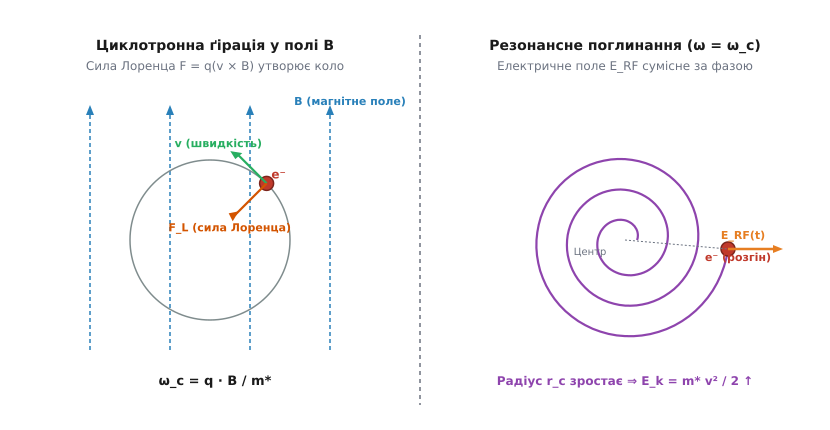
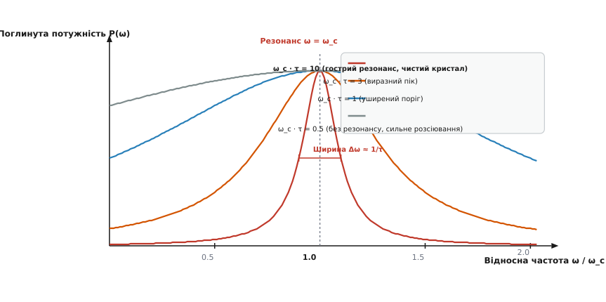
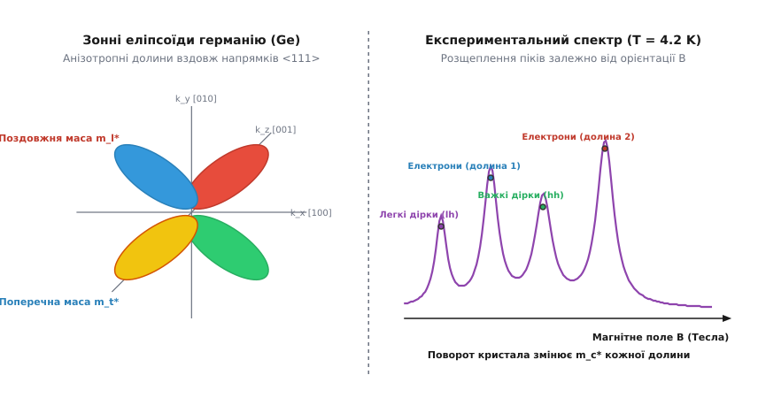

# Циклотронний резонанс у плазмі та напівпровідниках

<preknowlist>
- [Сила Лоренца](topic:ph-electromagnetism/lorentz-force) — дія магнітного поля на рухомий заряд, центропрагне прискорення та Ларморівська частота.
- [Електронний дрейф і рухливість носіїв](topic:ph-condensed/electron-drift) — час вільного пробігу носіїв, фононне розсіювання та уширення спектральних ліній.
- [Зонна теорія напівпровідників](topic:ph-condensed/semiconductor) — ефективна маса квазічастинок, зони провідності та валентні зони, концепція дірок.
- [Ефект Голла](topic:ph-condensed/hall-effect) — гальваномагнітні явища у статичних полях та вимірювання концентрації носіїв.
</preknowlist>

Коли заряджена частинка — електрон або іон — потрапляє у постійне магнітне поле, сила Лоренца примушує її обертатися навколо магнітних силових ліній по коловій або спіральній траєкторії. Частота цього колового руху, відома як **циклотронна частота** (або Ларморівська частота ґірації), залежить виключно від маси частинки, її заряду та величини магнітного поля. Якщо на таку намагнічену систему спрямувати зовнішню високочастотну електромагнітну хвилю, чия частота точно збігається з частотою ґірації частинки, виникає явище **циклотронного резонансу** (*cyclotron resonance*). Частинка починає безперервно поглинати енергію електромагнітного поля, збільшуючи свій радіус обертання та кінетичну енергію.

У фізиці конденсованого стану та плазми циклотронний резонанс посідає виняткове місце. Для фізики напівпровідників та металів він став головним «мікроскопом», який дозволив уперше виміряти ефективну масу квазічастинок `m*` та побудувати тривимірні карти зонної структури й поверхонь Фермі у кристалах. У фізиці плазми циклотронний резонанс слугує фундаментальним механізмом беззіткновального нагріву електронів та іонів у термоядерних реакторах (токамаках і стелараторах), а також лежить в основі промислових ECR-плазмотронів для нанолітографії та мас-спектрометрії надвисокого розділення.

---

### Сила Лоренца та прецесія: класичний механізм ґірації

Розглянемо класичний рух частинки із зарядом `q` та масою `m*` у постійному однорідному магнітному полі з індукцією `B`. Рівняння руху частинки під дією сили Лоренца має вигляд:

```
m* · (dv / dt) = q · (v × B)
```

Оскільки сила Лоренца завжди перпендикулярна до вектора швидкості `v`, вона не виконує роботи над частинкою. Модуль швидкості `v = |v|` та кінетична енергія частинки `E_k = m* v² / 2` залишаються строго сталими. Розкладемо вектор швидкості на дві компоненти: паралельну до напрямку магнітного поля `v_∥` та перпендикулярну `v_⊥`. Поздовжня компонента `v_∥` не зазнає дії магнітного поля, і частинка рухається вздовж поля з постійною швидкістю.

У площині, перпендикулярній до полярної осі `B`, сила Лоренца виконує роль центропрагненої сили:

```
m* · v_⊥² / r_c = |q| · v_⊥ · B
```

де `r_c` — радіус циклотронної орбіти (Ларморівський радіус). Звідси негайно отримуємо вираз для радіуса орбіти:

```
r_c = (m* · v_⊥) / (|q| · B)
```

Кутова частота обертання `ω_c`, що дорівнює відношенню перпендикулярної швидкості до радіуса `ω_c = v_⊥ / r_c`, визначається співвідношенням:

```
ω_c = (|q| · B) / m*
```

Циклотронна частота має дві фундаментальні властивості:
1. **Незалежність від швидкості та радіуса:** У нерелятивістському наближенні частота ґірації `ω_c` не залежить ні від кінетичної енергії частинки, ні від радіуса її орбіти `r_c`. Повільні та швидкі частинки роблять один повний оберт за однаковий час.
2. **Обернена пропорційність масі:** Що легшою є частинка, то вищою є частота її ґірації.


*Схема руху зарядженої частинки у магнітному полі B (ліворуч) та спіральне розгортання орбіти за умов резонансного узгодження фази високочастотного електричного поля E_RF (праворуч).*

#### Взаємодія з електромагнітною хвилею та селективність поляризації

Тепер прикладемо у площині ґірації змінне електричне поле `E_RF(t)`. Звичайна плоска монохроматична хвиля з лінійною поляризацією `E(t) = E₀ cos(ω t) x̂` розкладається на дві колово-поляризовані компоненти з правобічним (R-wave) та лівобічним (L-wave) обертанням векторів поля:

```
E_R(t) = (E₀ / 2) · [ cos(ω t) x̂  +  sin(ω t) ŷ ]
E_L(t) = (E₀ / 2) · [ cos(ω t) x̂  -  sin(ω t) ŷ ]
```

Негативно заряджений електрон у полі `B = (0, 0, B)` обертається за годинниковою стрілкою (правило правого гвинта). Якщо напрямок обертання вектора електричного поля `E_R(t)` збігається з напрямком ґірації електрона, а частота поля точно дорівнює циклотронній частоті (`ω = ω_c`), вектор електричного поля постійно залишається сонапрямленим із вектором швидкості електрона `v`.

У результаті електричне поле виконує позитивну роботу над електроном на кожній ділянці орбіти:

```
dW / dt = q · (v · E_RF) > 0
```

Електрон прискорюється, його перпендикулярна швидкість `v_⊥` зростає, а орбіта розгортається у вибухову спіраль. Якщо ж напрямок обертання поля протилежний (ліва поляризація L-wave для електрона), вектор поля півперіоду прискорює частинку, а півперіоду — гальмує її. Сумарний енергообмін за період перетворюється на нуль, і резонансне поглинання відсутнє. Для позитивних іонів ситуація дзеркально протилежна: іони поглинають хвилю з лівою поляризацією (L-wave).

#### Енергетичні масштаби та порівняння зі статичними вимірюваннями

До відкриття циклотронного резонансу єдиним методом дослідження носіїв у магнітному полі були гальваномагнітні вимірювання — ефект Голла та магнітоопір. Однак у статичних полях електричний струм вимірює лише сумарну реакцію всього ансамблю носіїв. Якщо зона провідності містить кілька еквівалентних долин з анізотропними масами, голлівський коефіцієнт `R_H = 1 / (n q)` вимірює лише загальну концентрацію `n` і залишається повністю сліпим до мас окремих долин.

Циклотронний резонанс є динамічним спектроскопічним методом. Оскільки кожен тип носіїв заряду чи кожна окремо орієнтована еліпсоїдальна долина має власну частоту обертання `ω_c = q B / m_c*`, НВЧ-спектр показує окремі гострі піки поглинання для кожного компонента. Положення піку на осі магнітного поля `B` дає пряме кількісне значення циклотронної маси `m_c*`, а площа під піком пропорційна концентрації носіїв даного типу.

---

### Зіткнення, затухання та пороговий критерій спостереження

У реальних фізичних середовищах — напівпровідниковому кристалі чи іонізованій плазмі — частинки не рухаються у безповітряному просторі. Вони безперервно зіштовхуються з коливаннями кристалічної ґратки (фононами), дефектами, домішками або нейтральними атомами.

Для опису дисипації енергії введемо феноменологічний час релаксації імпульсу `τ` (середній час між двома послідовними зіткненнями). Усереднене рівняння руху носіїв під дією постійного магнітного поля `B` та змінного НВЧ-поля `E(t) = E₀ exp(i ω t)` набуває вигляду:

```
m* · ( (dv / dt) + (v / τ) ) = q · ( E + v × B )
```

Розв'язуючи це рівняння у комплексній формі для високочастотної густини струму `j = q · n · v = σ(ω) · E`, отримуємо тензор високочастотної провідності `σ(ω)`. Для колово-поляризованої хвилі дійсне значення провідності `Re[σ(ω)]`, яке визначає питому поглинуту потужність `P(ω) = (1/2) · Re[σ] · E₀²`, описується класичним лоренцівським контуром:

```
P(ω) = P₀ · [ 1 / ( 1 + (ω - ω_c)² · τ² ) ]
```

де `P₀ = (n · q² · τ) / (2 m*)` — статична провідність на постійному струмі.


*Спектральні криві резонансного поглинання потужності P(ω/ω_c) при різних значеннях параметра чистоти ω_c · τ. Чим більшим є час між зіткненнями τ, тим гострішим виявляється пік поглинання.*

#### Фізичний зміст критерію ω_c · τ >> 1

З математичної форми лоренціана випливає, що напівширина резонансного піку на піввисоті дорівнює `Δω = 1 / τ`. Щоб резонансний пік поглинання виразно виділявся на тлі суцільного фону звичайного джоулева нагріву, ширина піку `Δω` повинна бути значно меншою за саму резонансну частоту `ω_c`.

Це дає фундаментальний **критерій спостережуваності циклотронного резонансу**:

```
ω_c · τ >> 1
```

Виражаючи циклотронну частоту `ω_c = q B / m*` та дрейфову рухливість носіїв `μ = q τ / m*`, критерій можна переписати у надзвичайно зручній інженерній формі:

```
μ · B >> 1
```

Фізичний зміст цього критерію є бездоганно простим: **заряджена частинка повинна встигнути зробити принаймні один повний оберт (кут `Δθ = 2π`) по циклотронній орбіті до того, як зіткнення з фононом чи іоном зб'є її фазу руху.**

Для спостереження резонансу у напівпровідниках висуваються жорсткі вимоги:
1. **Кріогенні температури (`T = 4.2 K` — рідкий гелій):** За кімнатної температури `T = 300 K` інтенсивне розсіювання на оптичних та акустичних фононах скорочує час вільного пробігу до `τ ≈ 10⁻¹³` секунди. Поріг `ω_c τ > 1` вимагав би гігантських магнітних полів `B > 100` Тесла. Охолодження до `4.2 K` зменшує концентрацію фононів у мільйони разів, збільшуючи час пробігу до `τ ≈ 10⁻¹⁰` секунди (100 пікосекунд).
2. **Високочисті монокристали:** Концентрація примесних дефектів не повинна перевищувати `10¹² ... 10¹⁴ см⁻³`, інакше розсіювання на іонізованих домішках розмиє резонанс навіть при абсолютному нулю.
3. **Сильні магнітні поля та НВЧ-діапазон:** При полях `B = 0.1 ... 1.0` Тесла циклотронна частота належить до мікрохвильового діапазону (`f = 10 ... 100` ГГц, довжина хвилі `3 см ... 3 мм`).

#### Механізми розсіювання та розширення ліній

Напівширина резонансної лінії `Δω` прямо вимірює ефективний час релаксації `τ`. Досліджуючи температурну залежність ширини піку `Δω(T)` при кріогенних температурах, фізики розрізняють три фундаментальних механізми розсіювання:
- **Акустичне фононне розсіювання:** Залежність часу пробігу від температури підпорядковується закону `τ_ac ∝ T⁻³⁾²`. При охолодженні від `20 K` до `4.2 K` ширина лінії `Δω` лінійно звужується.
- **Розсіювання на нейтральних домішках (формула Ергінсоя):** При `T < 4.2 K` фононне розсіювання повністю виморожується, і ширина лінії виходить на насичення, що визначається концентрацією нейтральних донорів та акцепторів `N_imp`: `1 / τ_imp = (20 ℏ a_B / m*) · N_imp`, де `a_B` — борівський радіус примісі.
- **Розсіювання на іонізованих домішках (формула Брукса — Геррінга):** Іонізовані центри створюють довгосяжні кулонівські потенціали, які спричиняють сильне пружне розсіювання носіїв та розширення циклотронних піків.

Чисельне моделювання процесу з розсіюванням носіїв та алгоритми обчислення резонансного спектра розкрито у вставці [Чисельне моделювання траєкторій та спектра поглинання](topic:ph-quantum/cyclotron-resonance/proj-cyclotron-sim.md).

---

### Циклотронний резонанс у плазмі: ECR та ICR

У повністю або частково іонізованій плазмі присутні принаймні два типи заряджених частинок: легкі негативні електрони та важкі позитивні іони. Оскільки маса іона `m_i` у тисячі разів перевищує масу електрона `m_e` (`m_i / m_e ≥ 1836`), їхні циклотронні частоти кардинально відрізняються при однаковому магнітному полі `B`.

```
ω_ce = (e · B) / m_e              [Електронна циклотронна частота]
ω_ci = (Z · e · B) / m_i          [Іонна циклотронна частота]
```

Ця величезна різниця у масах зумовлює існування двох незалежних прикладних напрямків.

#### 1. Електронний циклотронний резонанс (ECR)

При помірних магнітних полях `B = 0.0875` Тесла (875 Гаус) електронна циклотронна частота становить точно `f_ce = 2.45` ГГц. Це стандартна частота промислових НВЧ-магнетронів.

Коли мікрохвильове випромінювання потужністю `0.5 ... 3` кВт вводиться у вакуумну камеру з робочим тиском `0.01 ... 1` Па, електрони резонансно розганяються до енергій `T_e = 2 ... 8` еВ. Енергійні електрони ефективно іонізують нейтральний газ шляхом ударної іонізації, утворюючи високощільну плазму (`n_e ≈ 10¹² см⁻³`) при ступені іонізації до 10–30%.

Прикладне застосування ECR-плазми:
- **Плазмохімічне травлення (ECR Plasma Etching):** Забезпечує атомарно-чисте травлення кремнію, арсеніду галію та гетероструктур без радіаційного пошкодження пристроїв.
- **Осадження тонких плівок (ECR-PECVD):** Дозволяє синтезувати високоякісні діелектричні шари `SiO₂`, `Si₃N₄` та алмазоподібні плівки (DLC) при низьких температурах підкладки.
- **Джерела високозарядних іонів (ECR Ion Sources):** Застосовуються на фізичних прискорювачах (CERN, GANIL) для отримання пучків повністю обідраних важких іонів (наприклад, `U⁹²⁺` або `Pb⁸²⁺`).

Детальні технічні параметри, технологічні режимні карти та матрицю блокувань промислового плазмотрона наведено у вставці [Фізико-технічні параметри ECR-плазмотрона](topic:ph-quantum/cyclotron-resonance/api-ecr-etcher.md).

#### 2. Іонний циклотронний резонанс (ICR)

Оскільки іони набагато важчі, для дейтерієво-тритієвої плазми у магнітному полі токамака `B = 3 ... 5` Тесла іонна циклотронна частота належить до короткохвильового радіодіапазону: `f_ci = 20 ... 80` МГц.

Нагрів плазми за допомогою іонного циклотронного резонансу (ICRH — *Ion Cyclotron Resonance Heating*) є одним із головних методів досягнення термоядерних температур (`T_i > 100` мільйонів градусів) у міжнародному реакторі ITER. Радіочастотна потужність десятки мегават вводиться в плазму за допомогою спеціальних петльових антен.

Іншим фундаментальним застосуванням є **мас-спектрометрія іонного циклотронного резонансу з перетворенням Фур'є (FT-ICR MS)**. Іони вимірюваної речовини захоплюються у магнітну пастку Пеннінга. Високочастотний імпульс збуджує їхню ґірацію, після чого на вимірювальних електродах реєструється сигнал наведеного струму (наведена ЕРС). Перетворення Фур'є цього сигналу дозволяє визначати маси складних білків та органічних молекул з фантастичною точністю — до сьомого знака після коми (`Δm / m < 10⁻⁷`).

#### Тензор діелектричної проникності та особливості плазмових хвиль

Поширення електромагнітних хвиль у намагніченій плазмі описується анізотропним тензором діелектричної проникності `ε(ω)`. Завдяки ґірації електронів у зоні магнітного поля з'являються позадіагональні уявні компоненти, що описують природну оптичну активність плазми (ефект Фарадея):

```
ε = [ ε_xx   i·ε_xy   0   ]
    [ -i·ε_xy  ε_xx   0   ]
    [   0       0    ε_zz ]
```

де компоненти тензора для холодної беззіткновальної плазми виражаються через плазмову частоту `ω_pe = √(n_e e² / (ε₀ m_e))` та циклотронну частоту `ω_ce`:

```
ε_xx = 1 - ( ω_pe² / (ω² - ω_ce²) )
ε_xy = ( ω_ce / ω ) · ( ω_pe² / (ω² - ω_ce²) )
ε_zz = 1 - ( ω_pe² / ω² )
```

Коли частота електромагнітної хвилі наближається до циклотронної частоти (`ω → ω_ce`), компоненти `ε_xx` та `ε_xy` прямують до нескінченності. Це означає виникнення резонансної особливості у показнику заломлення надзвичайної хвилі (X-wave), яка повністю поглинається плазмою, віддаючи свою енергію тепловому руху електронів.

Крім основного циклотронного резонансу, у плазмі спостерігається **Верхній Гібридний Резонанс** (Upper Hybrid Resonance, UHR) на частоті `ω_UHR = √(ω_pe² + ω_ce²)`, де електромагнітна хвиля перетворюється на поздовжню плазмову хвилю Бернштейна, забезпечуючи додатковий нагрів електронного компонента.

---

### Ефективна маса та зонна структура напівпровідників

Перехід від вільного електрона у вакуумі до електрона у кристалічній ґратці змінює сам характер його руху. Внутрішньокристалічний періодичний потенціал ґратки `V(r)` взаємодіє з де-бройлівською хвилею електрона. Під дією зовнішнього поля електрон прискорюється так, ніби його маса дорівнює **тензору ефективної маси** `m*`:

```
( 1 / m* )_ij = ( 1 / ℏ² ) · ( ∂² E(k) / (∂k_i · ∂k_j) )
```

Якщо енергетичні поверхні в кристалі не є сферичними, циклотронна маса `m_c*` стає складною функцією орієнтації магнітного поля відносно кристалографічних осей.

#### Багатодолинні напівпровідники: Кремній та Германій

У германії (Ge) мінімуми зони провідності розташовані на межах зони Бріллюена вздовж осей кристалографічної симетрії `<111>`. Поверхні постійної енергії являють собою 4 витягнутих еліпсоїди обертання. Для кожного еліпсоїда характерні дві маси: поздовжня `m_l* ≈ 1.64 m₀` (вздовж осі еліпсоїда) та поперечна `m_t* ≈ 0.082 m₀` (перпендикулярно до осі).

Коли магнітне поле `B` утворене під кутом `θ` до головної осі еліпсоїда, циклотронна маса електрона описується формулою:

```
m_c*(θ) = m_t* · √ ( m_l* / ( m_l* · cos²θ + m_t* · sin²θ ) )
```

Якщо спрямувати магнітне поле вздовж довільного напрямку, кути `θ` для різних еліпсоїдів виявляються різними. У результаті замість одного піку на НВЧ-спектрі поглинання спостерігається **розщеплення на кілька окремих циклотронних ліній**.


*Ліворуч: анізотропні еліпсоїди постійної енергії E(k) германію у k-просторі. Праворуч: розщеплення експериментальних циклотронних піків поглинання при T = 4.2 K для різних орієнтацій магнітного поля.*

У кремнії (Si) зона провідності має 6 еквівалентних долин вздовж напрямків `<100>`. Поздовжня маса становить `m_l* ≈ 0.98 m₀`, а поперечна — `m_t* ≈ 0.19 m₀`. При напрямку магнітного поля вздовж осі `[100]` чотири еліпсоїди розташовані перпендикулярно до поля й дають один пік із масою `m_c* = √(m_l* m_t*) ≈ 0.43 m₀`, а два еліпсоїди орієнтовані вздовж поля й дають другий пік із масою `m_c* = m_t* ≈ 0.19 m₀`.

#### Складна структура валентної зони (Дірки)

У більшості кубічних напівпровідників (Ge, Si, GaAs) верхівка валентної зони в точці `k = 0` є дворазово виродженою (без урахування спіну). Внаслідок спін-орбітальної взаємодії валентна зона розщеплюється на дві підзони:
1. **Важкі дірки (*Heavy Holes*):** Зона з меншою кривизною `E(k)`, якій відповідає більша ефективна маса (`m_hh* ≈ 0.3 ... 0.5 m₀`).
2. **Легкі дірки (*Light Holes*):** Зона з високою крутизною `E(k)`, що дає малу ефективну масу (`m_lh* ≈ 0.04 ... 0.08 m₀`).

На експериментальному спектрі циклотронного резонансу за наявності оптичного підсвічування чітко реєструються два окремих діркових піки: пік легких дірок спостерігається при малих магнітних полях `B`, а пік важких дірок — при більших полях.

Крім того, при сильних магнітних полях квантування валентної зони викликає виникнення квантових складних ліній Латтінджера (*Luttinger quantum transitions*), зумовлених змішуванням станів важких і легких дірок.

Історію того, як вимірювання циклотронного резонансу в лабораторіях Берклі та MIT остаточно розкрили зонну структуру кремнію та германію, викладено в вставці [Історія відкриття циклотронного резонансу в напівпровідниках та металах](topic:ph-quantum/cyclotron-resonance/hist-kittel-shockley.md).

Математичне виведення кутової залежності тензора ефективної маси та квантовомеханічний розрахунок наведено у вставці [Математичний вивід тензора ефективної маси та рівнів Ландау](topic:ph-quantum/cyclotron-resonance/math-effective-mass-tensor.md).

---

### Квантовий циклотронний резонанс: рівні Ландау та ефект Азбеля — Канера

Коли магнітне поле стає настільки сильним, що відстань між квантовими енергетичними рівнями `ℏ · ω_c` перевищує енергію теплового руху `k_B · T`:

```
ℏ · ω_c ≥ k_B · T
```

класичний неперервний опис кінетичної енергії частинки у перпендикулярній площині втрачає силу.

#### Квантування Ландау

У сильному магнітному полі перпендикулярний рух квантується, і безперервна зона енергій розпадається на дискретні **рівні Ландау**:

```
E_n(k_z) = (n + 1/2) · ℏ · ω_c  +  ( ℏ² · k_z² ) / ( 2 m* ),     n = 0, 1, 2, 3...
```

З погляду квантової механіки, поглинання кванту НВЧ-випромінювання `ℏ · ω` відповідає оптичному дипольному переходу електрона з нижчого рівня Ландау `n` на сусідній вищий рівень `n + 1`. Правило відбору для дипольних переходів вимагає:

```
Δn = + 1
```

Енергія кванту поглинання дорівнює `ΔE = E_(n+1) - E_n = ℏ · ω_c`. Прирівнюючи `ℏ · ω = ℏ · ω_c`, ми бачимо, що квантовий результат ідеально узгоджується з класичною частотою ґірації.

Однак при надзвичайно сильних магнітних полях та ультранизьких температурах спостерігаються суто квантові ефекти: гармоніки циклотронного резонансу (`Δn = 2, 3...`), зумовлені непараболічністю зони, а також переходи між спіново-розщепленими рівнями Ландау.

У напівпровідниках із сильною спін-орбітальною взаємодією (наприклад, антимонід індію InSb) виникає також **комбінований циклотронний резонанс** (резонанс Еддельштейна — Рашби), за якого високочастотне електричне поле викликає одночасну зміну квантового номера Ландау та орієнтації спіну електрона (`Δn = 1, Δs = ±1`).

#### Ефект Азбеля — Канера у металах

У металах вимірюванню циклотронного резонансу перешкоджає високочастотний скін-ефект: НВЧ-поле проникає у метал лише на глибину скін-шару `δ ≈ 10⁻⁵` см, тоді як радіус орбіти електрона з енергією Фермі становить `r_c ≈ 10⁻³` см (`δ << r_c`).

У 1956 році Марк Азбель та Еммануїл Канер запропонували витончену геометрію: магнітне поле `B` спрямовують **строго паралельно поверхні металу**.

Внаслідок цього електрон рухається по спіралі, кожна петля якої періодично притискається до самої поверхні кристала. Електрон влітає у вузький скін-шар `δ`, отримує короткий прискорювальний поштовх від НВЧ-електричного поля, вилітає у глибоку «темну» область металу, робить повне коло і знову повертається у скін-шар через період `T_c = 2π / ω_c`.

Якщо частота зовнішнього поля `ω` є кратною циклотронній частоті:

```
ω = N · ω_c,     N = 1, 2, 3, 4...
```

електрон кожен раз входить у скін-шар у тій самій фазі прискорювального поля. Ефект Азбеля — Канера проявляється у вигляді серії періодичних резонансних піків на залежності НВЧ-поверхневого опору металу `Z(B)` від оберненого магнітного поля `1/B`.

Аналіз орбіт Азбеля — Канера для благородних металів (мідь, срібло, золото) дозволив експериментально доказати наявність відкритих орбіт та зв'язаних «перемичок» (*neck orbits*) між сферами Фермі у сусідніх комірках зворотної ґратки.

---

### Порівняльний аналіз та практичні застосування

Для системного розуміння місця циклотронного резонансу серед інших гальваномагнітних та резонансних методів дослідження речовини порівняємо їх у таблиці:

| Метод дослідження | Фізичне явище | Вимірюваний параметр | Стан речовини та умови |
| :--- | :--- | :--- | :--- |
| **Ефект Голла** | Холлівська різниця потенціалів у поперечному побої `E_y` | Концентрація `n`, знак носіїв, дрейфова рухливість `μ` | Статичні поля, `T = 4 ... 300 K` |
| **Циклотронний резонанс (CR)** | Резонансне поглинання НВЧ-потужності на частоті `ω_c` | **Ефективна маса `m*`**, анізотропія зон, розщеплення зон | НВЧ-поля, `T = 4.2 K`, `ω_c τ >> 1` |
| **Ефект Де Гааза — ван Альфена** | Осциляції магнітної сприйнятливості `χ(1/B)` | **Екстремальні площі перетину поверхні Фермі `S_F`** | Надвисокі поля, `T < 1 K`, метали |
| **Електронний парамагнітний резонанс (ЕПР)** | Переорієнтація спіну електрона у магнітному полі | g-фактор спіну, надтонка структура примесей | Магніторезонансна спектроскопія |

> 🔧 **Навіщо це.**
> Розуміння циклотронного резонансу є практичною основою для трьох критичних галузей сучасної інженерії:
> 1. **Проектування напівпровідникових гетероструктур:** Створення високошвидкісних транзисторів (HEMT на основі `AlGaAs/GaAs` або `GaN`) вимагає точного знання ефективної маси двовимірного електронного газу (2DEG), що визначається саме методом циклотронного резонансу.
> 2. **Субмікронна плазмохімія:** Виробництво надвеликих інтегральних схем (процесори за нормами 3 нм і нижче) спирається на ECR-реактори, оскільки вони забезпечують анізотропне травлення без пошкодження ультратонких шарів підкранкового діелектрика.
> 3. **Аналітична хімія та біомедицина:** Мас-спектрометри FT-ICR MS слугують найточнішим інструментом для розшифровки структури складних білків, ДНК та аналізу складних вуглеводневих сумішей у нафтохімії.

З моменту свого фундаментального відкриття у 1950-х роках циклотронний резонанс пройшов шлях від витонченого фізичного експерименту при гелієвих температурах до надійного технологічного інструменту, що щодня працює на напівпровідникових фабриках та у провідних наукових лабораторіях по всьому світу.
