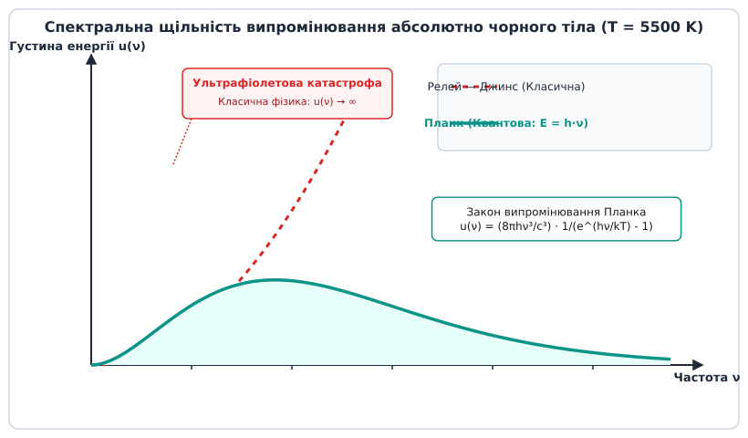
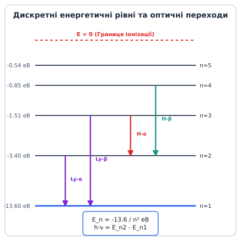
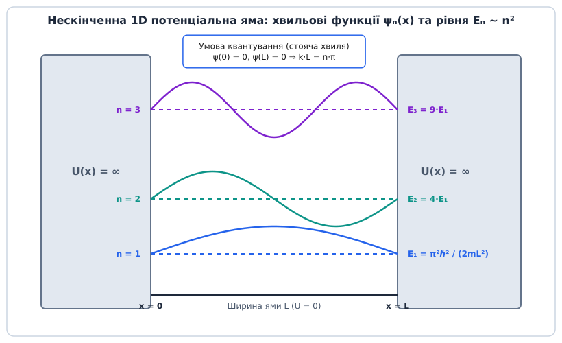
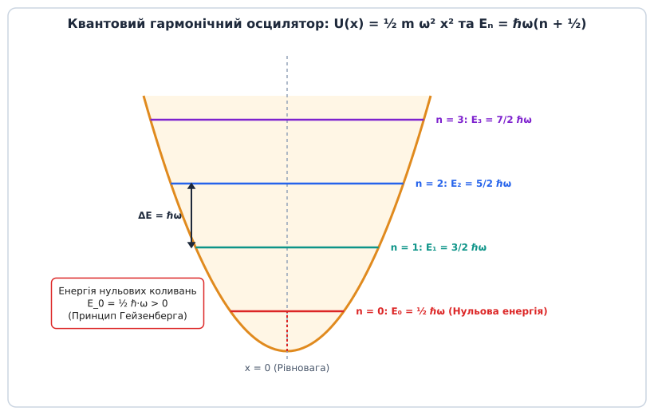

# Квантування енергії

<preknowlist>
- [Пряма і непряма заборонена зона](root:ph-condensed/direct-indirect-bandgap) — зонна структура у k-просторі та міжзонні оптичні переходи.
- [Провідники та ізолятори](root:ph-condensed/conductors-insulators) — формування зонного енергетичного спектра в твердому тілі.
- [Спін електрона](root:ph-quantum/electron-spin) — квантові числа та тонке розщеплення енергетичних рівнів.
</preknowlist>

Спроба за допомогою класичної фізики пояснити, чому нагрітий металевий дріт не спалює Всесвіт нескінченним потоком рентгенівського та ультрафіолетового випромінювання, завершується неминучим математичним провалом. Згідно з законами класичної електродинаміки та статистичної механіки XIX століття, будь-яка зв'язана фізична система — чи то електрон, що обертається навколо атомного ядра, чи то атоми, що коливаються у вузлах кристалічної решітки — має випромінювати та поглинати енергію неперервно. Оскільки кількість високочастотних мод електромагнітного поля у замкненому об'ємі є нескінченною, класична фізика вимагає, щоб усю теплову енергію було миттєво передано найкоротшим хвилям. Цей фундаментальний конфлікт між теорією та реальністю отримав назву ультрафіолетової катастрофи. Подолання цього тупика вимагало радикальної зміни уявлень про природу мікросвіту — переходу від неперервного спектра енергій до дискретного, тобто до квантування енергії.

### Від класичної безперервності до дискретного спектра

У класичній механіці Ньютона й Гамільтона енергія фізичної системи є неперервною функцією координат та імпульсів `E = H(q, p)`. Для класичного маятника або планетного супутника енергія може набувати будь-яких дійсних значень із неперервного інтервалу `E ∈ [0, ∞)`. Зміна енергії відбувається плавно: надавши маятнику як завгодно малу порцію роботи, ми на як завгодно малу величину збільшуємо амплітуду його коливань.

Проте на атомному рівні ця неперервна картина повністю руйнується. Першим тріщину в класичній фізиці помітив Макс Планк у 1900 році під час аналізу теплового випромінювання абсолютно чорного тіла. Для усунення ультрафіолетової катастрофи Планк висунув гіпотезу: атомні осцилятори стінок випромінювальної порожнини можуть змінювати свою енергію не плавно, а лише дискретними порціями — квантами (лат. *quantum* — скільки, порція). Енергія одного кванта випромінювання пропорційна частоті `ν`:

```
E = h · ν = ℏ · ω
```

де `h = 6.626·10⁻³⁴ Дж·с` — стала Планка, а `ℏ = h / (2π) ≈ 1.054·10⁻³⁴ Дж·с` — зведена стала Планка (квант дії).


*Порівняння класичної теорії Релея-Джинса (ультрафіолетова катастрофа) з квантовим законом Планка. Квантування енергетичних рівнів осциляторів пригнічує збудження високочастотних мод за низьких температур.*

Квантування енергії означає, що енергетичний спектр зв'язаної мікросистеми утворює дискретну множину дозволених значень `E_1, E_2, E_3 ...`, розділених забороненими інтервалами. Система просто не може перебувати у стані з енергією, що лежить між дозволеними рівнями. Детальний аналіз кризи класичної фізики, експериментів Франка — Ґерлаха та еволюції наукових ідей винесено в [історичний процес відкриття квантування від Планка до Бора](root:ph-quantum/energy-quantization/hist-planck-bohr.md).

### Напівкласична модель Бора та просторове квантування

Наступним вирішальним кроком стало застосування ідеї квантування до будови атома. Після відкриття Ернестом Резерфордом атомного ядра (1911) постала гостра суперечність: електрон, що обертається навколо ядра по коловій орбіті, рухається з доцентровим прискоренням `a = v² / r`. Згідно з електродинамікою Максвелла, прискорений заряд зобов'язаний безперервно випромінювати електромагнітні хвилі. Втрачаючи енергію, електрон мав би за `~10⁻¹¹` секунди впасти на ядро.

У 1913 році Нільс Бор сформулював три напівкласичні постулати, які об'єднали кулонівську взаємодію з квантовою дискретністю:

1. **Стаціонарні стани:** В атомі існують обрані стаціонарні орбіти, рухаючись якими електрон не випромінює енергію.
2. **Квантування моменту імпульсу:** Дозволеними є лише ті орбіти, для яких момент імпульсу `L` є кратним `ℏ`:

```
L = m⑺ · v · r = n · ℏ      [де n = 1, 2, 3... — головне квантове число]
```

3. **Умова частот переходів:** Випромінювання або поглинання фотона відбувається лише при стрибкоподібному переході електрона з одного стаціонарного рівня `E_n2` на інший `E_n1`:

```
ΔE = E_n2 - E_n1 = h · ν
```


*Енергетичний спектр атома водню за моделлю Бора. Переходи електрона між стаціонарними орбітами супроводжуються випромінюванням або поглинанням фотона з енергією, що дорівнює різниці рівнів.*

Урівноважуючи кулонівську силу притягання до ядра та доцентрову силу (`m⑺ v² / r = e² / (4πε₀ r²)`), можна покроково вивести радіуси борівських орбіт та відповідні квантовані рівні енергії:

```
r_n = (4π ε₀ ℏ² / (m⑺ e²)) · n² = a₀ · n²      [де a₀ ≈ 0.529 Å — борівський радіус]
```

Підставляючи радіус `r_n` у повну енергію електрона `E = E_kin + E_pot = m⑺ v² / 2 - e² / (4πε₀ r) = - e² / (8πε₀ r)`, отримуємо квантований енергетичний спектр атома водню:

```
E_n = - (m⑺ e⁴ / (32 π² ε₀² ℏ²)) · (1 / n²) = - (13.6 еВ / n²)
```

Знаки мінус означають, що електрон перебуває у зв'язаному стані у кулонівській потенціальній ямі ядра. Зростання `n` відповідає наближенню енергії до нуля. При `E ≥ 0` електрон стає вільним (відбувається іонізація атома), і його енергетичний спектр знову стає неперервним.

### Математичні джерела квантування: Штурм-Ліувіллівська спектральна задача

Незважаючи на колосальний успіх моделі Бора у поясненні спектральних серій водню (Лаймана, Бальмера, Пашена), вона лишалася штучним гібридом класичної механіки та постулатів. Справжнє розуміння того, **чому саме** виникає квантування енергії, прийшло у 1926 році разом із хвильовою механікою Ервіна Шредінгера.

У квантовій механіці стан частинки описується хвильовою функцією `ψ(r)`. Стаціонарні стани з фіксованою енергією `E` задовольняють стаціонарне рівняння Шредінгера:

```
Ĥ · ψ(r) = E · ψ(r)
```

де `Ĥ = - (ℏ² / (2m)) · ∇² + U(r)` — оператор Гамільтона (гамільтоніан).

З математичного погляду рівняння Шредінгера є диференціальним рівнянням у частинних похідних. Проте далеко не будь-який розв'язок цього рівняння є фізично допустимим. Хвильова функція `ψ(r)` має задовольняти три стандартні фізичні вимоги:
1. **Неперервність та гладкість:** сама функція `ψ(r)` та її перша похідна `∇ψ` мають бути неперервними у всьому просторі.
2. **Однозначність:** функція має набувати єдиного значення у кожній точці.
3. **Квадратична інтегровність (нормованість):** інтеграл ймовірності знаходження частинки у просторі має бути скінченним:

```
∫ |ψ(r)|² dV < ∞
```

Саме ця третя вимога (квадратична інтегровність або крайові умови загасання `ψ(r) → 0` на нескінченності для зв'язаних станів) перетворює рівняння Шредінгера на математичну **задачу Штурма — Ліувілля на власні значення**.

Аналогія з класичною фізикою тут надзвичайно глибока. Розглянемо струну, закріплену з обох кінців. Вона не може коливатися на довільних частотах: на струні довжиною `L` можуть виникати лише такі стоячі хвилі, для яких на довжині струни вміщається ціле число півхвиль (`L = n · λ / 2`). Це призводить до квантування частот власних коливань струни `ν_n = n · v / (2L)`.

Точно так само у квантовій механіці: коли мікрочастинка затиснута у потенціальній ямі `U(r)`, її дебройлівські хвилі зазнають багаторазового відбивання від стінок потенціалу. Фізично стійкі стани утворюються лише тоді, коли виникають **стоячі дебройлівські хвилі**. Усі детальні доведення спектральних властивостей для різних потенціалів розібрано у [математичні доведення спектральних властивостей для потенціальних ям та осцилятора](root:ph-quantum/energy-quantization/math-quantization-proofs.md).

**Загальне правило спектра:**
- **Зв'язані стани (`E < U_∞`):** Рух частинки обмежений у просторі. Крайові умови вимагають спадання хвильової функції на нескінченності. Рівняння має розв'язки лише при **дискретному спектрі власних значень** `E_1, E_2, E_3...`.
- **Вільні стани (`E > U_∞`):** Частинка може піти на нескінченність. Хвильова функція описує хвилю розсіяння, і рівняння має фізичні розв'язки при **будь-якому неперервному значенні енергії** `E`.

### Модельні квантові системи: яма та осцилятор

Щоб фундаментально зрозуміти фізику квантування, розглянемо дві базові модельні системи, які слугують цеглинками для всієї квантової фізики та фізики твердого тіла.

#### 1. Частинка у 1D нескінченно глибокій потенціальній ямі

Розглянемо частинку маси `m`, що рухається вздовж осі `x` між двома абсолютно непроникними стінками: `U(x) = 0` при `0 < x < L` та `U(x) = ∞` поза цим інтервалом.

Оскільки поза ямою частинка перебувати не може, хвильова функція на межах має строго дорівнювати нулю: `ψ(0) = 0` та `ψ(L) = 0`. Всередині ями рівняння Шредінгера спрощується до `ψ''(x) + k² ψ(x) = 0`, де `k = √(2mE) / ℏ`.


*Дискретні енергетичні рівні E_n та відповідні стоячі хвильові функції ψ_n(x) для частинки в нескінченно глибокій 1D потенціальній ямі. Квантування виникає через вимогу занулення хвильової функції на жорстких межах.*

Загальний розв'язок `ψ(x) = A · sin(k x) + B · cos(k x)` із крайової умови `ψ(0) = 0` дає `B = 0`. Друга умова `ψ(L) = A · sin(k L) = 0` вимагає:

```
k · L = n · π      ⇒   k_n = n · π / L      [де n = 1, 2, 3...]
```

Виражаючи енергію `E = (ℏ² k²) / (2m)`, отримуємо квантований спектр енергій:

```
E_n = (n² · π² · ℏ²) / (2 · m · L²)      [де n = 1, 2, 3...]
```

з нормованими хвильовими функціями `ψ_n(x) = √(2/L) · sin(n π x / L)`.

З цієї найпростішої моделі випливають три фундаментальні квантові висновки:
1. **Відсутність стану з нульовою енергією (`E_1 > 0`):** Найнижчий можливий стан `n = 1` володіє ненульовою енергією `E_1 = (π² ℏ²) / (2m L²)`. Частинка у ямі ніколи не може повністю зупинитися. Це є прямим наслідком принципу невизначеності Гейзенберга `Δx · Δp ≥ ℏ / 2`: локалізація частинки в області `Δx ≈ L` породжує розкид імпульсу `Δp ≈ ℏ / L`, що дає мінімальну кінетичну енергію `(Δp)² / (2m) ≈ ℏ² / (2m L²)`.
2. **Нерівномірність проміжків між рівнями:** Відстань між сусідніми рівнями зростає пропорційно `n`: `ΔE = E_(n+1) - E_n ~ (2n + 1)`. Що вищий рівень, то далі один від одного розташовані енергетичні «щаблі».
3. **Залежність від розміру системи:** Енергія рівнів обернено пропорційна квадрату розміру ями `L²`. При зменшенні розміру ями `L` (перехід до нанометрових квантових точок) відстань між енергетичними рівнями стрімко зростає.

#### 2. Квантовий гармонічний осцилятор

Якщо частинка здійснює малі коливання поблизу положення стійкої рівноваги, її потенціальна енергія апроксимується параболою: `U(x) = (1/2) m ω² x²`, де `ω` — класична частота коливань.


*Параболічний потенціал гармонічного осцилятора та його рівновіддалений спектр енергій з відстанню ΔE = ℏ·ω. Найнижчий стан n=0 володіє ненульовою енергією нульових коливань E_0 = ℏ·ω/2.*

Розв'язуючи стаціонарне рівняння Шредінгера для параболічного потенціалу з умовою збіжності `ψ(x) → 0` при `x → ±∞`, отримуємо квантований спектр енергій:

```
E_n = ℏ · ω · (n + 1/2)      [де n = 0, 1, 2, 3...]
```

**Ключові відмінності гармонічного осцилятора:**
- **Еквідистантність спектра:** Проміжок між будь-якими двома сусідніми рівнями є строго постійним і дорівнює одному кванту коливань: `ΔE = E_(n+1) - E_n = ℏ · ω`.
- **Енергія нульових коливань:** Найнижчий стан `n = 0` має енергію `E_0 = (1/2) ℏ ω > 0`. Навіть при абсолютному нулі температур (`T = 0 K`) атоми у кристалічній решітці не зупиняються, а здійснюють нульові квантові коливання (англ. *zero-point energy*).

Для систем із складнішими потенціалами `U(x)` аналітичних формул не існує, і розрахунок виконують числово — див. [чисельне моделювання та розрахунок рівнів у довільних потенціалах](root:ph-quantum/energy-quantization/proj-energy-levels-sim.md).

### Просторове квантування, тонка структура та багатоелектронні атоми

Перехід від одновимірних моделей до тривимірного атома збагачує спектр квантування додатковими ступенями вільності. У центрально-симетричному кулонівському полі ядра стан електрона визначається масивом чотирьох квантових чисел `(n, l, m_l, m_s)`:

1. **Головне квантове число (`n = 1, 2, 3...`):** визначає основний енергетичний рівень електрона у сферично-симетричному наближенні.
2. **Орбітальне (азимутальне) квантове число (`l = 0, 1 ... n-1`):** визначає квантування величини орбітального моменту імпульсу частинки `L = √(l(l+1)) · ℏ`. Фізично станам із `l = 0, 1, 2, 3` відповідають геометричні форми атомних орбіталей `s, p, d, f`.
3. **Магнітне квантове число (`m_l = -l ... +l`):** визначає **просторове квантування** — можливі орієнтації вектора орбітального моменту у зовнішньому магнітному полі. Проєкція моменту імпульсу на обрану вісь `z` може набувати лише дискретних значень `L_z = m_l · ℏ`.
4. **Спінове квантове число (`m_s = ±1/2`):** відповідає власній внутрішній орієнтації спіну електрона `s = 1/2`.

#### Тонка структура та спін-орбітальна взаємодія
У чисто кулонівському полі енергія електрона залежить лише від головного квантового числа `n`, тому рівні з однаковим `n`, але різними `l` та `m_l`, мають однакову енергію — вони є **виродженими** (ступінь виродження для атома водню дорівнює `2n²`).

Проте релятивістські ефекти знімають це виродження. Коли електрон рухається у кулонівському полі ядра, у його власній системі відліку виникає ефективне магнітне поле. Взаємодія власного магнітного моменту спіну електрона з цим орбітальним магнітним полем називається **спін-орбітальним зв'язком** (англ. *spin-orbit coupling*). Вона призводить до додаткового розщеплення енергетичних рівнів на близькі субрівні — утворення **тонкої структури** спектра (англ. *fine structure*).

Повний кутовий момент атома `J = L + S` визначає новий квантований рівень енергії. Наприклад, для `p`-стан електрона (`l = 1`) з урахуванням спіну `s = 1/2` можливі два значення повного моменту `j = 1/2` та `j = 3/2`. У результаті спектральна лінія розщеплюється на дублет із невеликою енергетичною відстані `ΔE_SO ~ α² · E_n`, де `α ≈ 1/137` — стала тонкої структури.

#### Принцип заборони Паулі та формування електронних оболонок
У багатоелектронних атомах між електронами діють сили кулонівського відштовхування. До вирішального закону формування енергетичного спектра додається **принцип заборони Паулі** (австрійський фізик Вольфганг Паулі, 1925):

> **Принцип Паулі:** У квантовій системі тотожних ферміонів (частинок із напівцілим спіном `s = 1/2`) не може бути двох електронів, які одночасно перебувають у повністю однаковому квантовому стані, тобто мають однаковий набір усіх чотирьох квантових чисел `(n, l, m_l, m_s)`.

Якби принципу Паулі не існувало, всі електрони багатоелектронного атома за відсутності збудження упали б на найнижчий енергетичний рівень `n = 1` (`1s`-орбіталь). У результаті всі атоми у Всесвіті мали б схожі хімічні властивості, й утворення складних хімічних сполук та біологічного життя було б неможливим.

Завдяки принципу Паулі електрони послідовно заповнюють дискретні енергетичні оболонки та підоболонки у порядку зростання їхньої енергії (правило Клечковського / правило Маделунга): `1s → 2s → 2p → 3s → 3p → 4s → 3d...`. Послідовне заповнення квантованих рівнів повністю пояснює Періодичний закон Дмитра Менделєєва та хімічну валентність елементів.

### Від окремих атомів до енергетичних зон у твердих тілах

Коли велика кількість атомів `N ≈ 10²³` об'єднується у кристалічну решітку твердого тіла, їхні зовнішні валентні електронні оболонки починають сильно перекриватися. Внаслідок квантово-механічного розщеплення за принципом Паулі кожен дискретний атомний рівень ізольованого атома розщеплюється на `N` надзвичайно близьких дискретних підрівнів.

Оскільки `N` є астрономічно великим числом, ці підрівні зливаються у квазінеперервні **енергетичні зони** завтовшки в кілька електронвольт:

1. **Валентна зона (`E_v`):** енергетична зона, утворена з внутрішніх та валентних рівнів основних станів атомів. За абсолютного нуля вона повністю заповнена електронами.
2. **Зона провідності (`E_c`):** вища енергетична зона, утворена зі збуджених атомних станів. Вона містить вільні електрони, здатні переносити електричний струм.
3. **Заборонена зона (`E_g = E_c - E_v`):** інтервал енергій між валентною зоною та зоною провідності, у якому немає жодного квантового стану для електронних хвильових функцій у даному кристалі.

Ширина забороненої зони `E_g` визначає електричні й оптичні властивості матеріалу:
- **Провідники (метали):** валентна зона та зона провідності перекриваються (`E_g = 0`), тому електрони вільно рухаються під дією найменшого електричного поля.
- **Ізолятори:** заборонена зона є дуже широкою (`E_g > 4 еВ`), і теплова енергія `k_B T ≈ 0.026 еВ` при кімнатній температурі не здатна перекинути електрони через заборонений бар'єр.
- **Напівпровідники:** заборонена зона має помірну ширину (`E_g ≈ 0.5 ... 2 еВ`), що дозволяє керувати провідністю за допомогою нагріву, освітлення або допування домішками.

У кристалічному просторі залежність енергії від хвильового вектора `E(k)` дає закон дисперсії Блоха, який визначає прямий чи непрямий характер оптичних переходів між зонами.

### Квантування інших фізичних величин

Принцип квантування в мікросвіті не обмежується лише енергією електронів та електромагнітного поля. Він є загальним фундаментальним принципом квантової механіки для багатьох фізичних величин:

1. **Квантування обертальної енергії молекул:** Двоатомна молекула з моментом інерції `I` описується як квантовий ротатор. Її обертальний момент імпульсу квантується за законом `M² = ℏ² · J(J + 1)` (де `J = 0, 1, 2...` — обертальне квантове число). Енергія обертання має дискретний спектр `E_rot = (ℏ² / (2I)) · J(J + 1)`.
2. **Квантування магнітного потоку:** Магнітний потік `Φ`, що пронизує надпровідне кільце з куперівськими парами електронів, квантується строго дискретними порціями — квантами магнітного потоку `Φ_0 = h / (2e) ≈ 2.07·10⁻¹⁵ Вб`. Це правило лежить в основі високочутливих квантових інтерферометрів (СКУІД / SQUID).
3. **Квантування електричної провідності:** В однокаскадних балістичних квантових точкових контактах (англ. *quantum point contacts*) електрична провідність `G` квантується дискретними кроками `G_0 = 2 e² / h ≈ 77.48 мкСм`.

### Експериментальне спостереження та практичні застосування

Квантування енергії є не просто фундаментальною теорією, а практичною основою сучасної фізики напівпровідників, квантової оптики та матеріалознавства.

#### 1. Атомна та молекулярна спектроскопія
Оскільки кожен хімічний елемент має свій унікальний набір дискретних енергетичних рівнів `E_n`, його спектр випромінювання та поглинання є унікальним «штрих-кодом». Це дозволяє за допомогою спектрального аналізу визначати хімічний склад далеких зірок та атмосфер екзопланет. У молекулах, окрім електронних рівнів, виникають додаткові квантовані рівні:
- **Коливальні рівні (`E_vib ~ ℏ ω`):** лежать в інфрачервоному діапазоні.
- **Обертальні рівні (`E_rot ~ J(J+1)`):** лежать у мікрохвильовому діапазоні.

#### 2. Напівпровідникові гетероструктури та квантові точки
У об'ємному напівпровіднику мільярди взаємодіючих атомів розмивають дискретні атомні рівні у безперервні енергетичні зони (валентну зону та зону провідності), розділені забороненою зоною `E_g`. Проте штучно виготовляючи наноструктури тоншими за дебройлівську довжину хвилі електрона, ми повертаємо квантування:
- **Квантові ями (1D квантування):** тонкий шар напівпровідника (наприклад, `GaAs` між шарами `AlGaAs`) обмежує рух електрона в одному напрямку.
- **Квантові точки (3D квантування):** нанокристали розміром `2...10 нм` обмежують рух електронів за всіма трьома координатами. Вони поводяться як «штучні атоми». Змінюючи фізичний розмір квантової точки `L`, ми за формулою `E ~ 1/L²` можемо точно налаштовувати колір її люмінесценції від червоного до синього. Це є основою QLED-дисплеїв та біомедичних міток.

#### 3. Скануюча тунельна спектроскопія (STS)
Використовуючи скануючий тунельний мікроскоп (STM), фізики подають напругу між надгострою металевою голкою та поверхнею зразка. Вимірюючи диференціальну провідність `dI / dV` залежно від напруги `V`, мікроскоп безпосередньо візуалізує локальну густину квантових станів (LDOS) і дозволяє «бачити» дискретні енергетичні рівні окремих атомів та адсорбованих молекул.

---

> 🔧 **Навіщо це.**
> Квантування енергії є основою квантової інженерії:
> 1. **Напівпровідникові лазери:** робота лазерних діодів у волоконно-оптичних лініях зв'язку та зчитувачах базується на строго квантованих міжзонних переходах електронів.
> 2. **Магнітно-резонансна томографія (МРТ):** розщеплення енергетичних рівнів ядер у магнітному полі (ефект Зеємана) дозволяє отримувати високоточні тривимірні зображення м'яких тканин людини без іонізуючого випромінювання.
> 3. **Атомні годинники та GPS:** еталон секунди прив'язаний до надтонкого переходу між двома квантовими рівнями атома цезію-133 (`ν = 9 192 631 770 Гц`), що забезпечує точність навігації GPS до сантиметрів.
