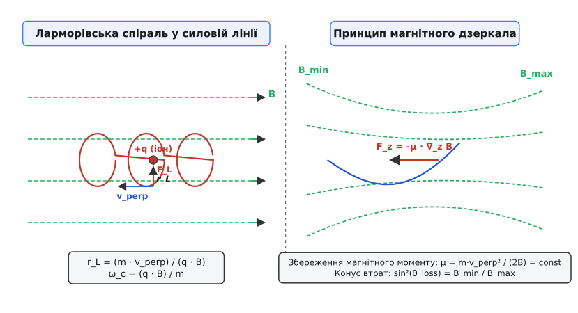
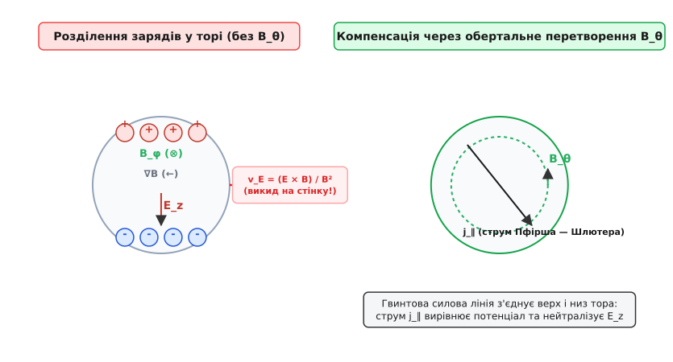
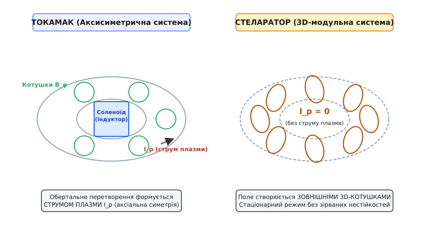
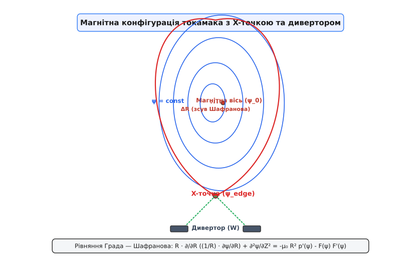

# Магнітне утримання плазми

<preknowlist>
- [Фізика плазми](root:ph-electromagnetism/plasma-physics) — квазінейтральність, дебаївський радіус і плазмова частота.
- [Сила Лоренца](root:ph-electromagnetism/lorentz-force) — ларморівський радіус, циклотронне обертання заряджених частинок у магнітному полі.
- [Рівняння Максвелла](root:ph-electromagnetism/maxwell-equations) — магнітний тиск, напруженість поля та струми в суцільному середовищі.
</preknowlist>

Щоб здійснити термоядерний синтез ядер дейтерію та тритію, речовину необхідно розігріти до температур понад `100 000 000 K` (що відповідає середній кінетичній енергії частинок близько `10 кеВ`). При таких температурах атоми повністю іонізуються, перетворюючись на високотемпературну плазму. Проте жоден твердий матеріал на Землі не здатен витримати прямий контакт із речовиною такої температури: найтугоплавкіший метал — вольфрам — плавиться вже при `3695 K` (`0.32 еВ`). Безпосереднє торкання плазмового шнура до твердої стінки камери викликає миттєве випаровування матеріалу стінки та вибухоподібне охолодження самої плазми через гальмівне випромінювання на важких домішках. Розв'язанням цієї фізичної суперечності стало **магнітне утримання плазми** — створення безконтактної магнітної пастки, у якій силові лінії сильного магнітного поля відіграють роль невидимого термоізоляційного барьєру.

---

### Принцип магнітного термоізолятора: ларморівський рух та магнітний тиск

Фізична основа магнітного утримання спирається на дію сили Лоренца `F = q · (v × B)` на вільні заряджені частинки плазми — електрони та позитивні іони. У рівномірному магнітному полі з індукцією `B` частинка вільна рухатися вздовж силової лінії з постійною паралельною швидкістю `v_parallel`, але у перпендикулярній площині сила Лоренца закручує її траєкторію у коло.

У результаті накладання двох руху частинка здійснює спіральний рух навколо силової лінії. Центр цього кола називається **провідним центром** (*guiding center*), а радіус обертання — **ларморівським радіусом** (на честь англійського фізика Джозефа Лармора, англ. *Joseph Larmor*):

```
r_L = (m · v_perp) / (|q| · B)
```

Частота цього обертання становить циклотронну частоту `ω_c = (|q| · B) / m`. Оскільки маса іона дейтерію приблизно у `3670` разів більша за масу електрона, ларморівський радіус іона `r_Li` за однакової температури перевищує радіус електрона `r_Le` у десятки разів. Для типових умов термоядерної плазми (`B = 5 Тл`, `T = 10 кеВ`) радіус обертання електрона становить частки міліметра (`r_Le ≈ 0.05 мм`), а іона дейтерію — кілька міліметрів (`r_Li ≈ 3 мм`).


*Зонний рух заряджених частинок у магнітному полі та відбиття від магнітного дзеркала.*

Магнітне поле кардинально змінює коефіцієнти переносу тепла й маси. Уздовж силових ліній теплопровідність плазми `κ_parallel` залишається велетенською (вона зростає з температурою як `T^(7/2)`), оскільки носії вільно пролітають величезні відстані. Проте у напрямку, перпендикулярному до магнітного поля, перенос тепла обмежується кроками ларморівських спіралей при рідкісних зіткненнях:

```
κ_perp ≈ κ_parallel / (1 + ω_c² · τ_coll²)
```

де `τ_coll` — середній час між парними кулонівськими зіткненнями. Оскільки у сильній плазмі добуток `ω_c · τ_coll >> 1` (перевищує `10⁸`), перпендикулярна теплопровідність зменшується у сотні мільйонів разів. Магнітне поле перетворює плазму на анізотропне середовище: ідеальний провідник тепла уздовж поля і відмінний термоізолятор упоперек нього.

З макроскопічної точки зору суцільного середовища (магнітогідродинаміка, МГД) магнітне поле чинить на плазму механічний тиск. Сумарний тензор напружень магнітного поля містить скалярний **магнітний тиск**:

```
P_mag = B² / (2 · μ₀)
```

де `μ₀ = 4π · 10⁻⁷ Гн/м` — магнітна стала. Магнітне поле з індукцією `B = 5 Тл` створює магнітний тиск близько `10 МПа` (майже `100 атмосфер`). Для утримання плазми з кінетичним тиском `p = n · k_B · T` магнітний тиск повинен перевищувати тиск плазми. Ефективність використання магнітного поля характеризується безрозмірним параметром **бета** (`β`):

```
β = p / P_mag = (2 · μ₀ · n · k_B · T) / B²
```

Економічна вигідність майбутнього термоядерного реактора вимагає якомога вищого `β`, проте фізичні межі стійкості плазми обмежують значення `β` у токамаках кількома відсотками (`3–5%`).

Щоб утримувати тепло, плазма повинна задовольняти **критерій Лоусона** (на честь британського фізика Джона Д. Лоусона, англ. *John D. Lawson*). Для самопідтримуваної реакції синтезу потрійний добуток густини електронів `n_e`, часу утримання енергії `τ_E` та іонної температури `T_i` повинен досягати порогового значення:

```
n_e · τ_E · T_i ≥ 3 · 10²¹  [ м⁻³ · с · кеВ ]
```

Головне завдання магнітного утримання полягає саме у максимізації часу утримання енергії `τ_E` — часу, за який теплова енергія плазми витікає назовні за відсутності джерел нагріву.

---

### Тороїдальний криз: дрейфи частинок та потреба у обертальному перетворенні

Найпростіша ідея магнітної пастки — прямий соленоїд обмеженої довжини — виявляється непридатною: частинки вільно вилітають через його відкриті торці з тепловими швидкостями. Виникає природна ідея замкнути соленоїд у кільце, утворивши тороїдальну вакуумну камеру.

Однак згортання соленоїда у тор породжує принципову фізичну проблему. Згідно з законом Повного струму, тороїдальне магнітне поле `B_φ` спадає від внутрішнього радіуса тора `R_in` до зовнішнього `R_out` обернено пропорційно великому радіусу `R`:

```
B_φ(R) = (μ₀ · N · I_coil) / (2π · R)
```

Магнітне поле в торі стає неоднорідним (`∇B ≠ 0`) та викривленим (лінії поля мають радіус кривизни `R_c = R`). У такому полі на провідний центр частинки починають діяти два незалежних ефекти: **градієнтний дрейф** (`v_grad`) та **дрейф кривизни** (`v_curv`).

```
v_grad = ( m · v_perp² · (B × ∇B) ) / (2 · q · B³)
v_curv = ( m · v_parallel² · (R_c × B) ) / (q · R_c² · B²)
```


*Вертикальне розділення зарядів через градієнтний дрейф та його нейтралізація полоїдальним полем B_θ.*

Обидва дрейфи пропорційні заряду частинки `q` у знаменнику. Це означає, що у тороїдальному полі позитивні іони та негативні електрони дрейфують у **протилежних вертикальних напрямках**: якщо іони дрейфують вгору, то електрони — вниз.

Це протилежне зміщення негайно руйнує квазінейтральність плазми на верхній та нижній межах шнура. Виникає просторове розділення зарядів, яке створює вертикальне електричне поле `E_z`. Заряджена плазма у зкрещених поляк `E_z` та `B_φ` випробує електричний дрейф **`E × B`**:

```
v_E = (E × B) / B²
```

Оскільки швидкість електричного дрейфу `v_E` **не залежить від знаку заряду**, і електрони, і іони разом починають дрейфувати в одному напрямку — **радіально назовні**, у бік слабшого магнітного поля. Суто тороїдальне магнітне поле взагалі не здатне утримувати плазму: плазмовий шнур розширюється і врізається у зовнішню стінку камери за мікросекунди.

Щоб подолати цей тороїдальний криз, необхідно змусити силові лінії магнітного поля викручуватися вздовж тора, утворюючи гвинтові лінії. Для цього до тороїдального поля `B_φ` додають перпендикулярне **полоїдальне магнітне поле** `B_θ`, спрямоване навколо малого перерізу тора.

Коли силова лінія стає гвинтовою, вона більше не замикається сама на себе за один обхід тора. Рухаючись уздовж такої лінії з високою паралельною швидкістю `v_parallel`, електрон почергово опиняється то у верхній (позитивно зарядженій), то у нижній (негативно зарядженій) частині камери. Подовжній електронний струм — **струм Пфірша — Шлютера** — миттєво коротко замикає вертикальне електричне поле `E_z`.

Мірою викручування силових ліній є **кут обертального перетворення** `ι` або **коефіцієнт запасу стійкості** `q_safety` (Safety Factor):

```
q_safety = (r · B_φ) / (R_0 · B_θ)
```

Фізичний зміст `q_safety` — це кількість повних тороїдальних обходів тора, яку має зробити силова лінія, щоб здійснити один повний обхід за полоїдальним кутом `θ`.

---

### Архітектури магнітного утримання: Токамак проти Стеларатора та відкритих пасток

Спосіб формування полоїдального поля `B_θ` розділив тороїдальні пастки на дві головні фізичні концепції: токамаки та стеларатори.


*Геометрія магнітних полів токамака та стеларатора.*

#### 1. Токамак
У токамаку (від *тороидальная камера с магнитными катушками*) полоїдальне поле `B_θ` створюється потужним **тороїдальним струмом плазми** `I_p`, який протікає безпосередньо через сам плазмовий шнур.

Струм плазми наводиться індукційним способом: вакуумна камера токамака слугує вторинною обмоткою гігантського трансформатора, первинною обмоткою якого є центральний соленоїд. Зміна струму у соленоїді створює вихрове електричне поле, яке іонізує газ та розганяє струм `I_p` величиною у мільйони ампер (до `15 МА` у проектованому ITER).

- **Переваги токамака:** Проста аксіальна симетрія, висока ефективність утримання тепла, високі значення `β`, омічний нагрів плазми безпосередньо струмом `I_p`.
- **Недоліки токамака:**
  1. *Імпульсний режим:* Індуктор може змінювати потік лише обмежений час, тому токамак за своєю природою є імпульсною машиною (потрібні складні зовнішні системи безіндукційної підтримки струму — NBI, EC/IC хвилі).
  2. *Зривні нестійкості:* Струм `I_p` є джерелом вільної енергії для розрядних нестійкостей. Якщо `q_safety` на краю падає нижче `2` або густина перевищує межу Ґрінвальда, виникає **зрив плазми** (*disruption*) — струм `I_p` розпадається за мікросекунди, викликаючи гігантські електродинамічні сили на корпус реактора.

Детальніше про історію протистояння двох концепцій та легендарний експеримент 1968 року з підтвердженням радянських результатів британською лазерною командою можна прочитати у вставці [Історія магнітного утримання: від листка паперу до термоядерних реакторів](root:ph-quantum/magnetic-confinement/hist-tokamak-stellarator.md).

#### 2. Стеларатор
У стелараторі (від лат. *stella* — зоря) полоїдальне поле `B_θ` створюється повністю **зовнішніми магнітними котушками**. Плазмовий струм для утворення магнітної конфігурації не потрібен (`I_p = 0`).

Для цього котушки роблять викрученими у 3D-просторі (модульні неаксіальні котушки, як у сучасному стелараторі Wendelstein 7-X).

- **Переваги стеларатора:** Принципово стаціонарний режим роботи (може працювати безперервно годинами), абсолютна відсутність струмових зривів плазми.
- **Недоліки стеларатора:** Відсутність аксіальної симетрії викликає підвищену неокласичну дифузію (вловлювання частинок у локальних магнітних ямах 3D-поля) та надзвичайно складне 3D-проектування і виготовлення котушок.

#### 3. Відкриті магнітні пастки (Магнітні дзеркала)
Альтернативою тороїдальним системам є відкриті пастки, де плазма утримується у прямому соленоїді, на кінцях якого створено області з підвищеним магнітним полем `B_max > B_min` — **магнітні дзеркала**.

Утримання спирається на збереження адіабатичного інваріанта — першого магнітного моменту `μ`:

```
μ = (m · v_perp²) / (2 · B) = const
```

Коли частинка рухається уздовж силової лінії у бік збільшення `B`, її перпендикулярна кінетична енергія `E_perp = μ · B` зростає. Оскільки повна кінетична енергія `E = E_perp + E_parallel` зберігається, паралельна енергія `E_parallel` зменшується. Якщо при досягненні горловини `B_max` паралельна швидкість `v_parallel` падає до нуля, частинка відбивається від магнітного дзеркала і повертається назад у центр пастки.

Частинки, чий кут між вектором швидкості та силовою лінією `θ` є надто малим, вилітають крізь дзеркало. Вони утворюють **конус втрат**:

```
sin²(θ_loss) = B_min / B_max
```

Основний недолік відкритих пасток — високий витік частинок через конус втрат внаслідок парних зіткнень, що обмежує їх застосування для термоядерного синтезу без складних методів торцевого потенціального запирання (амбіполярні пастки).

---

### Рівновага МГД та рівняння Града — Шафранова

У стаціонарному стані плазма в пастці перебуває у стані магнітогідродинамічної (МГД) рівноваги. Сумарна сила, що діє на кожен елемент об'єму плазми, дорівнює нулю:

```
∇p = j × B
```

де `p` — газокінетичний тиск плазми, `j` — густина електричного струму, `B` — індукція магнітного поля.

З цього рівняння випливають дві фундаментальні властивості рівноваги:
1. `B · ∇p = 0` — градієнт тиску перпендикулярний до силових ліній магнітного поля. Це означає, що силові лінії лежать на ізобарних поверхнях постійного тиску `p = const`.
2. `j · ∇p = 0` — лінії струму також лежать на цих самих поверхнях.

В аксіально-симетричному токамаку ці поверхні утворюють систему вкладених тороїдальних тороподібних поверхонь — **магнітних поверхонь**. Кожна така поверхня характеризується постійним значенням полоїдального магнітного потоку `ψ(R, Z)`.


*Вкладені магнітні поверхні, зсув Шафранова, X-точка та знімання теплового потоку дивертором.*

Двовимірний розподіл магнітного потоку `ψ(R, Z)` у токамаку описується нелінійним диференціальним рівнянням у частинних похідних Еліаса — Града — Шафранова:

```
R · (∂ / ∂R) [ (1 / R) · (∂ψ / ∂R) ] + (∂²ψ / ∂Z²) = - μ₀ · R² · p'(ψ) - F(ψ) · F'(ψ)
```

де `p(ψ)` — профіль тиску плазми, а `F(ψ) = R · B_φ` — функція тороїдального магнітного потоку.

Строгий математичний вивід рівняння Града — Шафранова із вихідних рівнянь Максвелла та МГД-балансу сил наведено у вставці [Математичний вивід рівняння Града — Шафранова та дрейфових швидкостей](root:ph-quantum/magnetic-confinement/math-grad-shafranov.md).

Важливим наслідком рівняння Града — Шафранова є **зсув Шафранова** (на честь радянського фізика Віталія Шафранова). Оскільки тиск плазми максимальний у центрі шнура, магнітні поверхні випирають назовні під дією газового тиску. Магнітна вісь (точка максимуму `ψ`) виявляється зсунутою назовні відносно геометричного центра вакуумної камери на величину `ΔR`:

```
ΔR ≈ (a² / (2 · R_0)) · [ β_p + (l_i / 2) ]
```

Зростання тиску плазми (збільшення `β_p`) збільшує зсув Шафранова. Якщо зсув стає порівняним із малим радіусом `a`, внутрішні магнітні поверхні сплющуються об зовнішню стінку, що ставить жорстку МГД-межу на максимальний тиск у токамаку.

---

### Фізика додаткового нагріву плазми

Початковий підйом температури у токамаку здійснюється **омічним нагрівпом** за рахунок джоульових втрат тороїдального струму плазми: `P_ohmic = η · j²`. Однак питомий опір гарячої плазми описується формулою Спітцера:

```
η_Spitzer ≈ (Z_eff · e² · m_e^(1/2) · ln Λ) / (4π · ε₀² · (k_B · T_e)^(3/2))
```

Оскільки опір зменшується як `T_e^(-3/2)`, омічний нагрів стає неефективним вже при температурах `T_e ≈ 2 ... 3 кеВ`, коли опір плазми падає нижче опору мідного провідника. Для досягнення термоядерних температур `10–15 кеВ` застосовують допоміжні методи нагріву:

1. **Інжекція нейтральних пучків (NBI):** Пучки високоенергетичних атомів дейтерію з енергією `1 МеВ` пробивають магнітний бар'єр і іонізуються у центрі плазмового шнура, передаючи кінетичну енергію іонам плазми.
2. **Іонно-циклотронний нагрів (ICRH):** Електромагнітні хвилі радіочастотного діапазону (`40–55 МГц`) резонансно розганяють іони на їхній циклотронній частоті.
3. **Електронно-циклотронний нагрів (ECRH):** Надвисокочастотне випромінювання гіротронів (`170 ГГц`) нагріває електронний компонент плазми та придушує неокласичні тирринг-моди.

---

### Фізика макронестійкостей, перезамикання та релятивістських електронів

Окрім плавного термодинамічного розширення, плазма схильна до розвитку швидких скінченно-резистивних МГД-нестійкостей. 

#### 1. Тирринг-моди та магнітні острови
У плазмі з скінченною провідністю `η > 0` силові лінії магнітного поля можуть розриватися та перезамикатися у раціональних точках `q = m / n` (де `m` та `n` — полоїдальне та тороїдальне модальні числа). Цей процес описується **тирринг-модами** (*tearing modes*).

У результаті магнітного перезамикання суцільні магнітні поверхні розпадаються, утворюючи замкнені трубки — **магнітні острови**. Магнітний острів коротко замикає радіальний перенос тепла: температура всередині острова вирівнюється, руйнуючи термоізоляцію. Якщо ширини двох сусідніх магнітних островів перекриваються (критерій Чирикова), силові лінії стають хаотичними (магнітна стохастизація), викликаючи швидке охолодження центру плазми.

#### 2. Фізика струмового зриву та біжучі електрони (Runaway Electrons)
Найнебезпечнішим феноменом у токамаку є **великий зрив плазми** (*major disruption*), який протікає у дві стадії:
1. *Теплова катастрофа (Thermal quench):* За час порядок `1 мс` через розростання тирринг-мод температура плазми падає з `10 кеВ` до `10 еВ`.
2. *Струмовий згасання (Current quench):* Падіння температури піднімає опір плазми `η` у мільйон разів. Струм плазми `I_p` швидко спадає (`dI_p / dt ≈ 10⁸ А/с`).

Згідно з законом індукції Фарадея `V_ind = -L · (dI_p / dt)`, швидкий розпад струму генерує у центрі камери велетенське індукційне електричне поле `E_ind ≈ 10 ... 100 В/м`.

Оскільки сила кулонівського гальмування електронів спадає зі зростанням швидкості як `1 / v²`, електрони з енергією вище порогу Дрейсера (`E > E_Dreicer`) під дією поля `E_ind` переходять у режим безперервного прискорення. Вони розганяються до релятивістських швидкостей (`γ >> 1`), утворюючи пучок **біжучих електронів** (*runaway electrons*) зі струмом у кілька мегаампер та енергією до `50 МеВ`. При виході такого пучка на стінку локальний питомий виділ енергії пропалює вольфрамову або берилієву облицювання вакуумної камери.

---

### Нестійкості плазми та аномальний турбулентний транспорт

Утримання плазми магнітним полем є нестійким станом: високотемпературна плазма є джерелом вільної енергії (градієнти температури, густини та струму), яку вона прагне вивільнити через розвиток гідромагнітних нестійкостей та мікротурбулентності.

#### 1. Макроскопічні МГД-нестійкості
Ці нестійкості охоплюють увесь плазмовий шнур і описуються в рамках ідеальної МГД:
- **Желобкова нестійкість (Interchange instability):** Виникає на зовнішній стороні тора, де магнітні лінії вигнуті опуклістю назовні («погана кривизна»). Плазма та магнітне поле міняються місцями, подібного до нестійкості Релея — Тейлора у рідинах.
- **Гвинтова нестійкість (Kink mode):** Якщо струм плазми `I_p` надто великий (`q_safety < 1`), плазмовий шнур вигинається у спіраль і торкається стінок.
- **Балонна нестійкість (Ballooning mode):** Локальне спучення плазми на зовнішньому екваторі тора під дією високого тиску `∇p`.

#### 2. Мікронестійкості та диффузія
Навіть якщо макроскопічні МГД-колебання подавлені, плазма залишається охопленою дрібномасштабними турбулентними пульсаціями — **дрейфовими хвилями**, викликаними градієнтами іонної температури (**ITG-моди**) та електронної температури (**ETG-моди**).

Ці турбулентні вихри призводять до того, що реальний коефіцієнт переносу тепла `D_anom` перевищує розрахований класичний коефіцієнт `D_class` на 2–3 порядки. Цей феномен називається **аномальним переносом**.

Розрізняють чотири режими переносу плазми у магнітному полі:
1. **Класична дифузія:** Перенос через рідкісні парні зіткнення у прямому полі (`D_class ∝ 1 / B²`).
2. **Неокласична дифузія:** Враховує тороїдальну геометрію та частинки, вловлені у магнітні ями («бананові орбіти»).
3. **Межа Бома (Bohm Diffusion):** Максимальна турбулентна дифузія `D_Bohm = (k_B · T) / (16 · e · B)`, яка вважалася здолати неможливою у 1960-х роках.
4. **H-режим (High Confinement Mode):** Режим покращеного утримання, відкритий у 1982 році. Завдяки зсуву радіального електричного поля `E × B` турбулентні вихри розриваються на краю плазми, формуючи **крайовий транспортний бар'єр** (Pedestal). У H-режимі час утримання тепла `τ_E` зростає удвічі порівняно зі звичайним L-режимом (Low Confinement).

Загальний час утримання енергії `τ_E` описується емпіричним законом масштабування IPB98(y,2):

```
τ_E = 0.0562 · I_p^0.93 · B_0^0.15 · P_loss^-0.69 · n_e^0.41 · M^0.19 · R_0^1.97 · ε^0.58 · κ^0.78
```

з якого видно вирішальну роль розміру реактора `R_0` та струму `I_p` у забезпеченні теплоізоляції.

Перевірити, як поводяться окремі частинки під дією дрейфів та чисельно зінтегрувати їхні траєкторії, можна за допомогою симулятора у вставці [Моделювання руху провідного центру плазми у тороїдальному магнітному полі](root:ph-quantum/magnetic-confinement/proj-guiding-center-sim.md).

---

### Термоядерний відвід енергії та диверторна физика

Навіть за умови ідеального магнітного утримання всю термоядерну потужність нагріву альфа-частинками (у реакторі масштабу ITER це близько `100 МВт`) необхідно безперервно відводити з вакуумної камери.

У ранніх токамаках плазмовий шнур обмежували механічною діафрагмою — **лімітером** (*limiter*). Проте пряме зіткнення плазми з лімітером спричиняло важкий ерозійний знос матеріалу та забруднення центру плазми важкими іонами.

Сучасні системи магнітного утримання використовують **диверторну конфігурацію**. За допомогою зовнішніх полоїдальних котушок магнітне поле коригують так, що створюється нульова точка полоїдального поля — **X-точка**.

Магнітна поверхня, що проходить через X-точку, називається **сепаратрисою**. Вона ділить вакуумну камеру на дві області:
- **Замкнені магнітні поверхні** всередині сепаратриси, де плазма надійно утримується.
- **Відкриті силові лінії** за сепаратрисою — **шар відскрібання** (Scrape-Off Layer, SOL).

Плазма, що просочується крізь сепаратрису в область SOL, вільно тече вздовж відкритих силових ліній у спеціально захищену нижню частину камери — на **пластини дивертора**.

Питомий тепловий потік на пластини дивертора у чистому режимі досягає катастрофічних значень `q_div > 50 МВт/м²`. Щоб запобігти розплавленню вольфрамових елементів дивертора, застосовують режим **від'єднаної плазми** (*detached divertor*): у шар SOL впорскують мікродози випромінювальних газів (неон, аргон або азот). Газ інтенсивно випромінює енергію у вигляді ультрафіолетового світла, рівномірно розподіляючи тепло по великій площі стінок камери і знижуючи температуру плазми біля самих пластин дивертора до безпечних `T_e < 5 еВ`.

Зведені технічні специфікації, параметри диверторів та порівняльні характеристики термоядерних установок наведено у довідниковій вставці [Специфікація та інженерні параметри тороїдальних магнітних пасток](root:ph-quantum/magnetic-confinement/api-iter-specs.md).

Магнітне утримання плазми пройшло шлях від сміливих фізичних гіпотез 1950-х років до масштабного міжнародного інженерного втілення. Синтез теорії магнітогідродинаміки, фізики плазмових нестійкостей та надпровідникових технологій утворює науковий фундамент для створення чистих і практично безмежних джерел енергії майбутнього.
