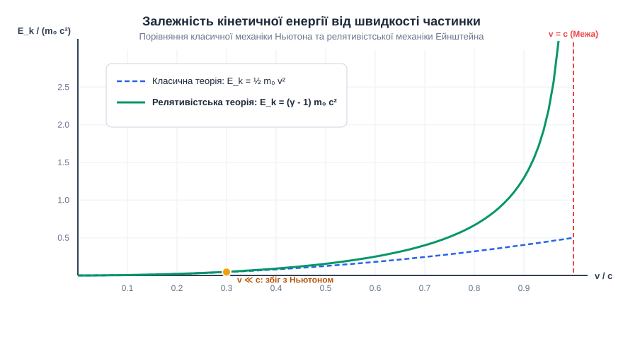
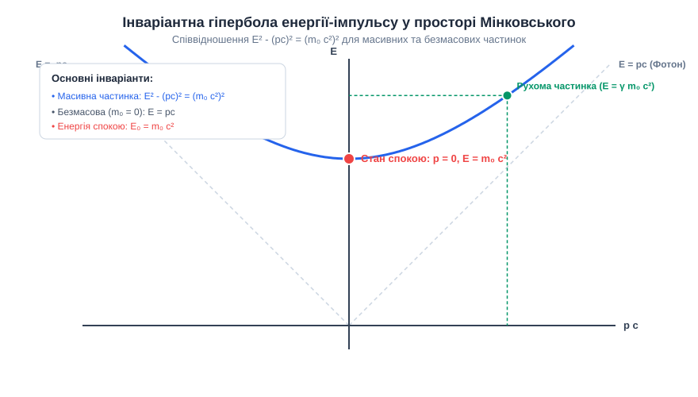
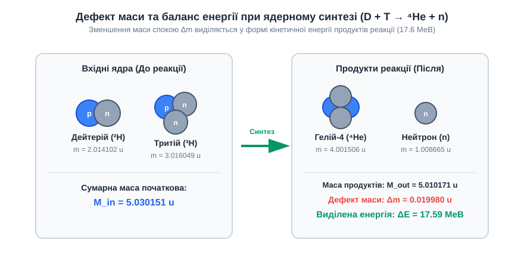

<preknowlist>
- [Поняття інерційної системи відліку та принцип відносності](root:ph-mechanics/inertial-frame)
- [Закон збереження імпульсу та кінетична енергія](root:ph-mechanics/kinetic-energy)
- [Закон збереження енергії у класичній механіці](root:ph-mechanics/energy-conservation)
</preknowlist>

# Еквівалентність маси та енергії

При спробі розгону електрона або протона у сучасному кільцевому прискорювачі частинок до швидкостей, що наближаються до швидкості світла у вакуумі `c`, фізики зіштовхуються з принциповим обмеженням нерелятивістської динаміки. Згідно з класичною механікою Ньютона, стала сила `F` має надавати тілу стале прискорення `a = F / m`, дозволяючи розгонити об'єкт до як завгодно великих швидкостей, а виконана силою робота повинна безмежно накопичуватися у формі кінетичної енергії `E_k = ½·m·v²`. Проте реальний експеримент показує зовсім інше: скільки б електромагнітної енергії не закачували прискорювальні надпровідні резонатори у частинку, її швидкість принципово не може перевищити межу `c = 299 792 458 м/с`. При цьому опір частинки подальшому прискоренню нескінченно зростає, а підведена від зовнішнього поля енергія накопичується у вигляді додаткової інерції системи.

Цей фундаментальний ефект розкриває головний висновок релятивістської механіки: сама енергія володіє інерційними властивостями. Маса спокою об'єкта `m₀` є не абстрактною «кількістю речовини», а еквівалентом локалізованої всередині фізичної системи енергії спокою `E₀ = m₀·c²`.


*Курсивний підпис: Залежність кінетичної енергії від швидкості частинки за класичною механікою Ньютона (пунктир) та релятивістською механікою Ейнштейна (суцільна лінія).*

## Межа класичної механіки та парадокс прискорення

Для того щоб зрозуміти, чому класична формула кінетичної енергії дає збій на високих швидкостях, простежимо за механізмом передачі імпульсу частинці. У ньютонівській фізиці маса `m` вважається абсолютним інваріантом, який не залежить від стану руху тіла чи його внутрішньої енергії. Звідси випливає лінійний зв'язок між імпульсом та швидкістю `p = m·v` і квадратний зв'язок для кінетичної енергії `E_k = p² / (2m)`.

У спеціальній теорії відносності фундаментальним інваріантом простору-часу є не окремий час чи простір, а просторово-часовий інтервал `ds² = -(c dt)² + dx² + dy² + dz²`. Через скінченність швидкості поширення будь-яких взаємодій `c` лоренцівське перетворення координат при переході між інерційними системами відліку змінює зв'язок між силою `F` та викликаним нею прискоренням `a`. Релятивістський імпульс частинки описується формулою:

```
p = γ · m₀ · v = (m₀ · v) / √(1 - v²/c²)    [релятивістський імпульс]
```

де `γ = 1 / √(1 - v²/c²)` — релятивістський лоренц-множник, а `m₀` — інваріантна маса спокою частинки.

Коли швидкість частинки мала порівняно зі швидкістю світла (`v ≪ c`), релятивістський множник `γ` практично дорівнює одиниці, і формула імпульсу збігається з ньютонівською `p ≈ m₀·v`. Проте коли швидкість `v` прямує до `c`, знаменник `√(1 - v²/c²)` прямує до нуля, а лоренц-множник `γ` неограничено зростає (`γ → ∞`).

Якщо ми прикладаємо до частинки сталу силу `F = dp/dt`, то за час `t` частинка отримує імпульс `p = F·t`. Але оскільки релятивістський імпульс пов'язаний зі швидкістю співвідношенням `p = γ·m₀·v`, зростання імпульсу при наближенні швидкості до `c` відбувається не за рахунок зростання швидкості, а за рахунок стрімкого зростання лоренц-множника `γ`:

```
v = p / √(m₀² + p²/c²)                       [вираження швидкості через імпульс]
```

При неограниченому зростанні імпульсу `p → ∞` границя швидкості дорівнює:

```
lim_{p → ∞} (p / √(m₀² + p²/c²)) = c          [асимптотична межа швидкості]
```

Принципово важливо розрізняти поздовжнє та поперечне прискорення релятивістської частинки. З другого закону Ньютона у формі `F = dp/dt = d(γ m₀ v)/dt` випливає, що якщо сила діє уздовж напрямку руху (`F ∥ v`), прискорення дорівнює:

```
a_parallel = F / (γ³ · m₀)                    [поздовжнє прискорення]
```

Тоді як при дії сили перпендикулярно до напрямку руху (`F ⊥ v`, наприклад у магнітному полі прискорювача) прискорення дорівнює:

```
a_perpendicular = F / (γ · m₀)                [поперечне прискорення]
```

Це свідчить про те, що інертні властивості частинки стають анізотропними відносно зовнішнього впливу, а коефіціент інерції стрімко зростає як `γ³` для поздовжнього прискорення.

Виконана зовнішньою силою робота `W = ∫ F dx` не зникає безвісти. Вона перетворюється на кінетичну енергію частинки `E_k`. Інтегрування роботи сили з урахуванням релятивістського імпульсу дає підсумковий вираз для кінетичної енергії:

```
E_k = (γ - 1) · m₀ · c²                      [релятивістська кінетична енергія]
```

Цей вираз чітко пояснює парадокс прискорення: для розгону будь-якого тіла з масою спокою `m₀ > 0` до точної швидкості світла `v = c` знадобилося б передати частинці нескінченну кількість енергії `E_k → ∞`, що є фізично неможливим. Окрім того, оскільки швидкість світла є граничною швидкістю поширення будь-якої інформації та взаємодії, у природі не існує абсолютно твердих тіл: швидкість звуку (пружних хвиль) у будь-якому середовищі принципово обмежена величиною `v_s < c`.

Докладовий процес виведення цієї формули та фізичні передумови перших теоретичних моделей детально розібрано у матеріалі [Математичний вивід співвідношення між енергією, імпульсом та масою](root:ph-quantum/mass-energy-equivalence/math-mass-energy-derivation.md).

## Фізичний зміст фундаментальної формули E = mc²

Знамените рівняння Ейнштейна `E = m·c²` найчастіше тлумачать спрощено — як формулу перетворення маси у енергію під час ядерного вибуху. Проте у фундаментальній фізиці це рівняння має набагато глибший зміст: воно стверджує повну еквівалентність та тотожність інертної маси спокою та внутрішньої енергії фізичної системи.

Повна релятивістська енергія рухомої частинки складується з її кінетичної енергії `E_k` та власної енергії спокою `E₀`:

```
E = E_k + E₀ = γ · m₀ · c²                   [повна релятивістська енергія]
```

Коли частинка перебуває у стані спокою відносно спостерігача (`v = 0`, `γ = 1`), її кінетична енергія дорівнює нулю (`E_k = 0`), проте її повна енергія не дорівнює нулю. Частинка володіє залишковою енергією спокою:

```
E₀ = m₀ · c²                                 [енергія спокою]
```

Множник `c²` (квадрат швидкості світла у вакуумі) у цій формулі виконує роль універсального константного коефіцієнта переведення одиниць вимірювання між масою (що вимірюється в кілограмах) та енергією (що вимірюється в джоулях):

```
c² = (299 792 458 м/с)² ≈ 8.98755 × 10¹⁶ Дж/кг    [конверсійний коефіцієнт]
```

Величина цього коефіцієнта вражає: 1 кілограм будь-якої речовини у стані спокою містить у собі `8.98755 × 10¹⁶` джоулів внутрішньої енергії. Це еквівалентно спалюванню близько 2.1 мільйонів тонн нафти або вибуху 21.5 мегатонн тротилу.

Маса фізичної системи не є сумою мас її окремих елементарних складників у вільному стані. Маса є глобальною характеристикою всієї зв'язаної системи, яка враховує не лише маси спокою її частинок, але й кінетичну енергію їхнього внутрішнього руху, а також потенціальну енергію всіх внутрішніх взаємодій (електромагнітних, сильних, слабких та гравітаційних).

Розглянемо докладніше кілька наочних прикладів інерції внутрішньої енергії:

1. **Стиснута пружина та деформація:** Якщо ми стискаємо сталеву пружину, виконуючи механічну роботу `W`, потенціальна енергія пружної деформації зростає на `ΔE = W`. Згідно з принципом еквівалентності, маса стиснутої пружини стає більшою за масу такої самої нестиснутої пружини на величину `Δm = ΔE / c²`. Хоча ця прибавка маси є мізерно малою (порядку `10⁻¹⁵` кг для побутової пружини), фундаментально вона існує і надає пружині додаткової інерції.
2. **Термодинамічна маса газу:** Судина з гарячим газом має більшу масу, ніж та сама судина з холодним газом. Додаткова маса `Δm = ΔE_th / c²` зумовлена вищою хаотичною кінетичною енергією теплового руху молекул газу та енергією міжмолекулярних зіткнень.
3. **Структура маси адронів (протон та кварки):** Маса спокою протона становить приблизно `938.27 МеВ/c²`. Проте протон складається з трьох валентних кварків (двох `u`-кварків та одного `d`-кварка), сумарна маса спокою яких становить лише близько `9 МеВ/c²` (менше 1% маси протона!). Звідки береться решта 99% маси протона? Вона є кінетичною енергією релятивістського руху кварків та енергією квантово-хромодинамічного глюонного поля сильної взаємодії, що утримує кварки у конфайнменті. 

Отже, наша власна вага та маса всього оточуючого макроскопічного світу на 99% складається з енергії руху та взаємодії фундаментальних квантових полів, а не з «власної маси спокою» фундаментальних частинок.

Детальний аналіз хронології відкриття цього принципу, роль досліджень Томсона, Газеноерля та думових експериментів Ейнштейна викладено у статті [Історія відкриття еквівалентності маси та енергії](root:ph-quantum/mass-energy-equivalence/hist-mass-energy.md).

## Релятивістський імпульс та чотиривектор у просторі Мінковського

У чотиривимірному формалізмі спеціальної теорії відносності 3-вимірний вектор швидкості та скалярна енергія об'єднуються у єдиний геометрізований чотиривектор енергії-імпульсу (або 4-імпульс) `p^μ`:

```
p^μ = (E / c, p_x, p_y, p_z)                 [чотиривектор імпульсу]
```

Часова компонента 4-імпульсу дорівнює повній енергії системи, поділеній на швидкість світла `E / c`, а просторові компоненти утворюють звичайний 3-вимірний релятивістський вектор імпульсу `p⃗ = γ m₀ v⃗`.

Скалярний квадрат 4-імпульсу у просторі Мінковського обчислюється через псевдоевклідовий скалярний добуток з метрикою `η_μν = diag(-1, 1, 1, 1)`:

```
p_μ · p^μ = -(E / c)² + p_x² + p_y² + p_z² = -(E / c)² + p²    [скалярний квадрат 4-імпульсу]
```

Оскільки 4-імпульс є добутком інваріантної маси спокою `m₀` на 4-швидкість `u^μ` (скалярний квадрат якої дорівнює `u_μ · u^μ = -c²`), скалярний квадрат 4-імпульсу є лоренц-інваріантом відносно будь-яких бустів Лоренца і дорівнює:

```
p_μ · p^μ = -m₀² · c²                        [інваріант маси]
```

Прирівнюючи ці два вирази, ми отримуємо фундаментальне інваріантне співвідношення між енергією, імпульсом та масою спокою, яке виконується для будь-якого фізичного об'єкта у будь-якій системі відліку:

```
E² - (p · c)² = (m₀ · c²)²                   [інваріантне релятивістське співвідношення]
```

або у формі розв'язку відносно повної енергії:

```
E = √((p · c)² + (m₀ · c²)²)                 [повна енергія через імпульс та масу]
```


*Курсивний підпис: Інваріантна гіпербола E² - (pc)² = (m₀c²)² у просторі енергія-імпульс. Для масивних частинок стан спокою відповідає найнижчій точці E = m₀c², а для безмасових частинок енергетична крива збігається з асимптотою E = pc.*

Рівняння `E² - (pc)² = (m₀c²)²` являє собою гіперболу у двовимірному зрізі простору енергія-імпульс `(pc, E)`. Цей геометричний зв'язок дозволяє аналізувати два граничні класи фізичних частинок у природі:

1. **Масивні частинки (`m₀ > 0`):** Для будь-якої масивної частинки (електрон, протон, атом) стан спокою відповідає вершині гіперболи `p = 0`, де енергія мінімальна і дорівнює `E₀ = m₀·c²`. При підвищенні імпульсу стан частинки рухається вгору по вітці гіперболи.
2. **Безмасові частинки (`m₀ = 0`):** Для частинок із нульовою масою спокою (фотон, гравітон) гіпербола вироджується у свої асимптоти — так званий світловий конус простору-часу:

```
E = p · c                                    [енергія безмасової частинки]
```

Для фотона зв'язок між енергією та імпульсом строго лінійний: фотон не може перебувати у стані спокою (`v = c` у будь-якій інерційній системі відліку). Його імпульс дорівнює `p = E / c`. 

Існування імпульсу у безмасового світла підтверджується експериментально через тиск світла (відкритий Петром Лебедєвим у 1899 році) та ефект Комптона (розсіяння фотонів на вільних електронах з оновленням довжини хвилі `Δλ = (h / m_e c) (1 - cos θ)`).

Нерелятивістський граничний перехід при малих імпульсах (`p ≪ m₀·c`) виходить із розкладу Тейлора:

```
E = m₀ · c² · √(1 + (p / (m₀ · c))²) ≈ m₀ · c² + p² / (2m₀)    [розклад Тейлора для малих імпульсів]
```

Звідси чітко видно, що класична кінетична енергія Ньютона `E_k = p² / (2m₀) = ½·m₀·v²` є лише першим динамічним наближенням до повної релятивістської енергії.

## Дефект маси, енергія зв'язку та ядерні перетворення

Найбільш вражаючим практичним проявом еквівалентності маси та енергії є так званий дефект маси у ядерних реакціях, радіоактивному розпаді та термоядерному синтезі.

Атомне ядро складається з позитивно заряджених протонів та нейтральних нейтронів (які разом називаються нуклонами), утриманих разом потужними силами сильної ядерної взаємодії. Якщо виміряти точну масу спокою сформованого ядра `m_nucleus` за допомогою мас-спектрометра високої роздільної здатності та порівняти її із сумою мас тих самих вільних нуклонів у розмежованому стані, виявляється несподіваний факт: маса ядра завжди менша за суму мас його складових частин!

```
Δm = Z · m_p + (A - Z) · m_n - m_nucleus     [визначення дефекту маси]
```

де `Z` — кількість протонів, `A` — масове число (сума протонів і нейтронів), `m_p` — маса вільного протона, `m_n` — маса вільного нейтрона.

Зменшення маси `Δm` називається **дефектом маси**. Куди зникає ця маса при формуванні ядра?

Коли вільні протони та нейтрони зближуються під дією ядерних сил і об'єднуються у ядро, потенціальна енергія сильної взаємодії зменшується. Вивільнена енергія випромінюється у навколишній простір у формі високоенергетичних гамма-квантів або кінетичної енергії вилітаючих частинок. Оскільки система втратила енергію `E_b = Δm · c²`, відповідно до рівняння Ейнштейна її маса спокою зменшилася точнісінько на `Δm`.

Енергія `E_b = Δm · c²` називається **енергією зв'язку ядра**. Це енергія, яку необхідно підвести до ядра ззовні, щоб повністю розщепити його на окремі вільні нуклони.


*Курсивний підпис: Баланс збереження маси та виділення енергії при термоядерній реакції синтезу дейтерію й тритію.*

Характерним показником стабільності атомних ядер є питома енергія зв'язку на один нуклон `ε = E_b / A`. Якщо побудувати графік залежності `ε` від масового числа `A`, утвориться куполоподібна крива з максимумом у районі елементів групи заліза (`⁵⁶Fe`, `⁶²Ni`), де питома енергія зв'язку досягає приблизно `8.8 МеВ/нуклон`.

Ця форма кривої пояснює два фундаментальні джерела енергетики Всесвіту:

1. **Термоядерний синтез легких ядер (Fusion):** При об'єднанні найлегших ядер (наприклад, дейтерію `²H` та тритію `³H` у ядро гелію-4 `⁴He`) питома енергія зв'язку стрімко зростає від 1.1 МеВ/нуклон до 7.1 МеВ/нуклон. В результаті реакції `²H + ³H → ⁴He + n` виділяється `17.59 МеВ` енергії на один акт синтезу. Саме ця реакція (разом із протон-протонним циклом та CNO-циклом) живить Сонце та інші зорі головної послідовності й лежить в основі розробки керованого термоядерного синтезу (ITER, токамаки).
2. **Поділ важких ядер (Fission):** При розщепленні дуже важких ядер (урану-235 `²³⁵U` або плутонію-239 `²³⁹Pu`) під дією нейтронів на два уламки середньої маси питома енергія зв'язку зростає з 7.6 МеВ/нуклон до 8.5 МеВ/нуклон. При кожному акті поділу урану виділяється близько `200 МеВ` кінетичної енергії уламків поділу.

Синтез елементів, важчих за залізо та нікель (`A > 60`), є ендотермічним процесом. Він відбувається у Всесвіті лише під час катастрофічних астрофізичних подій — вибухів наднових зірок та злиття нейтронних зірок через швидкий захоплення нейтронів (`r-процес`), де накопичена енергія створює важкі елементи на зразок золота, платини та урану.

Найбільш чистим прикладом 100% перетворення маси спокою у енергію випромінювання є процес анігіляції частинки та античастинки, наприклад електрона та позитрона:

```
e⁻ + e⁺ → 2γ                                 [анігіляція електрон-позитронної пари]
```

У цьому процесі маса спокою обох частинок `2 m_e ≈ 1.022 МеВ/c²` повністю зникає, а випромінені гамма-кванти несуть сумарну енергію `E = 2 m_e c²`. Навпаки, у високоенергетичних зіткненнях фотонів із ядрами відбувається процес народження пар `γ + Z → e⁻ + e⁺ + Z`, де енергія гамма-кванта перетворюється у масу спокою електрон-позитронної пари.

Алгоритми числового розрахунку ядерного дефекту маси, енергетичного виходу `Q`-значення та релятивістської кінематики з прикладами коду мовами C і C++ наведено у практичному блоці [Обчислення дефекту маси, енергії зв'язку та кінематики ядерних реакцій](root:ph-quantum/mass-energy-equivalence/proj-mass-defect-calc.md).

## Типові помилки та поширені міфи

Навколо принципу еквівалентності маси та енергії протягом десятиліть сформувалася низка стійких методичних помилок та неточних трактувань, які часто кочують із підручника в підручник.

### Міф 1: "Маса перетворюється на енергію"

Це наиболее поширена мовна та концептуальна помилка. Фраза «маса перетворюється на енергію» створює хибне враження, ніби маса та енергія є двома різними матеріальними субстанціями (як вода та пара), і одна субстанція може знищуватися, виникаючи у вигляді іншої.

Насправді маса **не перетворюється** на енергію, тому що маса **і є** енергією спокою. У ядерній реакції чи анігіляції відбувається не знищення маси, а перетворення одного виду енергії (зв'язаної енергії спокою частинок) у інший вид енергії (кінетичну енергію продуктів чи енергію електромагнітного випромінювання).

Якщо розглянути замкнену ізольовану систему (включаючи всі випромінені фотони та продукти реакції), то:
- Повна енергія системи `E_total` строго зберігається.
- Повний 4-імпульс системи `P^μ_total` строго зберігається.
- Інваріантна маса всієї системи `M_system = √(E_total² - (P_total c)²) / c²` залишається **абсолютно незмінною**.

Зменшується лише маса спокою окремих локалізованих ядер `Δm_rest`, оскільки частина випроміненої енергії покидає реакційну зону.

### Міф 2: "Релятивістська маса m(v) = γ m₀"

У багатьох популярних книгах та підручниках XX століття вводилося поняття «релятивістської маси», що залежить від швидкості: `m(v) = γ · m₀ = m₀ / √(1 - v²/c²)`. Стверджувалося, що при наближенні швидкості тіла до `c` його маса зростає до нескінченності.

Сучасна теоретична фізика повністю відмовилася від поняття «релятивістської маси». Причини відмови фундаментальні:

1. Термін «маса» у сучасній фізиці означає єдину величину — **лоренц-інваріантну масу спокою** `m₀` (або просто `m`), яка є скаляром і однакова у всіх інерційних системах відліку.
2. Введення `m(v)` створює хибне уявлення, ніби маса зростає від руху. Проте рух є відносним: у власній системі відліку частинка залишається нерухомою, і її маса не змінюється.
3. У релятивістській динаміці другий закон Ньютона не виконується у формі `F = m(v)·a`. Прискорення частинки залежить від кута між вектором сили та вектором швидкості. При поздовжній силі `F ∥ v` коефіцієнт пропорційності між силою та прискоренням дорівнює `γ³ m₀`, а при поперечній силі `F ⊥ v` він дорівнює `γ m₀`. Тобто спроба зберегти формулу `F = m·a` змусила б вводити «поздовжню» та «поперечну» маси, що остаточно заплутує фізику.

Тому у сучасній науковій літературі маса завжди означає інваріантну масу спокою `m₀`, а ефекти прискорення описуються через релятивістський 4-імпульс та лоренц-множник `γ`.

### Міф 3: "Рівняння E = mc² застосовне лише до ядерної фізики"

Існує хибна думка, що еквівалентність маси та енергії працює лише у ядерних реакціях чи при розщепленні атома. Це не так. Формула `Δm = ΔE / c²` є абсолютним законом природи і працює для будь-яких фізичних та хімічних процесів:
- При горінні природного газу (метану) у конфорці виділяється близько `50 МеДж` енергії на 1 кг палива. Це означає, що маса продуктів згоряння (вуглекислого газу та води) менша за масу вихідного метану й кисню на `Δm = 50 × 10⁶ / (9 × 10¹⁶) ≈ 5.5 × 10⁻¹¹ кг`.
- При заряджанні літій-іонного акумулятора смартфона енергією `50 кДж` його маса зростає на `Δm ≈ 5.5 × 10⁻¹⁴ кг`.

У хімічних та механічних процесах зміна маси настільки мала, що її неможливо виміряти наявними макроскопічними терезами, проте фізично вона принципово присутня. У ядерних процесах питома енергія взаємодії у мільйони разів більша, тому дефект маси стає помітною величиною (близько 0.1–0.7% від маси ядер).

## Роль у загальній теорії відносності та релятивістській астрофізиці

У загальній теорії відносності (ЗТВ) Ейнштейна еквівалентність маси та енергії отримує фундаментальне узагальнення. Джерелом викривлення чотиривимірного простору-часу та виникнення гравітаційного поля є не просто маса спокою, а тензор енергії-імпульсу матерії `T_μν`.

Рівняння гравітаційного поля Ейнштейна мають вигляд:

```
G_μν = (8πG / c⁴) · T_μν                     [рівняння поля Ейнштейна]
```

де `G_μν` — тензор Ейнштейна, що описує геометрію та кривину простору-часу, `G` — гравітаційна константа Ньютона, а `T_μν` — тензор енергії-імпульсу.

Тензор `T_μν` включає у себе всі види енергії:
- Густину маси спокою та густину внутрішньої теплової енергії (`T₀₀`).
- Густину імпульсу та потоки енергії (`T₀i`).
- Напруження, тиск речовини та електромагнітного поля (`T_ij`).

Це означає, що гравітаційно притягує не лише маса спокою, але й будь-яка енергія. Наприклад, електромагнітне випромінювання, позбавлене маси спокою, створює власне гравітаційне поле і водночас відхиляється у викривленому просторі-часі поблизу масивних тіл (ефект гравітаційного лінзування світла).

У релятивістській астрофізиці еквівалентність маси та енергії визначає еволюцію та фінал зірок:
1. **Гравітаційний колапс та чорні дири:** Коли масивна зоря вичерпує термоядерне паливо, внутрішній тиск випромінювання більше не може протидіяти власному гравітаційному стисненню. Під час колапсу у чорну диру гравітаційна енергія зв'язку може перетворюватися на потужні спалахи наднових та випромінювання гравітаційних хвиль.
2. **Акреційні диски:** При падінні речовини на чорну диру у щільному акреційному диску за рахунок в'язкого тертя у енергію випромінювання може перетворюватися до 10–40% маси спокою падаючої речовини (що у десятки разів ефективніше за термоядерний синтез у ядрах зірок).
3. **Межа Оппенгеймера — Волкова:** У нейтронних зірках внутрішній тиск ядерної речовини додає інерції та підсилює гравітаційне притягання згідно з `T_ij`. Це створює релятивістську межу маси нейтронної зірки (близько `2.2–3.0` мас Сонця), перевищення якої неминуче призводить до колапсу у чорну диру.

Таким чином, еквівалентність маси та енергії `E = m·c²` є не просто окремою формулою релятивістської механіки, а фундаментальним принципом природи, який об'єднує геометрію простору-часу, квантову фізику частинок та структуру нашого Всесвіту.
