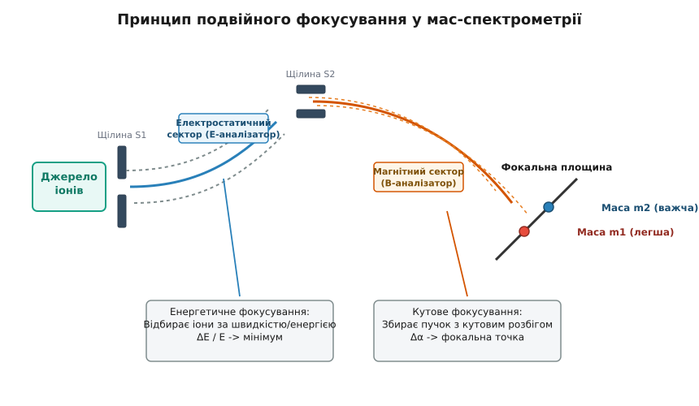
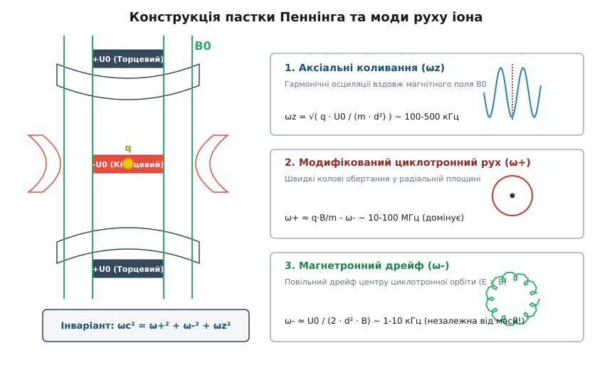
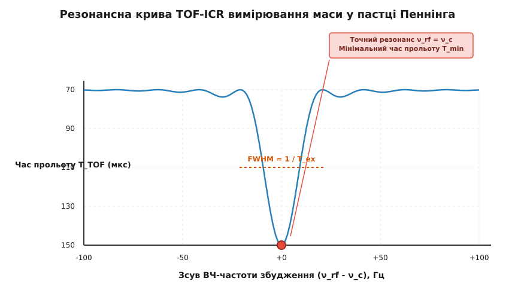
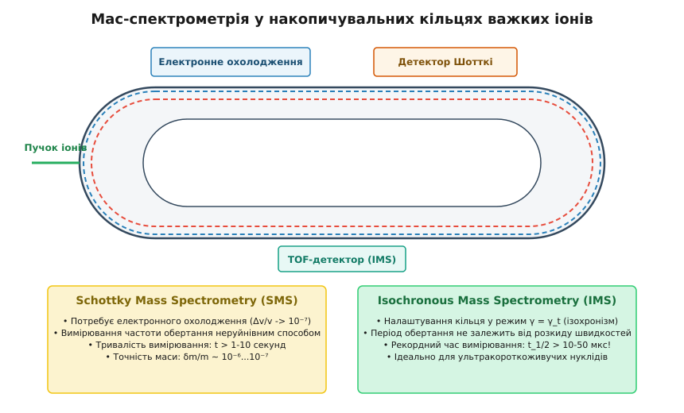

# Мас-спектрометрія у ядерній фізиці

<preknowlist>
- [Енергія зв'язку ядра та краплинна модель Вейцзеккера](topic:ph-quantum/binding-energy-liquid-drop) — дефект маси, енергія зв'язку та зв'язок маси ядра з його стабільністю.
- [Закон радіоактивного розпаду та період напіврозпаду](topic:ph-quantum/radioactive-decay-law) — кінетика розпаду нестабільних нуклідів та часові межі вимірювань.
- [Спеціальна теорія відносності](topic:ph-quantum/special-relativity) — еквівалентність маси й енергії E = m·c², релятивістський рух частинок у полях.
- [Закон Кулона](topic:ph-electromagnetism/gauss-law) — електростатична взаємодія, рух заряду в електричному та магнітному полях.
</preknowlist>

Для визначення межі існування ядерної матерії чи перевірки унітарності матриці Кабіббо — Кобаяші — Маскави вимірювання маси атомного ядра вимагає відносної точності на рівні `10⁻⁸...10⁻¹¹`. Оскільки дефект маси `Δm = Z·m_p + N·m_n - M` становить лише частки відсотка від сумарної маси спокою нуклонів, будь-яка похибка у масі макроскопічного зразка призводить до спотворення розрахованих енергій зв'язку, Q-значень радіоактивних розпадів та швидкостей астрофізичного r-процесу нуклеосинтезу. Мас-спектрометрія — це сукупність фізичних методів та експериментальних приладів, призначених для розділення іонізованих атомів та ядер за їхнім відношенням маси до заряду `m/q` і вимірювання їхніх абсолютних мас у вільному стані.

---

### 1. Фундаментальна роль вимірювання мас у ядерній фізиці та астрофізиці

Маса атомного ядра у його основному стані є безпосереднім вираженням повного квантового взаємозв'язку між усіма нуклонами, які утворюють дану зв'язану систему. Оскільки ядро складається з `Z` протонів та `N` нейтронів, загальна маса спокою ядра `M(Z, A)` завжди виявляється меншою за суму мас вільних нуклонів на величину дефекту маси:

```
Δm = [ Z · m_p + N · m_n ] - M(Z, A)
```

Згідно із виведеним Ейнштейном співвідношенням `E = m · c²`, дефект маси пропорційний повній енергії зв'язку ядра `E_b = Δm · c²`. Отже, вимірювання маси ядра з високою точністю є найпрямішим способом визначення його фундаментальної енергетичної стабільності.

Прецизійні вимірювання мас ядер необхідні для розв'язання п'яти фундаментальних задач сучасної фізики:

1. **Перевірка CVC-гіпотези та унітарності CKM-матриці:**
   У фізиці слабких взаємодій вимірювання мас ядер беруть участь у визначенні енергії розпаду `Q_β = [ M(Z, A) - M(Z+1, A) ] · c²` для супердозволених `0⁺ → 0⁺` ферміївських бета-розпадів (наприклад, ядер `¹⁰C`, `¹⁴O`, `²⁶ᵐAl`, `³⁴Cl`, `³⁸ᵐK`, `⁴²Sc`, `⁴⁶V`, `⁵⁰Mn`, `⁵⁴Co`). Оскільки для супердозволених переходів коефіцієнт `Ft` має бути суворо постійним для всіх ядер за гіпотезою збереження векторного струму (CVC — *Conserved Vector Current*), точні значення `Q_β` дозволяють вирахувати матричний елемент `V_ud` матриці Кабіббо — Кобаяші — Маскави. Унітарність першого рядка CKM-матриці `|V_ud|² + |V_us|² + |V_ub|² = 1` перевіряється за допомогою вимірювання мас ядер із похибкою менше `100 еВ` (`δm / m ≈ 10⁻⁸`). Якщо ця сума відхиляється від одиниці, це вказує на існування нової фізики за межами Стандартної моделі (наприклад, стерильних нейтрино чи нових Калібрувальних бозонів).

2. **Прямі обмеження маси нейтрино:**
   Прямі кінематичні обмеження на масу електронного антинейтрино отримують із вимірювання граничної енергії бета-спектра тритію `³H → ³He + e⁻ + ν̄_e` (експеримент KATRIN) та електронного захоплення у холмії-163 `¹⁶³Ho → ¹⁶³Dy + ν_e` (експерименти ECHo, HOLMES, NuMACS). Різниця мас нейтральних атомів `M(³H) - M(³He)` та `M(¹⁶³Ho) - M(¹⁶³Dy)` (Q-значення) має бути визначена мас-спектрометрично з субелектроновольтною точністю (`δm / m ≤ 10⁻¹¹`). Будь-яке розходження між мас-спектрометричним значенням `Q` та спектроскопічною межею бета-спектра безпосередньо фіксує масу спокою нейтрино `m(ν_e)`.

3. **Дослідження межі нуклонної стабільності, гало-ядер та двопротонного розпаду:**
   На межі існування ядерної матерії (на нейтронній та протонній drip-lines) енергія відокремлення одного або двох нуклонів `S_n = [ M(Z, A-1) + m_n - M(Z, A) ] · c²` чи `S_2n` зменшується до десятків кілоелектронвольт. Вимірювання мас таких екзотичних нуклідів, як `¹¹Li`, `¹¹Be`, `¹⁴Be`, `¹⁹C` чи `²²C`, дає змогу виявити ефекти утворення "нейтронного гало" — просторово роздутої квантової хмари з двох нейтронів, що рухаються на гігантській відстані від компактного остова `⁹Li`. Невизначеність маси у `10 кеВ` на межі дрип-лінії змінює розрахований радіус гало-нуклона у кілька разів. Оскільки зв'язаний стан трьох тіл у `¹¹Li` (остов `⁹Li` плюс два валентні нейтрони) є бороміївською системою — де жодна з двочастинкових підсистем (`⁹Li+n` чи `n+n`) не утворює зв'язаного стану окремо — прецизійна маса `¹¹Li` слугує єдиним експериментальним критерієм квантовомеханічного потенціалу взаємодії. На протонній межі стабільності прецизійні маси необхідні для опису випускання двох протонів з основних станів ультрадефіцитних за нейтронами ядер (`⁴⁵Fe`, `⁴⁸Ni`, `⁵⁴Zn`). Енергія випускання `Q_2p = [ M(Z, A) - M(Z-2, A-2) - 2·m_p ] · c²` задає тунельну проникність бар'єру та період напіврозпаду ядра відносного двопротонного квантового тунелювання.

4. **Астрофізичний нуклеосинтез (r-процес та rp-процес):**
   У вибухах наднових та злиттях нейтронних зір синтез важких елементів відбувається шляхом швидкого захоплення нейтронів (r-процес) або швидкого захоплення протонів (rp-процес на поверхні акреціюючих нейтронних зір). Швидкості реакцій у точках затримки (*waiting points*, наприклад ядра `⁶⁴Ge`, `⁶⁸Se`, `⁷²Kr`, `⁸⁰Zr`, `¹³⁰Cd`, `¹⁹⁵Tm`) визначаються фотодисінтеграційним балансом, який експоненціально залежить від енергій відокремлення нуклонів `S_n` та `S_p`. Похибка у масі ядра всього у `100 кеВ` змінює розраховану поширеність важких елементів (золота, платини, урану) у Всесвіті на кілька порядків.

5. **Тестування ядерних моделей та перебудови оболонкової структури:**
   Виміряні маси дозволяють відстежувати скачкоподібні зміни питомої енергії зв'язку при заповненні магічних чисел нуклонів (`2, 8, 20, 28, 50, 82, 126`), виявляти зникнення класичних магічних барьєрів та появу нових магічних чисел у багатих на нейтрони ядрах (`N = 16, 32, 34`), а також досліджувати так званий "острів інверсії" (*island of inversion* поблизу `²¹O`, `³¹Mg`).

Детальний перебіг історії розвитку експериментальних приладів від перших парабол Томсона до сучасних ядерних установок висвітлено у вставці [Історія розвитку мас-спектрометрії](topic:ph-quantum/mass-spectrometry/hist-mass-spectrometry.md).

---

### 2. Фізичні принципи іонізації, розділення та роздільної здатності

Будь-який мас-спектрометричний вимірювальний комплекс складається з трьох послідовних функціональних вузлів: **джерела іонізації**, **мас-аналізатора** (де здійснюється розділення за відношенням `m/q`) та **системи детектування**.

```
Зразок / Реакційна мішень
       │
       ▼
┌──────────────────────────────┐
│    Джерело іонізації        │  (RILIS, Surface, ECR, IGISOL)
│  Зразок -> Іони [q = Z_i · e]│
└──────────────┬───────────────┘
               │  Прискорення U₀ (E_k = q·U₀)
               ▼
┌──────────────────────────────┐
│      Мас-аналізатор          │  (Магнітний сектор, TOF, Пастка Пеннінга)
│  Розділення за m/q у полях   │
└──────────────┬───────────────┘
               │  Просторове чи часове розділення
               ▼
┌──────────────────────────────┐
│     Система детектування     │  (МКП, ВЕУ, Детектор Шотткі, Фрагментація)
│  Реєстрація іонів N(t, x)    │
└──────────────┘
```

#### Технології іонізації екзотичних нуклідів
Для проведения мас-спектрометричних вимірювань нейтральні атоми речовини мають бути переведені у заряджений стан із мінімальними втратами часу й кількості частинок:

1. **Селективна лазерна іонізація RILIS (Resonance Ionization Laser Ion Source):**
   Використовує каскад із 2–3 лазерних променів із довжинами хвиль, точно налаштованими на квантові атомні переходи конкретного хімічного елемента. Останній ступінь перевозить електрон у автоіонізаційний стан понад межу іонізації. Це забезпечує унікальну селективність за хімічним номером `Z` (коефіцієнт очищення від ізобарних забруднень перевищує `10⁵`).

2. **Метод газового затримання IGISOL (Ion Guide ISOL):**
   Продукти ядерних реакцій фрагментації чи поділу зупиняються у мікрокамері з високовакуумним гелієм при тиску `100...500 мбар`. Більшість іонів зберігають зарядність `+1` завдяки високому потенціалу іонізації гелію і виносяться газовою дюзою у систему прискорювальних фокусувальних радіочастотних квадруполів (RFQ). Метод IGISOL є ультрашвидким (`t < 1 мс`) і працездатним для всіх елементів таблиці Менделєєва, включаючи тугоплавкі метали (`Zr, Nb, Mo, Ru, Rh`).

3. **Розділення у польоті (In-Flight Fragmentation):**
   Пучок важких іонів високої енергії (`100...1000 МеВ/нуклон`) розбивається при проходженні крізь тонку мішень (Берилій). Фрагменти вилітають у повністю обдертому стані (`q = Z·e`) зі збереженням високої релятивістської швидкості. Вони сепаруються у польоті магнітними фрагмент-сепараторами (FRS у GSI, BigRIPS у RIKEN, A1900 у FRIB) за допомогою комбінації відхилення у магнітному полі `Bρ` та втрат енергії у профільованому деповіторі `ΔE`.

#### Фізика прискорення та відхилення
Після утворення іон із зарядом `q = Z_i · e` прискорюється статичною різницею потенціалів `U₀`. Кінетична енергія, набута іоном, становить:

```
E_k = q · U₀ = (1 / 2) · m · v²
```

Звідси початкова швидкість іона перед входом у мас-аналізатор залежить від його маси:

```
v = √( 2 · q · U₀ / m )
```

У однорідному магнітному полі з індукцією `B`, спрямованому перпендикулярно до вектора швидкості `v`, на іон діє сила Лоренца `F = q · v · B`, яка грає роль доцентрової сили:

```
q · v · B = m · v² / r
```

Радіус кривини траєкторії іона `r` (циклотронний радіус) дорівнює:

```
r = m · v / (q · B) = (1 / B) · √( 2 · m · U₀ / q )
```

Звівши вираз до квадрата, отримуємо фундаментальне співвідношення для магнітного мас-спектрометра:

```
m / q = B² · r² / (2 · U₀)
```

Отже, при фіксованому прискорювальному потенціалі `U₀` та магнітному полі `B` іони з різними відношеннями `m/q` рухаються по колових дугах різного радіуса `r`, що дає змогу розділити їх у просторі.

Для відбору частинок із фіксованою швидкістю використовують **селектор швидкостей Віна** (*Wien filter*), у якому перехресні статичні електричне `E` та магнітне `B` поля створюють взаємно компенсовані сили `q·E = q·v·B`. Крізь селектор без відхилення проходять лише іони із точковою швидкістю `v₀ = E / B`.

#### Метрика якісних характеристик приладів
Головними характеристиками будь-якого мас-спектрометра є:

1. **Масова роздільна здатність (*Mass Resolving Power*) `R`:**
   ```
   R = m / Δm
   ```
   де `Δm` — ширина масового піку на половині його висоти (FWHM). У частотних та часопролітних приладах роздільна здатність виражається через частоту `R = f / (2 · Δf)` або час прольоту `R = t / (2 · Δt)`.

2. **Відносна точність вимірювання маси `δm / m`:**
   Вона визначає мінімальну відносну невизначеність положення центра масового піку. Завдяки статистичному накопиченню `N` відліків іонів точність вимірювання центра піку є значно вищою за роздільну здатність і підпорядковується співвідношенню:
   ```
   δm / m ∝ 1 / ( R · √N )
   ```

---

### 3. Магнітні секторні та подвійно-фокусуючі спектрометри

Перші класичні мас-спектрометри (односекторні прилади Демпстера та Ніра) використовували однорідне магнітне поле із кутом відхилення 180°, 90° або 60°.

#### Проблема енергетичного розкиду та іонно-оптичні аберації
У реальному джерелі іонів частинки вилітають не з строго однаковою швидкістю: наявний початковий тепловий та потенціальний розкид кінетичної енергії `ΔE`. Оскільки радіус відхилення у магнітному полі залежить від швидкості `r ∝ v`, іони з однаковою масою `m`, але різними кінетичними енергіями `E_k ± ΔE`, відхиляються на різні радіуси і розмазують масовий пік на детекторі, обмежуючи роздільну здатність величиною `R < 500`. Крім того, пучок іонів володіє кутовим розбігом `Δα`, що вимагає застосування спеціальних заходів іонної оптики для збирання розбіжного пучка у точкову фокальну лінію.

#### Принцип подвійного фокусування
Для подолання енергетичного розмиття у 1930-х роках було створено **подвійно-фокусуючі мас-спектрометри**, які забезпечують одночасне **кутове фокусування** (збирання пучка з кутовим розбігом `Δα`) та **енергетичне фокусування** (збирання іонів з енергетичним розкидом `ΔE`).

Для цього у конструкцію приладу послідовно вводять два аналізатори:
1. **Циліндричний електростатичний сектор (`E`):** Складається з двох вигнутих металевих пластин із напругою `±U_e`. Електричне поле відхиляє іони за енергією, створюючи дисперсію за швидкістю `Δv`.
2. **Магнітний сектор (`B`):** Відхиляє іони у протилежний бік, причому магнітна дисперсія підбирається так, щоб повністю компенсувати швидкісну дисперсію електростатичного сектора.


*Схема подвійно-фокусуючого мас-спектрометра: комбінація електростатичного сектора E та магнітного сектора B забезпечує одночасне фокусування за кутом вильоту та за кінетичною енергією іонів.*

Найпоширенішими геометріями подвійно-фокусуючих спектрометрів є:
- **Геометрія Маттауха — Герцоґа (*Mattauch-Herzog*):** Поєднує 31.8-градусний електростатичний сектор та 90-градусний магнітний сектор. Головна перевага — плоска фокальна поверхня, що дозволяє реєструвати масовий спектр широкого діапазону `m/q` одночасно на пластинчастий детектор.
- **Геометрія Ніра — Джонсона (*Nier-Johnson*):** Використовує 90-градусний електростатичний сектор та 60-градусний магнітний сектор із точковим фокусуванням на єдину вихідну щілину, що забезпечує роздільну здатність `R ≈ 50 000`.

Для виправлення аберацій вищих порядків у сучасних секторних мас-спектрометрах застосовують додаткові гексапольні та октупольні магнітні лінзи, що вирівнюють кривину фокальної площини. Прилади такого типу застосовуються у прискорювальній мас-спектрометрії (AMS — *Accelerator Mass Spectrometry*) для підрахунку попоштучних атомів радиовуглецю `¹⁴C` або берилію `¹⁰Be` у геології.

---

### 4. Часопролітна мас-спектрометрія (Time-of-Flight, TOF) та MR-TOF-MS

Часопролітна мас-спектрометрія ґрунтується на вимірюванні часу `t`, необхідного іону для подолання безпольового прольотного проміжку довжиною `L`.

#### Фундаментальні співвідношення TOF та фокусування Вайлі — Макларена
Іони прискорюються коротким високовольтним імпульсом напруги `U₀`. Враховуючи зв'язок швидкості з масою `v = √(2·q·U₀ / m)`, час прольоту траси довжиною `L` становить:

```
t = L / v = L · √( m / (2 · q · U₀) )
```

Таким чином, час прольоту строго пропорційний квадратному кореню з маси іона `t ∝ √m`. Вимірявши часовий інтервал між прискорювальним імпульсом та сигналом детектора `t`, обчислюють масу нукліду:

```
m / q = 2 · U₀ · (t / L)²
```

Для виправлення початкового просторового розкиду іонів у джерелі Вайлі та Макларен у 1955 році запропонували двокаскадну прискорювальну систему (*Wiley-McLaren spatial focusing*). Напруги на сітках підбираються так, щоб іони, розташовані на початку прискорення глибше у джерелі, набували більшої кінетичної енергії і наздоганяли іони, що стартували ближче до виходу, точно у площині первинного фокуса.

#### Енергокомпенсація та Рефлектрон
Початковий просторовий та часовий розкид пучка у джерелі обмежує роздільну здатність звичайного прямопролітного TOF значенням `R ≈ 1000`. Для компенсації цього розкиду Борис Мамирін у 1973 році винайшов **рефлектрон** — іонне дзеркало з гальмівним електростатичним полем. 

Іони з вищою кінетичною енергією проникають глибше в рефлектрон і долають довший шлях, ніж повільніші іони тієї ж маси. Параметри дзеркала підбираються так, щоб швидкі іони наздоганяли повільні точно у площині детектора, підвищуючи роздільну здатність до `R ≈ 10 000 ... 20 000`.

#### Багатопрохідні часопролітні спектрометри (MR-TOF-MS)
У сучасній фізиці рідкісних ізотопів революцію здійснили **багатопрохідні часопролітні спектрометри** (Multi-Reflection Time-of-Flight Mass Spectrometers).

У MR-TOF-MS іони замикаються між двома коаксіальними електростатичними дзеркалами і здійснюють від `100` до `1000` зворотних відбитків. Ефективна довжина прольоту `L_eff` зростає від `1 метра` до `2...5 кілометрів`, а роздільна здатність сягає `R > 100 000 ... 500 000` при часі вимірювання всього `10...30 мілісекунд`.

Перед інжекцією у MR-TOF-MS пучок іонів накопичується та охолоджується у радіочастотному квадрупольному накопичувачі (RFQ buncher). Випорскування пучка проводиться з наносекундною точністю. Для селекції конкретного нукліду з ізобарної суміші в середині MR-TOF-MS встановлюють ультрашвидкий електростатичний затвор Бредбері — Нільсена (*Bradbury-Nielsen Gate*, BNG). Затвор відкривається на короткий часовий інтервал у кілька наносекунд лише у той момент, коли повз нього пролітає заданий ізотоп, а всі ізобарні забруднення відхиляються на стінки вакуумної камери. Це робить MR-TOF-MS ідеальним інструментом для швидкого вимірювання мас надважких та короткоживучих ядер біля меж нуклонної стабільності.

---

### 5. Пастки Пеннінга: прецизійне вимірювання частот у статичних полях

Пастка Пеннінга є найточнішим інструментом сучасної мас-спектрометрії. У ній вимірювання маси зводиться до вимірювання вільної циклотронної частоти обертання іона у стаціонарних полях з точністю до часток герца.

#### Конструкція та власні моди руху
Пастка утворюється поєднанням сильного однорідного надпровідного магнітного поля `B₀` (вздовж осі `z`) та кулонівського квадрупольного потенціалу `V(x,y,z) = U₀/(2d²) · (2z² - x² - y²)`.

У такому поєднанні рух іона розкладається на три незалежні квантові моди:
1. **Аксіальні коливання (`ω_z`):** Гармонічні осциляції вздовж магнітного поля з частотою `ω_z = √(2·q·U₀ / (m·d²))`.
2. **Модифікований циклотронний рух (`ω_+`):** Швидкі колові обертання у радіальній площині з частотою `ω_+ ≈ q·B / m - ω_-`.
3. **Магнетронний дрейф (`ω_-`):** Повільний прецесійний дрейф центру циклотронної орбіти під дією схрещених полів `E × B` з частотою `ω_- ≈ U₀ / (2·d²·B)`.


*Конструкція електродів пастки Пеннінга та розкладання руху іона на три моди: аксіальні коливання ω_z, швидке модифіковане циклотронне обертання ω_+ та повільний магнетронний дрейф ω_-.*

Фундаментальний зв'язок між власне вимірюваними частотами задається **теоремою інваріантності Брауна — Ґабріельсе**:

```
ω_c² = ω_+² + ω_-² + ω_z²
```

Детальний аналітичний вивід рівнянь руху частинки у пастці Пеннінга та доведення теореми інваріантності наведено у вставці [Математичний аналіз динаміки іона у пастці Пеннінга](topic:ph-quantum/mass-spectrometry/math-penning-trap-dynamics.md).

#### Техніка радіочастотного збудження та підготовка стану
Управління рухом іона у пастці реалізується за допомогою радіочастотних електричних полів:
- **Дипольне ВЧ-збудження:** Подається на протилежні сегменти кільцевого електрода на частотах `ω_+` або `ω_-`. Збільшує відповідний радіус обертання частинки без зміни її частоти. Застосовується для селективного видалення ізобарних домішок з пастки.
- **Квадрупольне ВЧ-збудження:** Подається на чотири сегменти кільцевого електрода зі зсувом фази 180° на сумарній частоті `ω_rf = ω_+ + ω_- = ω_c`. Воно спричиняє періодичну зв'язану конверсію між магнетронною та циклотронною модами.

#### Методи реєстрації частоти у пастках
Для витягнення циклотронної частоти `ν_c` застосовують три основні технології:

1. **Метод часу прольоту TOF-ICR:**
   Іон піддається дії квадрупольного ВЧ-поля. На точній частоті `ν_rf = ν_c` магнетронна мода конвертується у циклотронну, збільшуючи радіальну кінетичну енергію іона у 1000 разів. При виштовхуванні з пастки ця енергія конвертується у поздовжнє прискорення. На графіку залежності часу прольоту від частоти збудження спостерігається чіткий мінімум у точці `ν_rf = ν_c`.


*Резонансна крива TOF-ICR: мінімум часу прольоту іона від пастки до детектора відповідає точній циклотронній частоті ν_c = q·B / (2·π·m).*

2. **Метод проектування фази PI-ICR (Phase-Imaging ICR):**
   Фаза циклотронного обертання накопичується під час вільного дрейфу і проектується безпосередньо на позиційно-чутливий координатно-часовий детектор (Delay-Line Detector). Замість вимірювання часу прольоту реєструються координати `(x, y)` влучання іона. Це збільшує роздільну здатність у 40 разів порівняно з TOF-ICR за той самий час вимірювання, дозволяючи розділяти ядерні ізомери з енергією збудження `E_ex < 20 кеВ`.

3. **Кріогенний метод FT-ICR (PENTATRAP):**
   Для високозарядних іонів вимірювання струму наведеного заряду на електродах пастки при температурах `4.2 К` дозволяє отримувати маси з відносною похибкою `δm / m ≈ 10⁻¹¹ ... 10⁻¹²`. Установка PENTATRAP використовує каскад із 5 послідовних пасток Пеннінга, що дає змогу вимірювати частоти двох різних іонів одночасно у тотожних умовах.

---

### 6. Мас-спектрометрія у накопичувальних кільцях важких іонів (Storage Rings)

Для нуклідів із високою релятивістською енергією (`100...400 МеВ/нуклон`), отриманих у реакціях фрагментації важких іонів, найефективнішим методом вимірювання мас є використання **накопичувальних кілець** (ESR у GSI/FAIR, Дармштадт та CSRe у IMP, Ланьчжоу).


*Порівняння методів Шотткі (SMS) з електронним охолодженням та ізохронного вимірювання (IMS) у накопичувальних кільцях важких іонів.*

#### Частотна дисперсія у кільці
Період обертання іона `T` (або частота `f = 1/T`) у накопичувальному кільці залежить як від його масово-зарядового відношення `m/q`, так і від розкиду швидкостей `Δv/v`:

```
Δf / f = - (1 / γ_t²) · [ Δ(m/q) / (m/q) ] + ( 1 - γ² / γ_t² ) · ( Δv / v )
```

де `γ` — релятивістський фактор Лоренца, а `γ_t` — критична енергія зсуву хроматичної гратки накопичувального кільця.

Мас-спектрометрія у кільцях реалізується у двох основних режимах:

#### 1. Мас-спектрометрія Шотткі (Schottky Mass Spectrometry — SMS)
Пучок важких іонів піддається **електронному охолодженню** (*electron cooling*): релятивістський пучок електронів рухається паралельно з іонами з однаковою середньою швидкістю у прямій секції кільця. За рахунок кулонівських зіткнень іони передають теплову енергію електронному пучку (`k_B · T_e ≈ 1 мМеВ`), що зменшує розкид швидкостей іона до рівнів `Δv / v → 10⁻⁷`.

При такому малому розкиді другий доданок у формулі стає мізерним, і частота обертання `f` визначається виключно масою `m/q`. Неруйнівні індукційні пікап-електроди реєструють спектр шуму Шотткі від циркулюючих іонів. Спектральний Fourier-аналіз дозволяє ідентифікувати навіть ізомерні стани важких ядер із часом життя понад `1 секунду`.

- **Переваги:** Можливість одночасного вимірювання мас сотень різних нуклідів у широкому спектрі; висока роздільна здатність `R ≈ 10⁶`.
- **Обмеження:** Потребує часу на електронне охолодження (`t_cool ≈ 1...10 секунд`), тому застосовується лише для нуклідів з `t₁/₂ > 1 с`.

#### 2. Ізохронна мас-спектрометрія (Isochronous Mass Spectrometry — IMS)
Для короткоживучих ядер (`t₁/₂ < 1 мс`) часу на охолодження немає. Для проведення вимірювання накопичувальне кільце переводять у **ізохронний режим**, налаштовуючи магнітну гратку так, щоб енергія пучку точно відповідала критичній енергії `γ = γ_t`.

У цьому випадку коефіцієнт `(1 - γ² / γ_t²) = 0`, і другий доданок повністю зникає: період обертання іона взагалі не залежить від розкиду його швидкості! Швидші іони рухаються по довших зовнішніх орбітах, потрапляючи на детектор за точно такий самий час, що й повільні іони на внутрішніх орбітах.

- **Переваги:** Рекордно малий час вимірювання (`t₁/₂ > 10...20 мілісекунд`), що дає змогу вимірювати маси найменш стабільних ядер.
- **Детектування:** Використовуються надтонкі вуглецеві фольги (товщиною кілька нанометрів), при проходженні крізь які іони вибивають вторинні електрони, що реєструються мікроканальними пластинами (TOF-IMS).

---

### 7. Систематичні похибки, ефекти просторового заряду та чисельні методи обробки

Для перетворення первинних спектрометричних даних у надійні значення ядерних мас необхідний урахування систематичних похибок та чисельна обробка експериментальних резонансів.

> 🔧 **Навіщо це.**
> Систематичний зсув циклотронної частоти всього на `0.1 Гц` у пастці Пеннінга (при `ν_c ≈ 1 МГц`) призводить до похибки у масі ядра порядка `10 кеВ`. У дослідженнях CVC-гіпотези чи нейтральних мас нейтрино така похибка є критичною і робить експериментальний результат повністю непридатним для фізичного аналізу.

#### Систематичні джерела похибок та їх компенсація
1. **Часовий дрейф магнітного поля `B₀`:** Магнітне поле надпровідних соленоїдів повільно зменшується через флуктуації температури кріостату та розпад надпровідних струмів (`ΔB / B₀ ≈ 10⁻⁹ / годину`). Для компенсації дрейфу вимірювальні цикли досліджуваного нукліду `ν_x` чергують із вимірюваннями еталонного іона `ν_ref` за схемою `Ref1 → Target → Ref2`.
2. **Ефекти просторового заряду:** Кулонівське відштовхування між іонами у пастці зміщує власні частоти. Зсув циклотронної частоти прямо пропорційний кількості захоплених іонів `N_ions`:
   ```
   Δν_c / ν_c = k_coulomb · N_ions
   ```
   Обробка даних вимагає екстраполяції частоти до нульової кількості іонів `N_ions → 0` або відбору лише тих циклів, де у пастці перебував строго **один іон** (*single-ion detection*).
3. **Електронна енергія зв'язку:** Для високозарядних іонів маса атома `M_atom` отримується додаванням маси відсутніх електронів `q·m_e` з обов'язковим відніманням сумарної енергії зв'язку електронних оболонок `E_bind(el) / c²`, обчисленої за допомогою методів квантової електродинаміки (QED).

#### Процедура об'єднання даних у базі AME (Atomic Mass Evaluation)
Усі нові мас-спектрометричні вимірювання потрапляють до глобального глобального аналітичного центру AME у NNDC (National Nuclear Data Center) та IMP. Дані вимірювань утворюють надлишкову глобальну систему лінійних та нелінійних рівнянь зв'язку між масами нуклідів. За допомогою методу найменших квадратів із ваговими коефіцієнтами розраховується єдина узгоджена таблиця атомних мас, де кожен нуклід отримує оптимальне оціночне значення маси та фундаментальну похибку.

Опис практичних алгоритмів оптимізації та робочі коди мовами C і C++ наведено у вставці [Програмний аналіз спектрів та розрахунок ядерних мас](topic:ph-quantum/mass-spectrometry/proj-mass-spectrum-analyzer.md).

Зведемо фундаментальні технічні специфікації, похибки та параметри всіх розглянутих мас-спектрометричних установок у підсумковій довідковій вставці [Порівняльна довідка характеристик мас-спектрометричних методів](topic:ph-quantum/mass-spectrometry/api-mass-spectrometer-specs.md).

Завдяки неперервному розвитку мас-спектрометрії фізика ядра отримала можливість досліджувати енергетичну структуру речовини з колосальною точністю, просуваючись до найвіддаленіших меж нуклонної стабільності та збагачуючи наші знання про еволюцію Всесвіту.
