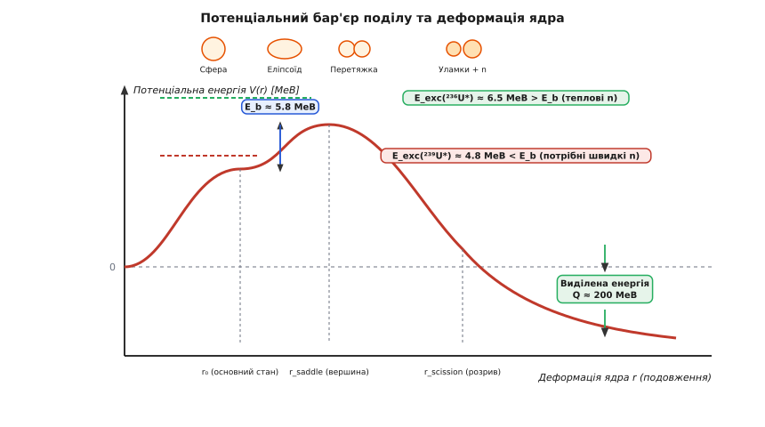
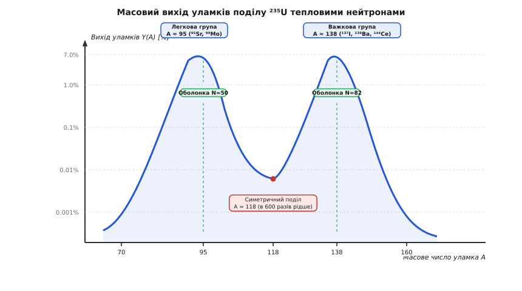
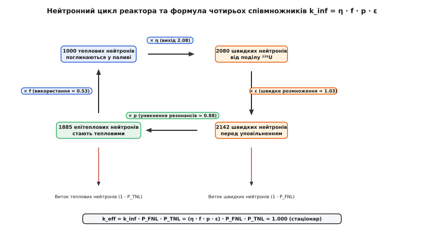

# Поділ ядер та ланцюгова ядерна реакція

<preknowlist>
- [Дефект маси та енергія зв'язку ядра](topic:physics/nuclear-binding-energy) — питома енергія зв'язку нуклонів у важких ядрах та залежність енергії від масового числа.
- [Ядерні реакції та перерізи взаємодії](topic:physics/nuclear-reactions-cross-sections) — концепція перерізу взаємодії, залежність імовірності захоплення від енергії нейтрона.
- [Радіоактивний розпад та закони збереження](topic:physics/radioactive-decay) — правила зсуву, закони збереження баріонного числа та електричного заряду в ядерних перетвореннях.
</preknowlist>

Якщо стиснути два позитивно заряджених протони на відстань порядку одного фемтометра (`10⁻¹⁵ м`), електростатичне кулонівське відштовхування прагне розірвати їх із величезною силою. На таких відстанях у гру вступає сильна ядерна взаємодія — короткосяжне притягання, яке діє між усіма нуклонами (протонами та нейтронами) і на коротких відстанях виявляється у сотні разів сильнішим за кулонівське відштовхування. Однак сильна взаємодія має радіус дії всього близько `1.5` фемтометра, тоді як кулонівські сили відштовхування спадають повільно за законом обернених квадратів і діють між усіма протонами ядра без винятку.

У легких та середніх ядрах кожен нуклон межує з більшістю інших нуклонів, тому ядерне притягання беззастережно переважає. Але коли масове число ядра `A` перевищує 200, а число протонів `Z` наближається до 90 (як у ядрах урану чи плутонію), розмір ядра досягає `10–12` фемтометрів. Протон на одному краї такого ядра вже не відчуває притягання від нуклонів на протилежному краї, проте продовжує відчувати кулонівське відштовхування від усіх `Z - 1` протонів. Важке ядро опиняється у стані крихкої напруженої рівноваги, де довгосяжні кулонівські сили прагнуть розірвати його навпіл, а поверхневий натяг ядерної матерії намагається втримати його у сферичній формі.

---

### Бар'єр деформації та краплинна модель Бора–Вілера

Щоб зрозуміти, чому важке ядро не розпадається самочинно щомиті, а вимагає зовнішнього поштовху або квантовомеханічного тунелювання, слід розглянути ядро як краплю зарядженої ядерної рідини (краплинна модель ядра). У цій моделі ст стійкість сферичної форми визначається змаганням двох протилежних енергетичних факторів: поверхневої енергії `E_S` та кулонівської енергії `E_C`.

Поверхнева енергія `E_S` виникає через те, що нуклони на поверхні ядра мають менше сусідів, ніж нуклони в об'ємі, й утворюють аналог поверхневого натягу. Ця енергія пропорційна площі поверхні ядра (`E_S ~ A^(2/3)`) і прагне надати ядру строго сферичної форми з мінімальною площею. Кулонівська енергія `E_C` описує взаємне відштовхування протонів і пропорційна квадрату заряду, діленому на радіус ядра (`E_C ~ Z² / A^(1/3)`). Вона, навпаки, прагне сплющити або витягнути ядро, аби збільшити середню відстань між протонами.

Якщо ядро під дією зовнішнього удару (наприклад, при захопленні нейтрона) починає коливатися й витягується з утворенням еліпсоїда з малим параметром деформації `ε`, його площа поверхні зростає, а кулонівська енергія зменшується. Зміна повної потенціальної енергії ядра `ΔE` описується виразом:

```
ΔE(ε) = (1/5) · ε² · (2 · E_S0 - E_C0)
```

де `E_S0` та `E_C0` — поверхнева та кулонівська енергії сферичного ядра.

Поки поверхнева енергія переважає (`2 · E_S0 > E_C0`), деформація призводить до зростання потенціальної енергії: ядро поводиться як пружна гумова кулька, яка після припинення коливань повертається до сферичної форми, скидаючи лишню енергію у вигляді гамма-кванта. Співвідношення між цими енергіями визначається **параметром дільності** `x`:

```
x = E_C0 / (2 · E_S0) = (Z² / A) / 50.13
```

Якщо `x ≥ 1` (що відповідає `Z² / A ≥ 50.13`), кулонівське відштовхування повністю переважає поверхневий натяг. Таке ядро не здатне існувати у сферичній формі й миттєво розривається за час порядку `10⁻²²` секунди. Для реальних важких ядер, таких як `²³⁵U` (`Z² / A = 35.98`, `x ≈ 0.72`), параметр дільності є меншим за одиницю. Це означає, що на шляху від сферичного стану до розриву ядро мусить подолати **потенціальний бар'єр поділу** `E_b`.


*Потенціальна енергія ядра V(r) як функція параметра деформації r. Виділена вершина деформаційного бар'єра E_b та вивільнення екзотермічної енергії Q при розриві перетяжки.*

Процес поділу при розвитку деформації проходить кілька послідовних стадій:
1. **Сферичний основний стан (`r₀`):** ядро перебуває в локальному потенціальному мінімумі.
2. **Збудження та зсув до сідлової точки (`r_saddle`):** після захоплення нейтрона ядро набуває енергії збудження `E_exc`. Якщо `E_exc > E_b`, ядро перевалюється через вершину бар'єра.
3. **Утворення перетяжки (scission point):** ядро набуває форми гантелі з тонким шийковим перетягом між двома майбутніми уламками.
4. **Розрив перетяжки та кулонівський розгін:** перетяжка розривається, і два негативно заряджених (відносно один одного) уламки з високою швидкістю розлітаються у протилежні боки під дією кулонівського відштовхування.

Більш точні розрахунки із залученням методу оболонкових поправок Струтинського показують, що реальний бар'єр поділу актиноїдів виявляється **двохгорбим** (*double-humped fission barrier*). Квантові оболонкові ефекти утворюють другий потенціальний мінімум при більших деформаціях, що дає початок існуванню так званих **дільних ізомерів** (*fission isomers*) — метастабільних ядерних станів, які зазнають спонтанного поділу з підвищеною ймовірністю.

Принциповою є різниця між ізотопами урану `²³⁵U` та `²³⁸U` при взаємодії з повільними (тепловими) нейтронами. Коли ядро `²³⁵U` (непарне за числом нейтронів, `Z = 92, N = 143`) захоплює повільний нейтрон, утворюється складене ядро `²³⁶U*` (парно-парне). Внаслідок квантовомеханічного ефекту спарування нуклонів з протилежними спінами енергія зв'язку приєднаного нейтрона виділяється з надлишком: енергія збудження складає `E_exc ≈ 6.5 МеВ`, що перевищує бар'єр поділу `E_b ≈ 5.8 МеВ`. Тому `²³⁵U` ділиться тепловими нейтронами будь-якої, навіть як завгодно малої кінетичної енергії.

Натомість ядро `²³⁸U` (парно-парне, `Z = 92, N = 146`) при захопленні нейтрона перетворюється на непарне ядро `²³⁹U*`. Енергія спарування тут не виділяється, і енергія збудження становить лише `E_exc ≈ 4.8 МеВ`, що є меншим за бар'єр поділу `E_b ≈ 6.5 МеВ`. Щоб викликати поділ `²³⁸U`, налітаючий нейтрон мусить мати власну кінетичну енергію, не меншу за порогове значення `E_n > 1.1 МеВ`.

Детальніше про те, як експерименти Гана, Штрассмана, Майтнер і Фріша 1938–1939 років відкрили явище розколу ядра та як Енріко Фермі збудував перший у світі реактор CP-1, описано в вставці [Історія відкриття поділу ядра та створення першого реактора CP-1](topic:ph-quantum/nuclear-fission-chain-reaction/hist-discovery-fission.md).

---

### Енергетика поділу та масова асиметрія уламків

Вивільнення енергії при поділі важкого ядра пояснюється ходом кривої питомої енергії зв'язку ядра `E_bind / A`. Для важких ядер урану питома енергія зв'язку становить близько `7.6 МеВ` на нуклон, тоді як для ядер середньої маси з масовими числами `A = 90 ... 140` вона досягає максимуму біля `8.5 МеВ` на нуклон.

Коли ядро `²³⁵U` розпадається на два уламки середньої маси, нуклони в уламках виявляються зв'язаними міцніше. Різниця в енергії зв'язку на один нуклон складає `ΔE = 8.5 - 7.6 = 0.9 МеВ`. Помноживши цю величину на загальне число нуклонів `A = 235`, отримуємо повну енергію поділу:

```
Q ≈ 235 · 0.9 МеВ ≈ 200 МеВ (3.2 · 10⁻¹¹ Дж)
```

Один грам `²³⁵U` при повному поділі всіх ядер вивільняє близько `8.2 · 10¹⁰ Дж` енергії, що еквівалентно спалюванню `3 тонн` кам'яного вугілля або `2 тонн` нафти.

Вивільнена енергія `Q ≈ 200 МеВ` розподіляється між різними продуктами реакції у строго визначеній пропорції:

```
 Кінетична енергія первинних уламків поділу:    ~168 МеВ  (84%)
 Кінетична енергія миттєвих нейтронів:           ~5 МеВ   (2.5%)
 Енергія миттєвих гамма-квантів:                 ~7 МеВ   (3.5%)
 Енергія бета-розпаду уламків:                  ~7 МеВ   (3.5%)
 Енергія антинейтрино (неповоротні втрати):     ~11 МеВ  (5.5%)
 Енергія запізнілого гамма-випромінювання:       ~6 МеВ   (3.0%)
```

Майже 85% усієї енергії виділяється у вигляді кінетичної енергії двох важких уламків поділу, які розлітаються у протилежні боки. Завдяки великому заряду уламки гальмуються в речовині палива на дистанції всього у кілька мікрометрів, перетворюючи свою кінетичну енергію на тепловий рух атомів кристалічної ґратки.

Енергія бета-розпаду та запізнілого гамма-випромінювання утворюють так зване **залишкове тепловиділення** (*decay heat*). Навіть після повної зупинки ланцюгової реакції та занурення всіх поглинаючих стержнів активна зона реактора продовжує виділяти близько 6-7% початкової теплової потужності за рахунок радіоактивного розпаду накопичених уламків поділу. Це вимагає тривалого безперервного охолодження зупиненого реактора для запобігання розплавленню паливних елементів.

Несподіваним результатом дослідження поділу тепловими нейтронами виявився масовий розподіл уламків. З погляду чисто класичної краплинної моделі ядро мало б розриватися строго навпіл на два однакові уламки з масами `A₁ = A₂ ≈ 118`. Однак експериментальні вимірювання показують, що симетричний поділ відбувається у 600 разів рідше, ніж асиметричний.


*Двохгорбий розподіл масового виходу уламків Y(A) при поділі 235U тепловими нейтронами. Два виражених піки відповідають легкій (A ≈ 95) та важкій (A ≈ 138) групам уламків.*

Розподіл мас уламків має характерну двохгорбу форму з двома чіткими максимумами:
- **Легкова група уламків:** максимум при масовому числі `A₁ ≈ 95` (ізотопи строніцію `⁹⁵Sr`, молібдену `⁹⁹Mo`, рутенію);
- **Важкова група уламків:** максимум при масовому числі `A₂ ≈ 138` (ізотопи йоду `¹³⁷I`, барію `¹³⁹Ba`, цезію `¹⁴⁴Ce`).

Фізична причина цієї асиметрії полягає в квантово-оболонкових ефектах (оболонкова модель ядра). Ядро прагне сформувати уламки, у яких числа протонів або нейтронів є близькими до так званих **магічних чисел** (`Z, N = 50, 82, 126`), які відповідають повністю заповненим ядерним оболонкам із підвищеною енергією зв'язку. Важкий уламок формується навколо подвійно-магічного ядра олова `¹³²Sn` (`Z = 50, N = 82`), що й робить асиметричну конфігурацію енергетично найвигіднішою.

Математичний опис деформаційного бар'єра Вайцзеккера та диференціальних рівнянь точкової кінетики наведено у вставці [Математична модель деформаційного бар'єра та кінетики нейтронів](topic:ph-quantum/nuclear-fission-chain-reaction/math-fission-energetics-kinetics.md).

---

### Нейтронний баланс та формула чотирьох співмножників

Фундаментальною властивістю поділу є випромінювання вторинних нейтронів. Оскільки важке ядро урану має відношення нейтронів до протонів `N/Z ≈ 1.55`, а легші уламки середньої маси для стійкості вимагають меншого відношення `N/Z ≈ 1.2 ... 1.4`, утворені уламки виявляються сильно перевантаженими нейтронами. У момент розриву перетяжки з ядра виприскується в середньому `ν` **миттєвих нейтронів** (*prompt neutrons*) із середньою кінетичною енергією близько `2 МеВ`.

Для `²³⁵U` середнє число народжених нейтронів на один акт поділу тепловим нейтроном становить `ν ≈ 2.43`, для `²³⁹Pu` — `ν ≈ 2.88`.

Наявність більше ніж одного вторинного нейтрона відкриває можливість створення **ланцюгової ядерної реакції**: нейтрони першого покоління викликають поділ сусідніх ядер, народжуючи нейтрони другого покоління, і так далі. Розвиток цього процесу характеризується **ефективним коефіцієнтом розмноження нейтронів** `k_eff`:

```
k_eff = N_i / N_(i-1)
```

де `N_i` — число нейтронів даного покоління, `N_(i-1)` — число нейтронів попереднього покоління.

Залежно від значення `k_eff` можливі три фізичні стани ядерної системи:
1. **Підкритичний стан (`k_eff < 1`):** число нейтронів у кожному наступному поколінні зменшується. Ланцюгова реакція неминуче згасає.
2. **Критичний стан (`k_eff = 1`):** число нейтронів у системі залишається строго постійним у часі. У реакторі підтримується стаціонарна керована ланцюгова реакція з незмінною потужністю.
3. **Надкритичний стан (`k_eff > 1`):** кількість нейтронів і потужність зростають за експоненційним законом `N(t) = N₀ · exp((k_eff - 1) · t / l*)`.


*Цикл народження, уповільнення, захоплення та витоку нейтронів у середовищі, що описується формулою чотирьох співмножників k_inf = η · f · p · ε.*

Для нескінченного середовища (без витоку нейтронів назовні) коефіцієнт розмноження `k_inf` описується класичною **формулою чотирьох співмножників Фермі**:

```
k_inf = η · f · p · ε
```

Кожен із чотирьох множників відображає окремий фізичний етап у житті нейтронного покоління:
- **`η` (вихід нейтронів на одне поглинання в паливі):** число швидких нейтронів поділу, народжених на один тепловий нейтрон, поглинутий у ядерному паливі. Якщо паливо містить як суміш `²³⁵U` та `²³⁸U`, то `η = ν · σ_f / (σ_f + σ_γ)`. Для чистого `²³⁵U` значення `η ≈ 2.08`.
- **`ε` (коефіцієнт розмноження на швидких нейтронах):** враховує додаткові нейтрони, породжені поділом ядер `²³⁸U` високоенергетичними швидкими нейтронами (`E_n > 1.1 МеВ`) до того, як вони встигнуть уповільнитися. Зазвичай `ε ≈ 1.02 ... 1.05`.
- **`p` (ймовірність уникнення резонансного захоплення):** ймовірність того, що швидкий нейтрон у процесі сповільнення проскочить вузькі енергетичні резонанси радіаційного захоплення ядрами `²³⁸U` (у діапазоні енергій від `6 еВ` до `200 еВ`) і дістанеться теплової області. У гетерогенних реакторах `p ≈ 0.85 ... 0.90`.
- **`f` (коефіцієнт використання теплових нейтронів):** частка теплових нейтронів, яка поглинається безпосередньо в паливі, а не в конструкційних матеріалах, уповільнювачі чи теплоносії. Зазвичай `f ≈ 0.70 ... 0.90`.

Для реального реактора скінченних розмірів слід враховувати виток швидких `P_FNL` та теплових `P_TNL` нейтронів через зовнішню поверхню активної зони. Необхідний розмір та геометрія активної зони визначаються рівнянням критичності через геодезичний та матеріальний лапласіани (*buckling*):

```
k_eff = k_inf · P_FNL · P_TNL = (η · f · p · ε) · (1 / (1 + M² · B²))
```

де `M² = L_s² + L_d²` — площа міграції нейтронів, а `B²` — геометричний лапласіан активної зони.

---

### Запізнілі нейтрони та фізика керованості ланцюгової реакції

Якби всі нейтрони при поділі випромінювалися миттєво (`t < 10⁻¹⁴ c`), керована атомна енергетика була б фізично неможливою. Середній час життя одного покоління нейтронів у тепловому реакторі складає `l* ≈ 10⁻⁴` секунди (час, необхідний нейтрону для сповільнення та дифузії до поглинання).

Припустимо, що коефіцієнт розмноження зростав би всього на `0.1%` понад критичність (`k_eff = 1.001`). За відсутності запізнілих нейтронів період розгону реактора `τ` становив би:

```
τ = l* / (k_eff - 1) = 10⁻⁴ / 0.001 = 0.1 секунди
```

Це означало б, що за одну секунду потужність реактора зросла б у `exp(10) ≈ 22 000` разів. Жоден механічний сервопривід регулюючих стержнів не здатний спрацювати за частки мілісекунди, щоб зупинити такий розгін.

Спасінням для керованості реакторів є **запізнілі нейтрони** (*delayed neutrons*). Приблизно `0.65%` (`β = 0.0065`) усіх нейтронів при поділі `²³⁵U` випромінюються не в момент розриву ядра, а згодом — у результаті радіоактивного бета-розпаду утворених уламків поділу (так званих ядер-попередників, наприклад `⁸⁷Br` або `¹³⁷I`). Період піврозпаду цих продуктів коливається від `0.2` секунди до `55` секунд.

Середній час життя покоління нейтронів з урахуванням запізнілих нейтронів зростає від `10⁻⁴` секунди до `⟨l⟩ ≈ 0.1` секунди:

```
⟨l⟩ = (1 - β) · l* + ∑ [ β_i · (l* + 1/λ_i) ] ≈ l* + ∑ (β_i / λ_i) ≈ 0.1 с
```

Наявність запізнілих нейтронів розділяє надкритичний стан на два фундаментально різних режими:

1. **Запізніла критичність (`1 ≤ k_eff < 1 + β`):**
   Реактивність середовища `ρ = (k_eff - 1) / k_eff` є меншою за частку запізнілих нейтронів `β` (`0 < ρ < β`). У цьому режимі реактор не може підтримувати ланцюгову реакцію лише на миттєвих нейтронах — йому обов'язково потрібні запізнілі нейтрони. Швидкість зростання потужності визначається часом розпаду ядер-попередників (`τ ≈ ⟨l⟩ / ρ ≈ 10 ... 100 с`). Реактор розганяється повільно й повністю піддається безпечному автоматичному керуванню за допомогою поглинаючих стержнів.

2. **Миттєва надкритичність (`k_eff ≥ 1 + β`):**
   Реактивність перевищує частку запізнілих нейтронів (`ρ ≥ β`). Реактор стає критичним на самих лише миттєвих нейтронах. Запізнілі нейтрони більше не відіграють регулюючої ролі. Період розгону падає до `τ = l* / (ρ - β) ≈ 10⁻³ ... 10⁻⁵ c`, що призводить до некерованого вибухового розгону (як під час аварії на Чорнобильській АЕС або при підриві атомної бомби).

Практичне моделювання точкової кінетики реактора на C та C++ з розв'язанням системи диференціальних рівнянь методом Рунге-Кутти подано в вставці [Чисельне моделювання кінетики реактора та дифузії нейтронів](topic:ph-quantum/nuclear-fission-chain-reaction/proj-chain-reaction-sim.md).

Систематизований довідник параметрів ядер, що діляться, констант 6 груп запізнілих нейтронів та властивостей уповільнювачів міститься у вставці [Довідник ядерно-фізичних констант та параметрів критичності](topic:ph-quantum/nuclear-fission-chain-reaction/api-reactor-kinetics-ref.md).

---

### Уповільнення нейтронів та структура активної зони

Миттєві нейтрони народжуються з високою енергією `E_n ≈ 2 МеВ`. Проте переріз поділу ядра `²³⁵U` для швидких нейтронів становить всього `σ_f ≈ 1.3 барна`, тоді як для теплових нейтронів (`E_n = 0.025 еВ`) він зростає до `σ_f ≈ 585 барн` (майже у 450 разів вище!). Тому для побудови реактора на природному або слабозбагаченому урані швидкі нейтрони необхідно уповільнити до теплових енергій.

Уповільнення відбувається за рахунок послідовних пружних зіткнень нейтронів із ядрами уповільнювача. За законами класичної механіки (передача імпульсу при пружному зіткненні) частка переданої кінетичної енергії від нейтрона до ядра є максимальною тоді, коли маса ядра близька до маси нейтрона (`m_n ≈ m_nucleus`).

```
E_after / E_before = ( (A - 1) / (A + 1) )²
```

Найкращим уповільнювачем є легкий водень `¹H` (`A = 1`), у зіткненні з яким нейтрон може втратити до 100% своєї енергії за один удар (у середньому потрібно всього 18 зіткнень, щоб скинути енергію від `2 МеВ` до `0.025 еВ`). Проте звичайний водень має помітний переріз захоплення нейтронів (`σ_a = 0.332 барн`), що утворює дейтерій `²H`.

Дейтерій (у складі важкої води `D₂O`) та вуглець (у вигляді високочистого графіту) мають значно нижчий переріз захоплення, що дозволяє будувати реактори на неекономічному природному урані (`0.7% ²³⁵U`).

Крім того, виявилося, що гомогенна (однорідна) суміш палива та уповільнювача не може досягти критичності на природному урані. При сповільненні нейтрон мусить пройти крізь резонансну область енергій (`6 ... 200 еВ`), де ядра `²³⁸U` мають гігантські вузькі піки радіаційного захоплення (що описуються формулою Брейта–Вігнера). При нагріванні палива тепловий рух ядер `²³⁸U` розширює ці резонанси за рахунок ефекту Доплера (**доплерівське розширення резонансів**), що збільшує захоплення нейтронів і створює потужний негативний зворотний зв'язок по температурі.

В однорідній суміші майже всі нейтрони захоплюються `²³⁸U`, не встигаючи стати тепловими (`p → 0`). Рішенням стало створення **гетерогенної активної зони**: паливо концентрується у вигляді окремих блоків або тепловиділяючих елементів (ТВЕЛів), занурених у об'єм уповільнювача. Швидкі нейтрони народжуються всередині тонкого паливного стержня, вилітають з нього в уповільнювач, де безпечно уповільнюються до теплових енергій без контакту з `²³⁸U`. Потім вже теплові нейтрони дифундують назад у паливний стержень і викликають поділ `²³⁵U`.

---

> 🔧 **Навіщо це.**
>
> Розуміння фізики поділу ядер та кінетики ланцюгової реакції є основою проєктування та безпечної експлуатації ядерних енергетичних установках:
> 
> 1. **Конструювання АЕС та пасивна безпека:** Розрахунок коефіцієнта розмноження `k_eff` та формули чотирьох співмножників визначає необхідне збагачення уранових ТВС (3–5% `²³⁵U` для ВВЕР/PWR) та геометричний крок розміщення ТВЕЛів. Реактор конструюють так, щоб він мав **негативний температурний коефіцієнт реактивності** (`dk/dT < 0`): при розігріві палива доплерівське розширення резонансів `²³⁸U` підсилює захоплення нейтронів, а розширення води зменшує її щільність і сповільнювальну здатність, пасивно гасячи ланцюгову реакцію без участі автоматики.
> 2. **Управління реактивністю та запас безпеки:** Використання запізнілих нейтронів визначає робочий діапазон сервоприводів СУЗ (систем управління та захисту). Реактивність оперативно обмежують значенням `ρ < 0.5 $`, щоб гарантувати перебування систем у режимі запізнілої критичності.
> 3. **Реактори-примножувачі (breeders):** Швидкі реактори (наприклад, на натрієвому теплоносії) використовують швидкі нейтрони для перетворення недільного `²³⁸U` на дільний плутоній `²³⁹Pu` за реакцією `²³⁸U + n → ²³⁹U → ²³⁹Np → ²³⁹Pu`. Це дозволяє збільшити паливну базу атомної енергетики у десятки разів, залучаючи у паливний цикл увесь видобутий уран.
