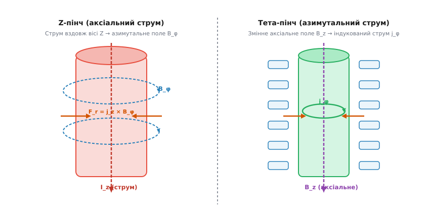
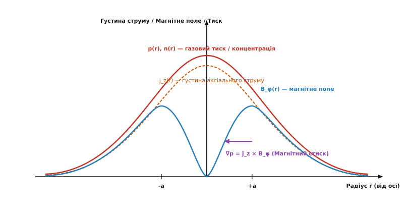
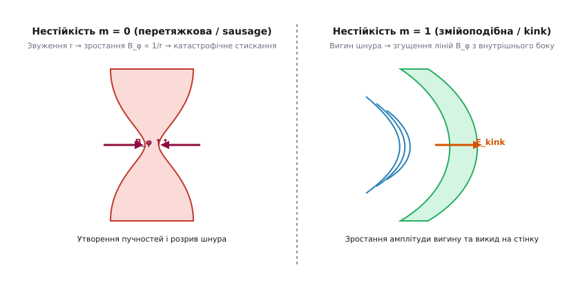

# Пінч-ефект

<preknowlist>
- [Закон Ампера про циркуляцію](root:ph-electromagnetism/ampere-circuital-law) — виникнення азимутального магнітного поля довкола аксіального струму.
- [Сила Ампера та сила Лоренца](root:ph-electromagnetism/lorentz-force) — радіальна поперечна сила, яка діє на рухливі носії заряду у власному магнітному полі.
- [Електронний дрейф і рухливість носіїв](root:ph-condensed/electron-drift) — кінетика носіїв заряду та кінетичний тиск плазми.
</preknowlist>

Утримання високотемпературної плазми у термоядерному синтезі та потужних газових розрядах постає перед фундаментальною інженерною перешкодою: при нагріванні газокінетичний тиск іонізованого газу прагне миттєво розширити плазмовий канал і розсіяти частинки на стінки реактора. Тверді матеріальні стінки нездатні витримати безпосередній контакт із речовиною, розігрітою до мільйонів градусів, що робить утримання плазми матеріальними бар'єрами принципово неможливим.

Розв'язання цієї задачі полягає у використанні самого електричного струму, що протікає крізь плазмовий канал. Струм великої сили створює навколо розряду інтенсивне азимутальне магнітне поле, яке за законом Лоренца генерує радіальну стискальну силу, спрямовану до осі провідника. Зовнішній магнітний тиск діє як безконтактний поршень, що стискає плазму в тонкий гарячий шнур і відриває її від стінок камери. Без цього механізму магнітного самостискання високострумовий розряд втрачає термоізоляцію і розлітається ще до досягнення критеріїв запалювання термоядерної реакції.

Це явище самостискання провідного середовища під дією власного магнітного поля отримало назву **пінч-ефект** (від англійського *pinch* — стискати, ущипнути).

Пінч-ефект — це не просто екзотичний фокус фізики високих енергій. Це фундаментальний механізм взаємодії струму з власним магнітним полем, який визначає межі утримання плазми у термоядерних реакторах, формує велетенські плазмові струмені поблизу чорних дір, створює джерела випромінювання для сучасного виробництва мікропроцесорів та проявляється всередині кристалічних ґраток напівпровідників.

---

### Суть фізичного явища: струм, який стискає сам себе

Щоб зрозуміти внутрішню механіку пінч-ефекту, розглянемо провідний циліндр (плазмовий шнур або напівпровідниковий кристалоїд) радіуса `R`, крізь який уздовж поздовжньої осі `Z` тече електричний струм із густиною `j_z`.

Згідно з фундаментальним законом циркуляції Ампера, напрямлений рух заряджених частинок (електронів та іонів) неминуче створює навколо осі струму **азимутальне магнітне поле** `B_φ`. Силові лінії цього поля утворюють замкнені концентричні кола, що охоплюють розрядний канал. Напруженість магнітного поля на радіусі `r` від осі циліндра дорівнює:

```
B_φ(r) = ( μ₀ · I(r) ) / ( 2 · π · r )
```

де `I(r)` — повний струм, що тече всередині циліндра радіуса `r`, `μ₀` — магнітна стала.

Тепер згадаємо, що ті самі носії заряду, які створюють це магнітне поле, самі рухаються всередині нього з аксіальною дрейфовою швидкістю `v_z`. Згідно з електродинамікою Лоренца, на кожен заряд `q`, що рухається зі швидкістю `v` у магнітному полі `B`, діє поперечна сила Лоренца `F = q · (v × B)`.

Враховуючи геометрію системи, де струм спрямований вздовж осі `Z` (`j_z`), а магнітне поле — по азимуту `φ` (`B_φ`), векторний добуток `j × B` дає об'ємну силу `f_r`, спрямовану **суворо радіально всередину**, до осі циліндра `r = 0`:

```
f_r = ( j × B )_r = - j_z · B_φ
```

Незалежно від знака носіїв заряду — чи це негативні електрони, які рухаються проти поля, чи позитивні іони або дірки, що рухаються за полем — сила Лоренца для обох типів частинок завжди спрямована до центральної осі!


*Принцип магнітного самостискання плазми. Ліворуч: Z-пінч — аксіальний струм I_z породжує азимутальне магнітне поле B_φ, що стискає шнур силами Лоренца F_r. Праворуч: Тета-пінч (Θ-пінч) — зміна аксіального поля B_z індукує азимутальний струм j_φ, який стискає плазму до осі.*

Магнітне поле створює від'ємний радіальний градієнт магнітного тиску `P_mag = B_φ² / (2 μ₀)`. Фізично це означає, що поверхневі шари магнітного поля діють подібно до натягнутої гумової оболонки або магнітного поршня, який безперервно тисне на внутрішнє провідне середовище.

У результаті виникає фундаментальне протистояння двох протилежних сил:
1. **Зовнішній магнітний тиск** `P_mag` прагне стиснути провідний циліндр у нескінченно тонку нитку.
2. **Внутрішній газокінетичний тиск** `p = n · k_B · T` розігрітих частинок прагне розширити циліндр назовні.

---

### Магнітогідродинамічна рівновага та співвідношення Беннетта

Якщо струм крізь середовище змінюється досить повільно або досягає стаціонарного значення, у системі може встановитися стан **магнітогідродинамічної (МГД) рівноваги**. У цьому стані внутрішній градієнт газового тиску у кожній точці замальовується об'ємною магнітною силою Лоренца:

```
∇p = j × B
```

Для циліндричного шнура це рівняння зводиться до диференціального співвідношення між радіальним розподілом тиску `p(r)`, густини струму `j_z(r)` та азимутального поля `B_φ(r)`:

```
dp / dr = - j_z(r) · B_φ(r)
```

Підставляючи сюди закон Ампера `j_z = (1 / (μ₀ · r)) · d(r · B_φ) / dr` та інтегруючи отримане рівняння по всьому перерізу циліндра від осі `r = 0` до зовнішності `r = ∞`, ми прийдемо до видатного математичного результату, отриманого у 1934 році американським фізиком Віллардом Беннеттом.

Цей результат носить назву **співвідношення Беннетта**:

```
μ₀ · I² = 8 · π · N · k_B · (T_e + T_i)
```

де:
- `I` — повний електричний струм, що тече крізь переріз пінчу (в Амперах);
- `N` — погонна концентрація частинок, тобто середня кількість електронів та іонів на один метр довжини шнура (`N = ∫ 2πr n(r) dr`);
- `T_e` та `T_i` — абсолютні температури електронного та іонного газу (у Кельвінах);
- `k_B` — стала Больцмана, `μ₀` — магнітна стала.

Строгий крок-за-кроком математичний вивід цього співвідношення, а також самоузгоджених профілів Беннетта наведено у вставці [Математична модель рівноваги Беннетта та МГД-нестійкостей](root:ph-quantum/pinch-effect/math-bennett.md).


*Радіальні профілі фізичних величин у стаціонарній рівновазі Беннетта. Концентрація частинок n(r) та газовий тиск p(r) сягають максимуму на осі r=0. Магнітне поле B_φ(r) дорівнює нулю на осі, зростає до максимуму на радіусі Беннетта a і спадає на периферії за законом 1/r.*

З фізичного аналізу співвідношення Беннетта випливають три фундаментальних режими поведінки провідного середовища залежно від сили струму `I`:

1. **Режим підкритичного струму (`I < I_B`):** Магнітного тиску власного струму недостатньо для подолання теплового розпиру. Плазмовий стовп розширюється і заповнює увесь об'єм розрядної камери.
2. **Стаціонарна рівновага Беннетта (`I = I_B`):** Сила магнітного стискання точно дорівнює силі газового тиску. Плазма утримується у вигляді стійкого циліндричного шнура радіуса `a` без контакту зі стінками.
3. **Режим надкритичного струму та динамічного стискання (`I > I_B`):** Магнітний тиск переважає газокінетичний. Відбувається швидка радіальна кумуляція (колапс) плазми до осі, що супроводжується ударним нагріванням та катастрофічним зростанням густини й температури.

---

### Геометрія пінчевих конфігурацій: Z-пінч, Тета-пінч та гвинтовий пінч

Залежно від напрямку протікання струму та просторової орієнтації магнітних ліній, у фізиці плазми розрізняють кілька базових геометрій пінч-ефекту.

#### 1. Z-пінч (Аксіальний пінч)
У геометрії Z-пінчу електричний струм тече вздовж поздовжньої осі циліндра `Z` між двома торцевими електродами (анодом і катодом). Власне магнітне поле є чисто азимутальним `B_φ`.

- **Переваги:** Простота конструкції, максимальна ефективність омічного (джоульова) нагріву `P = I² · R` та можливість досягнення велетенських магнітних тисків при відносно помірних напругах.
- **Недоліки:** Наявність прямих електродів призводить до охолодження плазми на торцях та інжекції забруднюючих металевих домішок. Головна проблема — екстремальна МГД-нестійкість.

#### 2. Тета-пінч (Θ-пінч / Азимутальний пінч)
У Тета-пінчі розрядна камера розміщується всередині зовнішнього соленоїда (одноготивного витка), крізь який пропускають швидкозмінний струм `I_coil(t)`. Зміна струму створює потужне аксіальне магнітне поле `B_z(t)` всередині камери.

За законом електромагнітної індукції Фарадея, вихрове електричне поле індукує у плазмі замкнений азимутальний струм `j_φ`. Взаємодія цього індукованого струму з аксіальним полем `B_z` породжує радіальну силу Лоренца:

```
f_r = ( j × B )_r = - j_φ · B_z
```

Ця сила відриває плазму від зовнішніх диелектричних стінок і стискає її до осі трубки у вигляді чистого плазмового циліндра.

- **Переваги:** Відсутність електродів всередині камери забезпечує високу чистоту плазми. Формування потужної радіальної ударної хвилі дозволяє миттєво розігрівати іони до кілоелектронвольтних температур.
- **Недоліки:** Швидкий витік плазми вздовж відкритих торців циліндра (кінцеві втрати / *end losses*).

#### 3. Гвинтовий пінч (Screw pinch) та тороїдальні конфігурації
Щоб усунути торцеві втрати та підвищити стійкість, лінійний пінч згортають у тор (кільце). Поєднання аксіального струму `j_z` та азимутального струму `j_φ` створює гвинтову (спіральну) структуру магнітних ліній.

Саме ця ідея лягла в основу створення **Токамаків** та **Ріверсивних пінчів** (Reversed Field Pinch, RFP), де струм пінчу створює азимутальне поле утримання, а зовнішні котушки додають потужне тороїдальне поле для придушення гідродинамічних нестійкостей.

📜 Докладно історію наукових суперечок, створення перших термоядерних установок 1950-х років та відшукання нетермоядерних «хибних» нейтронів описано у вставці [Історія відкриття пінч-ефекту та дослідження Беннетта](root:ph-quantum/pinch-effect/hist-bennett.md).

---

### Анатомія руйнування: МГД-нестійкості та їх придушення

Найбільшою перешкодою на шляху використання простого Z-пінчу для тривалого утримання плазми виявилася його **природна гідромагнітна нестійкість**. Стан рівноваги Беннетта схожий на спробу утримати олівець, поставлений вертикально на гострий кінчик: найменше відхилення від ідеальної симетрії створює сили, які стрімко руйнують рівновагу.

Аналіз малих збурень показує існування двох класичних руйнівних мод нестійкості, що розвиваються за частки мікросекунди.


*Класичні МГД-нестійкості Z-пінчу. Ліворуч: перетяжкова нестійкість (m = 0) — магнітне поле посилюється у звуженні, призводячи до локального перетискання шнура. Праворуч: змійоподібна нестійкість (m = 1) — згущення магнітних ліній з внутрішнього боку дуги виштовхує вигин назовні.*

#### 1. Перетяжкова нестійкість (Мода m = 0 / Sausage instability)
Уявімо, що на поверхні плазмового циліндра радіуса `a` через флуктуацію виникло локальне звуження (шийка) радіуса `r = a - δr`.

Оскільки повний струм `I` змушений протікати крізь вужчий переріз, густина струму в шийці зростає. Магнітне поле на поверхні циліндра обернено пропорційне його радіусу (`B_φ ∝ 1/r`), тому магнітний тиск `P_mag = B_φ² / (2 μ₀)` у місці звуження **різко збільшується**:

```
δP_mag ≈ - ( B_φ² / μ₀ ) · ( δr / a )
```

Виникає позитивний зворотний зв'язок: збільшений магнітний тиск стискає шийку ще сильніше, що викликає ще більше зростання поля `B_φ`. За кілька наносекунд плазмовий шнур катастрофічно перетискається у кількох точках і розривається на окремі згустки («сосискова» структура).

У момент розриву індуктивність плазмового шнура стрімко змінюється (`dL/dt ≫ 0`), що викликає вибухоподібний сплеск індукційної напруги `V = - L · (dI/dt) - I · (dL/dt)`. Виникають велетенські поздовжні електричні поля, які прискорюють іони дейтерію до високих енергій, породжуючи імпульси жорсткого рентгенівського та нейтронного випромінювання.

#### 2. Змійоподібна нестійкість (Мода m = 1 / Kink instability)
Якщо плазмовий шнур випадково трохи зігнеться убік, викривляючи свою поздовжню вісь, силові лінії азимутального магнітного поля `B_φ` згущуються з внутрішнього боку дуги вигину і розріджуються з зовнішнього.

У результаті з внутрішнього боку виникає надлишковий магнітний тиск, який виштовхує дугу вигину ще далі назовні. Амплітуда згину зростає експоненційно, шнур згортається у спіраль або змійку і за частки мікросекунди викидається на стінку розрядної камери, охолоджуючись та руйнуючи її поверхню.

#### Методи стабілізації пінчу
Для придушення нестійкостей у сучасній фізиці плазми застосовують три основні фізичні прийоми:

1. **Вморожене аксіальне поле (`B_z`):** Всередину плазмового циліндра перед стисканням вводять поздовжнє магнітне поле `B_z`. Оскільки високопровідна плазма володіє властивістю «вморожування» магнітних ліній, при стисканні поле `B_z` підсилюється і діє як пружний металевий сердечник (скелет), що опірається стисканню та вигину.
2. **Провідний кожух (Стінкова стабілізація):** Розрядну трубку поміщають у товстостінний мідний або алюмінієвий кожух. При зміщенні плазмового шнура до стінки у провідному кожусі індукуються вихрові струми Фуко, магнітне поле яких за законом Ленца відштовхує плазмовий шнур назад до центральної осі.
3. **Магнітний шир (Магнітний зсув):** Створення конфігурацій, у яких кут нахилу магнітних ліній змінюється з радіусом (`d/dr (B_φ / B_z) ≠ 0`). Це перешкоджає резонансному розгойдуванню збурень.

---

### Радіаційний колапс та границя Піса-Брагінського

При досягненні велетенських струмів у плазмовому Z-пінчі починає проявлятися глибокий зв'язок між термодинамікою, електродинамікою та випромінюванням.

У 1957 році англійський теоретик Р. Піс та радянський фізик С. Брагінський незалежно сформулювали концепцію граничного струму для випромінюючого пінчу. У стаціонарній рівновазі Беннетта виділення джоульова тепла `P_ohm = j_z² / σ` компенсується об'ємним випромінюванням плазми.

Якщо плазма складається з повністю іонізованоговодню або дейтерію, головним механізмом випромінювання є **електронне гальмівне випромінювання** (*Bremsstrahlung*) при зіткненнях електронів з іонами. Потужність гальмівного випромінювання зростає як `P_rad ∝ n² · √T`.

При порівнянні джоульова нагріву (де провідність Спітцера зростає як `σ ∝ T^(3/2)`) з випромінювальною здатністю виявляється, що існує критична сила струму, при якій виділення тепла і випромінювання точно збалансовані. Вона називається **струмом Піса-Брагінського**:

```
I_PB ≈ 1.4 · 10⁶ А = 1.4 МA                    [струм Піса-Брагінського]
```

Якщо струм у пінчі перевищує межу `I_PB` (`I > 1.4 MA`), випромінювальні втрати плазми починають перевищувати джоулів нагрів! Плазма починає стрімко втрачати теплову енергію на випромінювання, її температура й газовий тиск падають, що позбавляє плазму можливості протистояти магнітному тиску.

В результаті виникає **радіаційний колапс**: магнітне поле стискає плазмовий шнур до небувало малих радіусів (до часток мікрона), а густина плазми на осі зростає до твердотільних значень (`n > 10²⁵ см⁻³`). Саме за рахунок радіаційного колапсу в пристроях типу «плазмовий фокус» утворюються локальні надгусті плазмові точки (мікропінчі), які є найпотужнішими лабораторними джерелами жорсткого рентгенівського випромінювання.

---

### Критерій Лоусона та термоядерна перспектива Z-пінчу

Головною історичною метою дослідження пінч-ефекту було й залишається досягнення умов для самопідтримуваної термоядерної реакції синтезу іонів дейтерію та тритію:

```
D + T → ⁴He (3.5 MeV) + n (14.1 MeV)
```

Щоб термоядерна реакція виділяла більше енергії ніж витрачено на розігрів плазми, плазма повинна задовольняти **критерію Лоусона**: добуток концентрації іонів `n` на час енергетичного утримання `τ_E` при температурі `T ≈ 10–20 keV` має перевищувати порогове значення:

```
n · τ_E ≥ 10²⁰ м⁻³ · с                          [критерій Лоусона для D-T]
```

У стаціонарних токамаках цей критерій досягається за рахунок тривалого утримання (`τ_E ≈ 1–5 секунд`) при відносно помірній густині плазми (`n ≈ 10²⁰ м⁻³`).

Z-пінч пропонує альтернативний, імпульсний шлях: **надамплітудна густина при надкоротких часах**. У швидких Z-пінчах концентрація іонів сягає `n ≈ 10²5 ... 10²7 м⁻³`, тому критерій Лоусона досягається за наносекундні проміжки часу (`τ_E ≈ 1–10 наносекунд`).

Сучасним напрямком термоядерного синтезу на основі пінчу є концепція **MagLIF** (Magnetized Liner Inertial Fusion), що реалізується на Z-Машині в США. У цьому підході металевий циліндричний лайнер зі сплаву берилію, заповнений дейтерій-тритієвим газом з попередньо підігрітим лазером і вмороженим поздовжнім полем `B_z = 10–20 Тл`, стискається надпотужним імпульсом струму `I ≈ 20–30 MA`. Магнітна кумуляція стискає газ у 1000 разів по об'єму, досягаючи термоядерної спалаху з виходом понад `10¹⁶` нейтронів за імпульс.

---

### Експериментальна діагностика плазми у пінчах

Вимірювання параметрів плазмового шнура, що існує всього кілька наносекунд і володіє густиною струму у мегаампери, вимагає застосування найсучасніших безконтактних діагностичних методів:

1. **Томсонівське розсіювання лазерного випромінювання:** Вимірювання спектрального розширення лазерного променя, розсіяного на вільних електронах плазми, дозволяє з абсолютною точністю та високим просторовим розділенням визначити локальну температуру електронів `T_e(r)` та їх концентрацію `n_e(r)`.
2. **Лазерна інтерферометрія та ефект Фарадея:** Пропускання поляризованого лазерного променя крізь плазмовий шнур викликає зсув фази (пропорційний інтегралу `∫ n_e dl`) та повертання площини поляризації (ефект Фарадея, пропорційний `∫ n_e B_∥ dl`). Це дозволяє будувати повні двовимірні карти розподілу магнітного поля `B_φ(r)` та густини плазми.
3. **Рентгенівська спектроскопія та камери швидкісної зйомки (Pinhole & Streak cameras):** Використання оптико-електронних перетворювачів із часовим розділенням у пікосекунди дозволяє знімати прямі динамічні відеофільми стискання шнура та відстежувати розвиток перетяжкових і змійоподібних нестійкостей у реальному часі.
4. **Магнітні зонди та пояси Роговського:** Для вимірювання швидкості зміни струму `dI/dt` та магнітного поля використовуються мініатюрні індуктивні петлі (B-dot зонди) та замкнені вимірювальні пояси Роговського, виходи яких інтегруються цифровими осцилографами.

---

### Пінч-ефект у твердих тілах: електронно-діркова плазма напівпровідників

Пінч-ефект не є ексклюзивом газорозрядної плазми. У 1958 році Мартін Стіл та Морис Гліксман експериментально довели, що пінч-ефект спостерігається у **твердому тілі** — у вузькозонних напівпровідниках (таких як антимонід індію `InSb`, арсенід індію `InAs`) та вузьких напівметалах (вісмут `Bi`).

Як це працює у кристалічній ґратці?

При прикладанні сильного електричного поля `E_z` крізь кристал InSb починає текти високий струм. Внаслідок процесу **ударної іонізації** електрони провідності набувають високої кінетичної енергії й вибивають валентні електрони в зону провідності. У кристалі виникає висока концентрація рухливих носіїв обох знаків — **двокомпонентна електронно-діркова плазма** з концентрацією `n ≈ p ≈ 10¹⁵ ... 10¹⁷ см⁻³`.

Коли струм крізь напівпровідниковий зразок досягає критичного порогу (зазвичай від кількох ампер до десятків ампер), його власне азимутальне магнітне поле `B_φ` починає стискати потік носіїв заряду до поздовжньої осі кристала.

```
v_r = - μ_amb · E_z · B_φ
```

де `v_r` — радіальна швидкість амбіполярного дрейфу електронно-діркових пар до осі, `μ_amb` — амбіполярна рухливість.

#### Специфіка та наслідки твердотільного пінчу

На відміну від газової плазми, де частинки рухаються у вакуумі, у напівпровіднику носії заряду рухаються крізь нерухому кристалічну ґратку та безперервно розсіюються на фононах. Це призводить до кількох важливих фізичних ефектів:

1. **Прискорення об'ємної рекомбінації:** При стисканні електронно-діркової плазми у тонесенький аксіальний шнур локальна концентрація носіїв на осі `n(0)` зростає у десятки разів. Оскільки швидкість безизлучальної Оже-рекомбінації пропорційна кубу концентрації (`R_Auger ∝ n³`), час життя носіїв заряду стрімко скорочується.
2. **S-подібна вольт-амперна характеристика:** Стискання носіїв та зміна їхнього часу життя призводить до виникнення ділянок **негативного диференціального опору** (S-подібна ВАХ). При досягненні критичного струму напруга на зразку раптово падає, а струм починає шнуруватися у вузькі струмові канати.
3. **Локальний тепловий пробій та пошкодження кристала:** У місці локалізації пінчового шнура Джоулів нагрів `P = j_z² / σ` досягає колосальних значень. Якщо струмовий імпульс занадто довгий, температура на осі кристала перевищує точку плавлення (`InSb` плавиться при `527 °C`), і всередині кристала пропалюється мікроскопічний розплавлений канал, що безповоротно виводить напівпровідниковий прилад із ладу.

---

### Сучасні технологічні та наукові застосування

Сьогодні дослідження пінч-ефекту вийшли далеко за межі чистої фундаментальної фізики і знаходять застосування у найпередовіших технологіях XXI століття.

#### 1. Надпотужні імпульсні Z-пінчі та Z-Машина (Sandia Z Machine)
На гігантському дослідницькому комплексі **Z Machine** у Сандійських національних лабораторіях (США) пінч-ефект використовується у вигляді багатодротяних циліндричних збірок (*wire arrays*).

Циліндричний кошик діаметром кілька сантиметрів, виготовлений із сотень паралельних вольфрамових або берилієвих дротиків товщиною у частки мікрона, піддається дії імпульсу струму амплітудою до **26 мільйонів ампер** і тривалістю всього 100 наносекунд.

Струм миттєво випаровує дротики, перетворюючи їх на плазмове циліндричне покриття. Колосальне азимутальне магнітне поле стискає цю плазму до осі зі швидкістю понад `1000 км/с`. При ударному гальмуванні плазми на осі виділяється рентгенівський імпульс потужністю понад **350 терават** (що перевищує сумарну потужність усіх електростанцій Землі у сотні разів) та енергією понад 2 мегаджоулі. Це дозволяє досліджувати матерію в умовах надвисоких тисків (до 5-10 мегабар) та здійснювати експерименти з інерційного термоядерного синтезу.

#### 2. Джерела екстремального ультрафіолету (EUV-літографія)
Сучасне виробництво мікропроцесорів за технологічними нормами 3 нм та нижче (на фабриках TSMC, Intel, Samsung) спирається на степери компанії ASML, які використовують джерела світла з довжиною хвилі `13.5 нм` (екстремальний ультрафіолет, EUV).

Серцем такого джерела є розрядний або лазерно-індукований **Z-пінч у краплях олова (Sn)**. Мікроскопічні краплі рідкого олова випаровуються лазерним імпульсом, після чого потужний електричний розряд стискає олов'яну плазму пінч-ефектом до високої температури (`T ≈ 30–40 еВ`). При цьому високоіонізовані іони олова `Sn¹³⁺` ефективно випромінюють вузьку спектральну лінію `13.5 нм`, що використовується для проектування нанорозмірних транзисторних структур на кремнієві пластини.

#### 3. Пристрої «Плазмовий фокус» (Dense Plasma Focus, DPF)
Пристрої типу «Плазмовий фокус» є компактними настільними генераторами високотемпературної плазми. За рахунок спеціальної геометрії коаксіальних електродів плазмовий оболонка розганяється магнітним тиском вздовж осі і на виході з електродного вузла самостійно стискається у нелінійний мікропінч радіусом менше міліметра.

Плазмовий фокус є унікальним джерелом коротких (наносекундних) імпульсів швидких нейтронів, м'якого рентгенівського випромінювання та високоенергетичних іонних пучків, які використовуються для матеріалознавчого аналізу, імпульсної дефектоскопії та медицини.

#### 4. Астрофізичні пінчі та космічні джети
У космічних масштабах пінч-ефект є головним механізмом колімації (звуження) астрофізичних струменів (**джетів**), які вивергаються зі швидкостями, близькими до швидкості світла, з акреційних дисків навколо надмасивних чорних дір, активних ядер галактик (АЯГ) та молодих протозірок.

Електричні струми, що течуть вздовж вісі обертання космічного об'єкта, генерують масштабні тороїдальні магнітні поля у міжзоряному середовищі. Магнітний тиск цих полів стискає розпечений потік плазми у вузькоспрямовані космічні промені протяжністю у тисячі світлових років, не дозволяючи їм розширюватися у просторі.

📜 Моделювання динаміки радіального стискання та обчислення профілів Беннетта у мовах Python та C++ наведено у вставці [Чисельне моделювання динаміки Z-пінчу та рівноваги Беннетта](root:ph-quantum/pinch-effect/proj-pinch-sim.md).

---

> 🔧 **Навіщо це.**
> 
> Розуміння пінч-ефекту є необхідним інженерним та фізичним фундаментом у багатьох галузях:
> - **У термоядерній енергетиці:** Пінч-ефект визначає фізичні межі утримання плазми, розрахунок струмів стабілізації та коефіцієнтів запасу стійкості `q(a)` у токамаках та стелараторах.
> - **У напівпровідниковій інженерії:** Знання умов виникнення твердотільного пінч-ефекту дозволяє розраховувати межі електричної міцності потужних напівпровідникових ключових приладів (IGBT, тиристорів) та запобігати локальному пропалюванню кристала струмовими шнурами.
> - **У мікроелектроніці:** Розрахунок параметрів Z-пінчу олов'яної плазми є основою проектування джерел EUV-випромінювання для фотолітографічних систем нанометрового розділення.
> - **У фізиці високих густин енергії:** Пінчова кумуляція є єдиним лабораторним способом досягнення тисків у сотні мільйонів атмосфер та розігріву речовини до астрофізичних температур заземленими лабораторними установками.
