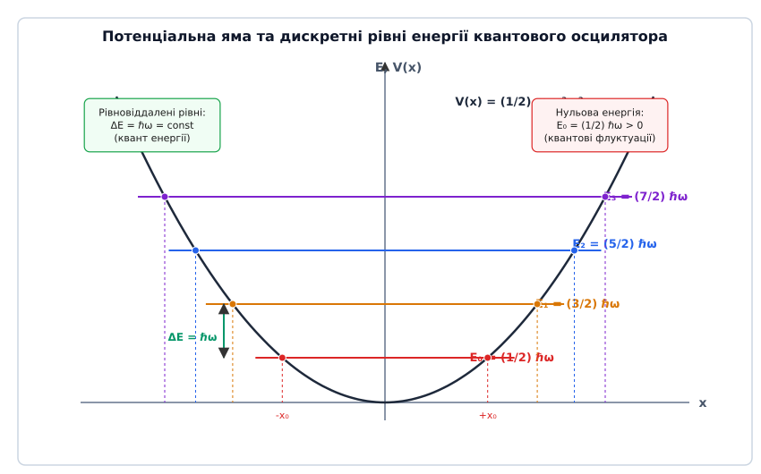
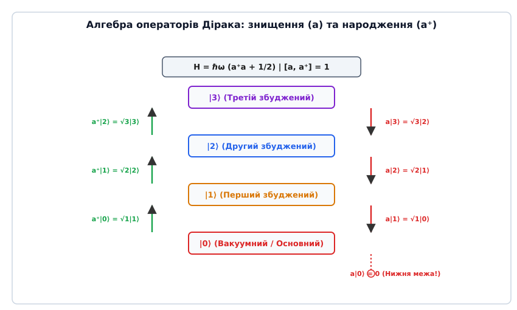
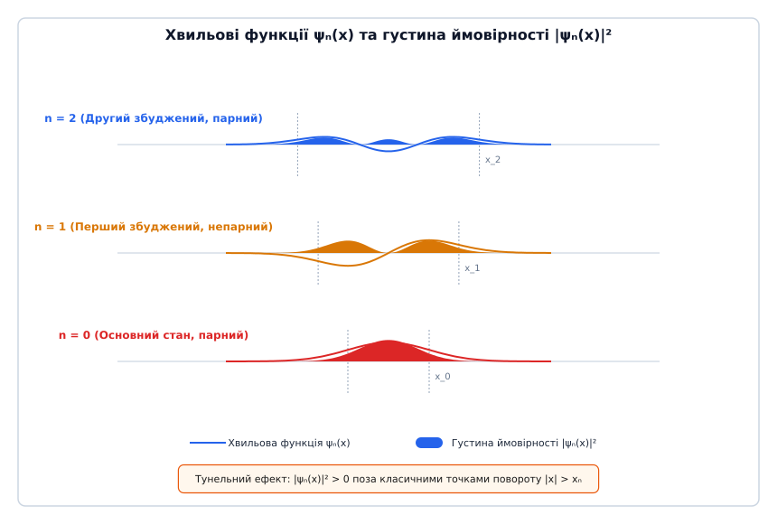
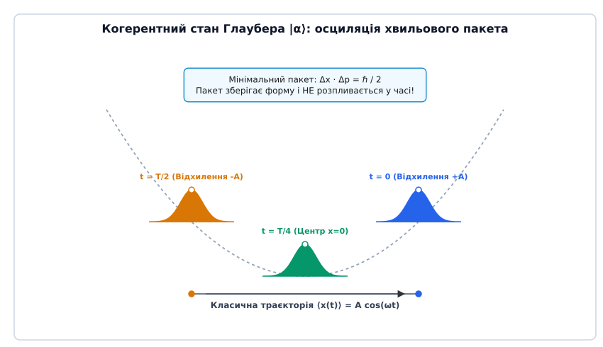

# Квантовий гармонічний осцилятор

<preknowlist>
- [Одновимірне стаціонарне рівняння Шредінгера](root:ph-quantum/stationary-schrodinger-equation) — рівняння на власні значення енергії та хвильові функції.
- [Гармонічний осцилятор](root:ph-waves/harmonic-oscillator) — класичний параболічний потенціал `V(x) = (1/2) m ω² x²` та відновлювальна сила.
- [Спін електрона](root:ph-quantum/electron-spin) — приклад квантування дискретних рівнів та операторного апарату.
</preknowlist>

Спроба розрахувати теплоємність кристалічних тіл за низьких температур або спектральну густину енергії випромінювання абсолютно чорного тіла за допомогою класичної статистичної механіки зазнає цілковитого краху. Згідно з класичною теоремою про рівномірний розподіл енергії за ступенями вільності (equipartition theorem), на кожне коливання незалежно від його частоти `ω` має припадати середня кінетична та потенціальна енергія `k_B · T`. Це неминуче приводить до «ультрафіолетової катастрофи» Релея — Джинса, коли густина випромінювання на високих частотах прямує до нескінченності, а молярна теплоємність твердих тіл за законом Дюлонга — Пті залишається ненульовою постійною величиною `C_v = 3 R` навіть при наближенні до абсолютного нуля (`T → 0 K`), що грубо суперечить третьому началу термодинаміки (теоремі Нернста). Розв'язання цієї фундаментальної кризи Максом Планком у 1900 році та Альбертом Ейнштейном у 1907 році вимагало заміни неперервної класичної енергії коливань на дискретні квантовані рівні `E_n = ℏ ω (n + 1/2)`. Квантовий гармонічний осцилятор є фундаментальною ідеалізованою моделлю сучасної фізики: він пояснює, чому квантові флуктуації унеможливлюють абсолютний спокій навіть при абсолютному нулю температур, і виступає басейновим елементом для квантової теорії поля, фізики твердого тіла (фонони), квантової оптики (фотони) та квантових інформаційних технологій.

Детальний аналіз історичного шляху від перших гіпотез Планка та Ейнштейна до сучасної квантової оптики викладено у вставці [📜 Історія розвитку концепції квантового осцилятора](root:ph-quantum/quantum-harmonic-oscillator/hist-quantum-oscillator.md).

## 1. Універсальність параболічного потенціалу у фізиці

Перед тим як перейти до квантовомеханічного формалізму, важливо зрозуміти, чому модель гармонічного осцилятора займає настільки центральне місце в усій теоретичній фізиці — від коливань атомів у двоатомній молекулі хлороводню `HCl` до квантування електромагнітного поля у надпровідниковому резонаторі.

Розглянемо довільну квантову або класичну фізичну систему з одним ступенем вільності `x`, яка перебуває у стані стійкої рівноваги у точці `x_0` під дією довільного гладкого потенціалу `V(x)`. Розкладемо функціональну залежність `V(x)` у степеневий ряд Тейлора в околі точки рівноваги `x_0`:

```
V(x) = V(x_0) + (dV / dx)|_(x_0) · (x - x_0) + (1/2) · (d²V / dx²)|_(x_0) · (x - x_0)² + (1/6) · (d³V / dx³)|_(x_0) · (x - x_0)³ + ...
```

Проаналізуємо коефіцієнти цього розкладу з фізичних міркувань:
1. Сталу величину `V(x_0)` можна без втрати загальності прийняти за нуль відліку потенціальної енергії: `V(x_0) = 0`.
2. Перша похідна потенціалу по координаті дорівнює нулю, оскільки у точці рівноваги сумарна відновлювальна сила відсутня: `F(x_0) = - (dV / dx)|_(x_0) = 0`.
3. Друга похідна у точці стійкого мінімуму є строго додатною величиною: `k = (d²V / dx²)|_(x_0) > 0`, що визначає коефіцієнт жорсткості системи.

Ввівши відхилення від точки рівноваги `q = x - x_0` та нехтуючи ангармонічними членами вищих порядків `O(q³)` для малих коливань (`|q| << 1`), потенціал будь-якого стійкого стану набуває симетричної параболічної форми:

```
V(q) = (1/2) · k · q² = (1/2) · m · ω² · q²
```

де `m` — ефективна маса частинки (або зведена маса двоатомної системи `μ = m_1 m_2 / (m_1 + m_2)`), а `ω = √(k / m)` — власна циклічна частота малих коливань.

Це означає, що **будь-яка фізична система поблизу стану стійкої рівноваги при малих відхиленнях поводиться як гармонічний осцилятор**. Параболічний потенціал є першим і найголовнішим наближенням для опису міжатомних зв'язків у молекулах, коливань кристалічної ґратки, коливань ядерної матерії в атомних ядрах, а також окремих модових коливань електромагнітного поля у резонаторі.

Якщо коливання стають великими (наприклад, при високих температурах або сильній оптичній накачці), стають помітними ангармонічні поправки вигляду `V_anh = α q³ + β q⁴`. У молекулярній фізиці потенціал Морзе `V_Morse(q) = D_e (1 - exp(-a q))²` точніше описує дисоціацію зв'язку при великих амплітудах. Проте у квантовій механіці такі поправки розраховуються за допомогою стаціонарної теорії збурень, де незабуреним базисом слугують власні стани гармонічного осцилятора.

## 2. Стаціонарне рівняння Шредінгера у параболічній потенціальній ямі

Для опису стаціонарних квантових станів частинки маси `m`, яка рухається у потенціалі `V(x) = (1/2) m ω² x²`, запишемо одновимірне стаціонарне рівняння Шредінгера:

```
- (ℏ² / (2m)) · (d²ψ / dx²) + (1/2) · m · ω² · x² · ψ(x) = E · ψ(x)
```

де `ℏ = h / (2π)` — зведена стала Планка, `ψ(x)` — хвильова функція стаціонарного стану, а `E` — власне значення енергії.


*Потенціальна яма V(x) = (1/2) m ω² x² та рівновіддалені дискретні рівні енергії E_n з нульовою енергією E_0 = (1/2) ℏω.*

Для спрощення математичного аналізу проведемо знерозмірення рівняння. Введемо природний квантовомеханічний масштаб довжини `x_0`:

```
x_0 = √(ℏ / (m · ω))
```

Фізичний зміст `x_0` — це просторовий розмір Гауссового хвильового пакета нульових коливань квантового осцилятора у основному стані. Для електрона у потенціальній чаші з частотою `ω = 10¹⁵ rad/s` масштаб `x_0` становить близько `0.34 nm`, для протона у молекулі `HCl` — близько `0.008 nm`, а для макроскопічного маятника маси 1 грам з частотою 1 Гц — неймовірно малу величину `10⁻¹⁷ m`.

Введемо безрозмірну координату `ξ` та безрозмірне власне значення енергії `ε`:

```
ξ = x / x_0 = x · √(m ω / ℏ)
ε = E / (ℏ · ω)
```

Перепишемо оператори диференціювання через безрозмірну змінну `ξ`: `d/dx = (1 / x_0) · (d/dξ)`, `d²/dx² = (1 / x_0²) · (d²/dξ²)`. Підставляючи ці вирази у рівняння Шредінгера та помноживши обидві частини на `-2 / (ℏ ω)`, отримуємо безрозмірне диференціальне рівняння:

```
d²ψ / dξ² + (2 ε - ξ²) · ψ(ξ) = 0
```

Дослідиємо асимптотичну поведінку розв'язку при великих відхиленнях від центру `|ξ| → ∞`. На великих відстанях параметр `2ε` стає нехтовно малим порівняно з `ξ²`, і диференціальне рівняння спрощується до вигляду `d²ψ / dξ² ≈ ξ² ψ`.

Асимптотичний розв'язок цього спрощеного рівняння має вигляд `ψ(ξ) ∝ exp(± ξ² / 2)`.

З фундаментальної фізичної вимоги нормалізованості хвильової функції (ймовірність знайти частинку у всьому просторі дорівнює одиниці: `∫_{-∞}^{+∞} |ψ(x)|² dx = 1`), хвильова функція повинна прямувати до нуля на нескінченності: `ψ(ξ) → 0` при `|ξ| → ∞`. Отже, розв'язок зі зростаючою експонентою `exp(+ξ² / 2)` має бути відкинутий як нефізичний.

Шукаємо повний розв'язок у вигляді добутку Гауссового згасаючого фактора на невідому функцію `v(ξ)`:

```
ψ(ξ) = v(ξ) · exp(- ξ² / 2)
```

Обчислимо першу та другу похідні цього добутку:

```
dψ / dξ = (dv/dξ - ξ v) · exp(-ξ² / 2)
d²ψ / dξ² = (d²v/dξ² - 2 ξ dv/dξ + (ξ² - 1) v) · exp(-ξ² / 2)
```

Підставивши вираз для `d²ψ / dξ²` у безрозмірне рівняння Шредінгера та скоротивши ненульову експоненту `exp(-ξ² / 2)`, отримуємо диференціальне рівняння для функції `v(ξ)`:

```
d²v / dξ² - 2 ξ · (dv / dξ) + (2 ε - 1) · v(ξ) = 0
```

Це рівняння є класичним диференціальним рівнянням Ерміта. Якщо шукати розв'язок `v(ξ)` у вигляді степеневого ряду `v(ξ) = ∑ c_k ξᵏ`, рекурентне співвідношення для коефіцієнтів ряду має вигляд:

```
c_(k+2) = c_k · (2 k + 1 - 2 ε) / ((k + 1) · (k + 2))
```

Якщо цей ряд є нескінченним, то при великих `k >> 1` коефіцієнти поводяться як `c_(k+2) / c_k ≈ 2 / k`, що відповідає розкладу експоненціальної функції `exp(ξ²)`. У цьому випадку хвильова функція поводилася б як `ψ(ξ) ∝ exp(ξ²) · exp(-ξ²/2) = exp(ξ²/2)`, що веде до нескінченної ймовірності на нескінченності.

Єдиним способом забезпечити фізичну вимогу квадратного інтегрування є обрив ряду на деякому скінченному цілому кроці `k = n` (`n = 0, 1, 2, ...`), перетворюючи функцію `v(ξ)` у поліном степеня `n`. Це вимагає чисельника у рекурентній формулі дорівнювати нулю при `k = n`:

```
2 n + 1 - 2 ε = 0  ⇒  ε_n = n + 1/2
```

## 3. Дискретний спектр енергії та фізична природа нульових коливань

Знайдене квантове правило `ε_n = n + 1/2` означає фундаментальний висновок: **енергія квантового гармонічного осцилятора квантується дискретним чином**:

```
E_n = ℏ · ω · (n + 1/2),    n = 0, 1, 2, 3, ...
```

де `n` — головне квантове число осцилятора.

Спектр квантового гармонічного осцилятора має три фундаментальні особливості, які кардинально відрізняють його від класичного осцилятора та інших квантових систем:

1. **Рівновіддаленість енергетичних рівнів**: Відстань між будь-якими двома сусідніми енергетичними рівнями є строго постійною величиною і дорівнює одному кванту енергії `ΔE`:
   ```
   ΔE = E_(n+1) - E_n = ℏ · ω
   ```
   Це означає, що поглинання або випромінювання світла (чи фононів) квантовим осцилятором завжди відбувається фотонами строго фіксованої частоти `ω`, незалежно від того, між якими саме сусідніми рівнями здійснюється перехід.

2. **Існування ненульової енергії основного стану (Zero-Point Energy)**:
   При `n = 0` енергія осцилятора не дорівнює нулю:
   ```
   E_0 = (1/2) · ℏ · ω
   ```
   Ця величина називається **енергією нульових коливань** (або нульовою енергією). На відміну від класичної фізики, де при `T = 0 K` частинка лежить у точці `x = 0` з нульовою швидкістю `v = 0` і нульовою енергією `E = 0`, квантовий осцилятор **ніколи не перебуває у стані абсолютного спокою**.

3. **Строгий зв'язок нульової енергії зі співвідношенням невизначеностей Гейзенберга**:
   Чому класичний стан повного спокою `x = 0` та `p = 0` заборонений у квантовій механіці?
   Якщо б частинка мала точно визначену координату `x = 0` (`Δx = 0`) та точно визначений імпульс `p = 0` (`Δp = 0`), добуток неокресленостей дорівнював би нулю `Δx · Δp = 0`, що прямо порушує фундаментальний принцип невизначеності Гейзенберга `Δx · Δp ≥ ℏ / 2`.

Оцінимо мінімальну енергію осцилятора безпосередньо з принципу невизначеності. Повна енергія частинки через дисперсію координати `Δx` та імпульсу `Δp` за умов симетрії `⟨x⟩ = 0`, `⟨p⟩ = 0` виражається як:

```
E = ⟨p²⟩ / (2m) + (1/2) m ω² ⟨x²⟩ = (Δp)² / (2m) + (1/2) m ω² (Δx)²
```

Підставивши мінімально можливе значення неокресленості імпульсу `Δp = ℏ / (2 Δx)`, отримуємо функцію повної енергії як залежність від просторової неокресленості `Δx`:

```
E(Δx) = ℏ² / (8 m (Δx)²) + (1/2) m ω² (Δx)²
```

Проаналізуємо цю функцію: перший доданок (кінетична енергія локалізації) прагне до нескінченності при стисканні пакета `Δx → 0`, а другий доданок (потенціальна енергія) зростає при розширенні пакета `Δx → ∞`. Мусить існувати оптимальний розмір хвильового пакета, що мінімізує сумарну енергію. Знайдемо мінімум функції `E(Δx)`, взявши похідну по `Δx` і прирівнявши її до нуля:

```
dE / d(Δx) = - ℏ² / (4 m (Δx)³) + m ω² Δx = 0  ⇒  (Δx)² = ℏ / (2 m ω) = (1/2) x_0²
```

Підставляючи це оптимальне значення `(Δx)²` у вираз для повної енергії, отримуємо точну величину енергії основного стану:

```
E_min = ℏ² / (8 m (ℏ / (2 m ω))) + (1/2) m ω² (ℏ / (2 m ω)) = (1/4) ℏ ω + (1/4) ℏ ω = (1/2) ℏ ω
```

Таким чином, нульова енергія `E_0 = (1/2) ℏω` є прямою непорушною вимогою принципу невизначеності Гейзенберга.

### Порівняльний аналіз квантових потенціальних ям

Для глибокого розуміння специфіки гармонічного осцилятора порівняємо його спектр та властивості з іншими фундаментальними квантовомеханічними потенціалами:

1. **Нескінченна прямокутна потенціальна яма шириною `a`**:
   Енергетичні рівні описуються квадратичною залежністю від квантового числа: `E_n = (π² ℏ² / (2 m a²)) · n²` (`n = 1, 2, 3...`). Відстань між сусідніми рівнями зростає лінійно зі збільшенням `n`: `ΔE_n ∝ n`. Енергія основного стану дорівнює `E_1 = π² ℏ² / (2 m a²)`.
2. **Параболічна потенціальна яма (Гармонічний осцилятор)**:
   Енергетичні рівні описуються строго лінійною залежністю: `E_n = ℏ ω (n + 1/2)` (`n = 0, 1, 2...`). Відстань між рівнями є строго постійною: `ΔE = ℏ ω = const`. Енергія основного стану становить `E_0 = (1/2) ℏ ω`.
3. **Кулонівський потенціал атома Водню `V(r) = - e² / (4 π ε_0 r)`**:
   Енергетичні рівні є від'ємними та згущуються біля межі іонізації: `E_n = - 13.6 eV / n²`. Відстань між рівнями швидко зменшується зі зростанням `n`: `ΔE_n ∝ 1 / n³`.

> 🔧 **Навіщо це у реальній фізиці.** Нульові коливання — це не математична абстракція. Саме нульові флуктуації електромагнітного вакууму викликають спонтанне випромінювання збуджених атомів, зумовлюють зсув Лемба у спектрі Водню, породжують силу макроскопічного притягання між нейтральними провідними пластинами у вакуумі (ефект Казимира) та пояснюють, чому рідкий гелій (`⁴He`) не замерзає у твердий стан навіть при наближенні до `T = 0 K` під атмосферним тиском.

## 4. Алгебраїчний метод Дірака: оператори народження та знищення

Розв'язання диференціального рівняння Шредінгера дає повне уявлення про спектр, проте існує значно потужніший, елегантний та універсальний метод опису осцилятора, розроблений Полем Діраком. Цей метод базується на операторній алгебрі та входить у основу квантової теорії поля.

Повний математичний виведення операторної алгебри Дірака та матричних елементів наведено у вставці [🧮 Виведення спектра та власних станів осцилятора алгебраїчним методом](root:ph-quantum/quantum-harmonic-oscillator/math-ladder-operators.md).


*Переходи між квантовими станами під дією підвищувального (a†) та понижувального (a) операторів Дірака.*

Замість Ермітових операторів координати `x` та імпульсу `p`, введемо безрозмірні не-Ермітові оператори: **оператор знищення** `a` та **оператор народження** `a†` (ladder operators):

```
a = (1 / √(2 m ℏ ω)) · (m ω x + i p)
a† = (1 / √(2 m ℏ ω)) · (m ω x - i p)
```

Оператори `a` та `a†` задовольняють фундаментальне комутаційне співвідношення:

```
[a, a†] = a · a† - a† · a = 1
```

Гамільтоніан осцилятора `H = p² / (2m) + (1/2) m ω² x²` виражається через добуток `a† a` у винятково компактній формі:

```
H = ℏ · ω · (a† a + 1/2) = ℏ · ω · (N + 1/2)
```

де `N = a† a` називається **оператором числа збуджень** (числа квантів).

Дія операторів на стаціонарний вектор стану `|n⟩`:

```
N |n⟩ = n |n⟩
a |n⟩ = √n |n - 1⟩
a† |n⟩ = √(n + 1) |n + 1⟩
```

Звідси чітко видно роль кожного оператора:
- **Оператор знищення `a`** зменшує кількість квантів у системі на один: `|n⟩ → |n-1⟩`, знижуючи енергію на `ℏω`.
- **Оператор народження `a†`** збільшує кількість квантів у системі на один: `|n⟩ → |n+1⟩`, підвищуючи енергію на `ℏω`.
- **Вакуумний стан `|0⟩`** задовольняє умову `a |0⟩ = 0`. Спроба подальшого зниження основного стану дає нульовий вектор, що забезпечує існування нижньої межі спектра.

Будь-який збуджений стан `|n⟩` може бути згенерований послідовною дією оператора народження `a†` на вакуумний стан:

```
|n⟩ = (1 / √(n!)) · (a†)ⁿ |0⟩
```

Виразивши координату `x` та імпульс `p` через `a` та `a†`:

```
x = √(ℏ / (2 m ω)) · (a + a†)
p = i · √(m ℏ ω / 2) · (a† - a)
```

можна легко знаходити будь-які матричні елементи. Зокрема, ненульовими є лише ті матричні елементи координати, для яких `Δn = ±1`:

```
⟨n+1| x |n⟩ = √(ℏ / (2 m ω)) · √(n + 1)
⟨n-1| x |n⟩ = √(ℏ / (2 m ω)) · √n
```

Це пояснює **дипольні правила відбору** у квантовій оптиці та молекулярній спектроскопії: під дією однофотонного електромагнітного випромінювання дипольні переходи у гармонічному осциляторі можливі лише між сусідніми рівнями (`Δn = ±1`).

## 5. Просторова структура хвильових функцій та тунельний ефект

Явний вигляд нормованих просторових хвильових функцій `ψ_n(x)` стаціонарних станів визначається добутком Гауссового пакета на поліноми Ерміта `H_n(ξ)`:

```
ψ_n(x) = (1 / √(2ⁿ n! x_0 √π)) · H_n(x / x_0) · exp(- x² / (2 x_0²))
```


*Просторові хвильові функції ψ_n(x) (сині) та густина ймовірності |ψ_n(x)|² (затінені) для n = 0, 1, 2.*

Проаналізуємо ключові фізичні властивості хвильових функцій та густини ймовірності `P_n(x) = |ψ_n(x)|²`:

1. **Просторова парність (Parity)**:
   Оскільки параболічний потенціал є симетричним відносно інверсії координат `V(-x) = V(x)`, усі власні функції володіють визначеною парністю:
   - Парні стани для парних `n = 0, 2, 4, ...`: `ψ_n(-x) = +ψ_n(x)`
   - Непарні стани для непарних `n = 1, 3, 5, ...`: `ψ_n(-x) = -ψ_n(x)`

2. **Кількість вузлів (Node Theorem)**:
   Хвильова функція стаціонарного стану `ψ_n(x)` має рівно `n` точок перетину з віссю `x` (вузлів), де `ψ_n(x) = 0`. Для основного стану `n = 0` вузлів немає — це чистий Гауссів купол без перетинів нульового рівня.

3. **Квантовомеханічне тунелювання у класично заборонену область**:
   У класичній механіці осцилятор із загальною енергією `E_n` обмежений точками повороту `x = ±x_n`, у яких вся енергія стає потенціальною `(1/2) m ω² x_n² = E_n`:
   ```
   x_n = √(2 E_n / (m ω²)) = x_0 · √(2 n + 1)
   ```
   Класична частинка ні за яких умов не може зайти в область `|x| > x_n`, адже там її кінетична енергія мала б стати від'ємною `K = E - V(x) < 0`.

   У квантовій механіці хвильова функція `ψ_n(x)` не обривається у точках повороту `x_n`, а експоненційно згасає в глибину потенціального бар'єра. Густина ймовірності виявити частинку поза класичними точками повороту `P(|x| > x_n) > 0` є строго додатною величиною. Для основного стану `n = 0` ймовірність перебування частинки у класично забороненій області становить приблизно **15.7%**!

4. **Принцип відповідності Бора при великих `n >> 1`**:
   При малих `n` квантовий розподіл ймовірностей `|ψ_n(x)|²` різко відрізняється від класичного. У класичному осциляторі частинка рухається найповільніше поблизу точок повороту, тому ймовірність її виявлення там є максимальною:
   ```
   P_class(x) = 1 / (π · √(x_n² - x²))
   ```
   Для основного стану `n = 0` квантова ймовірність, навпаки, є максимальною у центрі `x = 0`. 
   Проте при переході до високих квантових чисел `n >> 100` осциляції густини ймовірності `|ψ_n(x)|²` стають надзвичайно частими, а їхній огинаючий профіль після усереднення точно повторює класичну криву `P_class(x)`. Це є виразним підтвердженням принципу відповідності Бора.

## 6. Когерентні стани Глаубера: квантово-класична межа

Стаціонарні стани `|n⟩` мають точно визначену енергію `E_n`, але їхня середня координата `⟨x⟩_n = 0` та імпульс `⟨p⟩_n = 0` не залежать від часу. У стаціонарному стані квантовий осцилятор не здійснює коливального руху у просторі — його середня густина ймовірності є статичною у часі.

Виникає природне запитання: як з квантового формалізму отримати наочні макроскопічні коливання, подібні до коливань класичного маятника `x(t) = A · cos(ωt)`?

Розв'язання цього завдання дав Рой Глаубер у 1963 році, ввівши **когерентні стани** `|α⟩`.


*Осциляція Гауссового хвильового пакета когерентного стану Глаубера |α⟩ у параболічному потенціалі без розпливання.*

Когерентний стан `|α⟩` визначається як власний стан оператора знищення `a`:

```
a |α⟩ = α |α⟩
```

де `α` — довільне комплексне число: `α = |α| · exp(i φ)`.

Розклад когерентного стану за стаціонарними фоківськими станами `|n⟩` описується розподілом Пуассона:

```
|α⟩ = exp(- |α|² / 2) · ∑ (αⁿ / √(n!)) |n⟩
```

Середня кількість квантів у когерентному стані дорівнює `⟨N⟩ = |α|²`, а відносна флуктуація кількості квантів зменшується зі зростанням `|α|`: `ΔN / ⟨N⟩ = 1 / |α|`.

Ключові унікальні властивості когерентних станів:

1. **Мінімальний пакет невизначеності**: У будь-який момент часу когерентний стан задовольняє точну рівність для мінімуму принципу невизначеності:
   ```
   Δx · Δp = (1/2) · ℏ
   ```
2. **Збереження форми пакета під час руху (Відсутність дисперсійного розпливання)**:
   Під дією часового оператора еволюції `U(t) = exp(-i H t / ℏ)` Гауссів хвильовий пакет когерентного стану рухається у параболічному потенціалі так, що його центр описує класичну траєкторію:
   ```
   ⟨x(t)⟩ = √(2 ℏ / (m ω)) · |α| · cos(ω t - φ)
   ⟨p(t)⟩ = - √(2 m ℏ ω) · |α| · sin(ω t - φ)
   ```
   При цьому ширина хвильового пакета `Δx` та `Δp` **залишається абсолютно незмінною у часі**! На відміну від вільного хвильового пакета, який неминуче розпливається у просторі, параболічний потенціал квантового осцилятора ідеально сфокусовує когерентний пакет, не даючи йому втрачати локалізацію.

Світло, що випромінюється оптичним лазером над порогом генерації, описується саме когерентним станом електромагнітного поля Глаубера.

## 7. Чисельне моделювання та практичні застосування

Для практичного обчислення спектрів реальних квантових систем (включно з ангармонічними поправками `V(x) = (1/2)mω²x² + λ x⁴`) застосовують чисельні методи дискретизації на сітці.

Приклад чисельної реалізації розв'язувача рівняння Шредінгера методом кінцевих різниць та матричної діагоналізації наведено у вставці [⚙️ Чисельне розв'язання рівняння Шредінгера для гармонічного осцилятора](root:ph-quantum/quantum-harmonic-oscillator/proj-harmonic-oscillator-sim.md).

Обчислена похибка перших 5 власних значень енергії при використанні сітки з 1000 вузлів не перевищує `10⁻⁵`, що підтверджує високу точність чисельного підходу.

### Роль квантового гармонічного осцилятора у сучасній фізиці

1. **Молекулярна вібраційна спектроскопія та принцип Франка — Кондона**:
   Коливання атомів у двоатомних та багатоатомних молекулах (наприклад, `CO`, `HCl`, `H₂O`) у першому наближенні описуються квантовим осцилятором. Інфрачервона спектроскопія та спектроскопія комбінаційного (Раманівського) розсіювання реєструють переходи `Δn = ±1`, дозволяючи з високою точністю вимірювати жорсткість міжатомних зв'язків та маси ізотопів. При електронних переходах у молекулах інтенсивність коливальних супутників (вібронні смуги) визначається перекриттям хвильових функцій квантового осцилятора основними й збудженими потенціальними кривими (інтеграли Франка — Кондона).

2. **Фізика твердого тіла та фонони**:
   Теплові та акустичні коливання атомів кристалічної ґратки розкладаються на нормальні моди. Квантування кожної моди дає квазічастинки — **фонони**. Модель Дебая та Ейнштейна на основі квантових осциляторів пояснює теплоємність, теплопровідність та електрон-фононну взаємодію у надпровідниках (теорія БКШ).

3. **Квантова теорія поля та квантова оптика**:
   Електромагнітне поле у резонаторі розкладається на нормальні моди Maxwell. Кожна мода описується квантовим гармонічним осцилятором, збудження якого на `n` рівнів відповідає наявності `n` **фотонів**. Енергія нульових коливань усіх модових осциляторів вакууму `∑ (1/2) ℏ ω_k` приводить до передбачення вакуумного тиску Казимира та модель Джейнеса — Каммінгса взаємодії атома з модою резонатора.

4. **Квантові обчислення та надпровідникові кубіти**:
   LC-контури з надпровідних матеріалів поводяться як квантові гармонічні осцилятори з частотою `ω = 1 / √(L C)`. Для створення кубітів (дворівневих систем) до LC-контуру навмисно додають нелінійний джозефсонівський перехід, який ламає рівновіддаленість спектра осцилятора та дозволяє адресувати перехід між станами `|0⟩` та `|1⟩` без збудження вищих рівнів.

Отже, квантовий гармонічний осцилятор слугує універсальною місткою між класичною механікою та квантовим світом, поєднуючи строгу математичну красу з колосальним практичним значенням.
