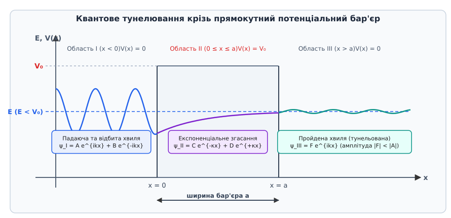
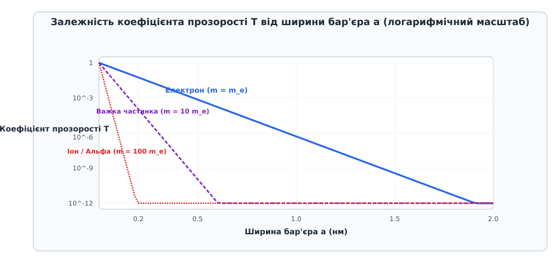
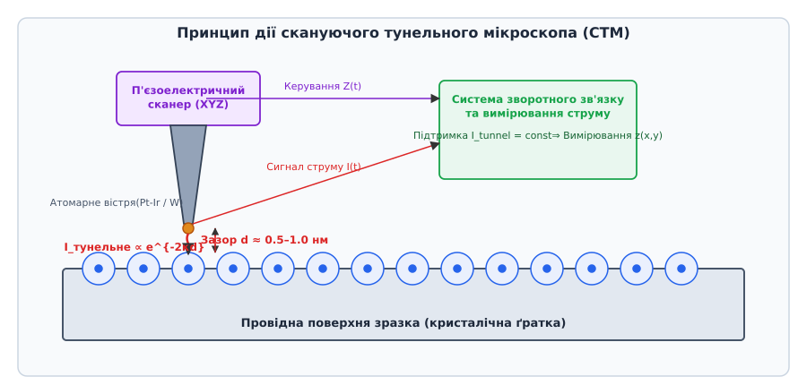
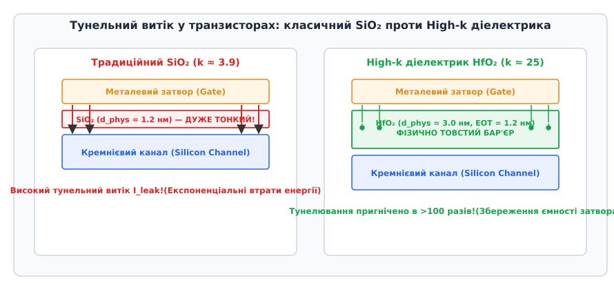

# Квантове тунелювання

<preknowlist>
- [Корпускулярно-хвильовий дуалізм](root:ph-quantum/wave-particle-duality) — хвильова функція, хвильовий вектор та імовірнісне тлумачення квантового стану.
- [Одновимірне стаціонарне рівняння Шредінгера](root:ph-quantum/stationary-schrodinger-equation) — стаціонарні стани, потенціальний бар'єр та власні значення енергії.
- [Принцип невизначеності Гайзенберга](root:ph-quantum/uncertainty-principle) — співвідношення невизначеностей енергії та часу, координати та імпульсу.
</preknowlist>

При дослідженні природного альфа-розпаду ядра Урану-238 (`238U`) випромінюється α-частинка (ядро Гелію-4 з масою `m_α ≈ 6.64 × 10⁻²⁷ kg` та зарядом `+2e`) з кінетичною енергією `E ≈ 4.27 MeV`. Однак для того щоб вирватися за межі радіуса дії ядерних сил (`r_n ≈ 8.5 fm`), ця частинка мусить подолати кулонівський потенціальний бар'єр відштовхування решти 90 протонів ядра, висота якого досягає `V_max ≈ 26 MeV`, а просторова ширина становить майже `30 fm`. У межах класичної ньютонівської механіки об'єкт з енергією `E`, який зустрічає бар'єр висотою `V₀ > E`, має від'ємну кінетичну енергію `K = E - V₀ < 0` усередині бар'єра. 

У класичній фізиці швидкість частинки `v = √(2 K / m)` усередині бар'єра стає уявною величиною, рух у такій потенціальній області є принципово забороненим, а коефіцієнт відбивання частинки від стінки бар'єра суворо дорівнює `R = 1.0` (100% відбивання). Класична механіка стверджує: α-частинка заперта в ядерному потенціальному колодязі назавжди і не може залишити ядро за жодних обставин, окрім випадку підведення зовнішньої енергії `ΔE ≥ V₀ - E`.

Проте експериментальні вимірювання свідчать, що уран-238 є радіоактивним і розпадається з періодом напіврозпаду 4.47 мільярда років. Цю фундаментальну суперечність розв'язує квантова механіка через явище **квантового тунелювання** (англ. *quantum tunnelling*, від лат. *tunnellus* — трубоподібний прохід) — проникнення квантової частинки крізь потенціальний бар'єр, висота якого перевищує її повну енергію.

У класичній термодинаміці подолання бар'єра відбувається шляхом надбар'єрного перельоту за рахунок теплових флуктуацій (закон Арреніуса, ймовірність `P ∝ exp(-ΔE / k_B T)`). На противагу цьому, квантове тунелювання відбувається при довільно низьких температурах без підведення додаткової енергії, виключно завдяки хвильовим властивостям матерії.

Детальний аналіз історичного шляху відкриття тунельного ефекту від спектрів молекул аміаку та пояснення альфа-розпаду до винаходу скануючого тунельного мікроскопа викладено у вставці [📜 Історія відкриття тунельного ефекту](root:ph-quantum/quantum-tunnelling/hist-quantum-tunnelling.md).

## 1. Хвильова функція в класично забороненій області та граничні умови

Відмінність між класичною точковою частинкою та квантовим об'єктом полягає у корпускулярно-хвильовому дуалізмі. Стан квантової частинки описується комплексною хвильовою функцією `ψ(x)`, квадрат модуля якої `|ψ(x)|²` визначає густину ймовірності знайти частинку у точці `x`.

Розглянемо одновимірний прямокутний потенціальний бар'єр висотою `V₀` та шириною `a`. Простори ліворуч та праворуч від бар'єра є вільними (`V(x) = 0`). Одновимірне стаціонарне рівняння Шредінгера для енергії частинки `E < V₀` має вигляд:

```
- (ℏ² / (2 m)) (d²ψ(x) / dx²) + V(x) ψ(x) = E ψ(x)
```

Простір ділиться на три фізичні області:

1. **Область I (`x < 0`, перед бар'єром):** `V(x) = 0`. Хвильове число є дійсним `k = √(2 m E) / ℏ`. Розв'язком є суперпозиція падаючої монохроматичної хвилі з амплітудою `A` та відбитої хвилі з амплітудою `B`:
   ```
   ψ_I(x) = A exp(i k x) + B exp(-i k x)
   ```
   Густина потоку ймовірності у цій області визначається різницею падаючого та відбитого потоків: `J_I = (ℏ k / m) (|A|² - |B|²)`.

2. **Область II (`0 ≤ x ≤ a`, усередині бар'єра):** `V(x) = V₀ > E`. Перепишемо рівняння Шредінгера:
   ```
   d²ψ(x) / dx² = (2 m (V₀ - E) / ℏ²) ψ(x) = κ² ψ(x)
   ```
   де `κ = √(2 m (V₀ - E)) / ℏ` — дійсне значення коефіцієнта згасання хвильової функції. У цій класично забороненій області розв'язок **не є осцилюючою хвилею**, а являє собою суму спадної та зростаючої експонент:
   ```
   ψ_II(x) = C exp(-κ x) + D exp(κ x)
   ```
   Додатна експонента `D exp(κ x)` виникає внаслідок наявності правої межі бар'єра `x = a`, на якій відбувається внутрішнє відбивання хвилі, що загасає. Густина потоку ймовірності усередині бар'єра залишається сталою `J_II = (2 ℏ κ / m) Im(C* D)` і дорівнює пройденому потоку.

3. **Область III (`x > a`, за бар'єром):** `V(x) = 0`. Існує лише пройдена (тунельована) хвиля, що рухається праворуч із амплітудою `F`:
   ```
   ψ_III(x) = F exp(i k x)
   ```
   Густина потоку тунельованих частинок становить `J_III = (ℏ k / m) |F|²`.


*Проникнення квантової хвильової функції крізь прямокутний бар'єр: експоненціальне загасання амплітуди в класично забороненій області II та збереження залишковї хвилі в області III.*

З фізичних вимог збереження ймовірності та неперервності вектора потоку ймовірності хвильова функція `ψ(x)` та її перша похідна `dψ(x)/dx` мають бути строго неперервними на межах `x = 0` та `x = a`. На відміну від класичного випадку, де ймовірність миттєво падає до нуля на стінці бар'єра, квантова хвильова функція не обривається. Вона експоненціально загасає вглиб бар'єра пропорційно `exp(-κ x)`. 

Якщо ширина бар'єра `a` є скінченною, хвильова функція доходить до правої межі `x = a` з ненульовою амплітудою `ψ_II(a) ≠ 0`, звідки виходить у простір III як пройдена плоска хвиля з амплітудою `F`. Це означає, що частинка з певною ймовірністю виявляється за бар'єром, зберігаючи свою початкову енергію `E`.

Цікавим теоретичним явищем є ефект Гартмана (англ. *Hartman effect*): при збільшенні товщини бар'єра час затримки фази тунельованої хвилі (груповий час тунелювання) прямує до сталого значення і перестає залежати від товщини бар'єра `a`. Це створює ілюзію «надсвітлового» руху фазового фронту усередині бар'єра, проте детальний аналіз переносу інформації показує, що причинність не порушується, адже передній фронт хвильового пакета не поширюється швидше за швидкість світла у вакуумі `c`.

## 2. Коефіцієнт прозорості бар'єра та параметричні залежності

Ймовірність того, що частинка пройде крізь потенціальний бар'єр, визначається коефіцієнтом прозорості `T` (від англ. *transmission coefficient*), який дорівнює відношенню густини потоку ймовірності пройденої хвилі до падаючої:

```
T = |J_transmitted| / |J_incident| = |F|² / |A|²
```

Точне розв'язання системи з чотирьох граничних рівнянь неперервності дає точний алгебраїчний вираз для прозорості прямокутного бар'єра:

```
T = 1 / [ 1 + (V₀² / (4 E (V₀ - E))) sinh²(κ a) ]
```

Детальний математичний вивід цієї формули з матриці зшивання та аналізом граничних випадків наведено у вставці [🧮 Математичний вивід коефіцієнта прозорості потенціального бар'єра](root:ph-quantum/quantum-tunnelling/math-barrier-transmission.md).

Для широких або високих бар'єрів, коли `κ a >> 1`, гіперболічний синус наближається до експоненти `sinh(κ a) ≈ (1/2) exp(κ a)`. Тоді точна формула спрощується до напівкласичного виразу:

```
T ≈ 16 (E / V₀) (1 - E / V₀) exp(-2 κ a)
```

де показник загасання становить:

```
2 κ a = (2 a / ℏ) √(2 m (V₀ - E))
```


*Залежність коефіцієнта прозорості T від ширини бар'єра a в логарифмічному масштабі для електрона, протона та альфа-частинки.*

Аналіз коефіцієнта прозорості показує три фундаментальні фізичні залежності:

1. **Експоненціальна чутливість до ширини бар'єра `a`:** Оскільки `T` залежить від `exp(-2 κ a)`, збільшення ширини бар'єра вдвічі приводить до піднесення коефіцієнта прозорості до квадрата. Наприклад, якщо при ширині `a = 0.5 nm` прозорість дорівнює `T = 10⁻³`, то при `a = 1.0 nm` вона падає до `T = 10⁻⁶` (у тисячу разів менше!). Ця надчутливість описує логарифмічний масштаб на графіках і є основою роботи тунельних мікроскопів.
2. **Залежність від маси частинки `m`:** Коефіцієнт згасання пропорційний квадратному кореню з маси частинки `κ ∝ √m`. Легкі електрони (`m_e ≈ 9.11 × 10⁻³¹ kg`, ефективна маса в напівпровідниках `m_e^* ≈ 0.067 m_e`) легко тунелюють крізь нанометрові бар'єри у транзисторах та діодах. Протон (`m_p ≈ 1836 m_e`) має коефіцієнт `κ` у 43 рази більший, тому протонне тунелювання спостерігається лише у водневих зв'язках ферментів та кристалів при ширинах `< 0.1 нм`. Альфа-частинка (`m_α ≈ 7300 m_e`) має у 85 разів більший коефіцієнт згасання, тому для неї тунелювання стає помітним лише при фемтометрових ширинах бар'єра (`a ~ 10⁻¹⁵ m`).
3. **Залежність від дефіциту енергії `V₀ - E`:** Чим ближче енергія частинки `E` до вершини бар'єра `V₀`, тим меншим є дефіцит енергії, а отже, тем повільніше згасає хвильова функція усередині бар'єра і тим вищою є ймовірність проникнення.

Окремим важливим квантовим ефектом є **резонансне тунелювання** у двобар'єрних структурах. Якщо частинка зустрічає два послідовних потенціальних бар'єри, між якими утворюється квантова яма з дискретним рівнем енергії `E_1`, то при збігу енергії падаючої частинки з цим рівнем (`E = E_1`) виникає конструктивна інтерференція хвиль. У результаті коефіцієнт прозорості подвійного бар'єра зростає до **100% (`T = 1.0`)**, навіть якщо прозорість кожного бар'єра окремо є мікроскопічно малою! Це квантовий аналог інтерференційного просвітлення в оптиці.

## 3. Напівкласичне наближення ВКБ та Термоядерний синтез у надрах Сонця

Для потенціальних бар'єрів довільної складної форми `V(x)` (наприклад, кулонівського чи параболічного бар'єра) застосовують напівкласичне наближення Вентцеля — Крамерса — Бріллюена (ВКБ, нім. *Gregor Wentzel*, нід. *Hendrik Anthony Kramers*, фр. *Léon Brillouin*).

У наближенні ВКБ прозорість бар'єра між точками повороту `x₁` та `x₂` (де `V(x₁) = V(x₂) = E`) визначається інтегральним фактором Ґамова `G`:

```
T ≈ exp(-G) = exp( - (2 / ℏ) ∫_{x₁}^{x₂} √(2 m (V(x) - E)) dx )
```

Цей метод дозволив Георгію Ґамову у 1928 році кількісно пояснити альфа-розпад атомних ядер. Потенціал ядра являє собою глибоку ядерну яму при `r < r_n` за рахунок сильної взаємодії, яка при `r > r_n` переходить у кулонівський бар'єр відштовхування `V(r) = Z₁ Z₂ e² / (4 π ε₀ r)`.

Обчислення інтеграла Ґамова для кулонівського бар'єра приводить до математичного виводу закону Гейгера — Неттолла:

```
log₁₀(T_1/2) = A + B / √E
```

де `T_1/2` — період напіврозпаду ізотопу, `E` — енергія вилітаючої α-частинки, а `A` та `B` — константи для даного радіоактивного ряду.

Закон Гейгера — Неттолла пояснює дивовижний парадокс ядерної фізики: зміна енергії α-частинки всього вдвічі — від `4.27 MeV` для Урану-238 (`238U`) до `8.78 MeV` для Полонію-214 (`214Po`) — змінює період напіврозпаду на 20 порядків: від `4.47 × 10⁹` років у Урану до `1.64 × 10⁻⁴` секунд у Полонію! Такий гігантський діапазон часових масштабів виникає виключно завдяки експоненціальній природі квантового тунелювання.

Другим грандіозним застосуванням наближення ВКБ є пояснення **термоядерного синтезу у надрах Сонця**. 

Температура у центрі Сонця становить близько `T_core ≈ 1.57 × 10⁷ K`. Середня кінетична енергія протонів при такій температурі дорівнює всього `k_B T ≈ 1.35 keV`. Проте кулонівський бар'єр відштовхування між двома протонами при їхньому зближенні на відстань дії ядерних сил (`r_n ≈ 1.5 fm`) досягає висоти близько `V_max ≈ 1 MeV` (700 кев!).

З погляду класичної фізики середня енергія протонів у 500 разів менша за висоту бар'єра. За класичним розподілом Максвелла — Больцмана частка протонів, що мають енергію `~1 MeV`, становить виключно мікроскопічну величину `exp(-E / k_B T) ≈ exp(-700 / 1.35) ≈ 10⁻²²⁵`. За класичними законами у центрі Сонця не відбулося б жодної реакції синтезу, Сонце не могло б світити, а життя у Всесвіті виявилося б неможливим.

Квантове тунелювання вирішує цей парадокс. Ймовірність тунелювання протонів крізь кулонівський бар'єр описується формулою Ґамова:

```
P_tunnel(E) = exp( - b / √E )
```

де `b = π α Z₁ Z₂ √(2 m c²) / ℏ`. 

Перемноження спадної больцманівської експоненти `exp(-E / k_B T)` та зростаючої тунельної експоненти `exp(-b / √E)` формує вузьке енергетичне вікно — **пік Ґамова** (при енергії `E_Gamow ≈ 5.9 keV`). Саме у цьому вузькому енергетичному інтервалі протони тунелюють крізь кулонівський бар'єр, забезпечуючи стабільну протон-протонну реакцію термоядерного синтезу, яка живить Сонце протягом мільярдів років.

## 4. Фізичні явища та прилади на основі тунельного ефекту

Квантове тунелювання — це не лише мікроскопічна фундаментальна властивість атомних ядер та зірок, а й техніка створення сучасних електронних, надпровідних та сенсорних приладів.

### Автоелектронна (польова) емісія
При прикладанні до поверхні металу у вакуумі екстремально сильного електричного поля напряженістю `E_field > 10⁹ V/m` потенціальний бар'єр вакууму деформується, набуваючи вузької трикутної форми. Електрони провідності з поверхні Фермі тунелюють безпосередньо у вакуум без нагрівання металу (холодний катод). Цей процес описується формулою Фаулера — Нордгейма і використовується у польових електронних мікроскопах та польових автоемісійних дисплеях.

### Тунельні та резонансно-тунельні діоди
У сильнолегованих p-n переходах (діодах Есакі) ширину збедненого шару зменшують до `8–10 нм`. При малій прямій напрузі заповнені стани зони провідності n-області опиняються навпроти вільних станів валентної зони p-області, викликаючи високий тунельний струм `I_p`. Збільшення напруги зміщує зони по енергії, знижуючи тунельний струм до мінімуму `I_v`, що формує ділянку **від'ємного диференціального опору** (`dI/dV < 0`).

Детальний аналіз конструкції, ВАХ та еквівалентних схем тунельних діодів викладено у вставці [🔌 Тунельний діод та резонансні тунельні структури](root:ph-quantum/quantum-tunnelling/comp-tunnel-diode.md).

### Скануюча тунельна мікроскопія (СТМ)
У 1981 році Ґерд Бінніґ та Гайнріх Рорер винайшли скануючий тунельний мікроскоп. Металеве вістря з атомарним радіусом заокруглення підводять до провідної поверхні зразка на відстань `d ≈ 0.5–1.0 нм`. При прикладанні малої напруги зсуву `V_bias ≈ 10–100 mV` між вістрям і поверхнею виникає тунельний струм `I_tunnel ∝ exp(-2 κ d)`.


*Схема скануючого тунельного мікроскопа: тунельний струм між металевим вістрям і поверхнею зразка експоненціально залежить від відстані d.*

Завдяки експоненціальній залежності зміна відстані між вістрям і поверхнею лише на один ангстрем (`Δd = 0.1 nm`, розмір одного атома!) змінює тунельний струм у 10 разів. Система зворотного зв'язку зміщує вістря по висоті `Z`, підтримуючи струм постійним (`I_tunnel = const`), що дозволяє будувати тривимірну топографію поверхні з атомарною роздільною здатністю.

Крім топографії, СТМ використовують у режимі тунельної спектроскопії (STS, *Scanning Tunneling Spectroscopy*): похідна тунельного струму по напрузі `dI/dV` є прямо пропорційною локальній густині електронних станів поверхні (LDOS, *Local Density of States*):

```
dI / dV ∝ ρ_sample(E_F + e V)
```

За допомогою СТМ у лабораторіях IBM (Дональд Ейґлер, 1990) вперше було здійснено атомарну маніпуляцію — поштучне переміщення 35 атомів Ксенону по поверхні Нікелю для створення написів та квантових загонів (англ. *Quantum Corrals*), усередині яких спостерігаються стоячі квантові хвилі електронної густини.

### Надпровідні тунельні переходи (Ефекти Джозефсона)
Коли два надпровідники розділені ультратонким шаром диелектрика (структура S-I-S товщиною `1–2 нм`), крізь бар'єр можуть тунелювати зв'язані куперівські електронні пари без розриву їхнього зв'язку. Це створює незагасаючий надпровідний струм тунелювання при нульовій напрузі (стаціонарний ефект Джозефсона):

```
I = I_c sin(φ_2 - φ_1)
```

де `φ_2 - φ_1` — різниця фаз квантових хвильових функцій надпровідників, а `I_c` — критичний тунельний струм. 

При прикладанні постійної напруги `V` між надпровідниками виникає високочастотне осцилювання тунельного струму з частотою (нестаціонарний ефект Джозефсона):

```
ν = (2 e / h) V  ≈ 483.59 GHz / mV
```

Ефект Джозефсона застосовується у надпровідних квантових інтерферометрах (СКВІД, англ. *SQUID*) для вимірювання надслабких магнітних полів до `10⁻¹⁵ T`, у первинному вольт-еталоні напруги та у надпровідних кубітах (трансмонах) для квантових комп'ютерів.

## 5. Квантові обмеження наноелектроніки та сучасні рубежі

Зі зменшенням розмірів транзисторів у сучасних інтегральних мікросхемах (технологічні норми sub-3nm у процесорах Apple M3, A17 Pro, NVIDIA Blackwell) квантове тунелювання з теоретичного явища перетворилося на головний фізичний бар'єр подальшого прогресу напівпровідникової індустрії.

### Тунельний витік у затворах польових транзисторів (MOSFET / FinFET / GAAFET)
У класичних польових транзисторах для керування струмом каналу між металевим затвором і напівпровідниковим каналом розміщують ізолюючий шар диоксиду кремнію `SiO₂`. При зменшенні довжини каналу для збереження електростатичного контролю доводиться зменшувати товщину `SiO₂`. Коли товщина затвора досягла `t_ox < 1.2 нм` (усього 4–5 атомних шарів кремнію), електрони починають масово тунелювати прямо з затвора в канал.


*Порівняння витіку струму тунелювання крізь тонкий SiO2 затвор та потовщений High-k діелектрик у сучасних транзисторах.*

Цей тунельний витік затвора призводить до колосального статичного енергоспоживання мікросхем навіть у стані спокою, викликаючи перегрів процесорів. Задля подолання цієї кризи індустрія перейшла на **High-k діелектрики** (матеріали з високою діелектричною проникністю, такі як оксид гафнію `HfO₂`, `k ≈ 25` проти `k ≈ 3.9` у `SiO₂`). 

Завдяки високій проникності шар `HfO₂` можна зробити фізично товстішим (`d_phys ≈ 3.0 нм`), що пригнічує квантове тунелювання у понад 100 разів при збереженні необхідної еквівалентної електростатичної ємності затвора (EOT — *Equivalent Oxide Thickness*):

```
EOT = d_phys · (k_SiO2 / k_High-k)
```

### Тунельний запис у флеш-пам'яті NAND
Усередині кожної комірки флеш-пам'яті (NAND Flash та 3D NAND) за двома бар'єрами розташований плаваючий затвор або шар пастки заряду (Charge Trap). Для запису інформації (стан логічного «0») до керуючого затвора прикладають високу напругу `15–20 V`, викликаючи інжекцію електронів Фаулера — Нордгейма крізь тунельний оксид у плаваючий затвор. Заряд залишається у пастці десятиліттями, бо за відсутності зовнішнього поля ймовірність зворотно тунелювати крізь потенціальний бар'єр є прямує до нуля.

### Квантове тунелювання у квантових обчисленнях
У квантовому відпалі (англ. *Quantum Annealing*, процесори D-Wave) квантове тунелювання використовується для пошуку глобального мінімуму у складних оптимізаційних задачах комбінаторики. На відміну від класичного термодинамічного відпалу, де система має долати високі енергетичні бар'єри за рахунок теплових флуктуацій (`exp(-ΔE / k_B T)`), квантова система тунелює **крізь** вузькі високі бар'єри потенціального рельєфу багатовимірного простору станів, знаходячи глобальний оптимум значно швидше за класичні суперкомп'ютери.

Практичне чисельне моделювання тунелювання хвильового пакета методом розщеплення оператора з реалізацією мовами C та C++ наведено у вставці [⚙️ Чисельне моделювання тунелювання хвильового пакета](root:ph-quantum/quantum-tunnelling/proj-tunnelling-sim.md).
