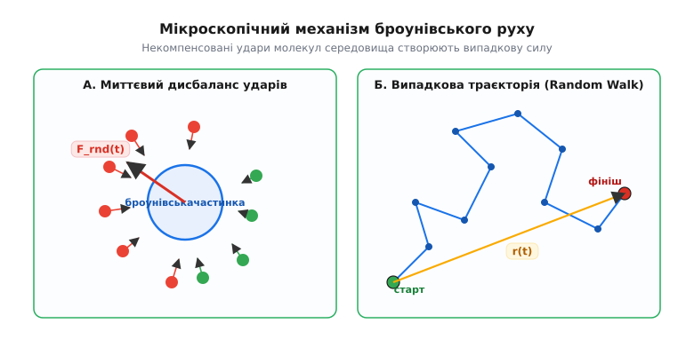
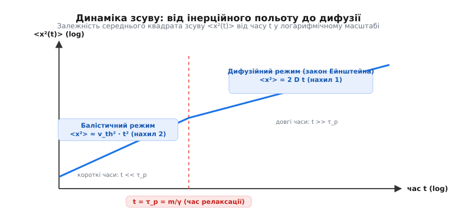
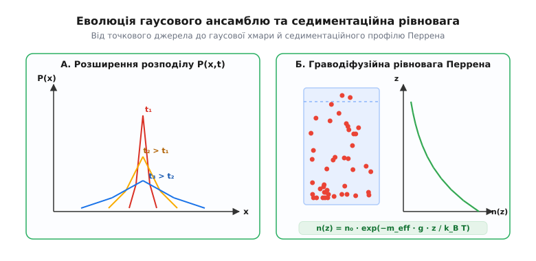

# 📜 Історія броунівського руху: від пилку клавкії до доказу існування атомів

Історія вивчення броунівського руху — це не просто хроніка спостереження за тремтливими частинками під мікроскопом. Це драматичний еволюційний шлях фізики від умоглядних атомістичних гіпотез ХІХ століття до беззаперечного експериментального доказу реального існування молекул та атомів. У центрі цього шляху стоять шотландський ботанік Роберт Броун, три видатні теоретики — Альберт Ейнштейн, Маріан Смолуховський та Поль Ланжевен, а також французький експериментатор Жан Перрен, чиї вимірювання поставили остаточну крапку в багатовіковій суперечці про дискретність матерії.

### Відкриття Роберта Броуна (1827): життя чи фізика?

Улітку 1827 року шотландський ботанік Роберт Броун (*Robert Brown*), досліджуючи під мікроскопом процес запліднення рослини *Clarkia pulchella* (клавкія гожа), помітив дивну поведінку дрібних завислих частинок у воді. Виділені з пилкових зерен мікроскопічні гранули розміром близько 1–2 мікрометрів перебували в стані хаотичного, ніколи не припинюваного тремтіння та зигзагоподібного блукання.

Першою природною гіпотезою Броуна було припущення про біологічну природу явища. У ті часи панувала концепція «життєвої сили» (*vis vitalis*), і Броун припустив, що спостерігає найменші елементарні носії життєвої субстанції. Проте, як справжній дослідник, він одразу поставив контрольний експеримент. Броун повторив спостереження з пилком рослин із гербаріїв, які зберігалися понад століття, а потім із засушеними тканинами мертвих організмів. Траєкторії частинок лишалися однаково шаленими.

Остаточний прорив стався тоді, коли Броун випробував явно неорганічні речовини: подрібнений граніт, кварц, вугільний пил, сажу, скляну пудру та навіть крихітні лусочки з бивнів мамонта й метеоритного заліза. Усі частинки, роздроблені до розміру в кілька мікронів, хаотично танцювали у воді абсолютно однаково. У праці «Стислий опис спостережень під мікроскопом...» (*A brief account of microscopical observations...*, 1828) Броун чесно констатував: цей рух є фундаментальною фізичною властивістю будь-яких дрібних частинок, завислих у рідині чи газі, і не має жодного відношення до життєвих процесів.


*Мікроскопічна картина броунівського блукання: некомпенсовані імпульси молекул середовища змушують колоїдну частинку описувати випадкову траєкторію без переважного напрямку.*

### Півстоліття глухого кута та пошуку пояснень (1830–1900)

Протягом майже п'ятдесяти років після публікації Броуна фізики та хіміки намагалися приписати хаотичний рух побічним ефектам. Висувалися десятки пояснень:
- **Теплова конвекція:** припускали, що локальні перепади температури в краплі створюють конвекційні потоки рідини.
- **Випаровування та освітлення:** вважали, що тепло від променя світла мікроскопа чи випаровування води з країв покривного скла рухає рідину.
- **Електростатичне відштовхування:** припускали, що частинки заряджаються та відштовхуються одна від одної чи від стінок.

Проте серія ретельних дослідів німецьких та французьких фізиків спростувала ці здогади. У 1879–1889 роках французький фізик Жорж Ґуї (*Georges Gouy*) провів систематичні вимірювання і сформулював фундаментальні властивості броунівського руху:
1. Рух є абсолютно безперервним і ніколи не зупиняється (Ґуї спостерігав запаяні ампули з колоїдом протягом місяців у повній темряві й тиші).
2. Він не залежить від зовнішніх струрусів, освітлення чи електромагнітних полів.
3. Рух стає тим шаленішим, чим менший розмір частинки і чим менша в'язкість рідини.
4. Рух посилюється з зростанням температури.

Ґуї та бельгійський єзуїт Ігнас Карбонель (*Ignace Carbonnelle*) першими висунули сміливу ідею: броунівський рух є безпосереднім проявом **теплового руху молекул самої рідини**. Оскільки молекули рідини крихітні й рухаються зі швидкостями в сотні метрів за секунду, вони безперервно ударяють по завислій частинці з усіх боків. Якщо частинка занадто велика (скажімо, 1 міліметр), мільярди ударів з кожного боку ідеально усереднюються, і результуюча сила дорівнює нулю. Але якщо частинка має розмір близько 1 мікрона, поверхня її контакту невелика, і в кожну мить кількість ударів зліва та справа випадково відрізняється на тисячні частки відсотка. Цей мікроскопічний флуктуаційний дисбаланс сил і змушує частинку смикатися.

Попри красиву інтуїцію, наприкінці XIX століття теорія не мала жодного математичного виразу. Видатні фізики-позитивісти того часу — Ернст Мах (*Ernst Mach*) та Вільгельм Оствальд (*Wilhelm Ostwald*) — категорично заперечували існування атомів, вважаючи їх лишень зручною математичною абстракцією, позбавленою фізичної реальності.

### Триумф теорії: Ейнштейн і Смолуховський (1905–1906)

У знаменитий 1905 рік (*Annus Mirabilis*) 26-річний експерт патентного бюро в Берні Альберт Ейнштейн (*Albert Einstein*) опублікував працю «Про рух завислих у спокійній рідині частинок, що вимагається молекулярно-кінетичною теорією тепла» (*Über die von der molekularkinetischen Theorie der Wärme geforderte Bewegung von in ruhenden Flüssigkeiten suspendierten Teilchen*).

Цікаво, що Ейнштейн у вступі до статті чесно зазначив, що, можливо, описуване ним явище збігається з так званим «броунівським рухом», хоча доступні йому дані були надто неточними. Ейнштейн підійшов до проблеми з двох боків — термодинаміки та гідродинаміки:

1. **Осмотичний тиск колоїду:** якщо частинки зависли в рідині, вони підкоряються термодинамічним законам і чинять осмотичний тиск, як і розчинені молекули.
2. **Закон дифузії:** градієнт концентрації частинок викликає дифузійний потік, якому протистоїть в'язке тертя середовища за [законом Стокса](topic:ph-mechanics/viscosity).

Поєднавши ці міркування, Ейнштейн вивів знамените співвідношення для коефіцієнта дифузії `D`:

```
D = (R · T) / (6 · π · η · a · N_A)
```

де `R` — універсальна газова стала, `T` — температура, `η` — в'язкість рідини, `a` — радіус частинки, а `N_A` — **число Авогадро** (кількість молекул у одному молі).

Головна проблема полягала в тому, що миттєву швидкість броунівської частинки виміряти неможливо — її траєкторія є надзвичайно зламаною. Ейнштейн зробив геніальний хід: він вивів закон для **середнього квадрата зсуву** `<x²(t)>` частинки за час `t`:

```
<x²(t)> = 2 · D · t = (R · T · t) / (3 · π · η · a · N_A)
```

Це означало: зсув частинки зростає не пропорційно часу (як при рівномірному русі), а як **корінь із часу** `√t`! І найголовніше: вимірявши під мікроскопом зміщення частинок відомого радіуса `a` за певний час `t`, можна прямо обчислити число Авогадро `N_A` та масу окремого атома!

Незалежно від Ейнштейна в 1906 році видатний польський фізик Маріан Смолуховський (*Marian Smoluchowski*) опублікував власну теорію броунівського руху, використаний ним метод блукань (*random walk*) дав математично тотожні результати.


*Перехід від інерційного польоту на надкоротких часах до дифузійного блукання, описаного Ейнштейном і Смолуховським.*

### Експериментальний доказ Жана Перрена (1908–1912)

Теорія Ейнштейна чекала на експериментальну перевірку. Вона вимагала філігранної точності: треба було виготовити частинки **абсолютно однакового розміру** (монодисперсну суспензію), точно виміряти їхній радіус `a` та відстежити траєкторії сотень частинок під мікроскопом.

Цю гігантську працю виконав французький фізик Жан Перрен (*Jean Baptiste Perrin*) у Сорбонні.

1. **Отримання однакових кульок:** Перрен використав деревну смолу (гумігут) та мастику. Шляхом багаторазового дробового центифугування протягом кількох місяців він одержав емульсії ідеально сферичних крапель однакового радіуса (від 0.1 до 1 мкм).
2. **Вимірювання радіуса:** радіус `a` визначався трьома незалежними способами — прямою лічбою під мікроскопом у рядку, вимірюванням швидкості седиментації за законом Стокса та зважуванням відомої кількості порахованих частинок.
3. **Трекінг траєкторій:** Перрен за допомогою ультрамікроскопа кожні 30 секунд позначав на сітці координати броунівської частинки.


*Дві фундаментальні перевірки Перрена: розпливання гаусової плями дифузії P(x,t) та висотний седиментаційний профіль n(z) колоїду під дією сили тяжіння.*

Перрен випробував формулу Ейнштейна у найрізноманітніших умовах: міняв радіус частинок у десятки разів, в'язкість середовища (додаючи цукор чи ґліцерин), температуру. В усіх випадках значення числа Авогадро `N_A`, обчислене за формулою Ейнштейна, вкладалося у вузький інтервал:

```
N_A ≈ 6.0 × 10²³  моль⁻¹
```

Крім того, Перрен перевірив **седиментаційну рівновагу** колоїду. Під дією сили тяжіння частинки осідають донизу, але броунівський рух прагне рівномірно перемішати їх. У результаті встановлюється граводіфузійна рівновага, аналогічна барометричній формулі для атмосфери Землі:

```
n(z) = n₀ · exp( - m_eff · g · z / (k_B · T) )
```

Вимірявши розподіл кількості частинок `n(z)` по висоті `z` у мікроскопічному шарчику рідини завтовшки всього 0.1 мм, Перрен отримав те саме значення сталої Больцмана `k_B` та числа Авогадро!

### Падіння скептицизму та спадщина

У 1908 році один із найзапекліших противників атомізму, хімік Вільгельм Оствальд, у передмові до нового видання свого підручника загальної хімії публічно визнав поразку:

> *«Я переконався, що ми нещодавно отримали експериментальний доказ дискретної, атомної природи матерії. Затвердження теорії броунівського руху Ейнштейном та Перреном повністю виправдовує зарахування атомістичної гіпотези до рангів обґрунтованої фізичної теорії».*

У 1926 році Жану Перрену було присуджено **Нобелівську премію з фізики** «за роботу з дискретної структури матерії та особливо за відкриття седиментаційної рівноваги».

У 1908 році Поль Ланжевен (*Paul Langevin*) запропонував новий, динамічний підхід — він увів стохастичне диференціальне рівняння з випадковою силою `ξ(t)` (білим шумом). Цей підхід став основою сучасної фізики стохастичних процесів, фінансової математики, теорії фільтрації сигналів та нерівноважної статистичної фізики.

Докладне математичне виведення рівняння Ланжевена та формули Ейнштейна наведено у вставці [Математика броунівського руху](topic:ph-thermodynamics/brownian-motion/math-langevin-einstein.md). Алгоритми симуляції траєкторій розглянуто у вставці [Симуляція броунівського руху](topic:ph-thermodynamics/brownian-motion/proj-brownian-simulation.md), а програмні інтерфейси бібліотек аналізу — у вставці [Інтерфейс бібліотеки симуляції](topic:ph-thermodynamics/brownian-motion/api-simulation-lib.md).
