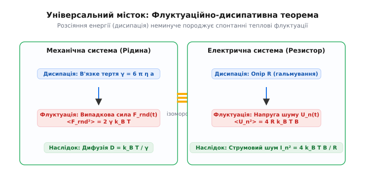

# 🧮 Математика броунівського руху: від рівняння Ланжевена до дифузії

Математичний опис броунівського руху є фундаментальним містком між мікроскопічною динамікою окремих зіткнень та макроскопічною теорією дифузії й термодинаміки. Ця вставка містить суворе виведення рівняння Ланжевена, обчислення часової кореляційної функції швидкостей, розрахунок середнього квадрата зсуву (MSD) у балістичному та дифузійному режимах, а також зв'язок зі стохастичним рівнянням Фоккера—Планка.

### 1. Стохастичне рівняння Ланжевена

Розглянемо броунівську частинку маси `m` та радіуса `a`, яка рухається вздовж осі `x` у в'язкій рідині з коефіцієнтом динамічної в'язкості `η` при абсолютній температурі `T`.

Сумарна сила, що діє на частинку з боку середовища, розкладається на дві компоненти:
1. **Макроскопічна сила в'язкого тертя** `-γ · v(t)`, яка описує середнє гальмування частинки. За законом Стокса коефіцієнт тертя дорівнює `γ = 6 · π · η · a`.
2. **Мікроскопічна флуктуаційна сила** `ξ(t)` (гаусів білий шум), що виникає внаслідок хаотичних некомпенсованих ударів молекул рідини.

Другий закон Ньютона для броунівської частинки має вигляд **рівняння Ланжевена**:

```
m · (dv / dt) = − γ · v(t) + ξ(t)
```

Статистичні властивості випадкової сили `ξ(t)` задаються умовами:

```
<ξ(t)> = 0                                       [нульове середнє значення]
<ξ(t) · ξ(t')> = 2 · γ · k_B · T · δ(t − t')    [дельта-корельований білий шум]
```

де `k_B` — стала Больцмана, `δ(t − t')` — дельта-функція Дірака, а кутові дужки `<…>` означають усереднення по статистичному ансамблю.


*Флуктуаційно-дисипативна теорема: коефіцієнт в'язкого тертя γ прямо визначає амплітуду флуктуаційної сили ξ(t).*

### 2. Часова кореляційна функція швидкостей

Знайдемо, як швидко частинка «забуває» свою початкову швидкість під дією тертя й ударів. Поділивши рівняння Ланжевена на масу `m` та ввівши характерний **час релаксації імпульсу** `τ_p = m / γ`, отримаємо:

```
dv / dt = − (1 / τ_p) · v(t) + (1 / m) · ξ(t)
```

Формальний інтеграл цього лінійного диференціального рівняння з початковою швидкістю `v(0)` дорівнює:

```
v(t) = v(0) · exp(− t / τ_p) + (1 / m) · ∫₀ᵗ exp(− (t − s) / τ_p) · ξ(s) ds
```

Помножимо `v(t)` на `v(0)` та усереднимо по ансамблю. Оскільки випадкова сила в майбутньому `ξ(s)` (`s > 0`) не корелює з початковим станом `v(0)`, другий доданок перетворюється на нуль:

```
<v(t) · v(0)> 
= <v(0)²> · exp(− t / τ_p)                       [усереднення по початковому ансамблю]
= (k_B · T / m) · exp(− t / τ_p)                 [за теоремою про рівнорозподіл: <m v² / 2> = k_B T / 2]
```

Цей результат показує, що автокореляція швидкості згасає експоненціально за час `τ_p = m / γ`.

### 3. Виведення середнього квадрата зсуву (MSD)

Зсув частинки від початкового положення `x(0) = 0` задається інтегралом від швидкості:

```
x(t) = ∫₀ᵗ v(s) ds
```

Квадрат зсуву `x²(t)` дорівнює подвійному інтегралу:

```
x²(t) = ∫₀ᵗ ds₁ ∫₀ᵗ ds₂  v(s₁) · v(s₂)
```

Усереднивши це рівняння по ансамблю та підставивши автокореляційну функцію швидкості `<v(s₁) · v(s₂)> = (k_B · T / m) · exp(− |s₁ − s₂| / τ_p)`, маємо:

```
<x²(t)>
= (k_B · T / m) · ∫₀ᵗ ds₁ ∫₀ᵗ ds₂  exp(− |s₁ − s₂| / τ_p)
= 2 · (k_B · T / m) · ∫₀ᵗ ds₁ ∫₀ˢ¹ ds₂  exp(− (s₁ − s₂) / τ_p)     [симетрія підінтегрального виразу]
= 2 · (k_B · T / m) · τ_p · ∫₀ᵗ (1 − exp(− s₁ / τ_p)) ds₁         [внутрішнє інтегрування по s₂]
= 2 · (k_B · T · τ_p / m) · [ t − τ_p · (1 − exp(− t / τ_p)) ]
```

Підставивши `τ_p = m / γ`, отримуємо **точну формулу Ланжевена для MSD**:

```
<x²(t)> = (2 · k_B · T / γ) · [ t − (m / γ) · (1 − exp(− γ · t / m)) ]
```


*Графік MSD залежно від часу: перелом при t = τ_p відокремлює балістичну поведінку від дифузійної.*

### 4. Граничні режими: балістика проти дифузії

Аналіз отриманого точного виразу у двох граничних часових масштабах відкриває фізичну природу процесу:

#### А. Короткі часи (`t << τ_p`): Балістичний режим

Розкладемо експоненту в ряд Тейлора `exp(− t / τ_p) ≈ 1 − (t / τ_p) + (t² / 2 τ_p²)`:

```
<x²(t)>
≈ (2 · k_B · T / γ) · [ t − τ_p · (1 − (1 − t / τ_p + t² / (2 · τ_p²))) ]
= (2 · k_B · T / γ) · [ t − τ_p · (t / τ_p − t² / (2 · τ_p²)) ]
= (2 · k_B · T / γ) · (t² / (2 · τ_p))
= (k_B · T / m) · t²
= v_th² · t²
```

де `v_th = √(k_B T / m)` — середня теплова швидкість частинки.

На надкоротких часах (`t << τ_p`) частинка ще не встигає зазнати значної кількості зіткнень і рухається за інерцією **балістично** — зсув зростає пропорційно часу `x ∝ t`, а `MSD ∝ t²`.

#### Б. Довгі часи (`t >> τ_p`): Дифузійний режим (закон Ейнштейна)

На довгих часах (`t >> τ_p`) згасаюча експонента `exp(− t / τ_p) → 0`, а доданок `τ_p` стає нехтовно малим порівняно з `t`:

```
<x²(t)> ≈ (2 · k_B · T / γ) · t = 2 · D · t
```

де коефіцієнт дифузії `D` виражається через коефіцієнт тертя `γ`:

```
D = (k_B · T) / γ
```

Підставивши закон Стокса `γ = 6 · π · η · a`, отримуємо знамените **співвідношення Ейнштейна—Смолуховського**:

```
D = (k_B · T) / (6 · π · η · a)
```

У трьох вимірах (3D) рух по трьох незалежних осях `x, y, z` додається, тому тривимірний середній квадрат зсуву дорівнює:

```
<r²(t)> = <x²(t)> + <y²(t)> + <z²(t)> = 6 · D · t
```

### 5. Зв'язок із рівнянням дифузії та Фоккера—Планка

Ансамбль багатьох броунівських частинок описується густиною ймовірності `P(x, t)` знаходження частинки в точці `x` у момент часу `t`.

Рівняння Фоккера—Планка для густини ймовірності у разі відсутності зовнішнього потенціалу перетворюється на класичне **параболічне рівняння дифузії**:

```
(∂P / ∂t) = D · (∂²P / ∂x²)
```

Якщо в початковий момент часу `t = 0` усі частинки знаходилися в точці `x = 0` (початкова умова `P(x, 0) = δ(x)`), фундаментальним розв'язком є **розподіл Ґаусса**:

```
P(x, t) = (1 / √(4 · π · D · t)) · exp( − x² / (4 · D · t) )
```

Звідси прямим інтегруванням легко перевірити статистичні моменти:

```
<x(t)> = ∫₋∞⁺∞ x · P(x, t) dx = 0                  [нульове середнє зміщення]
<x²(t)> = ∫₋∞⁺∞ x² · P(x, t) dx = 2 · D · t       [дисперсія розпливання гаусової плями]
```

Це доводить, що мікроскопічна стохастична динаміка Ланжевена для окремої частинки є математично еквівалентною макроскопічному рівнянню дифузії для усієї хмари частинок.

---

### 6. Виведення рівняння Фоккера—Планка з розкладу Крамерса—Мояла

Щоб суворо довести еквівалентність стохастичного рівняння Ланжевена та неперервного диференціального рівняння для густини ймовірності `P(x, t)`, застосуємо розклад Крамерса—Мояла.

Нехай `W(x, Δx)` — ймовірність того, що частинка з точки `x` за маленький інтервал часу `Δt` переміститься на відстань `Δx`. Умова нормування задається як `∫ W(x, Δx) d(Δx) = 1`.

Густина ймовірності у момент часу `t + Δt` виражається через інтеграл Смолуховського:

```
P(x, t + Δt) = ∫ P(x − Δx, t) · W(x − Δx, Δx) d(Δx)
```

Розкладемо підінтегральний вираз у ряд Тейлора по ступенях `Δx` в околі точки `x`:

```
P(x − Δx, t) · W(x − Δx, Δx)
= P(x, t) · W(x, Δx)
  − (∂ / ∂x) [ P(x, t) · W(x, Δx) ] · Δx
  + (1 / 2) · (∂² / ∂x²) [ P(x, t) · W(x, Δx) ] · (Δx)² + O(Δx³)
```

Підставивши цей розклад в інтеграл та поділивши на `Δt`, отримуємо загальне **рівняння Крамерса—Мояла**:

```
(∂P / ∂t) = − (∂ / ∂x) [ A(x) · P(x, t) ] + (1 / 2) · (∂² / ∂x²) [ B(x) · P(x, t) ]
```

де моменти стрибків визначаються як:

```
A(x) = lim ( <Δx> / Δt )             [коефіцієнт зсуву чи дрейфу]
B(x) = lim ( <(Δx)²> / Δt )         [коефіцієнт дифузії]
```

Для випаду вільного броунівського руху у перевизначеному режимі стохастичний приріст дорівнює `Δx = √(2 D Δt) · N(0, 1)`. Усереднюючи по нормальному розподілу, маємо:

```
<Δx> = 0                        [звідси A(x) = 0]
<(Δx)²> = 2 · D · Δt           [звідси B(x) = 2 D]
```

Підставивши ці моменти у рівняння Крамерса—Мояла, ми точно одержуємо класичне **рівняння дифузії**:

```
(∂P / ∂t) = D · (∂²P / ∂x²)
```

---

### 7. Спектральна густина швидкості та теорема Вінера—Хінчина

За теоремою Вінера—Хінчина, спектральна густина потужності `S_v(f)` стохастичного процесу швидкості `v(t)` виражається через фур'є-перетворення від її автокореляційної функції `<v(t) v(0)>`:

```
S_v(f) = 2 · ∫₋∞⁺∞ <v(t) · v(0)> · exp(− i · 2 · π · f · t) dt
```

Підставивши експоненціальний автокорелятор швидкості Ланжевена `<v(t) v(0)> = (k_B T / m) · exp(− |t| / τ_p)`, виконуємо інтегрування:

```
S_v(f) = 2 · (k_B · T / m) · ∫₋∞⁺∞ exp(− |t| / τ_p) · cos(2 · π · f · t) dt
       = 4 · (k_B · T / m) · [ τ_p / (1 + (2 · π · f · τ_p)²) ]
```

Підставивши `τ_p = m / γ`, маємо лоренцівський спектр швидкості:

```
S_v(f) = (4 · k_B · T / γ) / ( 1 + (2 · π · f · m / γ)² )
```

На низьких частотах (`f << γ / (2 π m)`), коли інерція не відіграє ролі, спектральна густина швидкості стає строго плоскою («білою»):

```
S_v(0) = 4 · k_B · T / γ = 4 · D
```

Це доводить, що низькочастотна спектральна густина швидкості броунівської частинки прямо дорівнює потрійному (або потрійному залежно від нормування) коефіцієнту дифузії `4 D`.

Практичну симуляцію цих рівнянь розібрано у вставці [Симуляція броунівського руху](topic:ph-thermodynamics/brownian-motion/proj-brownian-simulation.md), а готові C/C++ структури даних для аналізу траєкторій — у вставці [Інтерфейс бібліотеки симуляції](topic:ph-thermodynamics/brownian-motion/api-simulation-lib.md).

