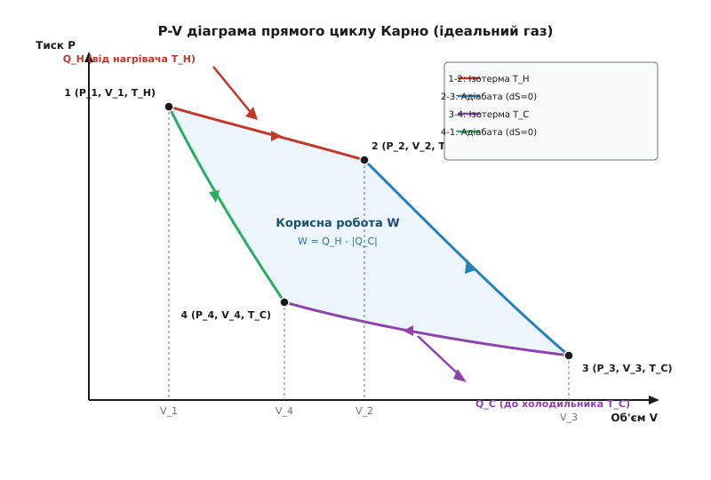
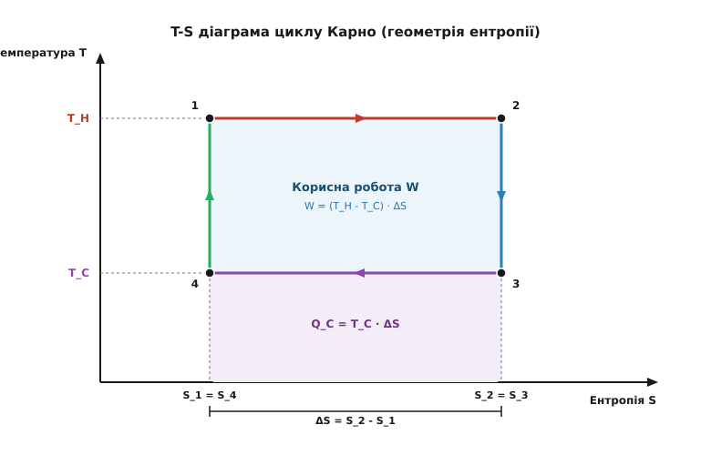
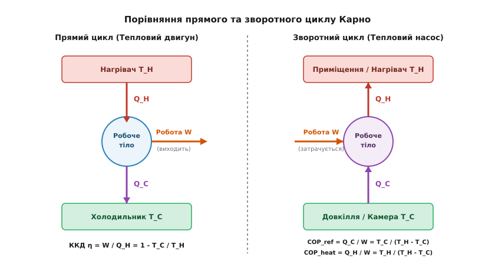

# Цикл Карно та граничний ККД теплових машин

<preknowlist>
- [Перший закон термодинаміки](topic:ph-thermodynamics/first-law-thermodynamics) — збереження енергії, зв'язок між теплотою, внутрішньою енергією та роботою (`dQ = dU + dW`).
- [Рівняння стану ідеального газу](topic:physics/thermodynamics/ideal-gas) — закон Клапейрона-Менделєєва `PV = nRT` та ізопроцеси (ізотермічний, адіабатичний).
- [Другий закон термодинаміки та ентропія](topic:math-information/entropy) — незворотність теплових процесів і визначення ентропії `dS = dQ / T`.
</preknowlist>

У перші десятиліття XIX століття найдосконаліші парові машини Томаса Ньюкомена та Джеймса Ватта витрачали тонни вугілля, перетворюючи на корисну механічну роботу менш ніж 3% виділеного тепла. Інженери шукали проблему у терті поршнів, витіканні пари через зазори циліндрів або невдалій конструкції парових котлів, переконанні, що після усунення цих дефектів коефіцієнт корисної дії (ККД) можна буде наблизити до ста відсотків. Однак неможливість повної конверсії тепла в роботу виявилася не інженерною недоробкою, а фундаментальним обмеженням природи.

## Неможливість монотермічного двигуна та потреба двох джерел

Будь-який тепловий двигун за своєю фізичною суттю є періодичним пристроєм. Його робоче тіло (газ, пара чи рідина) виконує розширення, зміщуючи поршень або обертаючи лопатки турбіни, після чого мусить повернутися у вичатковий термодинамічний стан, щоб розпочати наступний робочий цикл. Оскільки внутрішня енергія `U` є функцією стану системи, її повна зміна за один замкнений цикл тотожно дорівнює нулю (`ΔU = 0`). З Першого закону термодинаміки випливає, що сумарна виконана корисна робота `W` за цикл дорівнює результуючій кількості підведеного та відведеного тепла `Q_net`:

```
W = Q_net = Q_H - |Q_C|
```

Де `Q_H` — теплота, отримана від гарячого тіла (нагрівача), а `Q_C` — теплота, віддана холодному тілу (холодильнику).

Якби робоче тіло контактувало лише з одним джерелом тепла при постійній температурі `T_H` (так званий монотермічний двигун), то для повернення в початковий стан при стисканні довелося б виконати над газом точнісінько таку саму роботу, яка була отримана при його розширенні. Повна корисна робота за цикл дорівнювала б нулю.

З мікроскопічної точки зору кінетичної теорії газів цей механізм стає очевидним. Під час розширення хаотично рухомі молекули газу содаряються з поршнем, що віддаляється, і віддають йому частину своєї кінетичної енергії. Газ виконує роботу і охолоджується. Якщо ж стискати газ при тій самій високій температурі, то поршень, що рухається назустріч молекулам, передаватиме їм енергію під час зіткнень. Щоб стиснути газ із меншими витратами механічної роботи, ніж було отримано при його розширенні, стискання необхідно проводити при нижчому тиску, а отже — при нижчій температурі `T_C`, коли середня швидкість молекул є меншою.

Звідси випливає фундаментальний висновок, сформульований Вільямом Томсоном (лордом Кельвіном) та Максом Планком: **жоден тепловий двигун не може працювати за наявності лише одного термостата**. Скидання частини енергії `|Q_C|` в охолоджувач із нижчою температурою є неминучою платою за можливість замкнути коловий процес і змусити систему працювати періодично.

Історичну еволюцію уявлень про теплові машини від парові котлів XIX століття до узагальнення фізичних законів висвітлено в [історичному нарисі](topic:ph-thermodynamics/carnot-cycle/hist-carnot.md).

## Чотири такти циклу Карно

Французький інженер Саді Карно поставив перед собою завдання: знайти таку послідовність процесів, яка забезпечує максимально можливе перетворення тепла в роботу при заданих температурах нагрівача `T_H` та холодильника `T_C`.

Будь-який контакт двох тіл із різними температурами супроводжується незворотним теплообміном: теплота самочинно перетікає від гарячого до холодного без виконання корисної роботи, породжуючи втрату ефективності. Щоб цикл був повністю оборотним (ідеально досконалим), теплообмін із нагрівачем мусить відбуватися строго при температурі нагрівача `T_H`, а теплообмін із холодильником — строго при температурі холодильника `T_C`. Зміна ж температури робочого тіла від `T_H` до `T_C` та навпаки має здійснюватися без обміну теплом із довкіллям.

Цим вимогам відповідає єдиний коловий процес — **цикл Карно**, що складається з чотирьох послідовних тактів: двох ізотермічних (від грец. *isos* — рівний, *therme* — тепло) та двох адіабатичних (від грец. *adiabatos* — неперехідний).


*P-V діаграма прямого циклу Карно: розширення на ізотермі T_H та адіабаті, стискання на ізотермі T_C та адіабаті. Площа всередині контуру — корисна робота W.*

Детально простежимо мікроскопічний та термодинамічний механізм кожного з чотирьох тактів:

### Такт 1 → 2: Ізотермічне розширення (при температурі T_H)
Робоче тіло наводиться у тепловий контакт із нагрівачем, що має незмінну температуру `T_H`. Газ повільно розширюється від об'єму `V_1` до `V_2`, штовхаючи поршень і виконуючи корисну роботу проти зовнішніх сил. Під час розширення молекули газу віддають свою кінетичну енергію поршню, що мало б призвести до охолодження. Проте завдяки тепловому контакту від нагрівача безперервно надходить кількість теплоти `Q_H`. Для ідеального газу внутрішня енергія залежить лише від температури (`ΔU = 0`), тому вся отримана теплота повністю перетворюється на роботу розширення:

```
Q_H = W_12 = n · R · T_H · ln(V_2 / V_1)
```

### Такт 2 → 3: Адіабатичне розширення (від T_H до T_C)
У точці 2 робоче тіло повністю теплоізолюється від зовнішнього середовища (`dQ = 0`). Газ продовжує розширюватися за інерцією від об'єму `V_2` до `V_3`, виконуючи роботу проти зовнішніх сил виключно за рахунок внутрішнього запасу енергії. Молекули газу втрачають середню кінетичну швидкість, і в результаті газ охолоджується від температури нагрівача `T_H` до температури холодильника `T_C`. Процес є оборотним і ізоентропійним (`dS = 0`).

### Такт 3 → 4: Ізотермічне стискання (при температурі T_C)
У точці 3 робоче тіло наводиться у тепловий контакт із холодильником, що має постійну температуру `T_C`. Зовнішні сили стискають газ від об'єму `V_3` до об'єму `V_4`. При стисканні зовнішній поршень передає кінетичну енергію молекулам газу. Щоб температура газу не зростала і залишалася строго рівною `T_C`, уся виділена при стисканні теплота `|Q_C|` безперешкодно відводиться до холодильника:

```
|Q_C| = W_34 = n · R · T_C · ln(V_3 / V_4)
```

### Такт 4 → 1: Адіабатичне стискання (від T_C до T_H)
У точці 4 робоче тіло знову повністю теплоізолюється (`dQ = 0`). Зовнішні сили стискають газ від об'єму `V_4` до початкового об'єму `V_1`. Виконана над газом механічна робота витрачається на збільшення його внутрішньої енергії: молекули прискорюються від ударів об поршень, і газ нагрівається від `T_C` назад до початкової температури `T_H`. Система повертається у стан `1`, і цикл замикається.

## Граничний ККД та теореми Карно

Коефіцієнт корисної дії (ККД) будь-якого теплового двигуна `η` вимірюється як частка підведеного тепла `Q_H`, яка перетворилася на корисну механічну роботу `W`:

```
η = W / Q_H = (Q_H - |Q_C|) / Q_H = 1 - |Q_C| / Q_H
```

Математичний аналіз чотирьох тактів доводить, що з рівнянь адіабат випливає строга рівність співвідношень об'ємів при ізотермічному розширенні та стисканні: `V_2 / V_1 = V_3 / V_4`. Завдяки цьому відношення відданої теплоти `|Q_C|` до отриманої `Q_H` спрощується до відношення їхніх абсолютних температур:

```
|Q_C| / Q_H = T_C / T_H
```

Підставивши це значення у вираз для ККД, отримуємо знамениту формулу **граничного ККД Карно**:

```
η_Carnot = 1 - T_C / T_H = (T_H - T_C) / T_H
```

Детальне алгебраїчне виведення цієї формули та доведення її чинності для довільних робочих речовин подано у [математичному аналізі](topic:ph-thermodynamics/carnot-cycle/math-efficiency.md).

З цієї формули випливають фундаментальні **теореми Карно**:

1. **Перша теорема Карно:** ККД будь-якої оборотної теплової машини, що працює між двома термостатами з температурами `T_H` та `T_C`, не залежить від конструкції машини чи природи робочої речовини і визначається виключно температурами нагрівача та холодильника. Це означає, що ідеальний газ, пара, парамагнітна сіль, електронний газ у напівпровіднику чи фотонний газ випромінювання у циклі Карно дадуть точнісінько одинаковий ККД.
2. **Друга теорема Карно:** ККД будь-якої незворотної теплової машини завжди строго менший за ККД оборотної машини Карно, що працює між тими самими джерелами тепла (`η_unrev < η_Carnot`).

Важливо підкреслити, що досягнення 100% ККД (`η = 1`) вимагало б або нескінченно високої температури нагрівача (`T_H → ∞`), або досягнення абсолютного нуля температур у холодильнику (`T_C = 0 К`). Проте згідно з Третім законом термодинаміки (теорема Нернста), абсолютний нуль є принципово недосяжним у жодному скінченному процесі. Отже, перетворення всієї теплоти в роботу без залишку є фізично неможливим.

> 🔧 **Навіщо це.**
> Гранична формула Карно `η = 1 - T_C / T_H` дає інженерам та енергетикам абсолютний критерій оцінки досконалості будь-яких теплових установок. Вона показує, що для підвищення ефективності електростанції чи двигуна існує лише два фундаментальних шляхи: підвищувати температуру нагрівача `T_H` (наприклад, застосовуючи жароміцні керамічні лопатки у газових турбінах при 1500 °C) або знижувати температуру холодильника `T_C` (використовуючи холодну морську чи річкову воду в конденсаторах парових турбін). Порівняння реального ККД установки із граничним ККД Карно дає так званий **ексергетичний ККД** (або ККД за Другим законом `η_II = η_real / η_Carnot`), який показує, яку частку фундаментально можливої енергії втрачено через тертя та незворотний теплообмін.

## Ентропійне трактування та діаграма T-S

Глибокий фізичний зміст циклу Карно розкривається при переході до змінних температура–ентропія (`T-S` площина). Оскільки ентропія (від грец. *en* — в, всередині, *trope* — перетворення) визначається диференціалом `dS = dQ_rev / T`, ізотермічні процеси на `T-S` діаграмі зображуються горизонтальними відрізками, а адіабатичні (ізоентропійні, `dS = 0`) — вертикальними відрізками.


*T-S діаграма циклу Карно: геометрія прямокутника зі сторонами ΔS та (T_H - T_C). Площа прямокутника розкриває корисну роботу W.*

У координатах `T-S` цикл Карно набуває виключно простої геометричної форми — **прямокутника**:

- Підведена теплота `Q_H` дорівнює площі прямокутника під верхньою ізотермою `T_H`: `Q_H = T_H · (S_2 - S_1)`.
- Відведена теплота `|Q_C|` дорівнює площі прямокутника під нижньою ізотермою `T_C`: `|Q_C| = T_C · (S_2 - S_1)`.
- Корисна робота `W` дорівнює площі самого прямокутника циклу: `W = Q_H - |Q_C| = (T_H - T_C) · (S_2 - S_1)`.

Геометрично ККД якраз і являє собою відношення площі прямокутника циклу `W` до всієї площі під верхньою лінією `Q_H`. Видно, що єдиний спосіб зробити ККД рівним 100% (тобто зайняти всю площу) — це опустити температуру холодильника до абсолютного нуля (`T_C = 0 К`), що є неможливим.

Аналіз ентропійного балансу підтверджує: у строго оборотному циклі Карно сумарна зміна ентропії замкненої системи «робоче тіло + нагрівач + холодильник» дорівнює нулю:

```
ΔS_universe = - Q_H / T_H + |Q_C| / T_C = - ΔS + ΔS = 0
```

У будь-якому реальному незворотному двигуні частина енергії дисипується через тертя, в'язкість газу, вихори та скінченний перепад температур при теплопередачі (`ΔT > 0`). Це викликає генерацію ентропії `ΔS_gen > 0`, яка веде до втрати працездатності системи (знищення ексергії): `X_destroyed = T_0 · ΔS_gen`.

Аналітичне доведення нерівності Клаузіуса `∮ (dQ / T) ≤ 0` для довільних циклів подано у [математичній вставці](topic:ph-thermodynamics/carnot-cycle/math-efficiency.md).

## Зворотний цикл Карно: холодильники та теплові насоси

Оскільки всі чотири такти циклу Карно є повністю оборотними, процес можна запустити у зворотному напрямку ($1 \leftarrow 4 \leftarrow 3 \leftarrow 2 \leftarrow 1$).

При зворотному обході зовнішнє джерело виконує над робочим тілом механічну роботу `W`. За рахунок цієї роботи система забирає кількість теплоти `Q_C` від холодного тіла `T_C` і передає більшу кількість теплоти `Q_H = Q_C + W` гарячому тілу `T_H`.


*Енергетичні потоки в прямому циклі Карно (тепловий двигун) та зворотному циклі (холодильна машина й тепловий насос).*

Зворотний цикл Карно покладено в основу двох типів термодинамічних пристроїв:

1. **Холодильна машина та кондиціонер:** Метою є охолодження внутрішнього об'єму (видалення `Q_C` при температурі `T_C`). Ефективність вимірюється **холодильним коефіцієнтом** (COP — *Coefficient of Performance*):

```
COP_ref = Q_C / W = T_C / (T_H - T_C)
```

2. **Тепловий насос:** Метою є обігрів приміщення (передача `Q_H` при температурі `T_H` за рахунок забрання тепла з довкілля при `T_C`). Ефективність вимірюється **опалювальним коефіцієнтом**:

```
COP_heat = Q_H / W = T_H / (T_H - T_C) = COP_ref + 1
```

Опалювальний коефіцієнт теплового насоса завжди строго перевищує одиницю. Це означає, що витративши 1 кВт·год електроенергії на привід компресора в ідеальному циклі при `T_H = 20 °C` (293 К) та `T_C = 0 °C` (273 К), можна передати у приміщення `COP_heat = 293 / (293 - 273) ≈ 14.65` кВт·год тепла! Навіть у реальних інверторних теплових насосах із урахуванням втрат `COP_heat` становить 3.5–4.5, що робить їх у кілька разів вигіднішими за прямий електрообігрів.

## Чому реальні двигуни відступають від циклу Карно

Попри те, що цикл Карно є теоретично найдосконалішим, жоден реальний серійний двигун внутрішнього чи зовнішнього згоряння не працює строго за цим циклом. На це є дві фундаментальні інженерні причини:

1. **Нескінченна повільність ізотермічних тактів:** Для того щоб підведення тепла `Q_H` відбувалося строго при `T = const`, різниця температур між нагрівачем і газом має бути нескінченно малою (`dT → 0`). Однак швидкість теплопередачі пропорційна цій різниці температур. При `dT → 0` час виконання одного ізотермічного такту прямує до нескінченності, а механічна потужність двигуна (`P = W / t`) прямує до нуля.
2. **Низька питома потужність та гігантські розміри:** Адіабатичні такти вимагають величезних ступенів розширення об'єму (значні перепади тиску та об'єму). Індикаторна діаграма циклу Карно є дуже «вузькою». Для отримання відчутної роботи `W` поршень мусить мати гігантський робочий об'єм, що робить двигун непомірковано важким, громіздким та дорогим на одиницю маси.

У термодинаміці скінченного часу (модель Курзона–Альборна) доведено, що максимальна потужність теплового двигуна досягається при ККД, меншому за ККД Карно:

```
η_CA = 1 - √(T_C / T_H)
```

### Порівняльний аналіз термодинамічних циклів

У реальній техніці застосовують інші колові процеси, які поступаються Карно за теоретичним ККД, але забезпечують високу питому потужність:

| Термодинамічний цикл | Область застосування | Підведення тепла | Відведення тепла | Обличчя циклу проти Карно |
| :--- | :--- | :--- | :--- | :--- |
| **Цикл Карно** | Теоретичний бенчмарк | Ізотерма (`T = const`) | Ізотерма (`T = const`) | Максимальний ККД, але нульова потужність при квазістатичності |
| **Цикл Отто** | Бензинові ДВЗ | Ізохора (`V = const`) | Ізохора (`V = const`) | Висока частота обертів, обмежений детонацією палива |
| **Цикл Дизеля** | Дизельні двигуни | Ізобара (`P = const`) | Ізохора (`V = const`) | Вищий ступінь стискання, краща економічність на високому навантаженні |
| **Цикл Брайтона** | Газові турбіни, авіація | Ізобара (`P = const`) | Ізобара (`P = const`) | Безперервний потік, висока питома потужність на одиницю маси |
| **Цикл Ренкіна** | Парові турбіни ТЕС та АЕС | Ізобара (випаровування) | Ізобара (конденсація) | Використання фазового переходу піднімає середню температуру підведення |
| **Цикл Стірлінга** | Двигуни зовнішнього згорання | Ізотерма + регенерація | Ізотерма + регенерація | Теоретично досягає ККД Карно за наявності ідеального регенератора |

Математичне моделювання та чисельний розрахунок усіх характеристик циклу Карно мовами Python та C++ наведено у [практичній вставці](topic:ph-thermodynamics/carnot-cycle/proj-carnot-sim.md).
