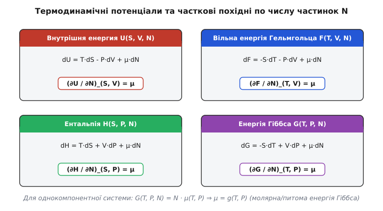
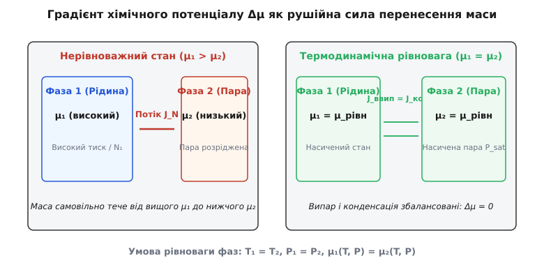
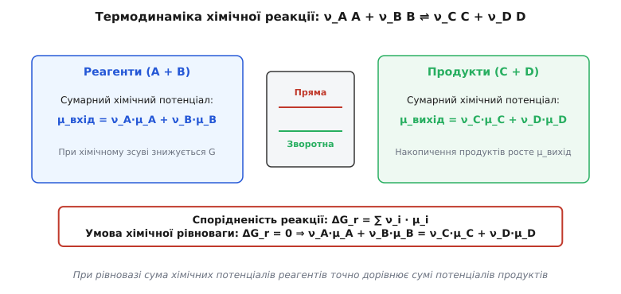
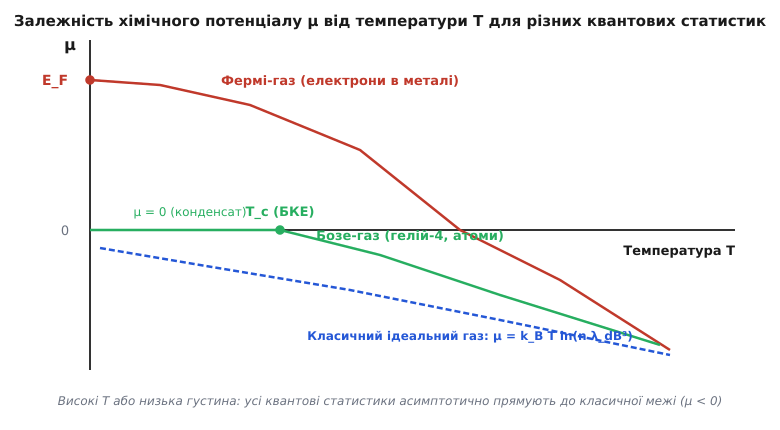

# Хімічний потенціал

<preknowlist>
- [Рівняння стану ідеального газу](topic:ph-thermodynamics/ideal-gas-law) — зв'язок макроскопічних параметрів тиску, об'єму та температури.
- [Больцманівський фактор і масштаб kT](topic:ph-thermodynamics/boltzmann-factor) — ймовірність заселення енергетичних станів у тепловій рівновазі.
- [Число Кнудсена](topic:ph-mechanics/knudsen-number) — критерій суцільності середовища та довжини вільного пробігу частинок.
- [Динамічний тиск](topic:ph-mechanics/dynamic-pressure) — зв'язок швидкісного напору та енергії потоку.
</preknowlist>

Коли напівпровідникові пластини `p`-типу та `n`-типу приводять у контакт при виготовленні діода, електрони з області високої концентрації миттєво починають дифундувати в область, де їх майже немає. Цей потік носіїв заряду зупиняється не тоді, коли вирівнюються концентрації електронів з обох боків (вони лишаються відмінними на шість порядків), і не тоді, коли тиск електронного газу стає однаковим, а тоді, коли на межі контакту формується внутрішнє електричне поле такої напруженості, що середня вільна енергія, яка припадає на один електрон, стає строго однаковою по всій об'ємній структурі. Точно так само крапля води у відкритій склянці випаровується у повітря доти, доки енергія переходу однієї молекули з рідкої фази в газову не стане дорівнювати нулю. В усіх термодинамічних системах, де змінюється кількість частинок — при фазових переходах, дифузії, хімічних реакціях, розчиненні кристалів або роботі акумуляторів — напрямок і межу самовільного перенесення маси визначає не концентрація і не густина середовища, а фундаментальний термодинамічний потенціал, що припадає на одну частинку: хімічний потенціал.

Термін «хімічний потенціал» (від латинського *potentialis* — сила, можливість, та грецького *χημεία* — хімія) був уведений у термодинаміку видатним американським фізиком-теоретиком Джозаєю Віллардом Гіббсом у 1875 році для опису систем із змінною кількістю речовини. Як температура є інтенсивною мірою теплового руху і визначає напрямок самовільного теплообміну, а тиск визначає напрямок механічного розширення середовища, так хімічний потенціал є інтенсивною мірою «хімічної прагнення» або прагнення частинок залишити дану фазу чи енергетичний стан.

---

### Параметри стану та виникаюча сила перенесення маси

Для опису термодинамічної системи в стані рівноваги використовують фундаментальні макроскопічні параметри. Закони термодинаміки виявляють чітку дуальність між екстенсивними величинами (які пропорційні розміру або масі системи) та інтенсивними величинами (які не залежать від об'єму і вирівнюються при контакті):

- Зміни внутрішньої енергії за рахунок теплообміну пов'язані з екстенсивною величиною **ентропією (`S`)**, а інтенсивною сопряженою змінною є **абсолютна температура (`T`)**: `dQ_рівн = T · dS`.
- Зміни енергії за рахунок механічної роботи пов'язані з екстенсивним **об'ємом (`V`)**, а інтенсивною сопряженою змінною є **тиск (`P`)**: `dW_мех = -P · dV`.
- Зміни енергії за рахунок перенесення речовини або хімічних перетворень пов'язані з екстенсивною **кількістю частинок (`N`)** або числом молей (`n`), а інтенсивною сопряженою змінною є **хімічний потенціал (`μ`)**: `dW_хім = μ · dN`.

Якщо дві ізольовані термодинамічні системи з різними параметрами приводять у тепловий, механічний та дифузійний контакт через напівпроникну перегородку, самовільний процес перерозподілу енергії, об'єму та маси триватиме доти, доки не виконаються три умови термодинамічної рівноваги:

```
Т_1 = Т_2          [термічна рівновага: відсутність потоку теплоти]
P_1 = P_2          [механічна рівновага: відсутність руху перегородки]
μ_1 = μ_2          [дифузійна/хімічна рівновага: відсутність результуючого потоку частинок]
```

Якщо `μ_1 > μ_2`, частинки самовільно переходитимуть із першої системи в другу. При цьому середня вільна енергія всієї складеної системи зменшується, а загальна ентропія зростає. Градієнт хімічного потенціалу `∇μ` виступає обобщеною термодинамічною силою, яка викликає дифузійний потік речовини `J_N`. У лінійній нерівноважній термодинаміці Онсагера потік частинок прямо пропорційний градієнту хімічного потенціалу:

```
J_N = -L · ∇μ
```

де `L` — кінетичний коефіцієнт Онсагера. Оскільки для розведених розчинів зміна хімічного потенціалу пов'язана з концентрацією `c` як `dμ = k_B · T · d(ln c) = (k_B · T / c) · dc`, це співвідношення безпосередньо переходить у класичний перший закон дифузії Фіка `J_N = -D · ∇c`, де коефіцієнт дифузії `D = L · k_B · T / c`.

#### Термодинамічні перехресні ефекти та термодифузія

У складних нерівноважних середовищах градієнт хімічного потенціалу пов'язаний не лише з перенесенням маси, а й створює перехресні кінетичні явища. Якщо в системі одночасно присутні градієнт температури `∇T` та градієнт хімічного потенціалу `∇μ`, повний потік частинок `J_N` та потік теплоти `J_q` згідно із співвідношеннями взаємності Онсагера описуються макроскопічною матрицею переносу:

```
J_N = -L_11 · ∇(μ/T) + L_12 · ∇(1/T)
J_q = -L_21 · ∇(μ/T) + L_22 · ∇(1/T)
```

Завдяки мікроскопічній оборотності часових траєкторій частинок феноменологічні коефіцієнти Онсагера є симетричними: `L_12 = L_21`. Це перехресне явище породжує **ефект Соре (термодифузію)** — савільну вимушену дифузію частинок у градієнті температур під дією виникаючого перепаду хімічного потенціалу, а також зворотний **ефект Дюфура** — виникнення теплового потоку під дією pure градієнта хімічного потенціалу.

---

### Термодинамічне визначення хімічного потенціалу

У термодинаміці стан системи з багатьма компонентами описується через термодинамічні потенціали — скалярні функції стану, залежно від того, які саме параметри підтримуються сталими в експерименті. Оскільки додавання частинок `dN` змінює енергію системи при будь-якому способі фіксації умов, хімічний потенціал компонента `i` може бути строго визначений через часткову похідну від будь-якого з чотирьох основних термодинамічних потенціалів.


*Схема зв'язку хімічного потенціалу μ з чотирма фундаментальними термодинамічними потенціалами U, F, G, H через часткові похідні за кількістю частинок N при відповідних природних змінних.*

#### 1. Внутрішня енергія `U(S, V, N)`
Внутрішня енергія є природною функцією ентропії `S`, об'єму `V` та кількостей частинок `N_i`. Повний диференціал `U` для багатокомпонентної системи має вигляд:

```
dU = T·dS - P·dV + ∑ μ_i · dN_i
```

Звідси часткова похідна визначення хімічного потенціалу при сталій ентропії та сталому об'ємі дорівнює:

```
μ_i = (∂U / ∂N_i)_(S, V, N_j≠i)          [прирост внутрішньої енергії при додаванні 1 частинки]
```

#### 2. Вільна енергія Гельмгольца `F(T, V, N)`
Вільна енергія Гельмгольца `F = U - T·S` утворюється перетворенням Лежандра від внутрішньої енергії `U` по зміній `S`. Вона є зручною функцією для ізохорно-ізотермічних процесів (сталі `T` та `V`). Її диференціал дорівнює:

```
dF = -S·dT - P·dV + ∑ μ_i · dN_i
```

Отже, хімічний потенціал дорівнює зміні вільної енергії Гельмгольца при додаванні частинки в ізохорно-ізотермічному процесі:

```
μ_i = (∂F / ∂N_i)_(T, V, N_j≠i)
```

#### 3. Енергія Гіббса `G(T, P, N)`
Енергія Гіббса `G = U - T·S + P·V = F + P·V` утворюється подвійним перетворенням Лежандра і є головним потенціалом для більшості лабораторних та промислових процесів, які перебігають при фіксованій температурі та сталому атмосферному тиску (ізобарно-ізотермічні умови). Її диференціал має вигляд:

```
dG = -S·dT + V·dP + ∑ μ_i · dN_i
```

Звідси хімічний потенціал дорівнює частковій молярній енергії Гіббса:

```
μ_i = (∂G / ∂N_i)_(T, P, N_j≠i)
```

#### 4. Ентальпія `H(S, P, N)`
Ентальпія `H = U + P·V` використовується при описі процесів при сталому тиску та ентропії (наприклад, адіабатичне протікання газів). Її диференціал та часткова похідна дорівнюють:

```
dH = T·dS + V·dP + ∑ μ_i · dN_i
μ_i = (∂H / ∂N_i)_(S, P, N_j≠i)
```

#### Парціальні молярні величини та вирази Максвелла

Для розчинів та багатокомпонентних сумішей макроскопічний об'єм `V` чи макроскопічна ентальпія `H` не дорівнюють простому добутку молярних об'ємів чистих компонентів через міжмолекулярну взаємодію. У зв'язку з цим вводять поняття **парціальної молярної величини** `X_i⁻` для будь-якої розширеної функції `X`:

```
X_i⁻ = (∂X / ∂N_i)_(T, P, N_j≠i)
```

Хімічний потенціал `μ_i` є не що інше, як парціальна молярна енергія Гіббса `G_i⁻`. Диференціюючи диференціал `dG = -S·dT + V·dP + ∑ μ_i · dN_i` та застосовуючи теорему Клеро про рівність мішаних похідних, отримуємо нові **співвідношення Максвелла для хімічного потенціалу**:

```
(∂μ_i / ∂P)_(T, {N}) = (∂V / ∂N_i)_(T, P, N_j≠i) = V_i⁻     [парціальний молярний об'єм]
(∂μ_i / ∂T)_(P, {N}) = -(∂S / ∂N_i)_(T, P, N_j≠i) = -S_i⁻    [парціальна молярна ентропія]
```

Ці тотожності демонструють безпосередній практичний зміст: при збільшенні тиску хімічний потенціал компонента зростає зі швидкістю, що дорівнює його парціальному молярному об'єму `V_i⁻`, а при підвищенні температури хімічний потенціал зменшується зі швидкістю, що дорівнює парціальній ентропії `S_i⁻`.

#### Однокомпонентна система та рівняння Гіббса — Дугема

Для однокомпонентної системи енергія Гіббса `G(T, P, N)` є екстенсивною величиною першого степеня однорідності відносно `N`. Згідно з теоремою Ейлера про однорідні функції, це означає, що при сталих `T` та `P` енергія Гіббса прямо пропорційна кількості частинок:

```
G(T, P, N) = N · μ(T, P)
```

Таким чином, для чистої речовини хімічний потенціал `μ(T, P)` є **енергією Гіббса, яка припадає на одну частинку** (або на один моль `μ_m = G / n`).

Візьмемо повний диференціал від виразу `G = N · μ`:

```
dG = N·dμ + μ·dN
```

З іншого боку, з фундаментального рівняння термодинаміки відомо:

```
dG = -S·dT + V·dP + μ·dN
```

Прирівнюючи обидва вирази для `dG` та скорочуючи член `μ·dN`, отримуємо фундаментальне **рівняння Гіббса — Дугема**:

```
S·dT - V·dP + N·dμ = 0
```

Для багатокомпонентної системи рівняння Гіббса — Дугема узагальнюється у формі:

```
S·dT - V·dP + ∑ N_i · dμ_i = 0
```

Це рівняння показує, що інтенсивні параметри системи `T`, `P` та `{μ_i}` не є незалежними. Якщо температура і тиск зафіксовані (`dT = 0`, `dP = 0`), зміна хімічного потенціалу одного з компонентів неминуче викликає компенсаційну зміну хімічних потенціалів інших компонентів: `∑ N_i · dμ_i = 0`.

---

### Умова рівноваги фаз і дифузійний транспорт

Розглянемо гетерогенну систему, яка складається з кількох співіснуючих фаз (наприклад, рідка вода та водяна пара у закритій судині). Нехай у систему входять `k` хімічних компонентів, розподілених між `m` фазами.


*Дифузійний потік частинок J_N під дією градієнта хімічного потенціалу Δμ (ліворуч) та стан фазової рівноваги при μ₁ = μ₂ (праворуч).*

При довільному віртуальному перенесенні `δN_i` частинок `i`-го компонента з фази 1 у фазу 2 при сталих загальних температурі та тиску зміна енергії Гіббса всієї системи дорівнює:

```
δG = δG^(1) + δG^(2) = -μ_i^(1) · δN_i + μ_i^(2) · δN_i = (μ_i^(2) - μ_i^(1)) · δN_i
```

Згідно з другим законом термодинаміки, самовільний процес при сталих `T` та `P` можливий лише тоді, коли енергія Гіббса зменшується (`δG < 0`). Якщо `μ_i^(1) > μ_i^(2)`, то при `δN_i > 0` отримуємо `δG < 0`. Отже, речовина самовільно випаровується або дифундує з першої фази в другу.

Умова мінімуму енергії Гіббса у стані рівноваги (`δG = 0`) вимагає суворої рівності хімічних потенціалів кожного компонента у всіх співіснуючих фазах:

```
μ_i^(1)(T, P) = μ_i^(2)(T, P) = ... = μ_i^(m)(T, P)      (для всіх i = 1, 2, ..., k)
```

Детальніше про історію відкриття цього закону та побудову графічних термодинамічних поверхонь читайте у вставці [📜 Як Джозая Віллард Гіббс увів хімічний потенціал та збудував термодинаміку гетерогенних систем](topic:ph-thermodynamics/chemical-potential/hist-gibbs-chemical-potential.md).

#### Фазові діаграми та правило фаз Гіббса

Кількість незалежних макроскопічних параметрів (ступенів вільності `f`), які можна довільно змінювати без порушення числа співіснуючих фаз, описується **правилом фаз Гіббса**.

Якщо маємо `k` компонентів та `m` фаз, загальна кількість інтенсивних змінних складається з температури `T`, тиску `P` та `(k - 1)` мольних часток у кожній фазі: `2 + m · (k - 1)`. Умови рівності хімічних потенціалів дають `(m - 1) · k` незалежних рівнянь. Віднімаючи число рівнянь від числа змінних, отримуємо:

```
f = [ 2 + m · (k - 1) ] - [ (m - 1) · k ] = k - m + 2
```

Для однокомпонентної системи (`k = 1`):
- Для однієї фази (наприклад, чистий газ): `f = 1 - 1 + 2 = 2` (можна незалежно змінювати і `T`, і `P`).
- Для двох співіснуючих фаз (рідина та пара): `f = 1 - 2 + 2 = 1` (тиск насиченої пари монотонно фіксується температурою).
- Для трьох співіснуючих фаз (потрійна точка льоду, води й пари): `f = 1 - 3 + 2 = 0` (потрійна точка існує строго при одному значенні `T = 273.16 K` та `P = 611.65 Pa`).

#### Рівновага в гравітаційному полі та барометрична формула

Якщо термодинамічна система перебуває у зовнішньому силівому полі (наприклад, атмосфера у гравітаційному полі Землі), повний хімічний потенціал частинки масою `m` на висоті `z` складається з внутрішнього термодинамічного потенціалу `μ_внутр(T, P(z))` та потенціальної енергії в полі `m·g·z`:

```
μ_повний(z) = μ_внутр(T, P(z)) + m·g·z = const
```

Для ізотермічної атмосфери (`T = const`) умовою рівноваги є сталість повного хімічного потенціалу на всіх висотах `dμ_повний = 0`. Оскільки `dμ_внутр = v · dP = (k_B·T / P) · dP`, отримуємо:

```
(k_B·T / P) · dP + m·g · dz = 0  ⇒  dP / P = -(m·g / (k_B·T)) · dz
```

Інтегрування цього виразу приводять до класичної **барометричної формули** розпроділу тиску з висотою:

```
P(z) = P_0 · exp( -m·g·z / (k_B · T) )
```

Цей результат показує, що експоненціальне зменшення атмосферного тиску з висотою є прямою наслідком умови сталості повного хімічного потенціалу повітря у гравітаційному полі.

#### Тиск насиченої пари та фазові переходи

Застосуємо умову рівності хімічних потенціалів до фазової рівноваги чистої рідини та її насиченої пари: `μ_рідини(T, P) = μ_пари(T, P)`. Зміна температури на `dT` вимагає відповідної зміни рівноважного тиску `dP`, щоб хімічні потенціали обох фаз лишилися рівними (`dμ_рідини = dμ_пари`).

Застосовуючи рівняння Гіббса — Дугема для кожної з фаз (у розрахунку на один моль `dμ = -s·dT + v·dP`):

```
-s_рідини·dT + v_рідини·dP = -s_пари·dT + v_пари·dP
(v_пари - v_рідини) · dP = (s_пари - s_рідини) · dT
```

Враховуючи, що різниця молярних ентропій пов'язана з молярною теплотою випаровування `ΔH_вип` як `s_пари - s_рідини = ΔH_вип / T`, отримуємо класичне **рівняння Клапейрона — Клаузіуса**:

```
dP / dT = ΔH_вип / (T · (v_пари - v_рідини))
```

Оскільки молярний об'єм пари `v_пари` на кілька порядків перевищує молярний об'єм рідини `v_рідини` (`v_пари >> v_рідини`), а пара при помірних тисках поводиться як ідеальний газ (`v_пари = R·T / P`), рівняння спрощується:

```
dP / P = (ΔH_вип / R) · (dT / T²)
ln(P_2 / P_1) = (ΔH_вип / R) · (1/T_1 - 1/T_2)
```

Це співвідношення дозволяє обчислювати тиск насиченої пари будь-якої речовини за довільної температури, знаючи лише теплоту випаровування та опорну точку кипіння.

#### Осмотичний тиск та мембранний транспорт

Якщо розділити чистий розчинник і розчин напівпроникною мембраною (яка пропускає молекули розчинника, але затримує молекули розчиненої речовини), молекули розчинника почнуть самовільно переходити у розчин. Причиною є те, що додавання розчиненої речовини знижує мольну частку розчинника `x_1 < 1`, а отже, знижує його хімічний потенціал:

```
μ_розчинника(T, P, x_1) = μ_чистого*(T, P) + k_B·T · ln x_1     [оскільки x_1 < 1, ln x_1 < 0]
```

Щоб зупинити цей дифузійний потік і відновити рівність хімічних потенціалів `μ_розчинника(T, P + Π, x_1) = μ_чистого*(T, P)`, до розчину необхідно прикласти додатковий зовнішній тиск `Π`, який називається **осмотичним тиском**.

Розкладаючи хімічний потенціал по тиску `(∂μ / ∂P)_T = v_1` (де `v_1` — молярний об'єм розчинника):

```
μ_чистого*(T, P) + v_1 · Π + k_B·T · ln x_1 = μ_чистого*(T, P)
v_1 · Π = -k_B·T · ln x_1 ≈ k_B·T · x_2                  [для розведених розчинів ln(1 - x_2) ≈ -x_2]
```

Враховуючи, що `x_2 / v_1 = n_2 / V = c` є об'ємною концентрацією розчиненої речовини, отримуємо формулу Вант-Гоффа для осмотичного тиску:

```
Π = c · k_B · T
```

#### Мембранна рівновага Доннана біологічних клітин

У біологічних мембранах тваринних і рослинних клітин виникає ускладнений випадок фазової рівноваги — **мембранна рівновага Доннана**. Усередині клітини містяться макромолекули білків та ДНК, які мають від'ємний електричний заряд і не можуть проникати крізь мембрану. Дрібні іони натрію `Na⁺`, калію `K⁺` та хлору `Cl⁻` вільні переходити крізь канали.

Рівноважний стан описується рівністю електрохімічних потенціалів іонів `μ_{el, i} = μ_i° + k_B·T · ln c_i + z_i · e · Φ` по обидва боки мембрани. Умова рівноваги для нейтральної пари іонів `Na⁺Cl⁻` приводить до співвідношення Доннана:

```
[Na⁺]_всередині · [Cl⁻]_всередині = [Na⁺]_ззовні · [Cl⁻]_ззовні
```

Несиметричний розподіл іонів творить між внутрішньоклітинним та позаклітинним середовищем постійну різницю електричних потенціалів — мембранний потенціал спокою, який становить близько `-70 мВ` і забезпечує передачу нервових імпульсів.

---

### Хімічна рівновага та закон діючих мас

Розглянемо оборотну хімічну реакцію між `k` компонентами в однорідній суміші:

```
ν_A · A + ν_B · B  ⇌  ν_C · C + ν_D · D
```

У загальному вигляді будь-яку хімічну реакцію записують через стехіометричні коефіцієнти `ν_i`, де для вихідних реагентів беруть `ν_i < 0`, а для продуктів реакції `ν_i > 0`:

```
∑_i ν_i · A_i = 0
```

При проходженні реакції на нескінченно малу величину хімічного просування `dξ` кількість частинок кожного компонента змінюється на `dN_i = ν_i · dξ`. Зміна енергії Гіббса системи при сталих температурі та тиску дорівнює:

```
dG = ∑_i μ_i · dN_i = (∑_i ν_i · μ_i) · dξ
```

Величина `ΔG_r = (∂G / ∂ξ)_(T,P) = ∑_i ν_i · μ_i` називається **ізобарно-ізотермічним потенціалом реакції** або хімічною спорідненістю.


*Термодинаміка оборотньої хімічної реакції: напрямок зсуву визначається співвідношенням сумарних хімічних потенціалів реагентів і продуктів. Рівновага досягається при ΔG_r = ∑ ν_i μ_i = 0.*

1. Якщо `∑ ν_i · μ_i < 0`, реакція самовільно перебігає у прямому напрямку (`dξ > 0`), перетворюючи реагенти на продукти.
2. Якщо `∑ ν_i · μ_i > 0`, реакція перебігає у зворотному напрямку.
3. У стані хімічної рівноваги енергія Гіббса досягає абсолютного мінімуму (`dG = 0`), що дає фундаментальну **умову хімічної рівноваги**:

```
∑_i ν_i · μ_i = 0          [сума хімічних потенціалів реагентів дорівнює сумі потенціалів продуктів]
```

#### Виведення закону діючих мас

Підставимо умову рівноваги вираз для хімічного потенціалу компонентів ідеальної газової суміші `μ_i(T, P_i) = μ_i°(T) + k_B·T · ln(P_i / P°)`:

```
∑_i ν_i · [ μ_i°(T) + k_B·T · ln(P_i / P°) ] = 0
∑_i ν_i · μ_i°(T) + k_B·T · ∑_i ln(P_i / P°)^ν_i = 0
ΔG_r°(T) + k_B·T · ln [ ∏_i (P_i / P°)^ν_i ] = 0
```

Позначивши безрозмірну величину `K_p(T) = ∏_i (P_i / P°)^ν_i` як **константу хімічної рівноваги**, отримуємо фундаментальне співвідношення термодинаміки:

```
ΔG_r°(T) = -k_B · T · ln K_p(T)
K_p(T) = exp( -ΔG_r°(T) / (k_B · T) )
```

Цей результат показує, що константа рівноваги залежить виключно від температури і визначається різницею стандартних хімічних потенціалів продуктів та реагентів `ΔG_r° = ∑ ν_i · μ_i°`.

#### Принцип Ле Шательє — Брауна у термінах хімічного потенціалу

Зсув хімічної рівноваги при зміні зовнішніх умов підкоряється принципу Ле Шательє — Брауна: якщо на систему у стані рівноваги чинити зовнішній вплив, рівновага зміщується у напрямку, що протидіє цьому впливу.

З погляду хімічного потенціалу, підвищення тиску `P` збільшує хімічні потенціали всіх компонентів пропорційно їхнім парціальним молярним об'ємам `(∂μ_i / ∂P)_T = V_i⁻`. Якщо об'єм продуктів менший за об'єм реагентів (`ΔV_r < 0`), підвищення тиску знижує сумарний потенціал реакції `ΔG_r`, зміщуючи рівновагу в бік продуктів. 

Аналогічно, підвищення температури `T` змінює рівновагу залежно від знака молярного теплового ефекту реакції `ΔH_r°`, що описується **рівнянням ізобари Вант-Гоффа**:

```
d(ln K_p) / dT = ΔH_r° / (R · T²)
```

Якщо реакція є екзотермічною (`ΔH_r° < 0`), підвищення температури зменшує константу рівноваги `K_p`, зміщуючи реакцію у бік вихідних речовин.

#### Активність реальних розчинів та леткість реальних газів

Для реальних газів при високому тиску та для концентрованих розчинів міжмолекулярні сили притягання та відштовхування викликають суттєві відхилення від ідеальних законів. Щоб зберегти просту логарифмічну форму хімічного потенціалу, Гільберт Ньютон Льюїс увів поняття **леткості** (*fugacity* `f_i`) для газів та **активності** (*activity* `a_i`) для розчинів:

```
μ_газу(T, P) = μ°(T) + k_B·T · ln(f / P°)           [де f = φ · P, φ — коефіцієнт леткості]
μ_розчину(T, P, x) = μ*(T, P) + k_B·T · ln a         [де a = γ · x, γ — коефіцієнт активності]
```

Коефіцієнт активності `γ_i` виражає відхилення системи від ідеальності. При високому розведенні (`x_i → 1` або `x_i → 0`) коефіцієнт активності прямує до одиниці (`γ_i → 1`), і хімічний потенціал повертається до ідеальної логарифмічної форми.

---

### Квантова статистика: квантові та класичні гази

У мікроскопічній фізиці хімічний потенціал з'являється як параметр нормування квантових розподілів, який гарантує, що сума середніх чисел заповнення по всіх квантових станах `i` дорівнює повному числу частинок у системі: `∑_i n_i = N`.

Фізичний зміст та знак хімічного потенціалу суттєво відрізняються для класичних частинок, ферміонів та бозонів.


*Залежність хімічного потенціалу μ від температури T для виродженого фермі-газу (червона лінія), бозе-газу (зелена лінія) та класичного ідеального газу (синя пунктирна лінія).*

#### 1. Класичний ідеальний газ
У класичній статистиці Максвелла — Больцмана частка частинок у стані з енергією `ε` описується больцманівським фактором. Виразивши хімічний потенціал через канонічну статсуму, отримуємо:

```
μ(T, n) = k_B · T · ln(n · λ_dB³)
```

де `λ_dB = h / √(2·π·m·k_B·T)` — теплова довжина хвилі де Бройля, `n = N / V` — концентрація частинок.

Для класичного газу середня відстань між частинками значно більша за їхню довжину хвилі де Бройля (`n · λ_dB³ << 1`). Отже, логарифм у цій формулі є від'ємним, і хімічний потенціал класичного ідеального газу **завжди є від'ємним** (`μ < 0`). При підвищенні температури `μ` спадає за модулем майже лінійно-логарифмічно вниз.

#### 2. Квантовий Фермі-газ (електрони в металах)
Ферміони (частинки з напівцілим спіном: електрони, протони, нейтрони, атоми гелію-3) підкоряються принципу заборони Паулі: у кожному квантовому стані може перебувати не більше однієї частинки. Розподіл Фермі — Дірака має вигляд:

```
f(ε) = 1 / ( exp((ε - μ) / (k_B · T)) + 1 )
```

При абсолютному нулю `T = 0 K` функція розподілу стає строго сходинковою: `f(ε) = 1` при `ε ≤ E_F` та `f(ε) = 0` при `ε > E_F`. Звідси випливає, що при `T = 0 K` хімічний потенціал фермі-газу точно дорівнює **енергії Фермі**:

```
μ(T = 0) = E_F = (ℏ² / (2·m)) · (3·π² · n)²⁺³          [для електронів у металі E_F ~ 2...10 eV]
```

Оскільки енергія Фермі для типових металів становить кілька електронвольт (що відповідає температурі виродження `T_F = E_F / k_B ~ 50 000 K`), хімічний потенціал електронного газу при кімнатних температурах є **величезною додатною величиною** (`μ > 0`).

При підвищенні температури `0 < T << T_F` хімічний потенціал фермі-газу зменшується за параболічним законом Зоммерфельда:

```
μ(T) = E_F · [ 1 - (π² / 12) · (k_B · T / E_F)² + O((k_B·T/E_F)⁴) ]
```

При дуже високих температурах (`T >> T_F`) виродження знімається, і крива `μ(T)` асимптотично переходить у від'ємну область класичного газу Больцмана.

#### Релятивістський фермі-газ у білих карликах та нейтронних зорях

У надщільних астрофізичних об'єктах (білих карликах та нейтронних зорях) електронний або нейтронний газ стає ультрарелятивістським, коли енергія Фермі перевищує енергію спокою частинки `E_F >> m_0 · c²`.

У цьому випадку дисперсійне співвідношення переходить від ньютонівського `ε = p² / (2m)` до релятивістського `ε = c · p`. Густина квантових станів змінюється на `g(ε) ∝ ε²`, а імпульс Фермі дорівнює `p_F = (3·π²·ℏ³·n)¹⁺³`. Хімічний потенціал ультрарелятивістського фермі-газу зростає з концентрацією повільніше:

```
μ(T = 0) ≈ E_F = c · p_F = ℏ · c · (3·π² · n)¹⁺³
```

Тиск релятивістського виродженого електронного газу `P = (1/4) · n · E_F` протидіє гравітаційному стисканню білого карлика. Якщо маса зірки перевищує межу Чандрасекара (`M > 1.44 M_sun`), тиск вироджених електронів більше не здатний втримувати гравітацію, хімічний потенціал електронів стає достатнім для перебігу обратного бета-розпаду (електронного захоплення `e⁻ + p → n + ν_e`), і зірка колапсує у нейтронну зорею.

#### 3. Квантовий Бозе-газ (бозони)
Бозони (частинки з цілим спіном: фотони, фонони, атоми гелію-4) підкоряються статистиці Бозе — Ейнштейна:

```
n(ε) = 1 / ( exp((ε - μ) / (k_B · T)) - 1 )
```

Оскільки середня кількість частинок `n(ε)` на будь-якому енергетичному рівні не може бути від'ємною, аргумент експоненти для найнижчого стану `ε = 0` мусить бути більшим за нуль. Це накладає фундаментальне математичне обмеження: **хімічний потенціал бозе-газу ніколи не може бути додатним**:

```
μ ≤ 0          [фундаментальне обмеження для статистик Бозе — Ейнштейна]
```

При зниженні температури хімічний потенціал бозе-газу зростає, наближаючись до нуля знизу (`μ → 0⁻`). При досягненні критичної температури `T_c` хімічний потенціал стає строго рівним нулю (`μ = 0`). При `T ≤ T_c` відбувається **конденсація Бозе — Ейнштейна (БКЕ)**: макроскопічна частка атомів накопичується на найнижчому квантовому стані `ε = 0`.

У слабонеідеальному розрідженому конденсаті Бозе — Ейнштейна (наприклад, у пастках з атомами ру бідію `⁸⁷Rb` чи натрію `²³Na`) взаємодія між атомами описується довжиною розсіяння `a_s`. Макроскопічна хвильова функція конденсату `Ψ(r)` підкоряється нелінійному рівнянню Гросса — Пітаєвського, у якому хімічний потенціал `μ` виступає у ролі власного значення енергії основного стану:

```
[ -(ℏ² / (2m)) · ∇² + V_пастки(r) + g · |Ψ(r)|² ] · Ψ(r) = μ · Ψ(r)
```

де `g = (4·π·ℏ² · a_s) / m` — константа контактної взаємодії між бозонами.

#### 4. Квазічастинки у фізиці конденсованого стану

На відміну від звичайних фотонів чи фононів, хімічний потенціал квазічастинок у твердих тілах (магнонів, екситонів, магнонів та поляритонів) може ставати відмінним від нуля `μ ≠ 0` при інтенсивному зовнішньому оптичному чи електромагнітному накачуванні.

Коли напівпровідниковий кристалл оптично збуджують лазерним випромінюванням, у ньому створюється висока нерівноважна концентрація електронно-діркових пар (екситонів). Оскільки час релаксації екситонів за енергією є значно коротшим за час їхньої анігіляції (рекомбінації), у системі виникає **квазірівноважний стан з квазіхімічним потенціалом `μ_ex > 0`**. При подальшому зниженні температури нерівноважні екситони чи поляритони можуть підкорятися Бозе-Ейнштейнівській конденсації при `μ_ex → E_ex`.

#### 5. Системи з незмінним числом частинок (газ фотонів та фононів)
Для систем, у яких частинки можуть вільно народжуватися або поглинатися середовищем (наприклад, рівноважне випромінювання чорного тіла — газ фотонів, або теплові коливання кристалічної ґратки — газ фононів), рівноважне число частинок `N` визначається умовою мінімуму вільної енергії:

```
(∂F / ∂N)_(T, V) = 0  ⇒  μ = 0
```

Отже, **хімічний потенціал фотонного та фононного газу тотожно дорівнює нулю** (`μ ≡ 0`). Саме тому у формулі Планка для випромінювання чорного тіла відсутній член `μ` у знаменнику експоненти.

Детальніше математичне виведення квантових розподілів та розкладу Зоммерфельда наведено у вставці [🧮 Строге виведення хімічного потенціалу у великому канонічному ансамблі та квантових статистиках](topic:ph-thermodynamics/chemical-potential/math-chemical-potential-derivation.md).

---

### Практичне застосування та обчислювальні інструменти

Знання хімічного потенціалу та вміння обчислювати його зміну є критично важливими у сучасних фізико-технічних галузях.

#### 1. Фізика напівпровідників та мікроелектроніка
У мікроелектроніці хімічний потенціал електронно-діркового газу називають **рівнем Фермі** (`E_F`). Коли виготовляють транзистор або сонячну батарею, ключовим фактором є вирівнювання рівнів Фермі на межах матеріалів:
- У власному напівпровіднику рівень Фермі `μ` розташований практично посередині забороненої зони.
- Легування донорами (створення `n`-типу) зміщує хімічний потенціал вгору до дна зони провідності: `μ_n = μ_i + k_B·T · ln(N_d / n_i)`.
- Легування акцепторами (створення `p`-типу) зміщує хімічний потенціал вниз до верху валентної зони: `μ_p = μ_i - k_B·T · ln(N_a / n_i)`.

При контакті `p`- та `n`-областей виникає різниця хімічних потенціалів `Δμ = μ_n - μ_p`, яка викликає перетік електронів і формування потенціального бар'єра (контактної різниці потенціалів `V_bi = Δμ / e`). Саме цей бар'єр забезпечує односторонню провідність `p-n` переходу.

#### 2. Електрохімічні джерела струму (акумулятори та паливні елементи)
В акумуляторах (наприклад, літій-іонних) робота виконується за рахунок різниці хімічного потенціалу іонів літію у матеріалі анода (графіт, високий `μ_Li`) та катода (оксид кобальту, низький `μ_Li`). Повний потік іонів у рідкому або твердому електроліті описується **рівнянням Нернста — Планка**:

```
J_i = -D_i · [ ∇c_i + (z_i · F · c_i / (R · T)) · ∇Φ ]
```

При підключенні зовнішнього кола іони літію самовільно переміщуються від анода до катода, знижуючи свій хімічний потенціал. Електрорушійна сила (ЕРС) відкритий акумуляторної комірки прямо дорівнює різниці хімічних потенціалів:

```
U_ерс = - (μ_катод - μ_анод) / (z · e)
```

Деградація акумуляторів при перезарядженні також пояснюється градієнтом хімічного потенціалу: якщо потенціал літію на аноді падає нижче нуля відносно металевого літію (`μ_Li < μ_Li^0`), починається самовільне виділення металевих дендритів літію, що викликає коротке замикання.

#### 3. Матеріалознавство: спінодальний розпад та рівняння Кана — Гілліарда
У фазових перетвоченнях твердих сплавів (наприклад, при гартуванні сталей та сплавів алюмінію) виникає явище спінодального розпаду. Якщо в неоднорідному розчині вільна енергія `F` залежить від локальної концентрації `c(r)` та її градієнта `∇c`, локальний хімічний потенціал описується варіаційною похідною Кана — Гілліарда:

```
μ(r) = (δF / δc) = f'(c) - 2·κ · ∇²c
```

де `f(c)` — щільність вільної енергії однорідного сплаву, `κ` — коефіцієнт градієнтної енергії. Еволюція структури сплаву підкоряється дифузійному рівнянню Кана — Гілліарда:

```
∂c / ∂t = ∇ · [ M · ∇μ ] = ∇ · [ M · ∇(f'(c) - 2·κ · ∇²c) ]
```

Це рівняння пояснює утворення періодичних наноструктур у металевих сплавах та полімерах без утворення зародків нової фази.

> 🔧 **Навіщо це.**
> Розрахунок хімічного потенціалу є єдиним способом спроектувати високовольтні літієві та натрієві акумулятори, а також розрахувати термодинамічну стійкість напівпровідникових гетероструктур. Знаючи хімічний потенціал іонів у різних інтеркаляційних матеріалах, інженери підбирають пари електродів так, щоб отримати максимальну напругу комірки (до 4.2–4.5 В) без руйнування електроліту.

Для практичного ознайомлення з чисельними алгоритмами розрахунку `μ(T)` для фермі-газу та фазової рівноваги дивіться кодову вставку [⚙️ Обчислення хімічного потенціалу фермі-газу та розрахунок фазової рівноваги](topic:ph-thermodynamics/chemical-potential/proj-chemical-equilibrium-sim.md).

Повний табличний довідник термодинамічних потенціалів, констант активності та стандартних хімічних потенціалів речовин доступний у вставці [📋 Довідник термодинамічних потенціалів та співвідношень хімічного потенціалу](topic:ph-thermodynamics/chemical-potential/api-chem-pot-solver.md).
